<!--
CO_OP_TRANSLATOR_METADATA:
{
  "original_hash": "75efaf515d5694d4fd549bfd6518901a",
  "translation_date": "2025-10-18T03:19:26+00:00",
  "source_file": "docs/operative-preview/03-automate-triggers/README.md",
  "language_code": "pt"
}
-->
# Missão 03: Adicionar Gatilhos de Evento para agir autonomamente

--8<-- "disclaimer.md"

## 🕵️‍♂️ CODINOME: `OPERAÇÃO PONTO DE SINAL`

> **⏱️ Duração da Operação:** `~45 minutos`

## 🎯 Resumo da Missão

Bem-vindo de volta, Agente. Na [Missão 02](../02-multi-agent/README.md) - aprendeste a construir um agente auxiliar para receção de candidaturas e um agente conectado para preparação de entrevistas, ampliando as capacidades do teu agente principal de recrutamento.

A tua missão, caso decidas aceitá-la, é **Operação Ponto de Sinal** - aprofundar os **gatilhos de evento** - elevando o sistema de agentes de uma operação reativa para uma **operação autônoma**. Vais transformar os teus agentes de responderem a perguntas para anteciparem necessidades e agirem de forma independente. 

Através de gatilhos de evento e fluxos automatizados, o teu agente de recrutamento irá detetar e-mails com currículos recebidos, processar anexos automaticamente, armazenar dados no Dataverse e notificar a tua equipa de recrutamento de RH via Microsoft Teams - tudo enquanto te concentras em tarefas de maior valor.

Bem-vindo ao mundo onde a automação encontra a inteligência.

## 🔎 Objetivos

Nesta missão, vais aprender:

1. Como os gatilhos de evento permitem comportamentos autônomos dos agentes sem interação do utilizador.
1. As diferenças entre agentes interativos e autônomos no Copilot Studio.
1. Como criar gatilhos de evento que processam automaticamente anexos de e-mail e carregam ficheiros no Dataverse.
1. Como construir fluxos de agentes que publicam cartões adaptativos em canais do Teams para notificações.
1. Como passar dados entre gatilhos de evento e fluxos de agentes para automação de ponta a ponta.

## 🤔 O que é um Gatilho de Evento?

Anteriormente, em [Recruit](../../recruit/10-add-event-triggers/README.md), aprendemos sobre gatilhos de evento. Vamos fazer um breve resumo caso tenhas perdido.

**Gatilhos de evento** permitem que um agente _aja_ por conta própria quando algo acontece noutro sistema - sem necessidade de mensagem do utilizador. Quando o evento configurado é acionado - como “novo item no SharePoint,” “novo e-mail,” “tarefa atribuída no Planner,” ou até uma recorrência baseada no tempo, um conector envia uma carga útil de gatilho ao teu agente. O agente segue então as tuas instruções para decidir quais ações ou tópicos chamar.

### Características principais

- **Ativação autônoma:**
      - Diferente dos gatilhos de tópico que começam quando um utilizador interage com o agente, os gatilhos de evento são acionados por eventos externos, permitindo um comportamento proativo.

- **Baseado em carga útil:**
      - Cada evento entrega uma carga útil (variáveis + instruções opcionais) através de um conector. O agente usa as instruções definidas e a carga útil para decidir o que fazer a seguir.
      - Por exemplo, _chamar um tópico_ ou _executar ações definidas por Ferramentas_.

- **Exemplos prontos para uso:**
      - Ficheiro ou item criado no SharePoint/OneDrive
      - Tarefa do Planner concluída/atribuída
      - Resposta submetida no Microsoft Forms
      - Recorrência/agenda

    A disponibilidade depende das políticas de dados da tua organização configuradas no Power Automate.

- **Requer orquestração generativa:**
      - Os gatilhos de evento estão disponíveis apenas quando a orquestração generativa está ativada para o agente.

- **Cobrança/uso:**
      - Cada entrega de gatilho conta como uma mensagem para a capacidade do Copilot Studio.
      - Por exemplo, uma recorrência de 10 minutos envia uma mensagem a cada 10 minutos.

- **Modelo de autenticação e configuração:**
      - Adicionas gatilhos dentro da visão geral do agente, em _Triggers_. A autenticação para o conector de gatilho usa a conta do criador do agente (“autenticação do autor do agente”).
      - Podes editar os parâmetros e a carga útil do gatilho no portal do Power Automate.

- **Testes e observabilidade:**
      - Podes testar os gatilhos no painel de teste do agente e inspecionar o comportamento com o mapa de atividades antes de publicar.

!!! info "Resumo para desenvolvedores"

    Pensa nos gatilhos de evento como **sinais semelhantes a webhooks** que enviam uma carga útil estruturada ao teu agente, permitindo que ele _inicie_ o trabalho e encadeie ações entre sistemas - sem esperar que um utilizador solicite.

### Gatilhos de tópico - como diferem

Anteriormente aprendeste sobre gatilhos de tópico em [Recruit](../../recruit/07-add-new-topic-with-trigger/README.md), mas ainda podes estar a perguntar-te como os gatilhos de _Tópico_ diferem dos gatilhos de _Evento_, e por que essa distinção é importante para entender o que torna um agente autônomo.

Os gatilhos de tópico controlam _quando um tópico é executado_, geralmente em resposta a uma mensagem do utilizador.

- Na orquestração generativa, o gatilho padrão é **Por agente** - o planeador escolhe um tópico cujo nome/descrição melhor corresponda à mensagem do utilizador.
- Na orquestração clássica, o padrão é **Frases** - o planeador escolhe um tópico quando uma ou várias frases de gatilho correspondem melhor à mensagem do utilizador.

Outros tipos de gatilho incluem `Mensagem recebida`, `Evento recebido`, `Atividade recebida`, `Atualização de conversa`, `Invocar recebido`, `Inatividade` e `Plano concluído`.

!!! info "Diferença principal"

    Os gatilhos de tópico são iniciadores de _atividade de conversa_ dentro do chat.
    
    Os gatilhos de evento são iniciadores de _evento do sistema_ entregues via conectores que podem executar o agente sem qualquer conversa.

### Guia rápido de Gatilho de Tópico vs Gatilho de Evento

- **Gatilho de tópico:** O utilizador (ou atividade de chat) disse/fez X ➡️ executar Tópico T.
- **Gatilho de evento:** SharePoint/Planner/E-mail/Timer acionado com carga útil P ➡️ agente avalia instruções ➡️ chama Ações/Tópicos conforme necessário.

## 🏓 Agente interativo vs Agente autônomo - comparação

Agora que sabes a diferença entre gatilhos de evento e gatilhos de tópico, vamos aprender sobre a diferença entre um agente interativo e um agente autônomo.

Nos termos do Copilot Studio, "interativo" refere-se a agentes que se envolvem principalmente através de **tópicos** num chat ou canal. "Autônomo" refere-se a agentes que também utilizam **gatilhos de evento** para funcionar sem entrada do utilizador.

A tabela abaixo resume as suas diferenças e semelhanças.

| Dimensão                            | Agente interativo     | Agente autônomo                                                                                              |
|-------------------------------------|-----------------------|---------------------------------------------------------------------------------------------------------------|
| Como começa                         | O utilizador (ou atividade de chat) aciona um tópico. Exemplo: Por agente, Frases, Mensagem recebida.   | Gatilho de evento externo envia uma carga útil via conector para o agente. Exemplo: SharePoint, Planner, e-mail, agenda, etc. |
| Uso principal                       | Perguntas e respostas, fluxos guiados, ações solicitadas no chat - Teams, web, etc.  | Operações proativas e automação em segundo plano - reagir a mudanças no sistema e depois notificar, arquivar ou orquestrar tarefas. |
| Superfície de gatilho               | Gatilhos de tópico: Por agente / Frases / Mensagem recebida / Tipos de atividade / Invocar / Inatividade / Plano concluído | Biblioteca de gatilhos de evento via conectores; carga útil inclui dados do evento + instruções opcionais. |
| Planeador (orquestração generativa) | Fortemente utilizado para gatilhos Por agente e Plano concluído para selecionar/sequenciar tópicos. | Necessário para gatilhos de evento; o agente usa instruções + carga útil para decidir quais ações/tópicos chamar. |
| Exemplo típico                      | O utilizador pergunta "Qual é a nossa política de reembolso?" → O tópico é executado, consulta o conhecimento, responde. | Nova tarefa atribuída no Planner → Gatilho de evento é acionado → O agente publica uma mensagem no Teams, atualiza um registo ou chama um tópico. |
| Caminho de configuração             | Criar tópicos, definir tipo de gatilho, autorizar diálogo/ações; publicar em canais. | Adicionar gatilho de evento (Visão geral → Triggers), autenticar conector com credenciais do autor do agente, configurar carga útil/instruções; testar via painel de teste; publicar. |
| Autenticação e governança           | Executa sob o contexto do canal/autenticação; gatilhos de tópico respondem a atividades de chat em canais permitidos. | Disponibilidade do gatilho depende das políticas de dados do Power Automate; conectores executam sob a conta do criador do agente. |
| Observabilidade                     | Testar tópicos dentro do Copilot Studio, inspecionar transcrições/atividades de conversa. | Usar Testar gatilho e mapa de atividades para validar execução antes de publicar, monitorar atividade após publicar. |
| Impacto na capacidade               | Cada mensagem do utilizador/resposta do agente é uma mensagem que consome capacidade. | Cada entrega de evento também é uma mensagem, além de quaisquer ações subsequentes. Exemplo: uma recorrência de 10 minutos = 6 mensagens/hora |

### Quando usar qual?

- Escolhe **gatilhos de tópico (interativos)** quando os utilizadores iniciam a conversa com o agente - FAQ, receção guiada ou tarefas de estilo comando dentro do chat. O gatilho Por agente do planeador reduz a curadoria manual de frases.
- Adiciona **gatilhos de evento (autônomos)** quando o agente deve iniciar a conversa ou tomar ação por conta própria - em atualizações no SharePoint/Dataverse, e-mails recebidos ou em um cronograma. Isso move-te de operações reativas para proativas.

## Dicas para desenvolvedores e cuidados

1. **Ativa a orquestração generativa** para qualquer agente que desejas tornar autônomo. Os gatilhos de evento não aparecerão de outra forma.

1. **Modela a carga útil desde o início.** Decide quais campos mínimos o teu agente precisa do gatilho, como `itemId`, `assignedTo`, `dueDate`, e adiciona instruções concisas que informem ao agente quais ações/tópicos chamar com base nos valores da carga útil.

1. **O escopo de autenticação importa.** Os gatilhos autenticam usando a conta do criador do agente. Certifica-te de que essa conta tem as permissões corretas do conector e está em conformidade com as políticas de dados do Power Automate.

1. **Controla custos e ruído.** Recorrências de alta frequência ou fontes muito ativas podem consumir rapidamente a capacidade de mensagens - limita onde possível ou adiciona condições no gatilho para filtrar eventos.

1. **Testa antes de publicar.** Usa **Testar gatilho** e o mapa de atividades para observar o plano e as ações chamadas - itera nas instruções/carga útil até que o comportamento seja estável.

## 🧪 Laboratório 03 - Automatizar e-mails de candidatura de candidatos

Vamos agora adicionar um gatilho de evento ao **Agente de Recrutamento** e construir um fluxo de agente no agente filho **Agente de Receção de Candidaturas** para lidar com o processamento adicional de forma autônoma.

### ✨ Cenário de uso

!!! info ""

    **Como** Recrutador de RH

    **Quero** ser notificado quando um e-mail com um currículo chegar à minha Caixa de Entrada e for automaticamente carregado no Dataverse

    **Para que eu possa** estar informado sobre os currículos enviados por e-mail para candidaturas automaticamente carregados no Dataverse

Vamos alcançar isso usando duas técnicas:

1. Um gatilho de evento para quando o e-mail chegar,
    1. Verificar se o `contentType` do ficheiro é igual a `PDF` como tipo de formato.
    1. Extrair o ficheiro e carregá-lo no Dataverse usando ações através do conector Dataverse.
    1. Em seguida, enviar um prompt ao agente para processamento adicional, passando parâmetros de entrada das ações do Dataverse.

1. Um fluxo de agente será adicionado ao agente filho **Agente de Receção de Candidaturas**, que será invocado pelo prompt no gatilho de evento.
    1. Usar os parâmetros de entrada passados pelo prompt do gatilho de evento num cartão adaptativo publicado num canal no Microsoft Teams para notificar a equipa de Recrutamento de RH. O cartão adaptativo terá um link para a linha no Dataverse que será visualizada no **Agente de Recrutamento**.

Vamos começar!

### ✨ Pré-requisitos para completar esta missão

Precisarás de **uma das seguintes opções**:

- **Ter completado a Missão 01 e a Missão 02** e ter o teu Agente de Recrutamento pronto, **OU**
- **Importar a solução inicial da Missão 03** se estiveres a começar do zero ou precisares de recuperar. [Descarregar Solução Inicial da Missão 03](https://aka.ms/agent-academy)

!!! note "Importação de Solução e Dados de Exemplo"
    Se estiveres a usar a solução inicial, consulta [Missão 01](../01-get-started/README.md) para instruções detalhadas sobre como importar soluções e dados de exemplo para o teu ambiente.

Também precisarás de acesso ao **Microsoft Teams** para completar o segundo exercício do laboratório de publicação de um cartão adaptativo no Microsoft Teams.

### Laboratório 3.1 - Automatizar o carregamento de currículos para o Dataverse recebidos por e-mail

1. No Agente de Recrutamento, desce na **aba de Visão Geral** e seleciona **+ Adicionar gatilho**.

       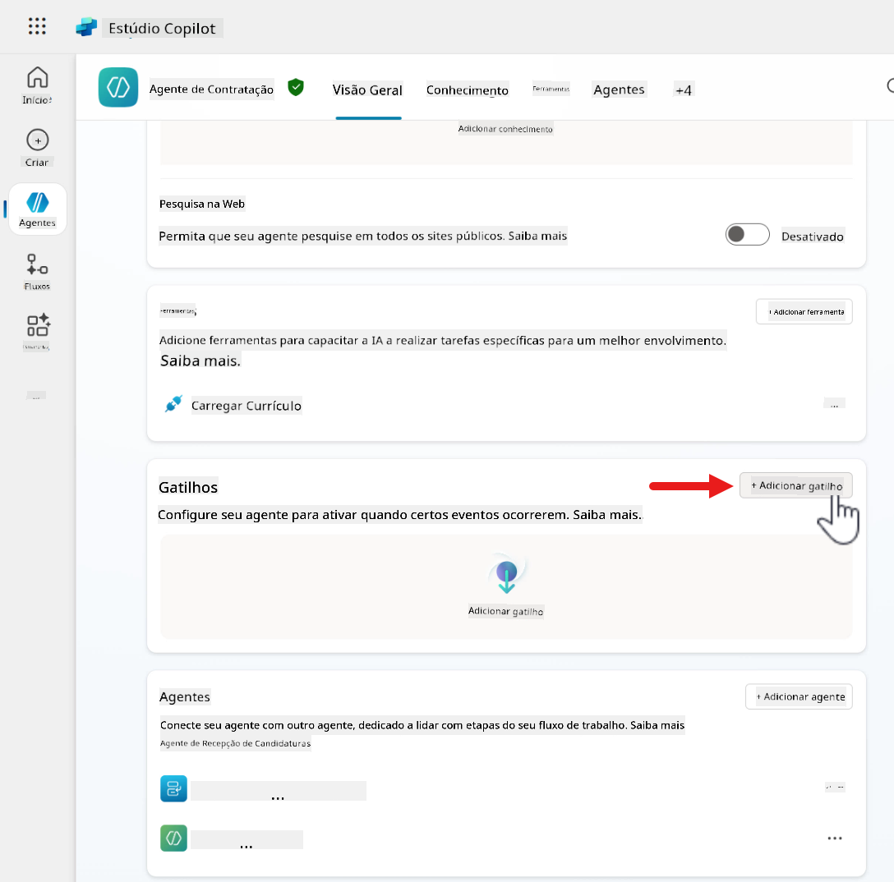

1. Aparecerá uma lista de gatilhos. Seleciona **Quando um novo e-mail chegar (V3)** e clica em **Seguinte**.

       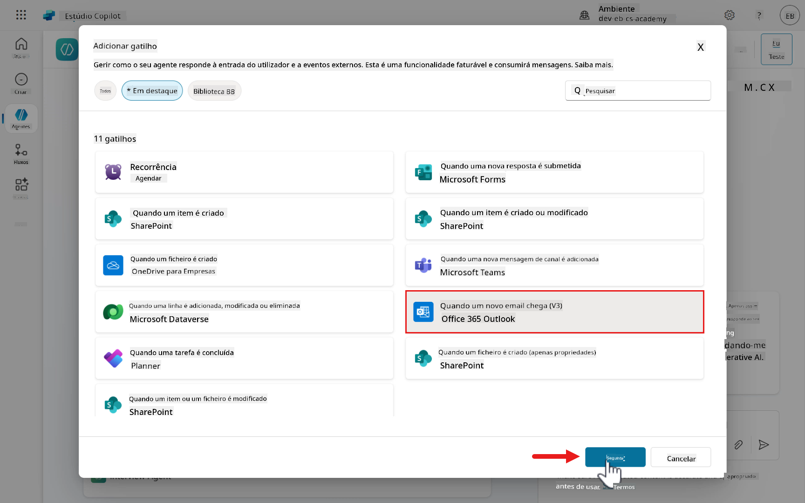

1. Agora veremos o **Nome do Gatilho** e as referências de conexão **Iniciar sessão** para os aplicativos listados.

       Renomeia o nome do gatilho para o seguinte,
    
       ```text
       Quando um novo e-mail chegar de um candidato
       ```

       Certifica-te de que vês um visto verde ao lado de cada uma das referências de conexão dos aplicativos listados. Se não vires um visto verde, inicia sessão através dos três pontos (...) e seleciona **+ Nova referência de conexão** para criar uma nova referência de conexão.

       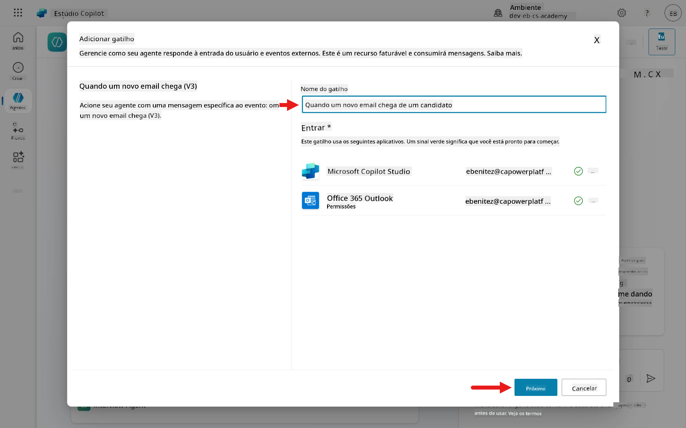

1. O último passo é definir as propriedades de entrada do gatilho. Atualiza as seguintes propriedades para os valores abaixo:

     | Propriedade | Como configurar | Detalhes |
     |-------------|-----------------|----------|
     | **Incluir Anexos (Opcional)** | Dropdown | Sim |
     | **Filtro de Assunto (Opcional)** | Escrever/Inserir com teclado | Candidatura |
     | **Apenas com Anexos (Opcional)** | Dropdown | Sim |

       Seleciona **Criar gatilho**.

       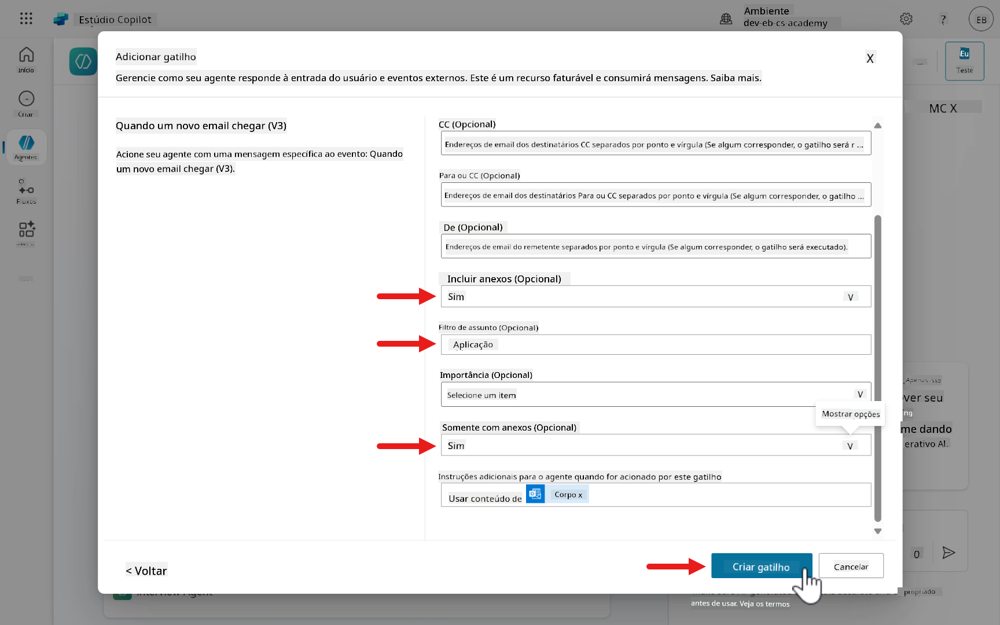

1. Uma mensagem de confirmação aparecerá indicando que o gatilho foi adicionado ao agente. Seleciona **Fechar** e o gatilho será listado na seção **Triggers**.
Agora vamos atualizar o gatilho do evento para adicionar mais capacidades de automação. Selecione os **três pontos (...)** no gatilho e escolha **Editar no Power Automate**.

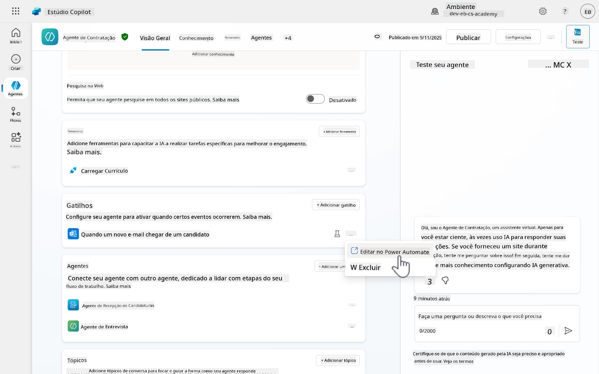

1. O gatilho será carregado como um fluxo no portal de criação do Power Automate. O que está a ver é o designer de fluxo no portal de criação do Power Automate. É aqui que podemos adicionar mais lógica e ações para maior automação. O gatilho aparecerá no topo, seguido por **Envia um prompt para o copiloto especificado para processamento** como a última ação no fluxo.

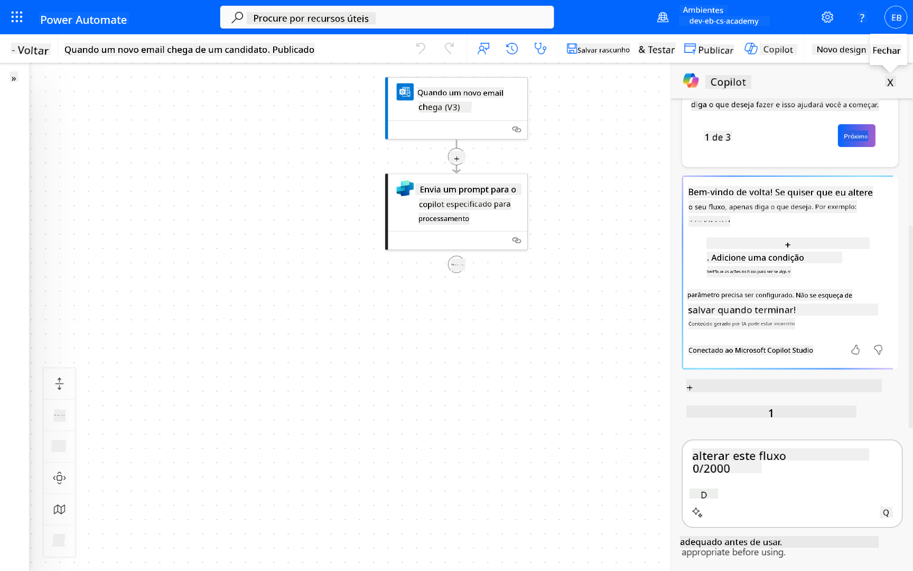

1. Por padrão, o gatilho **Quando um novo email chega** no Power Automate pode processar vários emails juntos se vários chegarem ao mesmo tempo, executando o fluxo apenas uma vez para o lote.

Para garantir que o fluxo seja executado separadamente para cada email, ative a configuração **Dividir em** nas configurações do gatilho e selecione `@triggerOutputs()?['body/value']` no campo de array do menu suspenso.

Com o **Dividir em** ativado e o campo de array configurado como `@triggerOutputs()?['body/value']`, o fluxo será executado individualmente para cada mensagem, mesmo que várias cheguem simultaneamente.

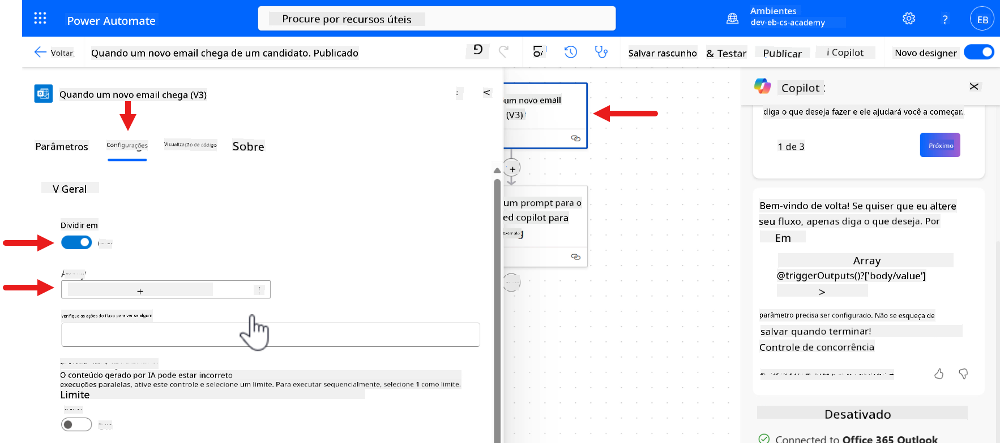

1. A seguir, vamos adicionar alguma lógica para verificar o tipo de arquivo do anexo. Queremos apenas carregar anexos de arquivos .PDF e não imagens (que podem vir de assinaturas de email). Selecione o ícone **+** abaixo do gatilho e escolha **Controle** na seção **Ferramentas integradas**.

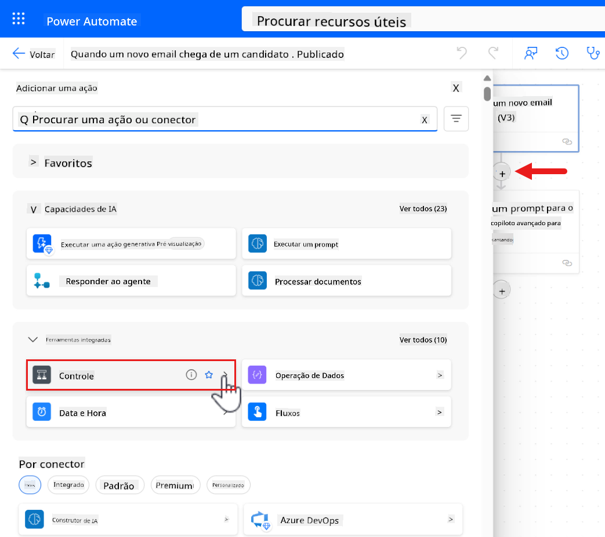

1. Selecione a ação **Condição**.

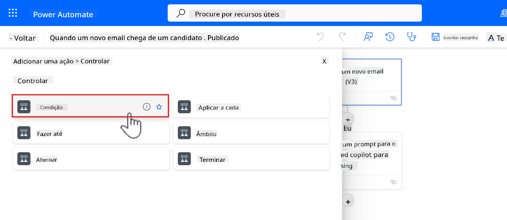

1. Agora configuramos a condição para verificar se o tipo de arquivo do anexo é .PDF. No campo **Escolher um valor**, selecione o **ícone de raio** ou o **ícone fx** à direita.

1. No campo **Pesquisar**, digite o seguinte:

```text
content type
```

1. Em seguida, selecione o parâmetro **Attachments Content-Type** do gatilho.

1. Depois, selecione **Adicionar** para adicionar o conteúdo dinâmico ao parâmetro **Id** da ação.

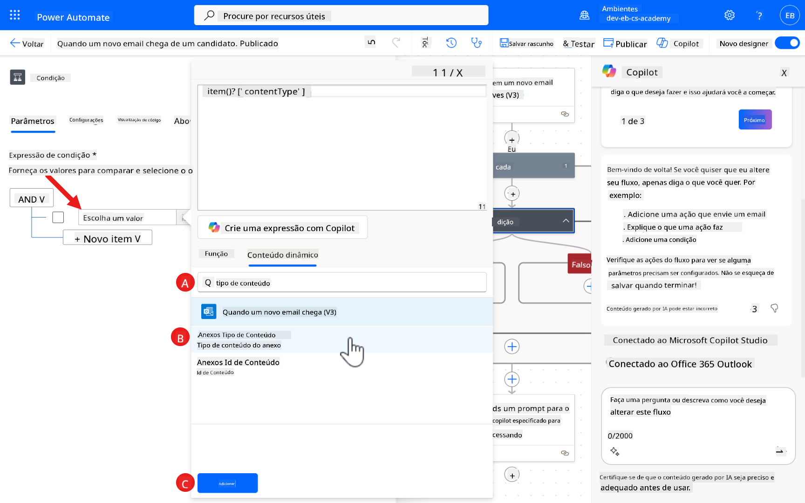

1. Vamos fazer uma pausa aqui por um momento. Provavelmente notou que a ação **Para cada** apareceu automaticamente.

Selecione a ação **Para cada**. Esta ação representa a repetição de cada anexo no email, já que o parâmetro **Attachments Content-Type** do gatilho está vinculado a cada anexo.

Por trás dos bastidores, é um array e é por isso que a ação **Para cada** foi adicionada automaticamente quando selecionámos o parâmetro **Attachments Content-Type** na ação **Condição**.

Para saber mais sobre isso, expanda o bloco de aprendizagem adicional abaixo.

??? info "Aprendizagem Adicional: Ação Para cada aparecendo automaticamente"

🤔 **Por que "Aplicar a cada" ou "Para cada" aparece automaticamente?**

Quando seleciona um parâmetro (conteúdo dinâmico) que representa uma lista ou array de itens - por exemplo, uma lista de anexos, emails ou linhas - o Power Automate reconhece que pode querer processar cada item individualmente.

Para ajudar com isso, o Power Automate adiciona automaticamente um loop **“Aplicar a cada”** (ou **Para cada**) em torno da sua ação. Isso garante que sua ação será executada uma vez para cada item na lista, em vez de tentar processar a lista inteira de uma vez (o que poderia causar erros).

🦋 **Exemplo**

- Se selecionar "Attachments" de uma ação anterior (que é um array) e tentar usá-lo em uma ação que espera um único arquivo, o Power Automate envolve sua ação em um loop **"Aplicar a cada"** (ou **Para cada**). 
- Dessa forma, sua ação será executada para **cada anexo** - um de cada vez.

💡 **Pontos-chave**

- **Automático:** O loop aparece automaticamente para ajudar a processar cada item em uma coleção.
- **Previne erros:** Sem o loop, sua ação pode falhar porque não consegue lidar com vários itens de uma vez.
- **Indicação visual:** É uma forma visual de mostrar que seu fluxo repetirá a ação para cada item na lista.

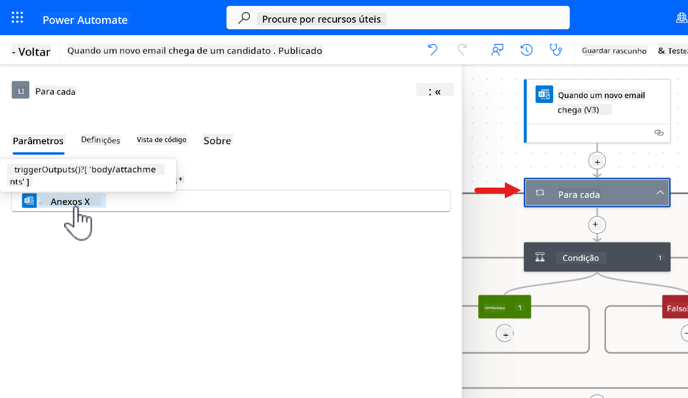

1. Em seguida, no outro campo **Escolher um valor**, digite o seguinte:

```text
application/pdf
```

Isso garantirá que, para cada anexo de arquivo, será verificado se o formato da extensão do arquivo é .PDF.

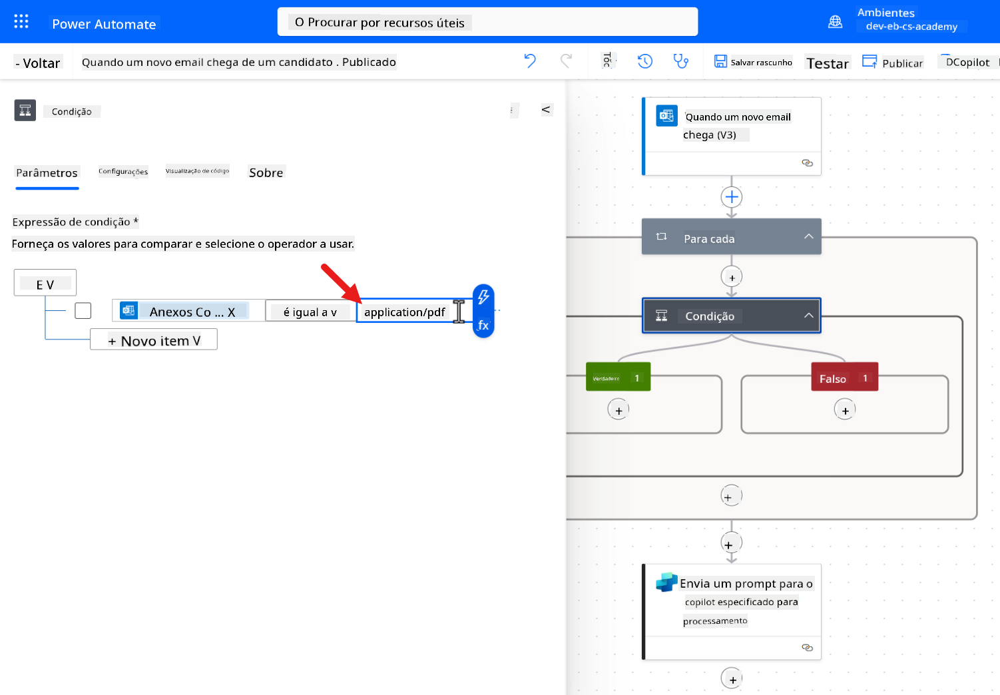

1. Agora vamos configurar o caminho **Verdadeiro** para extrair o arquivo do email e carregá-lo na tabela **Currículos** do Dataverse.

Adicione uma nova ação abaixo no caminho **Verdadeiro** e procure por `html to text`. Selecione a ação **Html para texto**.

Para saber mais sobre a ação **Html para texto**, expanda o bloco de aprendizagem adicional abaixo.

??? info "Aprendizagem Adicional: Ação Html para texto"

🤔 **O que é a ação "HTML para texto"?**

A ação **HTML para texto** no Power Automate é usada para converter conteúdo formatado em HTML em texto simples. Isso é especialmente útil quando recebe dados (como emails, conteúdo da web ou respostas de API) que contêm tags HTML e deseja extrair apenas o texto legível, sem qualquer formatação ou código.

⚙️ **Como funciona?**

- **Entrada:** Fornece uma string de conteúdo HTML (por exemplo, o corpo de um email).
- **Saída:** A ação remove todas as tags HTML e retorna apenas o texto simples.

👍🏻 **Quando deve usar?**

- Quando quiser extrair texto legível de emails, páginas da web ou respostas de API que contenham HTML.
- Antes de enviar conteúdo para sistemas que não suportam formatação HTML (como SMS, mensagens do Teams ou bases de dados).
- Para limpar dados para processamento ou análise posterior.

🔭 **Onde encontrar?**

- No Power Automate para fluxos de Agente, procure pela ação chamada `HTML para texto`. Está sob o conector **Operações de Dados**.

💡 **Pontos-chave**

- Remove todas as tags HTML e deixa apenas o texto.
- Não interpreta ou executa scripts/estilos - apenas remove as tags.
- Útil para limpeza de dados e preparação de conteúdo para saídas em texto simples.

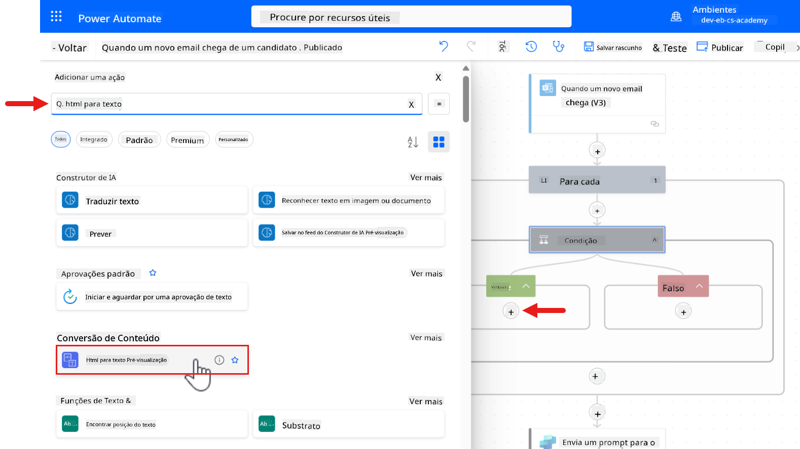

1. Em seguida, precisamos criar uma nova referência de conexão para a ação **Html para texto** selecionando **Adicionar novo**.

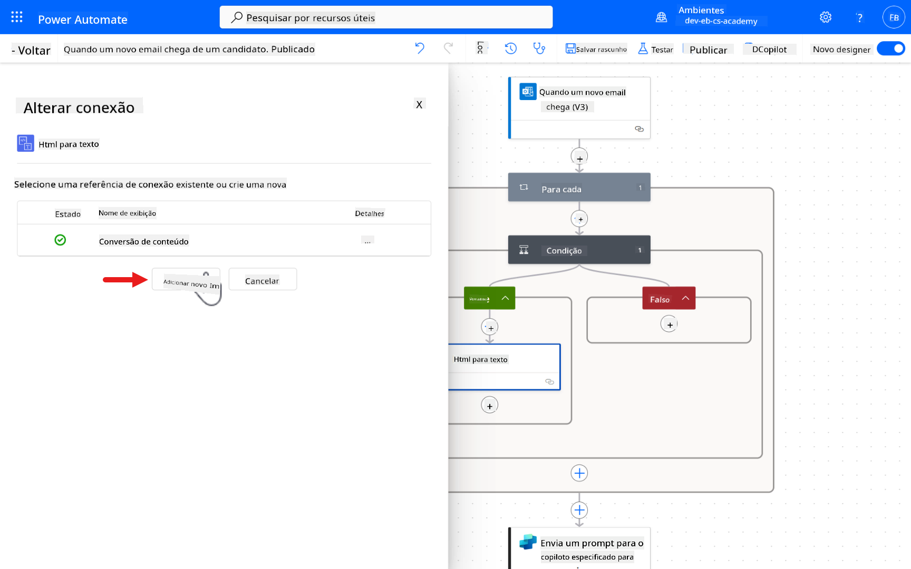

1. A ação agora pode ser configurada. Vamos adicionar o parâmetro **Body** do gatilho. No campo **Conteúdo**, selecione o **ícone de raio** ou **ícone fx** à direita.

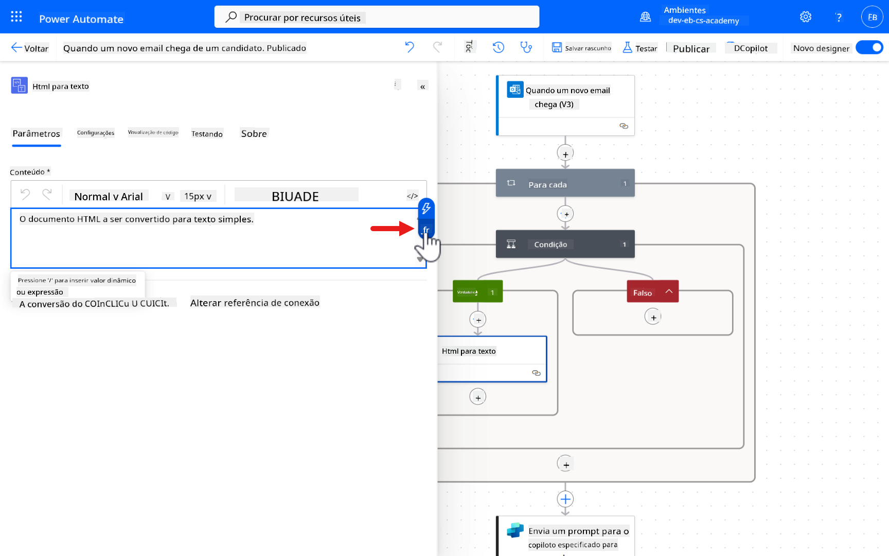

1. Na aba **Conteúdo Dinâmico**, procure por `body` e selecione o parâmetro **Body**, seguido de selecionar **Adicionar**.

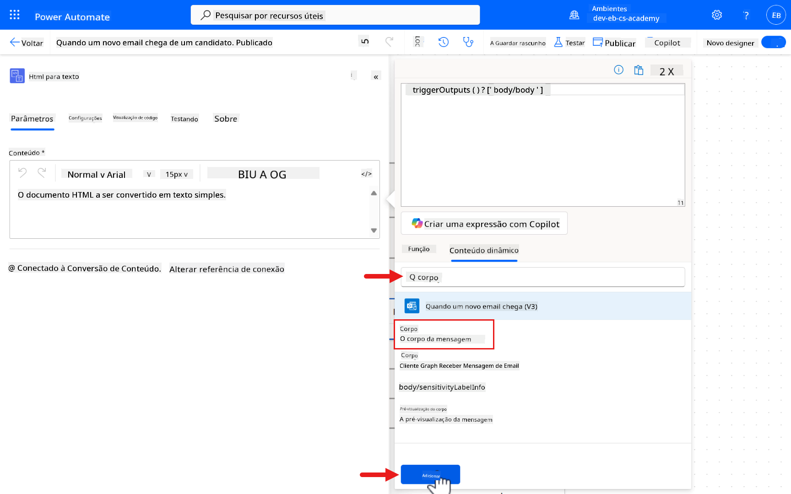

1. Concluímos a configuração desta ação, então vamos sair da ação selecionando os dois parênteses angulares («) apontando para a esquerda para recolher o painel.

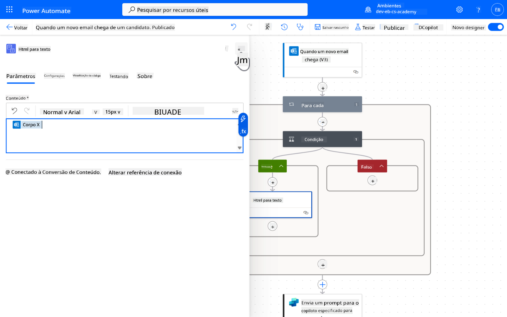

1. Vamos adicionar uma nova ação selecionando o **ícone +** abaixo da ação **Html para texto**, o que carregará o painel para adicionar ações. Selecione o conector **Microsoft Dataverse**.

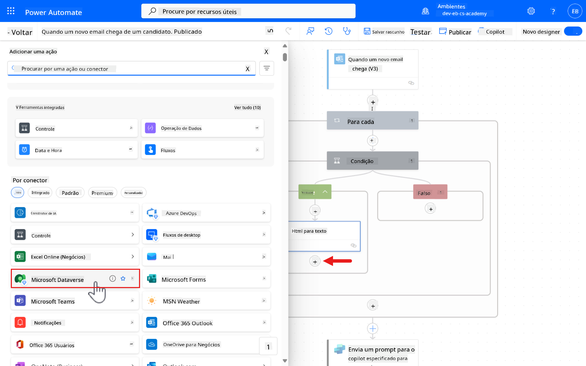

1. Selecione a ação **Adicionar uma nova linha**.

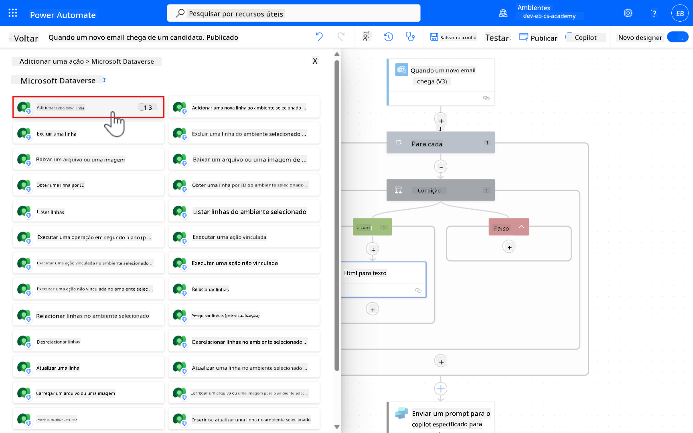

1. Renomeie a ação selecionando os **três pontos (...)**, copie e cole o seguinte como nome:

```text
Adicionar uma nova linha de Currículo
```

Para o parâmetro **Nome da tabela**, procure por `res` e selecione a tabela **Currículos**.


1. Selecione o campo **Título do Currículo** e clique no **ícone de raio** ou **ícone fx** à direita.

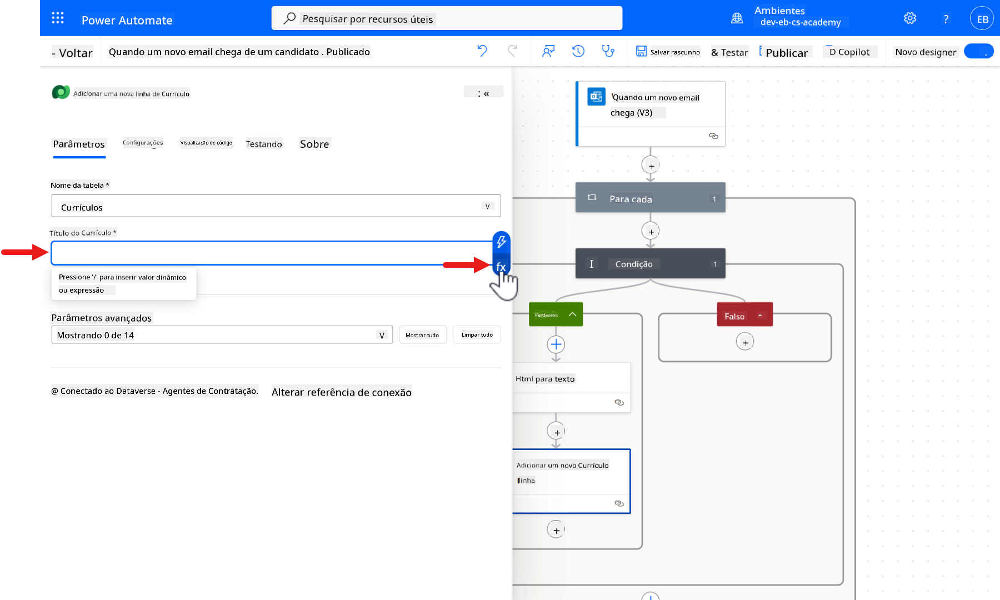

1. Na aba **Função**, insira a seguinte expressão que utiliza a função `item()`.

```text
item()?['name']
```

Para saber mais sobre a função `item()`, expanda o bloco de aprendizagem adicional abaixo.

??? info "Aprendizagem Adicional: Função `item()`"

🤔 **O que é a função `item()`?**

- Quando utiliza uma ação **Aplicar a cada**, o Power Automate percorre cada elemento em uma coleção (array).
- É mais frequentemente usada dentro de ações como **Aplicar a cada** (ou **Para cada**), **Selecionar** ou **Filtrar array**.

⚙️ **Como funciona?**

- `item()` é uma função que retorna o item atual sendo processado em um loop ou operação de array.
- Dentro desse loop, `item()` refere-se ao _elemento atual_ sendo processado.

📌 **Onde pode usar?**

- **Aplicar a cada:** para acessar propriedades do item atual.
- **Selecionar:** para transformar cada item em um array.
- **Filtrar array:** para referenciar o item atual sendo avaliado.

🦋 **Exemplo**

- Expressão dentro de um loop:
       -  `item()?['Email']`
- Isso obtém a propriedade `Email` do item atual.

💡 **Pontos-chave**

- `item()` é _sensível ao contexto_: sempre se refere ao item atual no loop ou operação de array em que está.
- Se aninhar loops, pode usar `items('NomeDoLoop')` para se referir a itens em um loop específico.

Selecione **Adicionar** para adicionar a expressão ao parâmetro **Título do Currículo**.

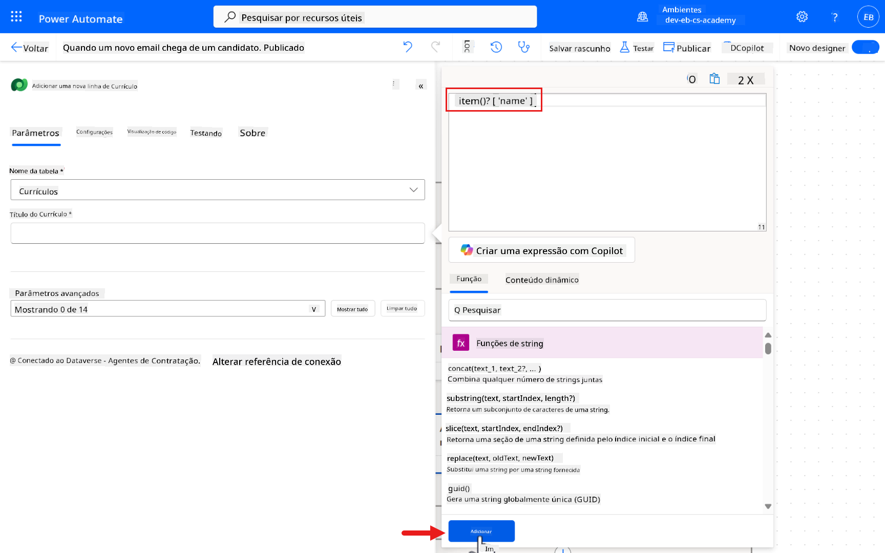

1. Ainda precisamos configurar vários outros parâmetros. Selecione **Mostrar tudo** e, no campo **Carta de Apresentação**, clique no **ícone de raio** ou **ícone fx** à direita.

Na aba **Função**, insira a seguinte expressão que utiliza a mesma expressão da [missão anterior](../02-multi-agent/README.md).

```text
if(greater(length(body('Html_to_text')), 2000), substring(body('Html_to_text'), 0, 2000), body('Html_to_text'))
```

Essa expressão verifica se o _texto_ da ação **Html para texto** tem mais de 2000 caracteres e, se for o caso, retorna apenas os primeiros 2000 caracteres; caso contrário, retorna o texto completo.

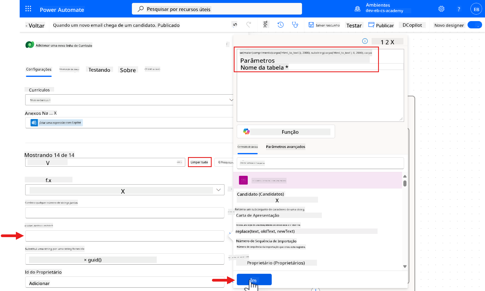

1. A expressão agora será adicionada ao campo **Carta de Apresentação**.

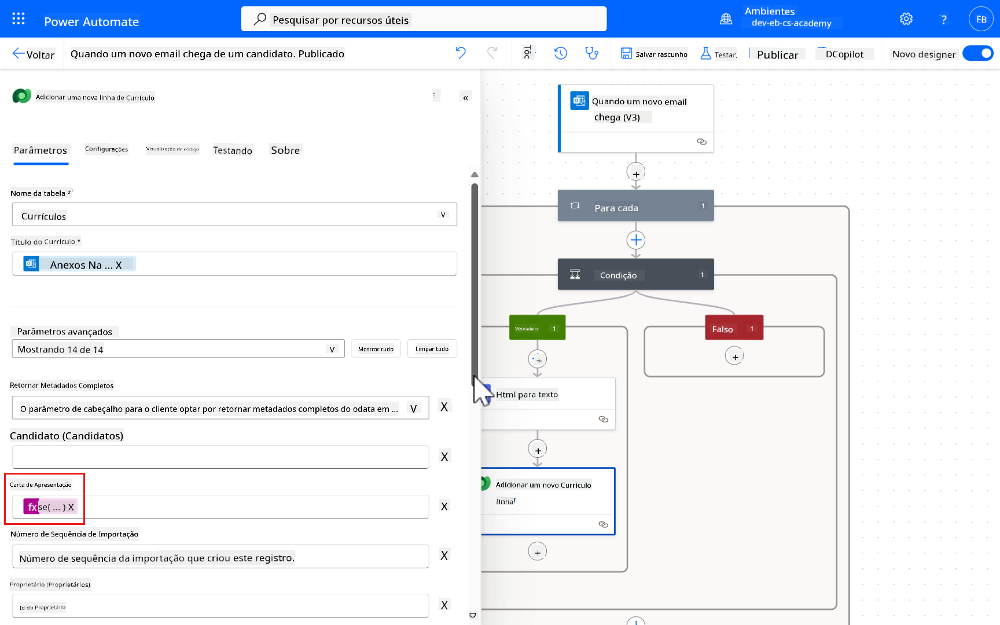

1. Para o campo **Endereço de Email de Origem**, procure por `from` e selecione o parâmetro **De** do gatilho, pois este contém o valor do endereço de email.

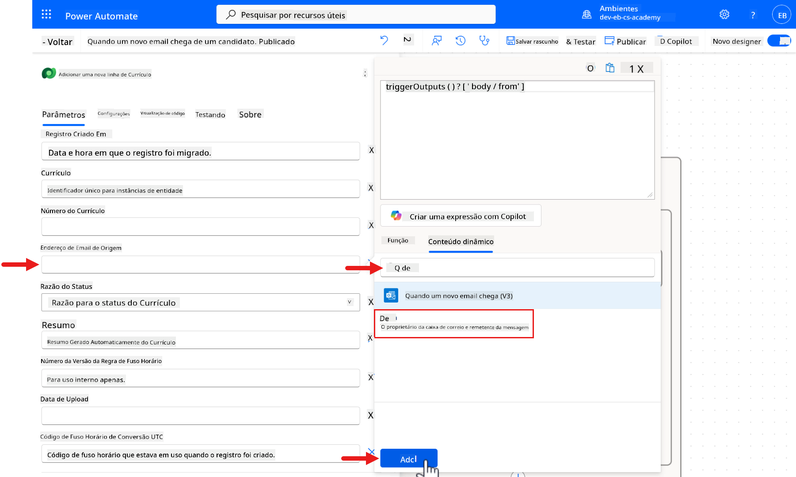

1. Para o campo **Data de Upload**, clique no **ícone de raio** ou **ícone fx** à direita. Na aba **Função**, insira a seguinte expressão que utiliza a função `utcNow()`.

```text
utcNow()
```

Para saber mais sobre a função `utcNow`, expanda o bloco de aprendizagem adicional abaixo.

??? info "Aprendizagem Adicional: Função `utcNow`"

🤔 **O que é a função `utcNow()`?**

- A função utcnow() no Power Automate retorna a data e hora atual no Tempo Universal Coordenado (UTC) em um formato ISO 8601, como: `2025-09-23T04:32:14Z`

🦋 **Exemplo**

- Expressão:
       -  `concat('Relatório gerado em ', utcnow())`
- Resultado:
       - Relatório gerado em `2025-09-23T04:32:14Z`

💡 **Pontos-chave**
- **Sem argumentos (parâmetros de entrada) necessários:** fornece sempre o carimbo de data/hora atual em UTC.
   - **Casos de uso**
       - Adicionar carimbos de data/hora a registos ou nomes de ficheiros
       - Comparar a hora atual com outras datas
       - Agendar ou definir condições baseadas no tempo

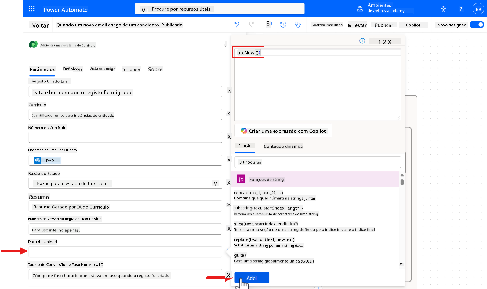

1. Concluímos agora a configuração da ação **Adicionar uma nova linha de Currículo**, então vamos sair do painel ao colapsá-lo.

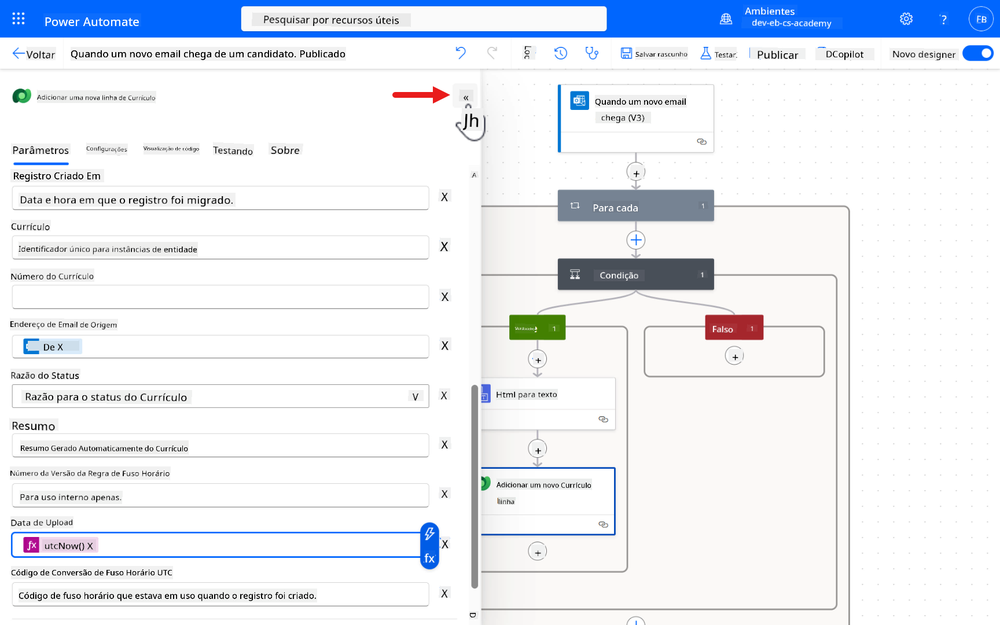

1. Vamos adicionar uma nova ação selecionando o **ícone +** abaixo da ação **Adicionar uma nova linha de Currículo**, o que carregará o painel para adicionar ações. Selecione novamente o conector **Microsoft Dataverse**.

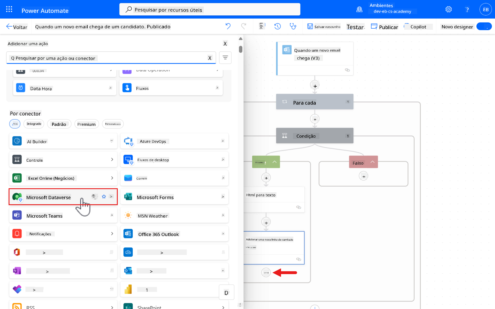

1. Selecione a ação **Carregar um ficheiro ou uma imagem**.

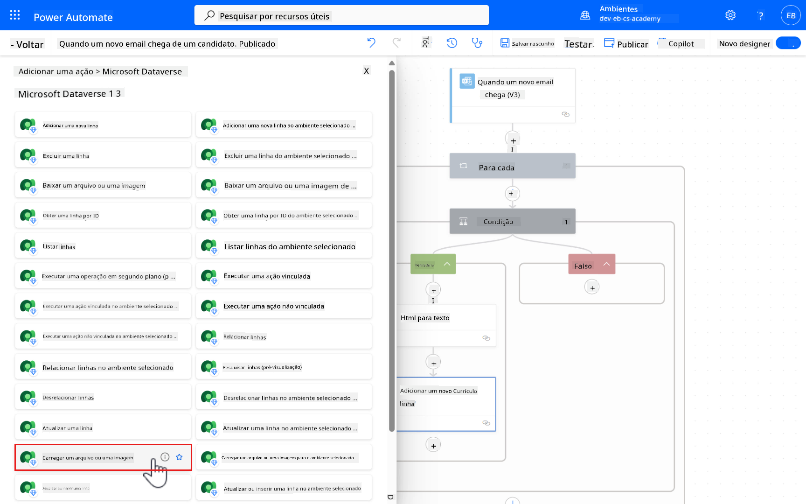

1. Renomeie a ação selecionando os **três pontos (...)**, copie e cole o seguinte como nome:

```text
Carregar Ficheiro de Currículo
```

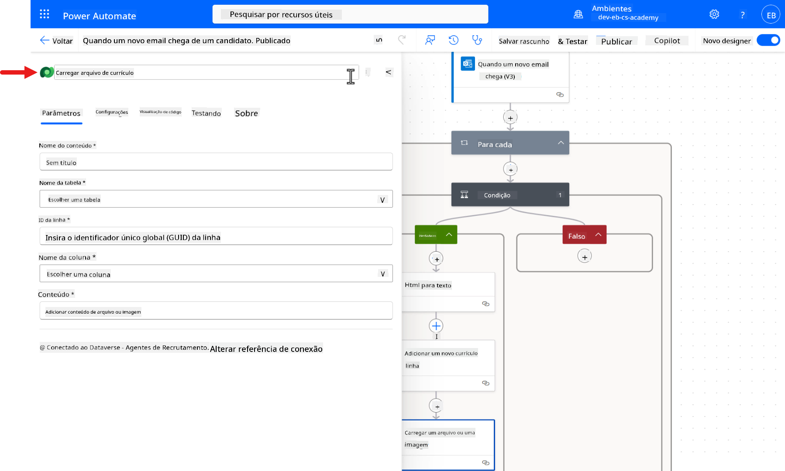

1. Em seguida, selecione o campo **Nome do conteúdo** e clique no **ícone de raio** ou **ícone fx** à direita.

No **separador de Função**, insira a seguinte expressão que utiliza a função `item ()`. Isto obtém a propriedade `name` do item atual (o ficheiro anexado).

```text
item()?['name']
```

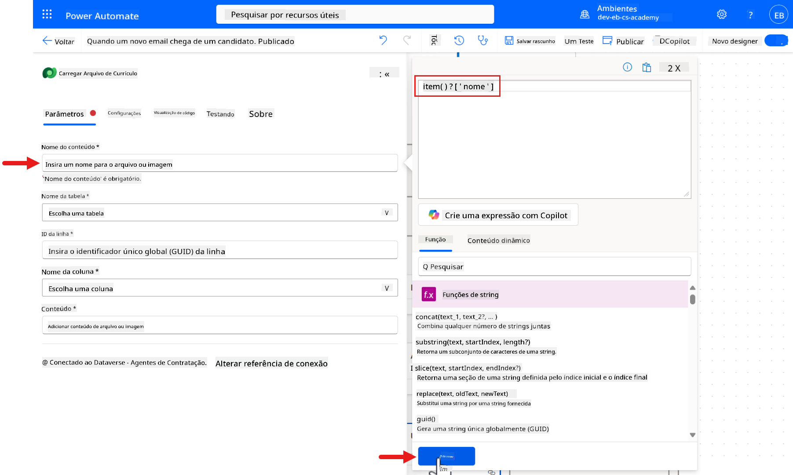

1. Para o parâmetro **Nome da tabela**, procure por `res` e selecione a tabela **Currículos**.

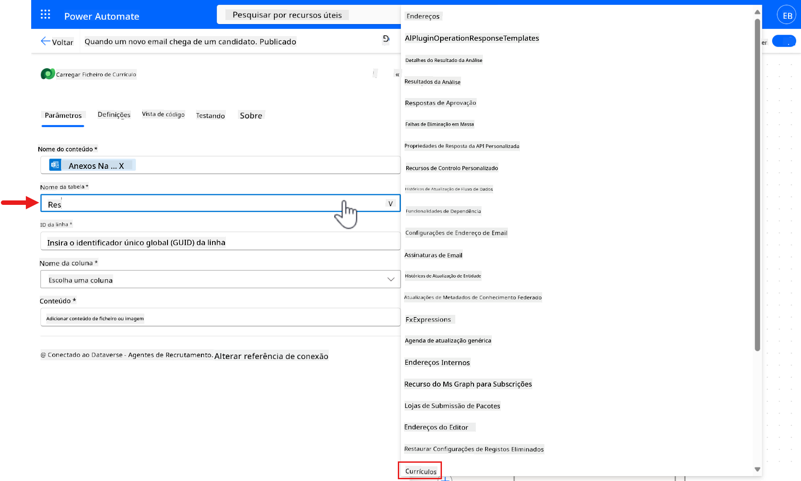

1. Em seguida, selecione o campo **ID da linha** e clique no **ícone de raio** ou **ícone fx** à direita.

Procure por `ID` e selecione o parâmetro **Currículo** da ação _Adicionar uma nova linha_ do Dataverse, pois este contém o valor do ID da linha para carregar o ficheiro PDF.

Selecione **Adicionar**.


1. Selecione o campo **Nome da coluna** e escolha a opção **Currículo PDF**.

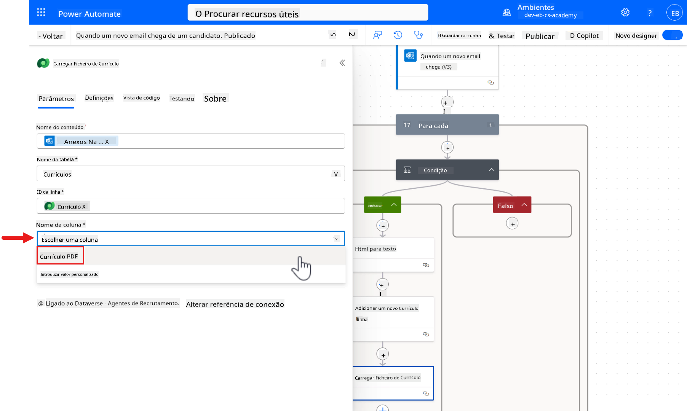

1. Selecione o campo **Conteúdo** e clique no **ícone de raio** ou **ícone fx** à direita.

No **separador de Função**, insira a seguinte expressão que utiliza a função `item ()`. Isto obtém a propriedade `contentBytes` do item atual (o ficheiro anexado). `contentBytes` refere-se aos dados binários brutos de um ficheiro ou anexo, codificados como uma string Base64.

```text
item()?['contentBytes']
```

1. Concluímos a configuração desta ação, então vamos sair da ação selecionando os dois parênteses angulares («) apontando para a esquerda para colapsar o painel.

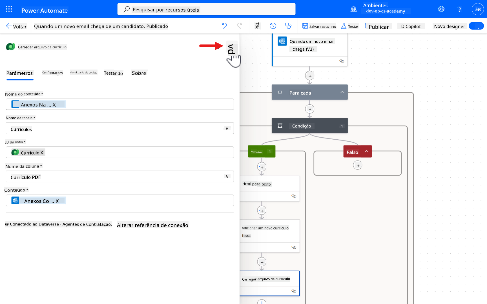

1. Em seguida, selecione a ação **Enviar um prompt ao copiloto especificado para processamento**, depois arraste e solte esta ação abaixo da ação **Carregar Ficheiro de Currículo** no caminho _Verdadeiro_ da condição.

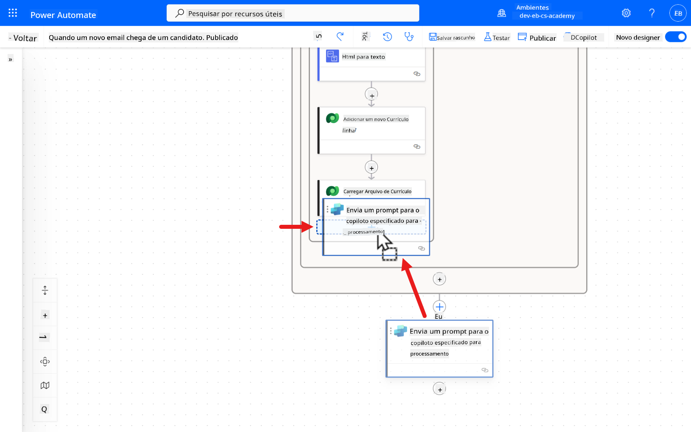

1. Selecione a ação **Enviar um prompt ao copiloto especificado para processamento** para configurá-la.

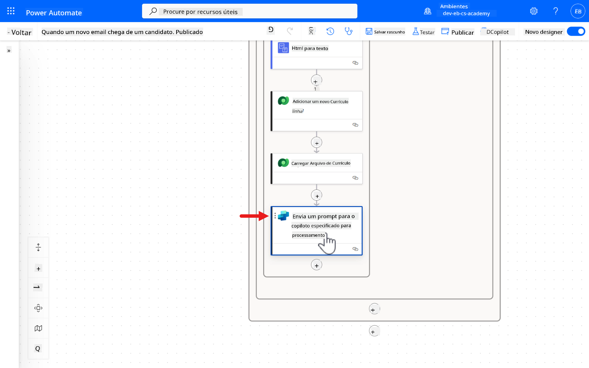

1. No campo **Corpo/mensagem**, selecione todo o conteúdo do campo e limpe/exclua-o.

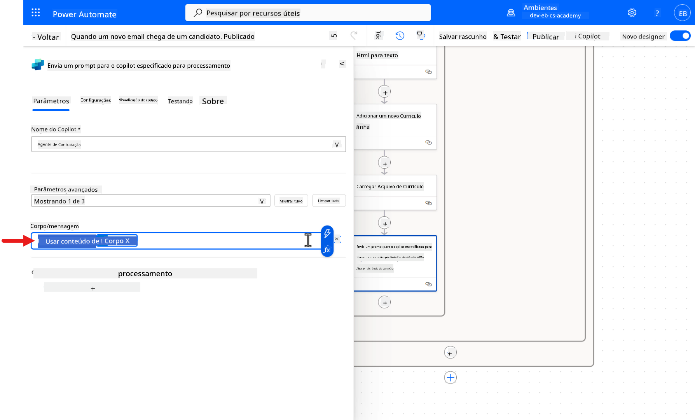

1. Copie e cole o seguinte texto no campo **Corpo/mensagem** e destaque o `RESUME ID PLACEHOLDER`.

```text
Enviar [ResumeId (text)] = "RESUME ID PLACEHOLDER" e [ResumeTitle (text_1)] = "RESUME TITLE PLACEHOLDER" e [ResumeNumber (text_2)]= "RESUME NUMBER PLACEHOLDER" para a Ferramenta "Notificar canal de candidatos do Teams" no agente filho "Agente de Receção de Candidaturas"
```

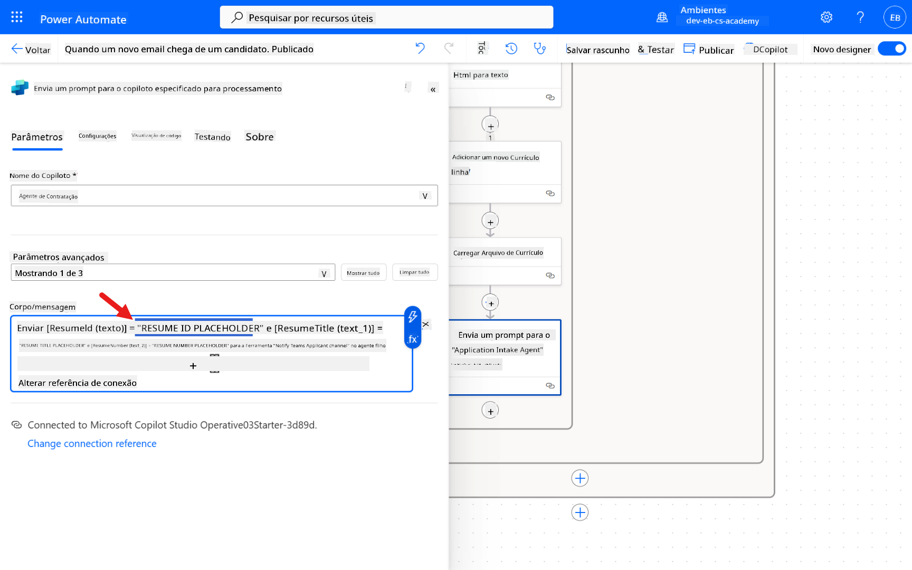

1. Selecione o **ícone de raio** ou **ícone fx** à direita.

Procure por `resume` e selecione o parâmetro **Currículo** da ação _Adicionar uma nova linha Dataverse_, pois este contém o valor `ID` da linha de Currículo criada.

Selecione **Adicionar**.

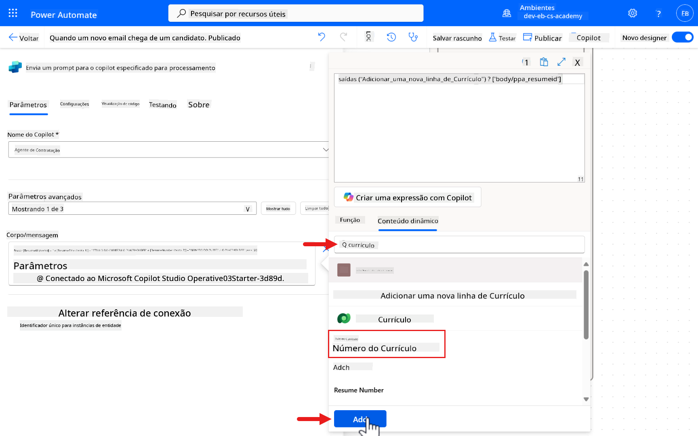

1. Destaque o `RESUME TITLE PLACEHOLDER`. Selecione o **ícone de raio** ou **ícone fx** à direita.

Procure por `title` e selecione o parâmetro **Título do Currículo** da ação _Adicionar uma nova linha Dataverse_, pois este contém o valor `título do currículo` da linha de Currículo criada.

Selecione **Adicionar**.

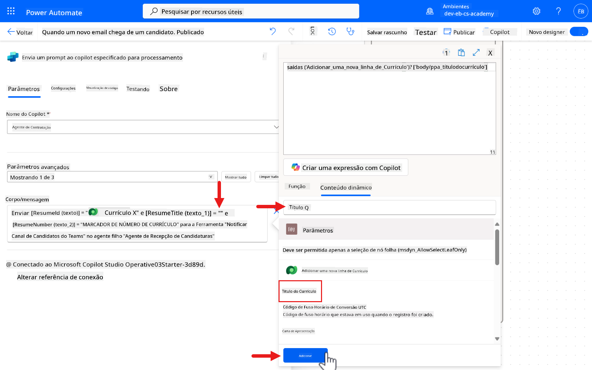

1. Destaque o `RESUME NUMBER PLACEHOLDER`. Selecione o **ícone de raio** ou **ícone fx** à direita.

Procure por `resume number` e selecione o parâmetro **Número do Currículo** da ação _Adicionar uma nova linha Dataverse_, pois este contém o valor `Número do Currículo` da linha de Currículo criada.

Selecione **Adicionar**.

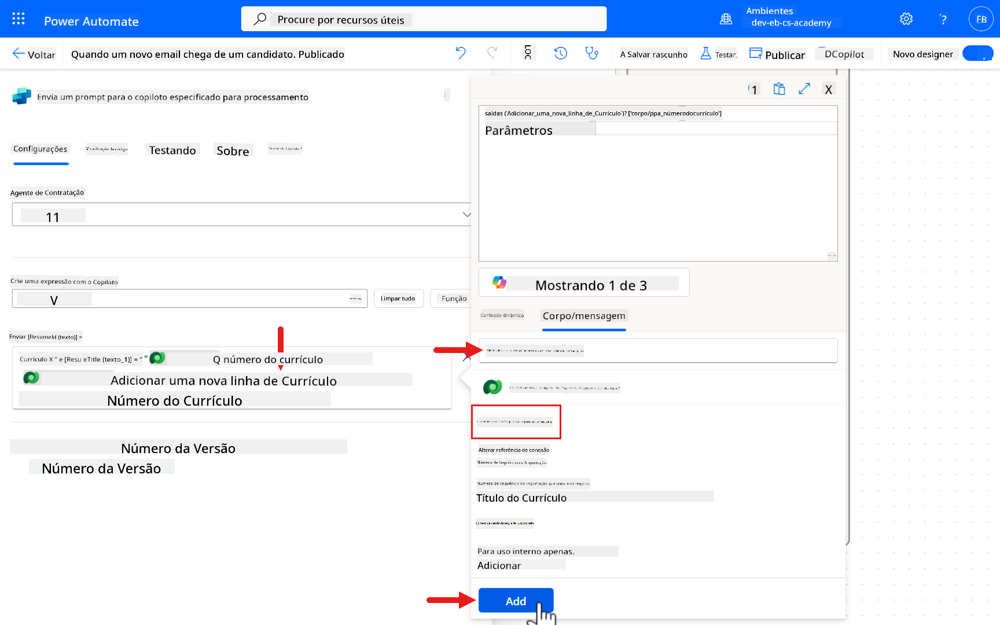

1. Concluímos a configuração desta ação e o fluxo do agente 🙌🏻 Estás a fazer um ótimo trabalho! Agora vamos guardar o fluxo de evento ao selecionar **Guardar rascunho**.

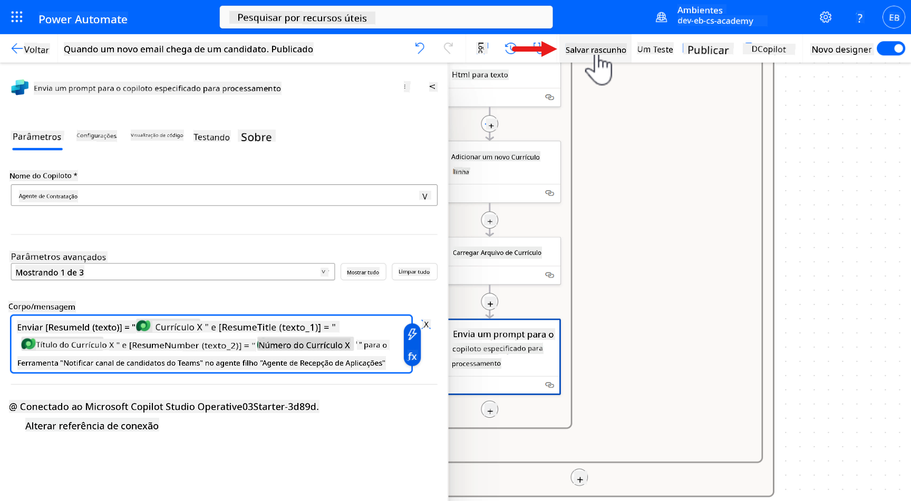

1. Agora precisamos editar os detalhes do fluxo do agente, selecione **Voltar**.

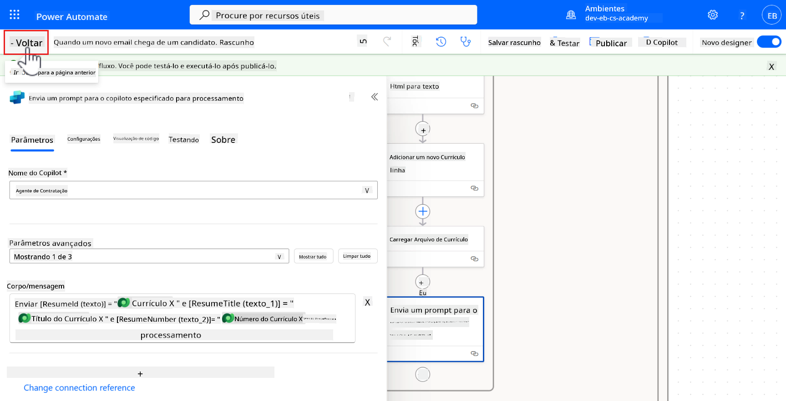

1. Selecione **Editar** na seção **Detalhes** e atualize o **Plano** para a opção **Copilot Studio**.

Selecione **Guardar**.

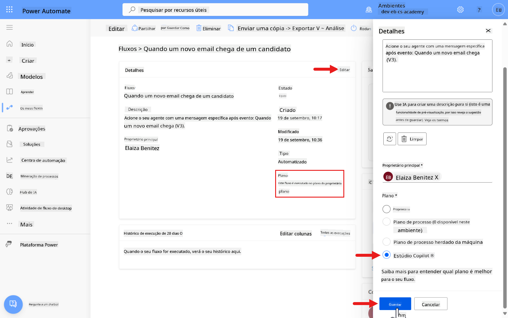

1. Aparecerá um modal para confirmar a mudança para o plano Copilot Studio. Selecione **Confirmar**.

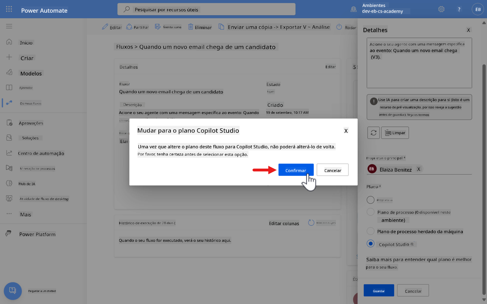

1. O plano agora está atualizado para **Copilot Studio**. Selecione **Editar**, pois precisamos publicar o fluxo de evento para o nosso agente.

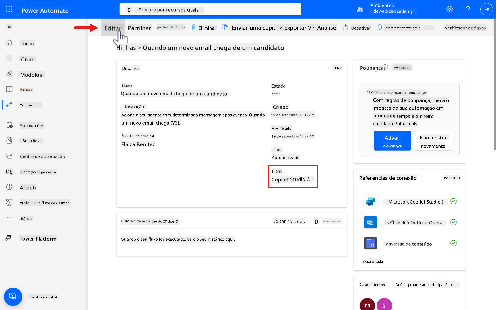

1. Selecione **Publicar**.

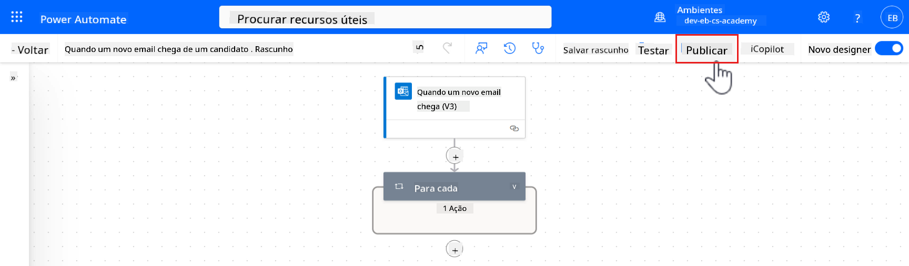

Hooray! O fluxo de evento agora está publicado 😃

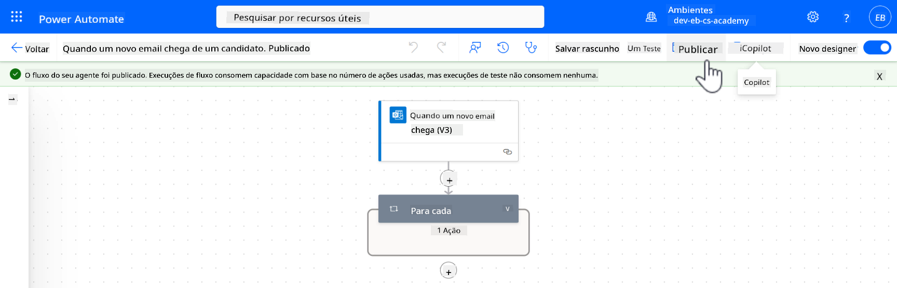

Vamos prosseguir para criar um novo fluxo de agente que será invocado pelo agente filho **Agente de Receção de Candidaturas**.

### Laboratório 3.2 - Notificar um canal do Teams usando um cartão adaptável

Agora vamos criar um novo fluxo de agente para o agente filho **Agente de Receção de Candidaturas**, que utiliza os valores passados pelo evento de disparo, para publicar um cartão adaptável num canal do Teams. Este cartão adaptável irá alertar a equipa de recrutamento de RH sobre o PDF que foi carregado automaticamente para que possam revê-lo.

Vamos começar!

1. No **Agente de Recrutamento**, selecione o separador **Agentes** e escolha o **Agente de Receção de Candidaturas**.

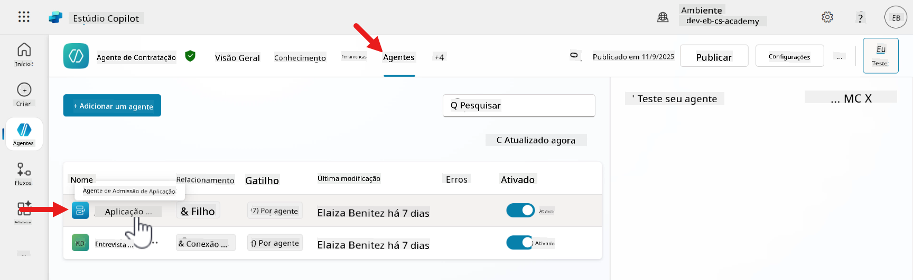

1. Desça até **Ferramentas** e selecione **+ Adicionar**.

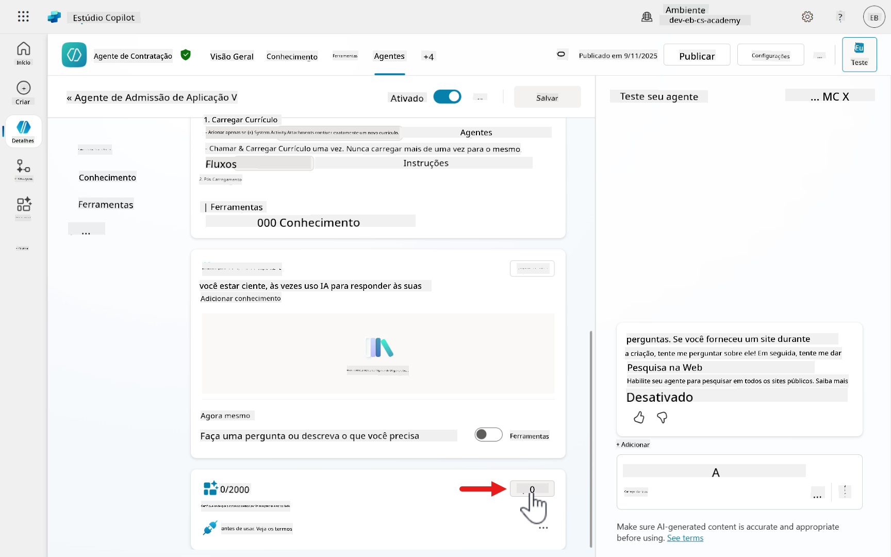

1. Aparecerá o modal **Adicionar ferramenta**. Selecione **+ Nova ferramenta**.

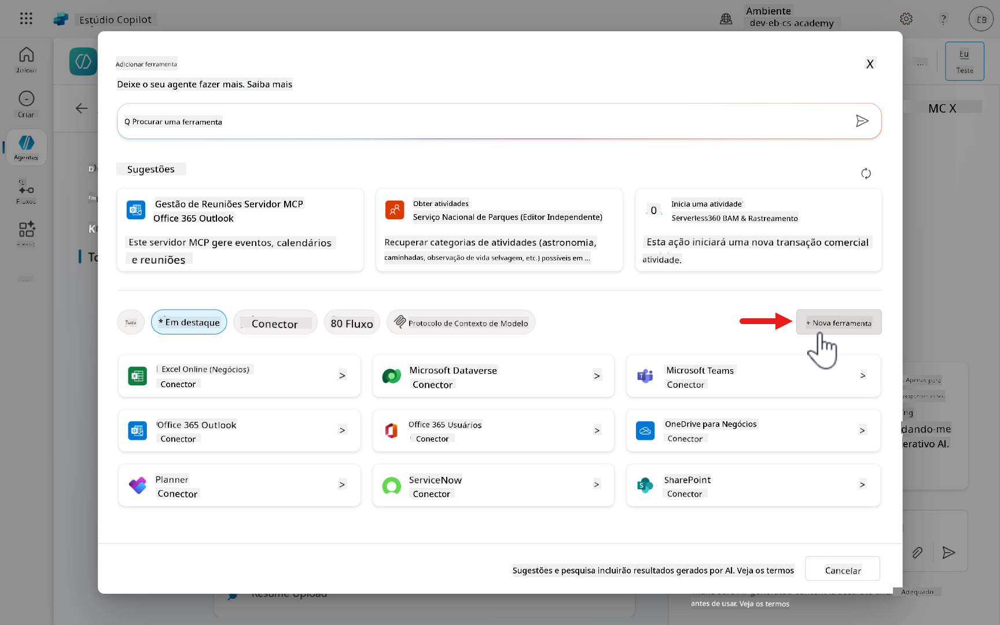

1. Selecione **Fluxo de agente**.


1. O **designer de fluxo de agente** será carregado a seguir. No disparador **Quando um agente chama o fluxo**, selecione **+ Adicionar uma entrada**.


1. Selecione **Texto** como o tipo de entrada do utilizador.


1. No campo de texto de entrada, copie e cole o seguinte como nome do parâmetro de entrada.

```text
ResumeId
```


1. Repita os mesmos passos para adicionar uma segunda entrada de texto. Copie e cole o seguinte como nome do parâmetro de entrada.

```text
ResumeTitle
```


1. Repita os mesmos passos para adicionar uma terceira entrada de texto. Copie e cole o seguinte como nome do parâmetro de entrada.

```text
ResumeNumber
```


1. Lembras-te de como em [Recrutar](../../recruit/08-add-adaptive-card/README.md#81-create-a-new-topic-with-an-adaptive-card-for-user-to-submit-their-request) adicionámos um cartão adaptável dentro de um Tópico para o nosso agente? Desta vez, vamos adicionar um cartão adaptável num fluxo de agente. Agora vamos adicionar outra ação ao nosso fluxo de agente que publicará um cartão adaptável num canal do Teams.

Selecione o **ícone +** abaixo do disparador.


1. Selecione a ação **Publicar cartão num chat ou canal**.


1. É necessário criar uma referência de conexão ao Microsoft Teams com a conta de utilizador com que está autenticado. Selecione **Iniciar sessão**.


1. Selecione a sua conta de utilizador e depois clique em **Permitir acesso**.


1. Para os seguintes parâmetros de entrada,

| Parâmetro | Como configurar | Detalhes |
|----------|------------------|---------|
| **Publicar como** | Dropdown | Selecione a opção `Bot de Fluxo` |
| **Publicar em** | Dropdown | Selecione a opção `Canal` |
| **Equipa** | Dropdown | Selecione uma equipa disponível no seu ambiente à qual tenha acesso para o propósito de completar este exercício de laboratório |
| **Canal** | Dropdown | Selecione um canal disponível no seu ambiente ao qual tenha acesso para o propósito de completar este exercício de laboratório |


1. Em seguida, vamos configurar o campo **Cartão Adaptável**. Selecione o campo **Cartão Adaptável**.


1. Abra o [ficheiro JSON Atualizado da Tabela de Currículos](../../../../../docs/operative-preview/03-automate-triggers/assets/3.2_ResumeTableUpdated.json), copie todo o seu conteúdo e cole-o no campo Cartão Adaptável.


1. Semelhante ao que fizemos em [Recrutar](../../recruit/08-add-adaptive-card/README.md#81-create-a-new-topic-with-an-adaptive-card-for-user-to-submit-their-request), vamos substituir os valores existentes no payload JSON por valores reais ou conteúdo dinâmico.

Primeiro, vamos atualizar o URL para a propriedade `url` dentro da propriedade `selectAction`. Este URL será substituído pelo URL da vista de sistema de Currículos na aplicação model-driven **Hiring Hub**. Isto permitirá que o Recrutador selecione a ação e seja direcionado para a vista de sistema de Currículos na aplicação model-driven.

Destaque o valor atual do URL e apague-o.


1. Na aplicação model-driven **Hiring Hub**, navegue até à vista de sistema **Currículos** usando o menu do lado esquerdo e copie o URL. Depois, volte ao fluxo do agente e cole o URL copiado na propriedade **url** dentro da propriedade `selectAction`.


1. Deve ver o seguinte onde destacado em amarelo estão os detalhes do seu ambiente da aplicação orientada por modelos **Hiring Hub**.

     | Parâmetro | Valor | Explicação |
     |----------|------------|---------|
     | **Organization URI** | GUID | URL da organização do ambiente Dataverse/Dynamics 365 |
     | **appid** | GUID | Para abrir uma aplicação orientada por modelos específica, utiliza-se o parâmetro de consulta appid ou appname. Neste caso, é utilizado o appid |
     | **viewid** | GUID | O parâmetro de consulta que é o id da vista |

       

1. Em seguida, vamos adicionar valores de conteúdo dinâmico para várias propriedades. Vamos começar com o texto que exibirá a referência do Número de Currículo da linha criada automaticamente pelo gatilho do evento.

      Selecione o ícone **painel** para carregar o painel de ações.

       

1. Desça até a linha onde vê a propriedade `text` para `RESUME NUMBER PLACEHOLDER`. Destaque o valor do espaço reservado e elimine-o.

       

1. Clique entre as aspas duplas e selecione o ícone **raio** ou o ícone **fx** à direita.

      No separador **Dynamic Content**, selecione o parâmetro **ResumeNumber** e clique em **Add**.

       

1. O parâmetro **ResumeNumber** será agora adicionado como conteúdo dinâmico à propriedade `text`.

       

1. Vamos repetir os mesmos passos para o `RESUME NAME PLACEHOLDER`. Desça até a linha onde vê a propriedade `text` para `RESUME NAME PLACEHOLDER`. Destaque o valor do espaço reservado e elimine-o.

       

1. Clique entre as aspas duplas e selecione o ícone **raio** ou o ícone **fx** à direita.

      No separador **Dynamic Content**, selecione o parâmetro **ResumeTitle** e clique em **Add**.

       

1. O parâmetro **ResumeTitle** será agora adicionado como conteúdo dinâmico à propriedade `text`.

       

1. Vamos repetir os mesmos passos para o valor **Due Date**, que representa quando um recrutador deve rever o currículo. Desça até a linha onde vê a propriedade `text` para `May 21, 2023`.

       

1. Elimine este valor de espaço reservado para a data e clique entre as aspas duplas.

       

1. Selecione o ícone **raio** ou o ícone **fx** à direita e, no separador **Function**, insira a seguinte expressão e clique em **Add**.

       ```text
       addDays(utcNow(), 3, 'MMM dd, yyyy')
       ```

      Esta expressão utiliza duas funções.

     | Função | Explicação |
     |----------|------------|
     | **addDays** | Adiciona um número especificado de dias a uma data e retorna a data resultante em formato de string |
     | **utcNow** | Retorna a data e hora atual no formato de Tempo Universal Coordenado (UTC) como uma string. |

      Para o valor utcNow, estamos a formatar a data para ser mês e dia, seguido do ano.

       

      A expressão será agora adicionada à propriedade `text`.

       

1. Por fim, vamos atualizar o URL para a propriedade `url` dentro da propriedade `actions` array no final do payload JSON. Este URL de espaço reservado atual será substituído pelo URL da linha do Currículo na aplicação orientada por modelos **Hiring Hub**. Isto permitirá ao Recrutador selecionar a ação `Action.OpenURL` do cartão adaptativo e ser direcionado ao Currículo na aplicação orientada por modelos.

       

1. Na aplicação orientada por modelos **Hiring Hub**, abra uma linha na vista de sistema **Resumes** usando o menu do lado esquerdo. A linha do currículo será carregada como um formulário na aplicação orientada por modelos.

      Copie o URL para a linha do Currículo.

    ??? info "Como navegar de volta para a aplicação orientada por modelos **Hiring Hub** caso tenha saído/fechado"

        1. Aceda a [https://make.powerapps.com](https://make.powerapps.com) e certifique-se de que está no ambiente de desenvolvimento que está a usar para estes exercícios de laboratório, caso contrário, altere para ele.
        
        

        1. Selecione **Apps** no painel do menu do lado esquerdo e, para a aplicação orientada por modelos **Hiring Hub**, selecione o ícone **Play** para carregá-la no seu navegador.
        
        

       

1. Depois, navegue de volta para o fluxo do agente, destaque o valor atual do URL de espaço reservado e elimine-o.

       

1. Depois, cole o URL copiado na propriedade **url** dentro da propriedade `url`.

       

1. Deve ver o seguinte. Elimine o valor id `GUID` no final. Vamos substituir este conteúdo dinâmico - o parâmetro **ResumeId**.

       

1. Selecione o ícone **raio** ou o ícone **fx** à direita.

      No separador **Dynamic Content**, selecione o parâmetro **ResumeId** e clique em **Add**.

       

1. O **ResumeId** será adicionado como conteúdo dinâmico. O seguinte destacado em amarelo são os detalhes do seu ambiente da aplicação orientada por modelos **Hiring Hub**.

     | Parâmetro | Valor | Explicação |
     |----------|------------|---------|
     | **Organization URI** | GUID | URL da organização do ambiente Dataverse/Dynamics 365 |
     | **appid** | GUID | Para abrir uma aplicação orientada por modelos específica, utiliza-se o parâmetro de consulta appid ou appname. Neste caso, é utilizado o appid |
     | **id** | GUID | O parâmetro de consulta que é o id da linha do Currículo |

       

1. Concluímos a configuração da ação **Post card in a chat or channel** 👏🏻 Saia do painel de configuração da ação selecionando o ícone **x**.

       

1. Finalmente, vamos configurar a última ação, **Respond to the agent**, enviando um texto de volta ao agente para encerrar o processamento.

      Na ação **Respond to the agent**, selecione **+Add an output**.

       

1. Selecione **Text** como o tipo de saída.

       

1. Insira o seguinte como nome da saída.

       

1. Insira o seguinte como valor para a saída.

       ```text
       Finished
       ```

       

1. Concluímos agora a configuração do fluxo do agente. Selecione **Save draft** para guardar o rascunho do fluxo do agente. Uma mensagem de confirmação aparecerá após ser guardado.

       

1. Antes de publicar o fluxo do agente, precisamos atualizar os detalhes do fluxo do agente. Selecione o separador **Overview** e clique em **Edit**.

      No campo de nome do fluxo, insira o seguinte.

       ```text
       Notify Teams Applicant channel
       ```      

      Depois, selecione o ícone **Refresh** para atualizar a descrição do fluxo do agente usando IA.

      Em seguida, selecione **Save** para guardar os detalhes atualizados do fluxo do agente.

       

1. Navegue de volta para o separador **Designer** e selecione **Publish** para publicar o fluxo do agente. Uma mensagem de confirmação aparecerá após ser guardado.

       

1. O fluxo do agente agora precisa ser adicionado como uma ferramenta no **Application Intake Agent**. Navegue de volta para o **Hiring Agent** e selecione o separador **Agents**, depois selecione o **Application Intake Agent**.

       

1. Na secção **Details** do agente, vamos atualizar o campo **Description**. Copie o seguinte e cole no final do texto da descrição.

       ```text
       e também notificar o canal Teams Applicant
       ```

       

1. Em seguida, vamos adicionar o fluxo do agente como uma ferramenta. Desça e selecione **+ Add**.

       

1. Selecione o fluxo do agente criado anteriormente, **Notify Teams Applicant Channel**.

       

1. Em seguida, selecione **Add and configure**.

       

1. Na secção **Inputs** do fluxo do agente, os três inputs que configurámos anteriormente no fluxo do agente são visíveis. Por padrão, a configuração **Fill using** está definida como **Dynamically fill with AI**. Vamos manter esta configuração como está, pois o prompt do gatilho do evento (na última ação, **Sends a prompt to the specified copilot for processing** - isto são os passos 38-44 do **Lab 3.1 - Automate uploading resumes to Dataverse received by email**) conterá os valores dos parâmetros que a IA irá extrair.

       

1. Agora que a ferramenta foi adicionada ao **Application Intake Agent**, as instruções do agente precisam ser atualizadas. Selecione o ícone **seta para trás** para retornar à lista de agentes.

       

1. Selecione o **Application Intake Agent** no separador **Agents** do **Hiring Agent**.

       

1. No campo **Instructions**, insira uma nova linha após as instruções `2.Post-Upload`. Copie e cole as seguintes instruções.

       ```text
       Processo para Upload de Currículo via Email
       1. Quando receber uma mensagem, **Envie [ResumeId (text)] = "1680265f-5793-f011-b41b-7c1e525be9f7" e [ResumeTitle (text_1)] = "TAYLOR TESTPERSON (FICTITIOUS).pdf" e [ResumeNumber (text_2)]= "R01026" para a Ferramenta "Notify Teams Applicant channel"** no agente filho "Application Intake Agent", chame [AGENT FLOW PLACEHOLDER]
       ```

       

1. Destaque o texto `[AGENT FLOW PLACEHOLDER`.

       

1. Insira o caractere barra, `/`, e selecione a ferramenta **Notify Teams Applicant Channel**.

       
1. O fluxo do agente será agora invocado pelo **Application Intake Agent**, conforme as instruções, após a última ação (**Enviar um prompt para o copiloto especificado para processamento**) no gatilho de evento enviar o prompt que contém os valores dos parâmetros de volta para o agente.

      Selecione **Guardar** para salvar as instruções atualizadas para o **Application Intake Agent**.

       

1. As instruções serão agora atualizadas assim que o agente for guardado.

       

1. Agora precisamos **Publicar** o **Hiring Agent**. Selecione **Publicar** no canto superior direito e, na janela modal _Publicar este agente_ que aparece, selecione **Publicar**.

       

1. Após a publicação, aparecerá uma mensagem de confirmação indicando que o agente foi publicado.

       

Agora podemos testar o agente!

### Laboratório 3.3 - Testar o gatilho de evento

1. Para executar o gatilho de evento, é necessário enviar um email com um ficheiro PDF de currículo. No Outlook, componha uma nova mensagem de email.

     | Componente do Email | Detalhes |
     |----------|------------|
     | **Destinatário** | Utilize a conta de utilizador com a qual está autenticado como valor |
     | **Anexo de ficheiro** | Carregue o ficheiro [TAYLOR TESTPERSON (FICTITIOUS)](../../../../../docs/operative-preview/test-data/resumes/TAYLOR%20TESTPERSON%20(FICTITIOUS).pdf) |
     | **Corpo** | Copie e cole o texto abaixo como corpo do email  |

       ```text
       Prezado(a) Gestor(a) de Recrutamento,

       Escrevo para expressar meu interesse na posição de Engenheiro Sénior de Power Platform na sua organização. Com mais de nove anos de experiência na entrega de soluções seguras e escaláveis em plataformas de nuvem da Microsoft, estou confiante na minha capacidade de contribuir eficazmente para a sua equipa.

       Na minha função mais recente como Engenheiro Líder de Power Platform, desenvolvi um pipeline automatizado de triagem de currículos, reduzindo o trabalho manual e melhorando a capacidade de pesquisa. Entreguei aplicações de gestão de casos de RH, introduzi fluxos conscientes de soluções e implementei verificações de PR para melhorar os tempos de implementação. A minha experiência inclui Power Apps, Power Automate, Power Pages, Dataverse e uma gama de serviços Microsoft 365, bem como integração com APIs Graph/REST e Azure Functions.

       Anteriormente, desenvolvi aprovações no Teams com cartões adaptativos, reduzindo os tempos de aprovação para o mesmo dia, e criei frameworks robustos de tratamento de erros. O meu histórico também inclui a migração de fluxos de trabalho legados para o Power Automate e a construção de portais de autoatendimento adotados por centenas de colaboradores.

       Sou licenciado em Ciências da Computação e certificado como Desenvolvedor Power Platform (PL-400) e Arquiteto de Soluções (PL-600). Também sou apaixonado por mentoria e tenho trabalhado como voluntário em grupos locais de criadores.

       Por favor, encontre o meu CV anexado para sua consideração. Ficaria muito grato pela oportunidade de discutir como as minhas competências e experiência se alinham às suas necessidades.

       Agradeço pelo seu tempo e consideração.

       Atenciosamente,  
       Taylor Testperson
       ```

       **Envie** o email após compô-lo.

       

1. No portal do Power Automate Maker para o fluxo de gatilho de evento, selecione o ícone **Atualizar** para visualizar a execução do fluxo que foi bem-sucedida para o email enviado.

       

1. De volta ao Copilot Studio no **Hiring Agent**, selecione o separador **Atividade**.

       

1. O separador **Atividade** será carregado e exibirá todas as atividades do **Hiring Agent**. Haverá uma atividade com o nome **Automated** e status **Complete**. Esta atividade representa o gatilho de evento e o fluxo do agente que foi invocado.

       

1. Selecione a atividade e, no mapa de atividades, selecione o gatilho de evento. No painel à direita, observe como os parâmetros de entrada no prompt contêm os valores dos parâmetros `Resume Id`, `Resume Title` e `Resume Number` da linha do **Dataverse** que foi criada. Isso foi configurado anteriormente nos passos 18 - 27 do **Laboratório 3.1 - Automatizar o upload de currículos para o Dataverse recebidos por email**.

       

1. Navegue de volta para a aplicação model-driven **Hiring Hub** e, na vista de sistema de **Resumes**, selecione **Atualizar** para atualizar a vista. A nova linha criada para o currículo enviado por email será agora listada, pois foi criada através do gatilho de evento.

       

1. Volte ao Copilot Studio e selecione o fluxo do agente **Notify Teams Applicant Channel** dentro do **Application Intake Agent** no mapa de atividades. No painel à direita, observe como as entradas têm valores da linha do Dataverse. Isso foi enviado pelo prompt da última ação (**Enviar um prompt para o copiloto especificado para processamento**) no gatilho de evento que contém os valores dos parâmetros da nova linha criada no Dataverse. É assim que podemos passar valores de parâmetros de gatilhos de evento para fluxos de agentes.

       

1. Por fim, vamos dar uma olhada no cartão adaptativo publicado no canal do **Microsoft Teams**. No canal, veremos o cartão adaptativo que exibe as informações sobre a nova linha de currículo criada no Dataverse. Passe o cursor sobre o hyperlink no início do cartão adaptativo e observe como o URL é o URL da vista de sistema de Resumes que configurámos anteriormente no JSON (passos 15 - 19 do **Laboratório 3.2 - Notificar um canal do Teams usando um cartão adaptativo**) do payload do cartão adaptativo.

       

1. Selecione o hyperlink e será direcionado para a vista de sistema de Resumes na aplicação model-driven **Hiring Hub** no seu navegador.

       

1. Navegue de volta para o cartão adaptativo publicado no canal do Microsoft Teams. Desta vez, passe o cursor sobre **Ver Currículo**, que é a ação `Action.OpenURL` do cartão adaptativo. Observe como o URL é a linha de currículo que configurámos anteriormente no JSON (passos 30 - 36 do **Laboratório 3.2 - Notificar um canal do Teams usando um cartão adaptativo**) do payload do cartão adaptativo.

       

1. Selecione a ação e será direcionado para o formulário da linha de currículo na aplicação model-driven **Hiring Hub** no seu navegador.

       

## ✅ Missão Completa

Parabéns! 👏🏻 Excelente trabalho, Operativo.

✅ Gatilho de evento: criou um gatilho de evento que passa valores de parâmetros do Dataverse para um fluxo de agente.  
✅ Construiu um fluxo de agente: consome os valores de parâmetros do Dataverse para publicar um cartão adaptativo num canal do Microsoft Teams para alertar a equipa de recrutamento de RH.  
✅ Atualizou as instruções do agente filho: para invocar o fluxo assim que o gatilho de evento for concluído.

Isso permite que o **Hiring Agent** funcione de forma autónoma sempre que currículos forem recebidos como anexos de email e notifique a equipa de recrutamento de RH para revisão manual.

Este é o fim do **Laboratório 03 - Automatizar emails de candidatura de candidatos**, selecione o link abaixo para avançar para a próxima lição.

⏭️ [Avançar para a lição **Instruções de Autoria de Agentes**](../04-agent-instructions/README.md)

## 📚 Recursos Táticos

📖 [Torne o seu agente autónomo no Copilot Studio](https://learn.microsoft.com/training/modules/autonomous-agents-online-workshop/?WT.mc_id=power-188561-ebenitez)

📖 [Adicionar um gatilho de evento](https://learn.microsoft.com/microsoft-copilot-studio/authoring-trigger-event?WT.mc_id=power-188561-ebenitez)

📖 [Utilizar fluxos de agentes com o seu agente](https://learn.microsoft.com/microsoft-copilot-studio/advanced-flow?WT.mc_id=power-188561-ebenitez)

📖 [Introdução aos gatilhos do Power Automate](https://learn.microsoft.com/power-automate/triggers-introduction?WT.mc_id=power-188561-ebenitez)

📖 [Utilizar fluxos do Power Automate com agentes](https://learn.microsoft.com/microsoft-copilot-studio/advanced-flow-create?WT.mc_id=power-188561-ebenitez)

📖 [Prevenção de perda de dados para o Copilot Studio](https://learn.microsoft.com/microsoft-copilot-studio/admin-data-loss-prevention?WT.mc_id=power-188561-ebenitez)

---

**Aviso Legal**:  
Este documento foi traduzido utilizando o serviço de tradução por IA [Co-op Translator](https://github.com/Azure/co-op-translator). Embora nos esforcemos pela precisão, esteja ciente de que traduções automáticas podem conter erros ou imprecisões. O documento original na sua língua nativa deve ser considerado a fonte autoritária. Para informações críticas, recomenda-se uma tradução profissional humana. Não nos responsabilizamos por quaisquer mal-entendidos ou interpretações incorretas decorrentes do uso desta tradução.