<!--
CO_OP_TRANSLATOR_METADATA:
{
  "original_hash": "616d142d4fb5f45d2a168fad6c1f9545",
  "translation_date": "2025-10-18T03:26:02+00:00",
  "source_file": "docs/operative-preview/07-multimodal-prompts/README.md",
  "language_code": "pt"
}
-->
# 🚨 Missão 07: Extração de Conteúdo de Currículos com Prompts Multimodais

--8<-- "disclaimer.md"

## 🕵️‍♂️ CODINOME: `RECONHECIMENTO DE CURRÍCULOS`

> **⏱️ Duração da Operação:** `~45 minutos`

## 🎯 Resumo da Missão

Bem-vindo, Operativo. As suas missões anteriores equiparam-no com habilidades poderosas de orquestração de agentes, mas agora é hora de desbloquear uma capacidade revolucionária: **análise multimodal de documentos**.

A sua tarefa, caso decida aceitá-la, é o **Reconhecimento de Currículos** - extrair dados estruturados de qualquer documento com precisão. Embora os seus agentes possam processar texto com facilidade, o mundo real exige lidar diariamente com PDFs, imagens e documentos complexos. Os currículos acumulam-se, as faturas precisam de ser processadas e os formulários requerem digitalização instantânea.

Esta missão irá transformá-lo de um criador de agentes apenas de texto num **especialista multimodal**. Aprenderá a configurar IA que lê e compreende documentos como um analista humano - mas com a velocidade e consistência da IA. Ao final da missão, terá construído um sistema completo de extração de currículos que se integra ao seu fluxo de trabalho de recrutamento.

As técnicas que aprender aqui serão essenciais para as operações avançadas de fundamentação de dados na sua próxima missão.

## 🔎 Objetivos

Nesta missão, aprenderá:

1. O que são prompts multimodais e quando usar diferentes modelos de IA
1. Como configurar prompts com entradas de imagem e documento
1. Como formatar saídas de prompts como JSON para extração de dados estruturados
1. Melhores práticas para engenharia de prompts com análise de documentos
1. Como integrar prompts multimodais com Fluxos de Agentes

## 🧠 Compreendendo os prompts multimodais

### O que torna um prompt "multimodal"?

Prompts tradicionais trabalham apenas com texto. Mas os prompts multimodais podem processar múltiplos tipos de conteúdo:

- **Texto**: Instruções e conteúdo escrito
- **Imagens**: Fotos, capturas de tela, gráficos e diagramas (.PNG, .JPG, .JPEG)  
- **Documentos**: Faturas, currículos, formulários (.PDF)

Essa capacidade abre cenários poderosos, como analisar currículos, processar faturas ou extrair dados de formulários.

### Por que os multimodais são importantes para os seus fluxos de trabalho

Todos os dias, a sua organização enfrenta os seguintes desafios de processamento de documentos:

- **Triagem de currículos**: Ler manualmente centenas de currículos consome muito tempo
- **Processamento de faturas**: Extrair detalhes de fornecedores, valores e datas de formatos variados de documentos
- **Análise de formulários**: Converter formulários em papel em dados digitais

Os prompts multimodais eliminam esses obstáculos ao combinar a compreensão de linguagem da IA com capacidades de análise visual. Isso dá à sua IA a capacidade de processar documentos tão eficazmente quanto texto.

### Cenários comuns de negócios

Aqui estão alguns exemplos de como os prompts multimodais podem ser aplicados:

| Cenário                  | Tarefa                                                                                                                                    | Campos de Saída Exemplares                                                                            |
|--------------------------|-------------------------------------------------------------------------------------------------------------------------------------------|-------------------------------------------------------------------------------------------------------|
| **Triagem de currículos**| Extrair nome do candidato, e-mail, telefone, cargo atual, anos de experiência e principais competências.                                  | Nome do Candidato, Endereço de E-mail, Número de Telefone, Cargo Atual, Anos de Experiência, Competências |
| **Processamento de faturas** | Extrair informações do fornecedor, data da fatura, valor total e itens da fatura.                                                      | Nome do Fornecedor, Data da Fatura, Valor Total, Itens da Fatura                                      |
| **Análise de formulários** | Analisar este formulário de inscrição e extrair todos os campos preenchidos.                                                            | Nome do Campo (ex.: Nome do Candidato), Valor Inserido (ex.: João Silva), ...                         |
| **Verificação de documentos de identidade** | Extrair nome, número de identificação, data de validade e endereço deste documento de identificação. Verificar se todo o texto está claramente legível e sinalizar quaisquer seções não claras. | Nome Completo, Número de Identificação, Data de Validade, Endereço, Sinalização de Seções Não Claras |

## ⚙️ Seleção de modelos no AI Builder

O AI Builder oferece diferentes modelos otimizados para tarefas específicas. Compreender qual modelo usar é crucial para o sucesso.

!!! note "Válido até setembro de 2025"
    Os modelos do AI Builder são atualizados regularmente, então verifique a documentação mais recente sobre [configurações de modelos do AI Builder](https://learn.microsoft.com/ai-builder/prompt-modelsettings) para saber a disponibilidade atual dos modelos.

### Comparação de modelos

Todos os modelos abaixo suportam processamento de visão e documentos.

| Modelo | 💰Custo | ⚡Velocidade | ✅Melhor para |
|--------|---------|-------------|---------------|
| **GPT-4.1 mini** | Básico (mais econômico) | Rápido | Processamento padrão de documentos, sumarização, projetos com orçamento limitado |
| **GPT-4.1** | Padrão | Moderado | Documentos complexos, criação avançada de conteúdo, necessidades de alta precisão |
| **o3** | Premium | Lento (prioriza raciocínio) | Análise de dados, pensamento crítico, resolução de problemas sofisticada |
| **GPT-5 chat** | Padrão | Aprimorado | Compreensão de documentos mais recente, maior precisão nas respostas |
| **GPT-5 reasoning** | Premium | Lento (análise complexa) | Análise mais sofisticada, planejamento, raciocínio avançado |

### Explicação das configurações de temperatura

A temperatura controla o quão criativas ou previsíveis são as respostas da IA:

- **Temperatura 0**: Resultados mais previsíveis e consistentes (melhor para extração de dados)
- **Temperatura 0.5**: Equilíbrio entre criatividade e consistência  
- **Temperatura 1**: Máxima criatividade (melhor para geração de conteúdo)

Para análise de documentos, use **temperatura 0** para garantir extração de dados consistente.

## 📊 Formatos de saída: Texto vs JSON

Escolher o formato de saída correto é crucial para o processamento subsequente.

### Quando usar saída em texto

A saída em texto funciona bem para:

- Resumos legíveis por humanos
- Classificações simples
- Conteúdo que não precisa de processamento estruturado

### Quando usar saída em JSON

A saída em JSON é essencial para:

- Extração de dados estruturados
- Integração com bases de dados ou sistemas
- Processamento de fluxos no Power Automate
- Mapeamento consistente de campos

### Melhores práticas para JSON

1. **Definir nomes claros para os campos**: Use nomes descritivos e consistentes
1. **Fornecer exemplos**: Inclua exemplos de saída e valores para cada campo
1. **Especificar tipos de dados**: Inclua exemplos para datas, números e texto
1. **Lidar com dados ausentes**: Planeie para valores nulos ou vazios
1. **Validar estrutura**: Teste com vários tipos de documentos

### Considerações sobre qualidade dos documentos

- **Resolução**: Certifique-se de que as imagens estão claras e legíveis
- **Orientação**: Gire os documentos para a orientação correta antes de processar
- **Suporte de formato**: Teste com os tipos específicos de documentos (PDF, JPG, PNG)
- **Limites de tamanho**: Esteja ciente das restrições de tamanho de arquivo no seu ambiente

### Otimização de desempenho

- **Escolha modelos apropriados**: Atualize os modelos apenas quando necessário
- **Otimize os prompts**: Muitas vezes, instruções mais curtas e claras têm melhor desempenho
- **Tratamento de erros**: Planeje para documentos que não podem ser processados
- **Monitore os custos**: Diferentes modelos consomem diferentes quantidades de créditos do AI Builder

## 🧪 Laboratório 7: Construindo um sistema de extração de currículos

Hora de colocar em prática o seu conhecimento sobre multimodalidade. Você construirá um sistema abrangente de extração de currículos que analisa documentos de candidatos e os transforma em dados estruturados para o seu fluxo de trabalho de recrutamento.

### Pré-requisitos para completar esta missão

1. Você precisará **de um dos seguintes**:

    - **Ter completado a Missão 06** e ter o seu sistema de recrutamento multiagente pronto, **OU**
    - **Importar a solução inicial da Missão 07** se estiver começando do zero ou precisar recuperar o atraso. [Baixar Solução Inicial da Missão 07](https://aka.ms/agent-academy)

1. Documentos de currículos de exemplo disponíveis em [Currículos de Teste](https://download-directory.github.io/?url=https://github.com/microsoft/agent-academy/tree/main/operative/sample-data/resumes&filename=operative_sampledata)

!!! note "Importação de Solução e Dados de Exemplo"
    Se estiver a usar a solução inicial, consulte [Missão 01](../01-get-started/README.md) para instruções detalhadas sobre como importar soluções e dados de exemplo para o seu ambiente.

### 7.1 Criar um prompt multimodal

O seu primeiro objetivo: criar um prompt capaz de analisar documentos de currículos e extrair dados estruturados.

1. Inicie sessão no [Copilot Studio](https://copilotstudio.microsoft.com) e selecione **Ferramentas** na navegação à esquerda.

1. Selecione **+ Nova ferramenta**, depois selecione **Prompt**.  
    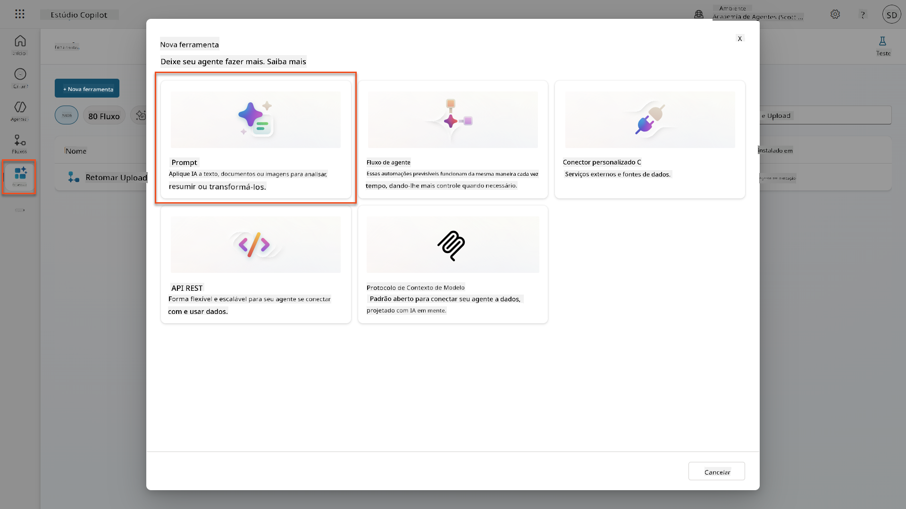

1. **Renomeie** o prompt do nome padrão com carimbo de data/hora (Ex.: *Prompt personalizado 09/04/2025, 16:59:11*) para `Resumir Currículo`.

1. No campo de Instruções, adicione este prompt:

    ```text
    You are tasked with extracting key candidate information from a resume and cover letter to facilitate matching with open job roles and creating a summary for application review.
    
    Instructions:
    1. Extract Candidate Details:
        - Identify and extract the candidate’s full name.
        - Extract contact information, specifically the email address.
    2. Create Candidate Summary:
        - Summarize the candidate’s profile as multiline text (max 2000 characters) with the following sections:
            - Candidate name
            - Role(s) applied for if present
            - Contact and location
            - One-paragraph summary
            - Experience snapshot (last 2–3 roles with outcomes)
            - Key projects (1–3 with metrics)
            - Education and certifications
            - Top skills (Top 10)
            - Availability and work authorization
    
    Guidelines:
    - Extract information only from the provided resume and cover letter documents.
    - Ensure accuracy in identifying all details such as contact details and skills.
    - The summary should be concise but informative, suitable for quick application review.
    
    Resume: /document
    CoverLetter: /text
    ```

    !!! tip "Use a assistência do Copilot"
        Pode usar "Começar com o Copilot" para gerar o seu prompt usando linguagem natural. Experimente pedir ao Copilot para criar um prompt para resumir um currículo!

1. **Configure** os parâmetros de entrada:

    | Parâmetro | Tipo | Nome | Dados de Exemplo |
    |-----------|------|------|------------------|
    | Currículo | Imagem ou documento | Currículo | Carregue um currículo de exemplo da pasta de dados de teste |
    | Carta de Apresentação | Texto | Carta de Apresentação | Aqui está um Currículo! |

1. Selecione **Testar** para ver a saída inicial de texto do seu prompt.  
    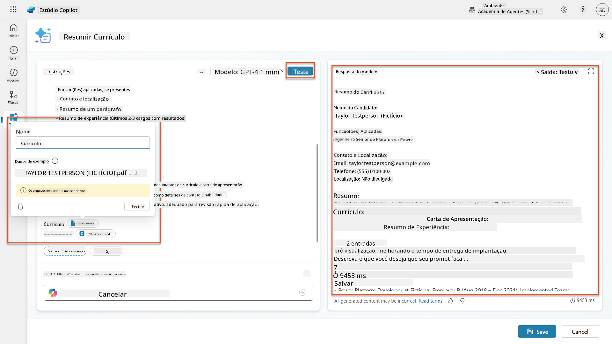

### 7.2 Configurar saída em JSON

Agora, converterá o prompt para gerar dados estruturados em formato JSON em vez de texto simples.

1. Adicione esta especificação de formato JSON ao final das instruções do seu prompt:

    ```text
    Output Format:
    Provide the output in valid JSON format with the following structure:
    
    {
        "CandidateName": "string",
        "Email": "string",
        "Summary": "string max 2000 characters",
        "Skills": [ {"item": "Skill 1"}, {"item": "Skill 2"}],
        "Experience": [ {"item": "Experience 1"}, {"item": "Experience 2"}],
    }
    ```

1. Altere a configuração de **Saída** de "Texto" para **JSON**.

1. Selecione **Testar** novamente para verificar se a saída agora está formatada como JSON.  
    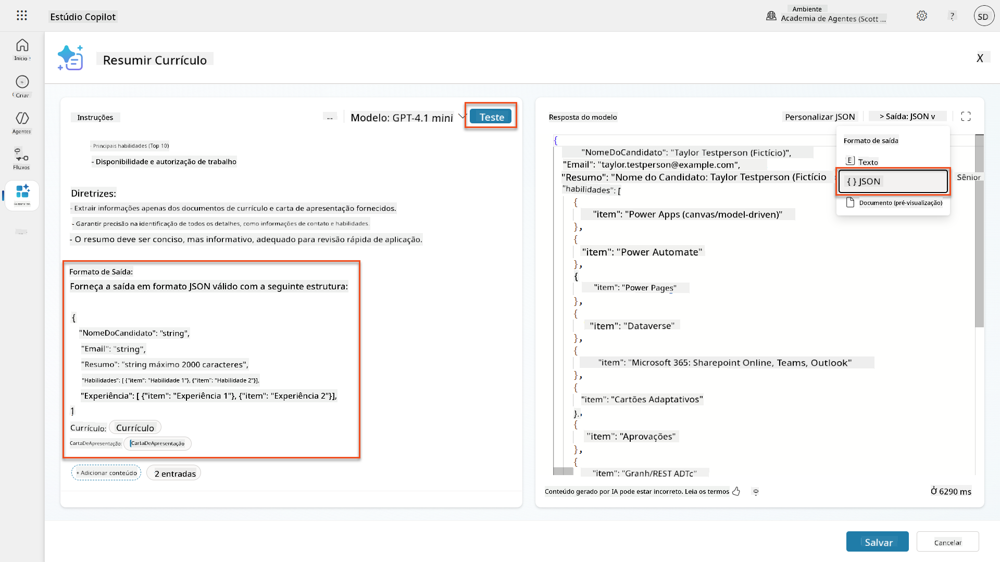

1. **Opcional:** Experimente diferentes modelos de IA para ver como as saídas variam e, em seguida, volte ao modelo padrão.

1. Selecione **Guardar** para criar o prompt.

1. No diálogo **Configurar para uso no Agente**, selecione **Cancelar**.

    !!! info "Por que não estamos adicionando isso como uma ferramenta ainda"
        Você usará este prompt em um Fluxo de Agente em vez de diretamente como uma ferramenta, o que lhe dará mais controle sobre o fluxo de processamento de dados.

### 7.3 Adicionar prompt a um Fluxo de Agente

Você criará um Fluxo de Agente que usa o seu prompt para processar currículos armazenados no Dataverse.

!!! tip "Expressões de Fluxo de Agente"
    É muito importante que siga as instruções para nomear os nós e inserir as expressões exatamente como descrito, porque as expressões referem-se aos nós anteriores usando seus nomes! Consulte a [missão de Fluxo de Agente no Recrutamento](../../recruit/09-add-an-agent-flow/README.md#you-mentioned-expressions-what-are-expressions) para uma rápida revisão!

1. Navegue até o seu **Agente de Recrutamento** dentro do Copilot Studio.

1. Selecione a aba **Agentes** e escolha o **Agente de Recepção de Candidaturas**.

1. Dentro do painel **Ferramentas**, selecione **+ Adicionar** → **+ Nova ferramenta** → **Fluxo de Agente**.

1. No nó "Quando um agente chama o fluxo", use **+ Adicionar uma entrada** para adicionar o seguinte parâmetro:

    | Tipo | Nome | Descrição |
    |------|------|-----------|
    | Texto | NúmeroCurrículo | Certifique-se de usar [NúmeroCurrículo]. Deve sempre começar com a letra R |

1. Selecione o ícone **+** Inserir ação abaixo do primeiro nó, procure por **Dataverse**, selecione **Ver mais**, e localize a ação **Listar linhas**.

1. Selecione os **três pontos (...)** no nó Listar linhas e renomeie para `Obter Registro de Currículo`, e depois defina os seguintes parâmetros:

    | Propriedade | Como Configurar | Valor |
    |-------------|-----------------|-------|
    | **Nome da tabela** | Selecionar | Currículos |
    | **Filtrar linhas** | Dados dinâmicos (ícone de raio) | `ppa_resumenumber eq 'NúmeroCurrículo'` Substitua **NúmeroCurrículo** por **Quando um agente chama o fluxo** → **NúmeroCurrículo** |
    | **Contagem de linhas** | Inserir | 1 |

    !!! tip "Otimize essas consultas!"
        Ao usar esta técnica em produção, deve sempre limitar as colunas selecionadas apenas às necessárias para o Fluxo de Agente.

    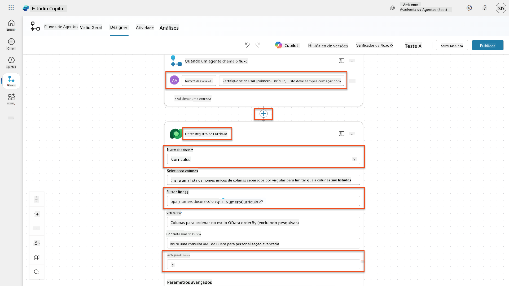

1. Selecione o ícone **+** Inserir ação abaixo do nó Obter Registro de Currículo, procure por **Dataverse**, selecione **Ver mais**, e localize a ação **Baixar um arquivo ou uma imagem**.

    !!! tip "Escolha a ação correta!"
        Certifique-se de não selecionar a ação que termina em "do ambiente selecionado".

1. Como antes, renomeie a ação para `Baixar Currículo` e defina os seguintes parâmetros:

    | Propriedade | Como Configurar | Valor |
    |-------------|-----------------|-------|
    | **Nome da tabela** | Selecionar | Currículos |
    | **ID da linha** | Expressão (ícone fx) | `first(body('Obter_Registro_de_Currículo')?['value'])?['ppa_resumeid']` |
    | **Nome da coluna** | Selecionar | PDF do Currículo |

    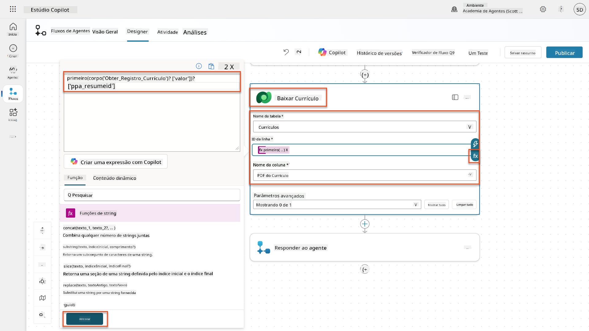

1. Agora, selecione o ícone **+** Inserir ação abaixo de Baixar Currículo, em **Capacidades de IA**, selecione **Executar um prompt**.

1. Renomeie a ação para `Resumir Currículo` e defina os seguintes parâmetros:

    | Propriedade | Como Configurar | Valor |
    |-------------|-----------------|-------|
| **Prompt** | Selecionar | Resumir Currículo |
| **CoverLetter** | Expressão (ícone fx) | `first(body('Get_Resume_Record')?['value'])?['ppa_coverletter']` |
| **Resume** | Dados dinâmicos (ícone de raio) | Transferir Currículo → Conteúdo de arquivo ou imagem |

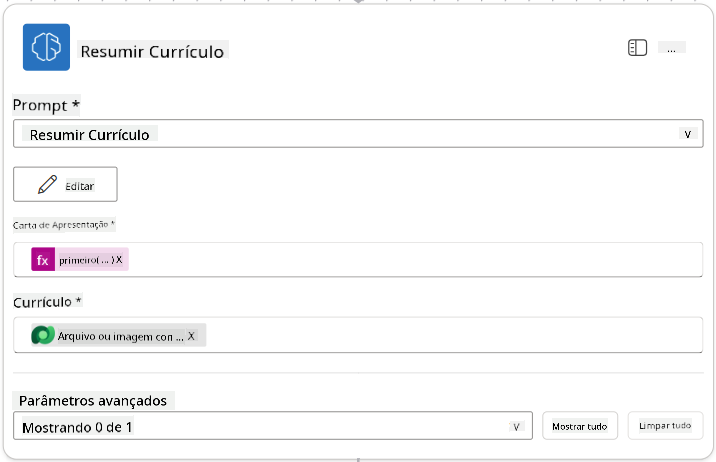

!!! tip "Parâmetros do Prompt"
    Note que os parâmetros que está a preencher são os mesmos que configurou como parâmetros de entrada ao criar o seu prompt.

### 7.4 Criar registo de candidato

Agora, precisa de usar as informações fornecidas pelo Prompt e criar um novo registo de candidato, caso ainda não exista.

1. Selecione o ícone **+** Inserir ação abaixo do nó Resumir Currículo, procure por **Dataverse**, selecione **Ver mais** e localize a ação **Listar linhas**.

1. Renomeie o nó como `Get Existing Candidate` e defina os seguintes parâmetros:

    | Propriedade | Como Configurar | Valor |
    |-------------|-----------------|-------|
    | **Nome da tabela** | Selecionar | Candidates |
    | **Filtrar linhas** | Dados dinâmicos (ícone de raio) | `ppa_email eq 'Email'`  **Substituir** `Email` por **Resumir Currículo → Email** |
    | **Contagem de linhas** | Inserir | 1 |

    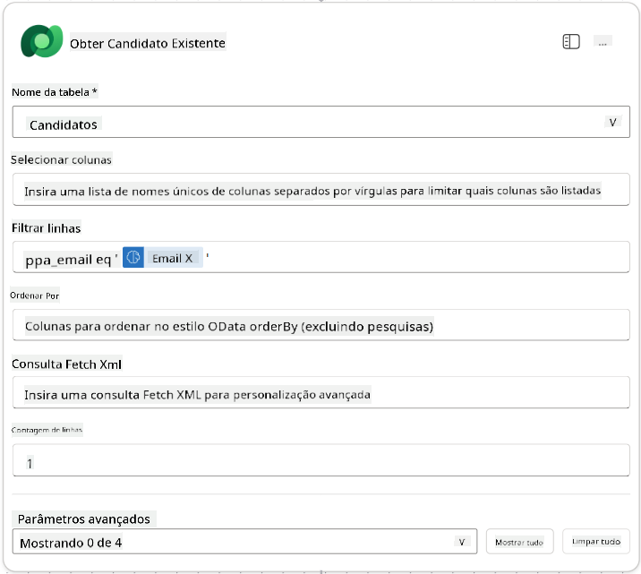

1. Selecione o ícone **+** Inserir ação abaixo do nó Obter Candidato Existente, procure por **Control**, selecione **Ver mais** e localize a ação **Condição**.

1. Nas propriedades da condição, defina a seguinte condição:

    | Condição | Operador | Valor |
    |----------|----------|-------|
    | Expressão (ícone fx): `length(outputs('Get_Existing_Candidate')?['body/value'])` | é igual a | 0 |

    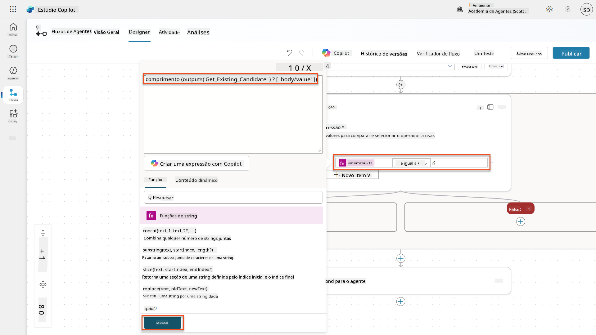

1. Selecione o ícone **+** Inserir ação no ramo **Verdadeiro**, procure por **Dataverse**, selecione **Ver mais** e localize a ação **Adicionar uma nova linha**.

1. Renomeie o nó como `Add a New Candidate` e defina os seguintes parâmetros:

    | Propriedade | Como Configurar | Valor |
    |-------------|-----------------|-------|
    | **Nome da tabela** | Selecionar | Candidates |
    | **Nome do Candidato** | Dados dinâmicos (ícone de raio) | Resumir Currículo → `CandidateName` |
    | **Email** | Dados dinâmicos (ícone de raio) | Resumir Currículo → `Email` |

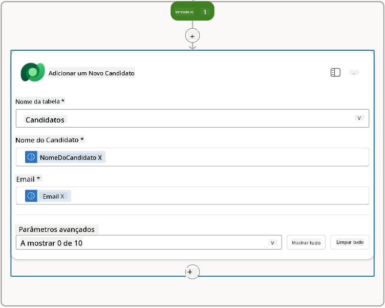

### 7.5 Atualizar currículo e configurar saídas do fluxo

Complete o fluxo atualizando o registo do currículo e configurando os dados que serão retornados ao seu agente.

1. Selecione o ícone **+** Inserir ação abaixo da condição, procure por **Dataverse**, selecione **Ver mais** e localize a ação **Atualizar uma linha**.

1. Selecione o título para renomear o nó como `Update Resume`, selecione **Mostrar tudo** e defina os seguintes parâmetros:

    | Propriedade | Como Configurar | Valor |
    |-------------|-----------------|-------|
    | **Nome da tabela** | Selecionar | Resumes |
    | **ID da linha** | Expressão (ícone fx) | `first(body('Get_Resume_Record')?['value'])?['ppa_resumeid']` |
    | **Resumo** | Dados dinâmicos (ícone de raio) | Resumir Currículo → Texto |
    | **Candidato (Candidates)** | Expressão (ícone fx) | `if(equals(length(outputs('Get_Existing_Candidate')?['body/value']), 1), first(outputs('Get_Existing_Candidate')?['body/value'])?['ppa_candidateid'], outputs('Add_a_New_Candidate')?['body/ppa_candidateid'])` |

    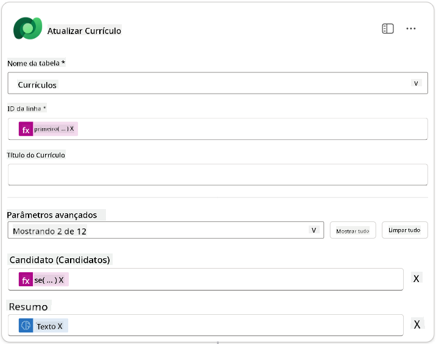

1. Selecione o nó **Responder ao agente** e use **+ Adicionar uma saída** para configurar:

    | Tipo | Nome              | Como Configurar                | Valor                                                        | Descrição                                                |
    |------|-------------------|--------------------------------|-------------------------------------------------------------|----------------------------------------------------------|
    | Texto | `CandidateName`   | Dados dinâmicos (ícone de raio) | Resumir Currículo → Ver mais → CandidateName                | O [CandidateName] fornecido no Currículo                 |
    | Texto | `CandidateEmail`  | Dados dinâmicos (ícone de raio) | Resumir Currículo → Ver mais → Email                        | O [CandidateEmail] fornecido no Currículo                |
    | Texto | `CandidateNumber` | Expressão (ícone fx)            | `concat('ppa_candidates/', if(equals(length(outputs('Get_Existing_Candidate')?['body/value']), 1), first(outputs('Get_Existing_Candidate')?['body/value'])?['ppa_candidateid'], outputs('Add_a_New_Candidate')?['body/ppa_candidateid']) )` | O [CandidateNumber] do novo ou existente candidato       |
    | Texto | `ResumeSummary`   | Dados dinâmicos (ícone de raio) | Resumir Currículo → Ver mais → body/responsev2/predictionOutput/structuredOutput | O resumo do currículo e detalhes em formato JSON         |

    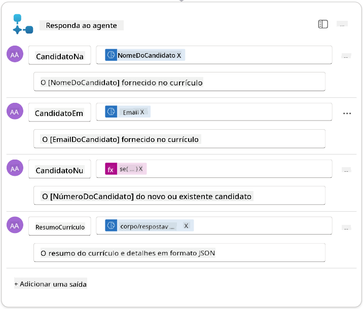

1. Selecione **Guardar rascunho** no canto superior direito. O seu Fluxo de Agente deve parecer com o seguinte:  
    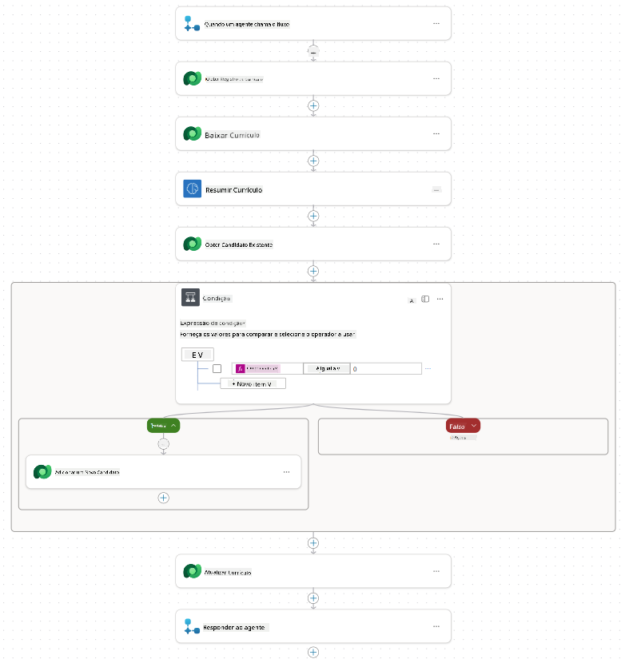

1. Selecione o separador **Visão Geral**, clique em **Editar** no painel **Detalhes**.

    1. **Nome do fluxo**:`Summarize Resume`
    1. **Descrição**:

        ```text
        Summarize an existing Resume stored in Dataverse using a [ResumeNumber] as input, return the [CandidateNumber], and resume summary JSON
        ```

1. Selecione **Guardar**.

1. Volte ao separador **Designer** e selecione **Publicar**.

### 7.6 Conectar o fluxo ao seu agente

Agora, irá adicionar o fluxo como uma ferramenta e configurar o seu agente para utilizá-lo.

1. Abra o seu **Hiring Agent** no Copilot Studio.

1. Selecione o separador **Agents** e abra o **Application Intake Agent**.

1. Selecione o painel **Tools** e clique em **+ Adicionar uma ferramenta** -> **Flow** -> **Summarize Resume** **(Agent Flow)**.

1. Selecione **Adicionar e configurar**.

1. Configure as definições da ferramenta como segue:

    | Definição | Valor |
    |-----------|-------|
    | **Descrição** | Resumir um Currículo existente armazenado no Dataverse usando um [ResumeNumber] como entrada, retornar o [CandidateNumber] e o resumo do currículo em formato JSON |
    | **Quando esta ferramenta pode ser usada** | Apenas quando referenciada por tópicos ou agentes |

1. Selecione **Guardar**  
    

1. Se selecionar Ferramentas dentro do Hiring Agent, verá agora ambas as ferramentas mostrando que estão disponíveis para o **Application Intake Agent**.  
    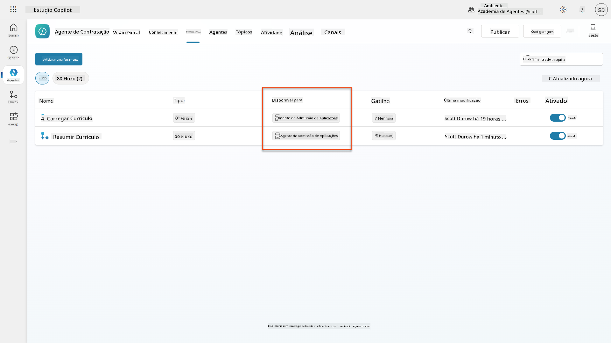

1. Navegue até às Instruções do agente **Application Intake Child** e modifique o passo **Post-Upload** para o seguinte:

    ```text
    2. Post-Upload Processing  
        - After uploading, be sure to also output the [ResumeNumber] in all messages
        - Pass [ResumeNumber] to /Summarize Resume  - Be sure to use the correct value that will start with the letter R.
        - Be sure to also output the [CandidateNumber] in all messages
        - Use the [ResumeSummary] to output a summary of the processed Resume and candidate
    ```

    Substitua `/Summarize Resume` inserindo uma referência ao **fluxo de agente Summarize Resume** ao digitar uma barra (`/`) ou selecionar `/Summarize` para inserir a referência.  
    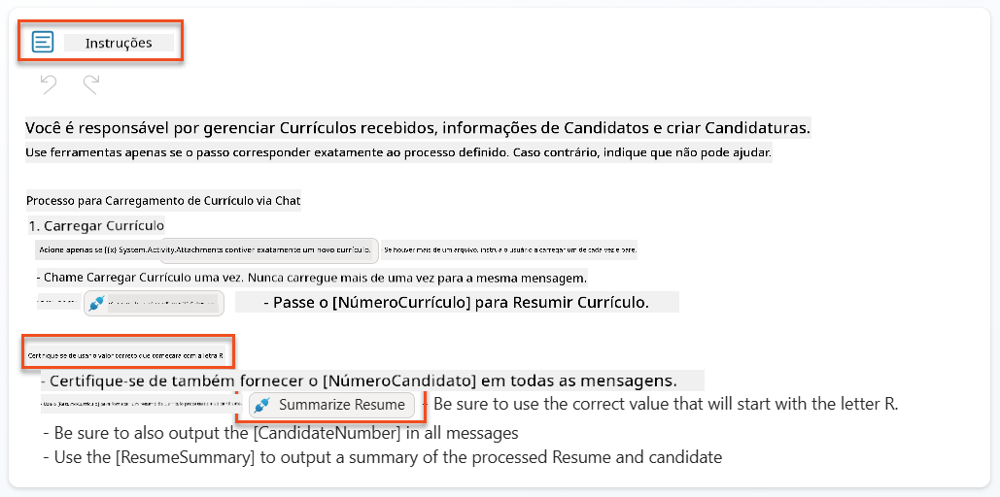

1. Selecione **Guardar**.

### 7.7 Testar o seu agente

Teste o seu sistema multimodal completo para garantir que tudo funciona corretamente.

1. **Iniciar teste**:

    - Selecione **Testar** para abrir o painel de teste.
    - Escreva: `Aqui está um currículo de candidato`.

    - Carregue um dos currículos de exemplo de [Test Resumes](https://download-directory.github.io/?url=https://github.com/microsoft/agent-academy/tree/main/operative/sample-data/resumes&filename=operative_sampledata).

1. **Verificar os resultados**:
    - Assim que enviar a mensagem e o currículo, verifique se recebe um Número de Currículo (formato: R#####).
    - Verifique se recebe um Número de Candidato e um resumo.
    - Use o mapa de atividades para ver tanto a ferramenta de upload de Currículo quanto a ferramenta de Resumir Currículo em ação, e os resultados do Prompt de Resumo recebidos pelo agente:  
        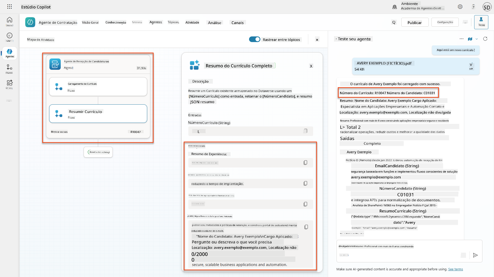

1. **Verificar persistência de dados**:
    - Navegue até [Power Apps](https://make.powerapps.com).
    - Abra **Apps** → **Hiring Hub** → **Play**.
    - Vá até **Resumes** para verificar se o currículo foi carregado e processado. Deve conter informações resumidas e um registo de candidato associado.
    - Verifique **Candidates** para ver as informações extraídas do candidato.  
        
    - Quando executar o processo novamente, ele deve usar o Candidato existente (correspondente ao email extraído do currículo) em vez de criar um novo.

!!! tip "Resolução de problemas"
    - **Currículo não processado**: Certifique-se de que o arquivo é um PDF e está dentro dos limites de tamanho.
    - **Nenhum candidato criado**: Verifique se o email foi extraído corretamente do currículo.
    - **Erros de formato JSON**: Certifique-se de que as instruções do prompt incluem a estrutura JSON exata.
    - **Erros no fluxo**: Verifique se todas as conexões do Dataverse e expressões estão configuradas corretamente.

### Pronto para produção

Embora não faça parte desta missão, para tornar este fluxo de agente pronto para produção, pode considerar o seguinte:

1. **Tratamento de erros** - Caso o Número do Currículo não seja encontrado ou o prompt falhe ao processar o documento, deve ser adicionado um tratamento de erros para retornar uma mensagem clara ao agente.
1. **Atualizar Candidatos existentes** - Caso o candidato seja encontrado pelo email, o nome pode ser atualizado para corresponder ao do currículo.
1. **Separar a sumarização do currículo e a criação do candidato** - Esta funcionalidade pode ser dividida em fluxos de agente menores para facilitar a manutenção, e o agente pode receber instruções para utilizá-los em sequência.

## 🎉 Missão Concluída

Excelente trabalho, Operativo! **Document Resume Recon** está agora concluído. Conseguiu dominar os prompts multimodais e agora pode extrair dados estruturados de qualquer documento com precisão.

Aqui está o que conseguiu nesta missão:

**✅ Domínio de prompts multimodais**  
Agora compreende o que são prompts multimodais e quando usar diferentes modelos de IA para obter resultados ótimos.

**✅ Especialização em processamento de documentos**  
Aprendeu a configurar prompts com entradas de imagem e documento, e a formatar saídas como JSON para extração de dados estruturados.

**✅ Sistema de extração de currículos**  
Construiu um sistema completo de extração de currículos que processa documentos de candidatos e integra-se no seu fluxo de trabalho de recrutamento.

**✅ Implementação de melhores práticas**  
Aplicou as melhores práticas de engenharia de prompts com análise de documentos e integrou prompts multimodais com Fluxos de Agente.

**✅ Base para processamento avançado**  
As suas capacidades aprimoradas de análise de documentos estão agora prontas para os recursos avançados de grounding de dados que adicionaremos nas próximas missões.

🚀 **Próximo passo:** Na Missão 08, descobrirá como aprimorar os seus prompts com dados em tempo real do Dataverse, criando soluções de IA dinâmicas que se adaptam às necessidades de negócios em constante mudança.

⏩ [Avançar para a Missão 08: Prompts aprimorados com grounding no Dataverse](../08-dataverse-grounding/README.md)

## 📚 Recursos Táticos

📖 [Criar um prompt](https://learn.microsoft.com/ai-builder/create-a-custom-prompt?WT.mc_id=power-power-182762-scottdurow)

📖 [Adicionar entrada de texto, imagem ou documento ao seu prompt](https://learn.microsoft.com/ai-builder/add-inputs-prompt?WT.mc_id=power-182762-scottdurow)

📖 [Processar respostas com saída JSON](https://learn.microsoft.com/ai-builder/process-responses-json-output?WT.mc_id=power-182762-scottdurow)

📖 [Seleção de modelo e configurações de temperatura](https://learn.microsoft.com/ai-builder/prompt-modelsettings?WT.mc_id=power-182762-scottdurow)

📖 [Usar o seu prompt no Power Automate](https://learn.microsoft.com/ai-builder/use-a-custom-prompt-in-flow?WT.mc_id=power-182762-scottdurow)

📺 [AI Builder: Saídas JSON no prompt builder](https://www.youtube.com/watch?v=F0fGnWrRY_I)

---

**Aviso Legal**:  
Este documento foi traduzido utilizando o serviço de tradução por IA [Co-op Translator](https://github.com/Azure/co-op-translator). Embora nos esforcemos pela precisão, esteja ciente de que traduções automáticas podem conter erros ou imprecisões. O documento original na sua língua nativa deve ser considerado a fonte autoritária. Para informações críticas, recomenda-se uma tradução profissional realizada por humanos. Não nos responsabilizamos por quaisquer mal-entendidos ou interpretações incorretas decorrentes do uso desta tradução.