<!--
CO_OP_TRANSLATOR_METADATA:
{
  "original_hash": "750f3ea8a94930439ebd8a10871b1d73",
  "translation_date": "2025-10-18T03:08:04+00:00",
  "source_file": "docs/operative-preview/08-dataverse-grounding/README.md",
  "language_code": "pt"
}
-->
# 🚨 Missão 08: Prompts avançados com base no Dataverse

--8<-- "disclaimer.md"

## 🕵️‍♂️ CODINOME: `OPERAÇÃO CONTROLO DE BASE`

> **⏱️ Duração da Operação:** `~60 minutos`

## 🎯 Resumo da Missão

Bem-vindo de volta, Operativo. O seu sistema de recrutamento multi-agente está operacional, mas há uma melhoria crítica necessária para **base de dados** - os seus modelos de IA precisam de acesso em tempo real aos dados estruturados da sua organização para tomar decisões inteligentes.

Atualmente, o seu prompt de Resumo de Currículo opera com conhecimento estático. Mas e se ele pudesse acessar dinamicamente a base de dados de funções de trabalho para fornecer correspondências precisas e atualizadas? E se ele compreendesse os seus critérios de avaliação sem que você precisasse codificá-los manualmente?

Nesta missão, irá melhorar o seu prompt personalizado com **base de dados do Dataverse** - conectando os seus prompts diretamente a fontes de dados ao vivo. Isso transforma os seus agentes de respondentes estáticos em sistemas dinâmicos e orientados por dados que se adaptam às necessidades de negócios em constante mudança.

Sua missão: integrar dados em tempo real de funções de trabalho e critérios de avaliação no fluxo de análise de currículos, criando um sistema autoatualizável que se mantém alinhado com os requisitos de contratação da sua organização.

## 🔎 Objetivos

Nesta missão, irá aprender:

1. Como a **base de dados do Dataverse** melhora os prompts personalizados
1. Quando usar base de dados em vez de instruções estáticas
1. Projetar prompts que incorporem dinamicamente dados ao vivo
1. Melhorar o fluxo de Resumo de Currículo com correspondência de funções de trabalho

## 🧠 Compreendendo a base de dados do Dataverse para prompts

A **base de dados do Dataverse** permite que os seus prompts personalizados acessem dados ao vivo das tabelas do Dataverse ao processar solicitações. Em vez de instruções estáticas, os seus prompts podem incorporar informações em tempo real para tomar decisões informadas.

### Por que a base de dados do Dataverse é importante

Os prompts tradicionais funcionam com instruções fixas:

```text
Match this candidate to these job roles: Developer, Manager, Analyst
```

Com a base de dados do Dataverse, o seu prompt acessa dados atuais:

```text
Match this candidate to available job roles from the Job Roles table, 
considering current evaluation criteria and requirements
```

Essa abordagem oferece vários benefícios importantes:

- **Atualizações dinâmicas:** As funções de trabalho e os critérios mudam sem necessidade de modificar os prompts
- **Consistência:** Todos os agentes utilizam as mesmas fontes de dados atualizadas
- **Escalabilidade:** Novas funções e critérios ficam automaticamente disponíveis
- **Precisão:** Dados em tempo real garantem que as decisões reflitam as necessidades atuais

### Como funciona a base de dados do Dataverse

Quando ativa a base de dados do Dataverse para um prompt personalizado:

1. **Seleção de dados:** Escolha tabelas e colunas específicas do Dataverse para incluir. Também pode selecionar tabelas relacionadas que o sistema filtrará com base nos registos principais recuperados.
1. **Injeção de contexto:** O prompt inclui automaticamente os dados recuperados no contexto do prompt.
1. **Filtragem inteligente:** O sistema inclui apenas os dados relevantes para a solicitação atual, caso forneça algum filtro.
1. **Saída estruturada:** O seu prompt pode referenciar os dados recuperados e raciocinar sobre os registos para criar a saída.

### De estático a dinâmico: A vantagem da base de dados

Vamos examinar o seu fluxo atual de Resumo de Currículo da Missão 07 e ver como a base de dados do Dataverse o transforma de inteligência estática para dinâmica.

**Abordagem estática atual:**
O seu prompt existente incluía critérios de avaliação codificados e lógica de correspondência predeterminada. Essa abordagem funciona, mas requer atualizações manuais sempre que adiciona novas funções de trabalho, altera critérios de avaliação ou muda as prioridades da empresa.

**Transformação com base de dados do Dataverse:**
Ao adicionar a base de dados do Dataverse, o seu fluxo de Resumo de Currículo irá:

- **Acessar funções de trabalho atuais** da tabela de Funções de Trabalho
- **Usar critérios de avaliação ao vivo** em vez de descrições estáticas  
- **Fornecer correspondências precisas** com base nos requisitos em tempo real

## 🎯 Por que prompts dedicados vs conversas com agentes

Na Missão 02, experimentou como o Agente de Entrevista podia corresponder candidatos a funções de trabalho, mas exigia prompts complexos do utilizador, como:

```text
Upload this resume, then show me open job roles,
each with a description of the evaluation criteria, 
then use this to match the resume to at least one suitable
job role even if not a perfect match.
```

Embora isso funcionasse, prompts dedicados com base de dados do Dataverse oferecem vantagens significativas para tarefas específicas:

### Principais vantagens de prompts dedicados

| Aspeto | Conversas com Agentes | Prompts Dedicados |
|--------|------------------------|-------------------|
| **Consistência** | Resultados variam com base nas habilidades de criação de prompts do utilizador | Processamento padronizado todas as vezes |
| **Especialização** | Raciocínio genérico pode ignorar nuances de negócios | Projetado com lógica de negócios otimizada |
| **Automação** | Requer interação e interpretação humana | Aciona automaticamente com saída JSON estruturada |

## 🧪 Laboratório 8: Adicionar base de dados do Dataverse aos prompts

Hora de melhorar as suas capacidades de análise de currículos! Irá aprimorar o fluxo existente de Resumo de Currículo com correspondência dinâmica de funções de trabalho.

### Pré-requisitos para completar esta missão

1. Precisa **de um dos seguintes**:

    - **Ter completado a Missão 07** e ter o seu sistema de análise de currículos pronto, **OU**
    - **Importar a solução inicial da Missão 08** se estiver a começar do zero ou precisar de recuperar. [Descarregar Solução Inicial da Missão 08](https://aka.ms/agent-academy)

1. Documentos de currículos de exemplo de [test Resumes](https://download-directory.github.io/?url=https://github.com/microsoft/agent-academy/tree/main/operative/sample-data/resumes&filename=operative_sampledata)

!!! note "Importação de Solução e Dados de Exemplo"
    Se estiver a usar a solução inicial, consulte [Missão 01](../01-get-started/README.md) para instruções detalhadas sobre como importar soluções e dados de exemplo para o seu ambiente.

### 8.1 Adicionar base de dados do Dataverse ao seu prompt

Irá construir sobre o prompt de Resumo de Currículo que criou na Missão 07. Atualmente, ele simplesmente resume o currículo, mas agora irá conectá-lo às funções de trabalho existentes no Dataverse, mantendo-o sempre atualizado.

Primeiro, vamos examinar as tabelas do Dataverse que irá utilizar:

1. **Navegue** até [Power Apps](https://make.powerapps.com) e selecione o seu ambiente usando o **Seletor de Ambiente** no canto superior direito da barra de navegação.

1. Selecione **Tabelas** e localize a tabela **Funções de Trabalho**.

1. Revise as colunas principais que irá usar para a base de dados:

    | Coluna | Propósito |
    |--------|----------|
    | **Número da Função de Trabalho** | Identificador único para correspondência de funções |
    | **Título da Função** | Nome exibido para a função |
    | **Descrição** | Requisitos detalhados da função |

1. Da mesma forma, revise outras tabelas, como a tabela **Critérios de Avaliação**.

### 8.2 Adicionar dados da base de dados do Dataverse ao seu prompt

1. **Navegue** até o Copilot Studio e selecione o seu ambiente usando o **Seletor de Ambiente** no canto superior direito da barra de navegação.

1. Selecione **Ferramentas** no painel de navegação à esquerda.

1. Escolha **Prompt** e localize o seu prompt **Resumo de Currículo** da Missão 07.  
    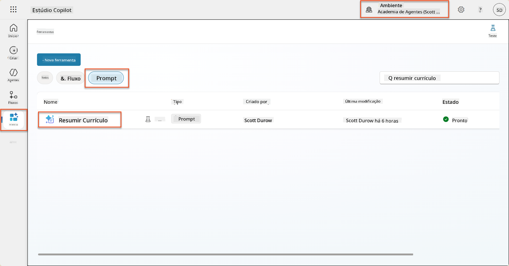

1. Selecione **Editar** para modificar o prompt e substitua pela versão aprimorada abaixo:

    !!! important
        Certifique-se de que os parâmetros de Currículo e Carta de Apresentação permaneçam intactos como parâmetros.

    ```text
    You are tasked with extracting key candidate information from a resume and cover letter to facilitate matching with open job roles and creating a summary for application review.
    
    ### Instructions:
    1. **Extract Candidate Details:**
       - Identify and extract the candidate's full name.
       - Extract contact information, specifically the email address.
    
    2. **Analyze Resume and Cover Letter:**
       - Review the resume content to identify relevant skills, experience, and qualifications.
       - Review the cover letter to understand the candidate's motivation and suitability for the roles.
    
    3. **Match Against Open Job Roles:**
       - Compare the extracted candidate information with the requirements and descriptions of the provided open job roles.
       - Use the job descriptions to assess potential fit.
       - Identify all roles that align with the candidate's cover letter and profile. You don't need to assess perfect suitability.
       - Provide reasoning for each match based on the specific job requirements.
    
    4. **Create Candidate Summary:**
       - Summarize the candidate's profile as multiline text with the following sections:
          - Candidate name
          - Role(s) applied for if present
          - Contact and location
          - One-paragraph summary
          - Top skills (8–10)
          - Experience snapshot (last 2–3 roles with outcomes)
          - Key projects (1–3 with metrics)
          - Education and certifications
          - Availability and work authorization
    
    ### Output Format
    
    Provide the output in valid JSON format with the following structure:
    
    {
      "CandidateName": "string",
      "Email": "string",
      "MatchedRoles": [
        {
          "JobRoleNumber": "ppa_jobrolenumber from grounded data",
          "RoleName": "ppa_jobtitle from grounded data",
          "Reasoning": "Detailed explanation based on job requirements"
        }
      ],
      "Summary": "string"
    }
    
    ### Guidelines
    
    - Extract information only from the provided resume and cover letter documents.
    - Ensure accuracy in identifying contact details.
    - Use the available job role data for matching decisions.
    - The summary should be concise but informative, suitable for quick application review.
    - If no suitable matches are found, indicate an empty list for MatchedRoles and explain briefly in the summary.
    
    ### Input Data
    Open Job Roles (ppa_jobrolenumber, ppa_jobtitle): /Job Role 
    Resume: {Resume}
    Cover Letter: {CoverLetter}
    ```

1. No editor de prompt, substitua `/Função de Trabalho` selecionando **+ Adicionar conteúdo**, selecionando **Dataverse** → **Função de Trabalho** e selecione as seguintes colunas, e depois clique em **Adicionar**:

    1. **Número da Função de Trabalho**

    1. **Título da Função**

    1. **Descrição**

    !!! tip
        Pode digitar o nome da tabela para pesquisar.

1. No diálogo de **Função de Trabalho**, selecione o atributo **Filtro**, escolha **Estado**, e depois digite **Ativo** como valor do **Filtro**.  
    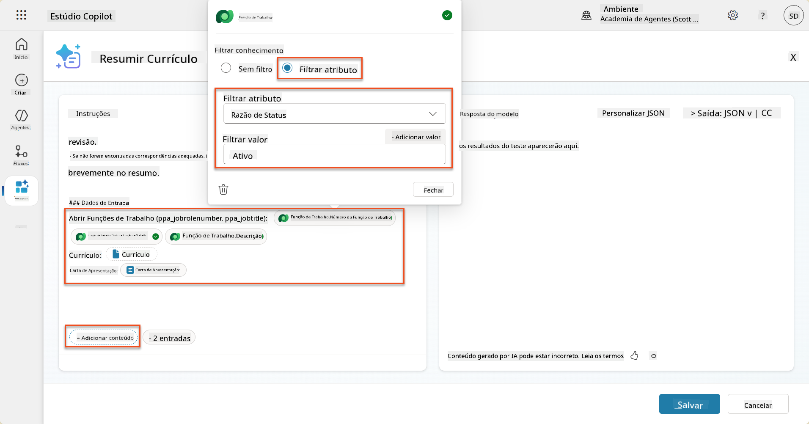

    !!! tip
        Pode usar **Adicionar valor** aqui para adicionar um parâmetro de entrada também - por exemplo, se tivesse um prompt para resumir um registo existente, poderia fornecer o Número do Currículo como parâmetro para filtrar.

1. Em seguida, irá adicionar a tabela relacionada do Dataverse **Critérios de Avaliação**, novamente selecionando **+ Adicionar conteúdo**, encontrando **Funções de Trabalho**, e em vez de selecionar as colunas em Função de Trabalho, expanda **Função de Trabalho (Critérios de Avaliação)** e selecione as seguintes colunas, e depois clique em **Adicionar**:

    1. **Nome do Critério**

    1. **Descrição**  
        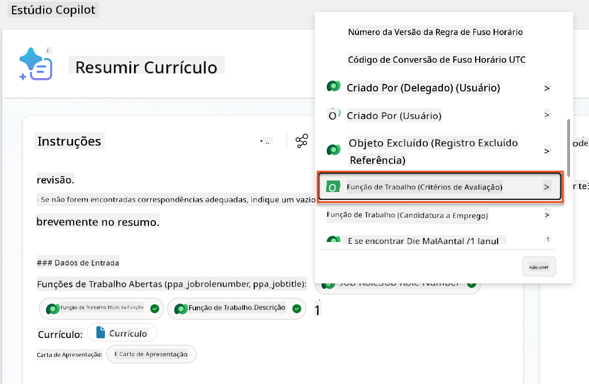

        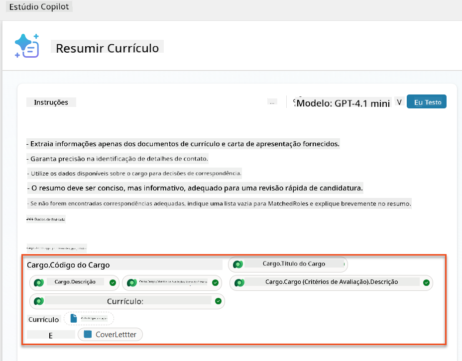

    !!! tip
        É importante selecionar os Critérios de Avaliação relacionados primeiro selecionando a Função de Trabalho e depois navegando no menu para Função de Trabalho (Critérios de Avaliação). Isso garantirá que apenas os registos relacionados à Função de Trabalho sejam carregados.

1. Selecione **Configurações** e ajuste a **Recuperação de registos** para 1000 - isso permitirá que o máximo de Funções de Trabalho e Critérios de Avaliação sejam incluídos no seu prompt.  
    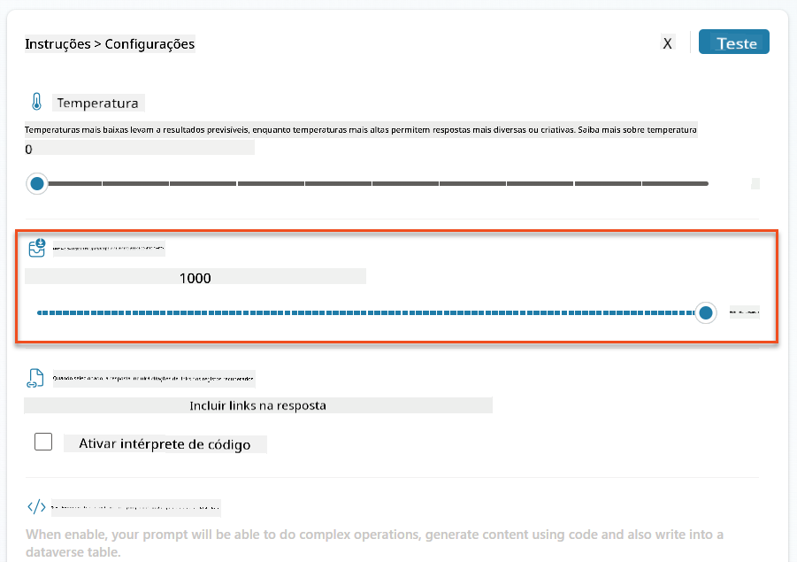

### 8.3 Testar o prompt aprimorado

1. Selecione o parâmetro **Currículo** e carregue um currículo de exemplo que utilizou na Missão 07.
1. Selecione **Testar**.
1. Após o teste ser executado, observe que a saída JSON agora inclui as **Funções Correspondentes**.
1. Selecione a aba **Conhecimento usado** para ver os dados do Dataverse que se fundiram com o seu prompt antes da execução.
1. **Guarde** o seu prompt atualizado. O sistema agora incluirá automaticamente esses dados do Dataverse com o seu prompt quando o fluxo existente do Agente de Resumo de Currículo o chamar.  
    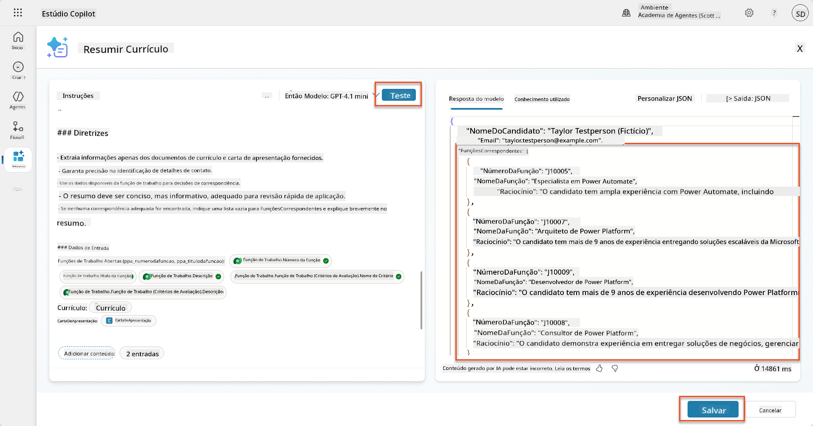

### 8.4 Adicionar Fluxo de Agente de Candidatura a Emprego

Para permitir que o nosso Agente de Receção de Candidaturas crie Funções de Trabalho com base nas funções sugeridas, precisamos criar um Fluxo de Agente. O agente chamará esta ferramenta para cada uma das funções de trabalho sugeridas que o candidato estiver interessado.

!!! tip "Expressões de Fluxo de Agente"
    É muito importante que siga as instruções para nomear os seus nós e inserir expressões exatamente, porque as expressões referem-se aos nós anteriores usando o nome deles! Consulte a [missão de Fluxo de Agente em Recrutamento](../../recruit/09-add-an-agent-flow/README.md#you-mentioned-expressions-what-are-expressions) para uma rápida revisão!

1. Dentro do **Agente de Contratação**, selecione a aba **Agentes** e abra o agente filho **Agente de Receção de Candidaturas**.

1. Dentro do painel **Ferramentas**, selecione **+ Adicionar** → **+ Nova ferramenta** → **Fluxo de Agente**

1. Selecione o nó **Quando um agente chama o fluxo**, use **+ Adicionar uma entrada** para adicionar o seguinte parâmetro:

    | Tipo | Nome            | Descrição                                                  |
    | ---- | --------------- | ---------------------------------------------------------- |
    | Texto | `NúmeroCurrículo`  | Certifique-se de usar apenas o [NúmeroCurrículo] - deve começar com a letra R |
    | Texto | `NúmeroFunçãoTrabalho` | Certifique-se de usar apenas o [NúmeroFunçãoTrabalho] - deve começar com a letra J |

    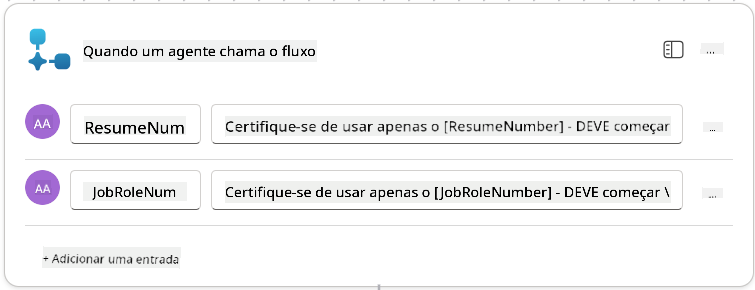

1. Selecione o ícone **+** Inserir ação abaixo do primeiro nó, procure por **Dataverse**, selecione **Ver mais**, e depois localize a ação **Listar linhas**.

1. **Renomeie** o nó como `Obter Currículo` e defina os seguintes parâmetros:

    | Propriedade        | Como definir                | Valor                                                        |
    | ------------------- | ---------------------------| ------------------------------------------------------------ |
    | **Nome da tabela**  | Selecionar                 | Currículos                                                   |
    | **Filtrar linhas**  | Dados dinâmicos (ícone de raio) | `ppa_resumenumber eq 'NúmeroCurrículo'` Selecione e substitua **NúmeroCurrículo** por **Quando um agente chama o fluxo** → **NúmeroCurrículo** |
    | **Contagem de linhas** | Inserir                  | 1                                                            |

    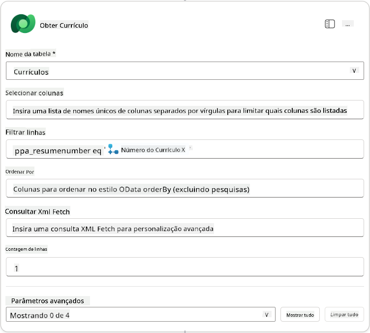

1. Agora, selecione o ícone **+** Inserir ação abaixo de **Obter Currículo**, procure por **Dataverse**, selecione **Ver mais**, e depois localize a ação **Listar linhas**.

1. **Renomeie** o nó como `Obter Função de Trabalho` e defina os seguintes parâmetros:

    | Propriedade        | Como definir                | Valor                                                        |
    | ------------------- | ---------------------------| ------------------------------------------------------------ |
    | **Nome da tabela**  | Selecionar                 | Funções de Trabalho                                          |
    | **Filtrar linhas**  | Dados dinâmicos (ícone de raio) | `ppa_jobrolenumber eq 'NúmeroFunçãoTrabalho'` Selecione e substitua **NúmeroFunçãoTrabalho** por **Quando um agente chama o fluxo** → **NúmeroFunçãoTrabalho** |
    | **Contagem de linhas** | Inserir                  | 1                                                            |

    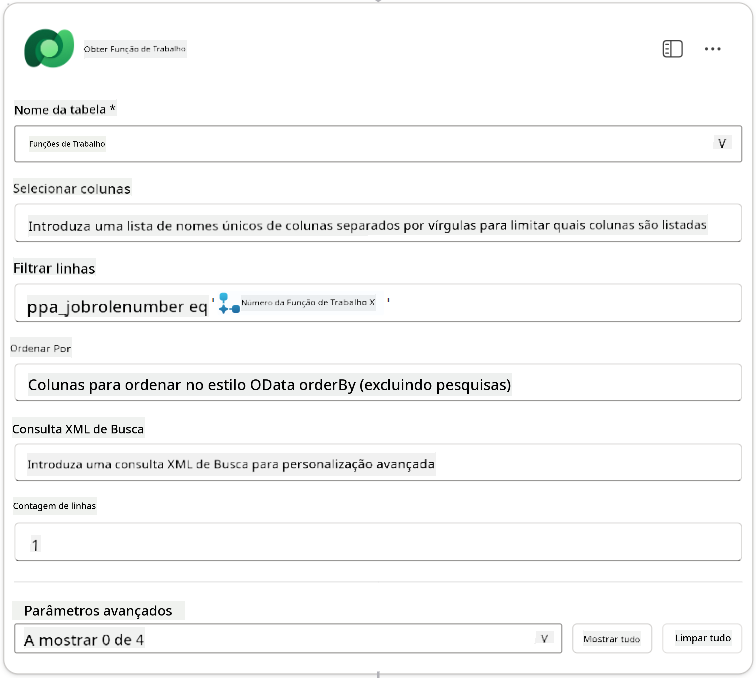

1. Agora, selecione o ícone **+** Inserir ação abaixo de Obter Função de Trabalho, procure por **Dataverse**, selecione **Ver mais**, e depois localize a ação **Adicionar uma nova linha**.

1. **Renomeie** o nó como `Adicionar Candidatura` e defina os seguintes parâmetros:

    | Propriedade                           | Como definir           | Valor                                                        |
    | ------------------------------------- | -----------------------| ------------------------------------------------------------ |
    | **Nome da tabela**                     | Selecionar             | Candidaturas a Emprego                                       |
    | **Candidato (Candidatos)**             | Expressão (ícone fx)   | `concat('ppa_candidates/',first(outputs('Obter_Currículo')?['body/value'])?['_ppa_candidate_value'])` |
| **Função de Trabalho (Funções de Trabalho)** | Expressão (ícone fx) | `concat('ppa_jobroles/',first(outputs('Get_Job_Role')?['body/value'])?['ppa_jobroleid'])` |
| **Currículo (Currículos)**                   | Expressão (ícone fx) | `concat('ppa_resumes/', first(outputs('Get_Resume')?['body/value'])?['ppa_resumeid'])` |
| **Data de Candidatura** (usar **Mostrar tudo**) | Expressão (ícone fx) | `utcNow()`                                                   |

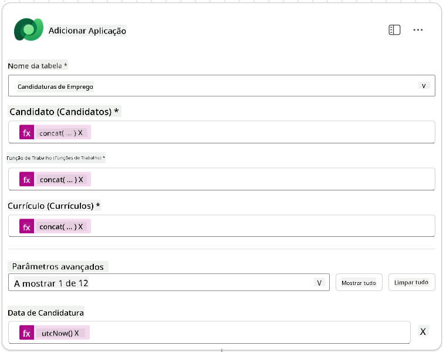

1. Selecione o **Responder ao nó do agente**, e depois selecione **+ Adicionar uma saída**

     | Propriedade     | Como Configurar                 | Detalhes                                         |
     | --------------- | ------------------------------- | ----------------------------------------------- |
     | **Tipo**        | Selecionar                      | `Texto`                                         |
     | **Nome**        | Inserir                         | `ApplicationNumber`                             |
     | **Valor**       | Dados dinâmicos (ícone de raio) | *Adicionar Candidatura → Ver Mais → Número da Candidatura* |
     | **Descrição**   | Inserir                         | `O [ApplicationNumber] da candidatura de emprego criada`      |

     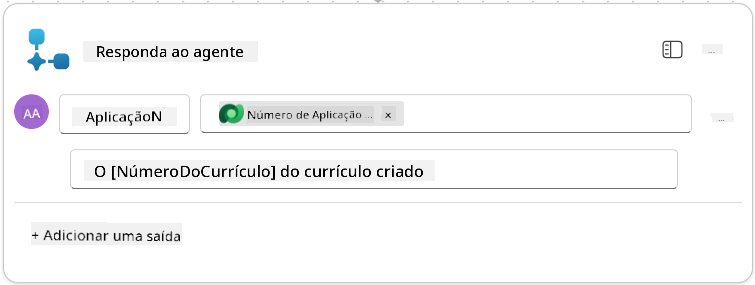

1. Selecione **Guardar rascunho** no canto superior direito

1. Selecione o separador **Visão Geral**, e clique em **Editar** no painel **Detalhes**

      - **Nome do fluxo**:`Criar Candidatura de Emprego`
      - **Descrição**:`Cria uma nova candidatura de emprego quando fornecido [ResumeNumber] e [JobRoleNumber]`
      - **Guardar**

1. Volte ao separador **Designer** e selecione **Publicar**.

### 8.5 Adicionar Criar Candidatura de Emprego ao agente

Agora irá conectar o fluxo publicado ao seu Agente de Receção de Candidaturas.

1. Navegue de volta ao **Agente de Recrutamento** e selecione o separador **Agentes**. Abra o **Agente de Receção de Candidaturas**, e localize o painel **Ferramentas**.

1. Selecione **+ Adicionar**

1. Selecione o filtro **Fluxo**, e procure por `Criar Candidatura de Emprego`. Selecione o fluxo **Criar Candidatura de Emprego**, e depois **Adicionar e configurar**.

1. Configure os seguintes parâmetros:

    | Parâmetro                                         | Valor                                                        |
    | ------------------------------------------------- | ------------------------------------------------------------ |
    | **Descrição**                                     | `Cria uma nova candidatura de emprego quando fornecido [ResumeNumber] e [JobRoleNumber]` |
    | **Detalhes adicionais → Quando esta ferramenta pode ser usada** | `Apenas quando referenciado por tópicos ou agentes`          |

1. Selecione **Guardar**  
    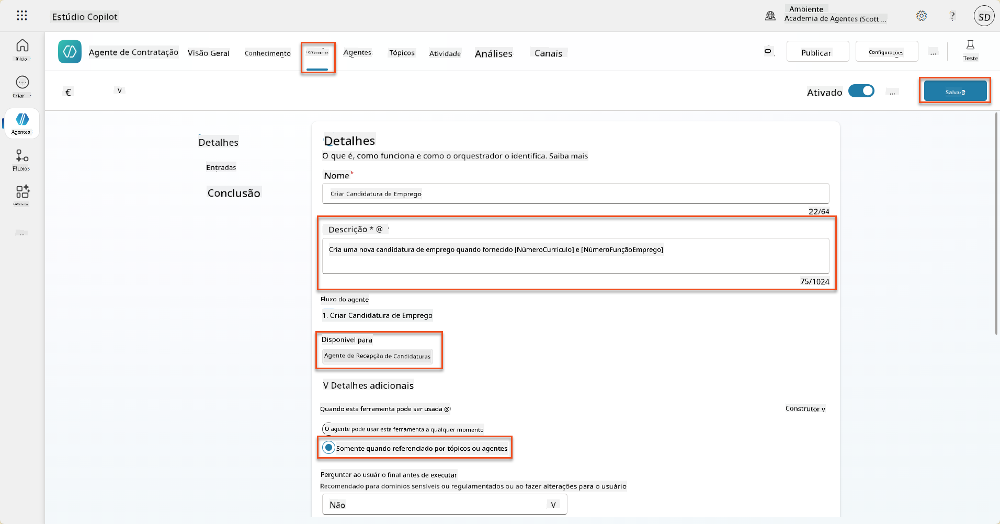

### 8.6 Definir instruções para o agente

Para criar candidaturas de emprego, precisa de dizer ao agente quando usar a nova ferramenta. Neste caso, irá pedir ao utilizador para confirmar quais os cargos sugeridos para os quais deseja candidatar-se, e instruir o agente a executar a ferramenta para cada cargo.

1. Volte ao **Agente de Receção de Candidaturas**, e localize o painel **Instruções**.

1. No campo **Instruções**, **adicione** a seguinte orientação clara para o seu agente secundário **no final das instruções existentes**:

    ```text
    3. Post Resume Upload
       - Respond with a formatted bullet list of [SuggestedJobRoles] the candidate could apply for.  
       - Use the format: [JobRoleNumber] - [RoleDescription]
       - Ask the user to confirm which Job Roles to create applications for the candidate.
       - When the user has confirmed a set of [JobRoleNumber]s, move to the next step.
    
    4. Post Upload - Application Creation
        - After the user confirms which [SuggestedJobRoles] for a specific [ResumeNumber]:
        E.g. "Apply [ResumeNumber] for the Job Roles [JobRoleNumber], [JobRoleNumber], [JobRoleNumber]
        E.g. "apply to all suggested job roles" - this implies use all the [JobRoleNumbers] 
         - Loop over each [JobRoleNumber] and send with [ResumeNumber] to /Create Job Application   
         - Summarize the Job Applications Created
    
    Strict Rules (that must never be broken)
    You must always follow these rules and never break them:
    1. The only valid identifiers are:
      - ResumeNumber (ppa_resumenumber)→ format R#####
      - CandidateNumber (ppa_candidatenumber)→ format C#####
      - ApplicationNumber (ppa_applicationnumber)→ format A#####
      - JobRoleNumber (ppa_jobrolenumber)→ format J#####
    2. Never guess or invent these values.
    3. Always extract identifiers from the current context (conversation, data, or system output). 
    ```

1. Onde as instruções incluem uma barra (/), selecione o texto após a barra e selecione a ferramenta **Criar Candidatura de Emprego**.

1. Selecione **Guardar**  
    

!!! tip "Iterar sobre múltiplos itens na Orquestração Generativa"
    Estas instruções utilizam a capacidade da orquestração generativa de iterar sobre múltiplas linhas ao tomar decisões sobre quais passos e ferramentas usar. Os Cargos Correspondentes serão automaticamente lidos e o Agente de Receção de Candidaturas será executado para cada linha. Bem-vindo ao mundo mágico da orquestração generativa!

### 8.7 Testar o seu agente

1. Abra o seu **Agente de Recrutamento** no Copilot Studio.

1. **Carregue** um currículo de exemplo no chat, e escreva:

    ```text
    This is a new resume for the Power Platform Developer Role.
    ```

1. Note como o agente fornece uma lista de Cargos Sugeridos - cada um com um número de cargo.  
    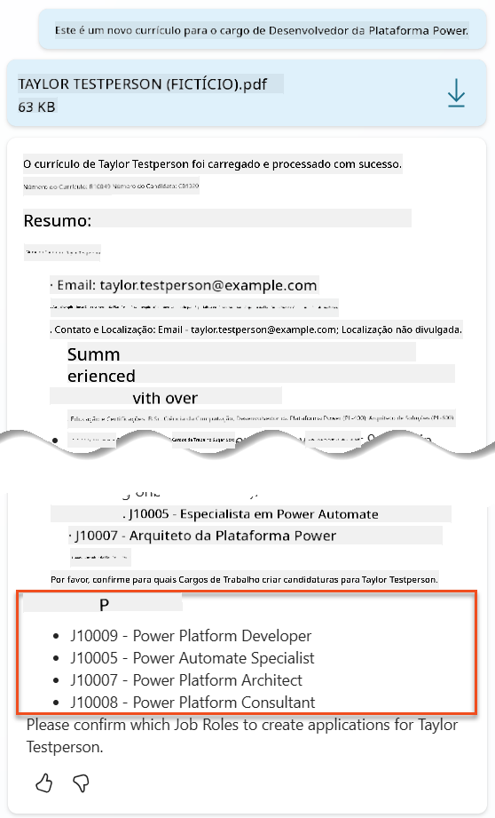

1. Pode então indicar quais destes gostaria que o currículo fosse adicionado como uma candidatura de emprego.
    **Exemplos:**

    ```text
    "Apply for all of those job roles"
    "Apply for the J10009 Power Platform Developer role"
    "Apply for the Developer and Architect roles"
    ```

    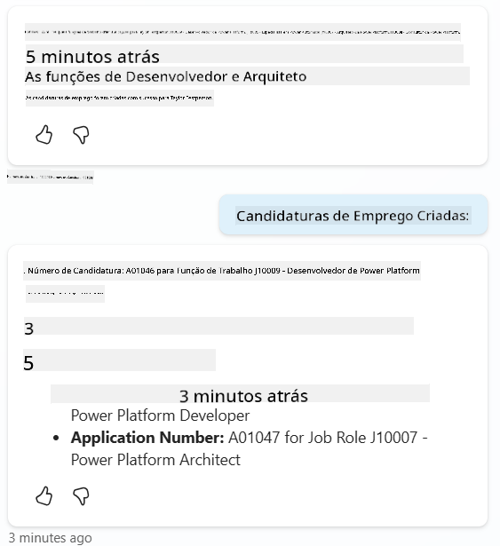

1. A ferramenta **Criar Candidatura de Emprego** será então executada para cada cargo que especificou. Dentro do mapa de atividades, verá a ferramenta Criar Candidatura de Emprego ser executada para cada um dos cargos que pediu para criar uma candidatura:  
    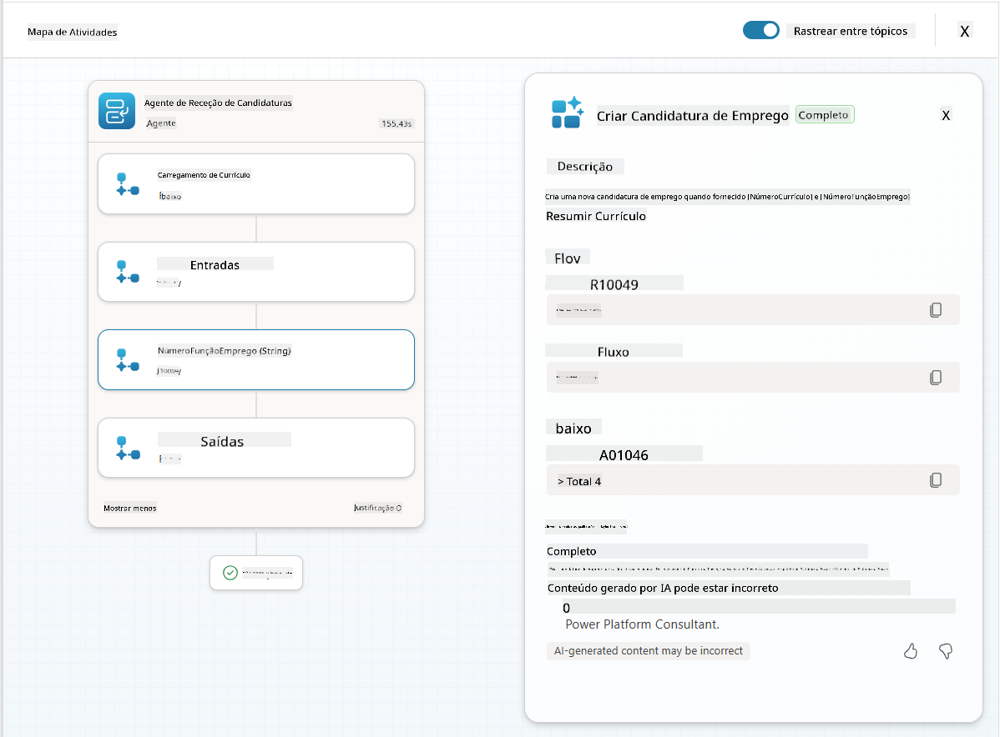

## 🎉 Missão Completa

Excelente trabalho, Operativo! **Operação Grounding Control** está agora concluída. Conseguiu melhorar as capacidades da sua IA com dados dinâmicos, criando um sistema de recrutamento verdadeiramente inteligente.

Aqui está o que alcançou nesta missão:

**✅ Domínio de grounding com Dataverse**  
Agora compreende como conectar prompts personalizados a fontes de dados ao vivo para inteligência dinâmica.

**✅ Análise de currículos aprimorada**  
O seu fluxo de Resumo de Currículo agora acessa dados de cargos em tempo real e critérios de avaliação para correspondência precisa.

**✅ Tomada de decisão baseada em dados**  
Os seus agentes de recrutamento podem agora adaptar-se automaticamente às mudanças nos requisitos de cargos sem atualizações manuais de prompts.

**✅ Criação de Candidaturas de Emprego**  
O seu sistema aprimorado pode agora criar Candidaturas de Emprego e está pronto para orquestrações de fluxo de trabalho mais complexas.

🚀 **Próximo passo:** Na sua próxima missão, irá aprender como implementar capacidades de raciocínio profundo que ajudam os seus agentes a tomar decisões complexas e fornecer explicações detalhadas para as suas recomendações.

⏩ [Avançar para a Missão 09: Raciocínio profundo](../09-deep-reasoning/README.md)

## 📚 Recursos Táticos

📖 [Utilizar os seus próprios dados num prompt](https://learn.microsoft.com/ai-builder/use-your-own-prompt-data?WT.mc_id=power-182762-scottdurow)

📖 [Criar um prompt personalizado](https://learn.microsoft.com/ai-builder/create-a-custom-prompt?WT.mc_id=power-182762-scottdurow)

📖 [Trabalhar com Dataverse no Copilot Studio](https://learn.microsoft.com/microsoft-copilot-studio/knowledge-add-dataverse?WT.mc_id=power-182762-scottdurow)

📖 [Visão geral de prompts personalizados do AI Builder](https://learn.microsoft.com/ai-builder/prompts-overview?WT.mc_id=power-182762-scottdurow)

📖 [Documentação do AI Builder do Power Platform](https://learn.microsoft.com/ai-builder/?WT.mc_id=power-182762-scottdurow)

📖 [Treinamento: Criar prompts do AI Builder usando os seus próprios dados do Dataverse](https://learn.microsoft.com/training/modules/ai-builder-grounded-prompts/?WT.mc_id=power-182762-scottdurow)

---

**Aviso Legal**:  
Este documento foi traduzido utilizando o serviço de tradução por IA [Co-op Translator](https://github.com/Azure/co-op-translator). Embora nos esforcemos pela precisão, esteja ciente de que traduções automáticas podem conter erros ou imprecisões. O documento original na sua língua nativa deve ser considerado a fonte autoritária. Para informações críticas, recomenda-se uma tradução profissional realizada por humanos. Não nos responsabilizamos por quaisquer mal-entendidos ou interpretações incorretas decorrentes do uso desta tradução.