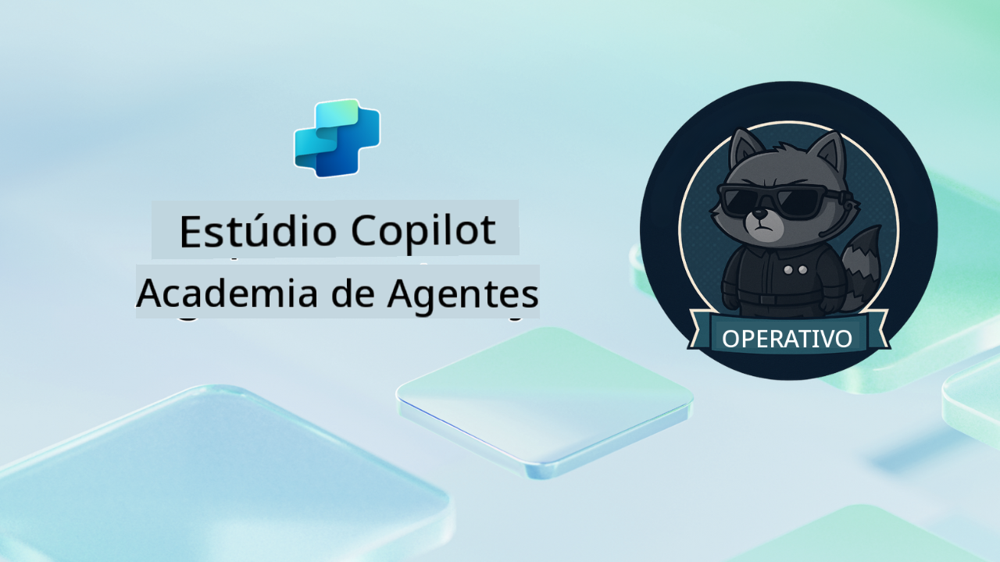

<!--
CO_OP_TRANSLATOR_METADATA:
{
  "original_hash": "24fcbe9a57d3439e05f8866e550c0a84",
  "translation_date": "2025-10-18T03:07:20+00:00",
  "source_file": "docs/operative-preview/README.md",
  "language_code": "pt"
}
-->
# Bem-vindo, Operativo

**Bem-vindo, Operativo.**  
A sua missão avançada—caso decida aceitá-la—é dominar a arte de construir **sistemas multiagentes de nível empresarial** utilizando o **Microsoft Copilot Studio**.

Este treinamento intensivo leva-o além da criação básica de agentes, para o sofisticado mundo da **orquestração de multiagentes**: desde automação de recrutamento até segurança em IA, aprenderá a construir, coordenar e implementar ecossistemas inteligentes de agentes utilizando cenários empresariais reais.

--8<-- "disclaimer.md"

---

## 🎯 Objetivo da Missão

Ao concluir o programa Operativo da Agent Academy, será capaz de:

- Projetar e implementar **sistemas multiagentes** para cenários empresariais complexos
- Dominar padrões de **orquestração e colaboração entre agentes**
- Implementar **segurança em IA e moderação de conteúdo** em sistemas de produção
- Construir **prompts multimodais** para processamento e análise de documentos
- Implementar **agentes prontos para empresas** com governança e testes adequados

---

## 🧪 Pré-requisitos

Para completar todas as missões, precisará de:

- Treinamento concluído como **Recruta da Agent Academy**
- Um ambiente Microsoft Power Platform com licença para **Copilot Studio**
- Acesso ao **Microsoft Dataverse**
- Permissões administrativas para criar soluções e agentes

---

## 🧬 Para Quem É Este Curso

Este curso avançado é ideal para:

- **Arquitetos de soluções** que projetam sistemas de IA empresariais
- **Desenvolvedores** que constroem soluções de agentes prontas para produção
- **Profissionais de TI** que implementam governança e segurança em IA
- **Analistas de negócios** que criam fluxos de trabalho de automação complexos
- Qualquer pessoa pronta para **evoluir** de agentes básicos para sistemas empresariais

---

## 🧭 Visão Geral do Currículo

Esta academia está estruturada como uma série progressiva de operações de campo—cada missão constrói sobre a anterior para criar um sistema abrangente de automação de recrutamento.

| Missão | Título | Resumo da Operação |
|--------|--------|--------------------|
| `01` | 🚨 [Introdução ao Agente de Recrutamento](./01-get-started/README.md) | Implante a infraestrutura básica e crie seu agente orquestrador central |
| `02` | 🎭 [Prepare seu agente para ser multiagente com agentes conectados](./02-multi-agent/README.md) | Transforme um agente único em um sistema coordenado de multiagentes |
| `03` | ⚡ [Automatize seu agente com Triggers](./03-automate-triggers/README.md) | Implemente comportamentos autônomos de agentes com triggers baseados em eventos |
| `04` | 📝 [Escrevendo Instruções para o Agente](./04-agent-instructions/README.md) | Domine a comunicação precisa e o controle de comportamento do agente |
| `05` | 💬 [Personalizando Respostas do Agente](./05-agent-responses/README.md) | Personalize as respostas do agente para máximo impacto e engajamento |
| `06` | 🛡️ [Essenciais de Moderação de Conteúdo e Segurança em IA](./06-ai-safety/README.md) | Implemente medidas de segurança e conformidade de nível empresarial |
| `07` | 🎨 [Extraindo Conteúdo de Currículos com Prompts Multimodais](./07-multimodal-prompts/README.md) | Processe documentos e imagens com capacidades avançadas de IA |
| `08` | 🗄️ [Prompts - Baseados no Dataverse](./08-dataverse-grounding/README.md) | Baseie os agentes em dados empresariais para respostas precisas |
| `09` | 🧠 [Aplicando Raciocínio Profundo para Avaliar a Compatibilidade de Candidatos e Preparação para Entrevistas](./09-deep-reasoning/README.md) | Implemente raciocínio sofisticado de IA para decisões complexas |
| `10` | 📄 [Gerar Documentos de Entrevista Específicos para Candidatos com Prompts](./10-generate-documents/README.md) | Crie documentos dinâmicos com base na análise do agente |
| `11` | 📊 [Obter Feedback do Usuário com Cartões Adaptativos](./11-obtain-user-feedback/README.md) | Colete e processe feedback dos usuários para melhoria contínua |
| `12` | 🌐 [Publicar Seus Agentes em um Website de Demonstração para Testes com Stakeholders](./12-demo-website/README.md) | Implemente a solução completa para demonstração e testes com stakeholders |

!!! note
    ✅ Ao concluir este currículo, você receberá o distintivo de **Operativo**.  
    🔓 **Comandante** será desbloqueado em fases futuras.

---

**Aviso Legal**:  
Este documento foi traduzido utilizando o serviço de tradução por IA [Co-op Translator](https://github.com/Azure/co-op-translator). Embora nos esforcemos pela precisão, esteja ciente de que traduções automáticas podem conter erros ou imprecisões. O documento original na sua língua nativa deve ser considerado a fonte autoritária. Para informações críticas, recomenda-se uma tradução profissional realizada por humanos. Não nos responsabilizamos por quaisquer mal-entendidos ou interpretações incorretas decorrentes do uso desta tradução.