<!--
CO_OP_TRANSLATOR_METADATA:
{
  "original_hash": "d9cd8cd1a4fbd8915171a2ed972cc322",
  "translation_date": "2025-10-18T02:49:15+00:00",
  "source_file": "docs/recruit/00-course-setup/README.md",
  "language_code": "pt"
}
-->
# 🚨 Missão 00: Configuração do Curso

## 🕵️‍♂️ CODINOME: `OPERAÇÃO PRONTO PARA IMPLEMENTAÇÃO`

> **⏱️ Duração da Operação:** `~30 minutos`  

## 🎯 Resumo da Missão

Bem-vindo à primeira missão do seu treino como Agente do Copilot Studio.  
Antes de começar a construir o seu primeiro agente de IA, é necessário estabelecer o seu **ambiente de desenvolvimento pronto para o campo**.

Este resumo descreve os sistemas, credenciais de acesso e passos de configuração necessários para operar com sucesso no ecossistema Microsoft 365.

## 🔎 Objetivos

A sua missão inclui:

1. Obter uma conta Microsoft 365  
1. Garantir acesso ao Microsoft Copilot Studio  
1. (Opcional) Adquirir uma licença Microsoft 365 Copilot para publicação em produção  
1. Criar um ambiente de desenvolvimento como o seu ambiente Copilot Studio para construir  
1. Criar um site SharePoint para servir como fonte de dados em missões futuras  

---

## 🔍 Pré-requisitos

Antes de começar, certifique-se de que tem:

1. Um **endereço de email profissional ou escolar** (emails pessoais como @outlook.com, @gmail.com, etc., não são suportados).  
1. Acesso à internet e um navegador moderno (Edge, Chrome ou Firefox recomendados).  
1. Familiaridade básica com o Microsoft 365 (por exemplo, iniciar sessão em apps do Office ou Teams).  
1. (Opcional) Um cartão de crédito ou método de pagamento caso planeie adquirir licenças pagas.

---

## Passo 1: Obter uma conta Microsoft 365

O Copilot Studio está integrado no Microsoft 365, por isso precisa de uma conta Microsoft 365 para aceder. Pode usar uma conta existente, se já tiver uma, ou seguir estes passos para obter uma licença apropriada:

1. **Adquirir uma Subscrição Paga do Microsoft 365 Business**  
   1. Aceda à [Página de Planos e Preços do Microsoft 365 Business](https://www.microsoft.com/microsoft-365/business/microsoft-365-plans-and-pricing)  
   1. A opção mais económica para começar é o plano Microsoft 365 Business Basic. Selecione `Experimente gratuitamente` e siga o formulário guiado para preencher os detalhes da subscrição, informações da conta e pagamento.  
   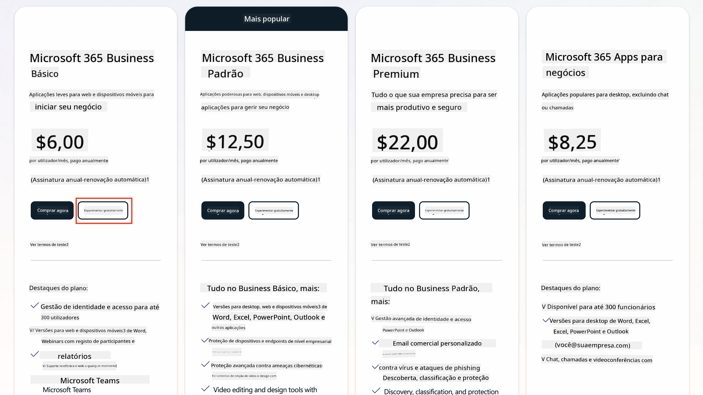  
   1. Após criar a sua nova conta, inicie sessão.

    !!! Tip
        Se planeia publicar agentes no Microsoft 365 Copilot Chat ou conectar-se a dados organizacionais (SharePoint, OneDrive, Dataverse), é necessária uma licença Microsoft 365 Copilot. Esta é uma licença adicional sobre a qual pode saber mais [no site de licenciamento](https://www.microsoft.com/microsoft-365/copilot#plans).

---

## Passo 2: Iniciar um teste do Copilot Studio

Depois de ter o seu Tenant do Microsoft 365, precisa de obter acesso ao Copilot Studio. Pode obter um teste gratuito de 30 dias seguindo estes passos:

1. Aceda a [aka.ms/TryCopilotStudio](https://aka.ms/TryCopilotStudio).  
1. Insira o endereço de email da nova conta configurada no passo anterior e selecione `Seguinte`.  
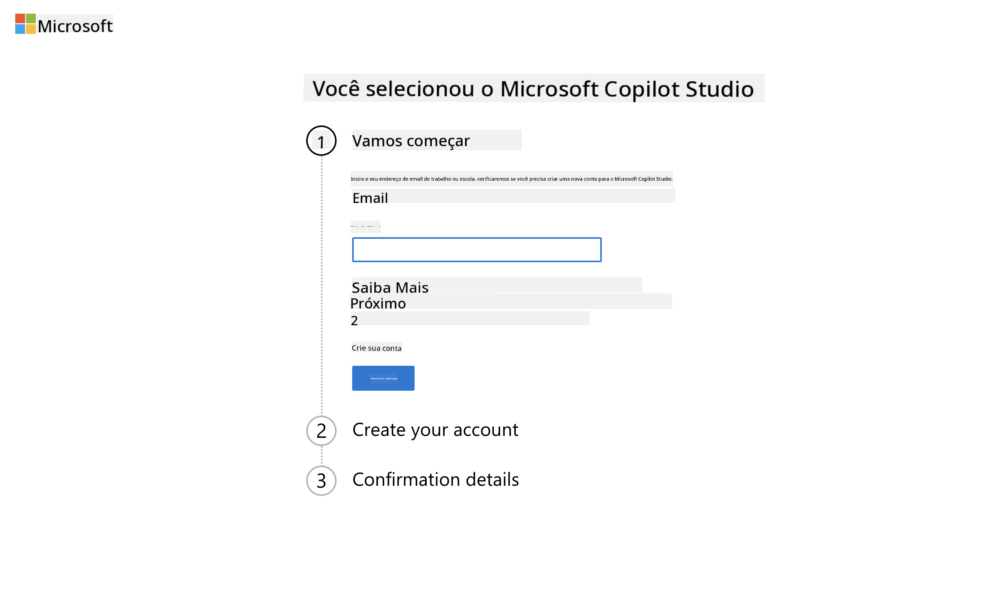  
1. O sistema deve reconhecer a sua conta. Selecione `Iniciar Sessão`.  
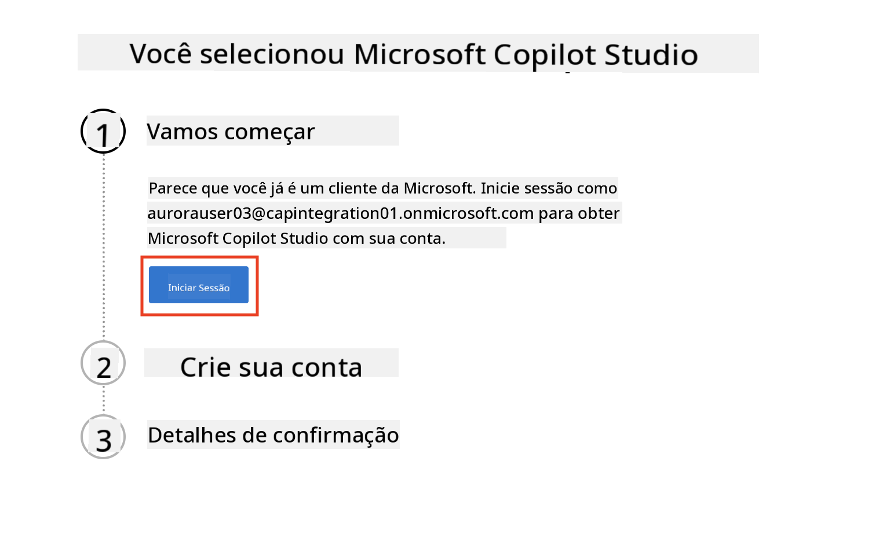  
1. Selecione `Iniciar Teste Gratuito`.  
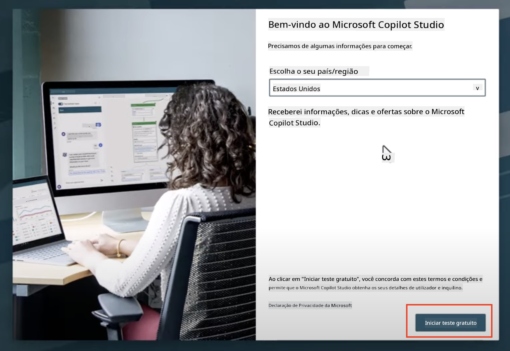

!!! info "Notas sobre o Teste"  
     1. O teste gratuito oferece **todas as funcionalidades do Copilot Studio**.  
     1. Receberá notificações por email sobre a expiração do teste. Pode estender o teste em incrementos de 30 dias (até 90 dias de tempo de execução do agente).  
     1. Se o administrador do seu tenant desativou o registo de autoatendimento, verá um erro—contacte o administrador do Microsoft 365 para reativá-lo.

---

## Passo 3: Criar novo ambiente de desenvolvimento

### Inscrever-se no Plano de Desenvolvedor do Power Apps

Usando o mesmo tenant do Microsoft 365 do Passo 1, inscreva-se no Plano de Desenvolvedor do Power Apps para criar um ambiente de desenvolvimento gratuito para construir e testar com o Copilot Studio.

1. Inscreva-se no [site do Plano de Desenvolvedor do Power Apps](https://aka.ms/PowerAppsDevPlan).

    - Insira o seu endereço de email  
    - Marque a caixa de seleção  
    - Selecione **Iniciar gratuito**  

    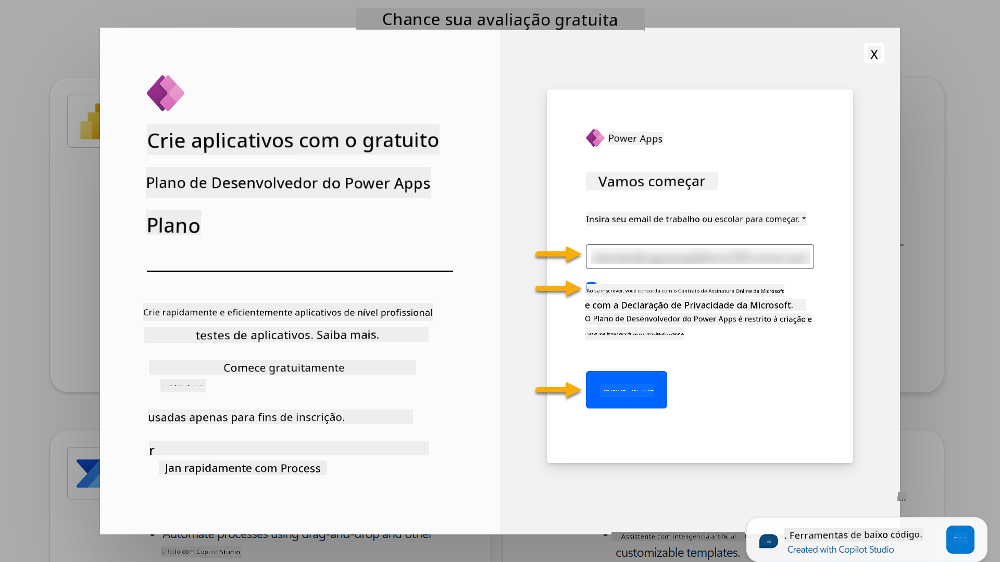

1. Após inscrever-se no Plano de Desenvolvedor, será redirecionado para [Power Apps](https://make.powerapps.com/). O ambiente usará o seu nome, por exemplo, **Ambiente de Adele Vance**. Se já existir um ambiente com esse nome, o novo ambiente de desenvolvedor será nomeado como **Ambiente de Adele Vance (1)**.

    Use este ambiente de desenvolvedor no Copilot Studio ao completar os laboratórios.

!!! Note
    Se estiver a usar uma conta Microsoft 365 existente e não criou uma no Passo 1, por exemplo - usando a sua própria conta na sua organização de trabalho, o administrador de TI (ou a equipa equivalente) que gere o seu tenant/ambientes pode ter desativado o processo de inscrição. Nesse caso, contacte o seu administrador ou crie um tenant de teste conforme o Passo 1.

---

## Passo 4: Criar novo site SharePoint

É necessário criar um novo site SharePoint que será usado em [Lição 06 - Criar um agente personalizado usando a experiência de criação conversacional com Copilot e baseando-o nos seus dados](../06-create-agent-from-conversation/README.md#62-add-an-internal-knowledge-source-using-a-sharepoint-site).

1. Selecione o ícone de waffle no canto superior esquerdo do Microsoft Copilot Studio para visualizar o menu. Selecione SharePoint no menu.

    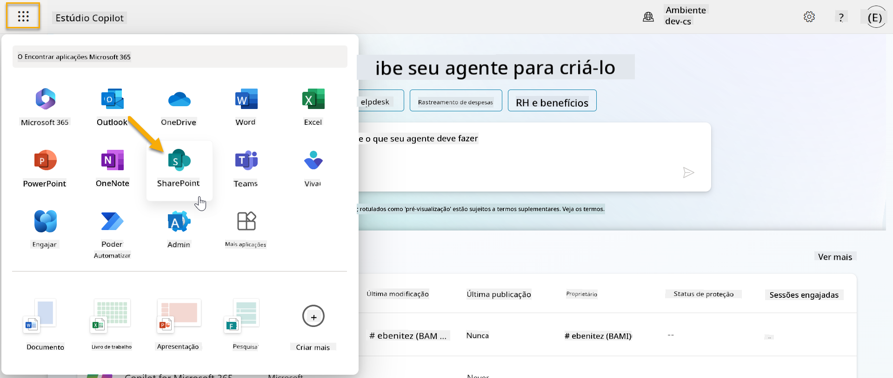

1. O SharePoint será carregado. Selecione **+ Criar site** para criar um novo site SharePoint.

    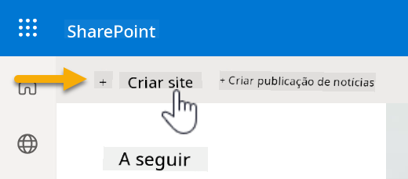

1. Aparecerá uma caixa de diálogo para guiá-lo na criação de um novo site SharePoint. Selecione **Site de equipa**.

    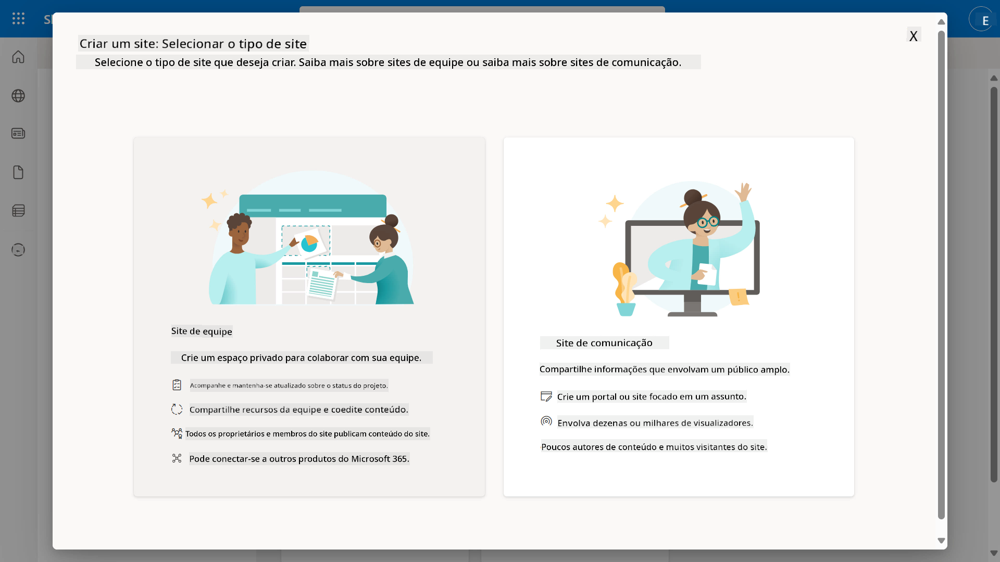

1. No próximo passo, uma lista de modelos da Microsoft será carregada por padrão. Desça e selecione o modelo **Help desk de TI**.

    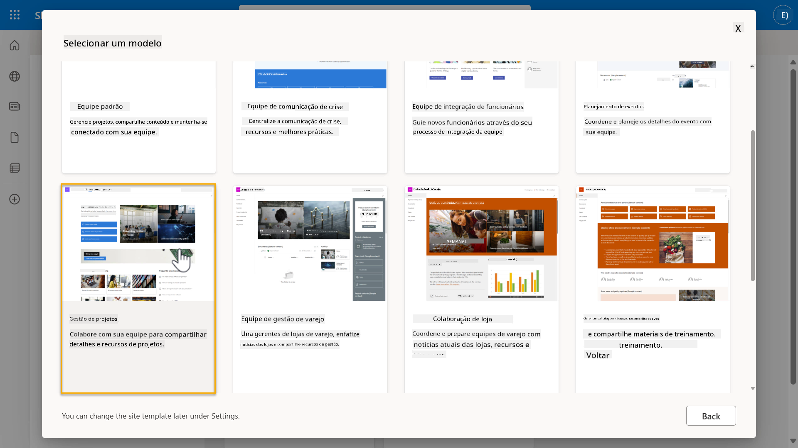

1. Selecione **Usar modelo** para criar um novo site SharePoint usando o modelo Help desk de TI.

    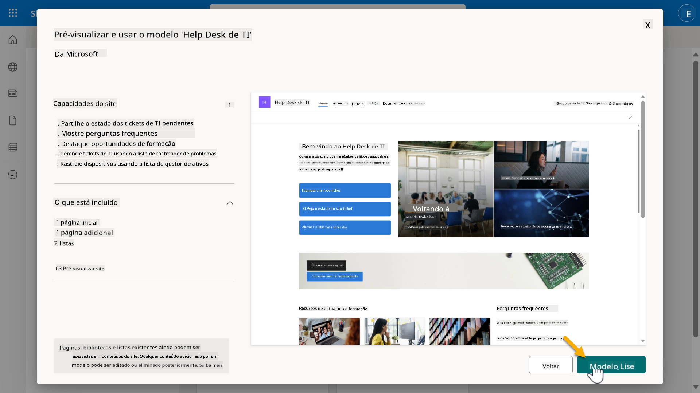

1. Insira as informações para o seu site. O seguinte é um exemplo:

    | Campo | Valor |
    | --- | --- |
    | Nome do site | Contoso IT |
    | Descrição do site | Copilot Studio para Iniciantes |
    | Endereço do site | ContosoIT |

    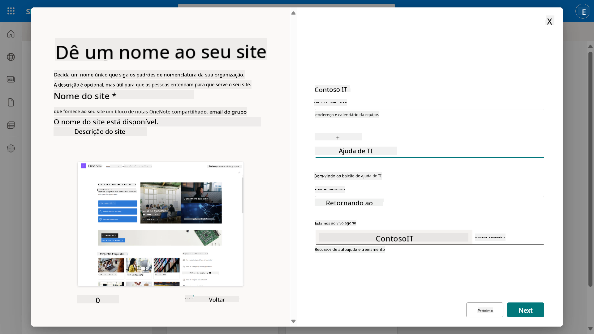

1. No passo final, pode selecionar um idioma para o site SharePoint. Por padrão será **Inglês**. Deixe o idioma como **Inglês** e selecione **Criar site**.

    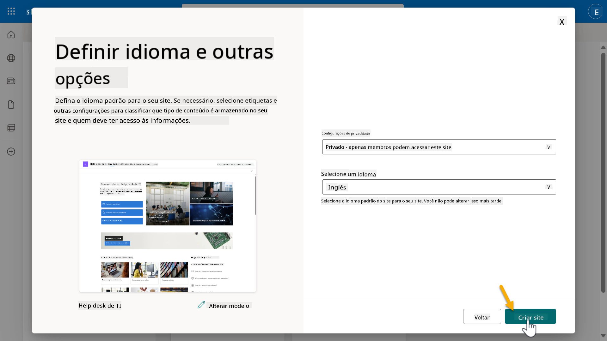

1. O site SharePoint será provisionado nos próximos segundos. Enquanto isso, pode optar por adicionar outros utilizadores ao seu site inserindo os seus endereços de email no campo **Adicionar membros**. Quando concluído, selecione **Concluir**.

    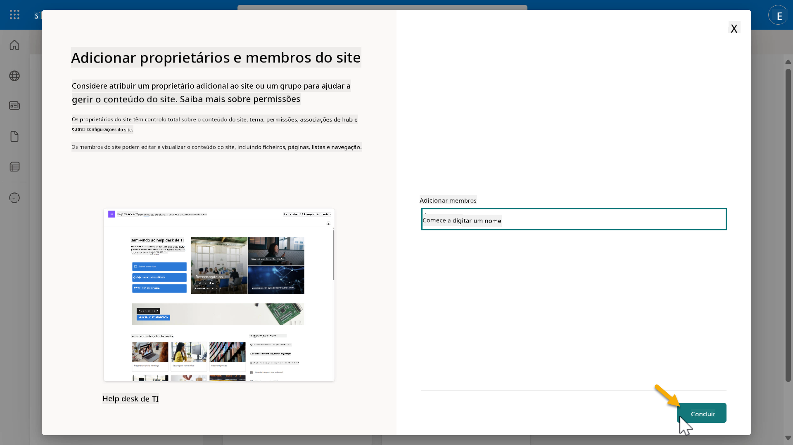

1. A página inicial do site SharePoint será carregada a seguir. **Copie** o URL do site SharePoint.

1. Este modelo fornece páginas com dados de exemplo sobre várias políticas de TI e duas listas de exemplo (Tickets e Dispositivos).

### Usar lista de Dispositivos do SharePoint

Usaremos a lista **Dispositivos** em [Missão 07 - Adicionar novo tópico com gatilho e nós](../07-add-new-topic-with-trigger/README.md#73-add-a-tool-using-a-connector).

### Adicionar nova coluna

Desloque-se até o lado direito da lista e selecione o botão **+ Adicionar coluna**. Escolha o tipo **hiperligação**, insira **Imagem** como nome da coluna e selecione adicionar.

### Criar dados de exemplo na lista de Dispositivos do SharePoint

Certifique-se de preencher esta lista com pelo menos 4 itens de dados de exemplo e adicione uma coluna adicional a esta lista.  

Ao adicionar dados de exemplo, certifique-se de que os seguintes campos estão preenchidos:

- Foto do dispositivo - use as imagens da [pasta de imagens de dispositivos](https://github.com/microsoft/agent-academy/tree/main/docs/recruit/00-course-setup/images/device-images)  
- Título  
- Estado  
- Fabricante  
- Modelo  
- Tipo de ativo  
- Cor  
- Número de série  
- Data de compra  
- Preço de compra  
- Número do pedido  
- Imagem - use os seguintes links  

|Dispositivo  |URL  |
|---------|---------|
|Surface Laptop 13     | [https://raw.githubusercontent.com/microsoft/agent-academy/refs/heads/main/docs/recruit/00-course-setup/images/device-images/Surface-Laptop-13.png](https://raw.githubusercontent.com/microsoft/agent-academy/refs/heads/main/docs/recruit/00-course-setup/images/device-images/Surface-Laptop-13.png)        |
|Surface Laptop 15     | [https://raw.githubusercontent.com/microsoft/agent-academy/refs/heads/main/docs/recruit/00-course-setup/images/device-images/Surface-Laptop-15.png](https://raw.githubusercontent.com/microsoft/agent-academy/refs/heads/main/docs/recruit/00-course-setup/images/device-images/Surface-Laptop-15.png)        |
|Surface Pro    | [https://raw.githubusercontent.com/microsoft/agent-academy/refs/heads/main/docs/recruit/00-course-setup/images/device-images/Surface-Pro-12.png](https://raw.githubusercontent.com/microsoft/agent-academy/refs/heads/main/docs/recruit/00-course-setup/images/device-images/Surface-Pro-12.png)        |
|Surface Studio    | [https://raw.githubusercontent.com/microsoft/agent-academy/refs/heads/main/docs/recruit/00-course-setup/images/device-images/Surface-Studio.png](https://raw.githubusercontent.com/microsoft/agent-academy/refs/heads/main/docs/recruit/00-course-setup/images/device-images/Surface-Studio.png)        |

---

## ✅ Missão Concluída

Você conseguiu:

- Configurar um ambiente de desenvolvimento do Microsoft 365  
- Ativar o teste do Copilot Studio  
- Criar um site SharePoint para basear os agentes  
- Preencher a lista de Dispositivos para uso em missões futuras  

Está oficialmente pronto para começar o seu **treino de agente nível Recruta** na [Lição 01](../01-introduction-to-agents/README.md).  

<!-- markdownlint-disable-next-line MD033 -->

---

**Aviso Legal**:  
Este documento foi traduzido utilizando o serviço de tradução por IA [Co-op Translator](https://github.com/Azure/co-op-translator). Embora nos esforcemos pela precisão, esteja ciente de que traduções automáticas podem conter erros ou imprecisões. O documento original na sua língua nativa deve ser considerado a fonte autoritária. Para informações críticas, recomenda-se uma tradução profissional realizada por humanos. Não nos responsabilizamos por quaisquer mal-entendidos ou interpretações incorretas decorrentes do uso desta tradução.