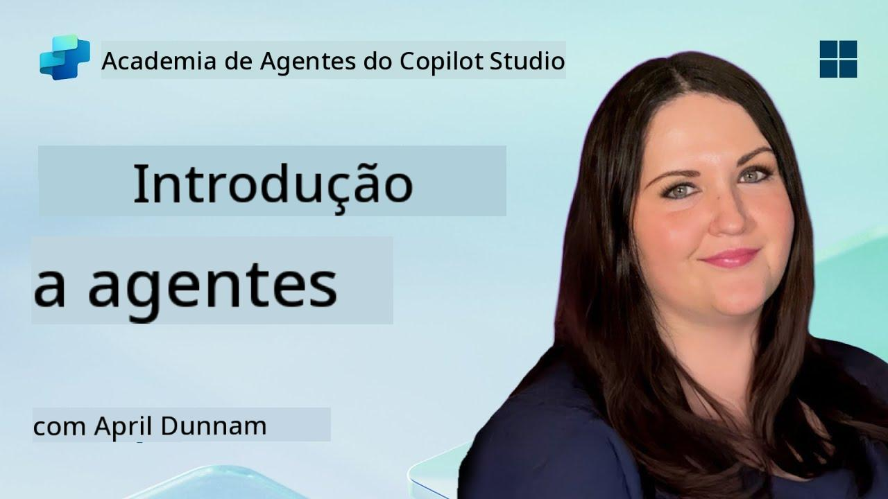

<!--
CO_OP_TRANSLATOR_METADATA:
{
  "original_hash": "d6706e107678264168d77b2e107710b1",
  "translation_date": "2025-10-18T03:03:01+00:00",
  "source_file": "docs/recruit/01-introduction-to-agents/README.md",
  "language_code": "pt"
}
-->
# 🚨 Missão 01: Introdução aos Agentes

## 🕵️‍♂️ CODINOME: `OPERAÇÃO DECIFRAR AGENTE DE IA`

> **⏱️ Duração da Operação:** `~30 minutos – apenas informações, sem trabalho de campo necessário`

🎥 **Assista ao Tutorial**

## 🎯 Resumo da Missão

Bem-vindo, recruta. Antes de começarmos a criar agentes, é importante que compreenda os conceitos de IA que os impulsionam. Esta missão irá equipá-lo com conhecimentos fundamentais sobre IA conversacional, modelos de linguagem extensivos (LLMs), geração aumentada por recuperação (RAG) e os tipos de agentes que pode criar no Copilot Studio.

## 🔎 Objetivos

Nesta missão, irá aprender:

1. O que é IA conversacional e por que é importante  
1. Como os Modelos de Linguagem Extensivos (LLMs) impulsionam experiências de chat  
1. O que a Geração Aumentada por Recuperação (RAG) oferece  
1. A diferença entre agentes conversacionais e agentes autónomos  
1. Como os agentes no Copilot Studio utilizam esses conceitos  

Vamos começar!

---

## O Que É IA Conversacional?

IA conversacional refere-se a qualquer sistema capaz de compreender, processar e responder à linguagem humana – seja texto ou fala – de forma natural. Pense em chatbots em centrais de atendimento ou assistentes pessoais virtuais nos seus aplicativos favoritos. Por trás da maioria das IAs conversacionais modernas estão os Modelos de Linguagem Extensivos (LLMs), que abordaremos a seguir.

### Por Que É Importante

- **Experiência do Utilizador:** Interfaces conversacionais são frequentemente mais intuitivas do que navegar por menus.  
- **Escalabilidade:** Um agente pode lidar com dezenas ou centenas de conversas simultâneas.  
- **Eficiência:** Em vez de criar scripts personalizados baseados em regras, os agentes impulsionados por LLMs adaptam-se dinamicamente às entradas dos utilizadores.  
- **Extensibilidade:** Com o design certo, os agentes podem acessar bases de conhecimento, conectar-se a APIs ou atuar como “colegas digitais” em fluxos de trabalho empresariais.

---

## Modelos de Linguagem Extensivos (LLMs) 101

No núcleo da maioria dos sistemas de IA conversacional estão os **Modelos de Linguagem Extensivos** – redes neurais treinadas em corpora massivos de texto. Eles aprendem padrões estatísticos da linguagem para gerar frases coerentes, responder a perguntas ou até mesmo criar ideias. Pontos-chave para entender:

1. **Dados de Treinamento:** Os LLMs processam terabytes de texto (páginas web, livros, artigos). Esse “conhecimento mundial” permite que respondam sobre muitos tópicos.  
1. **Tokenização:** O texto é dividido em unidades menores chamadas tokens (palavras, subpalavras ou caracteres). O modelo prevê um token de cada vez.  
1. **Janela de Contexto:** Cada LLM tem um limite de quantos tokens pode “ver” de uma vez. Além desse limite, os tokens anteriores são truncados.  
1. **Prompting:** Interage-se com um LLM enviando-lhe um prompt. Quanto melhor o prompt, mais focada e relevante será a resposta.  
1. **Zero-shot vs. Fine-tuning:** Zero-shot significa usar um LLM como está (apenas os pesos brutos). Fine-tuning significa ajustar o modelo com dados específicos do domínio para que responda com maior precisão às suas necessidades.

!!! Tip "Dica Profissional"
    Uma analogia comum é que um LLM é como um “autocompletar superinteligente”. Ele não compreende verdadeiramente o significado como um cérebro humano, mas é extremamente bom em prever a próxima melhor palavra (ou frase) numa sequência.

---

## Geração Aumentada por Recuperação (RAG)

Quando os LLMs dependem apenas de dados de treinamento estáticos, podem gerar informações erradas ou desatualizadas. O RAG resolve isso permitindo que o modelo “procure” informações atualizadas antes de compor uma resposta. Em termos gerais, o RAG funciona assim:

1. **Consulta do Utilizador:** Um utilizador faz uma pergunta (ex.: “Qual é a última atualização sobre os lucros trimestrais da Contoso?”).  
1. **Passo de Recuperação:** O sistema consulta uma fonte de conhecimento (documentos, bases de dados internas, bibliotecas do SharePoint, etc.) para encontrar trechos relevantes.  
1. **Aumento:** Os trechos recuperados são anexados ou precedidos ao prompt do LLM.  
1. **Geração:** O LLM processa tanto a pergunta do utilizador quanto o contexto recuperado, gerando uma resposta fundamentada em dados atualizados.  

Com o RAG, o seu agente pode consultar wikis internos da empresa, APIs de plugins ou pesquisar numa base de conhecimento de FAQs – e retornar respostas que não estão limitadas aos parâmetros estáticos do modelo.

---

## Agentes Conversacionais vs. Agentes Autónomos

No contexto do Copilot Studio, o termo **agente** pode referir-se a diferentes tipos de assistentes de IA. É útil distinguir entre:

**Agentes Conversacionais:**

- Focam-se principalmente no diálogo bidirecional.  
- Mantêm o contexto ao longo de várias interações numa conversa.  
- Geralmente orquestrados por fluxos ou gatilhos predefinidos (ex.: “Se o utilizador disser X, responda com Y”).  
- Ideais para suporte ao cliente, FAQs, interações guiadas, agendamento ou perguntas e respostas simples.  
  - Exemplos:
    - Um chatbot no Teams que responde a perguntas sobre políticas de RH.  
    - Um bot do Power Virtual Agents numa página do SharePoint para guiar utilizadores através de um formulário.  

**Agentes Autónomos:**

- Vão além do chat; podem **tomar ações** em nome do utilizador.  
- Utilizam ciclos de raciocínio de LLM (pense em “planejar → agir → observar → replanejar”) para concluir tarefas.  
- Conectam-se a ferramentas ou APIs externas (ex.: chamar um fluxo do Power Automate, enviar convites de calendário, manipular dados no Dataverse).  
- Operam sem prompts humanos constantes – uma vez ativados, podem lidar com processos de múltiplas etapas de forma autónoma.  
  - Exemplos:  
    - Um agente que gera um itinerário de viagem, reserva voos e envia confirmações por email.  
    - Um agente “Resumidor de Reuniões” que participa numa chamada do Teams, transcreve em tempo real e escreve um resumo executivo no OneNote.  

!!! Info "Diferença Principal"
    Agentes conversacionais esperam pela entrada do utilizador e mantêm-se no diálogo. Agentes autónomos planeiam e executam proativamente uma sequência de passos utilizando acesso a ferramentas mais amplas.

---

## Agentes no Copilot Studio

O **Copilot Studio** unifica cenários conversacionais e autónomos num único framework. Eis como o Copilot Studio ajuda a criar agentes:

1. **Designer Visual de Agentes:** Um canvas de baixo código para definir prompts, memória e ferramentas para fluxos de trabalho de chat e ação.  
1. **Configurações de LLM:** Escolha entre vários modelos da OpenAI ou o GPT de nível empresarial da Microsoft para atender às suas necessidades de desempenho e custo.  
1. **Conectores de Recuperação:** Integrações pré-construídas para SharePoint, OneDrive, Azure Cognitive Search e Dataverse, permitindo RAG de forma nativa.  
1. **Ferramentas e Funções Personalizadas:** Defina ações HTTP personalizadas ou fluxos do Power Automate que o seu agente pode invocar autonomamente.  
1. **Suporte Multimodal:** Além de texto, os agentes do Copilot Studio podem processar imagens, ficheiros ou dados estruturados para enriquecer o contexto.  
1. **Publicação e Distribuição:** Quando o seu agente estiver pronto, pode publicá-lo no Microsoft 365 Copilot (para que os utilizadores o ativem no Teams, SharePoint, Outlook, etc.) ou incorporá-lo como um widget de chat autónomo numa página web.

---

## 🎉 Missão Concluída

Agora concluiu a sua introdução aos agentes e aos conceitos fundamentais de IA. Compreendeu:

1. **LLMs = O “Cérebro” do Seu Agente**  
   - Responsável pela compreensão e geração de linguagem.  
   - Mais tokens = contexto mais rico, mas também maior custo por chamada.  

1. **RAG = Integração de Conhecimento em Tempo Real**  
   - Preenche a lacuna entre um LLM estático e fontes de dados em constante mudança.  
   - Recupera e insere documentos ou registos relevantes no prompt do LLM.  

1. **Conversacional vs. Autónomo**  
   - **Conversacional:** Foco no fluxo de diálogo e na preservação do contexto (ex.: “Memória de Sessão”).  
   - **Autónomo:** Adiciona “Blocos de Ação” que permitem ao agente aceder a ferramentas ou serviços externos.

---
A seguir, irá explorar os [fundamentos do Copilot Studio](../02-copilot-studio-fundamentals/README.md)!

Mantenha-se atento, recruta - a sua jornada com IA está apenas a começar!

## 📚 Recursos Táticos

🔗 [Página Inicial da Documentação do Copilot Studio](https://learn.microsoft.com/microsoft-copilot-studio/)

---

---

**Aviso Legal**:  
Este documento foi traduzido utilizando o serviço de tradução por IA [Co-op Translator](https://github.com/Azure/co-op-translator). Embora nos esforcemos pela precisão, esteja ciente de que traduções automáticas podem conter erros ou imprecisões. O documento original na sua língua nativa deve ser considerado a fonte autoritária. Para informações críticas, recomenda-se uma tradução profissional realizada por humanos. Não nos responsabilizamos por quaisquer mal-entendidos ou interpretações incorretas decorrentes do uso desta tradução.