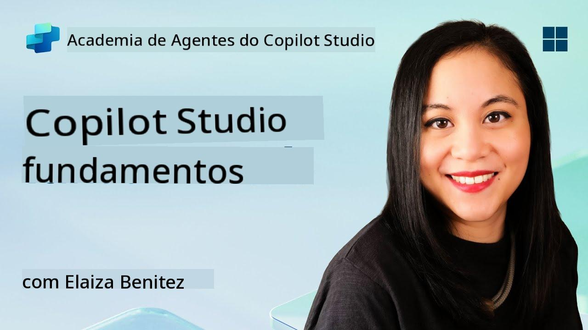
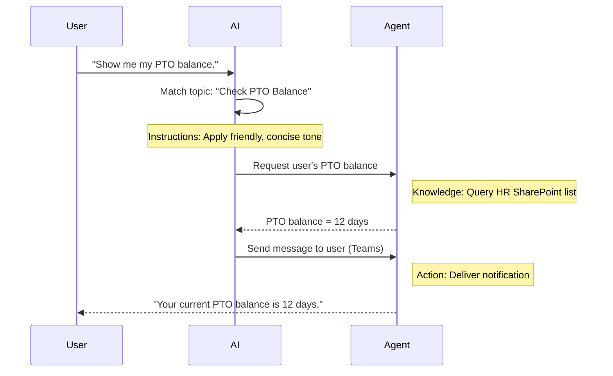

<!--
CO_OP_TRANSLATOR_METADATA:
{
  "original_hash": "90a3c5122f5687bbc8cc819990f175d4",
  "translation_date": "2025-10-18T03:03:54+00:00",
  "source_file": "docs/recruit/02-copilot-studio-fundamentals/README.md",
  "language_code": "pt"
}
-->
# 🚨 Missão 02: Fundamentos do Copilot Studio

## 🕵️‍♂️ CODINOME: `OPERAÇÃO PROTOCOLO CENTRAL`

> **⏱️ Duração da Operação:** `~30 minutos – apenas informações, sem trabalho de campo`  

🎥 **Assista ao Tutorial**

[](https://www.youtube.com/watch?v=x4OCwDRGeLE "Assista ao tutorial no YouTube")

## 🎯 Resumo da Missão

Bem-vindo, recruta. Esta missão irá fornecer informações fundamentais para entender como o Copilot Studio funciona e como criar agentes inteligentes que gerem valor real para os negócios.

Antes de criar o seu primeiro agente, é necessário compreender os quatro componentes principais que compõem cada agente de IA personalizado: Conhecimento, Ferramentas, Tópicos e Instruções. Você também aprenderá como esses elementos trabalham juntos no orquestrador do Copilot Studio.

## 🔎 Objetivos

Nesta missão, você irá:

- **Aprender o que é o Copilot Studio**
- **Entender quando e por que usar agentes**
- **Explorar os quatro blocos de construção dos agentes**
      - **Conhecimento**
      - **Ferramentas**
      - **Tópicos**
      - **Instruções**
- **Compreender como esses componentes trabalham juntos** para criar um agente inteligente e automatizado

---

## O que são Agentes no Copilot Studio?

Um **agente** é um assistente de IA especializado que você projeta para lidar com tarefas ou consultas específicas. Diferente de um chatbot genérico, o seu agente:

- **Conhece dados específicos da empresa** (políticas, documentos, bases de dados)  
- **Realiza tarefas do mundo real** (envia mensagens, cria eventos no calendário, atualiza registros)  
- **Mantém o contexto da conversa** para poder dar continuidade a perguntas anteriores  

Como o Copilot Studio é de baixo código, você pode arrastar e soltar componentes pré-construídos—não são necessárias habilidades avançadas de programação. Depois de criar o seu agente, as pessoas podem utilizá-lo no Teams, Slack ou até mesmo em uma página web personalizada para obter respostas ou acionar fluxos de trabalho automaticamente.

---

## Quando e Por Que Usar o Copilot Studio

Embora o Microsoft 365 Copilot ofereça assistência geral de IA em aplicativos do Office, você precisará de um agente personalizado quando:

### Você precisa de conhecimento específico do domínio

- O Copilot padrão pode não conhecer os procedimentos internos ou dados da sua empresa. Um agente pode consultar os seus sites do SharePoint, bases de dados ou fontes personalizadas para fornecer respostas precisas e atualizadas.  

### Você quer automatizar fluxos de trabalho com várias etapas

- Por exemplo: "Quando alguém submeter uma despesa, envie para aprovação, atualize o rastreador financeiro e notifique o gestor." Um agente personalizado pode cuidar de cada etapa, acionado por um único comando ou evento.  

### Você precisa de uma experiência contextual, integrada na ferramenta  

- Imagine um agente de integração de novos funcionários no Teams que orienta a equipe de RH sobre cada política, envia os formulários necessários e agenda reuniões de orientação—diretamente na sua plataforma de colaboração existente.  

---

## Quatro Blocos de Construção de um Agente

Cada agente do Copilot Studio é construído a partir de quatro componentes principais:

1. **Conhecimento**  
1. **Ferramentas (Ações)**  
1. **Tópicos**  
1. **Instruções**

Abaixo, definiremos cada bloco de construção e mostraremos como eles trabalham juntos para criar um agente eficaz.

### 1. Conhecimento

**Conhecimento** é o conjunto de dados e contexto que o seu agente utiliza para responder às perguntas com precisão. Ele possui duas partes:

#### Instruções Personalizadas e Contexto

- Você escreve uma breve descrição do propósito e tom do agente. Por exemplo:  

    ```text
    You are an IT support agent. You help employees troubleshoot common software issues, provide troubleshooting steps, and escalate urgent tickets.
    ```

- Durante uma conversa, o agente lembra-se das interações anteriores para poder referir-se ao que já foi discutido (por exemplo, se o utilizador disser primeiro: "A minha impressora está offline," e depois perguntar: "Verificou o nível de tinta?", o agente recorda o contexto da impressora).

#### Fontes de Conhecimento (Dados Fundamentais)

- Você conecta o seu agente a várias fontes de dados—bibliotecas do SharePoint, sites de documentação, wikis ou outras bases de dados.  
- Quando um utilizador faz uma pergunta, o agente extrai trechos relevantes dessas fontes para que as respostas sejam **fundamentadas** nas políticas, manuais de produtos ou qualquer informação proprietária da sua organização.  
- Você pode até forçar o agente a responder apenas com informações dessas fontes, evitando que ele adivinhe ou "invente" respostas.

!!! example
    Um agente "Assistente de Políticas" pode estar conectado ao site de RH do SharePoint. Se um utilizador perguntar: "Qual é a nossa taxa de acumulação de férias?", o agente recupera o texto exato do documento de política de RH em vez de confiar numa resposta genérica de IA.

---

### 2. Ferramentas (Ações)

**Ferramentas (Ações)** definem o que o agente pode fazer além de conversar. Cada ação é uma tarefa que o agente executa programaticamente, como:

- Enviar um email ou mensagem no Teams  
- Criar ou atualizar um evento no calendário  
- Adicionar ou editar um registro numa base de dados (por exemplo, uma lista do SharePoint ou tabela do Dataverse)  
- Acionar um fluxo do Power Automate ou uma API REST  

#### Como as Ações Funcionam

- **Definir Entradas e Saídas**  
      - Por exemplo, uma ação de Enviar Email pode exigir:  
        - `RecipientEmailAddress`  
        - `SubjectLine`  
        - `EmailBody`  

- **Combinar Ações em Fluxos de Trabalho**  
      - Muitas vezes, atender a uma solicitação do utilizador envolve várias etapas.  
      - Você pode sequenciar ações para que:  
             1. O agente recupere dados de uma lista do SharePoint.  
             2. Gere um resumo usando o LLM.  
             3. Envie uma mensagem no Teams com esse resumo.  

- **Conectar-se a Sistemas Externos**  
      - Se precisar atualizar um CRM ou acionar uma API interna, crie uma ação personalizada para isso.  
      - O Copilot Studio pode integrar-se com a Power Platform ou qualquer endpoint baseado em HTTP.

!!! example "Um agente "Assistente de Despesas" poderia:"  
    1. Ouvir uma solicitação de "Submeter Despesa".  
    2. Obter os detalhes da despesa do utilizador a partir de um formulário.  
    3. Usar uma ação "Adicionar à Lista do SharePoint" para armazenar os dados.  
    4. Acionar uma ação "Enviar Email" para notificar o aprovador.  

---

### 3. Tópicos

**Tópicos** definem os gatilhos de conversação ou pontos de entrada para o seu agente. Cada tópico corresponde a uma funcionalidade ou categoria de pergunta.

#### Gatilhos de Conversação  

- Um tópico pode ser "Submeter Ticket de TI," "Verificar Saldo de Férias," ou "Criar Relatório de Vendas."  
- Nos bastidores, o Copilot Studio usa **orquestração generativa**: em vez de depender de palavras-chave exatas, a IA interpreta a intenção do utilizador e escolhe o tópico certo com base numa breve descrição que você fornece.  

#### Descrições de Tópicos  

- Em cada tópico, você escreve uma descrição clara e concisa do que aquele tópico abrange.

!!! example "Exemplo de descrição de tópico"
    Este tópico ajuda os utilizadores a submeter um ticket de suporte de TI, coletando os detalhes do problema, prioridade e informações de contato.

- A IA usa essa descrição para decidir quando ativar este tópico, mesmo que a formulação do utilizador não corresponda exatamente.

#### Mapeamento de Tópicos para Ações  

- Cada tópico está conectado a uma ou mais ações ou etapas de recuperação de dados.  
- Quando a IA escolhe um tópico, ela orienta a conversa através da sequência que você definiu (faz perguntas de acompanhamento, aciona ações, retorna resultados).

!!! example
    Se um utilizador disser: "Preciso de ajuda para configurar o meu novo portátil," a IA pode associar essa intenção ao tópico "Submeter Ticket de TI." O agente então solicita o modelo do portátil, os detalhes do utilizador e insere automaticamente um ticket no sistema de suporte técnico.

---

### 4. Instruções

**Instruções** (às vezes chamadas de "Prompts" ou "Mensagens do Sistema") orientam o tom, estilo e limites do LLM. Elas moldam como o agente responde em qualquer situação.

#### Papel e Persona  

- Você diz à IA quem ela é (por exemplo, "Você é um agente de atendimento ao cliente da Contoso Retail").  
- Isso define o tom—amigável, conciso, formal ou casual—dependendo do seu caso de uso.

#### Diretrizes de Resposta  

- Especifique quaisquer regras que o agente deve seguir, como:  
      - "Sempre resuma informações de políticas em tópicos."  
      - "Se não souber a resposta, diga ‘Desculpe, não tenho essa informação.’"  
      - "Nunca inclua dados confidenciais fora do contexto."

#### Regras de Memória e Contexto

- Você pode instruir o agente sobre quantas interações da conversa ele deve lembrar.  
- Por exemplo: "Lembre-se dos detalhes das solicitações deste utilizador por até três perguntas de acompanhamento."

!!! example "Num agente "Consultor de Benefícios", você pode incluir:"
    "Sempre consulte o manual mais recente de RH ao responder perguntas. Se perguntarem sobre prazos de inscrição, forneça as datas específicas da política. Mantenha as respostas com menos de 150 palavras."

---

## Como os Quatro Blocos de Construção Trabalham Juntos

Quando você combina **Conhecimento**, **Ferramentas**, **Tópicos** e **Instruções**, o orquestrador de IA do Copilot Studio cria um agente que:

1. **Identifica um Tópico relevante** (guiado pelas descrições dos tópicos).  
1. **Aplica Instruções** para definir o tom, decidir quando fazer perguntas de acompanhamento e aplicar regras.  
1. **Utiliza Fontes de Conhecimento** para fundamentar suas respostas nos dados da sua organização.  
1. **Aciona Ferramentas (Ações)** conforme necessário para realizar tarefas—enviar mensagens, atualizar registros ou invocar APIs.  

Nos bastidores, o orquestrador usa uma abordagem de **planeamento generativo**: ele decide quais etapas tomar, em que ordem, para atender a uma solicitação do utilizador. Se uma ação falhar (por exemplo, um email não puder ser enviado), o agente segue as diretrizes de tratamento de exceções (faz uma pergunta de esclarecimento ou relata o erro). Como o LLM se adapta ao contexto da conversa, o agente pode manter a memória ao longo de várias interações e incorporar novas informações conforme a conversa se desenrola.

**Exemplo de Fluxo Visual:**  
<!--
1. **Utilizador:** "Mostre-me o meu saldo de férias."
1. **IA (Tópicos):** Associa ao tópico "Verificar Saldo de Férias".  
1. **IA (Instruções):** Usa um tom amigável e conciso.  
1. **Agente (Conhecimento):** Consulta a lista de RH no SharePoint para obter o saldo do utilizador.  
1. **Agente (Ações):** Recupera o valor e envia uma mensagem no Teams:  
   > "O seu saldo atual de férias é de 12 dias."  
-->



---

## 🎉 Missão Concluída

Você concluiu com sucesso o briefing de fundamentos. Agora, aprendeu os quatro blocos essenciais de qualquer agente no Copilot Studio:

1. **Conhecimento** – Onde o agente consulta informações factuais e mantém a memória da conversa.  
1. **Ferramentas** – As tarefas que o agente pode realizar para automatizar ações.  
1. **Tópicos** – Como o agente reconhece a intenção do utilizador e decide qual fluxo de trabalho executar.  
1. **Instruções** – As regras, tom e limites que orientam cada resposta.

Com esses componentes em funcionamento, você pode criar um agente básico que responde a perguntas e executa fluxos de trabalho simples. Na próxima lição, vamos passar por um tutorial passo a passo para criar um agente "Service Desk"—desde a conexão com a sua primeira fonte de conhecimento até a definição de um tópico e a configuração de uma ação.

A seguir: Você criará o seu [primeiro agente declarativo para o M365 Copilot](../03-create-a-declarative-agent-for-M365Copilot/README.md).

<!-- markdownlint-disable-next-line MD033 -->


---

**Aviso Legal**:  
Este documento foi traduzido utilizando o serviço de tradução por IA [Co-op Translator](https://github.com/Azure/co-op-translator). Embora nos esforcemos pela precisão, esteja ciente de que traduções automáticas podem conter erros ou imprecisões. O documento original na sua língua nativa deve ser considerado a fonte autoritária. Para informações críticas, recomenda-se uma tradução profissional realizada por humanos. Não nos responsabilizamos por quaisquer mal-entendidos ou interpretações incorretas decorrentes do uso desta tradução.