<!--
CO_OP_TRANSLATOR_METADATA:
{
  "original_hash": "0c51aabca81d6256990caf4c015e6195",
  "translation_date": "2025-10-18T02:55:45+00:00",
  "source_file": "docs/recruit/04-creating-a-solution/README.md",
  "language_code": "pt"
}
-->
# 🚨 Missão 04: Criar uma Solução para o Seu Agente

## 🕵️‍♂️ CODINOME: `OPERAÇÃO CTRL-ALT-PACKAGE`

> **⏱️ Duração da Operação:** `~45 minutos`

🎥 **Assista ao Tutorial**

[](https://www.youtube.com/watch?v=1iATbkgfcpU "Assista ao tutorial no YouTube")

## 🎯 Resumo da Missão

Criador de Agentes, bem-vindo à sua próxima operação tática. Nesta missão, você aprenderá a montar uma Solução - o veículo oficial de implantação para o seu Agente de Helpdesk de TI criado com o Microsoft Copilot Studio. Pense nisso como criar uma mala digital que guarda o seu agente e seus artefatos.

Todo agente precisa de um lar bem estruturado. É isso que uma solução do Power Platform oferece - organização, portabilidade e prontidão para produção.

Vamos começar a empacotar.

## 🔎 Objetivos

Nesta missão, você aprenderá:

1. Compreender o que são soluções do Power Platform e seu papel no desenvolvimento de agentes
1. Aprender os benefícios de usar soluções para organizar e implantar agentes
1. Explorar publicadores de soluções e sua importância na gestão de componentes
1. Entender o ciclo de vida das soluções do Power Platform, do desenvolvimento à produção
1. Criar seu próprio publicador de soluções e solução personalizada para o seu Agente de Helpdesk de TI

## 🕵🏻‍♀️ Solução? O que é isso?

No Microsoft Power Platform, soluções são como contêineres ou pacotes que armazenam todas as partes dos seus aplicativos ou agentes - isso pode incluir tabelas, formulários, fluxos e lógica personalizada. Soluções são essenciais para a Gestão do Ciclo de Vida de Aplicativos (ALM), permitindo que você gerencie seu aplicativo e agentes desde a ideia até o desenvolvimento, teste, implantação e atualizações.

No Copilot Studio, cada agente que você cria é armazenado em uma solução do Power Platform. Por padrão, os agentes são criados na solução padrão, a menos que você crie uma nova solução personalizada para criar seu agente. É isso que vamos aprender 🤓 nesta lição e no laboratório prático.

Tradicionalmente, as soluções eram criadas no **portal de criação do Power Apps** - uma interface baseada na web onde você pode construir e personalizar aplicativos, Dataverse, fluxos, explorar componentes de IA e muito mais.

   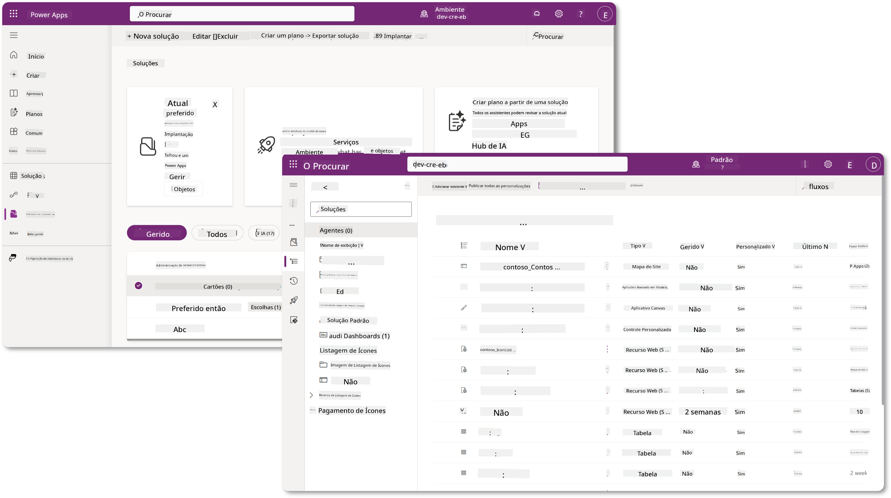

No Copilot Studio, agora existe o **Explorador de Soluções**, onde você pode gerenciar suas soluções diretamente. Não é mais necessário alternar para o portal de criação do Power Apps para gerenciar suas soluções, isso pode ser feito diretamente no Copilot Studio 🪄

Isso significa que você pode realizar as tarefas habituais relacionadas a soluções:

- **Criar uma solução** - soluções personalizadas permitem que agentes sejam exportados e importados entre ambientes.
- **Definir sua solução preferida** - escolha a solução na qual agentes, aplicativos, etc. serão criados por padrão.
- **Adicionar ou remover componentes** - seu agente pode estar referenciando outros componentes, como variáveis de ambiente ou fluxos na nuvem. Portanto, esses componentes precisam ser incluídos na solução.
- **Exportar soluções** - para mover soluções para outro ambiente de destino.
- **Importar soluções** - importar soluções criadas em outro lugar, incluindo atualizações ou upgrades de soluções.
- **Criar e gerenciar pipelines de soluções** - automatizar a implantação de soluções entre ambientes.
- **Integração com Git** - permite que desenvolvedores conectem soluções com repositórios Git para controle de versão, colaboração e ALM. Destinado a ser usado apenas em ambientes de desenvolvimento.

   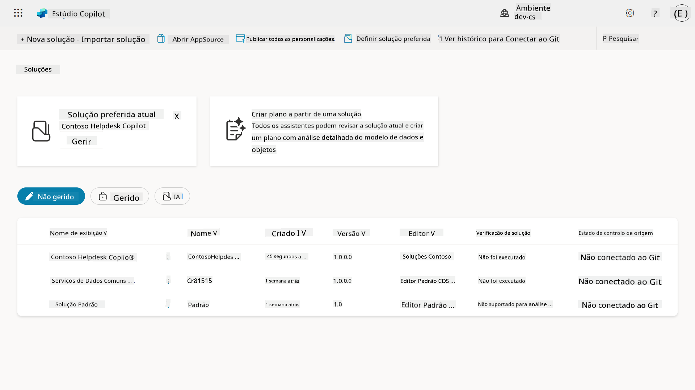

Existem dois tipos de soluções:

- **Soluções não geridas** - usadas durante o desenvolvimento. Você pode editar e personalizar livremente conforme necessário.
- **Soluções geridas** - usadas quando você está pronto para implantar seu aplicativo para teste ou produção. Estas são bloqueadas para evitar alterações acidentais.

## 🤔 Por que _devo_ usar uma Solução para meu agente?

Pense nas Soluções como uma _caixa de ferramentas_. Quando você precisa consertar ou construir algo (um agente) em um local diferente (ambiente), você reúne todas as ferramentas necessárias (componentes) e as coloca na sua caixa de ferramentas (Solução). Você pode então levar essa caixa de ferramentas para o novo local (ambiente) e usar as ferramentas (componentes) para concluir seu trabalho ou adicionar novas ferramentas (componentes) para personalizar seu agente ou projeto que está construindo.

!!! quote "Elaiza, sua defensora da nuvem amigável aparecendo aqui 🙋🏻‍♀️ para compartilhar algumas palavras:"
    Temos um ditado na Nova Zelândia, "Seja um Kiwi organizado!" que é um chamado para os neozelandeses 🥝 assumirem a responsabilidade pelo seu ambiente, descartando o lixo corretamente e mantendo os espaços públicos limpos. Podemos usar o mesmo contexto para agentes, mantendo tudo relacionado ao seu agente organizado e portátil, e isso ajudará você a manter um ambiente organizado.

É uma boa prática criar um agente em uma solução dedicada no seu ambiente de origem (desenvolvedor). Aqui está o motivo pelo qual as soluções são valiosas:

🧩 **Desenvolvimento organizado**

- Você mantém seu agente separado da solução padrão, que contém tudo no ambiente. Todos os componentes do seu agente estão em um só lugar 🎯

- Tudo o que você precisa para seu agente está em uma solução, facilitando a exportação e importação para um ambiente de destino 👉🏻 isso é um hábito saudável de ALM.

🧩 **Implantação segura**

- Você pode exportar seu aplicativo ou agente como uma solução gerida e implantá-lo em outros ambientes de destino (como teste ou produção) sem risco de edições acidentais.

🧩 **Controle de versão**

- Você pode criar patches (correções específicas), atualizações (uma mudança mais abrangente) ou upgrades (substituir uma solução - geralmente mudanças importantes e introdução de novos recursos).

- Ajuda a implementar mudanças de forma controlada.

🧩 **Gestão de dependências**

- Soluções rastreiam quais partes dependem de outras. Isso evita que você quebre algo ao fazer alterações.

🧩 **Colaboração em equipe**

- Desenvolvedores e criadores podem trabalhar juntos usando soluções não geridas no desenvolvimento e, em seguida, entregar uma solução gerida para implantação.

## 🪪 Compreendendo os Publicadores de Soluções

Um Publicador de Soluções no Power Platform é como um rótulo ou marca que identifica quem criou ou possui uma solução. É uma parte pequena, mas importante, da gestão de seus aplicativos, agentes e personalizações de fluxo, especialmente ao trabalhar em equipes ou entre ambientes.

Quando você cria uma solução, deve escolher um publicador. Este publicador define:

- Um prefixo que é adicionado a todos os componentes personalizados (como tabelas, campos e fluxos).

- Um nome e informações de contato para a organização ou pessoa que possui a solução.

### 🤔 Por que isso é importante?

1. **Identificação fácil** - o prefixo (Exemplo - `new_` ou `abc_`) ajuda a identificar rapidamente quais componentes pertencem a qual solução ou equipe.

1. **Evita conflitos** - se duas equipes criarem uma coluna chamada status, seus prefixos (`teamA_status`, `teamB_status`) evitam colisões de nomes.

1. **Suporta ALM** - ao mover soluções entre ambientes (Dev → Test → Prod), o publicador ajuda a rastrear a propriedade e manter a consistência.

### ✨ Exemplo

Digamos que você crie um publicador chamado Contoso Solutions com o prefixo `cts_`.

Se você adicionar uma coluna personalizada chamada _Prioridade_, ela será armazenada como `cts_Prioridade` na solução.

Qualquer pessoa que encontrar a coluna no nível da solução, independentemente do ambiente em que estiver, poderá identificá-la facilmente como uma coluna associada à Contoso Solutions.

## 🧭 Ciclo de vida da Solução do Power Platform

Agora que você entende o propósito de uma Solução, vamos aprender sobre o ciclo de vida.

**1. Criar Solução no ambiente de Desenvolvimento** - comece criando uma nova solução no seu ambiente de Desenvolvimento.

**2. Adicionar Componentes** - adicione aplicativos, fluxos, tabelas e outros elementos à sua solução.

**3. Exportar como solução gerida** - empacote sua solução para implantação exportando-a como uma solução gerida.

**4. Importar para o ambiente de Teste** - teste sua solução em um ambiente de Teste separado para garantir que tudo funcione como esperado.

**5. Importar para o ambiente de Produção** - implante a solução testada no seu ambiente de Produção ao vivo.

**6. Aplicar Patches, Atualizações ou Upgrades** - faça melhorias ou correções usando patches, atualizações ou upgrades. 🔁 Repita o ciclo!

### ✨ Exemplo

Imagine que você está criando um agente de helpdesk de TI para ajudar os funcionários com problemas como problemas de dispositivos, solução de problemas de rede, configuração de impressoras e mais.

- Você começa em um ambiente de Desenvolvimento usando uma solução não gerida.

- Quando estiver pronto, você exporta como uma solução gerida e a importa para um ambiente de destino, como um ambiente de Teste de Sistema ou Teste de Aceitação do Usuário (UAT).

- Após os testes, você a move para o ambiente de Produção - tudo isso sem tocar na versão original de desenvolvimento.

## 🧪 Laboratório 04: Criar uma nova Solução

Agora vamos aprender

- [4.1 Como criar um publicador de Solução](../../../../../docs/recruit/04-creating-a-solution)
- [4.2 Como criar uma Solução](../../../../../docs/recruit/04-creating-a-solution)

Vamos seguir o exemplo anterior, onde vamos criar uma solução no ambiente dedicado do Copilot Studio para construir nosso agente de helpdesk de TI.

Vamos começar!

### Pré-requisitos

#### Função de segurança

No Copilot Studio, o que você _pode fazer_ no explorador de soluções depende da sua função de segurança de usuário.
Se você não tiver permissão para gerenciar soluções no centro de administração do Power Apps, também não poderá realizar essas tarefas no Copilot Studio.

Para garantir que tudo funcione sem problemas, verifique se você tem as funções de segurança e permissões corretas. Ou, se você não gerencia ambientes na sua organização, peça ao administrador de TI (ou equipe equivalente) que gerencia seu tenant/ambientes.

As seguintes funções de segurança permitem que os usuários criem uma solução em seu ambiente.

| Função de segurança    | Descrição |
| ---------- | ---------- |
| Criador de Ambiente | Fornece as permissões necessárias para criar, personalizar e gerenciar recursos dentro de um ambiente específico, incluindo soluções  |
| Personalizador de Sistema  | Permissões mais amplas do que Criador de Ambiente, incluindo a capacidade de personalizar o ambiente e gerenciar funções de segurança |
| Administrador de Sistema   | Nível mais alto de permissões e pode gerenciar todos os aspectos do ambiente, incluindo criar e atribuir funções de segurança     |

#### Ambiente de desenvolvimento

Certifique-se de alternar para seu ambiente de desenvolvimento dedicado, consulte [Lição 00 - Configuração do Curso - Etapa 3: Criar novo desenvolvedor](../00-course-setup/README.md#step-3-create-new-developer-environment).

1. No canto superior direito, selecione o ícone **Roda dentada** e alterne do ambiente padrão para o seu ambiente, por exemplo, **Ambiente de Adele Vance**.

    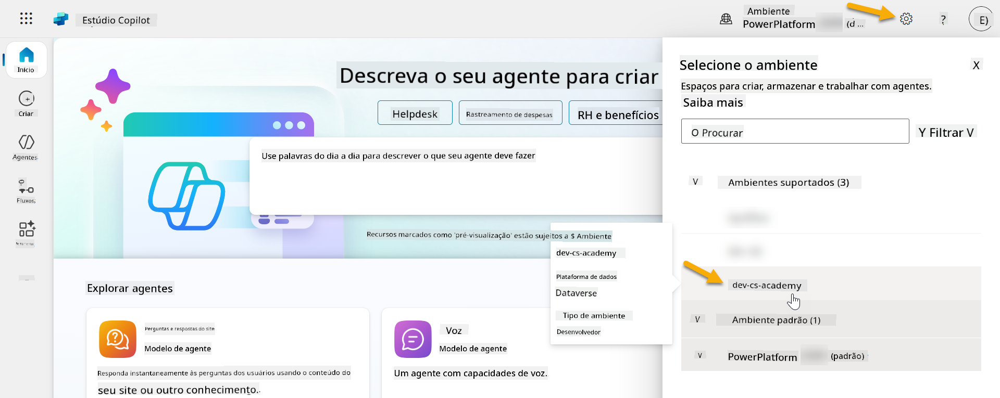

### 4.1 Criar um publicador de Solução

1. Usando o mesmo ambiente do Copilot Studio utilizado na lição anterior, selecione o ícone **três pontos (. . .)** no menu lateral esquerdo do Copilot Studio. Selecione **Soluções** sob o cabeçalho **Explorar**.

    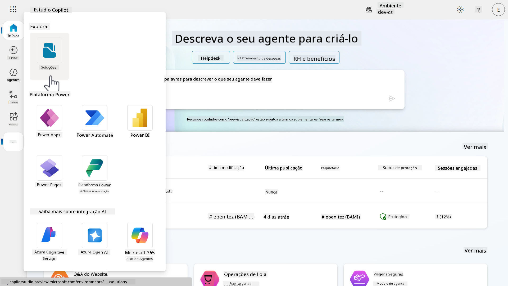

1. O **Explorador de Soluções** no Copilot Studio será carregado. Selecione **+ Nova solução**

    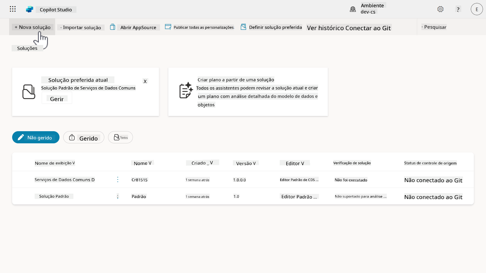

1. O painel **Nova solução** aparecerá, onde podemos definir os detalhes da nossa solução. Primeiro, precisamos criar um novo publicador. Selecione **+ Novo publicador**.

    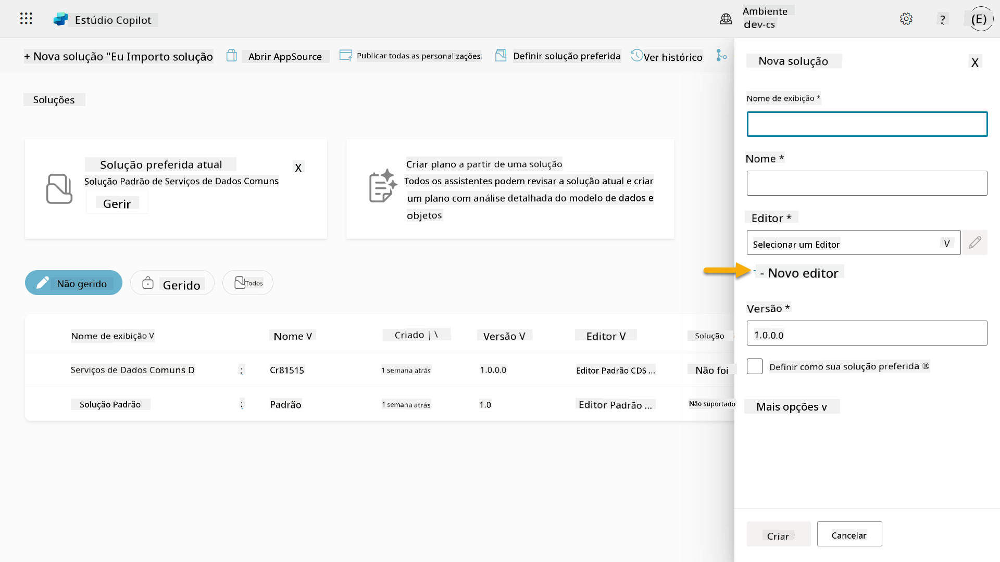  

1. A aba **Propriedades** do painel **Novo publicador** aparecerá com campos obrigatórios e não obrigatórios a serem preenchidos na aba **Propriedades**. É aqui que podemos detalhar as informações do publicador, que será usado como o rótulo ou marca que identifica quem criou ou possui a solução.

    | Propriedade    | Descrição | Obrigatório |
    | ---------- | ---------- | :----------: |
    | Nome de exibição | Nome de exibição para o publicador | Sim   |
    | Nome  | O nome único e o nome do esquema para o publicador  | Sim    |
    | Descrição   | Descreve o propósito da solução    | Não     |
    | Prefixo    | Prefixo do publicador que será aplicado aos componentes recém-criados   | Sim      |
    | Prefixo de valor de escolha   | Gera um número baseado no prefixo do publicador. Este número é usado ao adicionar opções às escolhas e fornece um indicador de qual solução foi usada para adicionar a opção.   | Sim      |

    Copie e cole o seguinte como **Nome de exibição**,

    ```text
    Contoso Solutions
    ```

    Copie e cole o seguinte como **Nome**,

    ```text
    ContosoSolutions
    ```

    Copie e cole o seguinte como **Descrição**,

    ```text
    Copilot Studio Agent Academy
    ```

    Copie e cole o seguinte para o **Prefixo**,

    ```text
    cts
    ```

    Por padrão, o prefixo de **Valor de escolha** exibirá um valor inteiro. Atualize este valor inteiro para o milhar mais próximo. Por exemplo, no meu screenshot abaixo, inicialmente era `77074`. Atualize isso de `77074` para `77000`.

    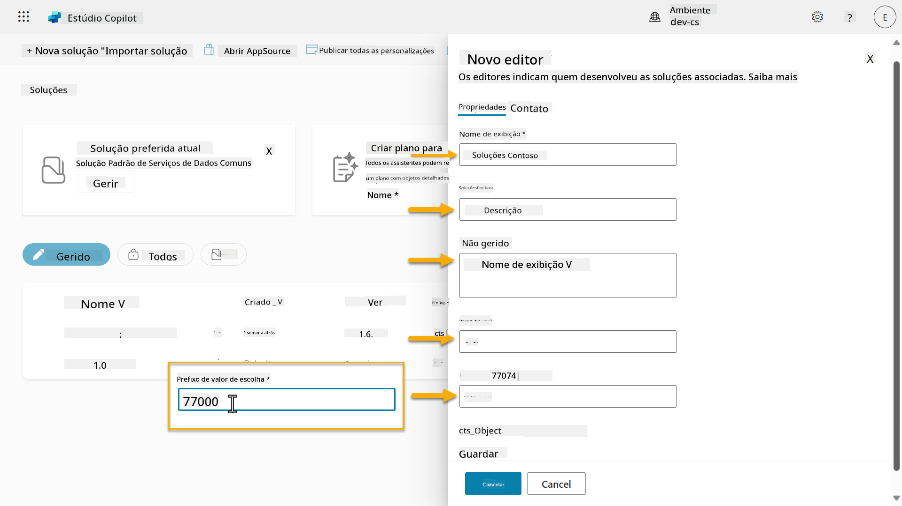  

1. Se você quiser fornecer os detalhes de contato para a Solução, selecione a aba **Contato** e preencha as colunas exibidas.

    

1. Selecione a aba **Propriedades** e clique em **Salvar** para criar o Publicador.

    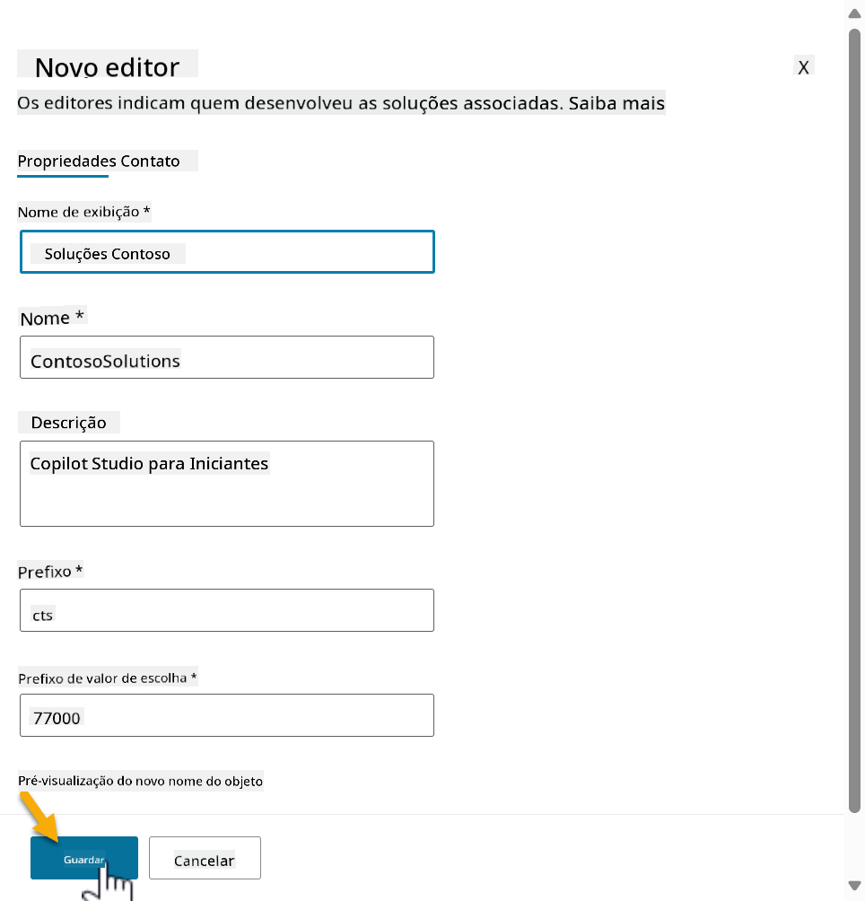
1. O painel **Novo editor** será fechado e serás levado de volta ao painel **Nova solução** com o Editor recém-criado selecionado.

    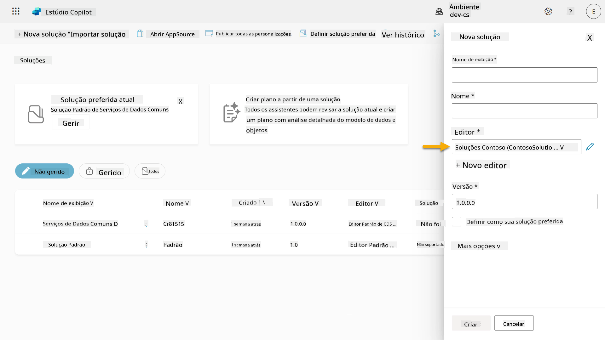  

Parabéns, acabaste de criar um Editor de Soluções! 🙌🏻 A seguir, vamos aprender como criar uma nova solução personalizada.

### 4.2 Criar uma nova Solução

1. Agora que criámos os nossos editores, podemos completar o restante do formulário no painel **Nova solução**.

    Copia e cola o seguinte como **Nome de exibição**,

    ```text
    Contoso Helpdesk Agent
    ```

    Copia e cola o seguinte como **Nome**,

    ```text
    ContosoHelpdeskAgent
    ```

    Como estamos a criar uma nova solução, o [**Número de versão**](https://learn.microsoft.com/power-apps/maker/data-platform/update-solutions#understanding-version-numbers-for-updates/?WT.mc_id=power-172615-ebenitez) por padrão será `1.0.0.0`.

    Marca a caixa de seleção **Definir como solução preferida**.

    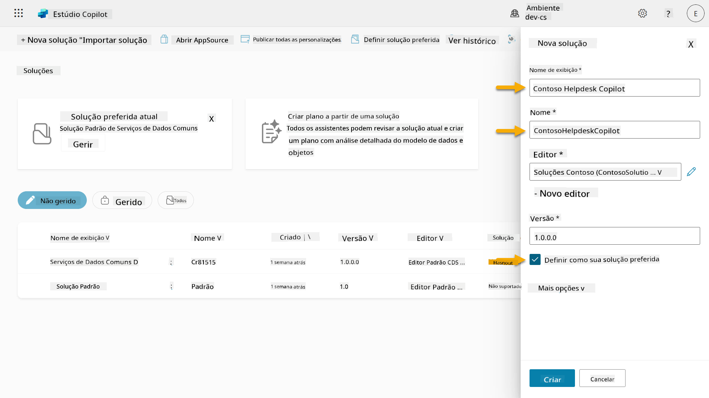  

1. Expande as **Mais opções** para ver detalhes adicionais que podem ser fornecidos numa solução.

    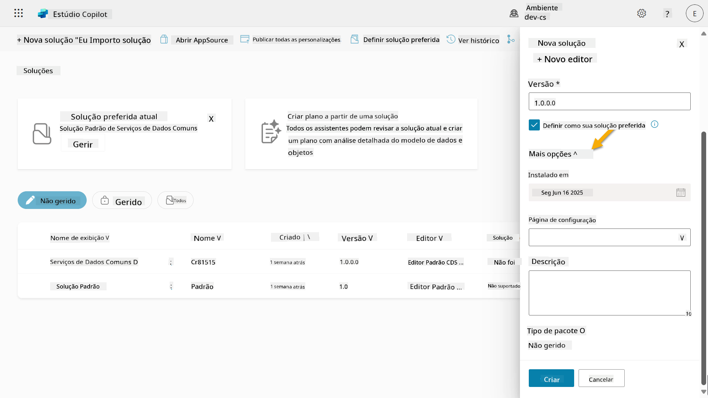

1. Verás o seguinte:

    - **Instalado em** - a data em que a Solução foi instalada.

    - **Página de configuração** - os programadores configuram um recurso web HTML para ajudar os utilizadores a interagir com a sua aplicação, agente ou ferramenta, onde aparecerá como uma página web na secção de Informações com instruções ou botões. É usado principalmente por empresas ou programadores que criam e partilham soluções com outros.

    - **Descrição** - descreve a solução ou uma descrição geral da página de configuração.

    Vamos deixar estas opções em branco para este laboratório.

    Seleciona **Criar**.

    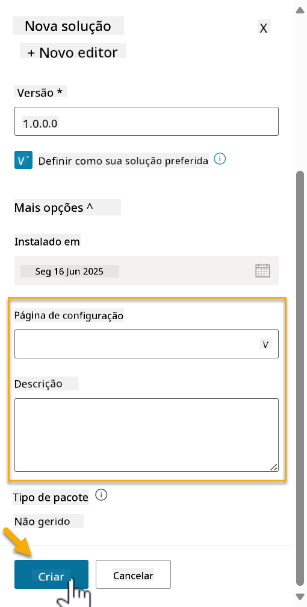

1. A solução para o Contoso Helpdesk Agent foi agora criada. Não haverá componentes até criarmos um agente no Copilot Studio.

    Seleciona o ícone **seta para trás** para voltar ao Explorador de Soluções.

    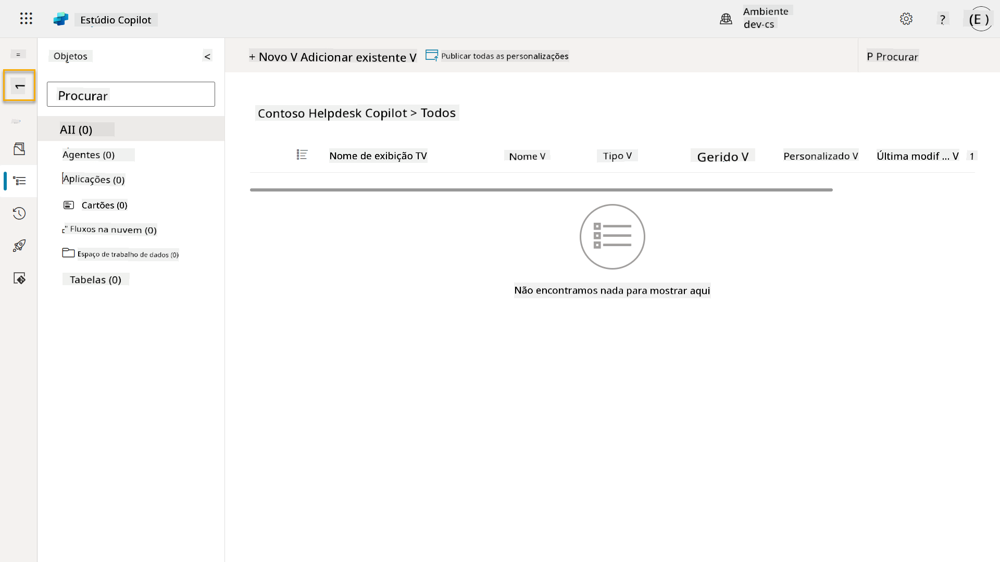

1. Repara como o Contoso Helpdesk Agent agora aparece como a **Solução preferida atual**, já que marcámos a caixa de seleção **Definir como solução preferida** anteriormente.

    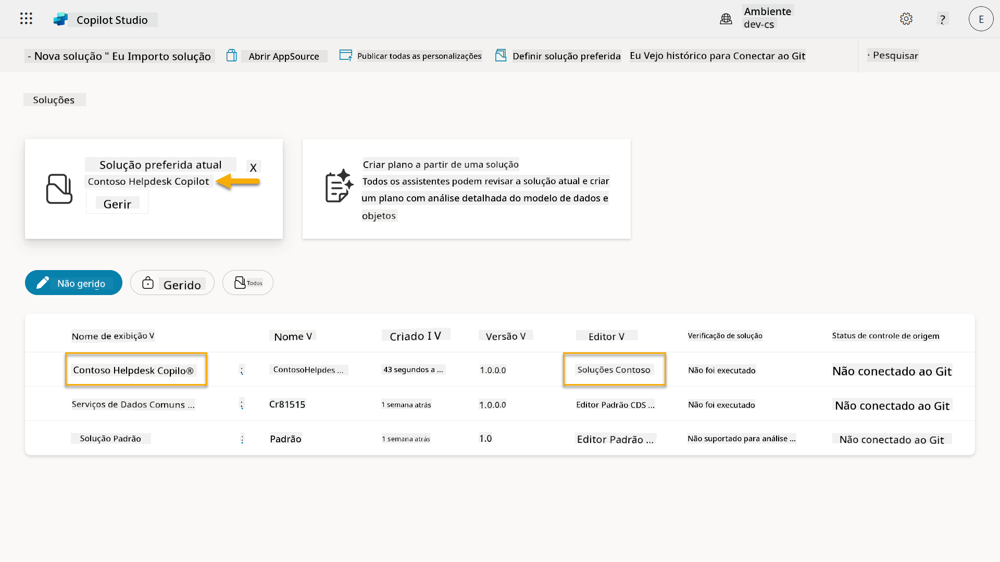

## ✅ Missão Completa

Parabéns! 👏🏻 Criaste um Editor e usaste-o na tua nova Solução para construir o teu agente!

Muito bem, Criador de Agentes. Uma pegada digital organizada é o primeiro passo para a operabilidade em escala. Agora tens as ferramentas e a mentalidade para o desenvolvimento de agentes sustentáveis e prontos para empresas.

Este é o fim do **Laboratório 04 - Criar uma Solução**, seleciona o link abaixo para avançar para a próxima lição. A solução criada neste laboratório será usada no laboratório da próxima lição.

⏭️ [Avançar para a lição **Começar rapidamente com agentes pré-construídos**](../05-using-prebuilt-agents/README.md)

## 📚 Recursos Táticos

🔗 [Criar uma solução](https://learn.microsoft.com/power-apps/maker/data-platform/create-solution/?WT.mc_id=power-172615-ebenitez)

🔗 [Criar e gerir soluções no Copilot Studio](https://learn.microsoft.com/microsoft-copilot-studio/authoring-solutions-overview/?WT.mc_id=power-172615-ebenitez)

🔗 [Partilhar agentes com outros utilizadores](https://learn.microsoft.com/microsoft-copilot-studio/admin-share-bots/?WT.mc_id=power-172615-ebenitez)

🔗 [Resumo dos recursos disponíveis para funções de segurança predefinidas](https://learn.microsoft.com/power-platform/admin/database-security#summary-of-resources-available-to-predefined-security-roles/?WT.mc_id=power-172615-ebenitez)

🔗 [Atualizar ou fazer upgrade de uma solução](https://learn.microsoft.com/power-apps/maker/data-platform/update-solutions/?WT.mc_id=power-172615-ebenitez)

🔗 [Visão geral de pipelines no Power Platform](https://learn.microsoft.com/power-platform/alm/pipelines/?WT.mc_id=power-172615-ebenitez)

🔗 [Visão geral da integração com Git no Power Platform](https://learn.microsoft.com/power-platform/alm/git-integration/overview/?WT.mc_id=power-172615-ebenitez)


---

**Aviso**:  
Este documento foi traduzido utilizando o serviço de tradução por IA [Co-op Translator](https://github.com/Azure/co-op-translator). Embora nos esforcemos pela precisão, esteja ciente de que traduções automáticas podem conter erros ou imprecisões. O documento original na sua língua nativa deve ser considerado a fonte autoritária. Para informações críticas, recomenda-se uma tradução profissional realizada por humanos. Não nos responsabilizamos por quaisquer mal-entendidos ou interpretações incorretas decorrentes do uso desta tradução.