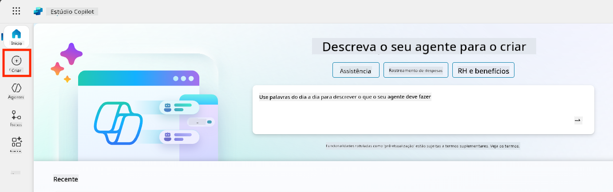
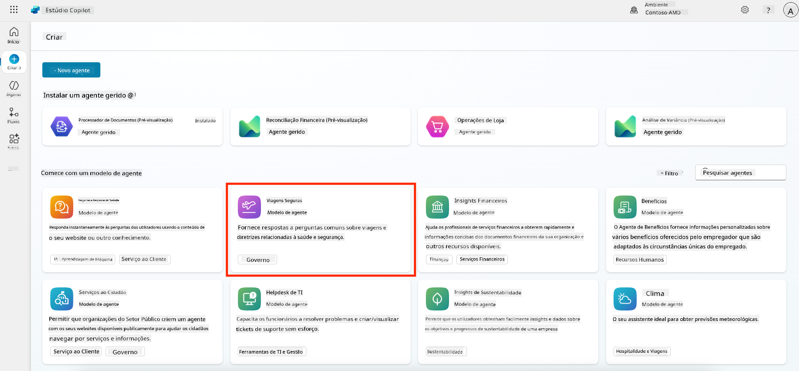
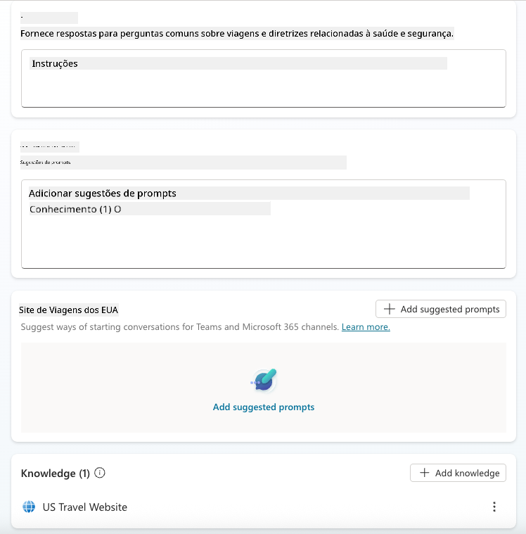
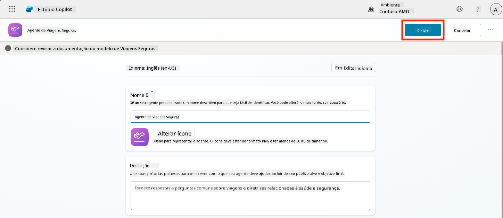
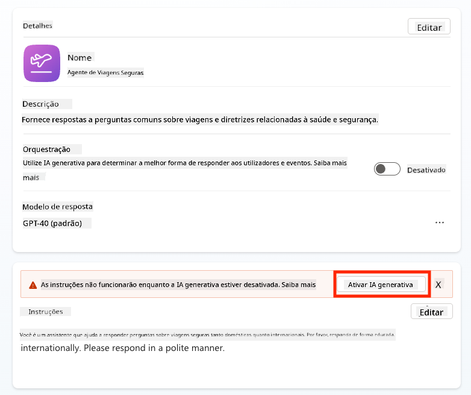
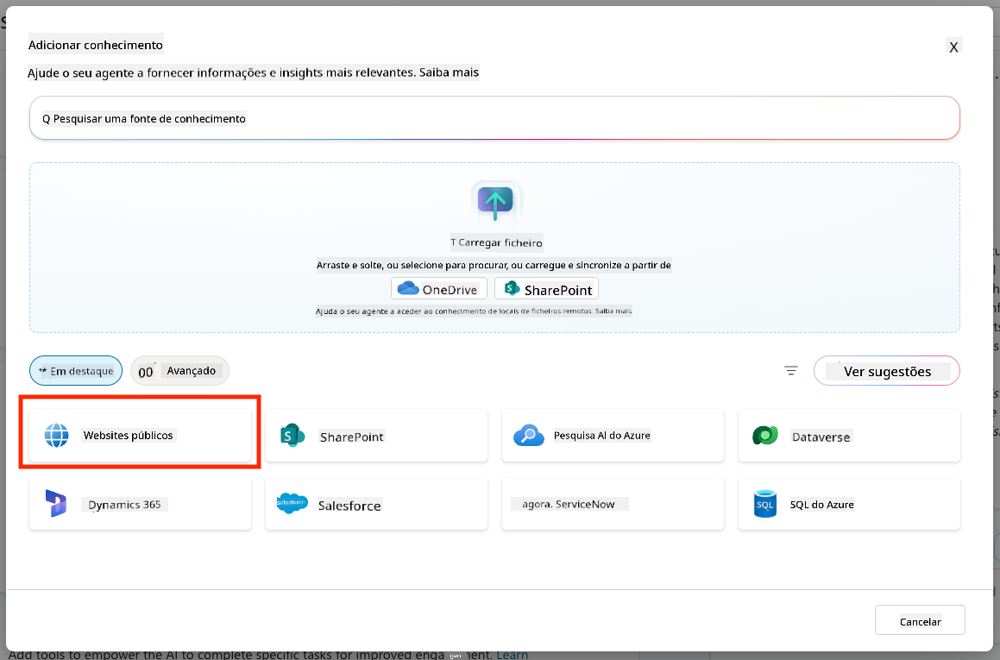
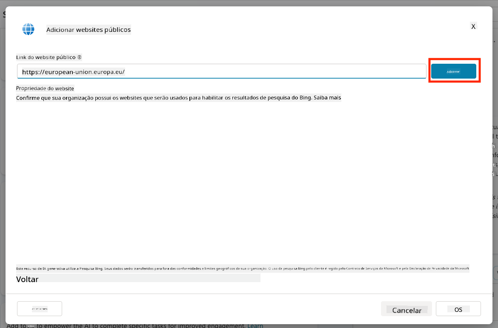
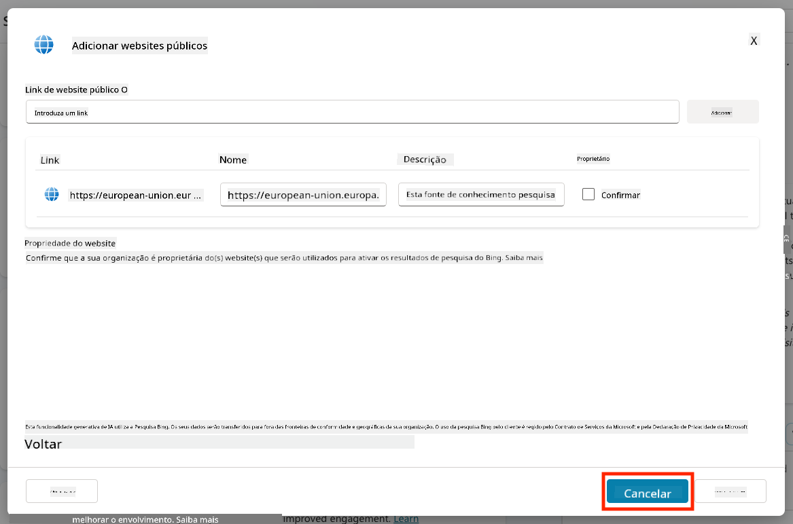
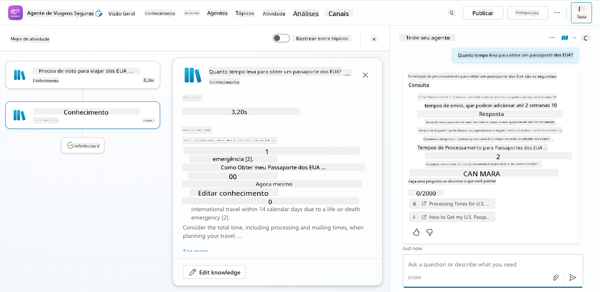
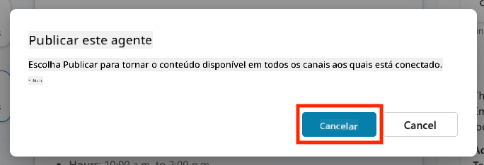

<!--
CO_OP_TRANSLATOR_METADATA:
{
  "original_hash": "8e2c64a7f9303e58329ec8bb468c80b4",
  "translation_date": "2025-10-18T02:43:05+00:00",
  "source_file": "docs/recruit/05-using-prebuilt-agents/README.md",
  "language_code": "pt"
}
-->
# 🧰 Missão 05: Utilizar um Agente Pré-Construído  

## 🕵️‍♂️ CODINOME: `OPERAÇÃO VIAGENS SEGURAS`

> **⏱️ Duração da Operação:** `~30 minutos`

🎥 **Assista ao Tutorial**

## 🎯 Resumo da Missão

Bem-vindo à sua próxima missão na Copilot Studio Agent Academy. Está prestes a explorar o mundo dos **agentes pré-construídos**—agentes inteligentes e orientados para propósitos específicos, criados pela Microsoft para acelerar a sua implementação e reduzir o tempo necessário para obter resultados.

Em vez de construir do zero, os agentes pré-construídos (também chamados de **modelos de agentes**) oferecem um ponto de partida com cenários prontos para usar que podem ser personalizados e implementados em minutos.

Nesta missão, irá implementar o agente **Viagens Seguras**—um agente que ajuda os seus utilizadores a preparar viagens de negócios, compreender políticas da empresa e simplificar o planeamento.

---

## 🧭 Objetivos

Os seus objetivos para esta missão são:

1. Compreender o que são agentes pré-construídos e por que são importantes  
1. Implementar o modelo de agente **Viagens Seguras**  
1. Personalizar as respostas e o conteúdo do agente  
1. Testar e publicar o agente  

---

## 🧠 O que são Agentes Pré-Construídos?

Os agentes pré-construídos são agentes de IA prontos para usar, criados pela Microsoft, que:

- Respondem a necessidades comuns de negócios (como viagens, RH, suporte de TI)
- Incluem tópicos totalmente funcionais, frases de ativação, instruções e conhecimento de exemplo.
- Podem ser editados, ampliados e conectados aos seus próprios dados

Estes agentes são perfeitos para começar rapidamente ou aprender como os agentes são estruturados.

---

## 🧪 Laboratório 05: Comece rapidamente com um agente pré-construído

Agora vamos aprender como selecionar um agente pré-construído e personalizá-lo.

- [5.1 Iniciar o Copilot Studio](../../../../../docs/recruit/05-using-prebuilt-agents)
- [5.2 Escolher o Modelo de Agente Viagens Seguras](../../../../../docs/recruit/05-using-prebuilt-agents)
- [5.3 Personalizar o Agente](../../../../../docs/recruit/05-using-prebuilt-agents)
- [5.4 Testar e Publicar](../../../../../docs/recruit/05-using-prebuilt-agents)

Vamos seguir o exemplo anterior, onde criamos uma solução no ambiente dedicado do Copilot Studio para construir o nosso agente de suporte de TI.

Vamos começar!

### 5.1 Iniciar o Copilot Studio

1. Aceda a [https://copilotstudio.microsoft.com](https://copilotstudio.microsoft.com)

1. Inicie sessão com a sua conta de trabalho ou escolar do Microsoft 365

!!! warning
    Deve estar num tenant onde o Copilot Studio esteja ativado. Se não vir o Copilot Studio, reveja [Missão 00](../00-course-setup/README.md) para concluir a configuração.

### 5.2 Escolher o Modelo de Agente Viagens Seguras

1. Na página inicial do Copilot Studio, clique em **+ Criar**
    

1. Desça até à secção **Começar com um modelo de agente**

1. Encontre e selecione **Viagens Seguras**

    

1. Note que o modelo já vem pré-carregado com uma descrição, instruções e conhecimento.

    

1. Clique em **Criar**

    

Isto criará um novo agente no seu ambiente com base na configuração do Viagens Seguras.

### 5.3 Personalizar o Agente

Agora que o agente foi criado, vamos adaptá-lo à sua organização:

1. Selecione **Ativar IA generativa** para ativar a funcionalidade de IA generativa, permitindo que utilize as instruções fornecidas no modelo.

    

1. Agora vamos equipar o agente com uma fonte de conhecimento adicional para que possa responder a perguntas sobre viagens na Europa. Para isso, desça até à secção **conhecimento** e selecione **Adicionar conhecimento**

    

1. Selecione **Sites públicos**

    

1. No campo de texto, cole **<https://european-union.europa.eu/>** e selecione **Adicionar**

    

1. Selecione **Adicionar ao agente**

    

### 5.4 Testar e Publicar

1. Clique em **Testar** no canto superior direito para abrir a janela de teste  

1. Experimente frases como:

    - `“Preciso de visto para viajar dos EUA para Amesterdão?”`
    - `“Quanto tempo demora para obter um passaporte dos EUA?”`
    - `“Onde está a embaixada dos EUA mais próxima em Valência, Espanha?”`

1. Confirme que o agente responde com informações precisas e úteis e observe o Mapa de Atividade para ver de onde as informações foram obtidas.

    

1. Quando estiver pronto, clique em **Publicar**

    

1. Selecione **Publicar** novamente na caixa de diálogo
    

1. Opcionalmente, adicione o agente ao Microsoft Teams utilizando a funcionalidade integrada **Canais**.

!!! note "🧳 Objetivo Bónus"
    Experimente conectar o agente Viagens Seguras a um site SharePoint ou ficheiro de FAQ para torná-lo mais relevante às políticas de viagem da sua empresa.

## ✅ Missão Concluída

Agora conseguiu:

- Implementar um agente pré-construído da Microsoft  
- Personalizar o agente  
- Testar e publicar a sua própria versão do modelo de agente **Viagens Seguras**

⏭️ [Avance para a lição **Criar um agente personalizado do zero**](../06-create-agent-from-conversation/README.md).

<!-- markdownlint-disable-next-line MD033 -->

---

**Aviso Legal**:  
Este documento foi traduzido utilizando o serviço de tradução por IA [Co-op Translator](https://github.com/Azure/co-op-translator). Embora nos esforcemos pela precisão, esteja ciente de que traduções automáticas podem conter erros ou imprecisões. O documento original na sua língua nativa deve ser considerado a fonte autoritária. Para informações críticas, recomenda-se uma tradução profissional realizada por humanos. Não nos responsabilizamos por quaisquer mal-entendidos ou interpretações incorretas decorrentes do uso desta tradução.