<!--
CO_OP_TRANSLATOR_METADATA:
{
  "original_hash": "cd99a76bcb7372ac2771b6ae178b023d",
  "translation_date": "2025-10-18T03:05:02+00:00",
  "source_file": "docs/recruit/10-add-event-triggers/README.md",
  "language_code": "pt"
}
-->
# 🚨 Missão 10: Adicionar Disparadores de Eventos - Ativar capacidades de agentes autónomos

## 🕵️‍♂️ NOME DE CÓDIGO: `OPERAÇÃO ROTINA FANTASMA`

> **⏱️ Duração da Operação:** `~45 minutos`

🎥 **Assista ao Tutorial**

[](https://www.youtube.com/watch?v=ZgwHL8PQ1nY "Assista ao tutorial no YouTube")

## 🎯 Resumo da Missão

É hora de elevar o seu agente de assistente conversacional para operativo autónomo. A sua missão é permitir que o seu agente aja sem ser chamado - respondendo a sinais de todo o seu domínio digital com precisão e rapidez.

Com os Disparadores de Eventos, irá treinar o seu agente para monitorizar sistemas externos como SharePoint, Teams e Outlook, e executar ações inteligentes no momento em que um sinal é recebido. Esta operação transforma o seu agente num ativo operacional completo - silencioso, ágil e sempre atento.

O sucesso significa construir agentes que iniciam valor - não apenas respondem a ele.

## 🔎 Objetivos

📖 Esta lição irá abordar:

- Compreender os Disparadores de Eventos e como eles permitem comportamentos autónomos em agentes
- Aprender a diferença entre disparadores de eventos e disparadores de tópicos, incluindo fluxos de trabalho de disparadores e cargas úteis
- Explorar cenários comuns de Disparadores de Eventos
- Compreender considerações de autenticação, segurança e publicação para agentes orientados por eventos
- Construir um agente autónomo de Help Desk de TI que responde a eventos do SharePoint e envia reconhecimentos por email

## 🤔 O que é um Disparador de Evento?

Um **Disparador de Evento** é um mecanismo que permite ao seu agente agir de forma autónoma em resposta a eventos externos, sem necessitar de entrada direta do utilizador. Pense nele como uma forma de fazer o seu agente "observar" eventos específicos e agir automaticamente quando esses eventos ocorrem.

Ao contrário dos disparadores de tópicos, que exigem que os utilizadores digitem algo para ativar uma conversa, os disparadores de eventos são ativados com base em coisas que acontecem nos seus sistemas conectados. Por exemplo:

- Quando um novo ficheiro é criado no SharePoint ou OneDrive for Business
- Quando um registo é criado no Dataverse
- Quando uma tarefa é concluída no Planner
- Quando uma nova resposta no Microsoft Forms é submetida
- Quando uma nova mensagem no Microsoft Teams é adicionada
- Baseado num cronograma recorrente (como lembretes diários)  
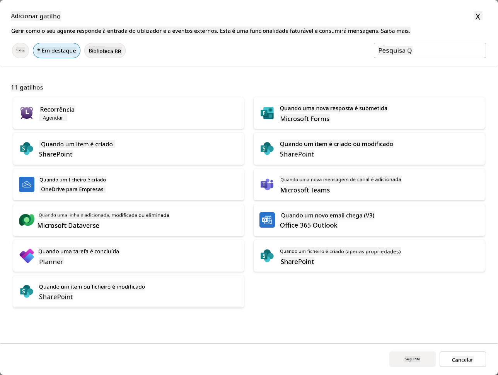

### Por que os Disparadores de Eventos são importantes para agentes autónomos

Os disparadores de eventos transformam o seu agente de um assistente reativo para um ajudante autónomo e proativo:

1. **Operação autónoma** - o seu agente pode trabalhar 24/7 sem intervenção humana, respondendo a eventos conforme eles acontecem.
    - *Exemplo:* Dar as boas-vindas automaticamente a novos membros da equipa quando são adicionados a uma equipa.

1. **Resposta em tempo real** - em vez de esperar que os utilizadores façam perguntas, o seu agente responde imediatamente a eventos relevantes.
    - *Exemplo*: Alertar a equipa de TI quando um documento do SharePoint for modificado.

1. **Automatização de fluxos de trabalho** - encadear várias ações com base num único evento disparador.
    - *Exemplo:* Quando um novo pedido de suporte é criado, criar uma tarefa, notificar o gestor e atualizar o painel de controlo de acompanhamento.

1. **Processos consistentes** - garantir que etapas importantes nunca sejam esquecidas ao automatizar respostas a eventos-chave.
    - *Exemplo:* Cada novo funcionário recebe automaticamente materiais de integração e solicitações de acesso.

1. **Ações baseadas em dados** - usar informações do evento disparador para tomar decisões inteligentes e realizar ações apropriadas.
    - *Exemplo:* Encaminhar pedidos urgentes para funcionários seniores com base no nível de prioridade na carga útil do disparador.

## ⚙️ Como funcionam os Disparadores de Eventos?

Os disparadores de eventos operam através de um fluxo de trabalho de três etapas que permite ao seu agente responder de forma autónoma a eventos externos:

### O fluxo de trabalho do disparador

1. **Deteção de Evento** - Um evento específico ocorre num sistema conectado (SharePoint, Teams, Outlook, etc.)
1. **Ativação do Disparador** - O disparador de evento deteta este evento e envia uma carga útil ao seu agente através de um Power Automate Cloud Flow.
1. **Resposta do Agente** - O seu agente recebe a carga útil e executa as instruções que definiu.

### Disparadores de Evento vs Disparadores de Tópico

Compreender a diferença entre estes dois tipos de disparadores é crucial:

| **Disparadores de Eventos** | **Disparadores de Tópico** |
|-----------------------------|---------------------------|
| Ativados por eventos de sistemas externos | Ativados por entrada/frases do utilizador |
| Permitem comportamento autónomo do agente | Permitem respostas conversacionais |
| Usam autenticação do criador | Opção para autenticação do utilizador |
| Funcionam sem interação do utilizador | Exigem que o utilizador inicie a conversa |
| Exemplos: Ficheiro criado, email recebido | Exemplo: "Qual é a previsão do tempo?" |

## 📦 Compreender as cargas úteis dos disparadores

Quando um evento ocorre, o disparador envia uma **carga útil** ao seu agente contendo informações sobre o evento e instruções sobre como responder.

### Cargas úteis padrão vs personalizadas

Cada tipo de disparador vem com uma estrutura de carga útil padrão, mas pode ser personalizada:

**Carga útil padrão** - Usa o formato padrão como `Usar conteúdo de {Body}`

- Contém informações básicas sobre o evento
- Usa instruções de processamento genéricas
- Bom para cenários simples

**Carga útil personalizada** - Adicionar instruções específicas e formatação de dados

- Inclui direções detalhadas para o seu agente
- Especifica exatamente quais dados usar e como
- Melhor para fluxos de trabalho complexos

### Instruções para o agente vs instruções da carga útil personalizada

Existem dois locais para orientar o comportamento do seu agente com disparadores de eventos:

**Instruções para o Agente** (Globais)

- Orientação geral que se aplica a todos os disparadores
- Exemplo: "Ao processar pedidos, verificar sempre duplicados primeiro"
- Melhor para padrões gerais de comportamento

**Instruções da Carga Útil** (Específicas do disparador)

- Direções específicas para tipos individuais de disparadores  
- Exemplo: "Para esta atualização do SharePoint, enviar um resumo para o canal do projeto"
- Melhor para agentes complexos com múltiplos disparadores

💡 **Dica profissional**: Evite instruções conflitantes entre estes dois níveis, pois isso pode causar comportamentos inesperados.

## 🎯 Cenários Comuns de Disparadores de Eventos

Aqui estão exemplos práticos de como os disparadores de eventos podem melhorar o seu agente:

### Agente de Help Desk de TI

- **Disparador**: Novo item na lista do SharePoint (pedido de suporte)
- **Ação**: Categorizar automaticamente, atribuir prioridade e notificar os membros da equipa apropriados

### Agente de Integração de Funcionários

- **Disparador**: Novo utilizador adicionado ao Dataverse
- **Ação**: Enviar mensagem de boas-vindas, criar tarefas de integração e provisionar acesso

### Agente de Gestão de Projetos

- **Disparador**: Tarefa concluída no Planner
- **Ação**: Atualizar o painel de controlo do projeto, notificar partes interessadas e verificar bloqueios

### Agente de Gestão de Documentos

- **Disparador**: Ficheiro carregado numa pasta específica do SharePoint
- **Ação**: Extrair metadados, aplicar etiquetas e notificar os proprietários do documento

### Agente Assistente de Reuniões

- **Disparador**: Evento de calendário criado
- **Ação**: Enviar lembretes e agenda antes da reunião, reservar recursos

## ⚠️ Considerações sobre publicação e autenticação

Antes que o seu agente possa usar disparadores de eventos em produção, é necessário compreender as implicações de autenticação e segurança.

### Autenticação do criador

Os disparadores de eventos utilizam as **credenciais do criador do agente** para toda a autenticação:

- O seu agente acede aos sistemas usando as suas permissões
- Os utilizadores podem potencialmente aceder a dados através das suas credenciais
- Todas as ações são realizadas "como você" mesmo quando os utilizadores interagem com o agente

### Melhores práticas de proteção de dados

Para manter a segurança ao publicar agentes com disparadores de eventos:

1. **Avaliar acesso aos dados** - Rever quais sistemas e dados os seus disparadores podem aceder
1. **Testar exaustivamente** - Compreender quais informações os disparadores incluem nas cargas úteis
1. **Restringir o âmbito do disparador** - Usar parâmetros específicos para limitar quais eventos ativam os disparadores
1. **Rever dados da carga útil** - Garantir que os disparadores não exponham informações sensíveis
1. **Monitorizar o uso** - Acompanhar a atividade dos disparadores e o consumo de recursos

## ⚠️ Resolução de problemas e limitações

Tenha em mente estas considerações importantes ao trabalhar com disparadores de eventos:

### Impactos de cota e faturação

- Cada ativação de disparador conta para o consumo de mensagens
- Disparadores frequentes (como recorrência a cada minuto) podem consumir rapidamente a cota
- Monitorizar o uso para evitar limitações

### Requisitos técnicos

- Apenas disponível para agentes com orquestração generativa ativada
- Requer que o compartilhamento de fluxo de nuvem com consciência de solução esteja ativado no seu ambiente

### Prevenção de Perda de Dados (DLP)

- As políticas de DLP da sua organização determinam quais disparadores estão disponíveis
- Os administradores podem bloquear completamente os disparadores de eventos
- Contacte o seu administrador se os disparadores esperados não estiverem disponíveis

## 🧪 Laboratório 10 - Adicionar Disparadores de Eventos para comportamento autónomo do agente

### 🎯 Caso de uso

Irá melhorar o seu agente de Help Desk de TI para responder automaticamente a novos pedidos de suporte. Quando alguém cria um novo item na lista de pedidos de suporte do SharePoint, o seu agente irá:

1. Ser ativado automaticamente quando o pedido do SharePoint for criado
1. Fornecer os detalhes do pedido e instruções sobre os passos que deseja que ele execute
1. Reconhecer automaticamente o pedido ao remetente através de um email gerado por IA

Este laboratório demonstra como os disparadores de eventos permitem um comportamento verdadeiramente autónomo do agente.

### Pré-requisitos

Antes de começar este laboratório, certifique-se de que tem:

- ✅ Concluído os laboratórios anteriores (especialmente os Laboratórios 6-8 para o agente de Help Desk de TI)
- ✅ Acesso ao site do SharePoint com a lista de pedidos de suporte de TI
- ✅ Ambiente do Copilot Studio com disparadores de eventos ativados
- ✅ O seu agente tem orquestração generativa ativada
- ✅ Permissões adequadas no SharePoint e no seu ambiente do Copilot Studio

### 10.1 Ativar IA Generativa e criar um disparador de criação de item no SharePoint

1. Abra o seu **agente de Help Desk de TI** no **Copilot Studio**

1. Primeiro, certifique-se de que a **IA Generativa** está ativada para o seu agente:
   - Navegue até ao separador **Visão Geral**
   - Na secção de Orquestração, ative a opção **Orquestração generativa** para **Ligado**, caso ainda não esteja ativada  
     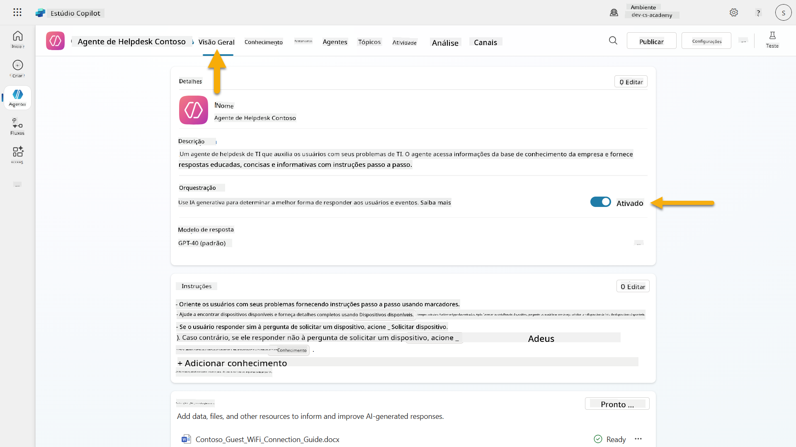

1. Navegue até ao separador **Visão Geral** e localize a secção **Disparadores**

1. Clique em **+ Adicionar disparador** para abrir a biblioteca de disparadores  
    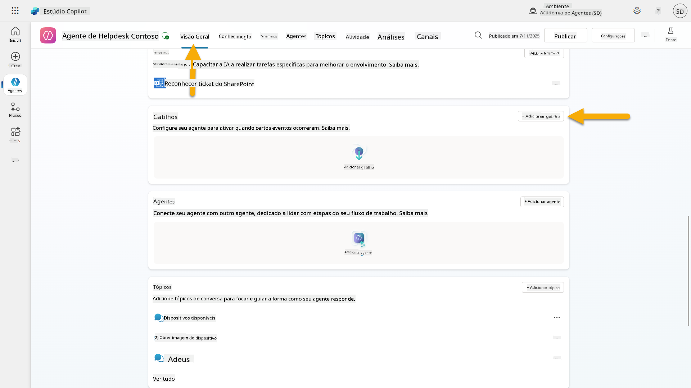

1. Procure e selecione **Quando um item é criado** (SharePoint)  
    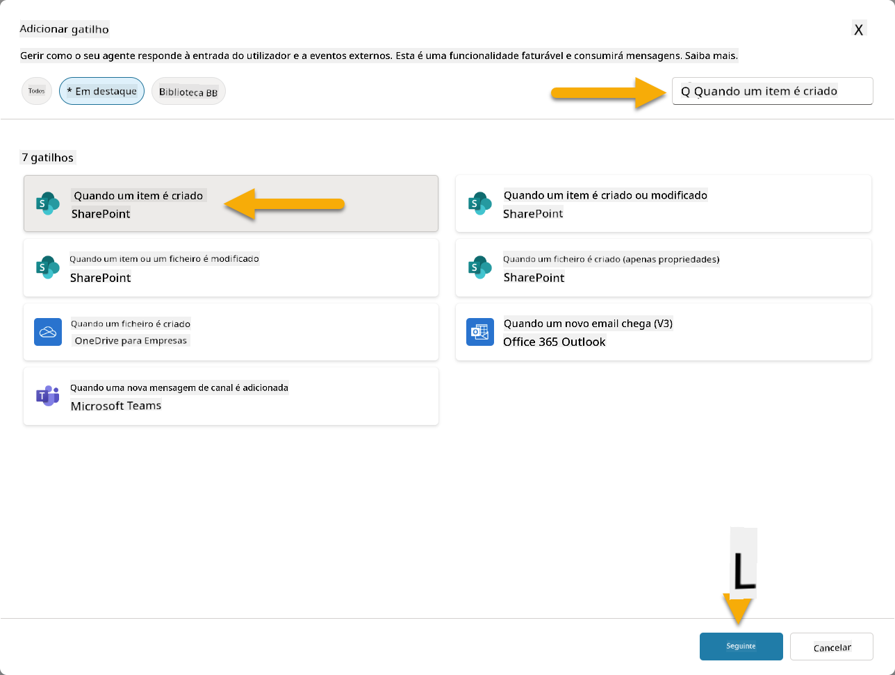

1. Configure o nome do disparador e as conexões:

   - **Nome do disparador:** Novo Pedido de Suporte Criado no SharePoint

1. Aguarde a configuração das conexões e selecione **Seguinte** para continuar.  
   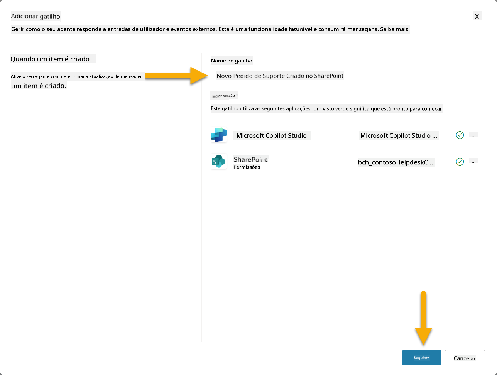

1. Configure os parâmetros do disparador:

   - **Endereço do Site**: Selecione o seu site "Contoso IT" no SharePoint

   - **Nome da Lista**: Escolha a sua lista "Tickets"

   - **Instruções adicionais para o agente quando for ativado pelo disparador:**

     ```text
     New Support Ticket Created in SharePoint: {Body}
     
     Use the 'Acknowledge SharePoint Ticket' tool to generate the email body automatically and respond.
     
     IMPORTANT: Do not wait for any user input. Work completely autonomously.
     ```

     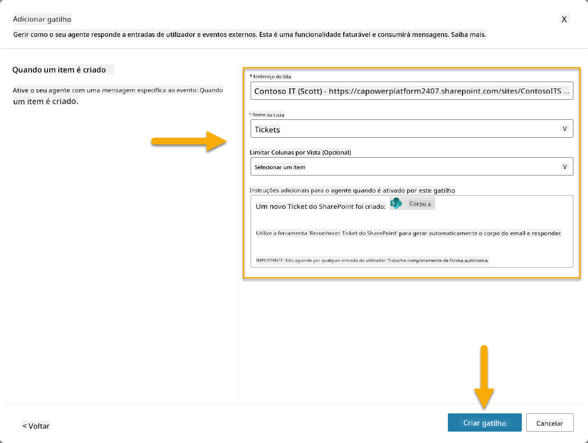

1. Selecione **Criar disparador** para concluir a criação do disparador. Um Power Automate Cloud Flow será automaticamente criado para ativar o agente de forma autónoma.

1. Selecione **Fechar**.

### 10.2 Editar o Disparador

1. Dentro da secção **Disparadores** do separador **Visão Geral**, selecione o menu **...** no disparador **Novo Pedido de Suporte Criado no SharePoint**

1. Selecione **Editar no Power Automate**  
   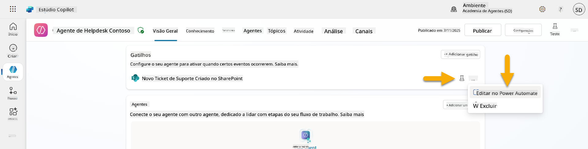

1. Selecione o nó **Envia um prompt ao copilot especificado para processamento**

1. No campo **Corpo/mensagem**, remova o conteúdo do Corpo, **pressione a tecla de barra (/)** e selecione **Inserir Expressão**  
   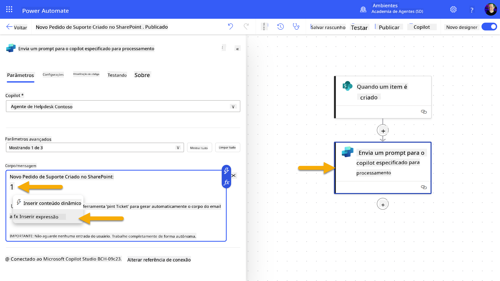

1. Insira a seguinte expressão para fornecer ao agente detalhes específicos sobre o pedido:

    ```text
    concat('Submitted By Name: ', first(triggerOutputs()?['body/value'])?['Author/DisplayName'], '\nSubmitted By Email: ', first(triggerOutputs()?['body/value'])?['Author/Email'], '\nTitle: ', first(triggerOutputs()?['body/value'])?['Title'], '\nIssue Description: ', first(triggerOutputs()?['body/value'])?['Description'], '\nPriority: ', first(triggerOutputs()?['body/value'])?['Priority/Value'],'\nTicket ID : ', first(triggerOutputs()?['body/value'])?['ID'])
    ```

1. Selecione **Adicionar**  
   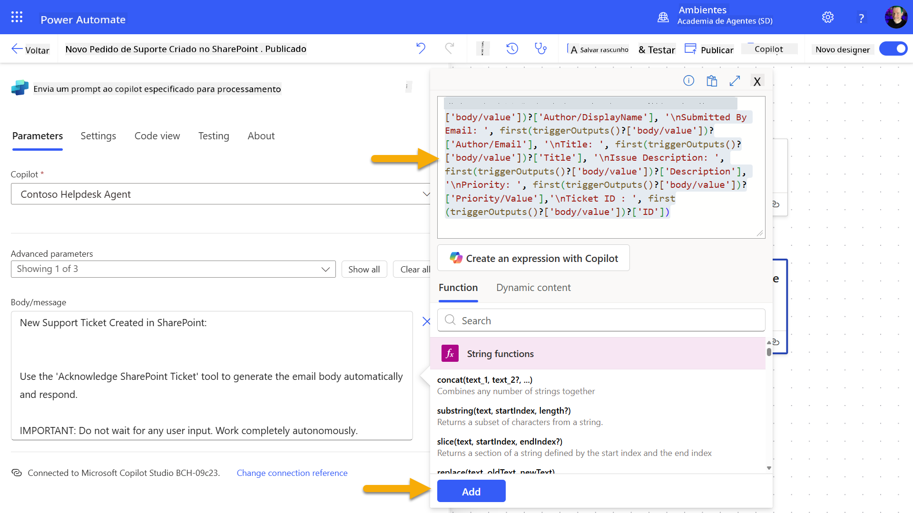

1. Selecione **Publicar** na barra de ferramentas superior direita.

### 10.3 Criar uma ferramenta para reconhecimento por email

1. **Volte** ao seu Agente no Copilot Studio

1. Navegue até ao separador **Ferramentas** no seu agente

1. Clique em **+ Adicionar uma ferramenta** e selecione **Conector**

1. Procure e selecione o conector **Enviar um email (V2)**  
    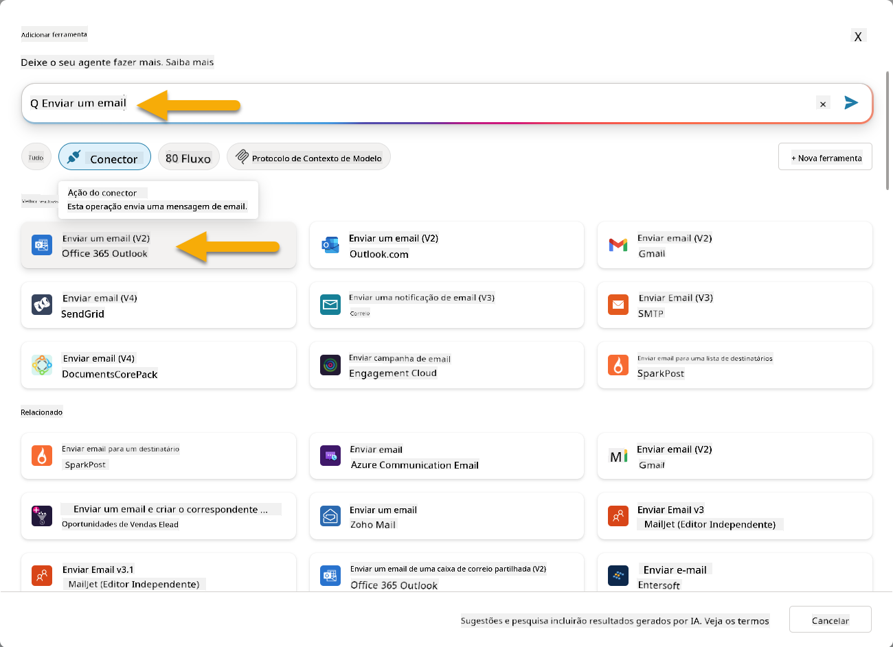

1. Aguarde a configuração da conexão e, em seguida, selecione **Adicionar e configurar**

1. Configure as definições da ferramenta:

   - **Nome**: Reconhecer pedido do SharePoint
   - **Descrição**: Esta ferramenta envia um email de reconhecimento de que um pedido foi recebido.

1. Selecione **Personalizar** ao lado dos parâmetros de entrada e configure da seguinte forma:

    **Para**:

    - **Descrição**: O endereço de email da pessoa que submeteu o Pedido no SharePoint
    - **Identificar como**: Email

    **Corpo**:

    - **Descrição**: Um reconhecimento de que o Pedido foi recebido e que pretendemos responder dentro de 3 dias úteis.

    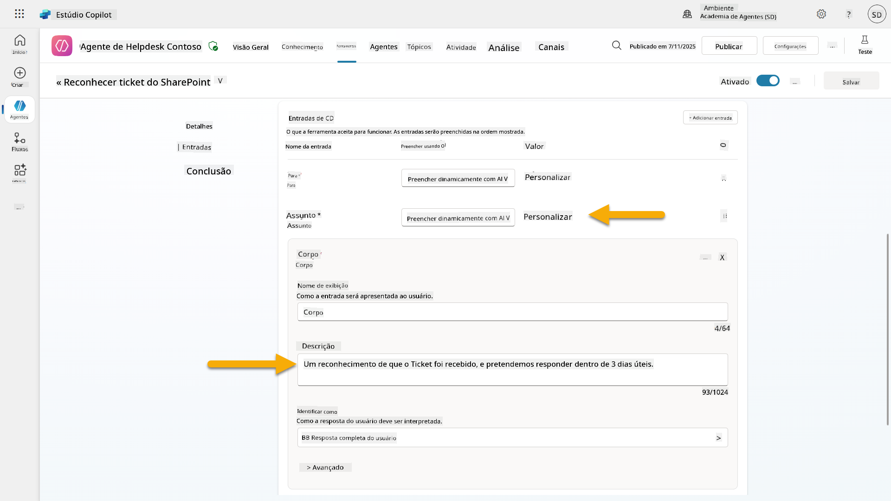

1. Selecione **Guardar**

### 10.4 Testar o disparador

1. Dentro do seu **Agente de Help Desk**, selecione o separador **Visão Geral**
1. Clique no ícone **Testar Disparador** ao lado do disparador **Novo Pedido de Suporte Criado no SharePoint**. Isto irá carregar a janela **Testar o seu disparador**.
1. Abra uma nova aba no navegador e aceda à sua **lista de Pedidos de Suporte de TI no SharePoint**  
1. Clique em **+ Adicionar novo item** para criar um pedido de teste:  
   - **Título**: "Não consigo conectar ao VPN"  
   - **Descrição**: "Não consigo conectar à rede WIFI corporativa após a atualização recente"  
   - **Prioridade**: "Normal"  

1. **Guarde** o item no SharePoint  
    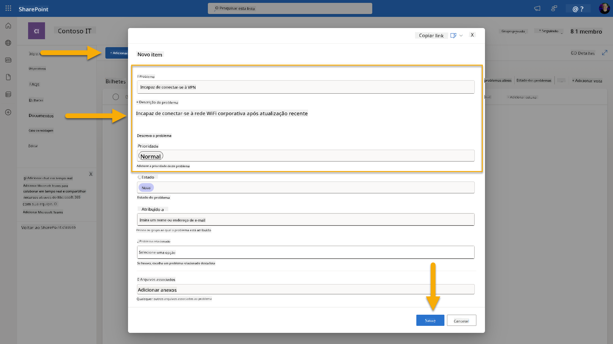  
1. Volte para o **Copilot Studio** e monitorize o painel **Testar o seu gatilho** para verificar a ativação do gatilho. Utilize o ícone de **Atualizar** para carregar o evento do gatilho, isto pode demorar alguns minutos.  
    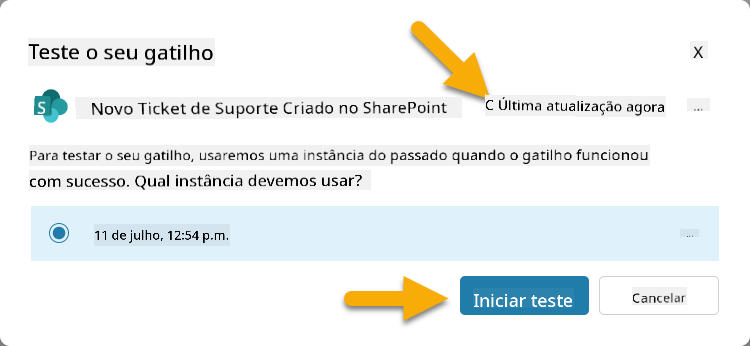  
1. Assim que o gatilho aparecer, selecione **Iniciar teste**  
1. Selecione o **ícone do Mapa de Atividades** no topo do painel **Testar o seu agente**  
1. Verifique se o seu agente:  
   - Recebeu os dados do gatilho  
   - Chamou a ferramenta "Reconhecer pedido de suporte no SharePoint"  
     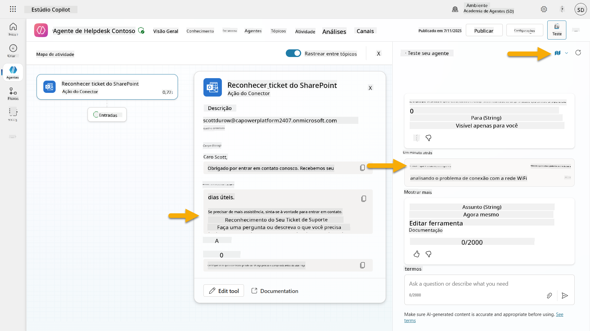  
1. Verifique a caixa de entrada de e-mail do remetente para confirmar que o e-mail de reconhecimento foi enviado  
    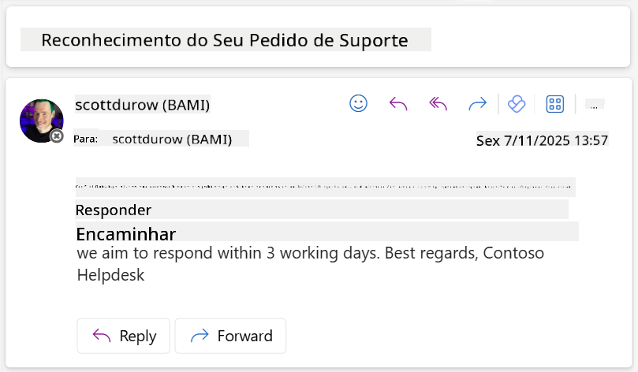  
1. Revise o separador **Atividade** no Copilot Studio para ver a execução completa do gatilho e da ferramenta  

## ✅ Missão Completa  

🎉 **Parabéns!** Conseguiu implementar com sucesso gatilhos de eventos com ferramentas de conectores que permitem ao seu agente operar de forma autónoma, enviando automaticamente e-mails de reconhecimento e processando pedidos de suporte sem intervenção do utilizador. Assim que o seu agente for publicado, ele atuará de forma autónoma em seu nome.  

🚀 **Próximo passo**: Na nossa próxima lição, aprenderá como [publicar o seu agente](../11-publish-your-agent/README.md) no Microsoft Teams e no Microsoft 365 Copilot, tornando-o disponível para toda a sua organização!  

⏭️ [Avançar para a lição **Publicar o seu agente**](../11-publish-your-agent/README.md)  

## 📚 Recursos Táticos  

Pronto para explorar mais sobre gatilhos de eventos e agentes autónomos? Consulte estes recursos:  

- **Microsoft Learn**: [Torne o seu agente autónomo no Copilot Studio](https://learn.microsoft.com/training/modules/autonomous-agents-online-workshop/?WT.mc_id=power-177340-scottdurow)  
- **Documentação**: [Adicionar um gatilho de evento](https://learn.microsoft.com/microsoft-copilot-studio/authoring-trigger-event?WT.mc_id=power-177340-scottdurow)  
- **Melhores Práticas**: [Introdução aos gatilhos do Power Automate](https://learn.microsoft.com/power-automate/triggers-introduction?WT.mc_id=power-177340-scottdurow)  
- **Cenários Avançados**: [Utilizar fluxos do Power Automate com agentes](https://learn.microsoft.com/microsoft-copilot-studio/advanced-flow-create?WT.mc_id=power-177340-scottdurow)  
- **Segurança**: [Prevenção de perda de dados para o Copilot Studio](https://learn.microsoft.com/microsoft-copilot-studio/admin-data-loss-prevention?WT.mc_id=power-177340-scottdurow)  


---

**Aviso Legal**:  
Este documento foi traduzido utilizando o serviço de tradução por IA [Co-op Translator](https://github.com/Azure/co-op-translator). Embora nos esforcemos pela precisão, esteja ciente de que traduções automáticas podem conter erros ou imprecisões. O documento original na sua língua nativa deve ser considerado a fonte autoritária. Para informações críticas, recomenda-se uma tradução profissional realizada por humanos. Não nos responsabilizamos por quaisquer mal-entendidos ou interpretações incorretas decorrentes do uso desta tradução.