<!--
CO_OP_TRANSLATOR_METADATA:
{
  "original_hash": "9dceeba2eae2bb73e328602a060eddab",
  "translation_date": "2025-10-18T02:54:21+00:00",
  "source_file": "docs/recruit/11-publish-your-agent/README.md",
  "language_code": "pt"
}
-->
# 🚨 Missão 11: Publicar o Seu Agente

## 🕵️‍♂️ CODINOME: `OPERAÇÃO PUBLICAR PUBLICAR PUBLICAR`

> **⏱️ Duração da Operação:** `~30 minutos`  

🎥 **Assista ao Tutorial**

## 🎯 Resumo da Missão

Após concluir uma série de módulos desafiadores, Criador de Agentes, está na hora de dar o passo mais importante: publicar o seu agente. É hora de tornar sua criação acessível para os utilizadores no Microsoft Teams e no Microsoft 365 Copilot.

O seu agente—equipado com uma missão clara, ferramentas poderosas e acesso a fontes de conhecimento essenciais—está pronto para servir. Usando o Microsoft Copilot Studio, você irá implementar o seu agente para que ele comece a ajudar utilizadores reais, diretamente onde eles trabalham.

Vamos lançar o seu agente em ação.

## 🔎 Objetivos

📖 Esta lição aborda:

1. Por que é importante publicar o seu agente
1. O que acontece quando você publica o seu agente
1. Como adicionar um canal (Microsoft Teams & Microsoft 365 Copilot)
1. Como adicionar o agente no Microsoft Teams
1. Como disponibilizar o agente no Microsoft Teams para toda a sua organização

## 🚀 Publicar um agente

Sempre que você trabalha em um agente no Copilot Studio, pode atualizá-lo adicionando conhecimento ou ferramentas. Quando todas as alterações estiverem concluídas e devidamente testadas, estará pronto para publicá-lo. A publicação garante que as atualizações mais recentes estejam disponíveis. Se você atualizar o seu agente com novas ferramentas e não clicar no botão de publicar, essas alterações ainda não estarão disponíveis para os utilizadores finais.

Certifique-se de sempre clicar no botão de publicar quando quiser disponibilizar as atualizações para os utilizadores do seu agente. O seu agente pode ter canais adicionados e, ao clicar em publicar, as atualizações ficam disponíveis para todos os canais configurados no agente.

## ⚙️ Configurar canais

Os canais determinam onde os utilizadores podem acessar e interagir com o seu agente. Após publicar o seu agente, você pode torná-lo disponível em vários canais. Cada canal pode exibir o conteúdo do seu agente de forma diferente.

Você pode adicionar o seu agente aos seguintes canais:

- **Microsoft Teams e Microsoft 365 Copilot** - Disponibilize o seu agente em chats e reuniões do Teams, e nas experiências do Microsoft 365 Copilot ([Saiba mais](https://learn.microsoft.com/microsoft-copilot-studio/publication-add-bot-to-microsoft-teams))
- **Website de demonstração** - Teste o seu agente em um website de demonstração fornecido pelo Copilot Studio ([Saiba mais](https://learn.microsoft.com/microsoft-copilot-studio/publication-connect-bot-to-web-channels))
- **Website personalizado** - Incorpore o seu agente diretamente no seu próprio website ([Saiba mais](https://learn.microsoft.com/microsoft-copilot-studio/publication-connect-bot-to-web-channels))
- **Aplicação móvel** - Integre o seu agente em uma aplicação móvel personalizada ([Saiba mais](https://learn.microsoft.com/microsoft-copilot-studio/publication-connect-bot-to-custom-application))
- **SharePoint** - Adicione o seu agente a sites do SharePoint para assistência com documentos e sites ([Saiba mais](https://learn.microsoft.com/microsoft-copilot-studio/publication-add-bot-to-sharepoint))
- **Facebook Messenger** - Conecte-se com utilizadores através da plataforma de mensagens do Facebook ([Saiba mais](https://learn.microsoft.com/microsoft-copilot-studio/publication-add-bot-to-facebook))
- **Power Pages** - Integre o seu agente em websites do Power Pages ([Saiba mais](https://learn.microsoft.com/microsoft-copilot-studio/publication-add-bot-to-power-pages))
- **Canais do Azure Bot Service** - Acesse canais adicionais, incluindo Slack, Telegram, Twilio SMS e mais ([Saiba mais](https://learn.microsoft.com/microsoft-copilot-studio/publication-connect-bot-to-azure-bot-service-channels))

Para adicionar um canal, navegue até a aba **Canais** no seu agente e selecione o canal que deseja configurar. Cada canal tem requisitos específicos de configuração e pode exigir autenticação ou etapas adicionais de configuração.

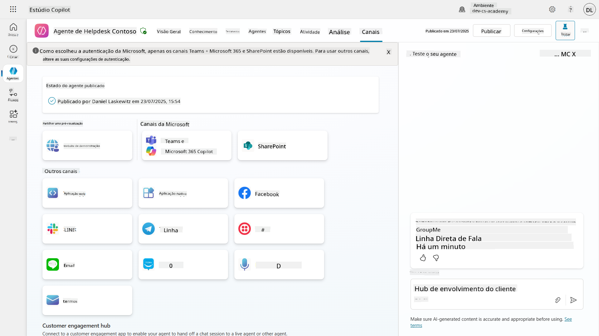

## 📺 Experiências de canais

Diferentes canais oferecem diferentes experiências para os utilizadores. Ao criar um agente para múltiplos canais, certifique-se de estar ciente das diferenças entre eles. É sempre uma boa estratégia testar o seu agente em vários canais para garantir que ele funcione conforme o esperado.

| Experiência                        | Website       | Teams e Microsoft 365 Copilot         | Facebook                 | Dynamics Omnichannel para Atendimento ao Cliente            |
| --------------------------------- | ------------- | ------------------------------------- | ------------------------ | ----------------------------------------------------------- |
| [Pesquisa de satisfação do cliente][1] | Cartão adaptável | Apenas texto                          | Apenas texto             | Apenas texto                                                 |
| [Opções de múltipla escolha][1]   | Suportado     | [Suportado até seis (como cartão hero)][4] | [Suportado até 13][6]    | [Parcialmente suportado][8]                                 |
| [Markdown][2]                     | Suportado     | [Parcialmente suportado][5]           | [Parcialmente suportado][7] | [Parcialmente suportado][9]                                 |
| [Mensagem de boas-vindas][1]      | Suportado     | Suportado                             | Não suportado            | Suportado para [Chat][10]. Não suportado para outros canais. |
| [Você quis dizer][3]              | Suportado     | Suportado                             | Suportado                | Suportado para [Microsoft Teams][11], [Chat][10], Facebook, e canais apenas texto (serviço de mensagens curtas (SMS) via [TeleSign][12] e [Twilio][13], [WhatsApp][14], [WeChat][15], e [Twitter][16]). Ações sugeridas são apresentadas como uma lista apenas texto; os utilizadores devem digitar novamente uma opção para responder. |

[1]: https://learn.microsoft.com/microsoft-copilot-studio/authoring-create-edit-topics
[2]: https://daringfireball.net/projects/markdown/
[3]: https://learn.microsoft.com/microsoft-copilot-studio/advanced-ai-features
[4]: https://learn.microsoft.com/microsoftteams/platform/concepts/cards/cards-reference#hero-card
[5]: https://learn.microsoft.com/microsoftteams/platform/bots/how-to/format-your-bot-messages#text-only-messages
[6]: https://developers.facebook.com/docs/messenger-platform/send-messages/quick-replies/
[7]: https://www.facebook.com/help/147348452522644?helpref=related
[8]: https://learn.microsoft.com/dynamics365/customer-service/asynchronous-channels#suggested-actions-support
[9]: https://learn.microsoft.com/dynamics365/customer-service/asynchronous-channels#preview-support-for-formatted-messages
[10]: https://learn.microsoft.com/dynamics365/customer-service/set-up-chat-widget
[11]: https://learn.microsoft.com/dynamics365/customer-service/configure-microsoft-teams
[12]: https://learn.microsoft.com/dynamics365/customer-service/configure-sms-channel
[13]: https://learn.microsoft.com/dynamics365/customer-service/configure-sms-channel-twilio
[14]: https://learn.microsoft.com/dynamics365/customer-service/configure-whatsapp-channel
[15]: https://learn.microsoft.com/dynamics365/customer-service/configure-wechat-channel
[16]: https://learn.microsoft.com/dynamics365/customer-service/configure-twitter-channel

> [!NOTE]
> Existem alguns exemplos de como usar diferentes lógicas para diferentes canais. Um exemplo pode ser encontrado no repositório Power Platform Snippets:
>
> Henry Jammes compartilhou um exemplo de como mostrar um cartão adaptável diferente quando o canal é Microsoft Teams. ([Link para o exemplo](https://github.com/pnp/powerplatform-snippets/blob/main/copilot-studio/multiple-topics-matched-topic/source/multiple-topics-matched.yaml#L40))

## 🧪 Laboratório 11: Publique o seu agente no Teams e no Microsoft 365 Copilot

### 🎯 Caso de uso

O seu agente de Help Desk de TI da Contoso está agora totalmente configurado com capacidades poderosas—ele pode acessar fontes de conhecimento no SharePoint, criar tickets de suporte, enviar notificações proativas e responder inteligentemente às perguntas dos utilizadores. No entanto, todas essas funcionalidades estão atualmente disponíveis apenas no ambiente de desenvolvimento onde foram criadas.

**O Desafio:** Os utilizadores finais não podem aproveitar as capacidades do seu agente até que ele seja devidamente publicado e tornado acessível nos canais onde eles realmente trabalham.

**A Solução:** Publicar o seu agente garante que a versão mais recente—com todas as suas atualizações recentes, novos tópicos, fontes de conhecimento aprimoradas e fluxos configurados—esteja disponível para utilizadores reais. Sem publicar, os utilizadores ainda interagiriam com uma versão mais antiga do seu agente, que pode não ter funcionalidades críticas.

Adicionar o canal Teams e Microsoft 365 Copilot é igualmente crucial porque:

- **Integração com Teams**: Os funcionários da sua organização passam a maior parte do dia no Microsoft Teams para colaboração, reuniões e comunicação. Ao adicionar o seu agente ao Teams, os utilizadores podem obter suporte de TI sem sair do ambiente de trabalho principal.

- **Microsoft 365 Copilot**: Os utilizadores podem acessar o seu agente especializado de Help Desk de TI diretamente na experiência do Microsoft 365 Copilot, tornando-o perfeitamente integrado ao fluxo de trabalho diário nas aplicações do Office.

- **Acesso Centralizado**: Em vez de lembrar-se de websites ou aplicações separadas, os utilizadores podem acessar o suporte de TI através das plataformas que já utilizam, reduzindo barreiras e aumentando a adoção.

Esta missão transforma o seu trabalho de desenvolvimento em uma solução pronta para produção que oferece valor real aos utilizadores finais da sua organização.

### Pré-requisitos

Antes de começar este laboratório, certifique-se de que:

- ✅ Concluiu os laboratórios anteriores e tem um agente de Help Desk da Contoso totalmente configurado
- ✅ O seu agente foi testado e está pronto para uso em produção
- ✅ Tem permissões no ambiente do Copilot Studio para publicar agentes
- ✅ Tem acesso ao Microsoft Teams na sua organização

### 11.1 Publique o seu agente

Agora que todo o trabalho no agente está concluído, precisamos garantir que todo o conteúdo esteja disponível para os utilizadores finais que irão usar o agente. Para garantir que o conteúdo esteja disponível para todos os utilizadores, precisamos publicar o agente.

1. Acesse o agente de Help Desk da Contoso no Copilot Studio (via o [portal de criação do Copilot Studio](https://copilotstudio.microsoft.com))

    No Copilot Studio, é fácil publicar o seu agente. Basta selecionar o botão de publicar no topo da visão geral do agente.

    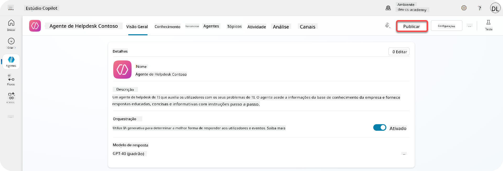

1. Selecione o botão **Publicar** no seu agente

    Isso abrirá o pop-up de publicação - para confirmar que você realmente deseja publicar o seu agente.

    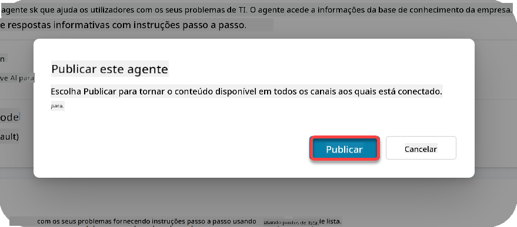

1. Selecione **Publicar** para confirmar a publicação do seu agente

    Agora uma mensagem será exibida indicando que o seu agente está sendo publicado. Não é necessário manter o pop-up aberto. Você será notificado quando o agente for publicado.

    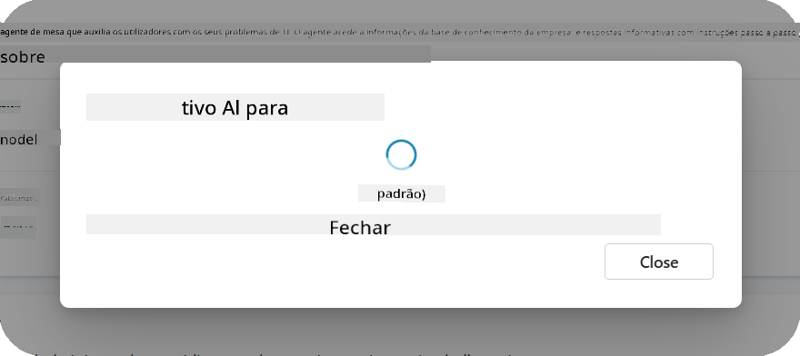

    Quando a publicação do agente estiver concluída, você verá a notificação no topo da página do agente.

    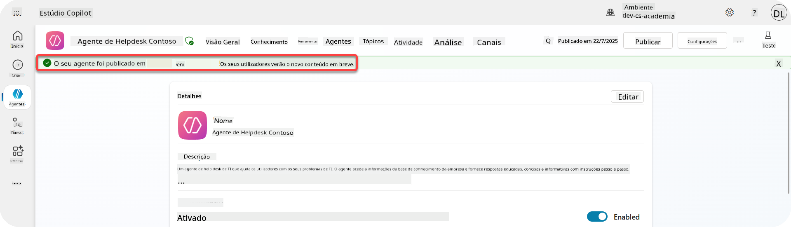

Mas - apenas publicamos o agente, ainda não o adicionamos a um canal, então vamos corrigir isso agora!

### 11.2 Adicione o canal Teams e Microsoft 365 Copilot

1. Para adicionar o canal Teams e Microsoft 365 Copilot ao nosso agente, precisamos selecionar **Canal** na navegação superior do agente

    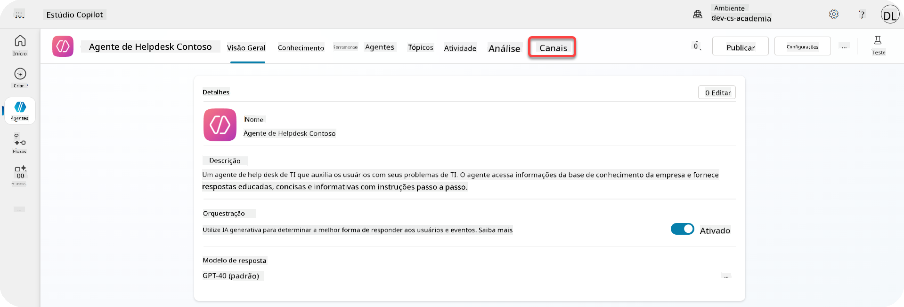

    Aqui podemos ver todos os canais que podemos adicionar a este agente.

1. Selecione **Teams e Microsoft 365**

    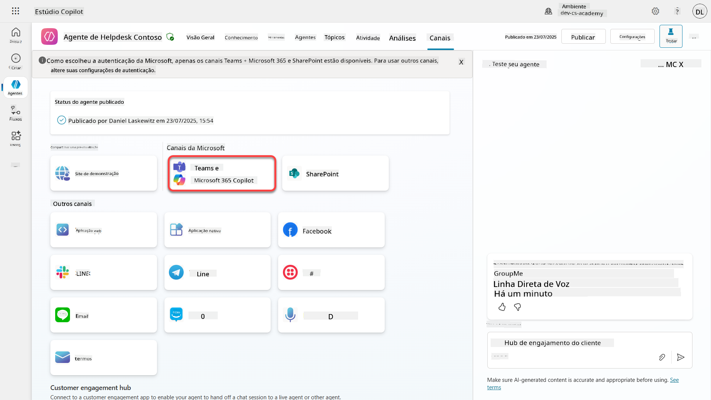

1. Selecione **Adicionar canal** para completar o assistente e adicionar o canal ao agente

    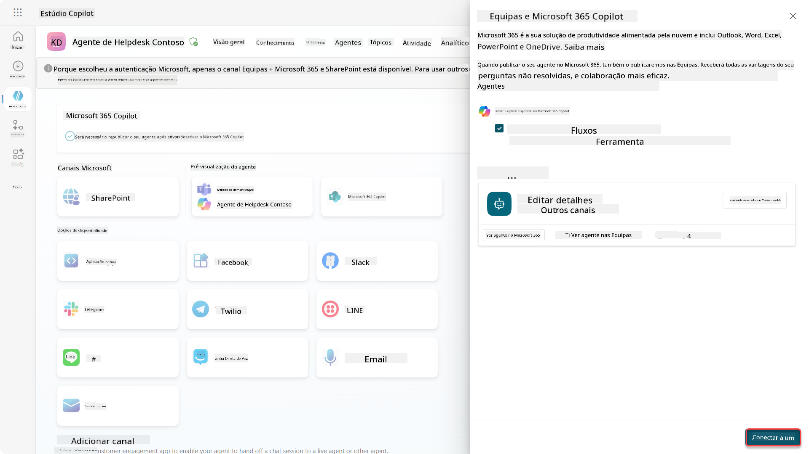

    Isso levará algum tempo até que seja adicionado. Após a adição, uma notificação verde aparecerá no topo da barra lateral.

    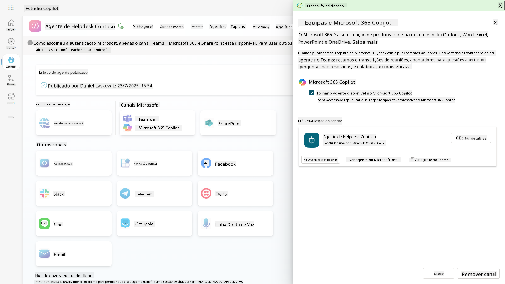

1. Selecione **Ver agente no Teams** para abrir uma nova aba

    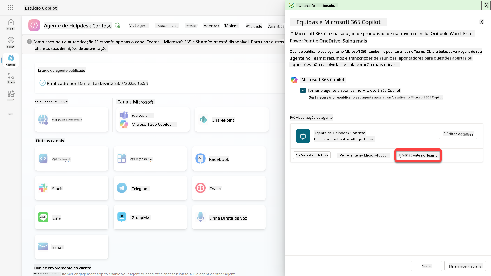

1. Selecione **Adicionar** para adicionar o agente de Help Desk da Contoso ao Teams

    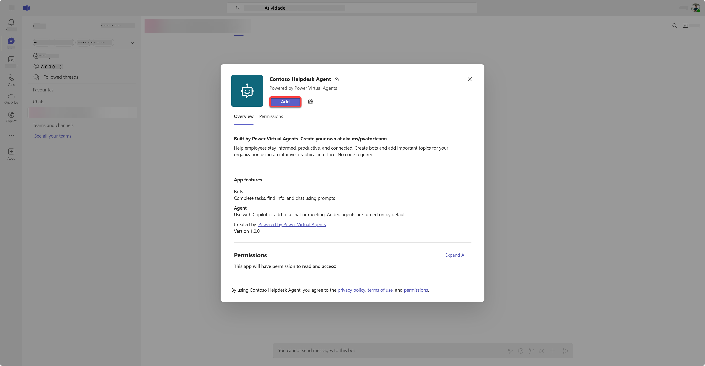

    Isso levará algum tempo. Após a conclusão, será exibida a seguinte tela:

    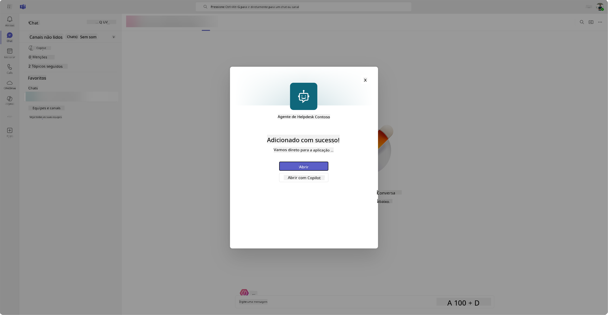

1. Selecione **Abrir** para abrir o agente no Teams

    Isso abrirá o agente no Teams como uma aplicação do Teams

    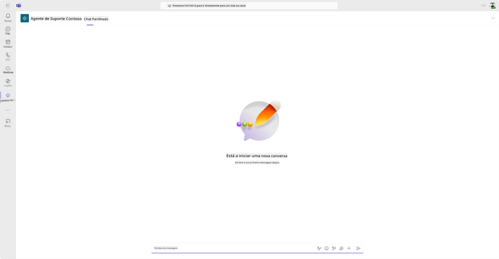

Agora publicamos o agente para funcionar no Microsoft Teams, mas talvez você queira torná-lo disponível para mais pessoas.

### 11.3 Torne o agente disponível para todos os utilizadores no tenant

1. Feche a aba do navegador onde o agente de Help Desk da Contoso está aberto

    Isso deve levá-lo de volta ao Copilot Studio, onde o painel lateral do Teams e Microsoft 365 Copilot ainda está aberto. Apenas abrimos o agente no Teams até agora, mas podemos fazer muito mais aqui. Podemos editar os detalhes do agente, implantá-lo para mais utilizadores e muito mais.

1. Selecione **Editar detalhes**

    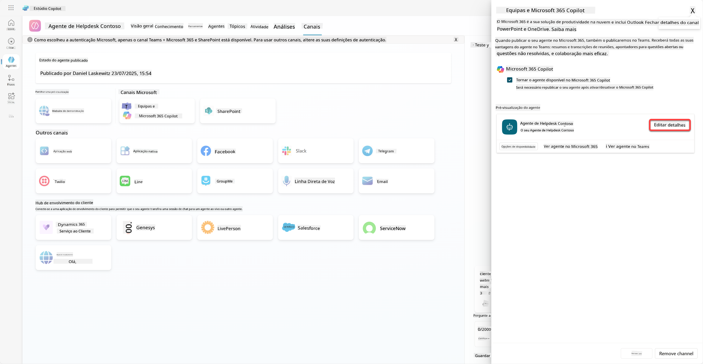
Isso abrirá um painel onde podemos alterar vários detalhes e configurações do agente. Podemos modificar detalhes básicos como o ícone, a cor de fundo do ícone e as descrições. Também podemos alterar as configurações do Teams (por exemplo, permitir que um utilizador adicione o agente a uma equipa ou permitir o uso deste agente em chats de grupo e reuniões) aqui. Ao selecionar *mais*, também é possível alterar detalhes do desenvolvedor, como o nome do desenvolvedor, o site, a declaração de privacidade e os termos de uso.

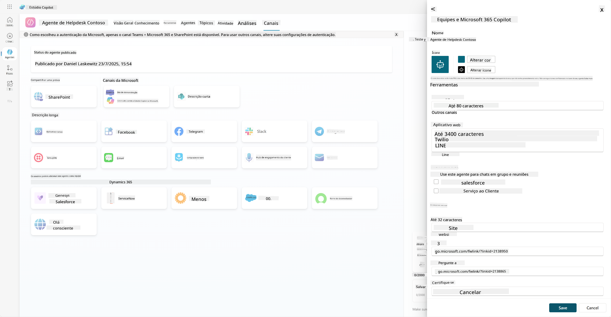

1. Selecione **Cancelar** para fechar o painel de edição de detalhes.

1. Selecione **Opções de disponibilidade**

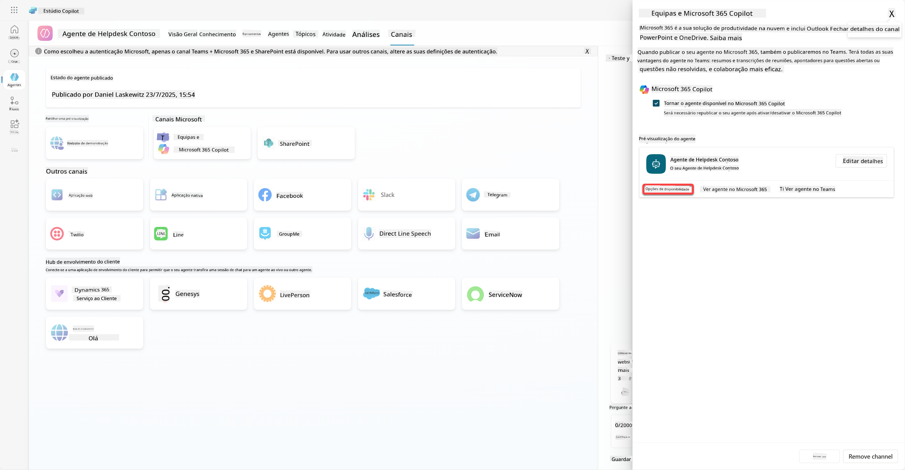

Isso abrirá o painel de opções de disponibilidade, onde pode copiar um link para enviar aos utilizadores para utilizarem este agente (atenção, é necessário partilhar o agente com o utilizador também) e pode descarregar um ficheiro para adicionar o seu agente à loja do Microsoft Teams ou Microsoft 365. Para mostrar o agente na loja, existem outras opções: pode mostrá-lo aos seus colegas de equipa e utilizadores partilhados (para aparecer na secção *Criado com Power Platform*) ou pode mostrá-lo a todos na sua organização (isso requer aprovação do administrador).

1. Selecione **Mostrar para todos na minha organização**

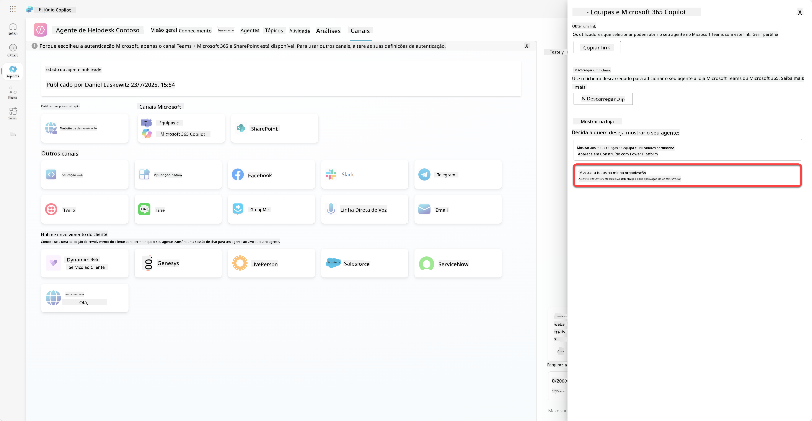

1. Selecione **Submeter para aprovação do administrador**

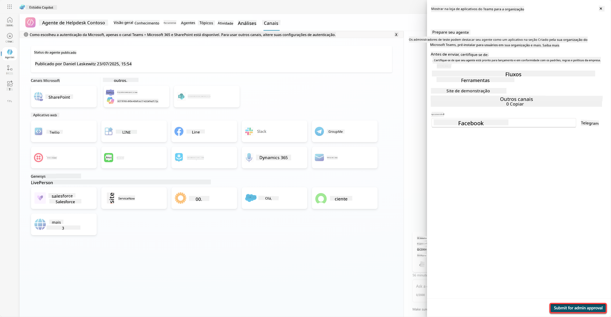

Agora, o seu administrador precisa aprovar a submissão do agente. Ele pode fazer isso indo ao Centro de Administração do Teams e procurando o Contoso Helpdesk Agent em Apps. Na captura de ecrã, pode ver o que o administrador verá no Centro de Administração do Teams.

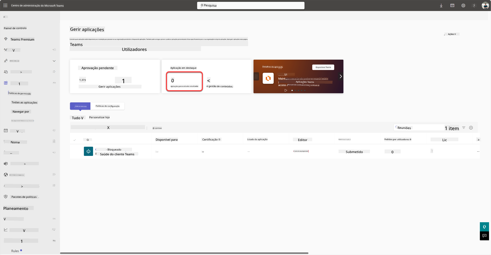

O administrador precisa selecionar o Contoso Helpdesk Agent e clicar em *Publicar* para disponibilizar o Contoso Helpdesk Agent para todos.

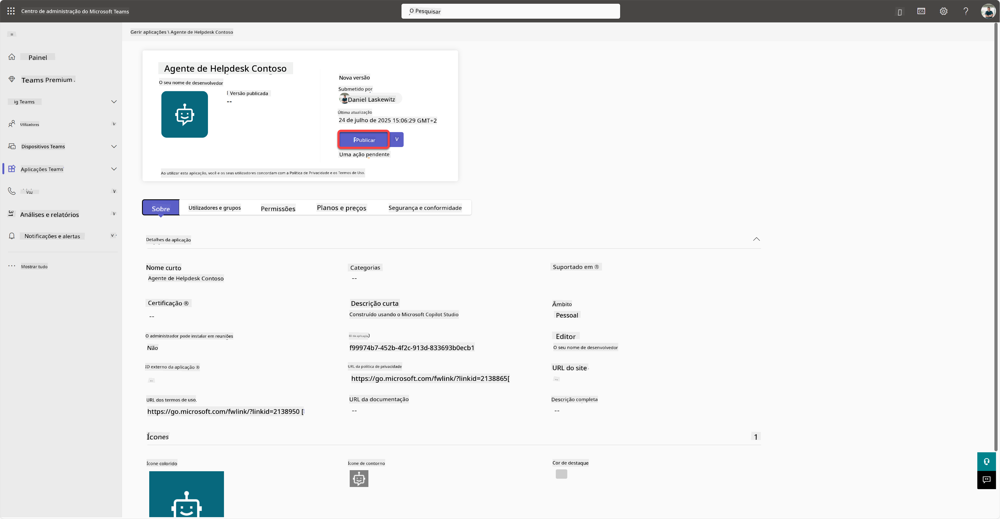

Quando o administrador publicar a submissão do agente, poderá atualizar o Copilot Studio e deverá ver o banner *disponível na loja de apps* nas opções de disponibilidade.

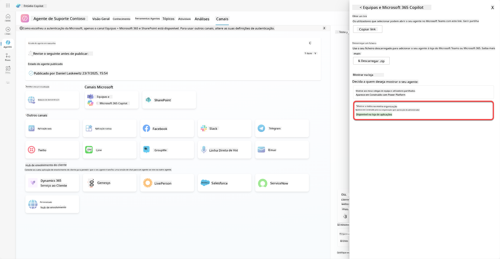

Existem ainda mais possibilidades aqui. O seu administrador pode alterar a política de configuração global e instalar automaticamente o Contoso Helpdesk Agent para todos no inquilino. Além disso, é possível fixar o Contoso Helpdesk Agent na barra lateral esquerda para que todos tenham fácil acesso a ele.

## ✅ Missão Concluída

🎉 **Parabéns!** Conseguiu publicar o seu agente e adicioná-lo ao Teams e ao Microsoft 365 Copilot! A seguir, temos a última missão do curso: Compreender licenciamento.

⏭️ [Avançar para a lição **Compreender licenciamento**](../12-understanding-licensing/README.md)

## 📚 Recursos Táticos

🔗 [Documentação sobre canais de publicação](https://learn.microsoft.com/microsoft-copilot-studio/publication-fundamentals-publish-channels)

---

**Aviso Legal**:  
Este documento foi traduzido utilizando o serviço de tradução por IA [Co-op Translator](https://github.com/Azure/co-op-translator). Embora nos esforcemos pela precisão, esteja ciente de que traduções automáticas podem conter erros ou imprecisões. O documento original na sua língua nativa deve ser considerado a fonte autoritária. Para informações críticas, recomenda-se uma tradução profissional realizada por humanos. Não nos responsabilizamos por quaisquer mal-entendidos ou interpretações incorretas decorrentes do uso desta tradução.