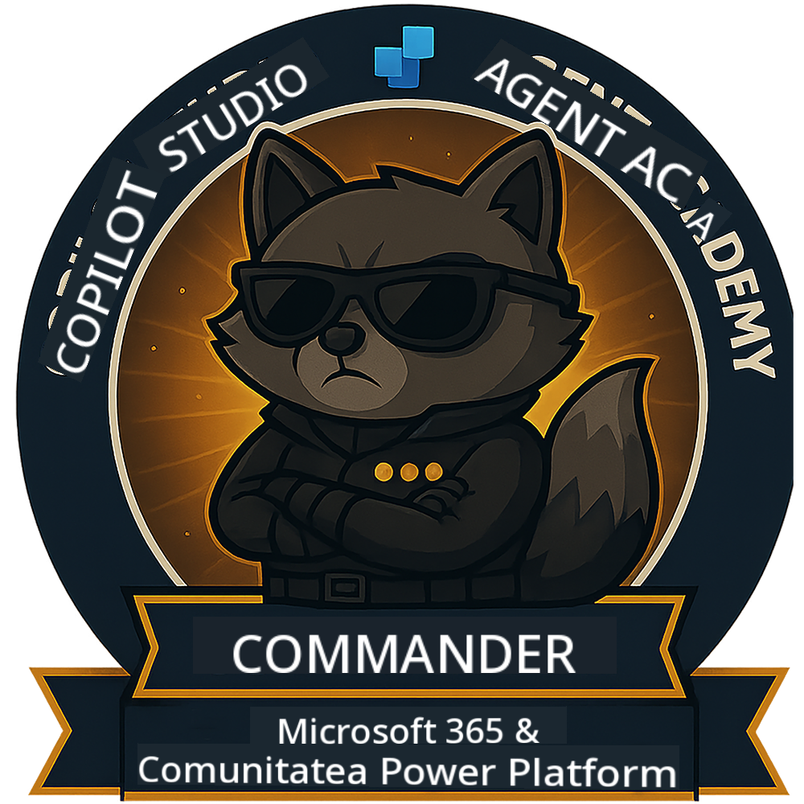

<!--
CO_OP_TRANSLATOR_METADATA:
{
  "original_hash": "8fb14b79c8616d9533f641ac2d555e8c",
  "translation_date": "2025-10-20T18:32:37+00:00",
  "source_file": "docs/commander/README.md",
  "language_code": "ro"
}
-->
---
hide:
- navigare
---

# Commander (În curând)

Acest curs este încă foarte secret. Va fi disponibil în viitor! 🔓

{ width="300" }

<!-- markdownlint-disable-next-line MD033 -->

---

**Declinare de responsabilitate**:  
Acest document a fost tradus folosind serviciul de traducere AI [Co-op Translator](https://github.com/Azure/co-op-translator). Deși ne străduim să asigurăm acuratețea, vă rugăm să fiți conștienți că traducerile automate pot conține erori sau inexactități. Documentul original în limba sa natală ar trebui considerat sursa autoritară. Pentru informații critice, se recomandă traducerea profesională realizată de oameni. Nu ne asumăm responsabilitatea pentru neînțelegerile sau interpretările greșite care pot apărea din utilizarea acestei traduceri.