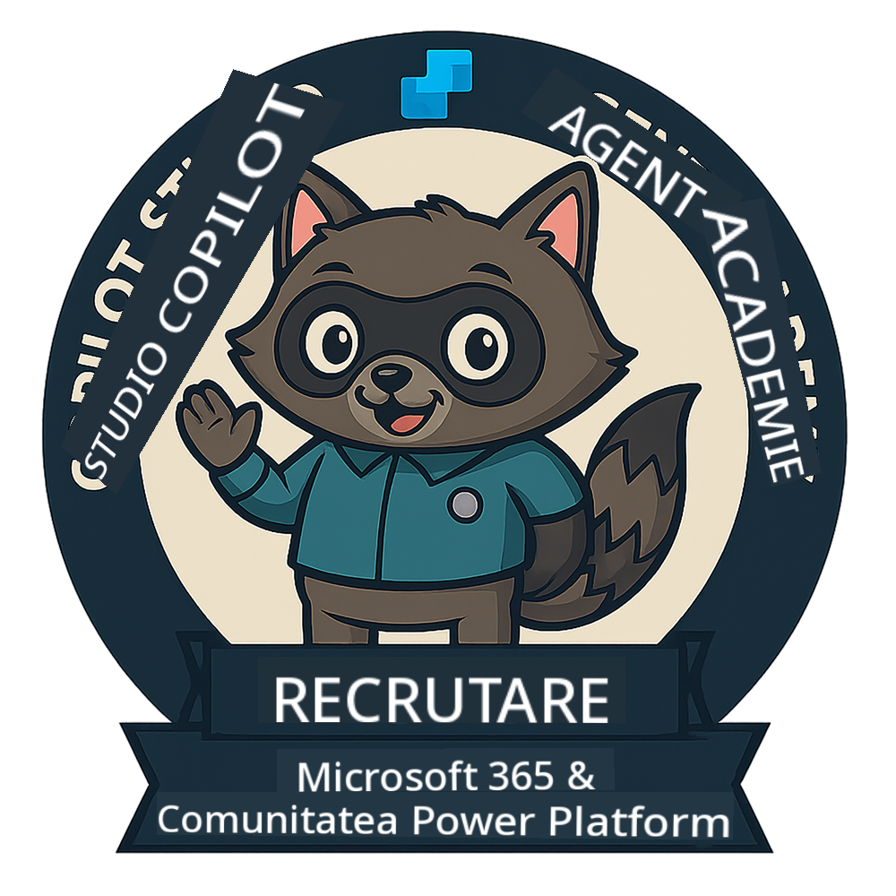
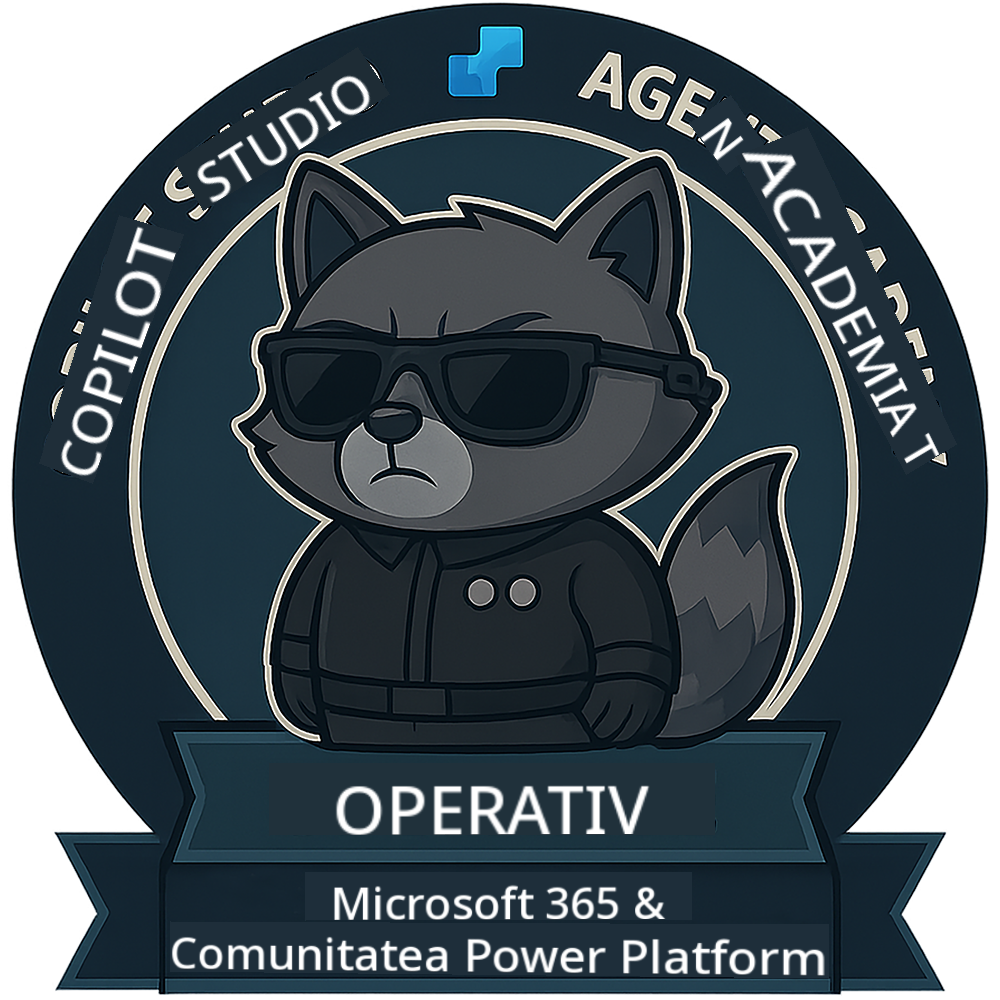

<!--
CO_OP_TRANSLATOR_METADATA:
{
  "original_hash": "15e57e059ce7689d602d7853187235cd",
  "translation_date": "2025-10-20T17:05:03+00:00",
  "source_file": "docs/index.md",
  "language_code": "ro"
}
-->
---
hide:
- navigation
---

# Academia Agent Copilot Studio

**Bun venit la Academia Agent Copilot Studio.**  

Misiunea ta—dacă alegi să o accepți—este să stăpânești arta construirii agenților folosind **Microsoft Copilot Studio**.

Acest training practic este punctul tău de intrare în **lumea agenților**: de la prompturi fundamentate la Adaptive Cards și fluxuri de agenți, vei învăța cum să construiești, să scalezi și să implementezi agenți inteligenți folosind instrumente și cazuri reale.

---

## 🏅 Progresul Rangului

**Academia Agent Copilot Studio** este un program de training în mai multe faze, conceput pentru a-ți dezvolta abilitățile pe trei ranguri de agent. Fiecare nivel include o insignă și responsabilități crescânde:

| Rang             | Nivel | Vizual |
|------------------|:-----:|--------|
| 🟢 **Recrut**  [🚀 Începe acum](https://aka.ms/agent-academy-recruit){ .md-button .md-button--primary }     | •     | { width="300" }     |
| 🔵 **Operativ** (În curând)   | ••    | { width="300" } |
| 🟡 **Comandant** (În curând)    | •••   | { width="300" } |

Fiecare nivel se bazează pe cel anterior. Finalizează misiunea de Recrut și rămâi conectat pentru a-ți avansa acreditările de agent.

---

## 🎒 Alte Cursuri

Descoperă aceste alte cursuri pentru a continua să înveți despre AI și Agenți:

- [Microsoft Copilot Studio <3 MCP Lab](https://aka.ms/mcsmcplab)
- [Tabăra de Dezvoltatori Copilot](https://microsoft.github.io/copilot-camp/)
- [Agenți AI pentru Începători](https://microsoft.github.io/ai-agents-for-beginners/)
- [Protocolul Contextului Modelului (MCP) pentru Începători](https://github.com/microsoft/mcp-for-beginners)

---

## 🚑 Probleme

Apreciem foarte mult feedback-ul tău! Te rugăm să folosești [lista de probleme](https://github.com/microsoft/agent-academy/issues) pentru a împărtăși comentariile și problemele tale. Mulțumim!

---

## 📜 Cod de Conduită

Acest proiect a adoptat [Codul de Conduită Open Source Microsoft](https://opensource.microsoft.com/codeofconduct/).

!!! info "Resurse:"

    - [Codul de Conduită Open Source Microsoft](https://opensource.microsoft.com/codeofconduct/)
    - [Întrebări frecvente despre Codul de Conduită Microsoft](https://opensource.microsoft.com/codeofconduct/faq/)
    - Contactează [opencode@microsoft.com](mailto:opencode@microsoft.com) pentru întrebări sau preocupări

---

[⭐️ Dă o stea depozitului nostru](https://github.com/microsoft/agent-academy){ .md-button .md-button--primary }

<!-- markdownlint-disable-next-line MD033 -->

---

**Declinare de responsabilitate**:  
Acest document a fost tradus folosind serviciul de traducere AI [Co-op Translator](https://github.com/Azure/co-op-translator). Deși ne străduim să asigurăm acuratețea, vă rugăm să fiți conștienți că traducerile automate pot conține erori sau inexactități. Documentul original în limba sa natală ar trebui considerat sursa autoritară. Pentru informații critice, se recomandă traducerea profesională realizată de oameni. Nu ne asumăm responsabilitatea pentru neînțelegeri sau interpretări greșite care pot apărea din utilizarea acestei traduceri.