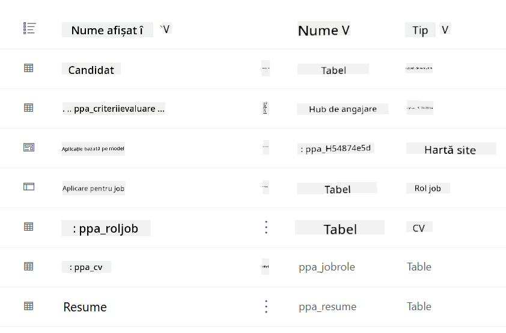
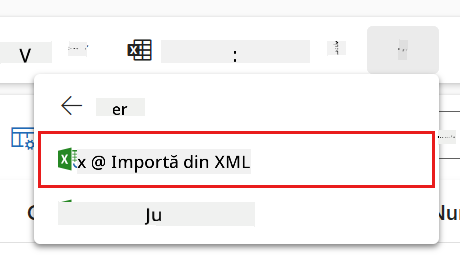
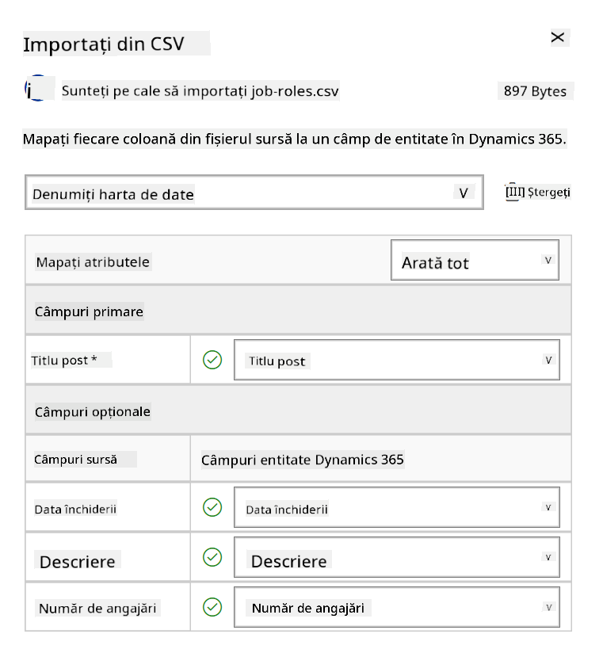
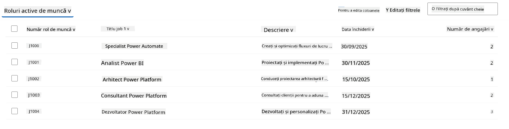
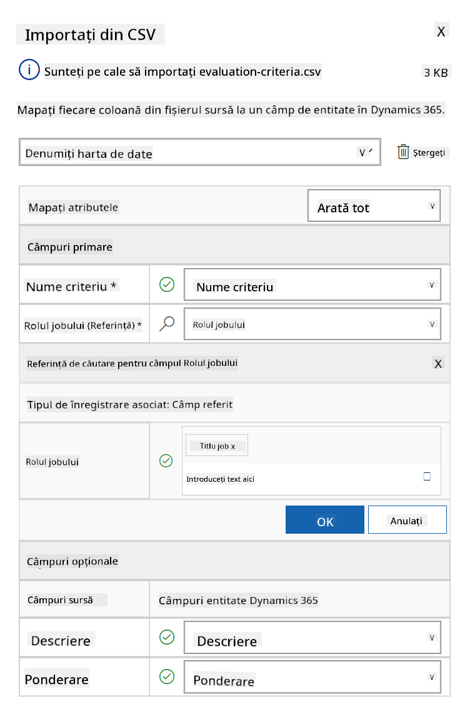
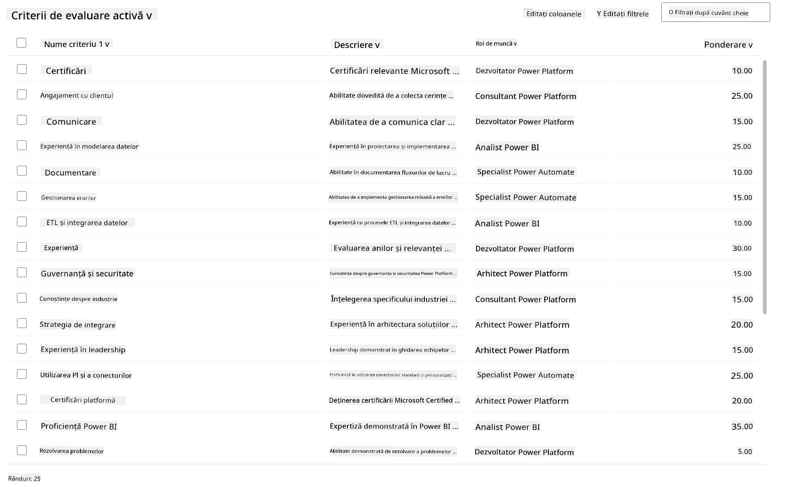

<!--
CO_OP_TRANSLATOR_METADATA:
{
  "original_hash": "2620cf9eaf09a3fc6be7fa31a3a62956",
  "translation_date": "2025-10-20T18:05:08+00:00",
  "source_file": "docs/operative-preview/01-get-started/README.md",
  "language_code": "ro"
}
-->
# 🚨 Misiunea 01: Începe cu Agentul de Recrutare

--8<-- "disclaimer.md"

## 🕵️‍♂️ NUME DE COD: `OPERAȚIUNEA SCOUT TALENT`

> **⏱️ Fereastra de Timp pentru Operațiune:** `~45 minute`

## 🎯 Descrierea Misiunii

Bun venit, Agent. Prima ta misiune este **Operațiunea Scout Talent** - stabilirea infrastructurii de bază pentru un sistem de recrutare bazat pe inteligență artificială, care va transforma modul în care organizațiile identifică și angajează talente de top.

Misiunea ta, dacă alegi să o accepți, este să implementezi și să configurezi un sistem complet de gestionare a recrutării folosind Microsoft Copilot Studio. Vei importa o soluție predefinită care conține toate structurile de date necesare, apoi vei crea primul tău agent AI - **Agentul de Recrutare** - care va fi orchestratorul central pentru toate operațiunile viitoare de recrutare.

Această implementare inițială stabilește centrul de comandă pe care îl vei îmbunătăți pe parcursul programului Operativ al Academiei de Agenți. Consideră aceasta baza ta de operațiuni - fundația pe care vei construi o întreagă rețea de agenți specializați în misiunile ulterioare.

---

## 🔎 Obiective

Prin completarea acestei misiuni, vei:

- **Înțelegerea Scenariului**: Dobândi cunoștințe cuprinzătoare despre provocările și soluțiile automatizării recrutării
- **Implementarea Soluției**: Importa și configura cu succes elementele fundamentale ale unui sistem de gestionare a recrutării
- **Crearea Agentului**: Construi un agent de recrutare care reprezintă începutul scenariului pe care îl vei dezvolta ca Operativ al Academiei de Agenți

---

## 🔍 Cerințe Prealabile

Înainte de a începe această misiune, asigură-te că ai:

- Licență pentru Copilot Studio
- Acces la un mediu Microsoft Power Platform
- Permisiuni administrative pentru a crea soluții și agenți

---

## 🏢 Înțelegerea Scenariului de Automatizare a Recrutării

Acest scenariu demonstrează cum o companie poate utiliza Microsoft Copilot Studio pentru a îmbunătăți și automatiza procesul său de recrutare. Introduce un sistem de agenți care colaborează pentru a gestiona sarcini precum revizuirea CV-urilor, recomandarea rolurilor de muncă, pregătirea materialelor pentru interviuri și evaluarea candidaților.

### Valoarea pentru Afaceri

Soluția ajută echipele de resurse umane să economisească timp și să ia decizii mai bune prin:

- Procesarea automată a CV-urilor primite prin e-mail.
- Sugestii de roluri de muncă potrivite pe baza profilurilor candidaților.
- Crearea aplicațiilor pentru locuri de muncă și ghidurilor de interviu personalizate pentru fiecare candidat.
- Asigurarea practicilor de recrutare echitabile și conforme prin funcții de siguranță și moderare integrate.
- Colectarea feedback-ului pentru îmbunătățirea soluției.

### Cum Funcționează

- Un **Agent de Recrutare** central coordonează procesul și stochează datele în Microsoft Dataverse.
- Un **Agent de Primire a Aplicațiilor** citește CV-urile și creează aplicații pentru locuri de muncă.
- Un **Agent de Pregătire a Interviurilor** generează întrebări și documente pentru interviuri pe baza experienței candidatului.
- Sistemul poate fi publicat pe un site demo, permițând părților interesate să interacționeze cu acesta.

Acest scenariu este ideal pentru organizațiile care doresc să modernizeze fluxurile de lucru de recrutare folosind automatizarea bazată pe AI, menținând în același timp transparența, echitatea și eficiența.

---

## 🧪 Laborator: Configurarea Agentului de Recrutare

În acest laborator practic, vei stabili fundația sistemului tău de automatizare a recrutării. Vei începe prin importarea unei soluții preconfigurate care conține toate tabelele Dataverse necesare și structura de date pentru gestionarea candidaților, pozițiilor de muncă și fluxurilor de lucru de recrutare. Apoi, vei popula aceste tabele cu date de probă care vor sprijini învățarea ta pe parcursul acestui modul și vor oferi scenarii realiste pentru testare. În final, vei crea Agentul de Recrutare în Copilot Studio, configurând interfața conversațională de bază care va fi piatra de temelie pentru toate celelalte funcții pe care le vei adăuga în misiunile viitoare.

### 🧪 Laborator 1.1: Importarea soluției

1. Accesează **[Copilot Studio](https://copilotstudio.microsoft.com)**
1. Selectează **...** în navigarea din stânga și alege **Solutions**
1. Apasă pe butonul **Import Solution** din partea de sus
1. **[Descarcă](https://raw.githubusercontent.com/microsoft/agent-academy/refs/heads/main/docs/operative-preview/01-get-started/assets/Operative_1_0_0_0.zip)** soluția pregătită
1. Selectează **Browse** și alege soluția descărcată în pasul anterior
1. Apasă **Next**
1. Apasă **Import**

!!! success
    Dacă importul este reușit, vei vedea o bară verde de notificare cu următorul mesaj:  
    "Solution "Operative" imported successfully."

După ce soluția este importată, analizează ce ai importat selectând numele afișat al soluției (`Operative`).



Următoarele componente sunt importate:

| Nume Afișat | Tip | Descriere |
|-------------|------|-------------|
| Candidate | Tabel | Informații despre candidați |
| Evaluation Criteria | Tabel | Criterii de evaluare pentru rol |
| Hiring Hub | Aplicație Model-Driven | Aplicație pentru gestionarea procesului de recrutare |
| Hiring Hub | Site Map | Structura de navigare pentru aplicația Hiring Hub |
| Job Application | Tabel | Aplicații pentru locuri de muncă |
| Job Role | Tabel | Roluri de muncă |
| Resume | Tabel | CV-urile candidaților |

Ca ultimă sarcină pentru acest laborator, apasă pe butonul **Publish all customizations** din partea de sus a paginii.

### 🧪 Laborator 1.2: Importarea datelor de probă

În acest laborator, vei adăuga date de probă în unele dintre tabelele pe care le-ai importat în laboratorul 1.1.

#### Descarcă fișierele pentru import

1. **[Descarcă](https://raw.githubusercontent.com/microsoft/agent-academy/refs/heads/main/docs/operative-preview/01-get-started/assets/evaluation-criteria.csv)** fișierul CSV cu criteriile de evaluare
1. **[Descarcă](https://raw.githubusercontent.com/microsoft/agent-academy/refs/heads/main/docs/operative-preview/01-get-started/assets/job-roles.csv)** fișierul CSV cu rolurile de muncă

#### Importarea datelor de probă pentru Rolurile de Muncă

1. Revino la soluția pe care tocmai ai importat-o în laboratorul anterior
1. Selectează aplicația **Hiring Hub** Model-Driven App bifând rândul corespunzător
1. Apasă pe butonul **Play** din partea de sus

    !!! warning
        Este posibil să ți se solicite să te autentifici din nou. Asigură-te că faci acest lucru. După aceea, ar trebui să vezi aplicația Hiring Hub.

1. Selectează **Job Roles** în navigarea din stânga
1. Apasă pe pictograma **More** (trei puncte verticale) din bara de comandă
1. Apasă pe **săgeata dreaptă** de lângă *Import from Excel*

    

1. Selectează **Import from CSV**

    

1. Apasă pe butonul **Choose File**, selectează fișierul **job-roles.csv** pe care tocmai l-ai descărcat și apoi apasă **Open**
1. Apasă **Next**
1. Lasă pasul următor așa cum este și apasă **Review Mapping**

    

1. Asigură-te că maparea este corectă și apasă **Finish Import**

    !!! info
        Acest lucru va începe un import și vei putea urmări progresul sau finaliza procesul imediat apăsând **Done**

1. Apasă **Done**

Acest proces poate dura puțin, dar poți apăsa butonul **Refresh** pentru a verifica dacă importul a fost finalizat cu succes.



#### Importarea datelor de probă pentru Criteriile de Evaluare

1. Selectează **Evaluation Criteria** în navigarea din stânga
1. Apasă pe pictograma **More** (trei puncte verticale) din bara de comandă
1. Apasă pe **săgeata dreaptă** de lângă *Import from Excel*

    

1. Selectează **Import from CSV**

    

1. Apasă pe butonul **Choose File**, selectează fișierul **evaluation-criteria.csv** pe care tocmai l-ai descărcat și apoi apasă **Open**
1. Apasă **Next**
1. Lasă pasul următor așa cum este și apasă **Review Mapping**

    

1. Acum trebuie să facem puțin mai mult pentru mapare. Apasă pe lupa (pictograma 🔎) de lângă câmpul Job Role
1. Asigură-te că **Job Title** este selectat aici, iar dacă nu - adaugă-l
1. Apasă **OK**
1. Asigură-te că restul mapării este corect și apasă **Finish Import**

    !!! info
        Acest lucru va începe din nou un import și vei putea urmări progresul sau finaliza procesul imediat apăsând **Done**

1. Apasă **Done**

Acest proces poate dura puțin, dar poți apăsa butonul **Refresh** pentru a verifica dacă importul a fost finalizat cu succes.



### 🧪 Laborator 1.3: Crearea agentului de recrutare

Acum că ai terminat configurarea cerințelor prealabile, este timpul pentru munca propriu-zisă! Să adăugăm mai întâi Agentul de Recrutare!

1. Accesează **[Copilot Studio](https://copilotstudio.microsoft.com)** și asigură-te că ești în același mediu în care ai importat soluția și datele
1. Selectează **Agents** în navigarea din stânga
1. Apasă pe **New Agent**
1. Selectează **Configure**
1. Pentru **Name**, introdu:

    ```text
    Hiring Agent
    ```

1. Pentru **Description**, introdu:

    ```text
    Central orchestrator for all hiring activities
    ```

1. Apasă pe **...** lângă butonul *Create* din colțul din dreapta sus
1. Selectează **Update advanced settings**
1. Ca **Solution**, selectează `Operative`
1. Apasă **Update**
1. Apasă **Create** în colțul din dreapta sus

Acest lucru va crea Agentul de Recrutare pentru tine, pe care îl vei folosi pe parcursul acestui curs Operativ.

---

## 🎉 Misiune Finalizată

Misiunea 01 este completă! Acum ai stăpânit următoarele abilități:

✅ **Înțelegerea Scenariului**: Cunoștințe cuprinzătoare despre provocările și soluțiile automatizării recrutării  
✅ **Implementarea Soluției**: Importarea și configurarea cu succes a elementelor fundamentale ale unui sistem de gestionare a recrutării  
✅ **Crearea Agentului**: Construirea unui agent de recrutare care reprezintă începutul scenariului pe care îl vei dezvolta ca Operativ al Academiei de Agenți  

Urmează [Misiunea 02](../02-multi-agent/README.md): Fă-ți agentul pregătit pentru multi-agent cu agenți conectați.

---

## 📚 Resurse Tactice

📖 [Microsoft Copilot Studio - Crearea unui agent](https://learn.microsoft.com/microsoft-copilot-studio/authoring-first-bot)  
📖 [Documentația Microsoft Dataverse](https://learn.microsoft.com/power-apps/maker/data-platform)

---

**Declinare de responsabilitate**:  
Acest document a fost tradus folosind serviciul de traducere AI [Co-op Translator](https://github.com/Azure/co-op-translator). Deși ne străduim să asigurăm acuratețea, vă rugăm să fiți conștienți că traducerile automate pot conține erori sau inexactități. Documentul original în limba sa maternă ar trebui considerat sursa autoritară. Pentru informații critice, se recomandă traducerea profesională realizată de oameni. Nu ne asumăm responsabilitatea pentru neînțelegeri sau interpretări greșite care pot apărea din utilizarea acestei traduceri.