<!--
CO_OP_TRANSLATOR_METADATA:
{
  "original_hash": "75efaf515d5694d4fd549bfd6518901a",
  "translation_date": "2025-10-20T18:25:40+00:00",
  "source_file": "docs/operative-preview/03-automate-triggers/README.md",
  "language_code": "ro"
}
-->
# Misiunea 03: Adăugarea declanșatorilor de evenimente pentru a acționa autonom

--8<-- "disclaimer.md"

## 🕵️‍♂️ NUME DE COD: `OPERAȚIUNEA SIGNAL POINT`

> **⏱️ Fereastra de timp a operațiunii:** `~45 minute`

## 🎯 Rezumatul misiunii

Bine ai revenit, Agent. În [Misiunea 02](../02-multi-agent/README.md) - ai învățat cum să construiești un agent copil pentru primirea aplicațiilor și un agent conectat pentru pregătirea interviurilor, extinzând astfel capacitățile principalului tău Agent de Recrutare.

Misiunea ta, dacă alegi să o accepți, este **Operațiunea Signal Point** - aprofundarea conceptului de **declanșatori de evenimente** - ridicând sistemul tău de agenți de la reactiv la **funcționare autonomă**. Vei transforma agenții tăi din așteptarea inputului uman în răspunsuri proactive la evenimente externe și acțiuni inteligente fără supraveghere.

Gândește-te la asta ca la o actualizare de la agenți care _răspund la întrebări_ la agenți care _anticipează nevoile_ și _acționează independent_. Prin declanșatori de evenimente și fluxuri automatizate, Agentul tău de Recrutare va detecta emailurile cu CV-uri primite, va procesa automat atașamentele, va stoca datele în Dataverse și va notifica echipa ta de recrutare HR prin Microsoft Teams - totul în timp ce tu te concentrezi pe sarcini de valoare mai mare.

Bine ai venit în lumea unde automatizarea întâlnește inteligența.

## 🔎 Obiective

În această misiune, vei învăța:

1. Cum declanșatorii de evenimente permit comportamentul autonom al agenților fără interacțiunea utilizatorului
1. Diferențele dintre agenții interactivi și autonomi în Copilot Studio
1. Cum să creezi declanșatori de evenimente care procesează automat atașamentele emailurilor și încarcă fișierele în Dataverse
1. Cum să construiești fluxuri de agenți care postează carduri adaptive în canalele Teams pentru notificări
1. Cum să transmiți date între declanșatori de evenimente și fluxuri de agenți pentru automatizare completă

## 🤔 Ce este un declanșator de eveniment?

Anterior, în [Recruit](../../recruit/10-add-event-triggers/README.md), am învățat despre declanșatorii de evenimente. Să facem un scurt rezumat în cazul în care ai ratat acest subiect.

**Declanșatorii de evenimente** permit unui agent să _acționeze_ pe cont propriu atunci când ceva se întâmplă într-un alt sistem - fără a fi necesar un mesaj de la utilizator. Când evenimentul configurat se declanșează - cum ar fi „element nou în SharePoint,” „email nou,” „task atribuit în Planner” sau chiar o recurență bazată pe timp, un conector trimite un payload de declanșare către agentul tău. Agentul urmează apoi instrucțiunile tale pentru a decide ce acțiuni sau subiecte să apeleze.

### Caracteristici cheie

- **Activare autonomă:**
      - Spre deosebire de declanșatorii de subiecte care pornesc atunci când un utilizator scrie agentului, declanșatorii de evenimente se declanșează din evenimente externe, permițând un comportament proactiv.

- **Bazat pe payload:**
      - Fiecare eveniment livrează un payload (variabile + instrucțiuni opționale) printr-un conector. Agentul folosește instrucțiunile definite de tine și payload-ul pentru a decide ce să facă în continuare.
      - De exemplu, _apelează un subiect_ sau _execută acțiuni definite de instrumente_.

- **Exemple disponibile din start:**
      - Fișier sau element creat în SharePoint/OneDrive
      - Task completat/atribuit în Planner
      - Răspuns trimis în Microsoft Forms
      - Recurență/programare

    Disponibilitatea depinde de politicile de date ale organizației tale configurate în Power Automate.

- **Necesită orchestrare generativă:**
      - Declanșatorii de evenimente sunt disponibili doar atunci când orchestrarea generativă este activată pentru agent.

- **Facturare/utilizare:**
      - Fiecare livrare a unui declanșator este considerată un mesaj în capacitatea Copilot Studio.
      - De exemplu, o recurență de 10 minute trimite un mesaj la fiecare 10 minute.

- **Model de autentificare și configurare:**
      - Adaugi declanșatori în cadrul secțiunii de prezentare a agentului, sub _Triggers_. Autentificarea pentru conectorul de declanșare folosește contul creatorului agentului („autentificarea autorului agentului”).
      - Poți edita parametrii declanșatorului și payload-ul în portalul Power Automate maker.

- **Testare și observabilitate:**
      - Poți testa declanșatorii din panoul de testare al agentului și poți inspecta comportamentul cu harta activităților înainte de publicare.

!!! info "Pe scurt pentru dezvoltatori"

    Gândește-te la declanșatorii de evenimente ca la **semnale asemănătoare webhook-urilor** care trimit un payload structurat către agentul tău, permițându-i să _inițieze_ activități și să lege acțiuni între sisteme - fără a aștepta ca un utilizator să întrebe.

### Declanșatorii de subiecte - cum diferă

Anterior, ai învățat despre declanșatorii de subiecte în [Recruit](../../recruit/07-add-new-topic-with-trigger/README.md), totuși s-ar putea să te întrebi cum diferă _declanșatorii de subiecte_ de _declanșatorii de evenimente_ și de ce această distincție este importantă pentru a înțelege ce face un agent autonom.

Declanșatorii de subiecte controlează _momentul în care un subiect rulează_, de obicei ca răspuns la un mesaj al utilizatorului.

- În orchestrarea generativă, declanșatorul implicit este **By agent** - planificatorul alege un subiect al cărui nume/descriere se potrivește cel mai bine cu mesajul utilizatorului.
- În orchestrarea clasică, declanșatorul implicit este **Phrases** - planificatorul alege un subiect atunci când una sau mai multe fraze de declanșare se potrivesc cel mai bine cu mesajul utilizatorului.

Alte tipuri de declanșatori includ `Message received`, `Event received`, `Activity received`, `Conversation update`, `Invoke received`, `On redirect`, `Inactivity` și `Plan complete`.

!!! info "Diferența principală"

    Declanșatorii de subiecte sunt _inițiatori de activitate conversațională_ în cadrul chatului.
    
    Declanșatorii de evenimente sunt _inițiatori de evenimente de sistem_ livrate prin conectori care pot rula agentul fără nicio conversație.

### Ghid rapid pentru declanșatorii de subiecte vs declanșatorii de evenimente

- **Declanșator de subiect:** Utilizatorul (sau activitatea chatului) a spus/a făcut X ➡️ rulează Subiectul T.
- **Declanșator de eveniment:** SharePoint/Planner/Email/Timer s-a declanșat cu payload-ul P ➡️ agentul evaluează instrucțiunile ➡️ apelează Acțiuni/Subiecte corespunzător.

## 🏓 Agent interactiv vs Agent autonom - comparație

Acum că știi diferența dintre declanșatorii de evenimente și declanșatorii de subiecte, să învățăm următoarea diferență dintre un agent interactiv și un agent autonom.

În termenii Copilot Studio, "interactiv" se referă la agenți care interacționează în principal prin **subiecte** într-un chat sau canal. "Autonom" se referă la agenți care utilizează și **declanșatori de evenimente** pentru a rula fără inputul utilizatorului.

Următorul tabel rezumă diferențele și asemănările lor.

| Dimensiune                          | Agent interactiv      | Agent autonom                                                                                                 |
|-------------------------------------|-----------------------|---------------------------------------------------------------------------------------------------------------|
| Cum începe                          | Utilizatorul (sau activitatea chatului) declanșează un subiect. Exemplu: By agent, Phrases, Message received. | Declanșatorul de eveniment extern trimite un payload prin conector către agent. Exemplu: SharePoint, Planner, email, programare etc. |
| Utilizare principală                | Întrebări și răspunsuri, fluxuri ghidate, acțiuni la cerere în chat - Teams, web etc. | Operațiuni proactive și automatizare în fundal - reacționează la schimbările de sistem și apoi notifică, arhivează sau orchestrează sarcini. |
| Suprafața declanșatorului           | Declanșatori de subiecte: By agent / Phrases / Message received / Tipuri de activitate / Invoke / Inactivity / Plan complete | Biblioteca de declanșatori de evenimente prin conectori; payload-ul include datele evenimentului + instrucțiuni opționale. |
| Planificator (orchestrare generativă)| Foarte utilizat pentru declanșatorii By agent și Plan complete pentru a selecta/secvenția subiecte. | Necesită pentru declanșatorii de evenimente; agentul folosește instrucțiunile + payload-ul pentru a decide ce acțiuni/subiecte să apeleze. |
| Exemplu tipic                       | Utilizatorul întreabă "Care este politica noastră de rambursare?" → Subiectul rulează, interoghează cunoștințele, răspunde. | Task nou atribuit în Planner → Declanșatorul de eveniment se activează → Agentul postează un mesaj în Teams, actualizează un registru sau apelează un subiect. |
| Calea de configurare                | Creează subiecte, definește tipul de declanșator, autorizează dialog/acțiuni; publică în canale. | Adaugă declanșator de eveniment (Overview → Triggers), autentifică conectorul cu acreditările autorului agentului, configurează payload-ul/instrucțiunile; testează prin panoul de testare; publică. |
| Autentificare și guvernanță         | Rulează sub contextul canalului/autentificării; declanșatorii de subiecte răspund la activitățile chatului în canalele permise. | Disponibilitatea declanșatorului depinde de politicile de date Power Automate; conectorii rulează sub contul creatorului agentului. |
| Observabilitate                     | Testează subiectele în Copilot Studio, inspectează transcripturile conversațiilor/activităților. | Folosește Test trigger și harta activităților pentru a valida execuția înainte de publicare, monitorizează activitatea după publicare. |
| Impact asupra capacității           | Fiecare mesaj al utilizatorului/răspuns al agentului este un mesaj care consumă capacitate. | Fiecare livrare de eveniment este, de asemenea, un mesaj, plus orice acțiuni ulterioare. Exemplu: o recurență de 10 minute = 6 mesaje/oră |

### Când să folosești ce?

- Alege **declanșatori de subiecte (interactivi)** atunci când utilizatorii inițiază conversația cu agentul - FAQ, primire ghidată sau sarcini de tip comandă în chat. Declanșatorul By agent al planificatorului reduce curarea manuală a frazelor.
- Adaugă **declanșatori de evenimente (autonomi)** atunci când agentul ar trebui să înceapă conversația sau să acționeze singur - la actualizări în SharePoint/Dataverse, emailuri primite sau conform unui program. Acest lucru te mută de la operațiuni reactive la operațiuni proactive.

## Sfaturi și atenționări pentru dezvoltatori

1. **Activează orchestrarea generativă** pentru orice agent pe care dorești să-l faci autonom. Declanșatorii de evenimente nu vor apărea altfel.

1. **Modelează payload-ul devreme.** Decide ce câmpuri minime are nevoie agentul tău de la declanșator, cum ar fi `itemId`, `assignedTo`, `dueDate` și adaugă instrucțiuni concise care să indice agentului ce acțiune/subiect să apeleze pe baza valorilor payload-ului.

1. **Domeniul de autentificare contează.** Declanșatorii se autentifică folosind contul creatorului agentului. Asigură-te că acel cont are permisiunile corecte ale conectorului și respectă politicile de date Power Automate.

1. **Controlează costurile și zgomotul.** Recurențele frecvente sau sursele foarte active pot consuma rapid capacitatea de mesaje - limitează acolo unde este posibil sau adaugă condiții în declanșator pentru a filtra evenimentele.

1. **Testează înainte de publicare.** Folosește **Test trigger** și harta activităților pentru a urmări planul și acțiunile apelate - ajustează instrucțiunile/payload-ul până când comportamentul este stabil.

## 🧪 Laboratorul 03 - Automatizarea emailurilor de aplicație ale candidaților

Urmează să adăugăm un declanșator de eveniment la **Agentul de Recrutare** și să construim un flux de agent în cadrul **Agentului de Primire a Aplicațiilor** pentru a gestiona procesarea ulterioară pentru autonomie.

### ✨ Scenariu de utilizare

!!! info ""

    **Ca** Recrutor HR

    **Doresc** să fiu notificat atunci când un email cu un CV ajunge în Inbox-ul meu și este încărcat automat în Dataverse

    **Pentru a putea** fi la curent cu CV-urile trimise prin email pentru aplicații încărcate automat în Dataverse

Vom realiza acest lucru folosind două tehnici:

1. Un declanșator de eveniment pentru momentul în care emailul ajunge,
    1. Verifică dacă `contentType` al fișierului este egal cu `PDF` ca tip de format.
    1. Extrage fișierul și încarcă-l în Dataverse folosind acțiuni prin conectorul Dataverse.
    1. Apoi trimite un prompt agentului pentru procesare ulterioară, transmițând parametrii de intrare din acțiunile Dataverse.

1. Un flux de agent va fi adăugat la copilul **Agent de Primire a Aplicațiilor**, care este invocat de promptul din declanșatorul de eveniment.
    1. Folosește parametrii de intrare transmiși din promptul declanșatorului de eveniment într-un card adaptiv postat într-un canal din Microsoft Teams pentru a notifica echipa de recrutare HR. Cardul adaptiv va avea un link către rândul din Dataverse care va fi vizualizat în **Agentul de Recrutare**.

Să începem!

### ✨ Cerințe preliminare pentru finalizarea misiunii

Va trebui să **fie**:

- **Să fi finalizat Misiunea 01 și Misiunea 02** și să ai Agentul de Recrutare pregătit, **SAU**
- **Să imporți soluția de început pentru Misiunea 03** dacă începi de la zero sau ai nevoie să recuperezi. [Descarcă soluția de început pentru Misiunea 03](https://aka.ms/agent-academy)

!!! note "Importul soluției și datele de probă"
    Dacă folosești soluția de început, consultă [Misiunea 01](../01-get-started/README.md) pentru instrucțiuni detaliate despre cum să imporți soluții și date de probă în mediul tău.

De asemenea, vei avea nevoie de acces la **Microsoft Teams** pentru a finaliza al doilea exercițiu de laborator privind postarea unui card adaptiv în Microsoft Teams.

### Laboratorul 3.1 - Automatizarea încărcării CV-urilor în Dataverse primite prin email

1. În Agentul de Recrutare, derulează în jos în **fila Overview** și selectează **+ Add trigger**.

       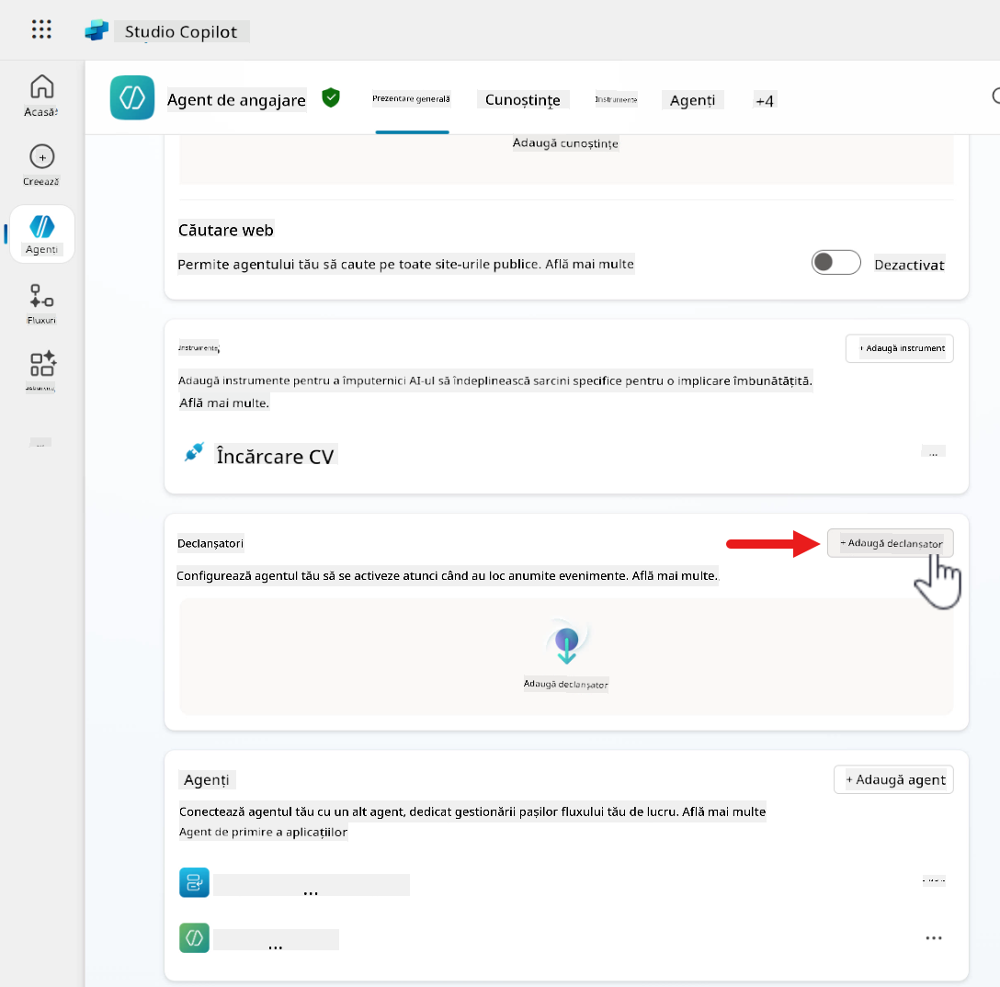

1. Va apărea o listă de declanșatori. Selectează **When a new email arrives (V3)** și apasă **Next**.

       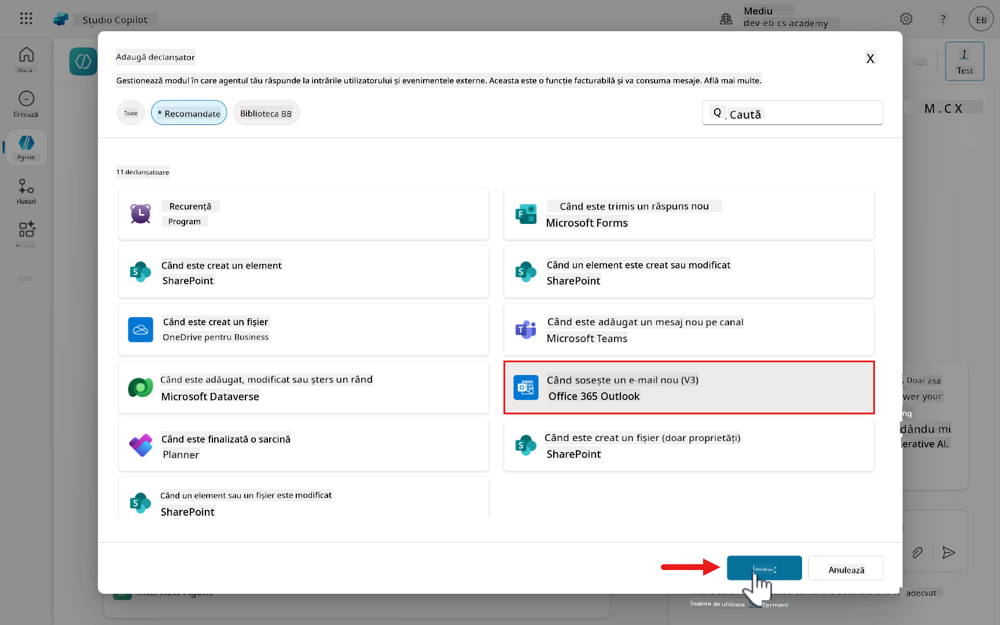

1. Vom vedea acum **Numele declanșatorului** și referințele de conexiune **Sign in** pentru aplicațiile listate.

       Redenumește numele declanșatorului astfel:
    
       ```text
       When a new email arrives from an applicant
       ```

       Asigură-te că vezi o bifă verde lângă fiecare dintre referințele de conexiune ale aplicațiilor listate. Dacă
Acum vom actualiza declanșatorul evenimentului pentru a adăuga mai multe capabilități de automatizare. Selectați **ellipsis (...)** de lângă declanșator și alegeți **Edit in Power Automate**.

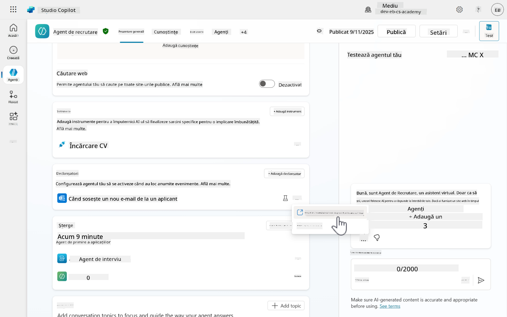

1. Declanșatorul se va încărca apoi ca un flux în portalul Power Automate maker. Ceea ce vedeți este designerul de fluxuri din portalul Power Automate maker. Aici putem adăuga logică și acțiuni suplimentare pentru mai multă automatizare. Declanșatorul va apărea în partea de sus, urmat de **Trimite un prompt către copilotul specificat pentru procesare** ca ultima acțiune din flux.


1. În mod implicit, declanșatorul **Când sosește un email nou** din Power Automate poate procesa mai multe emailuri împreună dacă sosesc mai multe deodată, rulând fluxul o singură dată pentru lot.

Pentru a vă asigura că fluxul rulează separat pentru fiecare email, activați setarea **Split On** în setările declanșatorului și selectați `@triggerOutputs()?['body/value']` în câmpul array din dropdown.

Cu **Split On** activat și câmpul array setat la `@triggerOutputs()?['body/value']`, fluxul va rula individual pentru fiecare mesaj, chiar dacă sosesc mai multe simultan.

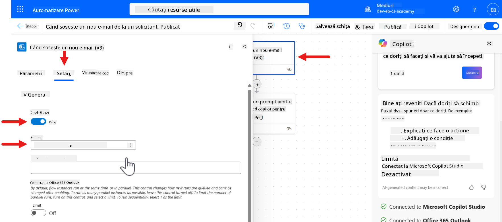

1. Următorul pas este să adăugăm logică pentru a verifica tipul fișierului atașat; dorim să încărcăm doar atașamente de tip .PDF și nu imagini (acestea ar putea proveni din semnături de email). Selectați pictograma **+** de sub declanșator și alegeți **Control** din secțiunea **Built in tools**.

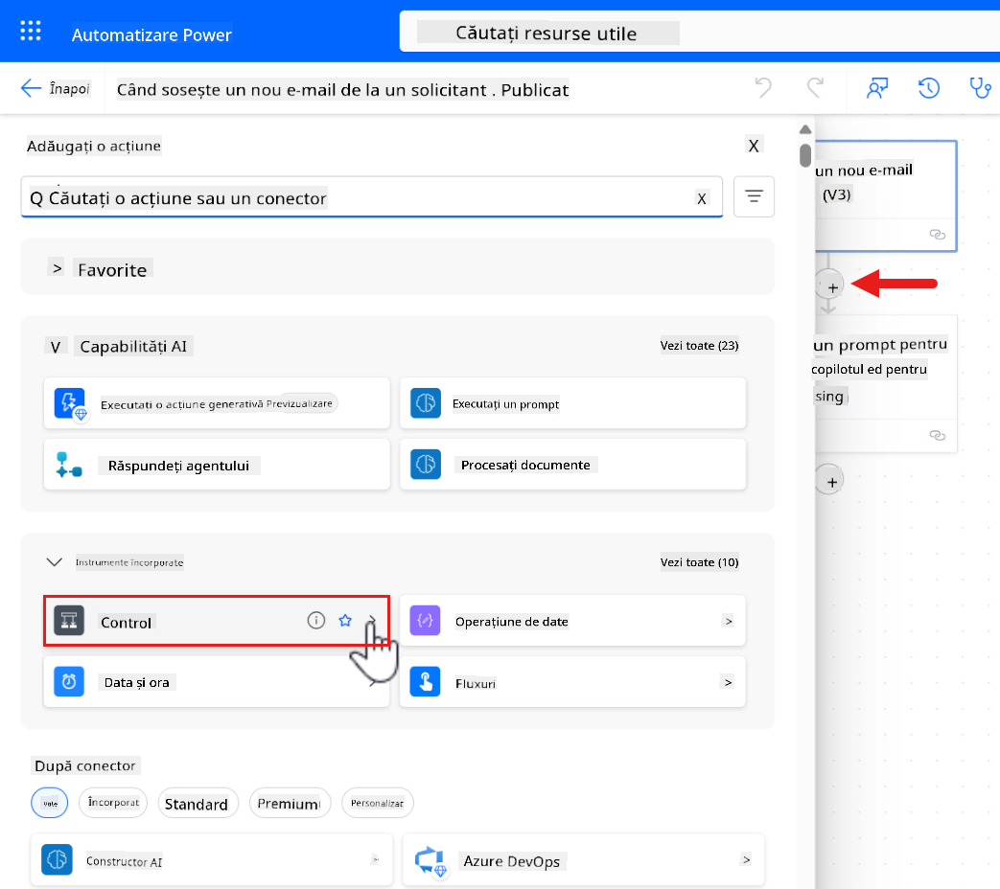

1. Selectați acțiunea **Condition**.

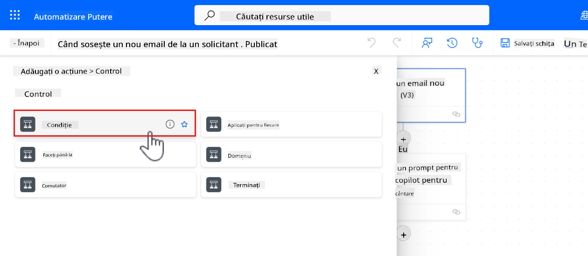

1. Acum configurăm condiția pentru a verifica dacă tipul atașamentului este .PDF. În câmpul **Choose a value**, selectați **pictograma fulger** sau **pictograma fx** din dreapta.

1. În câmpul **Search**, introduceți următorul text,

```text
content type
```

1. Apoi selectați parametrul **Attachments Content-Type** din declanșator.

1. Următorul pas este să selectați **Add** pentru a adăuga intrarea de conținut dinamic în parametrul **Id** al acțiunii.

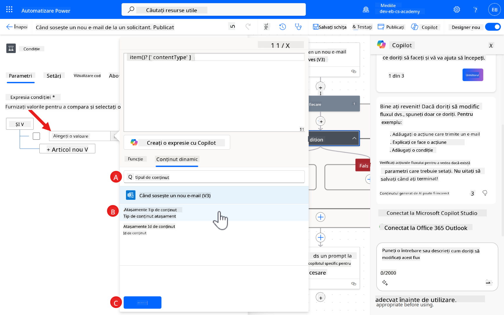

1. Să facem o pauză aici pentru un moment, probabil ați observat că acțiunea **For each** a apărut automat.

Selectați acțiunea **For each**. Această acțiune reprezintă bucla prin fiecare atașament din email, deoarece parametrul **Attachments Content-Type** din declanșator este legat de fiecare atașament.

În culise, este un array și de aceea acțiunea **For each** a fost adăugată automat când am selectat parametrul **Attachments Content-Type** în acțiunea **Condition**.

Pentru a afla mai multe despre acest lucru, extindeți blocul de învățare suplimentar de mai jos.

??? info "Învățare suplimentară: Acțiunea For each apare automat"

🤔 **De ce apare automat "Apply to each" sau "For each"?**

Când selectați un parametru (conținut dinamic) care reprezintă o listă sau un array de elemente - de exemplu, o listă de atașamente, emailuri sau rânduri - Power Automate recunoaște că s-ar putea să doriți să procesați fiecare element individual.

Pentru a vă ajuta să faceți acest lucru, Power Automate adaugă automat o buclă **“Apply to each”** (sau **For each**) în jurul acțiunii dvs. Acest lucru asigură că acțiunea dvs. va rula o dată pentru fiecare element din listă, în loc să încerce să proceseze întreaga listă deodată (ceea ce ar putea cauza erori).

🦋 **Exemplu**

- Dacă selectați "Attachments" dintr-o acțiune anterioară (care este un array) și încercați să o utilizați într-o acțiune care așteaptă un singur fișier, Power Automate înfășoară acțiunea dvs. într-o buclă **"Apply to each"** (sau **For each**). 
- În acest fel, acțiunea dvs. va rula pentru **fiecare atașament** - unul câte unul.

💡 **Puncte cheie**

- **Automat:** Bucla apare automat pentru a vă ajuta să procesați fiecare element dintr-o colecție.
- **Previne erorile:** Fără buclă, acțiunea dvs. ar putea eșua deoarece nu poate gestiona mai multe elemente simultan.
- **Indiciu vizual:** Este o modalitate vizuală de a arăta că fluxul dvs. va repeta acțiunea pentru fiecare element din listă.

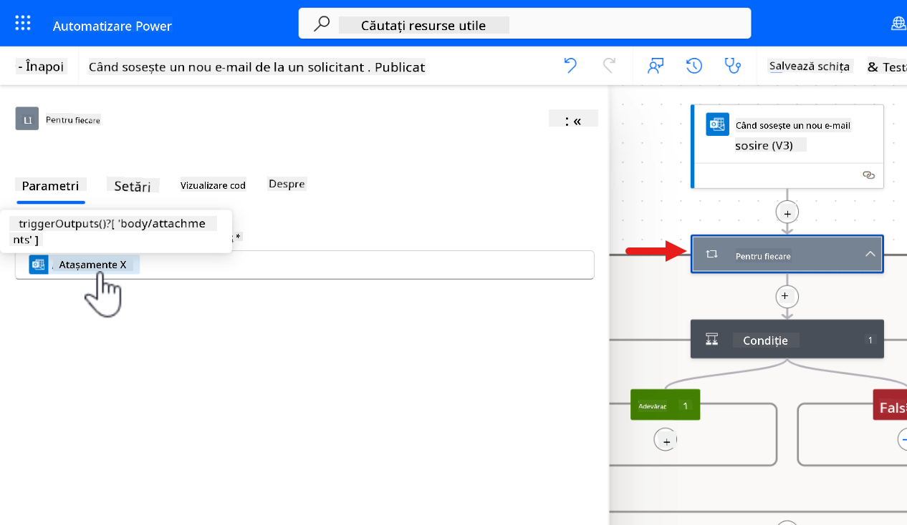

1. Următorul pas este să introduceți în celălalt câmp **Choose a value** următorul text,

```text
application/pdf
```

Acest lucru va asigura că pentru fiecare atașament, se va verifica dacă formatul extensiei fișierului este .PDF.

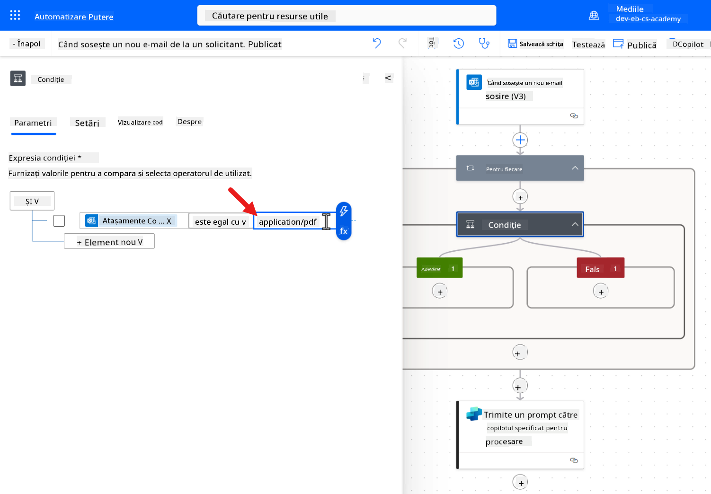

1. Acum vom configura calea **True** pentru a extrage fișierul din email și a-l încărca în tabelul **Resume** din Dataverse.

Adăugați o nouă acțiune mai jos în calea **True** și căutați `html to text`. Selectați acțiunea **Html to text**.

Pentru a afla mai multe despre acțiunea **Html to text**, extindeți blocul de învățare suplimentar de mai jos.

??? info "Învățare suplimentară: Acțiunea Html to text"

🤔 **Ce este acțiunea "HTML to text"?**

Acțiunea **HTML to text** din Power Automate este utilizată pentru a converti conținutul formatat HTML în text simplu. Acest lucru este deosebit de util atunci când primiți date (cum ar fi emailuri, conținut web sau răspunsuri API) care conțin etichete HTML și doriți să extrageți doar textul lizibil fără formatare sau cod.

⚙️ **Cum funcționează?**

- **Input:** Furnizați un șir de conținut HTML (de exemplu, corpul unui email).
- **Output:** Acțiunea elimină toate etichetele HTML și returnează doar textul simplu.

👍🏻 **Când ar trebui să o utilizați?**

- Când doriți să extrageți textul lizibil din emailuri, pagini web sau răspunsuri API care conțin HTML.
- Înainte de a trimite conținut către sisteme care nu acceptă formatarea HTML (cum ar fi SMS, mesaje Teams sau baze de date).
- Pentru a curăța datele pentru procesare sau analiză ulterioară.

🔭 **Unde o găsiți?**

- În Power Automate pentru fluxurile Agent, căutați acțiunea numită `HTML to text`. Este sub conectorul **Data Operations**.

💡 **Puncte cheie**

- Elimină toate etichetele HTML și lasă doar textul.
- Nu interpretează sau execută scripturi/stiluri - doar elimină etichetele.
- Util pentru curățarea datelor și pregătirea conținutului pentru ieșiri în format text simplu.

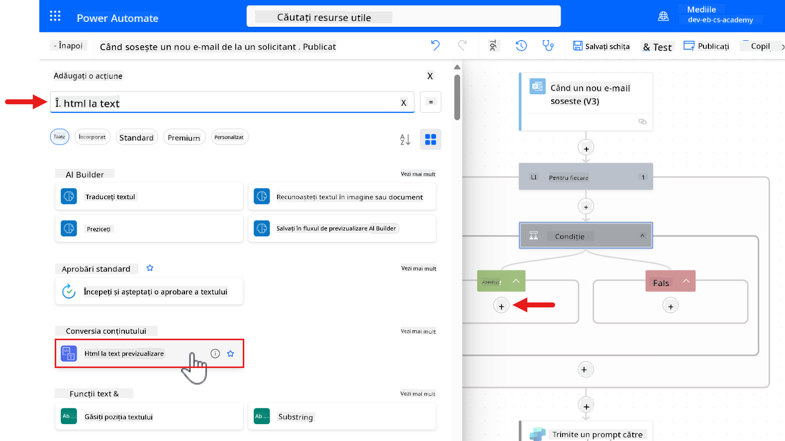

1. Următorul pas este să creați o nouă referință de conexiune pentru acțiunea **Html to text** selectând **Add new**.

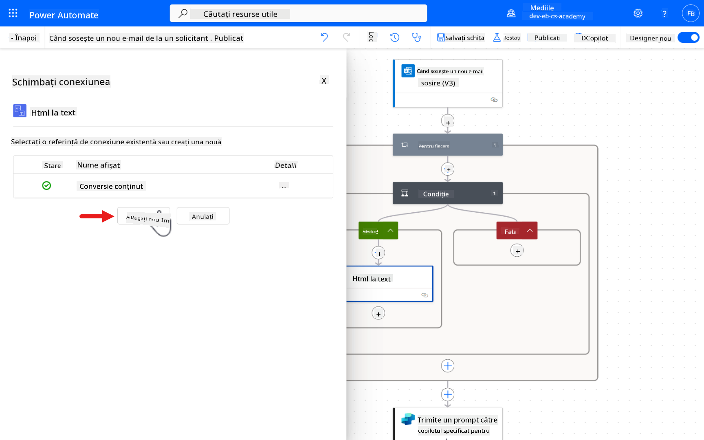

1. Acțiunea poate fi acum configurată. Adăugați parametrul **Body** din declanșator. În câmpul **Content**, selectați **pictograma fulger** sau **pictograma fx** din dreapta.

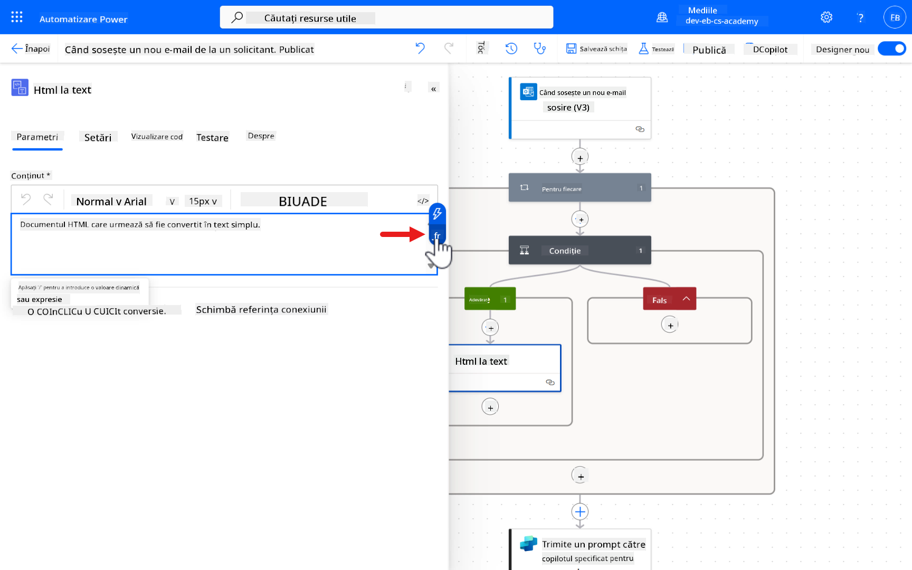

1. În fila **Dynamic content**, căutați `body` și selectați parametrul **Body**, apoi selectați **Add**.

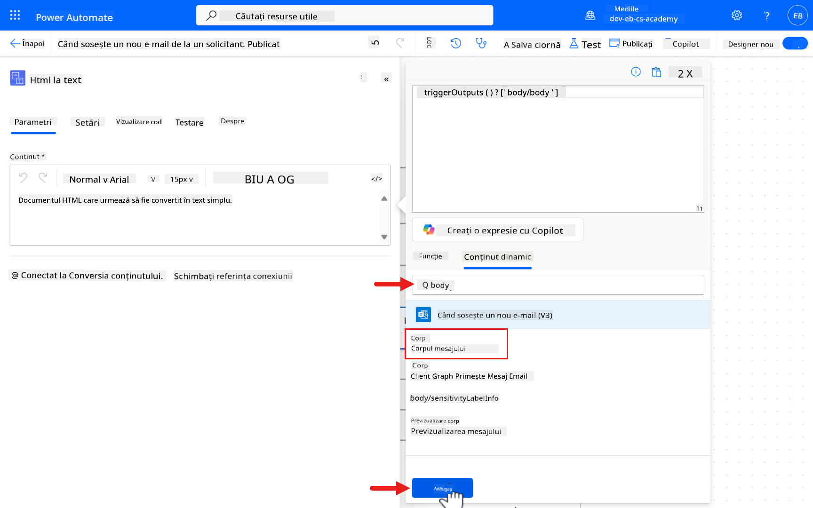

1. Am terminat configurarea acestei acțiuni, așa că să ieșim din acțiune selectând cele două paranteze unghiulare («) care indică spre stânga pentru a restrânge panoul.

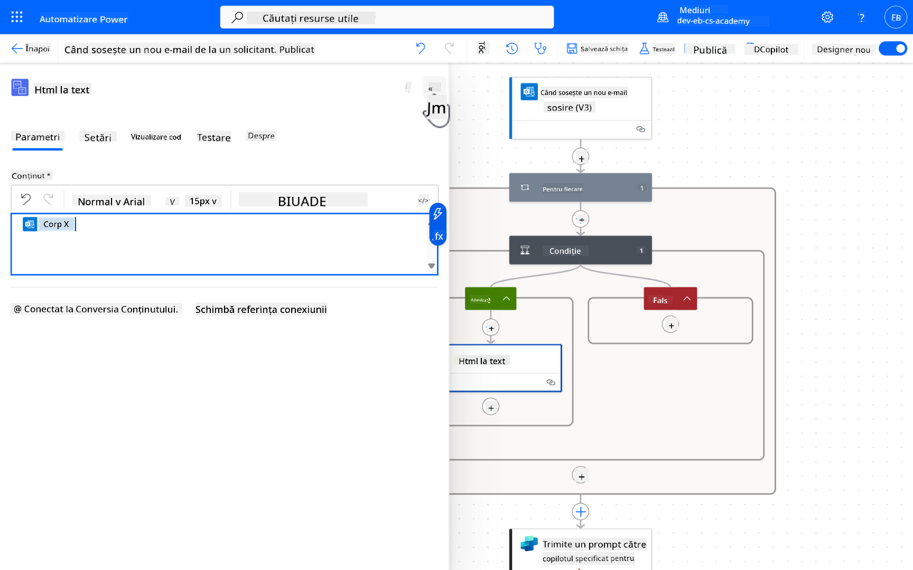

1. Vom adăuga o nouă acțiune selectând **+ icon** sub acțiunea **Html to text**, care va încărca panoul pentru a adăuga acțiuni. Selectați conectorul **Microsoft Dataverse**.

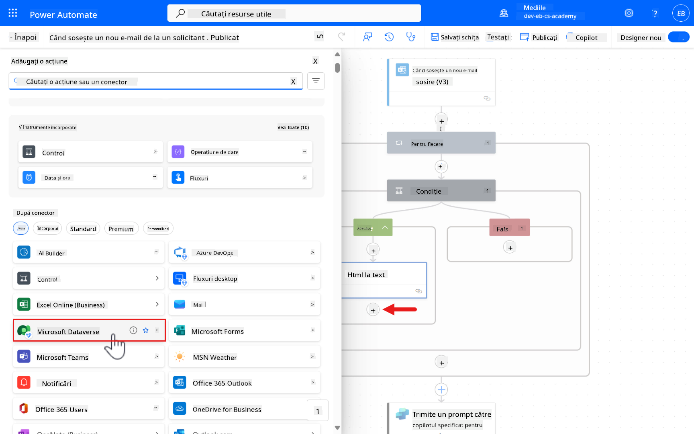

1. Selectați acțiunea **Add a new row**.

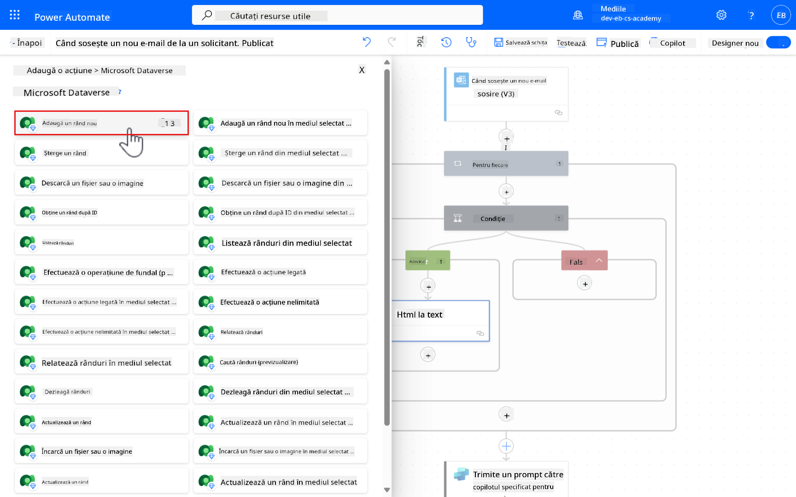

1. Redenumiți acțiunea selectând **Ellipsis (...)**, copiați și lipiți următorul text ca nume,

```text
Add a new Resume row
```

Pentru parametrul **Table name**, căutați `res` și selectați tabelul **Resumes**.

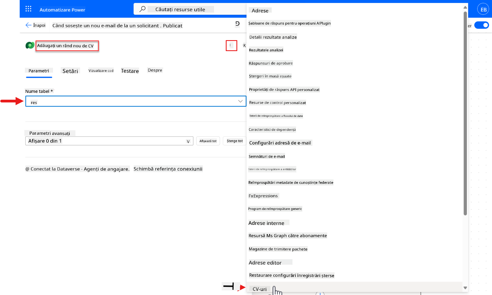

1. Selectați câmpul **Resume Title** și alegeți **pictograma fulger** sau **pictograma fx** din dreapta.

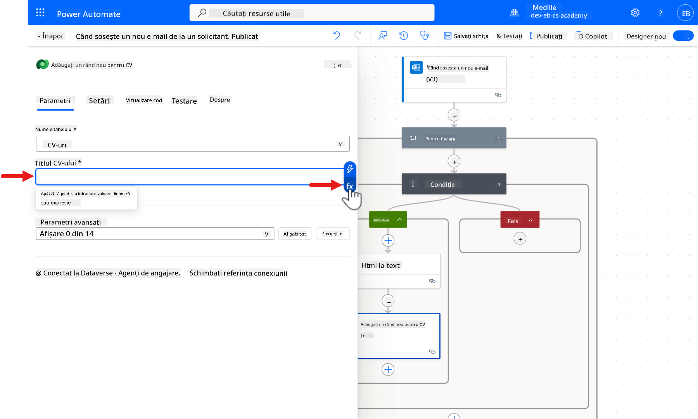

1. În fila **Function**, introduceți următoarea expresie care utilizează funcția `item()`.

```text
item()?['name']
```

Pentru a afla mai multe despre funcția `item()`, extindeți blocul de învățare suplimentar de mai jos.

??? info "Învățare suplimentară: funcția `item()`"

🤔 **Ce este funcția `item()`?**

- Când utilizați o acțiune **Apply to each**, Power Automate trece prin fiecare element dintr-o colecție (array).
- Este cel mai des utilizată în acțiuni precum **Apply to each** (sau **For each**), **Select** sau **Filter array**.

⚙️ **Cum funcționează?**

- `item()` este o funcție care returnează elementul curent procesat într-o buclă sau operație pe array.
- În interiorul acelei bucle, `item()` se referă la _elementul curent_ procesat.

📌 **Unde o utilizați?**

- **Apply to each:** pentru a accesa proprietățile elementului curent.
- **Select:** pentru a transforma fiecare element dintr-un array.
- **Filter array:** pentru a face referire la elementul curent evaluat.

🦋 **Exemplu**

- Expresie într-o buclă:
       -  `item()?['Email']`
- Aceasta obține proprietatea `Email` a elementului curent.

💡 **Puncte cheie**

- `item()` este _sensibil la context_: se referă întotdeauna la elementul curent din bucla sau operația pe array în care vă aflați.
- Dacă cuibăriți bucle, puteți utiliza `items('LoopName')` pentru a face referire la elementele dintr-o buclă specifică.

Selectați **Add** pentru a adăuga expresia la parametrul **Resume Title**.

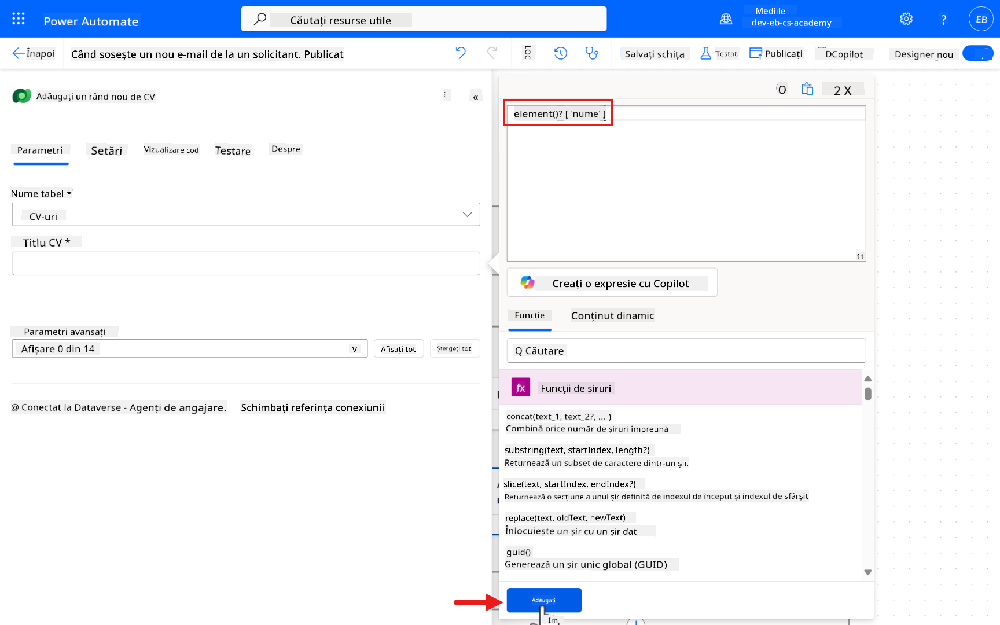

1. Mai trebuie să configurăm câteva parametri, selectați **Show all** și în câmpul **Cover Letter**, alegeți **pictograma fulger** sau **pictograma fx** din dreapta.

În fila **Function**, introduceți următoarea expresie care utilizează aceeași expresie din [misiunea anterioară](../02-multi-agent/README.md).

```text
if(greater(length(body('Html_to_text')), 2000), substring(body('Html_to_text'), 0, 2000), body('Html_to_text'))
```

Această expresie verifică dacă _textul_ din acțiunea **Html to text** este mai lung de 2000 de caractere și, dacă da, returnează doar primele 2000 de caractere; altfel, returnează textul complet.

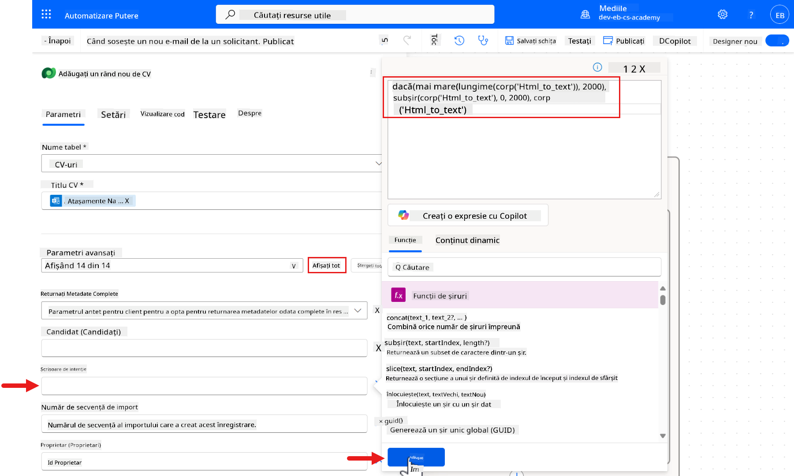

1. Expresia va fi acum adăugată în câmpul **Cover Letter**.


1. Pentru câmpul **Source Email Address**, căutați `from` și selectați parametrul **From** din declanșator, deoarece acesta conține valoarea adresei de email.

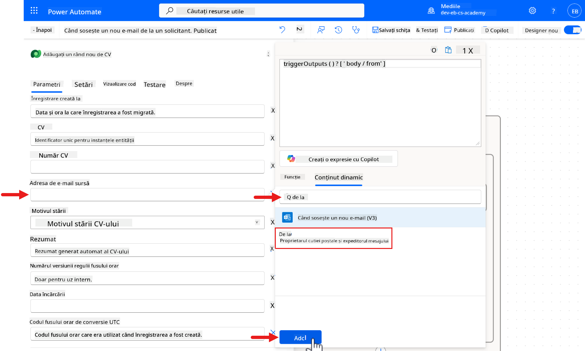

1. Pentru câmpul **Upload Date**, selectați **pictograma fulger** sau **pictograma fx** din dreapta. În fila **Function**, introduceți următoarea expresie care utilizează funcția `utcNow()`.

```text
utcNow()
```

Pentru a afla mai multe despre funcția `utcNow`, extindeți blocul de învățare suplimentar de mai jos.

??? info "Învățare suplimentară: funcția `utcNow`"

🤔 **Ce este funcția `utcNow()`?**

- Funcția utcnow() din Power Automate returnează data și ora curentă în Timpul Universal Coordonat (UTC) în format ISO 8601, cum ar fi: `2025-09-23T04:32:14Z`

🦋 **Exemplu**

- Expresie:
       -  `concat('Raport generat la ', utcnow())`
- Rezultatul este:
       - Raport generat la `2025-09-23T04:32:14Z`

💡 **Puncte cheie**
- **Nu sunt necesari argumente (parametri de intrare):** oferă întotdeauna timestamp-ul UTC curent.
   - **Cazuri de utilizare**
       - Adăugarea timestamp-urilor în jurnale sau nume de fișiere
       - Compararea timpului curent cu alte date
       - Programarea sau condiții bazate pe timp

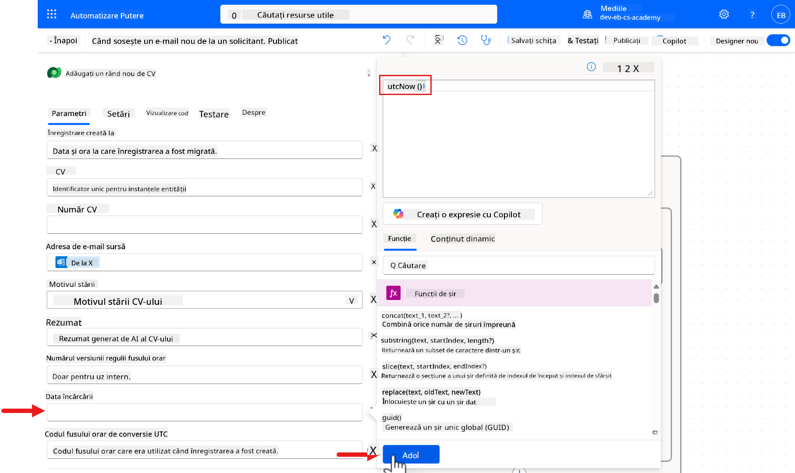

1. Am finalizat configurarea acțiunii **Adaugă un rând nou pentru CV**, așa că să ieșim din panou prin colapsarea acestuia.

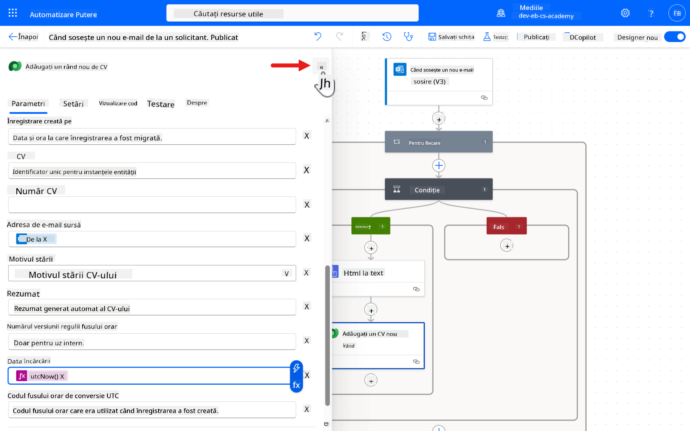

1. Vom adăuga o nouă acțiune selectând **+ icon** sub acțiunea **Adaugă un rând nou pentru CV**, ceea ce va încărca panoul pentru a adăuga acțiuni. Selectați din nou conectorul **Microsoft Dataverse**.

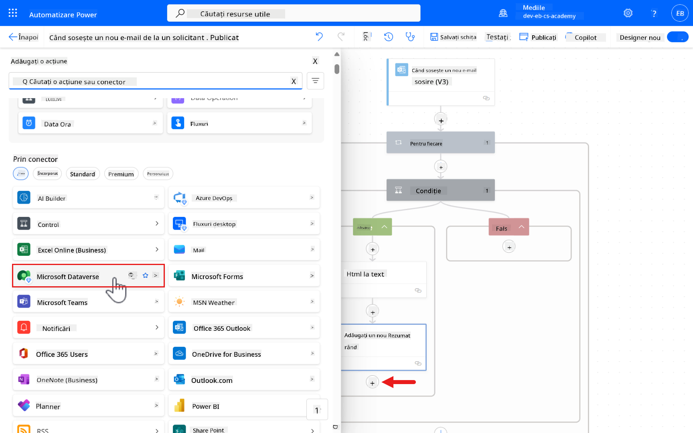

1. Selectați acțiunea **Încarcă un fișier sau o imagine**.

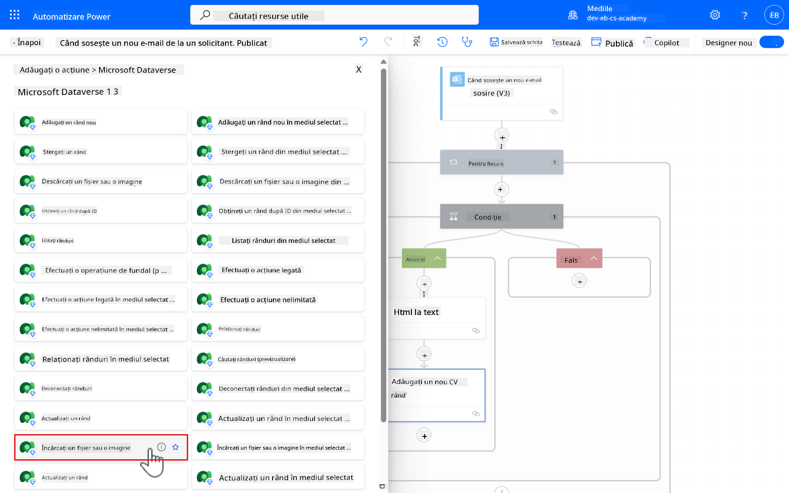

1. Redenumiți acțiunea selectând **Ellipsis (...)**, copiați și lipiți următorul text ca nume,

```text
Upload Resume File
```

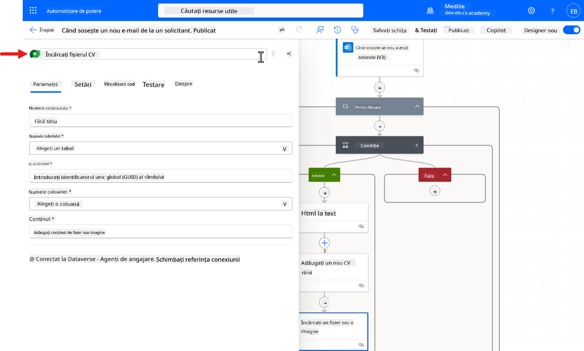

1. Selectați câmpul **Nume conținut** și apoi selectați **icon fulger** sau **icon fx** din dreapta.

În fila **Funcție**, introduceți următoarea expresie care utilizează funcția `item ()`. Aceasta obține proprietatea `name` a elementului curent (fișierul atașat).

```text
item()?['name']
```


1. Pentru parametrul **Nume tabel**, căutați `res` și selectați tabelul **Resumes**.

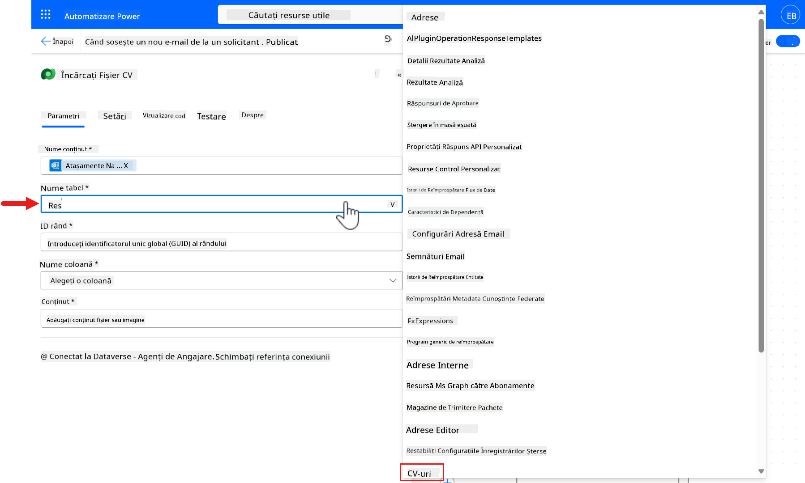

1. Selectați câmpul **ID rând** și apoi selectați **icon fulger** sau **icon fx** din dreapta.

Căutați `ID` și selectați parametrul **Resume** din acțiunea _Adaugă un rând nou_ Dataverse, deoarece acesta conține valoarea ID-ului rândului în care se va încărca fișierul PDF.

Selectați **Adaugă**.

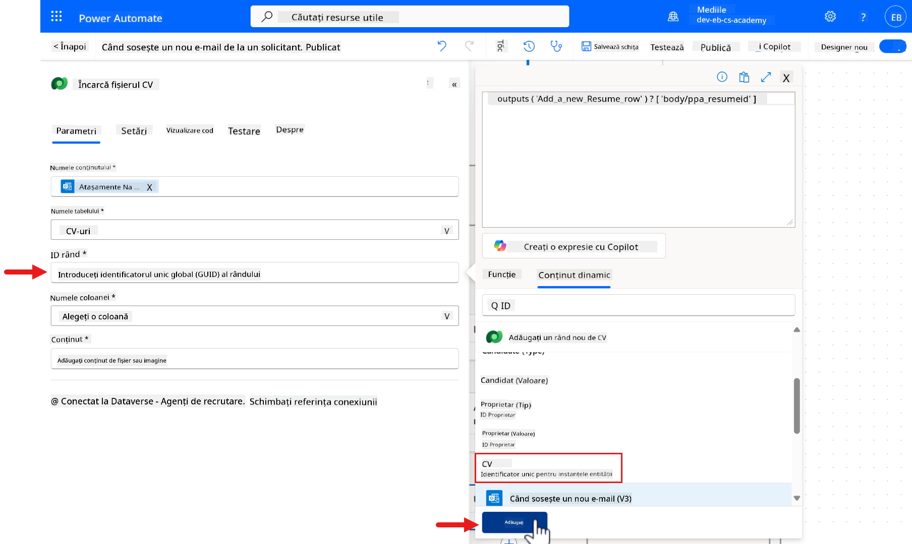

1. Selectați câmpul **Nume coloană** și selectați opțiunea **Resume PDF**.

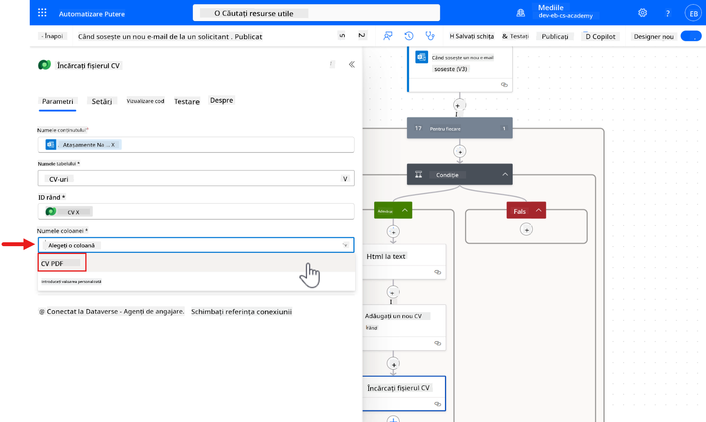

1. Selectați câmpul **Conținut** și selectați **icon fulger** sau **icon fx** din dreapta.

În fila **Funcție**, introduceți următoarea expresie care utilizează funcția `item ()`. Aceasta obține proprietatea `contentBytes` a elementului curent (fișierul atașat). `contentBytes` se referă la datele binare brute ale unui fișier sau atașament, codificate ca un șir Base64.

```text
item()?['contentBytes']
```

1. Am finalizat configurarea acestei acțiuni, așa că să ieșim din acțiune selectând cele două paranteze unghiulare («) care indică spre stânga pentru a colapsa panoul.

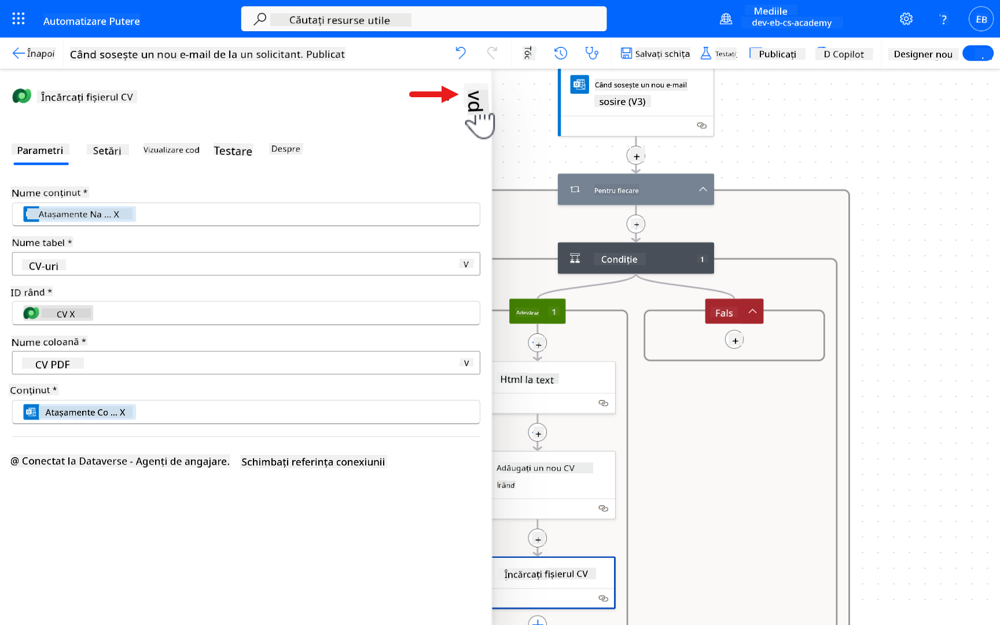

1. Următorul pas este să selectăm **Trimite un prompt către copilotul specificat pentru procesare**, apoi să tragem și să plasăm această acțiune sub acțiunea **Upload Resume File** în calea _True_ a condiției.

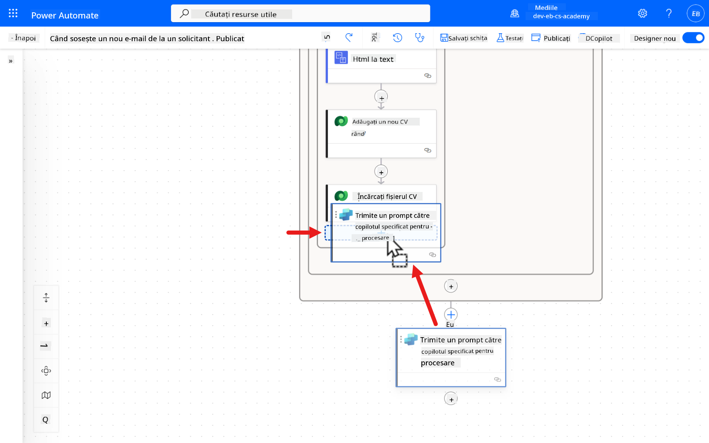

1. Selectați **Trimite un prompt către copilotul specificat pentru procesare** pentru a-l configura.

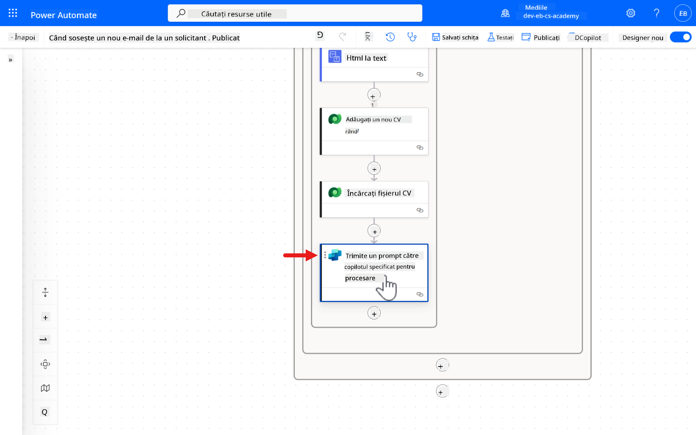

1. În câmpul **Corp/Mesaj**, selectați tot conținutul câmpului și ștergeți-l.

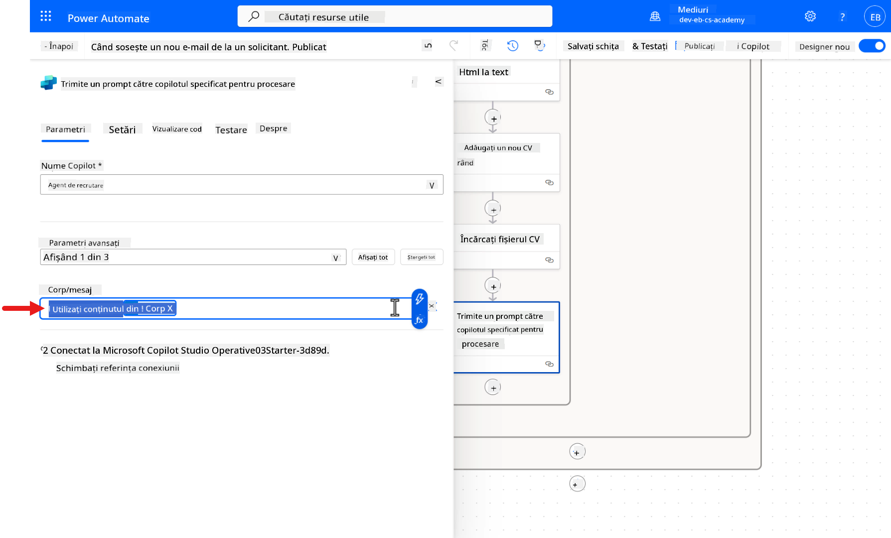

1. Copiați și lipiți următorul text în câmpul **Corp/Mesaj** și evidențiați `RESUME ID PLACEHOLDER`.

```text
Trimite [ResumeId (text)] = "RESUME ID PLACEHOLDER" și [ResumeTitle (text_1)] = "RESUME TITLE PLACEHOLDER" și [ResumeNumber (text_2)]= "RESUME NUMBER PLACEHOLDER" către instrumentul "Notify Teams Applicant channel" în agentul copil "Application Intake Agent"
```

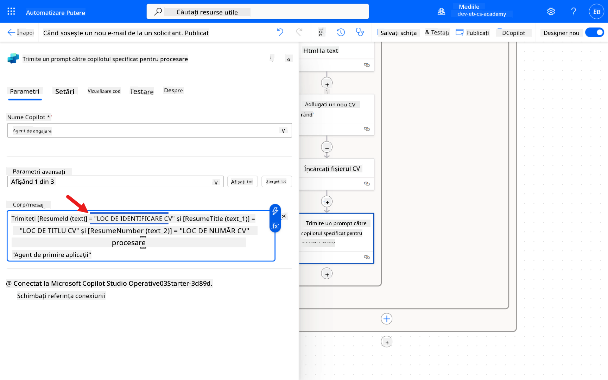

1. Selectați **icon fulger** sau **icon fx** din dreapta.

Căutați `resume` și selectați parametrul **Resume** din acțiunea _Adaugă un rând nou Dataverse_, deoarece acesta conține valoarea `ID` a rândului Resume creat.

Selectați **Adaugă**.

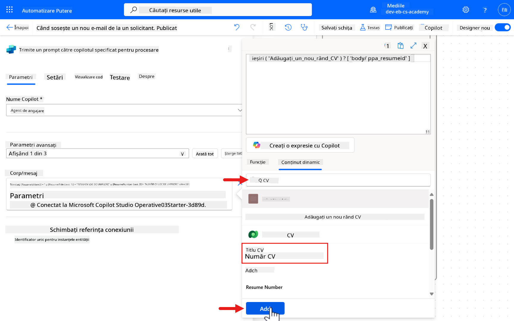

1. Evidențiați `RESUME TITLE PLACEHOLDER`. Selectați **icon fulger** sau **icon fx** din dreapta.

Căutați `title` și selectați parametrul **Resume Title** din acțiunea _Adaugă un rând nou Dataverse_, deoarece acesta conține valoarea `resume title` a rândului Resume creat.

Selectați **Adaugă**.

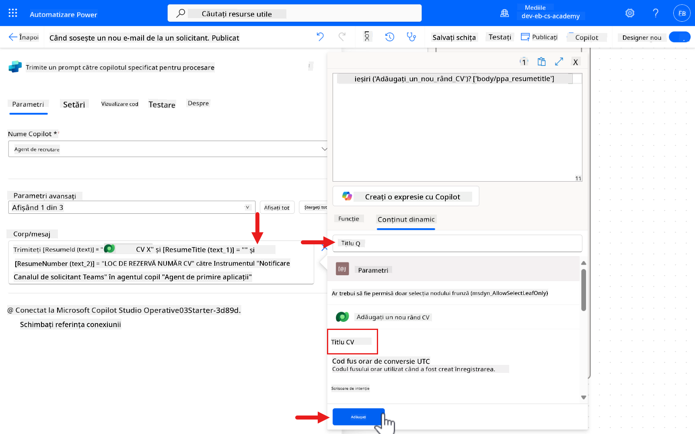

1. Evidențiați `RESUME NUMBER PLACEHOLDER`. Selectați **icon fulger** sau **icon fx** din dreapta.

Căutați `resume number` și selectați parametrul **Resume Number** din acțiunea _Adaugă un rând nou Dataverse_, deoarece acesta conține valoarea `Resume Number` a rândului Resume creat.

Selectați **Adaugă**.

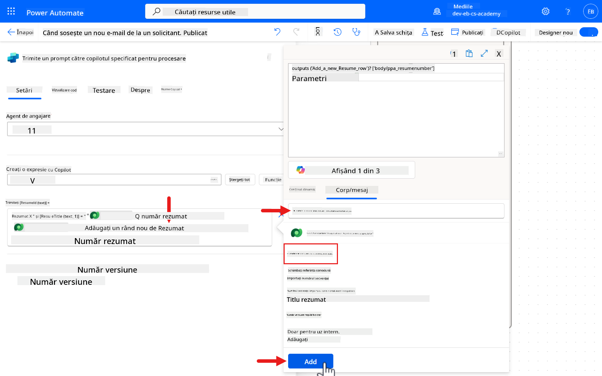

1. Am finalizat configurarea acestei acțiuni și fluxul agentului nostru 🙌🏻 Faceți o treabă excelentă! Acum să salvăm fluxul de declanșare a evenimentului selectând **Salvează schița**.

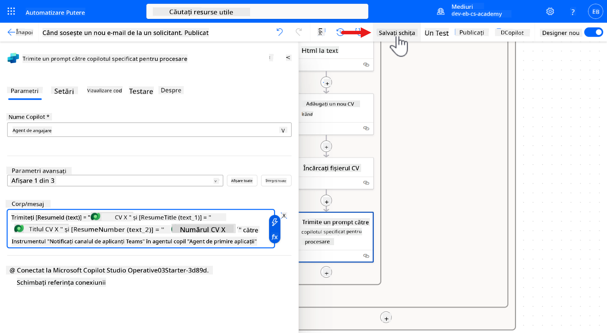

1. Acum trebuie să edităm detaliile fluxului agentului, selectați **Înapoi**.

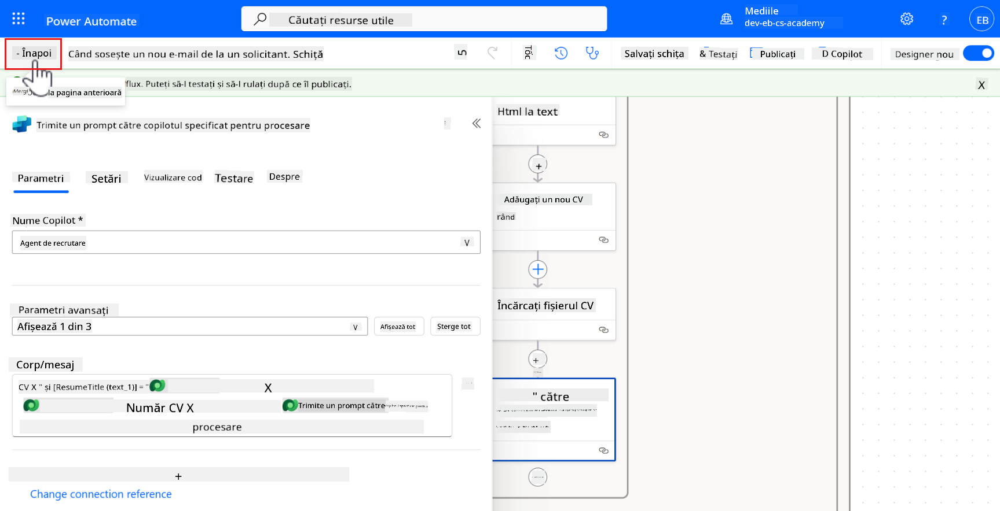

1. Selectați **Editați** în secțiunea **Detalii** și actualizați **Planul** la opțiunea **Copilot Studio**.

Selectați **Salvează**.

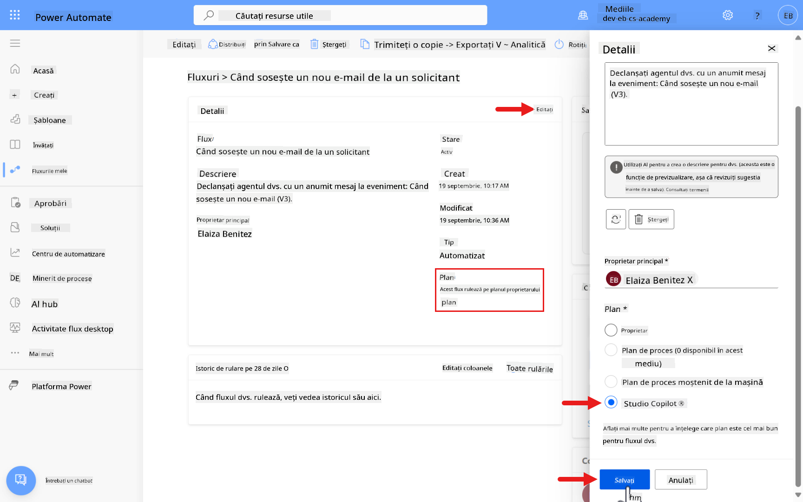

1. Va apărea o fereastră modală care vă va cere să confirmați trecerea la planul Copilot Studio. Selectați **Confirmă**.

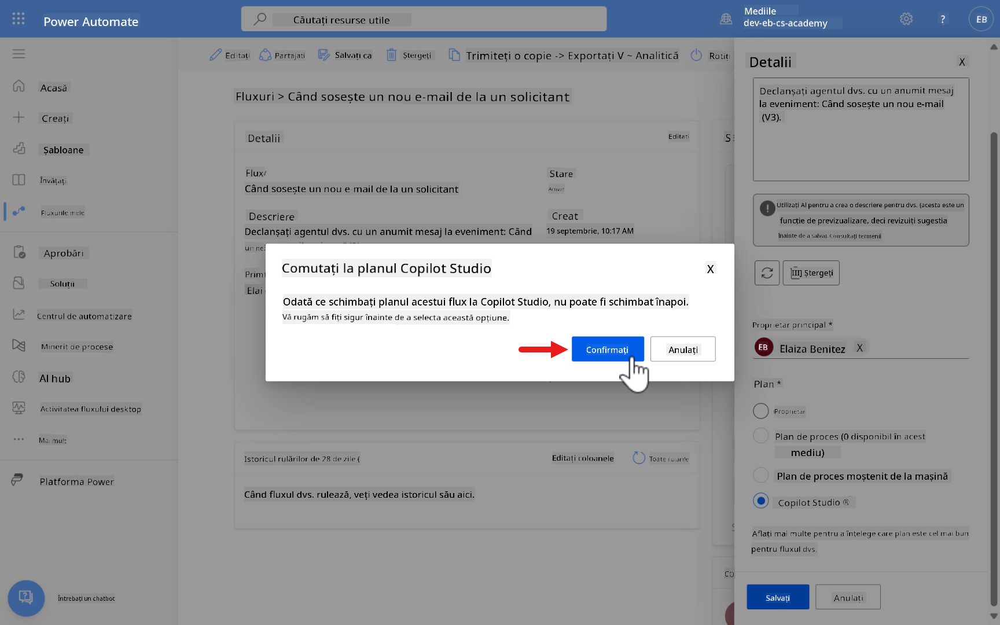

1. Planul este acum actualizat la **Copilot Studio**. Selectați **Editați**, deoarece trebuie să publicăm fluxul de declanșare a evenimentului pentru agentul nostru.

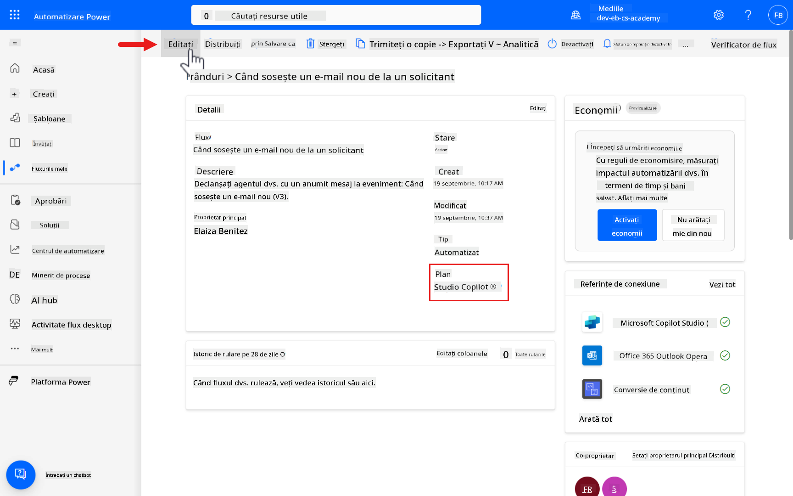

1. Selectați **Publică**.

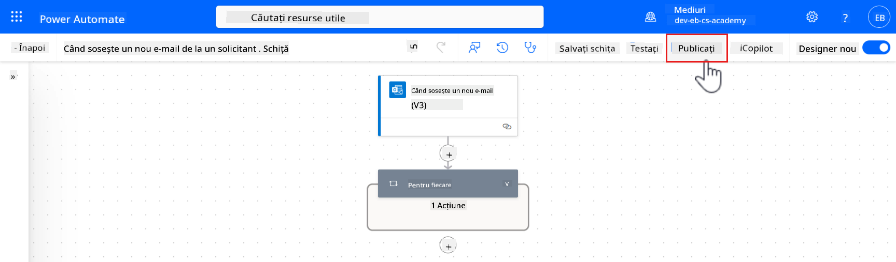

Ura! Fluxul de declanșare a evenimentului este acum publicat 😃

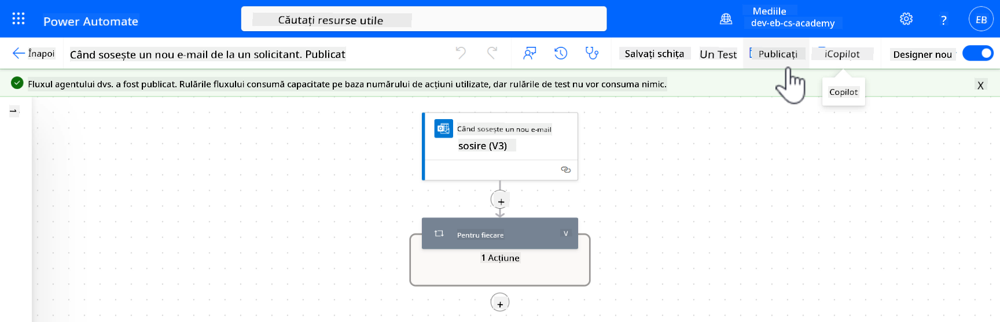

Să continuăm cu crearea unui nou flux de agent care va fi invocat de agentul copil **Intake Application Agent**.

### Laboratorul 3.2 - Notifică un canal Teams folosind un card adaptiv

Acum vom crea un nou flux de agent pentru agentul copil **Intake Application Agent** care utilizează valorile transmise de declanșatorul de eveniment pentru a posta un card adaptiv într-un canal Teams. Acest card adaptiv va alerta echipa de recrutare HR despre PDF-ul care a fost încărcat automat, astfel încât să îl poată revizui.

Să începem!

1. În **Hiring Agent**, selectați fila **Agenți** și selectați **Application Intake Agent**.

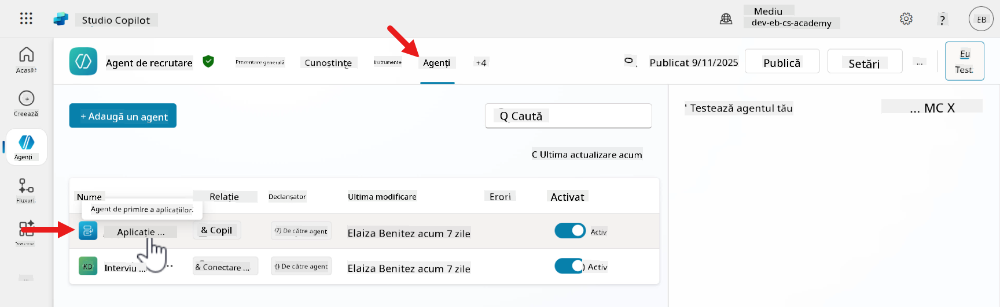

1. Derulați în jos la **Instrumente** și selectați **+ Adaugă**.


1. Va apărea fereastra modală **Adaugă instrument**. Selectați **+ Instrument nou**.

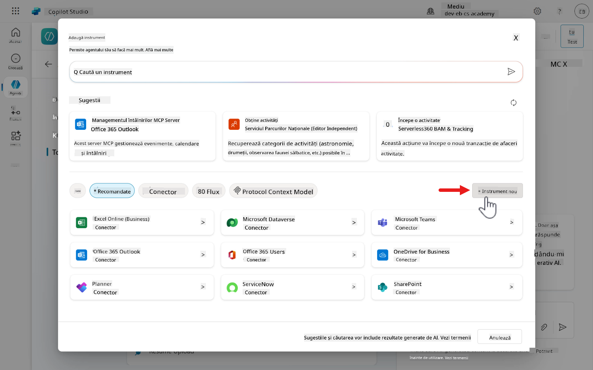

1. Selectați **Flux agent**.

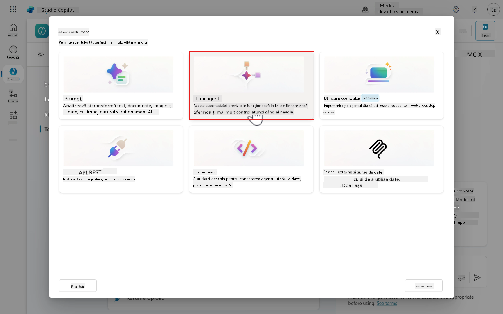

1. Designerul de flux agent se va încărca. În declanșatorul **Când un agent apelează fluxul**, selectați **+ Adaugă o intrare**.

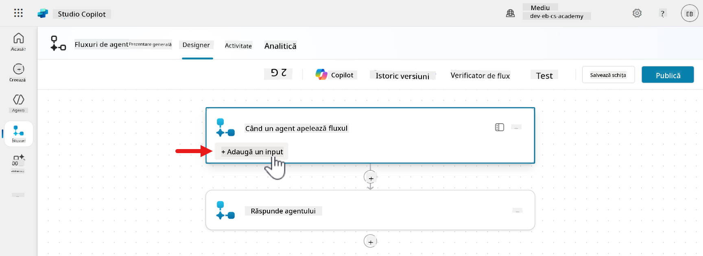

1. Selectați **Text** ca tip de intrare utilizator.

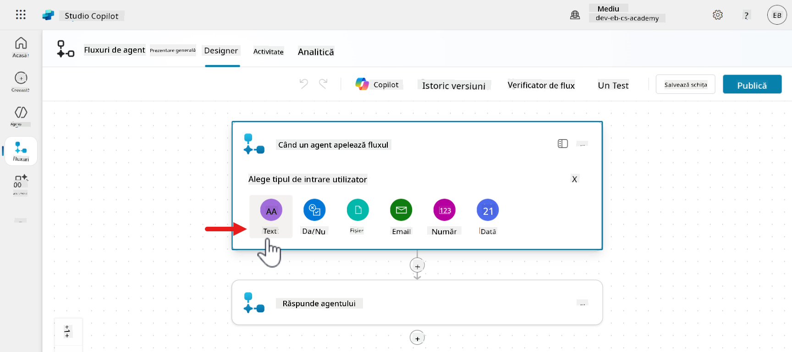

1. În câmpul de text pentru intrare, copiați și lipiți următorul text pentru numele parametrului de intrare.

```text
ResumeId
```

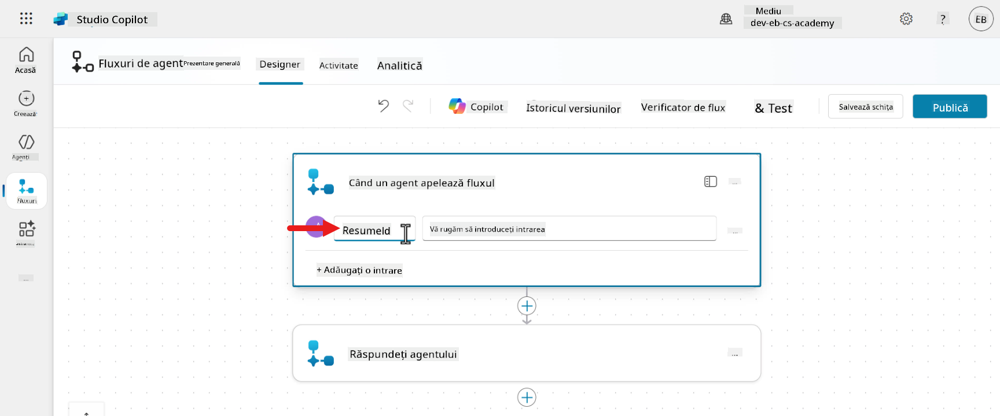

1. Repetați aceiași pași pentru a adăuga o a doua intrare text. Copiați și lipiți următorul text pentru numele parametrului de intrare.

```text
ResumeTitle
```


1. Repetați aceiași pași pentru a adăuga o a treia intrare text. Copiați și lipiți următorul text pentru numele parametrului de intrare.

```text
ResumeNumber
```


1. Vă amintiți cum în [Recruit](../../recruit/08-add-adaptive-card/README.md#81-create-a-new-topic-with-an-adaptive-card-for-user-to-submit-their-request) am adăugat un card adaptiv într-un subiect pentru agentul nostru? De data aceasta, vom adăuga un card adaptiv într-un flux de agent. Acum vom adăuga o altă acțiune în fluxul nostru de agent care va posta un card adaptiv într-un canal Teams.

Selectați **+ icon** sub declanșator.


1. Selectați acțiunea **Postează card într-un chat sau canal**.


1. Este necesară crearea unei referințe de conexiune la Microsoft Teams cu contul dvs. conectat. Selectați **Conectare**.


1. Selectați contul dvs. de utilizator și apoi selectați **Permite accesul**.


1. Pentru următorii parametri de intrare,

| Parametru | Cum să setați | Detalii |
|----------|------------|---------|
| **Postează ca** | Dropdown | Selectați opțiunea `Flow bot` |
| **Postează în** | Dropdown | Selectați opțiunea `Canal` |
| **Echipă** | Dropdown | Selectați o echipă disponibilă în mediul dvs. la care aveți acces pentru a finaliza acest exercițiu de laborator |
| **Canal** | Dropdown | Selectați un canal disponibil în mediul dvs. la care aveți acces pentru a finaliza acest exercițiu de laborator |


1. Următorul pas este să configurăm câmpul **Card adaptiv**. Selectați câmpul **Card adaptiv**.


1. Deschideți [Fișierul JSON actualizat pentru tabelul Resume](../../../../../docs/operative-preview/03-automate-triggers/assets/3.2_ResumeTableUpdated.json), copiați întregul conținut și lipiți-l în câmpul Card adaptiv.


1. Similar cu ceea ce am făcut în [Recruit](../../recruit/08-add-adaptive-card/README.md#81-create-a-new-topic-with-an-adaptive-card-for-user-to-submit-their-request), vom înlocui valorile existente din payload-ul JSON cu valori reale sau conținut dinamic.

Mai întâi, să actualizăm URL-ul pentru proprietatea `url` din cadrul proprietății `selectAction`. Acest URL va fi înlocuit cu URL-ul vizualizării sistemului Resumes din aplicația model-driven **Hiring Hub**. Acest lucru va permite recrutorului să selecteze acțiunea și să fie direcționat către vizualizarea sistemului Resumes din aplicația model-driven.

Evidențiați valoarea URL curentă și ștergeți-o.


1. În aplicația model-driven **Hiring Hub**, navigați la vizualizarea sistemului **Resumes** folosind meniul din partea stângă și copiați URL-ul. Apoi navigați înapoi la fluxul agentului și lipiți URL-ul copiat în proprietatea **url** din cadrul proprietății `selectAction`.


1. Ar trebui să vedeți următoarele, unde detaliile mediului aplicației modelate **Hiring Hub** sunt evidențiate în galben.

     | Parametru | Valoare | Explicație |
     |----------|------------|---------|
     | **Organization URI** | GUID | URL-ul organizației mediului Dataverse/Dynamics 365 |
     | **appid** | GUID | Pentru a deschide o aplicație modelată specifică, se utilizează parametrul de interogare fie appid, fie appname. În acest caz, se folosește appid |
     | **viewid** | GUID | Parametrul de interogare care reprezintă id-ul vizualizării |

       

1. Următorul pas este să adăugăm valori de conținut dinamic pentru mai multe proprietăți. Să începem cu textul care va afișa referința Număr CV pentru rândul creat automat de declanșatorul evenimentului.

      Selectați pictograma **panel** pentru a încărca panoul de acțiuni.

       

1. Derulați în jos până la linia unde vedeți proprietatea `text` pentru `RESUME NUMBER PLACEHOLDER`. Evidențiați valoarea placeholder și ștergeți-o.

       

1. Faceți clic între ghilimelele duble și selectați pictograma **fulger** sau pictograma **fx** din dreapta.

      În fila **Dynamic Content**, selectați parametrul **ResumeNumber** și apăsați **Add**.

       

1. Parametrul **ResumeNumber** va fi acum adăugat ca conținut dinamic la proprietatea `text`.

       

1. Vom repeta aceiași pași pentru `RESUME NAME PLACEHOLDER`. Derulați în jos până la linia unde vedeți proprietatea `text` pentru `RESUME NAME PLACEHOLDER`. Evidențiați valoarea placeholder și ștergeți-o.

       

1. Faceți clic între ghilimelele duble și selectați pictograma **fulger** sau pictograma **fx** din dreapta.

      În fila **Dynamic Content**, selectați parametrul **ResumeTitle** și apăsați **Add**.

       

1. Parametrul **ResumeTitle** va fi acum adăugat ca conținut dinamic la proprietatea `text`.

       

1. Vom repeta aceiași pași pentru valoarea **Due Date**, care reprezintă data până la care un recrutor ar trebui să revizuiască CV-ul. Derulați în jos până la linia unde vedeți proprietatea `text` pentru `May 21, 2023`.

       

1. Ștergeți această valoare placeholder de dată și faceți clic între ghilimelele duble.

       

1. Selectați pictograma **fulger** sau pictograma **fx** din dreapta și, în fila **Function**, introduceți următoarea expresie și apăsați **Add**.

       ```text
       addDays(utcNow(), 3, 'MMM dd, yyyy')
       ```

      Această expresie utilizează două funcții.

     | Funcție | Explicație |
     |----------|------------|
     | **addDays** | Adaugă un număr specificat de zile la o dată dată și returnează data rezultată în format string |
     | **utcNow** | Returnează data și ora curentă în formatul Timp Universal Coordonat (UTC) ca string. |

      Pentru valoarea utcNow, formatăm data pentru a fi lună și zi, urmată de an.

       

      Expresia va fi acum adăugată la proprietatea `text`.

       

1. În final, vom actualiza URL-ul pentru proprietatea `url` din cadrul proprietății `actions` array aflată la sfârșitul payload-ului JSON. Acest URL placeholder curent va fi înlocuit cu URL-ul rândului CV din aplicația modelată **Hiring Hub**. Acest lucru va permite recrutorului să selecteze acțiunea `Action.OpenURL` a cardului adaptiv și să fie direcționat către CV-ul din aplicația modelată.

       

1. În aplicația modelată **Hiring Hub**, deschideți un rând în vizualizarea sistemului **Resumes** folosind meniul din partea stângă. Rândul CV-ului se va încărca ca un formular în aplicația modelată.

      Copiați URL-ul rândului CV.

    ??? info "Cum să navigați înapoi la aplicația modelată **Hiring Hub** în cazul în care ați ieșit/închis-o"

        1. Accesați [https://make.powerapps.com](https://make.powerapps.com) și asigurați-vă că sunteți în mediul de dezvoltare pe care îl utilizați pentru aceste exerciții de laborator, altfel comutați la acesta.
        
        

        1. Selectați **Apps** în panoul meniului din partea stângă și pentru aplicația modelată **Hiring Hub**, selectați pictograma **Play** pentru a o încărca în browser.
        
        

       

1. Apoi navigați înapoi la fluxul agentului, evidențiați valoarea curentă a URL-ului placeholder și ștergeți-o.

       

1. Apoi lipiți URL-ul copiat în proprietatea **url** din cadrul proprietății `url`.

       

1. Ar trebui să vedeți următoarele. Ștergeți valoarea id-ului `GUID` de la sfârșit. Vom înlocui acest conținut dinamic - parametrul **ResumeId**.

       

1. Selectați pictograma **fulger** sau pictograma **fx** din dreapta.

      În fila **Dynamic Content**, selectați parametrul **ResumeId** și apăsați **Add**.

       

1. **ResumeId** va fi adăugat ca conținut dinamic. Următoarele detalii ale mediului aplicației modelate **Hiring Hub** sunt evidențiate în galben.

     | Parametru | Valoare | Explicație |
     |----------|------------|---------|
     | **Organization URI** | GUID | URL-ul organizației mediului Dataverse/Dynamics 365 |
     | **appid** | GUID | Pentru a deschide o aplicație modelată specifică, se utilizează parametrul de interogare fie appid, fie appname. În acest caz, se folosește appid |
     | **id** | GUID | Parametrul de interogare care reprezintă id-ul rândului CV |

       

1. Am finalizat configurarea acțiunii **Post card in a chat or channel** 👏🏻 Ieșiți din panoul de configurare a acțiunii selectând pictograma **x**.

       

1. În final, vom configura ultima acțiune, **Respond to the agent**, trimițând un text înapoi agentului pentru a încheia procesarea.

      În acțiunea **Respond to the agent**, selectați **+Add an output**.

       

1. Selectați **Text** ca tip de output.

       

1. Introduceți următorul text ca nume al output-ului.

       

1. Introduceți următorul text ca valoare pentru output.

       ```text
       Finished
       ```

       

1. Am finalizat configurarea fluxului agentului. Selectați **Save draft** pentru a salva fluxul agentului. Va apărea un mesaj de confirmare odată ce este salvat.

       

1. Înainte de a publica fluxul agentului, trebuie să actualizăm detaliile fluxului agentului. Selectați fila **Overview** și apăsați **Edit**.

      În câmpul nume flux, introduceți următorul text.

       ```text
       Notify Teams Applicant channel
       ```      

      După aceea, selectați pictograma **Refresh** pentru a actualiza descrierea fluxului agentului folosind AI.

      Apoi selectați **Save** pentru a salva detaliile actualizate ale fluxului agentului.

       

1. Navigați înapoi la fila **Designer** și selectați **Publish** pentru a publica fluxul agentului. Va apărea un mesaj de confirmare odată ce este salvat.

       

1. Fluxul agentului trebuie acum adăugat ca un instrument în **Application Intake Agent**. Navigați înapoi la **Hiring Agent** și selectați fila **Agents**, apoi selectați **Application Intake Agent**.

       

1. În secțiunea **Details** a agentului, vom actualiza câmpul **Description**. Copiați următorul text și lipiți-l la sfârșitul textului descrierii.

       ```text
       și notifică, de asemenea, canalul Teams Applicant
       ```

       

1. Următorul pas este să adăugăm fluxul agentului ca un instrument. Derulați în jos și selectați **+ Add**.

       

1. Selectați fluxul agentului creat anterior, **Notify Teams Applicant Channel**.

       

1. Selectați **Add and configure** în continuare.

       

1. În secțiunea **Inputs** a fluxului agentului, cele trei input-uri configurate anterior în fluxul agentului sunt vizibile. Implicit, configurația **Fill using** este setată la **Dynamically fill with AI**. Vom păstra această setare, deoarece promptul de la declanșatorul evenimentului (în ultima acțiune, **Sends a prompt to the specified copilot for processing** - acestea sunt pașii 38-44 din **Lab 3.1 - Automate uploading resumes to Dataverse received by email**) va conține valorile parametrilor pe care AI le va extrage.

       

1. Acum că instrumentul a fost adăugat la **Application Intake Agent**, instrucțiunile agentului trebuie actualizate. Selectați pictograma **săgeată înapoi** pentru a reveni la lista de agenți.

       

1. Selectați **Application Intake Agent** în fila **Agents** a **Hiring Agent**.

       

1. În câmpul **Instructions**, introduceți o linie nouă după instrucțiunile `2.Post-Upload`. Copiați și lipiți următoarele instrucțiuni.

       ```text
       Proces pentru încărcarea CV-urilor prin email
       1. Când primiți un mesaj, **Trimiteți [ResumeId (text)] = "1680265f-5793-f011-b41b-7c1e525be9f7" și [ResumeTitle (text_1)] = "TAYLOR TESTPERSON (FICTITIOUS).pdf" și [ResumeNumber (text_2)]= "R01026" către instrumentul "Notify Teams Applicant channel"** în agentul copil "Application Intake Agent", apelați [AGENT FLOW PLACEHOLDER]
       ```

       

1. Evidențiați textul `[AGENT FLOW PLACEHOLDER`.

       

1. Introduceți caracterul slash, `/`, și selectați instrumentul **Notify Teams Applicant Channel**.

       
1. Fluxul agentului va fi acum invocat de **Agentul de Preluare a Aplicațiilor**, conform instrucțiunilor, după ultima acțiune (**Trimite un prompt către copilotul specificat pentru procesare**) din declanșatorul de eveniment, care trimite promptul ce conține valorile parametrilor înapoi la agent.

      Selectați **Salvare** pentru a salva instrucțiunile actualizate pentru **Agentul de Preluare a Aplicațiilor**.

       

1. Instrucțiunile vor fi acum actualizate odată ce agentul a fost salvat.

       

1. Acum trebuie să **Publicăm** **Agentul de Recrutare**. Selectați **Publicare** în colțul din dreapta sus, iar în fereastra _Publicați acest agent_ care apare, selectați **Publicare**.

       

1. După publicare, va apărea un mesaj de confirmare că agentul a fost publicat.

       

Acum putem testa agentul!

### Laborator 3.3 - Testarea declanșatorului de eveniment

1. Pentru a executa declanșatorul de eveniment, trebuie trimis un e-mail cu un fișier PDF de tip CV atașat. În Outlook, compuneți un nou mesaj de e-mail.

     | Componenta e-mail | Detalii |
     |----------|------------|
     | **Destinatar** | Utilizați contul utilizatorului autentificat ca valoare |
     | **Fișier atașat** | Încărcați fișierul [TAYLOR TESTPERSON (FICTIV)](../../../../../docs/operative-preview/test-data/resumes/TAYLOR%20TESTPERSON%20(FICTITIOUS).pdf)  |
     | **Corp** | Copiați și lipiți următorul text ca și corp al e-mailului  |

       ```text
       Stimate Manager de Recrutare,

       Vă scriu pentru a-mi exprima interesul față de poziția de Inginer Senior Power Platform în organizația dumneavoastră. Cu peste nouă ani de experiență în livrarea de soluții sigure și scalabile pe platformele cloud Microsoft, sunt încrezător în capacitatea mea de a contribui eficient la echipa dumneavoastră.

       În rolul meu cel mai recent de Inginer Principal Power Platform, am dezvoltat un flux automatizat de preluare a CV-urilor, reducând trierea manuală și îmbunătățind căutarea. Am livrat aplicații de gestionare a cazurilor HR, am introdus fluxuri conștiente de soluții și am implementat verificări PR pentru a îmbunătăți timpii de implementare. Expertiza mea include Power Apps, Power Automate, Power Pages, Dataverse și o gamă de servicii Microsoft 365, precum și integrarea cu Graph/REST APIs și Azure Functions.

       Anterior, am dezvoltat aprobări în Teams cu carduri adaptive, reducând timpii de aprobare la aceeași zi, și am creat cadre robuste de gestionare a erorilor. Experiența mea include, de asemenea, migrarea fluxurilor de lucru vechi către Power Automate și construirea de portaluri de autoservire adoptate de sute de angajați.

       Dețin o diplomă de licență în Informatică și sunt certificat ca Dezvoltator Power Platform (PL-400) și Arhitect de Soluții (PL-600). Sunt, de asemenea, pasionat de mentorat și am voluntariat în grupuri locale de creatori.

       Vă rog să găsiți atașat CV-ul meu pentru considerație. Aș fi încântat să discut despre cum abilitățile și experiența mea se aliniază cu nevoile dumneavoastră.

       Vă mulțumesc pentru timpul și considerația acordată.

       Cu stimă,  
       Taylor Testperson
       ```

       **Trimiteți** e-mailul odată compus.

       

1. În portalul Power Automate maker pentru fluxul declanșatorului de eveniment, selectați pictograma **Reîmprospătare** pentru a vizualiza rularea fluxului care a reușit pentru e-mailul trimis.

       

1. Înapoi în Copilot Studio, în **Agentul de Recrutare**, selectați fila **Activitate**.

       

1. Fila **Activitate** se va încărca și va afișa toate activitățile **Agentului de Recrutare**. Va exista o activitate cu numele **Automatizat** care are statusul **Completat**. Această activitate reprezintă declanșatorul de eveniment și fluxul agentului care a fost invocat.

       

1. Selectați activitatea și selectați declanșatorul de eveniment din harta activității. În panoul din partea dreaptă, observați cum parametrii de intrare din prompt conțin valorile parametrilor `Resume Id`, `Resume Title` și `Resume Number` din rândul **Dataverse** care a fost creat. Acestea provin din valorile de conținut dinamic configurate anterior în pașii 18 - 27 din **Laboratorul 3.1 - Automatizarea încărcării CV-urilor în Dataverse primite prin e-mail**.

       

1. Navigați înapoi la aplicația model-driven **Hiring Hub** și în vizualizarea sistemului **Resumes**, selectați **Reîmprospătare** pentru a reîmprospăta vizualizarea. Rândul nou creat pentru CV-ul trimis prin e-mail va fi acum listat, deoarece a fost creat prin declanșatorul de eveniment.

       

1. Navigați înapoi la Copilot Studio și selectați fluxul agentului **Notifică canalul de aplicanți Teams** din cadrul **Agentului de Preluare a Aplicațiilor** în harta activității. În panoul din partea dreaptă, observați cum intrările au valori din rândul Dataverse. Acestea provin din promptul trimis de ultima acțiune (**Trimite un prompt către copilotul specificat pentru procesare**) din declanșatorul de eveniment, care conține valorile parametrilor din rândul Dataverse nou creat. Astfel putem transmite valori de parametri de la declanșatoare de eveniment către fluxurile agentului.

       

1. În final, să aruncăm o privire la cardul adaptiv postat în canalul **Microsoft Teams**. În canal, vom vedea cardul adaptiv care afișează informațiile despre rândul CV-ului nou creat în Dataverse. Treceți cursorul peste hyperlink-ul de la începutul cardului adaptiv, observați cum URL-ul este URL-ul vizualizării sistemului Resumes pe care l-am configurat anterior în payload-ul JSON (pașii 15 - 19 din **Laboratorul 3.2 - Notificarea unui canal Teams folosind un card adaptiv**) al cardului adaptiv.

       

1. Selectați hyperlink-ul și veți fi direcționat către vizualizarea sistemului Resumes în aplicația model-driven **Hiring Hub** din browserul dumneavoastră.

       

1. Navigați înapoi la cardul adaptiv postat în canalul Microsoft Teams. De această dată, treceți cursorul peste **Vizualizați CV-ul**, care este acțiunea `Action.OpenURL` a cardului adaptiv. Observați cum URL-ul este rândul CV-ului pe care l-am configurat anterior în payload-ul JSON (pașii 30 - 36 din **Laboratorul 3.2 - Notificarea unui canal Teams folosind un card adaptiv**) al cardului adaptiv.

       

1. Selectați acțiunea și veți fi direcționat către formularul rândului CV în aplicația model-driven **Hiring Hub** din browserul dumneavoastră.

       

## ✅ Misiune Îndeplinită

Felicitări! 👏🏻 Lucru excelent, Operativ.

✅ Declanșator de eveniment: ați creat un declanșator de eveniment care transmite valori de parametri Dataverse către un flux de agent.  
✅ Ați construit un flux de agent: consumă valorile parametrilor Dataverse pentru a posta un card adaptiv într-un canal Microsoft Teams pentru a alerta echipa de recrutare HR.  
✅ Instrucțiuni actualizate pentru agentul copil: pentru a invoca fluxul odată ce declanșatorul de eveniment a fost finalizat.

Acest lucru permite **Agentului de Recrutare** să funcționeze autonom ori de câte ori CV-urile sunt primite ca atașamente de e-mail și să notifice echipa de recrutare HR pentru revizuire manuală.

Acesta este sfârșitul **Laboratorului 03 - Automatizarea e-mailurilor de aplicație ale candidaților**, selectați linkul de mai jos pentru a trece la lecția următoare.

⏭️ [Treceți la lecția **Crearea Instrucțiunilor pentru Agent**](../04-agent-instructions/README.md)

## 📚 Resurse Tactice

📖 [Faceți agentul dumneavoastră autonom în Copilot Studio](https://learn.microsoft.com/training/modules/autonomous-agents-online-workshop/?WT.mc_id=power-188561-ebenitez)  
📖 [Adăugați un declanșator de eveniment](https://learn.microsoft.com/microsoft-copilot-studio/authoring-trigger-event?WT.mc_id=power-188561-ebenitez)  
📖 [Utilizați fluxuri de agent cu agentul dumneavoastră](https://learn.microsoft.com/microsoft-copilot-studio/advanced-flow?WT.mc_id=power-188561-ebenitez)  
📖 [Introducere în declanșatoarele Power Automate](https://learn.microsoft.com/power-automate/triggers-introduction?WT.mc_id=power-188561-ebenitez)  
📖 [Utilizarea fluxurilor Power Automate cu agenți](https://learn.microsoft.com/microsoft-copilot-studio/advanced-flow-create?WT.mc_id=power-188561-ebenitez)  
📖 [Prevenirea pierderii de date pentru Copilot Studio](https://learn.microsoft.com/microsoft-copilot-studio/admin-data-loss-prevention?WT.mc_id=power-188561-ebenitez)  

---

**Declinare de responsabilitate**:  
Acest document a fost tradus folosind serviciul de traducere AI [Co-op Translator](https://github.com/Azure/co-op-translator). Deși ne străduim să asigurăm acuratețea, vă rugăm să fiți conștienți că traducerile automate pot conține erori sau inexactități. Documentul original în limba sa natală ar trebui considerat sursa autoritară. Pentru informații critice, se recomandă traducerea profesională realizată de un specialist uman. Nu ne asumăm responsabilitatea pentru eventualele neînțelegeri sau interpretări greșite care pot apărea din utilizarea acestei traduceri.