<!--
CO_OP_TRANSLATOR_METADATA:
{
  "original_hash": "616d142d4fb5f45d2a168fad6c1f9545",
  "translation_date": "2025-10-20T18:30:52+00:00",
  "source_file": "docs/operative-preview/07-multimodal-prompts/README.md",
  "language_code": "ro"
}
-->
# 🚨 Misiunea 07: Extrage conținutul CV-urilor cu ajutorul prompturilor multimodale

--8<-- "disclaimer.md"

## 🕵️‍♂️ NUME DE COD: `DOCUMENT RESUME RECON`

> **⏱️ Fereastra de timp pentru operațiune:** `~45 minute`

## 🎯 Descrierea Misiunii

Bine ai venit, Operativ. Misiunile tale anterioare te-au echipat cu abilități puternice de orchestrare a agenților, dar acum este momentul să deblochezi o capacitate revoluționară: **analiza multimodală a documentelor**.

Sarcina ta, dacă alegi să o accepți, este **Document Resume Recon** - extragerea datelor structurate din orice document cu precizie. Deși agenții tăi pot procesa text cu ușurință, lumea reală necesită gestionarea zilnică a fișierelor PDF, imaginilor și documentelor complexe. CV-urile se adună, facturile trebuie procesate, iar formularele necesită digitizare instantanee.

Această misiune te va transforma dintr-un constructor de agenți exclusiv text într-un **expert multimodal**. Vei învăța să configurezi AI care citește și înțelege documentele ca un analist uman - dar cu viteza și consistența AI. Până la finalul misiunii, vei fi construit un sistem complet de extragere a CV-urilor care se integrează cu fluxul tău de recrutare.

Tehnicile pe care le vei învăța aici vor fi esențiale pentru operațiunile avansate de fundamentare a datelor din următoarea ta misiune.

## 🔎 Obiective

În această misiune, vei învăța:

1. Ce sunt prompturile multimodale și când să folosești diferite modele AI
1. Cum să configurezi prompturi cu intrări de imagini și documente
1. Cum să formatezi ieșirile prompturilor ca JSON pentru extragerea datelor structurate
1. Cele mai bune practici pentru ingineria prompturilor în analiza documentelor
1. Cum să integrezi prompturile multimodale cu fluxurile de agenți

## 🧠 Înțelegerea prompturilor multimodale

### Ce face un prompt să fie "multimodal"?

Prompturile tradiționale funcționează doar cu text. Dar prompturile multimodale pot procesa mai multe tipuri de conținut:

- **Text**: Instrucțiuni scrise și conținut
- **Imagini**: Fotografii, capturi de ecran, grafice și diagrame (.PNG, .JPG, .JPEG)  
- **Documente**: Facturi, CV-uri, formulare (.PDF)

Această capacitate deschide scenarii puternice, cum ar fi analizarea CV-urilor, procesarea facturilor sau extragerea datelor din formulare.

### De ce multimodal este important pentru fluxurile tale de lucru

În fiecare zi, organizația ta se confruntă cu aceste provocări de procesare a documentelor:

- **Screening-ul CV-urilor**: Citirea manuală a sute de CV-uri consumă timp valoros
- **Procesarea facturilor**: Extragerea detaliilor furnizorului, sumelor și datelor din formate variate de documente
- **Analiza formularelor**: Convertirea formularelor pe hârtie în date digitale

Prompturile multimodale elimină aceste blocaje prin combinarea înțelegerii limbajului AI cu capacitățile de analiză vizuală. Acest lucru oferă AI-ului tău abilitatea de a procesa documente la fel de eficient ca textul.

### Scenarii comune de afaceri

Iată câteva exemple de aplicare a prompturilor multimodale:

| Scenariu                | Sarcină                                                                                                                                      | Câmpuri de ieșire exemplu                                                                                   |
|-------------------------|-------------------------------------------------------------------------------------------------------------------------------------------|---------------------------------------------------------------------------------------------------------|
| **Screening-ul CV-urilor**    | Extrage numele candidatului, emailul, telefonul, titlul actual, anii de experiență și abilitățile cheie.                                                 | Nume candidat, Adresă de email, Număr de telefon, Titlul actual al jobului, Ani de experiență, Abilități cheie         |
| **Procesarea facturilor**  | Extrage informațiile furnizorului, data facturii, suma totală și articolele facturii din această factură.                                                 | Nume furnizor, Data facturii, Suma totală, Articolele facturii                                             |
| **Analiza formularelor**       | Analizează acest formular de aplicație și extrage toate câmpurile completate.                                                                              | Nume câmp (ex. Nume aplicant), Valoare introdusă (ex. John Doe), ...                                  |
| **Verificarea documentelor de identitate** | Extrage numele, numărul de identificare, data expirării și adresa din acest document de identificare. Verifică dacă tot textul este clar lizibil și semnalează orice secțiuni neclare. | Nume complet, Număr de identificare, Data expirării, Adresă, Indicator secțiuni neclare                        |

## ⚙️ Selectarea modelului în AI Builder

AI Builder oferă diferite modele optimizate pentru sarcini specifice. Înțelegerea modelului potrivit de utilizat este crucială pentru succes.

!!! note "Exact până în septembrie 2025"
    Modelele AI Builder sunt actualizate regulat, așa că verifică cea mai recentă [documentație despre setările modelelor AI Builder](https://learn.microsoft.com/ai-builder/prompt-modelsettings) pentru disponibilitatea actuală a modelelor.

### Compararea modelelor

Toate modelele de mai jos suportă procesarea vizuală și a documentelor

| Model | 💰Cost | ⚡Viteză | ✅Cel mai potrivit pentru |
|-------|------|-------|----------|
| **GPT-4.1 mini** | Basic (cel mai economic) | Rapid | Procesarea standard a documentelor, rezumare, proiecte cu buget redus |
| **GPT-4.1** | Standard | Moderat | Documente complexe, creare avansată de conținut, necesități de acuratețe ridicată |
| **o3** | Premium | Lent (prioritizează raționamentul) | Analiza datelor, gândire critică, rezolvarea sofisticată a problemelor |
| **GPT-5 chat** | Standard | Îmbunătățit | Înțelegerea documentelor de ultimă generație, cea mai mare acuratețe a răspunsurilor |
| **GPT-5 reasoning** | Premium | Lent (analiză complexă) | Cea mai sofisticată analiză, planificare, raționament avansat |

### Explicația setărilor de temperatură

Temperatura controlează cât de creativ sau previzibil este răspunsul AI:

- **Temperatura 0**: Rezultate cele mai previzibile, consistente (cel mai bine pentru extragerea datelor)
- **Temperatura 0.5**: Echilibru între creativitate și consistență  
- **Temperatura 1**: Creativitate maximă (cel mai bine pentru generarea de conținut)

Pentru analiza documentelor, folosește **temperatura 0** pentru a asigura extragerea consistentă a datelor.

## 📊 Formate de ieșire: Text vs JSON

Alegerea formatului de ieșire potrivit este esențială pentru procesarea ulterioară.

### Când să folosești ieșirea text

Ieșirea text funcționează bine pentru:

- Rezumate ușor de citit de către oameni
- Clasificări simple
- Conținut care nu necesită procesare structurată

### Când să folosești ieșirea JSON

Ieșirea JSON este esențială pentru:

- Extragerea datelor structurate
- Integrarea cu baze de date sau sisteme
- Procesarea fluxurilor Power Automate
- Maparea consistentă a câmpurilor

### Cele mai bune practici pentru JSON

1. **Definește nume clare pentru câmpuri**: Folosește denumiri descriptive și consistente
1. **Oferă exemple**: Include ieșiri și valori exemplu pentru fiecare câmp
1. **Specifică tipurile de date**: Include exemple pentru date, numere și text
1. **Gestionează datele lipsă**: Planifică pentru valori nule sau goale
1. **Validează structura**: Testează cu diferite tipuri de documente

### Considerații privind calitatea documentelor

- **Rezoluție**: Asigură-te că imaginile sunt clare și lizibile
- **Orientare**: Rotește documentele în orientarea corectă înainte de procesare
- **Suport pentru format**: Testează cu tipurile specifice de documente (PDF, JPG, PNG)
- **Limite de dimensiune**: Fii conștient de restricțiile de dimensiune ale fișierelor în mediul tău

### Optimizarea performanței

- **Alege modele adecvate**: Actualizează modelele doar când este necesar
- **Optimizează prompturile**: De multe ori, instrucțiunile mai scurte și mai clare funcționează mai bine
- **Gestionarea erorilor**: Planifică pentru documente care nu pot fi procesate
- **Monitorizează costurile**: Modelele diferite consumă cantități diferite de credite AI Builder

## 🧪 Laboratorul 7: Construirea unui sistem de extragere a CV-urilor

Este timpul să aplici cunoștințele tale multimodale în practică. Vei construi un sistem cuprinzător de extragere a CV-urilor care analizează documentele candidaților și le transformă în date structurate pentru fluxul tău de recrutare.

### Cerințe preliminare pentru a finaliza această misiune

1. Va trebui să **faci una dintre următoarele**:

    - **Să fi finalizat Misiunea 06** și să ai sistemul tău multi-agent de recrutare pregătit, **SAU**
    - **Să imporți soluția de început pentru Misiunea 07** dacă începi de la zero sau ai nevoie să recuperezi. [Descarcă soluția de început pentru Misiunea 07](https://aka.ms/agent-academy)

1. Documente de CV exemplu din [Test Resumes](https://download-directory.github.io/?url=https://github.com/microsoft/agent-academy/tree/main/operative/sample-data/resumes&filename=operative_sampledata)

!!! note "Importul soluției și datele exemplu"
    Dacă folosești soluția de început, consultă [Misiunea 01](../01-get-started/README.md) pentru instrucțiuni detaliate despre cum să imporți soluții și date exemplu în mediul tău.

### 7.1 Creează un prompt multimodal

Primul tău obiectiv: creează un prompt capabil să analizeze documentele CV-urilor și să extragă date structurate.

1. Conectează-te la [Copilot Studio](https://copilotstudio.microsoft.com) și selectează **Tools** din navigarea laterală.

1. Selectează **+ New tool**, apoi selectează **Prompt**.  
    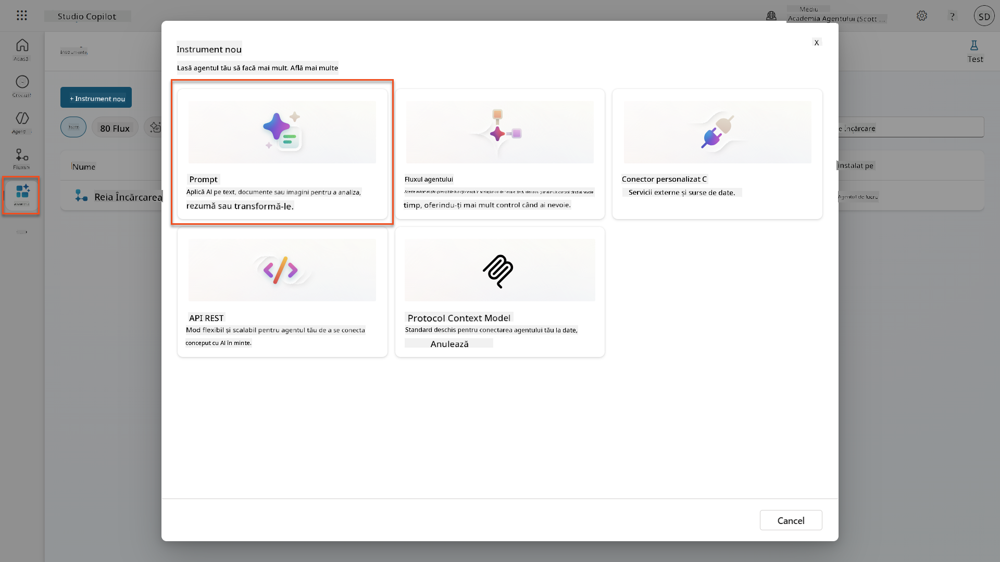

1. **Redenumește** promptul din numele implicit cu timestamp (Ex. *Custom prompt 09/04/2025, 04:59:11 PM*) în `Summarize Resume`.

1. În câmpul Instructions, adaugă acest prompt:

    ```text
    You are tasked with extracting key candidate information from a resume and cover letter to facilitate matching with open job roles and creating a summary for application review.
    
    Instructions:
    1. Extract Candidate Details:
        - Identify and extract the candidate’s full name.
        - Extract contact information, specifically the email address.
    2. Create Candidate Summary:
        - Summarize the candidate’s profile as multiline text (max 2000 characters) with the following sections:
            - Candidate name
            - Role(s) applied for if present
            - Contact and location
            - One-paragraph summary
            - Experience snapshot (last 2–3 roles with outcomes)
            - Key projects (1–3 with metrics)
            - Education and certifications
            - Top skills (Top 10)
            - Availability and work authorization
    
    Guidelines:
    - Extract information only from the provided resume and cover letter documents.
    - Ensure accuracy in identifying all details such as contact details and skills.
    - The summary should be concise but informative, suitable for quick application review.
    
    Resume: /document
    CoverLetter: /text
    ```

    !!! tip "Folosește asistența Copilot"
        Poți folosi "Get started with Copilot" pentru a genera promptul tău folosind limbaj natural. Încearcă să ceri Copilot să creeze un prompt pentru a rezuma un CV!

1. **Configurează** parametrii de intrare:

    | Parametru | Tip | Nume | Date exemplu |
    |-----------|------|------|-------------|
    | Resume | Imagine sau document | Resume | Încarcă un CV exemplu din folderul test-data |
    | CoverLetter | Text | CoverLetter | Iată un CV! |

1. Selectează **Test** pentru a vedea ieșirea inițială a textului din prompt.  
    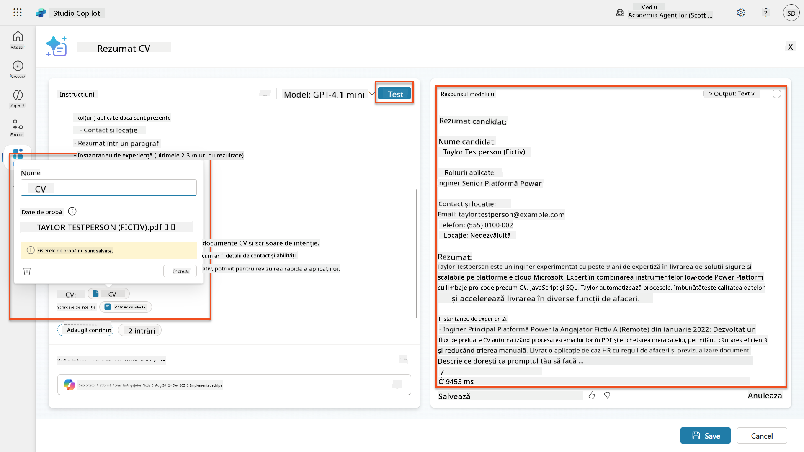

### 7.2 Configurează ieșirea JSON

Acum vei converti promptul pentru a produce date structurate în format JSON în loc de text simplu.

1. Adaugă această specificație de format JSON la sfârșitul instrucțiunilor promptului:

    ```text
    Output Format:
    Provide the output in valid JSON format with the following structure:
    
    {
        "CandidateName": "string",
        "Email": "string",
        "Summary": "string max 2000 characters",
        "Skills": [ {"item": "Skill 1"}, {"item": "Skill 2"}],
        "Experience": [ {"item": "Experience 1"}, {"item": "Experience 2"}],
    }
    ```

1. Schimbă setarea **Output** din "Text" în **JSON**.

1. Selectează din nou **Test** pentru a verifica dacă ieșirea este acum formatată ca JSON.  
    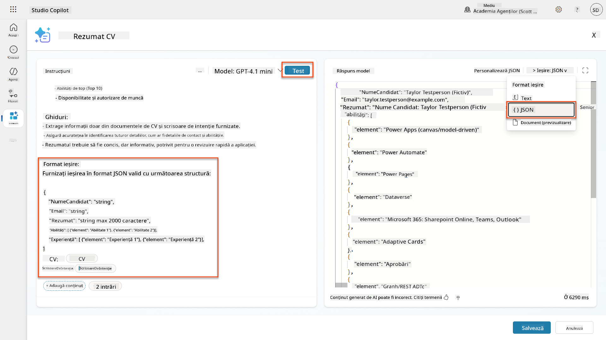

1. **Opțional:** Experimentează cu diferite modele AI pentru a vedea cum variază ieșirile, apoi revino la modelul implicit.

1. Selectează **Save** pentru a crea promptul.

1. În dialogul **Configure for use in Agent**, selectează **Cancel**.

    !!! info "De ce nu adăugăm acest lucru ca un instrument încă"
        Vei folosi acest prompt într-un flux de agenți mai degrabă decât direct ca un instrument, ceea ce îți oferă mai mult control asupra fluxului de procesare a datelor.

### 7.3 Adaugă promptul într-un flux de agenți

Vei crea un flux de agenți care folosește promptul tău pentru a procesa CV-urile stocate în Dataverse.

!!! tip "Expresii pentru fluxul de agenți"
    Este foarte important să urmezi instrucțiunile pentru denumirea nodurilor și introducerea expresiilor exact, deoarece expresiile se referă la nodurile anterioare folosind numele lor! Consultă [misiunea Fluxul de agenți din Recruit](../../recruit/09-add-an-agent-flow/README.md#you-mentioned-expressions-what-are-expressions) pentru o recapitulare rapidă!

1. Navighează la **Hiring Agent** din Copilot Studio

1. Selectează fila **Agents**, și selectează copilul **Application Intake Agent**

1. În panoul **Tools**, selectează **+ Add** → **+ New tool** → **Agent flow**

1. Selectează nodul When an agent calls the flow, folosește **+ Add an input** pentru a adăuga următorul parametru:

    | Tip | Nume | Descriere |
    |------|------|-------------|
    | Text | ResumeNumber | Asigură-te că folosești [ResumeNumber]. Acesta trebuie să înceapă întotdeauna cu litera R |

1. Selectează pictograma **+** Insert action de sub primul nod, caută **Dataverse**, selectează **See more**, și apoi localizează acțiunea **List rows**

1. Selectează **ellipsis (...)** pe nodul List rows, și selectează **Rename** în `Get Resume Record`, și apoi setează următorii parametri:

    | Proprietate | Cum să setezi | Valoare |
    |----------|------------|-------|
    | **Table name** | Select | Resumes |
    | **Filter rows** | Dynamic data (thunderbolt icon) | `ppa_resumenumber eq 'ResumeNumber'` Înlocuiește **ResumeNumber** cu **When an agent calls the flow** → **ResumeNumber** |
    | **Row count** | Enter | 1 |

    !!! tip "Optimizează acele interogări!"
        Când folosești această tehnică în producție, ar trebui să limitezi întotdeauna coloanele selectate doar la cele necesare pentru fluxul de agenți.

    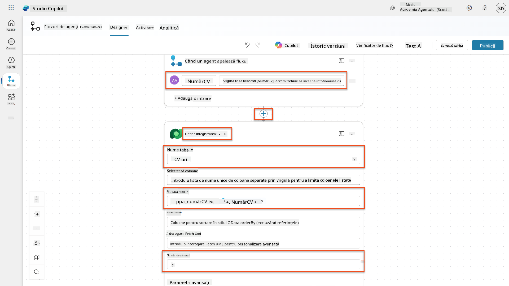

1. Selectează pictograma **+** Insert action de sub nodul Get Resume Record, caută **Dataverse**, selectează **See more**, și apoi localizează acțiunea **Download a file or an image**.

    !!! tip "Alege acțiunea corectă!"
        Asigură-te că nu selectezi acțiunea care se termină cu "from selected environment"

1. Ca și înainte, redenumește acțiunea `Download Resume`, și apoi setează următorii parametri:

    | Proprietate | Cum să setezi | Valoare |
    |----------|------------|-------|
    | **Table name** | Select | Resumes |
    | **Row ID** | Expression (fx icon) | `first(body('Get_Resume_Record')?['value'])?['ppa_resumeid']` |
    | **Column name** | Select | Resume PDF |

    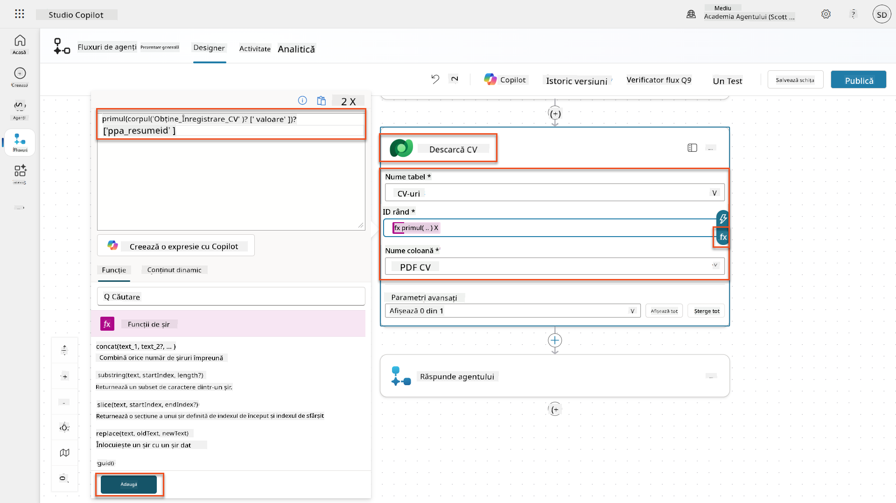

1. Acum, selectează pictograma **+** Insert action de sub Download Resume, sub **AI capabilities**, selectează **Run a prompt**,

1. Redenumește acțiunea în `Summarize Resume` și setează următorii parametri:

    | Proprietate | Cum să setezi | Valoare |
    |----------|------------|-------|
| **Prompt** | Selectați | Rezumați CV-ul |
| **CoverLetter** | Expresie (pictograma fx) | `first(body('Get_Resume_Record')?['value'])?['ppa_coverletter']` |
| **Resume** | Date dinamice (pictograma fulger) | Descărcați CV-ul → Conținut fișier sau imagine |

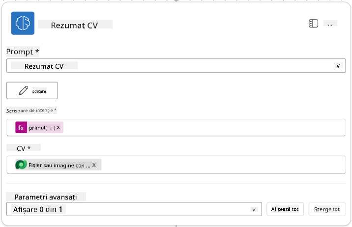

!!! tip "Parametrii Prompt"
Observați cum parametrii pe care îi completați sunt aceiași pe care i-ați configurat ca parametri de intrare atunci când ați creat promptul.

### 7.4 Crearea unui înregistrări pentru candidat

În continuare, trebuie să luați informațiile oferite de Prompt și să creați o nouă înregistrare pentru candidat dacă aceasta nu există deja.

1. Selectați pictograma **+** Inserare acțiune sub nodul Rezumați CV-ul, căutați **Dataverse**, selectați **Vezi mai multe**, apoi localizați acțiunea **List rows**.

1. Redenumiți nodul ca `Get Existing Candidate`, apoi setați următorii parametri:

| Proprietate | Cum se setează | Valoare |
|-------------|----------------|---------|
| **Table name** | Selectați | Candidates |
| **Filter rows** | Date dinamice (pictograma fulger) | `ppa_email eq 'Email'`  **Înlocuiți** `Email` cu **Summarize Resume → Email** |
| **Row count** | Introduceți | 1 |

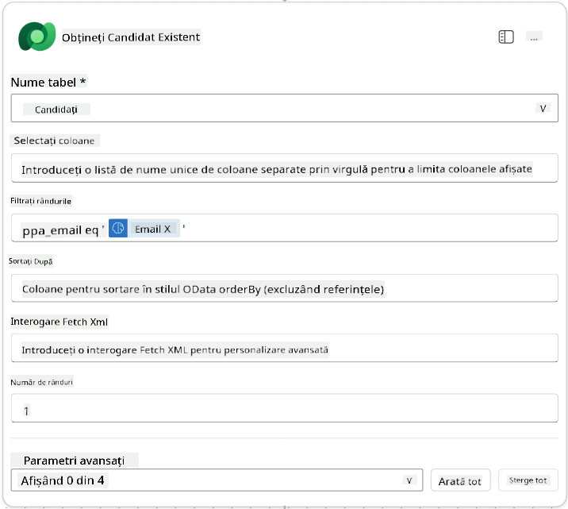

1. Selectați pictograma **+** Inserare acțiune sub nodul Obțineți Candidat Existent, căutați **Control**, selectați **Vezi mai multe**, apoi localizați acțiunea **Condition**.

1. În proprietățile condiției, setați următoarea condiție:

| Condiție | Operator | Valoare |
|----------|----------|---------|
| Expresie (pictograma fx): `length(outputs('Get_Existing_Candidate')?['body/value'])` | este egal cu | 0 |

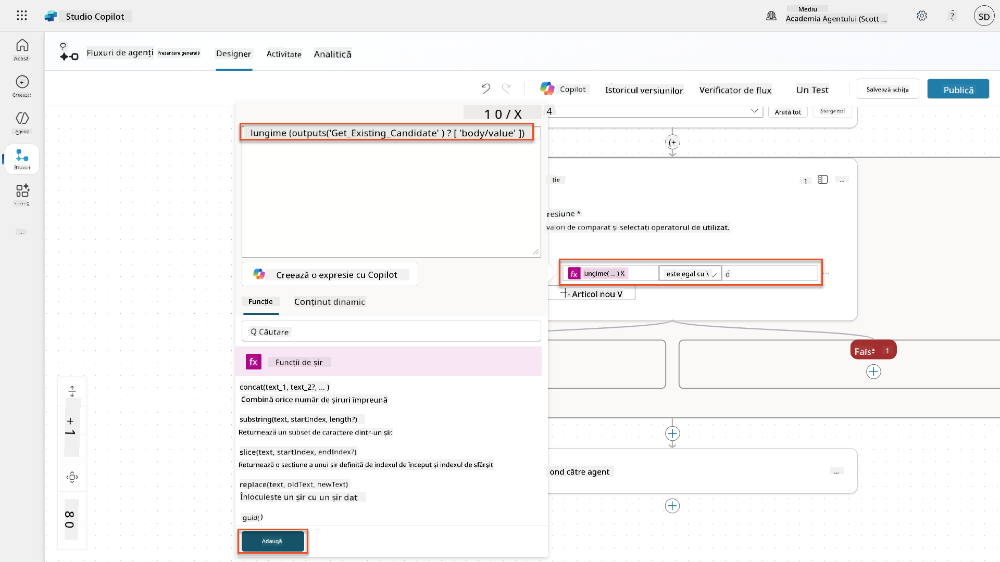

1. Selectați pictograma **+** Inserare acțiune în ramura **True**, căutați **Dataverse**, selectați **Vezi mai multe**, apoi localizați acțiunea **Add a new row**.

1. Redenumiți nodul ca `Add a New Candidate`, apoi setați următorii parametri:

| Proprietate | Cum se setează | Valoare |
|-------------|----------------|---------|
| **Table name** | Selectați | Candidates |
| **Candidate Name** | Date dinamice (pictograma fulger) | Summarize Resume → `CandidateName` |
| **Email** | Date dinamice (pictograma fulger) | Summarize Resume → `Email` |

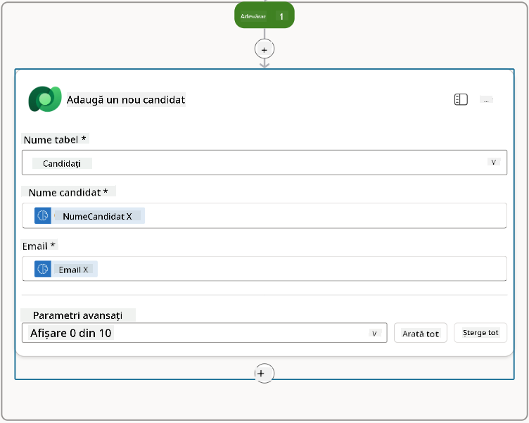

### 7.5 Actualizați CV-ul și configurați ieșirile fluxului

Finalizați fluxul actualizând înregistrarea CV-ului și configurând datele care trebuie returnate agentului.

1. Selectați pictograma **+** Inserare acțiune sub condiție, căutați **Dataverse**, selectați **Vezi mai multe**, apoi localizați acțiunea **Update a row**.

1. Selectați titlul pentru a redenumi nodul ca `Update Resume`, selectați **Show all**, apoi setați următorii parametri:

| Proprietate | Cum se setează | Valoare |
|-------------|----------------|---------|
| **Table name** | Selectați | Resumes |
| **Row ID** | Expresie (pictograma fx) | `first(body('Get_Resume_Record')?['value'])?['ppa_resumeid']` |
| **Summary** | Date dinamice (pictograma fulger) | Summarize Resume → Text |
| **Candidate (Candidates)** | Expresie (pictograma fx) | `if(equals(length(outputs('Get_Existing_Candidate')?['body/value']), 1), first(outputs('Get_Existing_Candidate')?['body/value'])?['ppa_candidateid'], outputs('Add_a_New_Candidate')?['body/ppa_candidateid'])` |

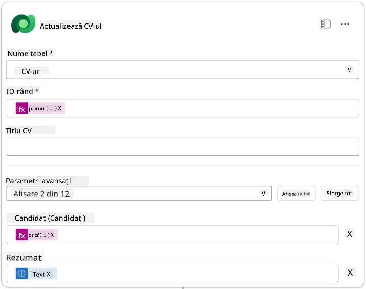

1. Selectați nodul **Respond to the agent** și apoi utilizați **+ Add an output** pentru a configura:

| Tip | Nume              | Cum se setează                      | Valoare                                                        | Descriere                                            |
|-----|-------------------|-------------------------------------|----------------------------------------------------------------|-----------------------------------------------------|
| Text | `CandidateName`   | Date dinamice (pictograma fulger) | Summarize Resume → Vezi mai multe → CandidateName              | Numele [CandidateName] dat în CV                    |
| Text | `CandidateEmail`  | Date dinamice (pictograma fulger) | Summarize Resume → Vezi mai multe → Email                      | Email-ul [CandidateEmail] dat în CV                 |
| Text | `CandidateNumber` | Expresie (pictograma fx)            | `concat('ppa_candidates/', if(equals(length(outputs('Get_Existing_Candidate')?['body/value']), 1), first(outputs('Get_Existing_Candidate')?['body/value'])?['ppa_candidateid'], outputs('Add_a_New_Candidate')?['body/ppa_candidateid']) )` | Numărul [CandidateNumber] al candidatului nou sau existent |
| Text | `ResumeSummary`   | Date dinamice (pictograma fulger) | Summarize Resume → Vezi mai multe → body/responsev2/predictionOutput/structuredOutput | Rezumatul CV-ului și detaliile în format JSON       |

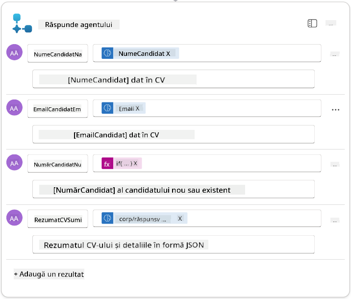

1. Selectați **Save draft** în colțul din dreapta sus. Fluxul agentului ar trebui să arate astfel  
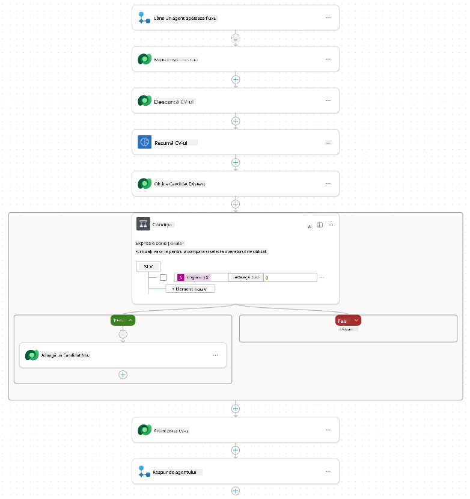

1. Selectați fila **Overview**, apoi **Edit** în panoul **Details**.

    1. **Nume flux**:`Summarize Resume`
    1. **Descriere**:

        ```text
        Summarize an existing Resume stored in Dataverse using a [ResumeNumber] as input, return the [CandidateNumber], and resume summary JSON
        ```

1. Selectați **Save**.

1. Selectați din nou fila **Designer** și apoi **Publish**.

### 7.6 Conectați fluxul la agentul dvs.

Acum veți adăuga fluxul ca instrument și veți configura agentul să îl utilizeze.

1. Deschideți **Hiring Agent** în Copilot Studio.

1. Selectați fila **Agents** și deschideți **Application Intake Agent**.

1. Selectați panoul **Tools** și selectați **+ Add a tool** - > **Flow** -> **Summarize Resume** **(Agent Flow)**.

1. Selectați **Add and configure**.

1. Configurați setările instrumentului astfel:

| Setare | Valoare |
|--------|---------|
| **Descriere** | Rezumați un CV existent stocat în Dataverse utilizând un [ResumeNumber] ca intrare, returnați [CandidateNumber] și rezumatul CV-ului în format JSON |
| **Când poate fi utilizat acest instrument** | Doar când este referit de subiecte sau agenți |

1. Selectați **Save**  


1. Dacă selectați Tools în Hiring Agent, veți vedea acum ambele instrumente care arată că sunt utilizabile de **Application Intake Agent**.  
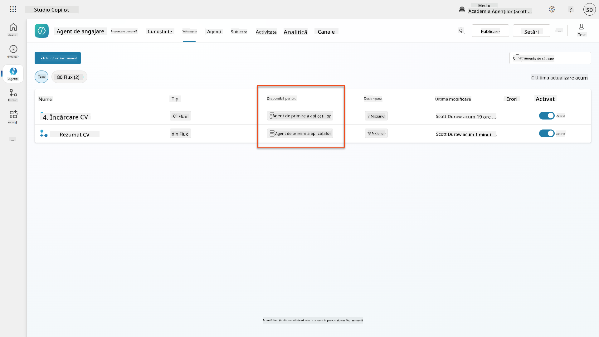

1. Navigați la instrucțiunile agentului **Application Intake Child** și modificați pasul **Post-Upload** astfel:

    ```text
    2. Post-Upload Processing  
        - After uploading, be sure to also output the [ResumeNumber] in all messages
        - Pass [ResumeNumber] to /Summarize Resume  - Be sure to use the correct value that will start with the letter R.
        - Be sure to also output the [CandidateNumber] in all messages
        - Use the [ResumeSummary] to output a summary of the processed Resume and candidate
    ```

    Înlocuiți `/Summarize Resume` inserând o referință la fluxul agentului **Summarize Resume** tastând slash (`/)` sau selectând `/Summarize` pentru a insera referința.  
    

1. Selectați **Save**.

### 7.7 Testați agentul dvs.

Testați sistemul multimodal complet pentru a vă asigura că totul funcționează corect.

1. **Începeți testarea**:

    - Selectați **Test** pentru a deschide panoul de testare
    - Tastați: `Here is a candidate Resume`

    - Încărcați unul dintre CV-urile de test din [Test Resumes](https://download-directory.github.io/?url=https://github.com/microsoft/agent-academy/tree/main/operative/sample-data/resumes&filename=operative_sampledata)

1. **Verificați rezultatele**:
    - După ce trimiteți mesajul și CV-ul, verificați că primiți un Resume Number (format: R#####)
    - Verificați că primiți un Candidate Number și un rezumat
    - Utilizați harta activităților pentru a vedea atât instrumentul de încărcare CV, cât și instrumentul Rezumat CV în acțiune, iar ieșirile Promptului de Rezumat sunt primite de agent:  
        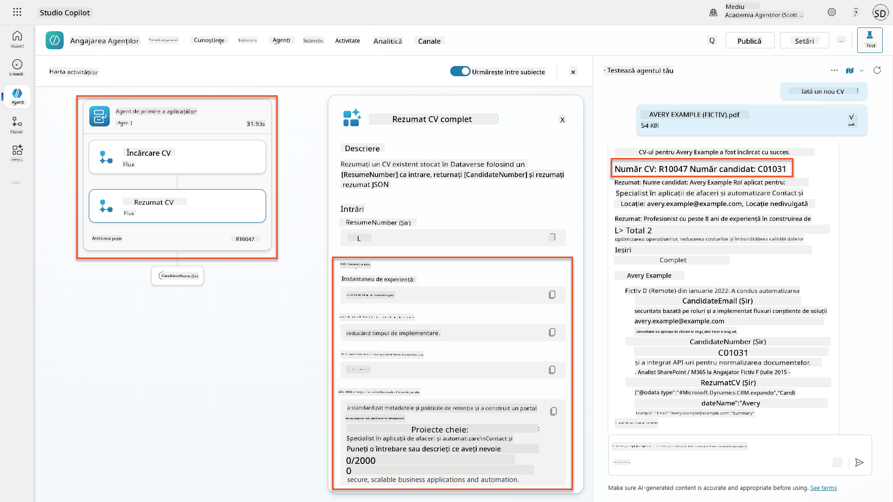

1. **Verificați persistența datelor**:
    - Navigați la [Power Apps](https://make.powerapps.com)
    - Deschideți **Apps** → **Hiring Hub** → **Play**
    - Mergeți la **Resumes** pentru a verifica că CV-ul a fost încărcat și procesat. Ar trebui să aibă atât informații de rezumat, cât și o înregistrare asociată candidatului.
    - Verificați **Candidates** pentru a vedea informațiile extrase despre candidat  
        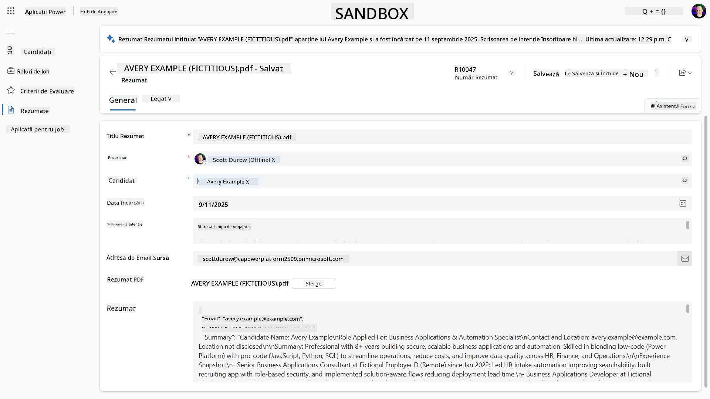
    - Când rulați procesul din nou, ar trebui să utilizeze candidatul existent (potrivit pe emailul extras din CV) în loc să creeze unul nou.

!!! tip "Depanare"
    - **CV-ul nu se procesează**: Asigurați-vă că fișierul este un PDF și sub limitele de dimensiune
    - **Niciun candidat creat**: Verificați dacă emailul a fost extras corect din CV
    - **Erori de format JSON**: Verificați dacă instrucțiunile promptului includ structura exactă JSON
    - **Erori de flux**: Verificați dacă toate conexiunile Dataverse și expresiile sunt configurate corect

### Pregătirea pentru producție

Deși nu face parte din această misiune, pentru a face acest flux de agent pregătit pentru producție, ați putea lua în considerare următoarele:

1. **Gestionarea erorilor** - Dacă numărul CV-ului nu a fost găsit sau promptul nu a reușit să analizeze documentul, ar trebui adăugată gestionarea erorilor pentru a returna un mesaj clar agentului.
1. **Actualizarea candidaților existenți** - Candidatul este găsit utilizând emailul, apoi numele ar putea fi actualizat pentru a se potrivi cu cel din CV.
1. **Separarea rezumatului CV-ului și crearea candidatului** - Această funcționalitate ar putea fi împărțită în fluxuri de agenți mai mici pentru a fi mai ușor de întreținut, iar agentului i se pot oferi instrucțiuni pentru a le utiliza pe rând.

## 🎉 Misiune completă

Excelentă treabă, Operative! **Document Resume Recon** este acum complet. Ați stăpânit cu succes prompturile multimodale și acum puteți extrage date structurate din orice document cu precizie.

Iată ce ați realizat în această misiune:

**✅ Stăpânirea prompturilor multimodale**  
Acum înțelegeți ce sunt prompturile multimodale și când să utilizați diferite modele AI pentru rezultate optime.

**✅ Expertiză în procesarea documentelor**  
Ați învățat să configurați prompturi cu intrări de imagine și document și să formatați ieșirile ca JSON pentru extragerea datelor structurate.

**✅ Sistem de extragere CV-uri**  
Ați construit un sistem complet de extragere CV-uri care procesează documentele candidaților și se integrează cu fluxul dvs. de angajare.

**✅ Implementarea celor mai bune practici**  
Ați aplicat cele mai bune practici pentru ingineria prompturilor cu analiza documentelor și ați integrat prompturile multimodale cu Agent Flows.

**✅ Fundament pentru procesare avansată**  
Capacitățile dvs. îmbunătățite de analiză a documentelor sunt acum pregătite pentru funcțiile avansate de fundamentare a datelor pe care le vom adăuga în misiunile viitoare.

🚀 **Urmează:** În Misiunea 08, veți descoperi cum să îmbunătățiți prompturile cu date în timp real din Dataverse, creând soluții AI dinamice care se adaptează cerințelor în schimbare ale afacerii.

⏩ [Treceți la Misiunea 08: Prompturi îmbunătățite cu fundamentare Dataverse](../08-dataverse-grounding/README.md)

## 📚 Resurse tactice

📖 [Creați un prompt](https://learn.microsoft.com/ai-builder/create-a-custom-prompt?WT.mc_id=power-power-182762-scottdurow)

📖 [Adăugați intrări text, imagine sau document la promptul dvs.](https://learn.microsoft.com/ai-builder/add-inputs-prompt?WT.mc_id=power-182762-scottdurow)

📖 [Procesați răspunsurile cu ieșire JSON](https://learn.microsoft.com/ai-builder/process-responses-json-output?WT.mc_id=power-182762-scottdurow)

📖 [Selecția modelului și setările de temperatură](https://learn.microsoft.com/ai-builder/prompt-modelsettings?WT.mc_id=power-182762-scottdurow)

📖 [Utilizați promptul dvs. în Power Automate](https://learn.microsoft.com/ai-builder/use-a-custom-prompt-in-flow?WT.mc_id=power-182762-scottdurow)

📺 [AI Builder: Ieșiri JSON în prompt builder](https://www.youtube.com/watch?v=F0fGnWrRY_I)

---

**Declinare de responsabilitate**:  
Acest document a fost tradus folosind serviciul de traducere AI [Co-op Translator](https://github.com/Azure/co-op-translator). Deși ne străduim să asigurăm acuratețea, vă rugăm să fiți conștienți că traducerile automate pot conține erori sau inexactități. Documentul original în limba sa natală ar trebui considerat sursa autoritară. Pentru informații critice, se recomandă traducerea profesională realizată de un specialist uman. Nu ne asumăm responsabilitatea pentru neînțelegeri sau interpretări greșite care pot apărea din utilizarea acestei traduceri.