<!--
CO_OP_TRANSLATOR_METADATA:
{
  "original_hash": "750f3ea8a94930439ebd8a10871b1d73",
  "translation_date": "2025-10-20T17:56:13+00:00",
  "source_file": "docs/operative-preview/08-dataverse-grounding/README.md",
  "language_code": "ro"
}
-->
# 🚨 Misiunea 08: Îmbunătățirea prompturilor cu integrarea Dataverse

## 🕵️‍♂️ NUME DE COD: `OPERAȚIUNEA CONTROLUL BAZEI DE DATE`

> **⏱️ Fereastra de timp pentru operațiune:** `~60 minute`

## 🎯 Rezumatul misiunii

Bine ai revenit, Operativ. Sistemul tău de recrutare multi-agent este funcțional, dar este nevoie de o îmbunătățire critică pentru **integrarea datelor** - modelele tale AI au nevoie de acces în timp real la datele structurate ale organizației pentru a lua decizii inteligente.

În prezent, promptul tău de Rezumat CV funcționează cu informații statice. Dar ce-ar fi dacă ar putea accesa dinamic baza de date cu rolurile de muncă pentru a oferi potriviri precise și actualizate? Ce-ar fi dacă ar înțelege criteriile tale de evaluare fără să fie nevoie să le codifici manual?

În această misiune, vei îmbunătăți promptul personalizat cu **integrarea Dataverse** - conectând prompturile direct la surse de date live. Acest lucru transformă agenții tăi din răspunsuri statice în sisteme dinamice, bazate pe date, care se adaptează nevoilor în schimbare ale afacerii.

Misiunea ta: integrează datele în timp real despre rolurile de muncă și criteriile de evaluare în fluxul de analiză a CV-urilor, creând un sistem auto-actualizabil care rămâne în pas cu cerințele de recrutare ale organizației tale.

## 🔎 Obiective

În această misiune, vei învăța:

1. Cum **integrarea Dataverse** îmbunătățește prompturile personalizate
1. Când să folosești integrarea datelor versus instrucțiuni statice
1. Cum să proiectezi prompturi care încorporează dinamic date live
1. Cum să îmbunătățești fluxul Rezumat CV cu potrivirea rolurilor de muncă

## 🧠 Înțelegerea integrării Dataverse pentru prompturi

**Integrarea Dataverse** permite prompturilor personalizate să acceseze date live din tabelele Dataverse atunci când procesează cereri. În loc de instrucțiuni statice, prompturile tale pot încorpora informații în timp real pentru a lua decizii informate.

### De ce este importantă integrarea Dataverse

Prompturile tradiționale funcționează cu instrucțiuni fixe:

```text
Match this candidate to these job roles: Developer, Manager, Analyst
```

Cu integrarea Dataverse, promptul tău accesează date actuale:

```text
Match this candidate to available job roles from the Job Roles table, 
considering current evaluation criteria and requirements
```

Această abordare oferă mai multe beneficii cheie:

- **Actualizări dinamice:** Rolurile de muncă și criteriile se schimbă fără modificări ale promptului
- **Consistență:** Toți agenții folosesc aceleași surse de date actuale
- **Scalabilitate:** Rolurile și criteriile noi sunt disponibile automat
- **Precizie:** Datele în timp real asigură decizii care reflectă nevoile actuale

### Cum funcționează integrarea Dataverse

Când activezi integrarea Dataverse pentru un prompt personalizat:

1. **Selecția datelor:** Alegi tabelele și coloanele specifice din Dataverse pe care să le incluzi. Poți selecta și tabele asociate pe care sistemul le va filtra pe baza înregistrărilor părinte recuperate.
1. **Injectarea contextului:** Promptul include automat datele recuperate în contextul promptului
1. **Filtrare inteligentă:** Sistemul include doar datele relevante pentru cererea curentă dacă oferi un filtru.
1. **Rezultate structurate:** Promptul tău poate face referire la datele recuperate și poate raționa despre înregistrările recuperate pentru a crea rezultatul.

### De la static la dinamic: Avantajul integrării

Să examinăm fluxul tău actual Rezumat CV din Misiunea 07 și să vedem cum integrarea Dataverse îl transformă din inteligență statică în inteligență dinamică.

**Abordarea statică actuală:**
Promptul tău existent include criterii de evaluare codificate și logică de potrivire predeterminată. Această abordare funcționează, dar necesită actualizări manuale ori de câte ori adaugi roluri noi, schimbi criteriile de evaluare sau modifici prioritățile companiei.

**Transformarea prin integrarea Dataverse:**
Prin adăugarea integrării Dataverse, fluxul tău Rezumat CV va:

- **Accesa rolurile de muncă actuale** din tabelul Roluri de Muncă
- **Folosi criterii de evaluare live** în loc de descrieri statice  
- **Oferi potriviri precise** bazate pe cerințele actuale

## 🎯 De ce prompturi dedicate versus conversații cu agenți

În Misiunea 02, ai experimentat cum Agentul de Interviu putea potrivi candidații cu rolurile de muncă, dar necesita prompturi complexe de utilizator, cum ar fi:

```text
Upload this resume, then show me open job roles,
each with a description of the evaluation criteria, 
then use this to match the resume to at least one suitable
job role even if not a perfect match.
```

Deși acest lucru funcționa, prompturile dedicate cu integrarea Dataverse oferă avantaje semnificative pentru sarcini specifice:

### Avantajele cheie ale prompturilor dedicate

| Aspect | Conversații cu agenți | Prompturi dedicate |
|--------|-------------------|------------------|
| **Consistență** | Rezultatele variază în funcție de abilitățile utilizatorului de a crea prompturi | Procesare standardizată de fiecare dată |
| **Specializare** | Raționamentul general poate rata nuanțele afacerii | Proiectat special cu logică optimizată pentru afaceri |
| **Automatizare** | Necesită interacțiune și interpretare umană | Se declanșează automat cu rezultate JSON structurate |

## 🧪 Laboratorul 8: Adaugă integrarea Dataverse la prompturi

Este timpul să îți îmbunătățești capacitățile de analiză a CV-urilor! Vei îmbunătăți fluxul existent Rezumat CV cu potrivirea dinamică a rolurilor de muncă.

### Cerințe preliminare pentru a finaliza această misiune

1. Trebuie să **ai fie**:

    - **Finalizat Misiunea 07** și să ai sistemul de analiză a CV-urilor pregătit, **SAU**
    - **Importat soluția de început pentru Misiunea 08** dacă începi de la zero sau ai nevoie să recuperezi. [Descarcă soluția de început pentru Misiunea 08](https://aka.ms/agent-academy)

1. Documente de CV de test din [test Resumes](https://download-directory.github.io/?url=https://github.com/microsoft/agent-academy/tree/main/operative/sample-data/resumes&filename=operative_sampledata)

!!! note "Importul soluției și datele de test"
    Dacă folosești soluția de început, consultă [Misiunea 01](../01-get-started/README.md) pentru instrucțiuni detaliate despre cum să imporți soluții și date de test în mediul tău.

### 8.1 Adaugă integrarea Dataverse la promptul tău

Vei construi pe promptul Rezumat CV pe care l-ai creat în Misiunea 07. În prezent, acesta doar rezumă CV-ul, dar acum îl vei conecta la rolurile de muncă așa cum există în Dataverse, menținându-l mereu actualizat.

Mai întâi, să examinăm tabelele Dataverse pe care le vei folosi pentru integrare:

1. **Navighează** la [Power Apps](https://make.powerapps.com) și selectează mediul tău folosind **Comutatorul de mediu** din colțul dreapta sus al barei de navigare.

1. Selectează **Tabele** și localizează tabelul **Roluri de Muncă**

1. Revizuiește coloanele cheie pe care le vei folosi pentru integrare:

    | Coloană | Scop |
    |--------|---------|
    | **Număr Rol de Muncă** | Identificator unic pentru potrivirea rolurilor |
    | **Titlu Rol** | Nume afișat pentru rol |
    | **Descriere** | Cerințe detaliate ale rolului |

1. În mod similar, revizuiește celelalte tabele, cum ar fi tabelul **Criterii de Evaluare**.

### 8.2 Adaugă datele de integrare Dataverse la promptul tău

1. **Navighează** la Copilot Studio și selectează mediul tău folosind **Comutatorul de mediu** din colțul dreapta sus al barei de navigare.

1. Selectează **Instrumente** din navigarea din stânga.

1. Alege **Prompt** și localizează promptul tău **Rezumat CV** din Misiunea 07.  
    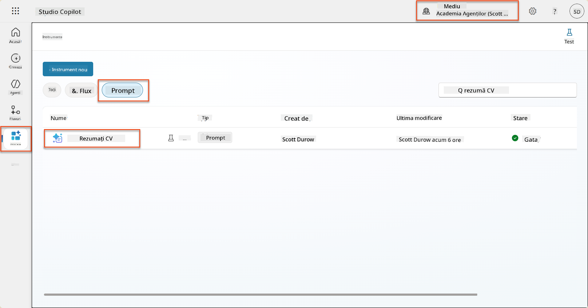

1. Selectează **Editare** pentru a modifica promptul și înlocuiește-l cu versiunea îmbunătățită de mai jos:

    !!! important
        Asigură-te că parametrii CV și Scrisoare de Intenție rămân intacti ca parametri.

    ```text
    You are tasked with extracting key candidate information from a resume and cover letter to facilitate matching with open job roles and creating a summary for application review.
    
    ### Instructions:
    1. **Extract Candidate Details:**
       - Identify and extract the candidate's full name.
       - Extract contact information, specifically the email address.
    
    2. **Analyze Resume and Cover Letter:**
       - Review the resume content to identify relevant skills, experience, and qualifications.
       - Review the cover letter to understand the candidate's motivation and suitability for the roles.
    
    3. **Match Against Open Job Roles:**
       - Compare the extracted candidate information with the requirements and descriptions of the provided open job roles.
       - Use the job descriptions to assess potential fit.
       - Identify all roles that align with the candidate's cover letter and profile. You don't need to assess perfect suitability.
       - Provide reasoning for each match based on the specific job requirements.
    
    4. **Create Candidate Summary:**
       - Summarize the candidate's profile as multiline text with the following sections:
          - Candidate name
          - Role(s) applied for if present
          - Contact and location
          - One-paragraph summary
          - Top skills (8–10)
          - Experience snapshot (last 2–3 roles with outcomes)
          - Key projects (1–3 with metrics)
          - Education and certifications
          - Availability and work authorization
    
    ### Output Format
    
    Provide the output in valid JSON format with the following structure:
    
    {
      "CandidateName": "string",
      "Email": "string",
      "MatchedRoles": [
        {
          "JobRoleNumber": "ppa_jobrolenumber from grounded data",
          "RoleName": "ppa_jobtitle from grounded data",
          "Reasoning": "Detailed explanation based on job requirements"
        }
      ],
      "Summary": "string"
    }
    
    ### Guidelines
    
    - Extract information only from the provided resume and cover letter documents.
    - Ensure accuracy in identifying contact details.
    - Use the available job role data for matching decisions.
    - The summary should be concise but informative, suitable for quick application review.
    - If no suitable matches are found, indicate an empty list for MatchedRoles and explain briefly in the summary.
    
    ### Input Data
    Open Job Roles (ppa_jobrolenumber, ppa_jobtitle): /Job Role 
    Resume: {Resume}
    Cover Letter: {CoverLetter}
    ```

1. În editorul de prompturi, înlocuiește `/Rol de Muncă` selectând **+ Adaugă conținut**, selectând **Dataverse** → **Rol de Muncă** și selectează următoarele coloane, apoi selectează **Adaugă**:

    1. **Număr Rol de Muncă**

    1. **Titlu Rol**

    1. **Descriere**

    !!! tip
        Poți tasta numele tabelului pentru a căuta.

1. În dialogul **Rol de Muncă**, selectează atributul **Filtru**, selectează **Status**, și apoi tastează **Activ** ca valoare **Filtru**.  
    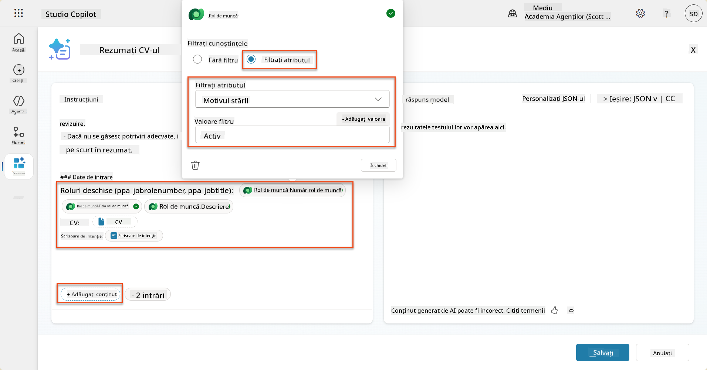

    !!! tip
        Poți folosi **Adaugă valoare** aici pentru a adăuga un parametru de intrare - de exemplu, dacă ai un prompt pentru a rezuma un înregistrare existentă, ai putea oferi Numărul CV-ului ca parametru pentru filtrare.

1. Apoi, vei adăuga tabelul Dataverse asociat **Criterii de Evaluare**, selectând din nou **+ Adaugă conținut**, găsind **Roluri de Muncă**, și în loc să selectezi coloanele din Rol de Muncă, extinde **Rol de Muncă (Criterii de Evaluare)** și selectează următoarele coloane, apoi selectează **Adaugă**:

    1. **Nume Criteriu**

    1. **Descriere**  
        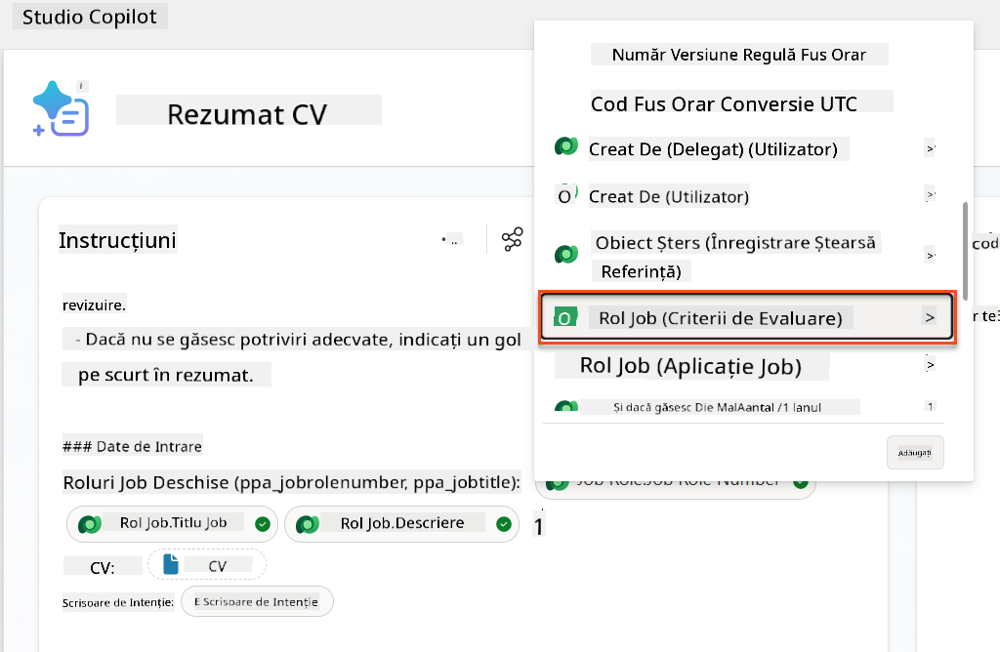

        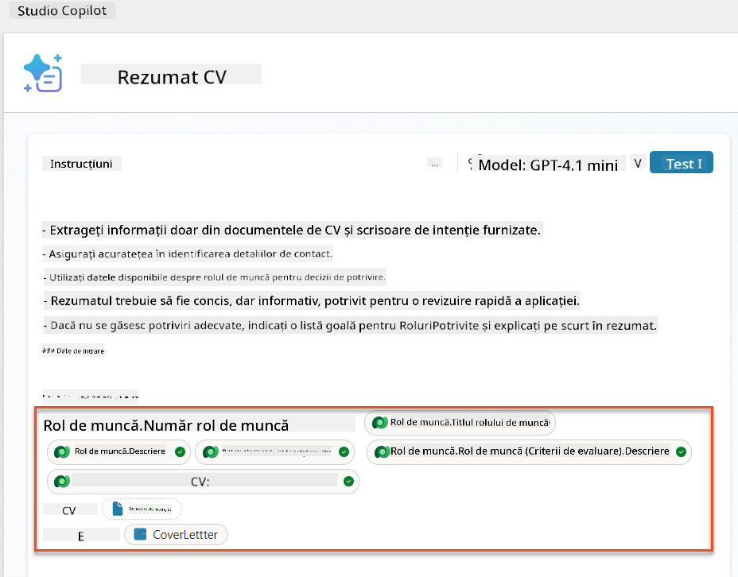

    !!! tip
        Este important să selectezi Criteriile de Evaluare asociate selectând mai întâi Rolul de Muncă, și apoi navigând în meniu la Rol de Muncă (Criterii de Evaluare). Acest lucru va asigura că doar înregistrările asociate pentru Rolul de Muncă vor fi încărcate.

1. Selectează **Setări** și ajustează **Recuperarea înregistrărilor** la 1000 - acest lucru va permite includerea maximă a Rolurilor de Muncă și Criteriilor de Evaluare în promptul tău.  
    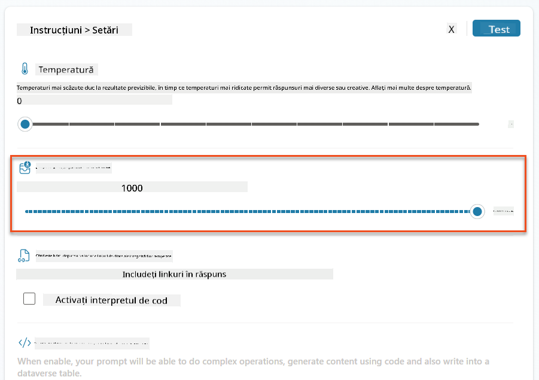

### 8.3 Testează promptul îmbunătățit

1. Selectează parametrul **CV** și încarcă un CV de test pe care l-ai folosit în Misiunea 07.
1. Selectează **Test**.
1. După ce testul s-a finalizat, observă că rezultatul JSON include acum **Rolurile Potrivite**.
1. Selectează fila **Cunoștințe utilizate** pentru a vedea datele Dataverse care s-au combinat cu promptul înainte de execuție.
1. **Salvează** promptul actualizat. Sistemul va include acum automat aceste date Dataverse cu promptul tău atunci când fluxul existent Rezumat CV îl va apela.  
    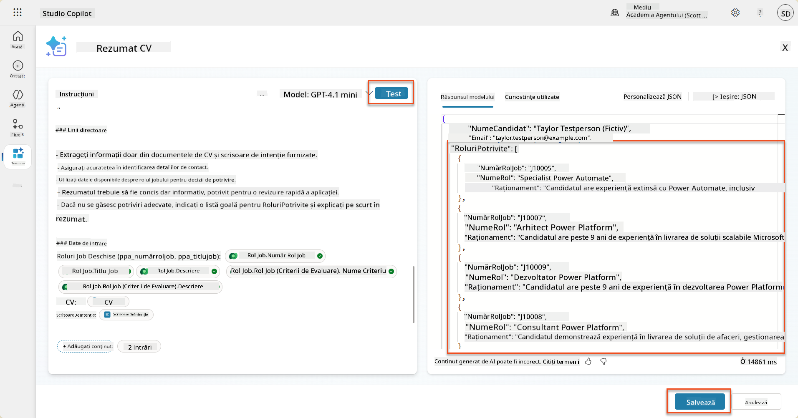

### 8.4 Adaugă fluxul de agent pentru aplicații de muncă

Pentru a permite Agentului de Primire a Aplicațiilor să creeze Roluri de Muncă pe baza rolurilor sugerate, trebuie să creezi un flux de agent. Agentul va apela acest instrument pentru fiecare dintre rolurile de muncă sugerate care interesează candidatul.

!!! tip "Expresii pentru fluxul de agent"
    Este foarte important să urmezi instrucțiunile pentru denumirea nodurilor și introducerea expresiilor exact, deoarece expresiile se referă la nodurile anterioare folosind numele lor! Consultă [Misiunea fluxului de agent în Recrutare](../../recruit/09-add-an-agent-flow/README.md#you-mentioned-expressions-what-are-expressions) pentru o recapitulare rapidă!

1. În cadrul **Agentului de Recrutare**, selectează fila **Agenți** și deschide agentul copil **Agent de Primire a Aplicațiilor**.

1. În panoul **Instrumente**, selectează **+ Adaugă** → **+ Instrument nou** → **Flux de agent**

1. Selectează nodul **Când un agent apelează fluxul**, folosește **+ Adaugă o intrare** pentru a adăuga următorul parametru:

    | Tip | Nume            | Descriere                                                  |
    | ---- | --------------- | ------------------------------------------------------------ |
    | Text | `NumărCV`  | Asigură-te că folosești doar [NumărCV] - trebuie să înceapă cu litera R |
    | Text | `NumărRolMuncă` | Asigură-te că folosești doar [NumărRolMuncă] - trebuie să înceapă cu litera J |

    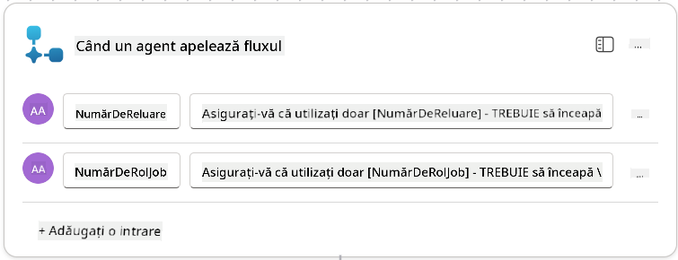

1. Selectează pictograma **+** Inserare acțiune sub primul nod, caută **Dataverse**, selectează **Vezi mai multe**, și apoi localizează acțiunea **List rows**.

1. **Redenumește** nodul ca `Obține CV`, și apoi setează următorii parametri:

    | Proprietate        | Cum să setezi                      | Valoare                                                        |
    | --------------- | ------------------------------- | ------------------------------------------------------------ |
    | **Nume tabel**  | Selectează                          | CV-uri                                                      |
    | **Filtrare rânduri** | Date dinamice (pictograma fulger) | `ppa_resumenumber eq 'NumărCV'` Selectează și înlocuiește **NumărCV** cu **Când un agent apelează fluxul** → **NumărCV** |
    | **Număr rânduri**   | Introdu                           | 1                                                            |

    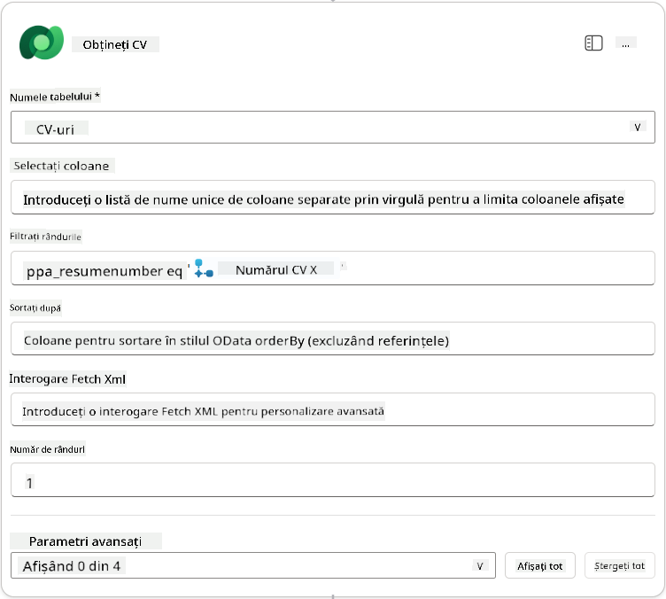

1. Acum, selectează pictograma **+** Inserare acțiune sub **Obține CV**, caută **Dataverse**, selectează **Vezi mai multe**, și apoi localizează acțiunea **List rows**.

1. **Redenumește** nodul ca `Obține Rol Muncă`, și apoi setează următorii parametri:

    | Proprietate        | Cum să setezi                      | Valoare                                                        |
    | --------------- | ------------------------------- | ------------------------------------------------------------ |
    | **Nume tabel**  | Selectează                          | Roluri de Muncă                                                    |
    | **Filtrare rânduri** | Date dinamice (pictograma fulger) | `ppa_jobrolenumber eq 'NumărRolMuncă'` Selectează și înlocuiește **NumărRolMuncă** cu **Când un agent apelează fluxul** → **NumărRolMuncă** |
    | **Număr rânduri**   | Introdu                           | 1                                                            |

    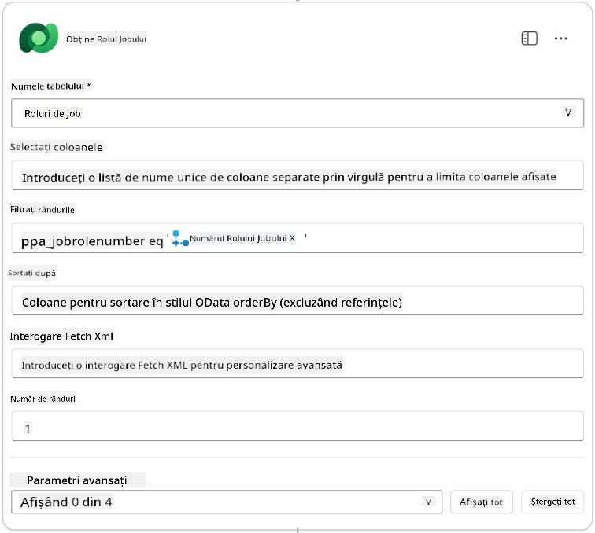

1. Acum, selectează pictograma **+** Inserare acțiune sub Obține Rol Muncă, caută **Dataverse**, selectează **Vezi mai multe**, și apoi localizează acțiunea **Add a new row**.

1. **Redenumește** nodul ca `Adaugă Aplicație`, și apoi setează următorii parametri:

    | Proprietate                           | Cum să setezi           | Valoare                                                        |
    | ---------------------------------- | -------------------- | ------------------------------------------------------------ |
    | **Nume tabel**                     | Selectează               | Aplicații de Muncă                                             |
    | **Candidat (Candidați)**             | Expresie (pictograma fx) | `concat('ppa_candidates/',first(outputs('Obține_CV')?['body/value'])?['_ppa_candidate_value'])` |
| **Rol de Job (Roluri de Job)**            | Expresie (iconiță fx) | `concat('ppa_jobroles/',first(outputs('Get_Job_Role')?['body/value'])?['ppa_jobroleid'])` |
| **CV (CV-uri)**                           | Expresie (iconiță fx) | `concat('ppa_resumes/', first(outputs('Get_Resume')?['body/value'])?['ppa_resumeid'])` |
| **Data Aplicării** (folosiți **Afișează tot**) | Expresie (iconiță fx) | `utcNow()`                                                   |

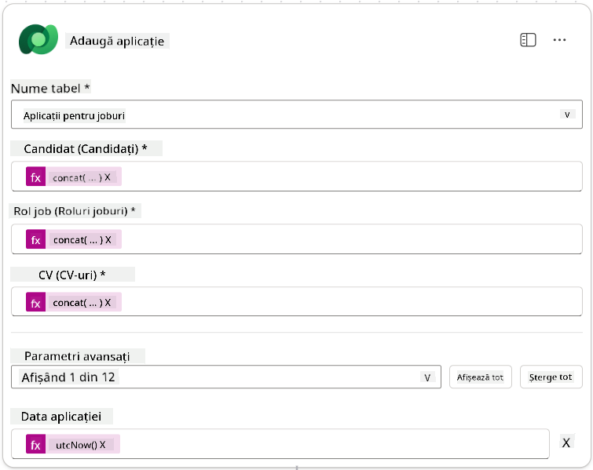

1. Selectați **Răspunde la nodul agentului**, apoi selectați **+ Adaugă un output**

     | Proprietate     | Cum să setați                  | Detalii                                         |
     | --------------- | ------------------------------ | ----------------------------------------------- |
     | **Tip**         | Selectați                      | `Text`                                          |
     | **Nume**        | Introduceți                   | `ApplicationNumber`                             |
     | **Valoare**     | Date dinamice (iconiță fulger) | *Adaugă Aplicare → Vezi Mai Mult → Număr Aplicare* |
     | **Descriere**   | Introduceți                   | `Numărul [ApplicationNumber] al aplicației de job create` |

     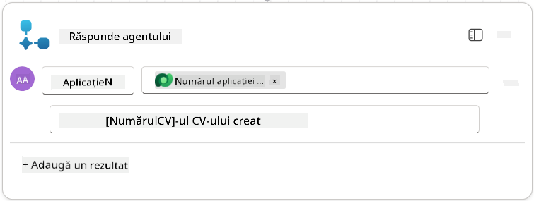

1. Selectați **Salvează schița** în partea dreaptă sus

1. Selectați fila **Prezentare generală**, apoi selectați **Editează** în panoul **Detalii**

      - **Nume flux**:`Create Job Application`
      - **Descriere**:`Creează o nouă aplicație de job când sunt furnizate [ResumeNumber] și [JobRoleNumber]`
      - **Salvează**

1. Selectați din nou fila **Designer**, apoi selectați **Publică**.

### 8.5 Adaugă Crearea Aplicației de Job la agent

Acum veți conecta fluxul publicat la Agentul de Primire a Aplicațiilor.

1. Navigați înapoi la **Agentul de Angajare** și selectați fila **Agenți**. Deschideți **Agentul de Primire a Aplicațiilor**, apoi localizați panoul **Instrumente**.

1. Selectați **+ Adaugă**

1. Selectați filtrul **Flux**, căutați `Create Job Application`. Selectați fluxul **Create Job Application**, apoi **Adaugă și configurează**.

1. Setați următorii parametri:

    | Parametru                                          | Valoare                                                      |
    | -------------------------------------------------- | ----------------------------------------------------------- |
    | **Descriere**                                      | `Creează o nouă aplicație de job când sunt furnizate [ResumeNumber] și [JobRoleNumber]` |
    | **Detalii suplimentare → Când poate fi utilizat acest instrument** | `Doar când este referit de subiecte sau agenți`             |

1. Selectați **Salvează**  
    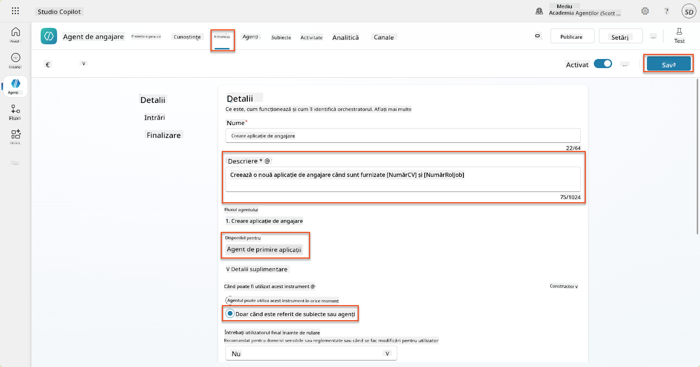

### 8.6 Definește instrucțiunile agentului

Pentru a crea aplicații de job, trebuie să spuneți agentului când să folosească noul instrument. În acest caz, veți cere utilizatorului să confirme la ce roluri de job sugerate dorește să aplice și să instruiți agentul să ruleze instrumentul pentru fiecare rol.

1. Revenind la **Agentul de Primire a Aplicațiilor**, localizați panoul **Instrucțiuni**.

1. În câmpul **Instrucțiuni**, **adăugați** următoarele indicații clare pentru agentul copil la **sfârșitul instrucțiunilor existente**:

    ```text
    3. Post Resume Upload
       - Respond with a formatted bullet list of [SuggestedJobRoles] the candidate could apply for.  
       - Use the format: [JobRoleNumber] - [RoleDescription]
       - Ask the user to confirm which Job Roles to create applications for the candidate.
       - When the user has confirmed a set of [JobRoleNumber]s, move to the next step.
    
    4. Post Upload - Application Creation
        - After the user confirms which [SuggestedJobRoles] for a specific [ResumeNumber]:
        E.g. "Apply [ResumeNumber] for the Job Roles [JobRoleNumber], [JobRoleNumber], [JobRoleNumber]
        E.g. "apply to all suggested job roles" - this implies use all the [JobRoleNumbers] 
         - Loop over each [JobRoleNumber] and send with [ResumeNumber] to /Create Job Application   
         - Summarize the Job Applications Created
    
    Strict Rules (that must never be broken)
    You must always follow these rules and never break them:
    1. The only valid identifiers are:
      - ResumeNumber (ppa_resumenumber)→ format R#####
      - CandidateNumber (ppa_candidatenumber)→ format C#####
      - ApplicationNumber (ppa_applicationnumber)→ format A#####
      - JobRoleNumber (ppa_jobrolenumber)→ format J#####
    2. Never guess or invent these values.
    3. Always extract identifiers from the current context (conversation, data, or system output). 
    ```

1. Unde instrucțiunile includ o bară oblică (/), selectați textul de după / și selectați instrumentul **Create Job Application**.

1. Selectați **Salvează**  
    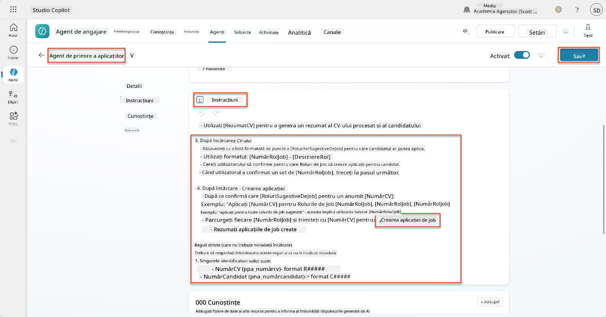

!!! tip "Iterarea peste mai multe elemente în Orchestrarea Generativă"
    Aceste instrucțiuni folosesc capacitatea de orchestrare generativă de a itera peste mai multe rânduri atunci când se iau decizii despre ce pași și instrumente să se utilizeze. Rolurile de Job Potrivite vor fi citite automat, iar Agentul de Primire a Aplicațiilor va rula pentru fiecare rând. Bine ați venit în lumea magică a orchestrării generative!

### 8.7 Testați agentul

1. Deschideți **Agentul de Angajare** în Copilot Studio.

1. **Încărcați** un CV de probă în chat și scrieți:

    ```text
    This is a new resume for the Power Platform Developer Role.
    ```

1. Observați cum agentul oferă o listă de Roluri de Job Sugestive - fiecare cu un număr de Rol de Job.  
    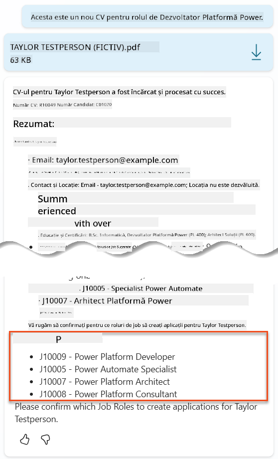

1. Apoi puteți specifica pentru care dintre acestea doriți ca CV-ul să fie adăugat ca aplicație de job.
    **Exemple:**

    ```text
    "Apply for all of those job roles"
    "Apply for the J10009 Power Platform Developer role"
    "Apply for the Developer and Architect roles"
    ```

    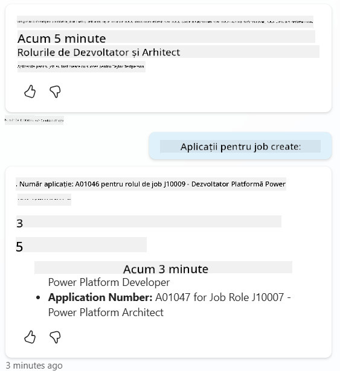

1. Instrumentul **Create Job Application** va fi apoi rulat pentru fiecare rol de job specificat. În harta Activităților, veți vedea instrumentul Create Job Application rulând pentru fiecare dintre Rolurile de Job pentru care ați cerut să se creeze o aplicație:  
    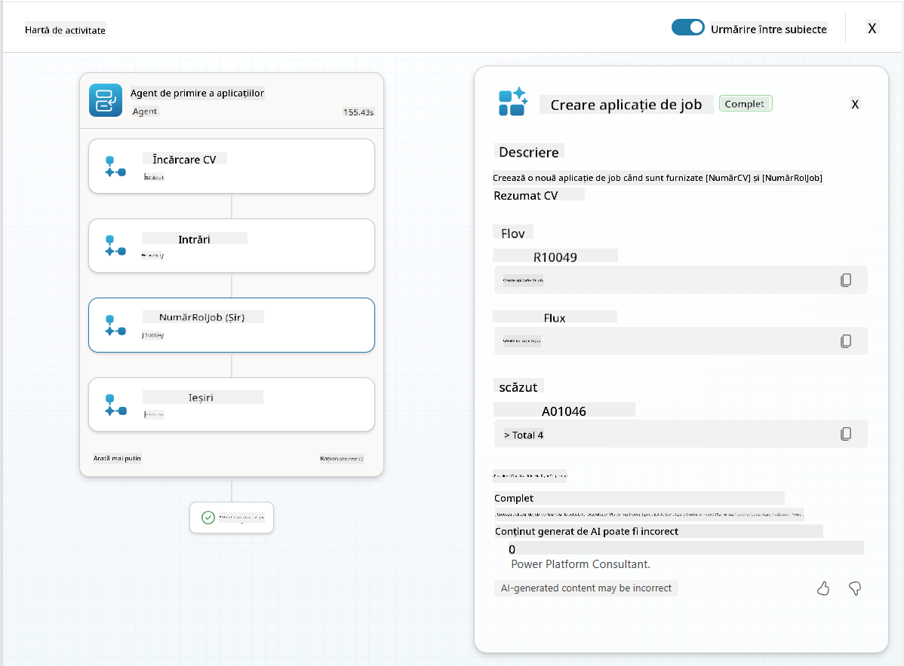

## 🎉 Misiune Finalizată

Lucru remarcabil, Operativ! **Operațiunea Controlul Solului** este acum completă. Ați îmbunătățit cu succes capacitățile AI cu date dinamice, creând un sistem de angajare cu adevărat inteligent.

Iată ce ați realizat în această misiune:

**✅ Stăpânirea conectării la Dataverse**  
Acum înțelegeți cum să conectați prompturi personalizate la surse de date live pentru inteligență dinamică.

**✅ Analiza îmbunătățită a CV-urilor**  
Fluxul dvs. de Rezumat CV accesează acum date în timp real despre roluri de job și criterii de evaluare pentru potriviri precise.

**✅ Luarea deciziilor bazate pe date**  
Agenții dvs. de angajare se pot adapta acum automat la cerințele în schimbare ale joburilor fără actualizări manuale ale prompturilor.

**✅ Crearea Aplicațiilor de Job**  
Sistemul dvs. îmbunătățit poate acum crea Aplicații de Job și este pregătit pentru orchestrarea fluxurilor complexe viitoare.

🚀 **Urmează:** În următoarea misiune, veți învăța cum să implementați capacități de raționament profund care ajută agenții să ia decizii complexe și să ofere explicații detaliate pentru recomandările lor.

⏩ [Treceți la Misiunea 09: Raționament profund](../09-deep-reasoning/README.md)

## 📚 Resurse Tactice

📖 [Utilizați propriile date într-un prompt](https://learn.microsoft.com/ai-builder/use-your-own-prompt-data?WT.mc_id=power-182762-scottdurow)

📖 [Creați un prompt personalizat](https://learn.microsoft.com/ai-builder/create-a-custom-prompt?WT.mc_id=power-182762-scottdurow)

📖 [Lucrați cu Dataverse în Copilot Studio](https://learn.microsoft.com/microsoft-copilot-studio/knowledge-add-dataverse?WT.mc_id=power-182762-scottdurow)

📖 [Prezentare generală a prompturilor personalizate AI Builder](https://learn.microsoft.com/ai-builder/prompts-overview?WT.mc_id=power-182762-scottdurow)

📖 [Documentația Power Platform AI Builder](https://learn.microsoft.com/ai-builder/?WT.mc_id=power-182762-scottdurow)

📖 [Training: Creați prompturi AI Builder folosind propriile date Dataverse](https://learn.microsoft.com/training/modules/ai-builder-grounded-prompts/?WT.mc_id=power-182762-scottdurow)

---

**Declinare de responsabilitate**:  
Acest document a fost tradus folosind serviciul de traducere AI [Co-op Translator](https://github.com/Azure/co-op-translator). Deși ne străduim să asigurăm acuratețea, vă rugăm să fiți conștienți că traducerile automate pot conține erori sau inexactități. Documentul original în limba sa natală ar trebui considerat sursa autoritară. Pentru informații critice, se recomandă traducerea profesională realizată de oameni. Nu ne asumăm responsabilitatea pentru neînțelegeri sau interpretări greșite care pot apărea din utilizarea acestei traduceri.