<!--
CO_OP_TRANSLATOR_METADATA:
{
  "original_hash": "d9cd8cd1a4fbd8915171a2ed972cc322",
  "translation_date": "2025-10-20T17:20:15+00:00",
  "source_file": "docs/recruit/00-course-setup/README.md",
  "language_code": "ro"
}
-->
# 🚨 Misiunea 00: Configurarea Cursului

## 🕵️‍♂️ NUME DE COD: `OPERAȚIUNEA PREGĂTIRE PENTRU IMPLEMENTARE`

> **⏱️ Fereastra de timp pentru operațiune:** `~30 minute`  

## 🎯 Scopul Misiunii

Bun venit la prima misiune din antrenamentul tău ca Agent Copilot Studio.  
Înainte de a începe să construiești primul tău agent AI, trebuie să îți configurezi **mediul de dezvoltare pregătit pentru teren**.

Această informare detaliază sistemele, acreditările de acces și pașii de configurare necesari pentru a opera cu succes în ecosistemul Microsoft 365.

## 🔎 Obiective

Misiunea ta include:

1. Obținerea unui cont Microsoft 365  
1. Accesarea Microsoft Copilot Studio  
1. (Opțional) Obținerea unei licențe Microsoft 365 Copilot pentru publicarea în producție  
1. Crearea unui mediu de dezvoltare ca mediu Copilot Studio pentru construcție  
1. Crearea unui site SharePoint care va servi drept sursă de date în misiunile ulterioare  

---

## 🔍 Cerințe preliminare

Înainte de a începe, asigură-te că ai:

1. O **adresă de e-mail de serviciu sau de școală** (adresele personale @outlook.com, @gmail.com etc. nu sunt acceptate).  
1. Acces la internet și un browser modern (Edge, Chrome sau Firefox recomandat).  
1. Cunoștințe de bază despre Microsoft 365 (de exemplu, conectarea la aplicațiile Office sau Teams).  
1. (Opțional) Un card de credit sau o metodă de plată dacă intenționezi să achiziționezi licențe plătite.

---

## Pasul 1: Obține un cont Microsoft 365

Copilot Studio se află în cadrul Microsoft 365, așa că ai nevoie de un cont Microsoft 365 pentru a accesa platforma. Poți folosi un cont existent dacă ai unul sau poți urma acești pași pentru a obține o licență adecvată:

1. **Achiziționează un abonament Microsoft 365 Business**  
   1. Accesează [Pagina de planuri și prețuri Microsoft 365 Business](https://www.microsoft.com/microsoft-365/business/microsoft-365-plans-and-pricing)  
   1. Cea mai ieftină opțiune pentru a începe este planul Microsoft 365 Business Basic. Selectează `Try for free` și urmează formularul ghidat pentru a completa detaliile abonamentului, informațiile contului și metoda de plată.  
   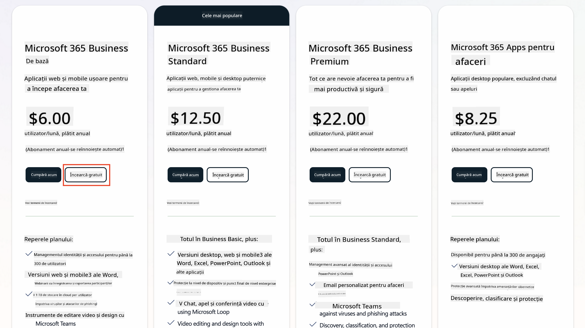  
   1. După ce ai noul cont, conectează-te.

    !!! Tip
        Dacă intenționezi să publici agenți în Microsoft 365 Copilot Chat sau să te conectezi la date organizaționale (SharePoint, OneDrive, Dataverse), este necesară o licență Microsoft 365 Copilot. Aceasta este o licență suplimentară despre care poți afla mai multe [pe site-ul de licențiere](https://www.microsoft.com/microsoft-365/copilot#plans).

---

## Pasul 2: Începe un trial Copilot Studio

După ce ai configurat tenant-ul Microsoft 365, trebuie să obții acces la Copilot Studio. Poți beneficia de un trial gratuit de 30 de zile urmând acești pași:

1. Accesează [aka.ms/TryCopilotStudio](https://aka.ms/TryCopilotStudio).  
1. Introdu adresa de e-mail a contului configurat în pasul anterior și selectează `Next`.  
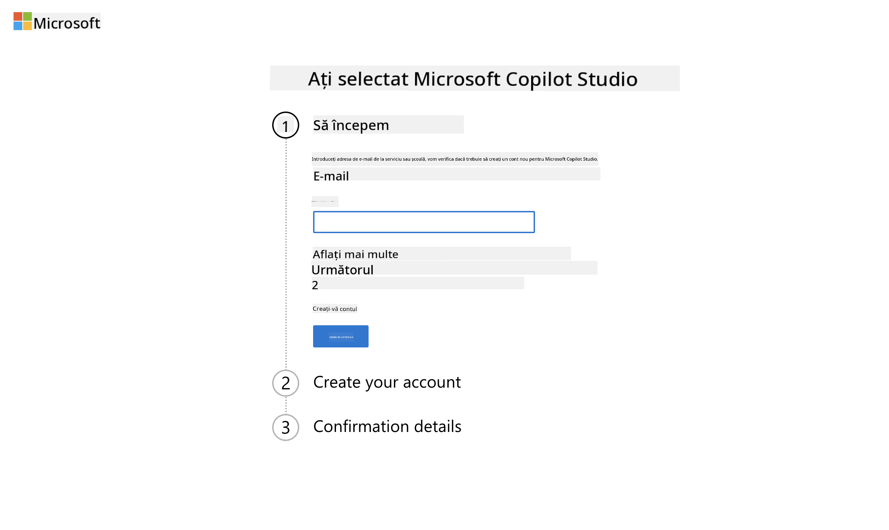  
1. Ar trebui să recunoască contul tău. Selectează `Sign In`.  
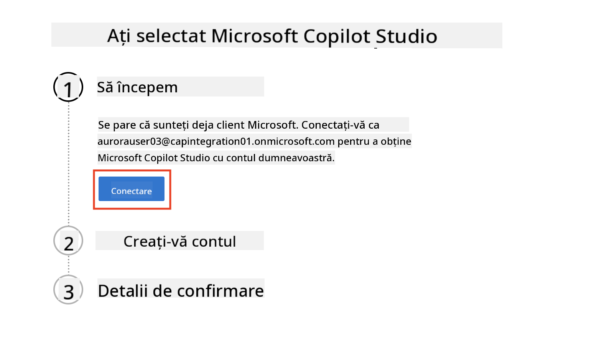  
1. Selectează `Start Free Trial`.  
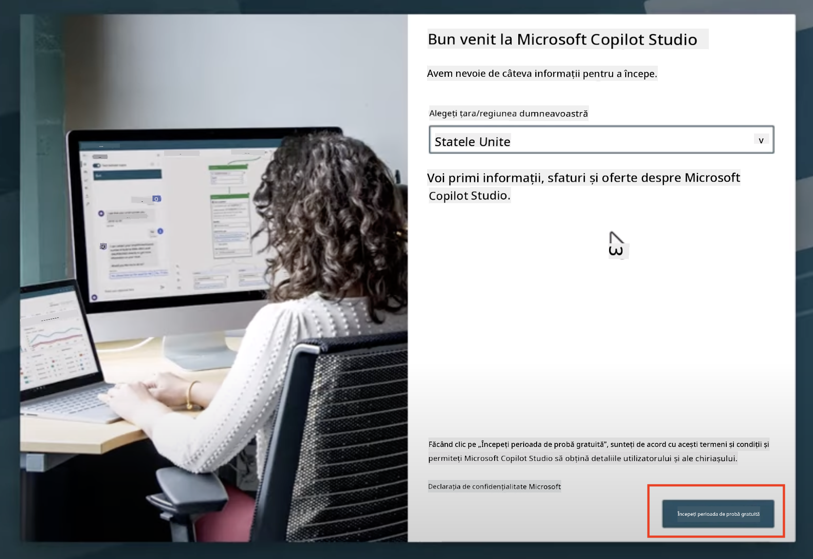

!!! info "Note despre trial"  
     1. Trial-ul gratuit oferă **toate funcționalitățile Copilot Studio**.  
     1. Vei primi notificări prin e-mail despre expirarea trial-ului. Poți extinde trial-ul în incrementuri de 30 de zile (până la 90 de zile de funcționare a agentului).  
     1. Dacă administratorul tenant-ului tău a dezactivat înscrierea automată, vei vedea o eroare—contactează administratorul Microsoft 365 pentru a o reactiva.

---

## Pasul 3: Creează un nou mediu de dezvoltare

### Înscrie-te pentru un plan de dezvoltator Power Apps

Folosind același tenant Microsoft 365 din Pasul 1, înscrie-te pentru un plan de dezvoltator Power Apps pentru a crea un mediu de dezvoltare gratuit în care să construiești și să testezi cu Copilot Studio.

1. Înscrie-te pe [site-ul planului de dezvoltator Power Apps](https://aka.ms/PowerAppsDevPlan).

    - Introdu adresa de e-mail  
    - Bifează caseta  
    - Selectează **Start free**  

    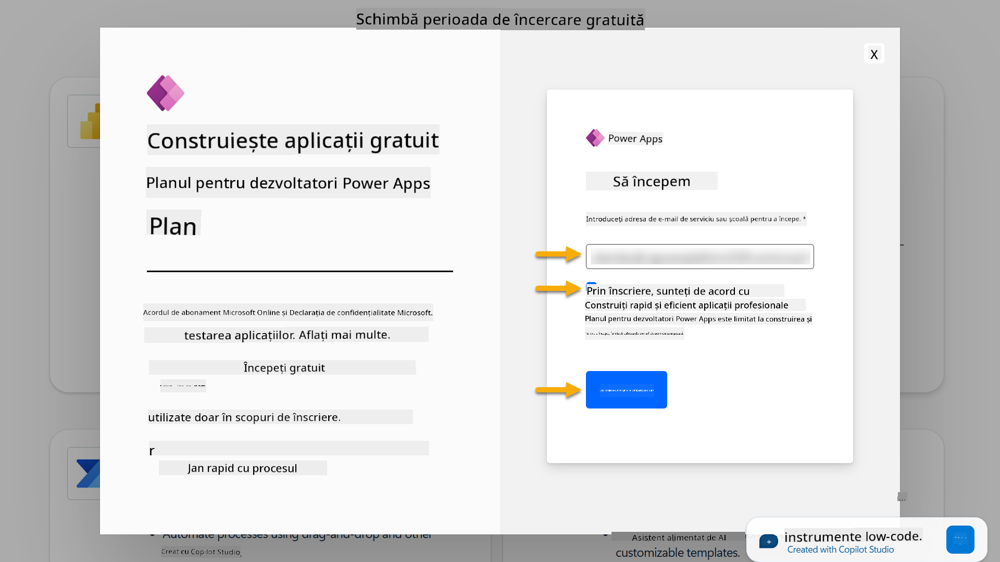

1. După ce te-ai înscris pentru planul de dezvoltator, vei fi redirecționat către [Power Apps](https://make.powerapps.com/). Mediul folosește numele tău, de exemplu **Mediul lui Adele Vance**. Dacă există deja un mediu cu acel nume, noul mediu de dezvoltator va fi numit **Mediul lui Adele Vance (1)**.

    Folosește acest mediu de dezvoltator în Copilot Studio când finalizezi laboratoarele.

!!! Note
    Dacă folosești un cont Microsoft 365 existent și nu ai creat unul în Pasul 1, de exemplu - folosești propriul cont din organizația ta, administratorul IT (sau echipa echivalentă) care gestionează tenant-ul/mediile tale ar putea să fi dezactivat procesul de înscriere. În acest caz, te rugăm să contactezi administratorul sau să creezi un tenant de test conform Pasului 1.

---

## Pasul 4: Creează un nou site SharePoint

Trebuie să creezi un nou site SharePoint care va fi utilizat în [Lecția 06 - Crearea unui agent personalizat folosind experiența de creare conversațională cu Copilot și conectarea acestuia la datele tale](../06-create-agent-from-conversation/README.md#62-add-an-internal-knowledge-source-using-a-sharepoint-site).

1. Selectează pictograma waffle din colțul stâng sus al Microsoft Copilot Studio pentru a vizualiza meniul. Selectează SharePoint din meniu.

    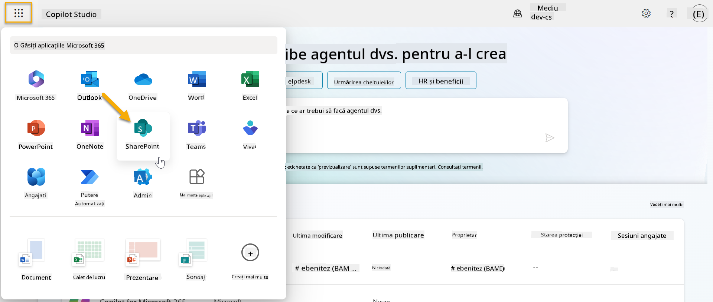

1. SharePoint se va încărca. Selectează **+ Create site** pentru a crea un nou site SharePoint.

    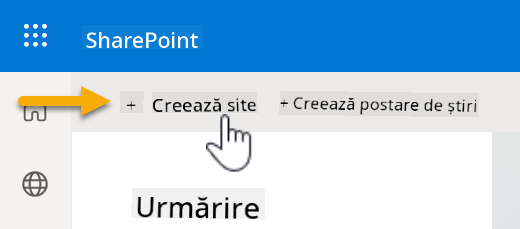

1. Va apărea o casetă de dialog care te va ghida în crearea unui nou site SharePoint. Selectează **Team site**.

    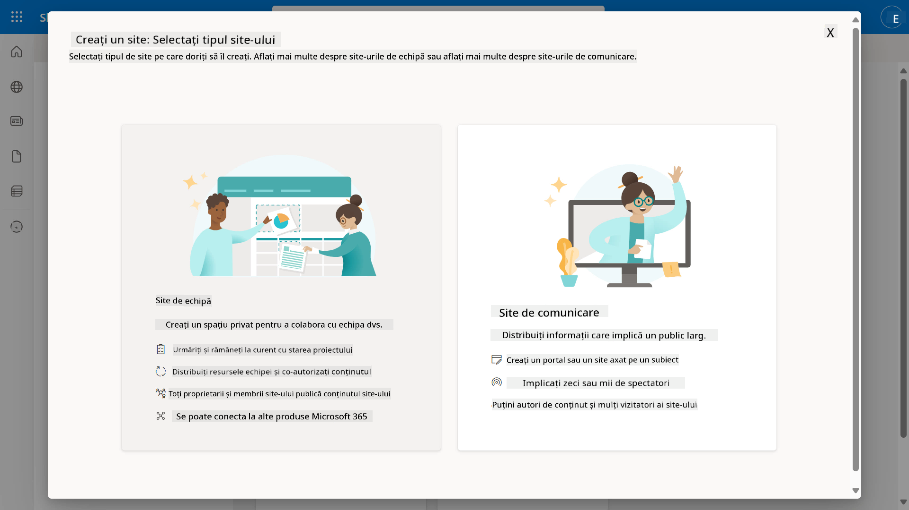

1. În pasul următor, o listă de șabloane Microsoft va fi încărcată implicit. Derulează în jos și selectează șablonul **IT help desk**.

    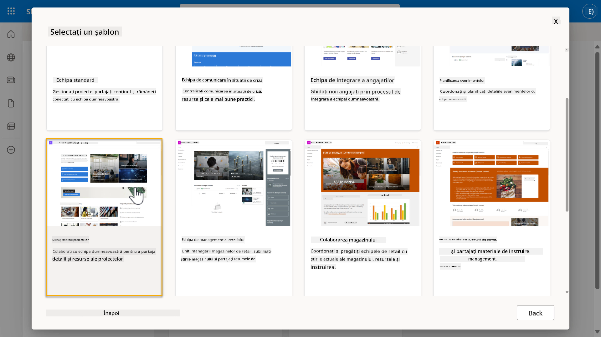

1. Selectează **Use template** pentru a crea un nou site SharePoint folosind șablonul IT help desk.

    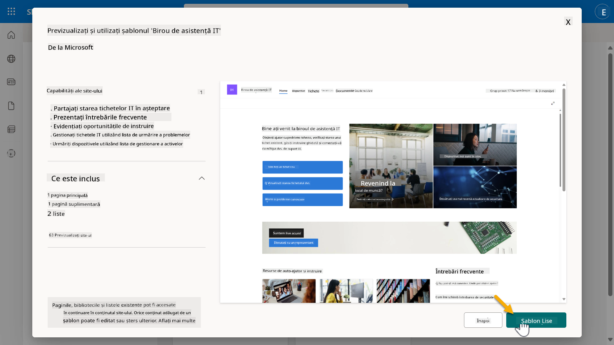

1. Introdu informațiile pentru site-ul tău. Iată un exemplu:

    | Câmp | Valoare |
    | --- | --- |
    | Nume site | Contoso IT |
    | Descriere site | Copilot Studio pentru Începători |
    | Adresă site | ContosoIT |

    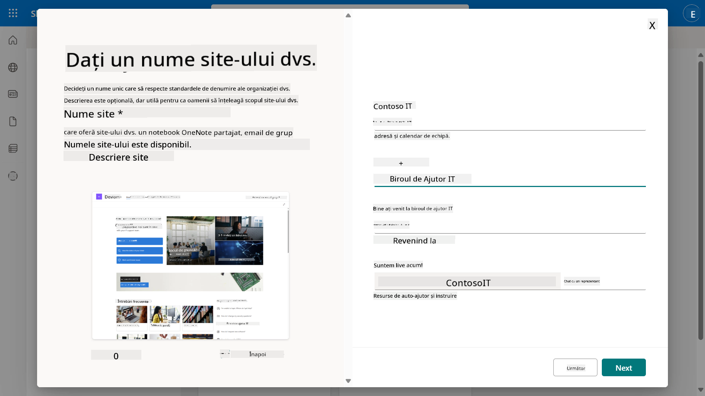

1. În pasul final, se poate selecta o limbă pentru site-ul SharePoint. Implicit va fi **Engleză**. Lasă limba ca **Engleză** și selectează **Create site**.

    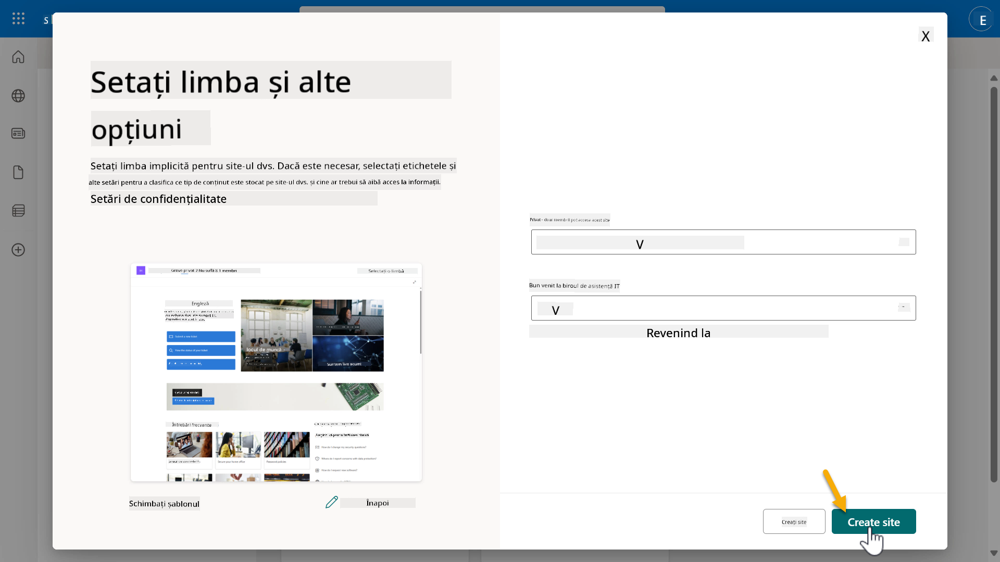

1. Site-ul SharePoint va fi configurat în câteva secunde. Între timp, poți alege să adaugi alți utilizatori pe site-ul tău introducând adresa lor de e-mail în câmpul **Add members**. După ce ai terminat, selectează **Finish**.

    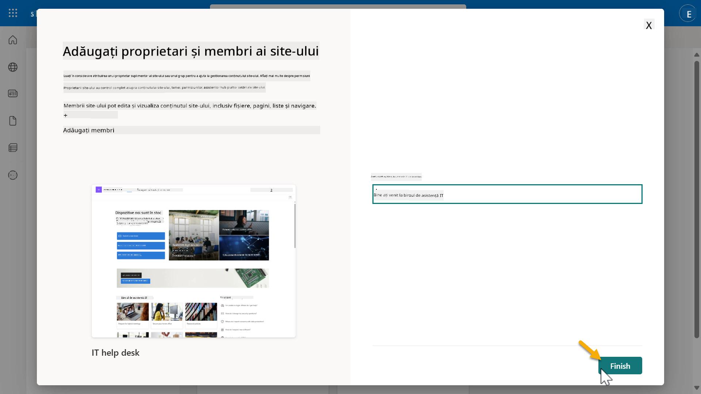

1. Pagina principală a site-ului SharePoint se va încărca. **Copiază** URL-ul site-ului SharePoint.

1. Acest șablon oferă pagini cu date de exemplu despre diverse politici IT și două liste de exemplu (Tickets și Devices).

### Folosește lista Devices din SharePoint

Vom folosi lista **Devices** în [Misiunea 07 - Adaugă un subiect nou cu declanșator și noduri](../07-add-new-topic-with-trigger/README.md#73-add-a-tool-using-a-connector).

### Adaugă o coloană nouă

Derulează până la capătul listei și selectează butonul **+ Add column**. Alege tipul **hyperlink**, introdu **Image** pentru numele coloanei și selectează adăugare.

### Creează date de exemplu în lista Devices din SharePoint

Trebuie să te asiguri că completezi această listă cu cel puțin 4 elemente de date de exemplu și să adaugi o coloană suplimentară la această listă.  

Când adaugi date de exemplu, asigură-te că următoarele câmpuri sunt completate:

- Fotografie dispozitiv - folosește imaginile din [folderul de imagini ale dispozitivelor](https://github.com/microsoft/agent-academy/tree/main/docs/recruit/00-course-setup/images/device-images)  
- Titlu  
- Stare  
- Producător  
- Model  
- Tip activ  
- Culoare  
- Număr de serie  
- Data achiziției  
- Preț achiziție  
- Număr comandă  
- Imagine - folosește următoarele linkuri  

|Dispozitiv  |URL  |
|---------|---------|
|Surface Laptop 13     | [https://raw.githubusercontent.com/microsoft/agent-academy/refs/heads/main/docs/recruit/00-course-setup/images/device-images/Surface-Laptop-13.png](https://raw.githubusercontent.com/microsoft/agent-academy/refs/heads/main/docs/recruit/00-course-setup/images/device-images/Surface-Laptop-13.png)        |
|Surface Laptop 15     | [https://raw.githubusercontent.com/microsoft/agent-academy/refs/heads/main/docs/recruit/00-course-setup/images/device-images/Surface-Laptop-15.png](https://raw.githubusercontent.com/microsoft/agent-academy/refs/heads/main/docs/recruit/00-course-setup/images/device-images/Surface-Laptop-15.png)        |
|Surface Pro    | [https://raw.githubusercontent.com/microsoft/agent-academy/refs/heads/main/docs/recruit/00-course-setup/images/device-images/Surface-Pro-12.png](https://raw.githubusercontent.com/microsoft/agent-academy/refs/heads/main/docs/recruit/00-course-setup/images/device-images/Surface-Pro-12.png)        |
|Surface Studio    | [https://raw.githubusercontent.com/microsoft/agent-academy/refs/heads/main/docs/recruit/00-course-setup/images/device-images/Surface-Studio.png](https://raw.githubusercontent.com/microsoft/agent-academy/refs/heads/main/docs/recruit/00-course-setup/images/device-images/Surface-Studio.png)        |

---

## ✅ Misiune Finalizată

Ai reușit să:

- Configurezi un mediu de dezvoltare Microsoft 365  
- Activezi trial-ul Copilot Studio  
- Creezi un site SharePoint pentru conectarea agenților  
- Populezi lista Devices pentru utilizare în misiuni viitoare  

Ești oficial pregătit să începi **antrenamentul de agent la nivel de recruți** în [Lecția 01](../01-introduction-to-agents/README.md).  

<!-- markdownlint-disable-next-line MD033 -->

---

**Declinare de responsabilitate**:  
Acest document a fost tradus folosind serviciul de traducere AI [Co-op Translator](https://github.com/Azure/co-op-translator). Deși ne străduim să asigurăm acuratețea, vă rugăm să fiți conștienți că traducerile automate pot conține erori sau inexactități. Documentul original în limba sa natală ar trebui considerat sursa autoritară. Pentru informații critice, se recomandă traducerea profesională realizată de oameni. Nu ne asumăm responsabilitatea pentru neînțelegerile sau interpretările greșite care pot apărea din utilizarea acestei traduceri.