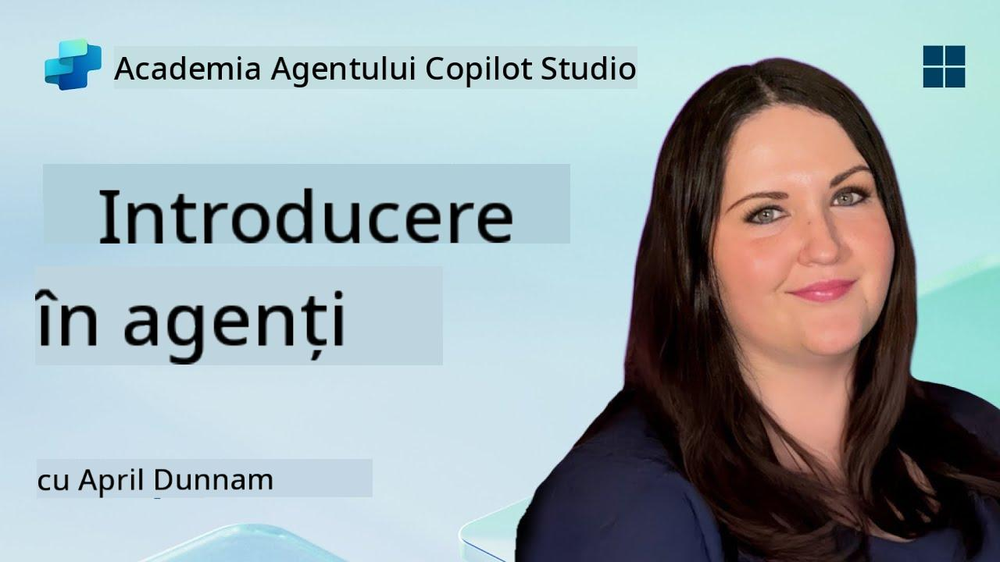

<!--
CO_OP_TRANSLATOR_METADATA:
{
  "original_hash": "d6706e107678264168d77b2e107710b1",
  "translation_date": "2025-10-20T17:46:09+00:00",
  "source_file": "docs/recruit/01-introduction-to-agents/README.md",
  "language_code": "ro"
}
-->
# 🚨 Misiunea 01: Introducere în Agenți

## 🕵️‍♂️ NUME DE COD: `OPERAȚIUNEA DECODIFICARE AGENT AI`

> **⏱️ Fereastra de Timp pentru Operațiune:** `~30 minute – doar informații, fără activitate pe teren`

🎥 **Urmărește Prezentarea**

## 🎯 Scopul Misiunii

Bine ai venit, Recruit. Înainte de a începe să construim agenți, trebuie să înțelegi bine conceptele AI care îi susțin. Această misiune îți va oferi cunoștințe fundamentale despre AI conversațional, modele de limbaj de mari dimensiuni (LLMs), generarea augmentată prin recuperare (RAG) și tipurile de agenți pe care îi poți crea în Copilot Studio.

## 🔎 Obiective

În această misiune, vei învăța:

1. Ce este AI conversațional și de ce este important  
1. Cum Modelele de Limbaj de Mari Dimensiuni (LLMs) susțin experiențele de chat  
1. Ce aduce Generarea Augmentată prin Recuperare (RAG)  
1. Diferența dintre agenții conversaționali și agenții autonomi  
1. Cum agenții din Copilot Studio utilizează aceste concepte  

Să începem!

---

## Ce Este AI Conversațional?

AI conversațional se referă la orice sistem care poate înțelege, procesa și răspunde la limbajul uman – fie text, fie vorbire – într-un mod natural. Gândește-te la chatbots din centrele de asistență sau la asistenți personali virtuali din aplicațiile tale preferate. În culise, majoritatea AI conversaționale moderne se bazează pe Modele de Limbaj de Mari Dimensiuni (LLMs), pe care le vom aborda în continuare.

### De ce Este Important

- **Experiența Utilizatorului:** Interfețele conversaționale sunt adesea mai intuitive decât navigarea prin meniuri.  
- **Scalabilitate:** Un agent poate gestiona zeci sau sute de conversații simultan.  
- **Eficiență:** În loc să construiești scripturi bazate pe reguli personalizate, agenții susținuți de LLM se adaptează din mers la inputul utilizatorului.  
- **Extensibilitate:** Cu un design potrivit, agenții pot accesa baze de cunoștințe, conecta la API-uri sau acționa ca „colegi digitali” în fluxurile de lucru ale afacerii.

---

## Modele de Limbaj de Mari Dimensiuni (LLMs) 101

La baza majorității sistemelor AI conversaționale se află **Modelele de Limbaj de Mari Dimensiuni** – rețele neuronale antrenate pe corpuri masive de text. Acestea învață modele statistice ale limbajului pentru a putea genera propoziții coerente, răspunde la întrebări sau chiar să vină cu idei. Puncte cheie de înțeles:

1. **Date de Antrenament:** LLMs consumă terabiți de text (pagini web, cărți, articole). Această „cunoaștere a lumii” le permite să răspundă pe multe subiecte.  
1. **Tokenizare:** Textul este împărțit în unități mai mici numite tokeni (cuvinte, subcuvinte sau caractere). Modelul prezice un token pe rând.  
1. **Fereastra de Context:** Fiecare LLM are o limită privind numărul de tokeni pe care îi poate „vedea” simultan. Dincolo de această limită, tokenii anteriori sunt trunchiați.  
1. **Prompting:** Interacționezi cu un LLM trimițându-i un prompt. Cu cât promptul este mai bun, cu atât răspunsul este mai concentrat și relevant.  
1. **Zero-shot vs. Fine-tuning:** Zero-shot înseamnă utilizarea unui LLM așa cum este (doar greutățile brute). Fine-tuning înseamnă ajustarea modelului pe date specifice domeniului pentru a răspunde mai precis nevoilor tale.

!!! Tip "Sfat Pro"
    O analogie comună este că un LLM este ca un „autocomplete super-inteligent.” Nu înțelege cu adevărat sensul ca un creier uman, dar este extrem de bun la prezicerea următorului cuvânt (sau frază) dintr-o secvență.

---

## Generarea Augmentată prin Recuperare (RAG)

Când LLMs se bazează doar pe datele de antrenament statice, pot genera informații eronate sau depășite. RAG abordează această problemă permițând modelului să „caute” informații proaspete înainte de a compune un răspuns. La un nivel înalt, RAG funcționează astfel:

1. **Interogarea Utilizatorului:** Un utilizator pune o întrebare (de exemplu, „Care sunt cele mai recente informații despre câștigurile trimestriale ale Contoso?”).  
1. **Pasul de Recuperare:** Sistemul interoghează o sursă de cunoștințe (documente, baze de date interne, biblioteci SharePoint etc.) pentru a găsi pasaje relevante.  
1. **Augmentare:** Pasajele recuperate sunt adăugate sau precedate înainte de promptul LLM.  
1. **Generare:** LLM consumă atât întrebarea utilizatorului, cât și contextul recuperat, apoi generează un răspuns bazat pe date actualizate.  

Cu RAG, agentul tău poate accesa wiki-uri interne ale companiei, API-uri de pluginuri sau poate căuta într-o bază de cunoștințe FAQ – și poate returna răspunsuri care nu sunt limitate la parametrii statici ai modelului publicat.

---

## Agenți Conversaționali vs. Autonomi

În contextul Copilot Studio, termenul **agent** poate face referire la mai multe tipuri de asistenți AI. Este util să facem o distincție între:

**Agenți Conversaționali:**

- Se concentrează în principal pe dialogul bidirecțional.  
- Păstrează contextul pe parcursul mai multor schimburi de conversație.  
- De obicei, sunt orchestrate prin fluxuri sau declanșatori predefiniți (de exemplu, „Dacă utilizatorul spune X, răspunde cu Y”).  
- Ideali pentru asistență clienți, FAQ-uri, interacțiuni ghidate, programări sau întrebări și răspunsuri simple.  
  - Exemple:  
    - Un chatbot Teams care răspunde la întrebări despre politica HR.  
    - Un bot Power Virtual Agents pe o pagină SharePoint care ghidează utilizatorii printr-un formular.  

**Agenți Autonomi:**

- Depășesc conversația simplă; pot **întreprinde acțiuni** în numele utilizatorului.  
- Utilizează bucle de raționament LLM (gândește-te la „planificare → acțiune → observare → replanificare”) pentru a finaliza sarcini.  
- Se conectează la instrumente externe sau API-uri (de exemplu, apelarea unui flux Power Automate, trimiterea de invitații la calendar, manipularea datelor în Dataverse).  
- Funcționează fără prompturi constante de la utilizator – odată declanșate, pot gestiona procese multi-pas autonom.  
  - Exemple:  
    - Un agent care generează un itinerar de călătorie, rezervă zboruri și trimite confirmări prin e-mail.  
    - Un agent „Rezumat al Întâlnirii” care se alătură unui apel Teams, îl transcrie în timp real și scrie un rezumat executiv în OneNote.  

!!! Info "Diferența Cheie"
    Agenții conversaționali așteaptă inputul utilizatorului și se limitează la dialog. Agenții autonomi planifică și execută proactiv o secvență de pași folosind accesul extins la instrumente.

---

## Agenți în Copilot Studio

**Copilot Studio** unifică atât scenariile conversaționale, cât și cele autonome într-un singur cadru. Iată cum te ajută Copilot Studio să construiești agenți:

1. **Designer Vizual de Agenți:** O platformă low-code pentru definirea prompturilor, memoriei și instrumentelor pentru fluxuri de lucru de chat și acțiune.  
1. **Configurații LLM:** Selectează din diverse modele OpenAI sau GPT de nivel enterprise de la Microsoft pentru a se potrivi nevoilor tale de performanță și cost.  
1. **Conectori de Recuperare:** Integrări predefinite pentru SharePoint, OneDrive, Azure Cognitive Search și Dataverse, care permit RAG din start.  
1. **Instrumente și Funcții Personalizate:** Definește acțiuni HTTP personalizate sau fluxuri Power Automate pe care agentul tău le poate invoca autonom.  
1. **Suport Multi-Modal:** Dincolo de text, agenții Copilot Studio pot consuma imagini, fișiere sau date structurate pentru a îmbogăți contextul.  
1. **Publicare și Distribuție:** După ce agentul tău este gata, îl poți publica în Microsoft 365 Copilot (astfel încât utilizatorii să-l acceseze în Teams, SharePoint, Outlook etc.) sau să-l integrezi ca un widget de chat autonom pe o pagină web.

---

## 🎉 Misiune Finalizată

Ai finalizat acum introducerea în agenți și conceptele fundamentale ale AI. Ai înțeles:

1. **LLMs = „Creierul” Agentului Tău**  
   - Responsabil pentru înțelegerea și generarea limbajului.  
   - Mai mulți tokeni = context mai bogat, dar și cost mai mare per apel.  

1. **RAG = Integrarea Cunoștințelor în Timp Real**  
   - Umple golul dintre un LLM static și sursele de date în continuă schimbare.  
   - Recuperează și injectează documente sau înregistrări relevante în promptul LLM.  

1. **Conversațional vs. Autonom**  
   - **Conversațional:** Se concentrează pe fluxul dialogului și păstrarea contextului (de exemplu, „Memoria Sesiunii”).  
   - **Autonom:** Adaugă „Blocuri de Acțiune” care permit agentului să acceseze instrumente sau servicii externe.

---
În continuare, vei explora [fundamentele Copilot Studio](../02-copilot-studio-fundamentals/README.md)!

Fii vigilent, Recruit - călătoria ta în AI abia începe!

## 📚 Resurse Tactice

🔗 [Pagina Principală a Documentației Copilot Studio](https://learn.microsoft.com/microsoft-copilot-studio/)

---

<!-- markdownlint-disable-next-line MD033 -->

---

**Declinare de responsabilitate**:  
Acest document a fost tradus folosind serviciul de traducere AI [Co-op Translator](https://github.com/Azure/co-op-translator). Deși ne străduim să asigurăm acuratețea, vă rugăm să fiți conștienți că traducerile automate pot conține erori sau inexactități. Documentul original în limba sa natală ar trebui considerat sursa autoritară. Pentru informații critice, se recomandă traducerea profesională realizată de oameni. Nu ne asumăm responsabilitatea pentru eventualele neînțelegeri sau interpretări greșite care pot apărea din utilizarea acestei traduceri.