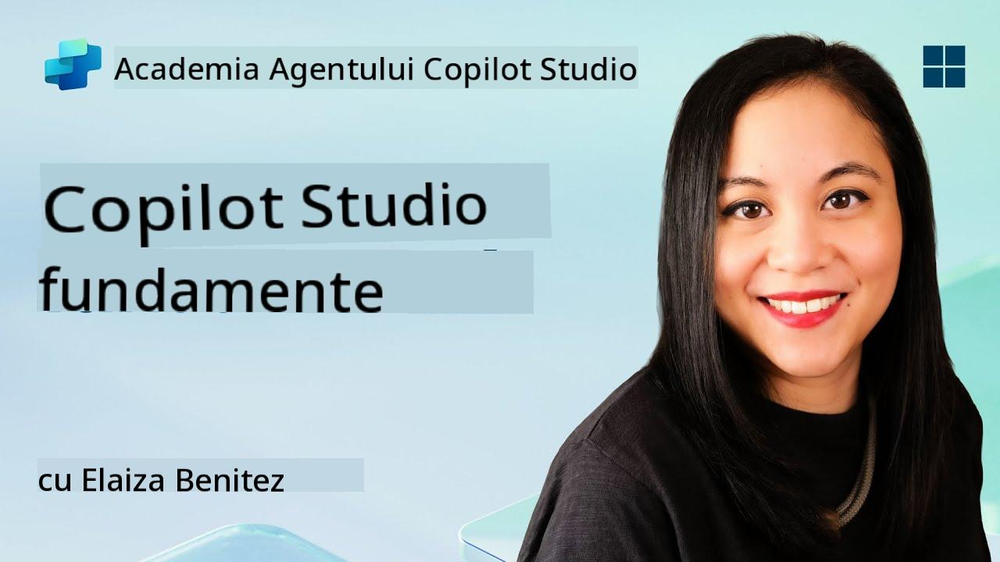
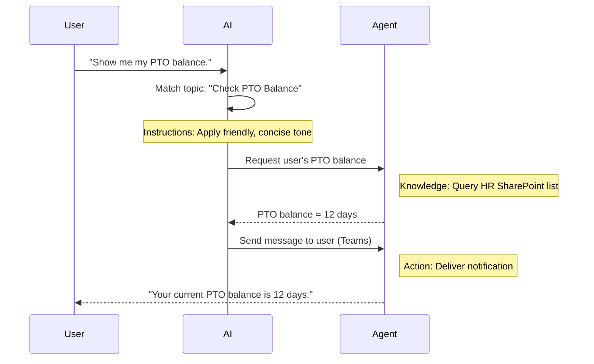

<!--
CO_OP_TRANSLATOR_METADATA:
{
  "original_hash": "90a3c5122f5687bbc8cc819990f175d4",
  "translation_date": "2025-10-20T17:47:51+00:00",
  "source_file": "docs/recruit/02-copilot-studio-fundamentals/README.md",
  "language_code": "ro"
}
-->
# 🚨 Misiunea 02: Fundamentele Copilot Studio

## 🕵️‍♂️ NUME DE COD: `OPERAȚIUNEA PROTOCOL DE BAZĂ`

> **⏱️ Fereastra de Timp pentru Operațiune:** `~30 minute – doar informații, fără activitate pe teren`  

🎥 **Urmărește Tutorialul**

[](https://www.youtube.com/watch?v=x4OCwDRGeLE "Urmărește tutorialul pe YouTube")

## 🎯 Scopul Misiunii

Bun venit, recrute. Această misiune te va echipa cu informații de bază pentru a înțelege cum funcționează Copilot Studio și cum să construiești agenți inteligenți care oferă valoare reală pentru afaceri.

Înainte de a construi primul tău agent, trebuie să înțelegi cele patru componente cheie care alcătuiesc fiecare agent AI personalizat: Cunoștințe, Instrumente, Subiecte și Instrucțiuni. Vei învăța, de asemenea, cum aceste elemente funcționează împreună în orchestratorul Copilot Studio.

## 🔎 Obiective

În această misiune, vei:

- **Afla ce este Copilot Studio**
- **Afla când și de ce să folosești agenți**
- **Explora cele patru blocuri de construcție ale agenților**
      - **Cunoștințe**
      - **Instrumente**
      - **Subiecte**
      - **Instrucțiuni**
- **Înțelege cum funcționează aceste componente împreună** pentru a crea un agent inteligent și automatizat

---

## Ce sunt agenții în Copilot Studio?

Un **agent** este un asistent AI specializat pe care îl proiectezi pentru a gestiona sarcini sau întrebări specifice. Spre deosebire de un chatbot generalist, agentul tău:

- **Cunoaște datele specifice companiei** (politici, documente, baze de date)  
- **Realizează sarcini reale** (trimite mesaje, creează evenimente în calendar, actualizează înregistrări)  
- **Menține contextul conversațional** astfel încât să poată continua de la întrebările anterioare  

Deoarece Copilot Studio este low-code, poți trage și plasa componente predefinite—nu sunt necesare cunoștințe avansate de programare. Odată ce agentul este construit, oamenii îl pot utiliza în Teams, Slack sau chiar pe o pagină web personalizată pentru a obține răspunsuri sau a declanșa fluxuri de lucru automat.

---

## Când și de ce să folosești Copilot Studio

În timp ce Microsoft 365 Copilot oferă asistență AI generală în aplicațiile Office, vei dori un agent personalizat atunci când:

### Ai nevoie de cunoștințe specifice domeniului

- Copilot standard s-ar putea să nu cunoască procedurile interne sau datele companiei tale. Un agent poate interoga site-urile SharePoint, bazele de date sau sursele personalizate pentru a oferi răspunsuri precise și actualizate.  

### Vrei să automatizezi fluxuri de lucru complexe

- De exemplu: "Când cineva depune o cheltuială, trimite-o pentru aprobare, actualizează tracker-ul financiar și notifică managerul." Un agent personalizat poate gestiona fiecare pas, declanșat de o singură comandă sau eveniment.  

### Ai nevoie de o experiență contextuală, integrată în instrument

- Imaginează-ți un agent de Onboarding pentru Angajați Noi în Teams care ghidează personalul HR prin fiecare politică, trimite formularele necesare și programează întâlnirile de orientare—direct în platforma ta de colaborare existentă.  

---

## Cele patru blocuri de construcție ale unui agent

Fiecare agent Copilot Studio este construit din patru componente de bază:

1. **Cunoștințe**  
1. **Instrumente (Acțiuni)**  
1. **Subiecte**  
1. **Instrucțiuni**

Mai jos, vom defini fiecare bloc de construcție și vom arăta cum funcționează împreună pentru a crea un agent eficient.

### 1. Cunoștințe

**Cunoștințele** reprezintă datele și contextul pe care agentul le folosește pentru a răspunde întrebărilor cu acuratețe. Acestea au două părți:

#### Instrucțiuni Personalizate & Context

- Scrii o descriere scurtă a scopului și tonului agentului. De exemplu:  

    ```text
    You are an IT support agent. You help employees troubleshoot common software issues, provide troubleshooting steps, and escalate urgent tickets.
    ```

- În timpul unei conversații, agentul își amintește întoarcerile anterioare astfel încât să poată face referire la ceea ce s-a discutat deja (de exemplu, dacă utilizatorul spune mai întâi, "Imprimanta mea este offline," apoi întreabă, "Ai verificat nivelul de cerneală?" agentul își amintește contextul imprimantei).

#### Surse de Cunoștințe (Date de Bază)

- Conectezi agentul la mai multe surse de date—biblioteci SharePoint, site-uri de documentație, wiki-uri sau alte baze de date.  
- Când un utilizator pune o întrebare, agentul extrage fragmente relevante din acele surse astfel încât răspunsurile să fie **fundamentate** pe politicile, manualele de produse sau orice informații proprietare ale organizației tale.  
- Poți chiar să forțezi agentul să răspundă doar cu informații din acele surse, prevenind ghicitul sau "halucinațiile" răspunsurilor.

!!! example
    Un agent "Asistent Politici" ar putea fi conectat la site-ul HR SharePoint. Dacă un utilizator întreabă, "Care este rata noastră de acumulare PTO?" agentul va prelua textul exact din documentul politicii HR, în loc să se bazeze pe un răspuns generic AI.

---

### 2. Instrumente (Acțiuni)

**Instrumentele (Acțiunile)** definesc ceea ce agentul poate face dincolo de conversație. Fiecare acțiune este o sarcină pe care agentul o execută programatic, cum ar fi:

- Trimiterea unui e-mail sau mesaj Teams  
- Crearea sau actualizarea unui eveniment în calendar  
- Adăugarea sau editarea unei înregistrări într-o bază de date (de exemplu, o listă SharePoint sau un tabel Dataverse)  
- Apelarea unui flux Power Automate sau a unui API REST  

#### Cum funcționează acțiunile

- **Definirea Intrărilor & Ieșirilor**  
      - De exemplu, o acțiune de Trimitere E-mail ar putea necesita:  
        - `AdresaDeEmailDestinatar`  
        - `Subiect`  
        - `CorpEmail`  

- **Combinarea Acțiunilor în Fluxuri de Lucru**  
      - Adesea, îndeplinirea unei cereri a utilizatorului implică mai mulți pași.  
      - Poți secvențializa acțiunile astfel încât:  
             1. Agentul să preia date dintr-o listă SharePoint.  
             2. Să genereze un rezumat folosind LLM.  
             3. Să trimită un mesaj Teams cu acel rezumat.  

- **Conectarea la Sisteme Externe**  
      - Dacă trebuie să actualizezi un CRM sau să apelezi un API intern, creează o acțiune personalizată pentru a gestiona acest lucru.  
      - Copilot Studio se poate integra cu Power Platform sau orice endpoint bazat pe HTTP.

!!! example "Un agent "Ajutor Cheltuieli" ar putea:"  
    1. Asculta o cerere "Depune Cheltuială".  
    2. Prelua detaliile cheltuielii utilizatorului dintr-un formular.  
    3. Folosi o acțiune "Adaugă în Lista SharePoint" pentru a stoca datele.  
    4. Declanșa o acțiune "Trimite E-mail" pentru a notifica aprobatorul.  

---

### 3. Subiecte

**Subiectele** definesc declanșatorii conversaționali sau punctele de intrare pentru agentul tău. Fiecare subiect corespunde unei funcționalități sau unei categorii de întrebări.

#### Declanșatori Conversaționali  

- Un subiect ar putea fi "Depune Ticket IT," "Verifică Soldul de Vacanță," sau "Creează Raport de Vânzări."  
- În culise, Copilot Studio folosește **orchestrare generativă**: în loc să se bazeze pe cuvinte-cheie exacte, AI interpretează intenția utilizatorului și alege subiectul potrivit pe baza unei descrieri scurte pe care o oferi.  

#### Descrieri ale Subiectelor  

- În fiecare subiect, scrii o descriere clară și concisă a ceea ce acoperă acel subiect.

!!! example "Exemplu de descriere a subiectului"
    Acest subiect ajută utilizatorii să depună un ticket de suport IT prin colectarea detaliilor problemei, priorității și informațiilor de contact.

- AI folosește acea descriere pentru a decide când să activeze acest subiect, chiar dacă formularea utilizatorului nu se potrivește exact.

#### Maparea Subiectelor la Acțiuni  

- Fiecare subiect este conectat la una sau mai multe acțiuni sau pași de recuperare a datelor.  
- Când AI alege un subiect, ghidează conversația prin secvența pe care ai definit-o (pune întrebări suplimentare, apelează acțiuni, returnează rezultate).

!!! example
    Dacă un utilizator spune, "Am nevoie de ajutor pentru configurarea laptopului meu nou," AI ar putea asocia acea intenție cu subiectul "Depune Ticket IT." Agentul apoi solicită modelul laptopului, detaliile utilizatorului și trimite automat un ticket în sistemul de asistență.

---

### 4. Instrucțiuni

**Instrucțiunile** (uneori numite "Prompturi" sau "Mesaje de Sistem") ghidează tonul, stilul și limitele LLM. Ele modelează modul în care agentul răspunde în orice situație.

#### Rol & Personalitate  

- Spui AI cine este (de exemplu, "Ești un agent de servicii pentru clienți pentru Contoso Retail").  
- Acest lucru setează tonul—prietenos, concis, formal sau casual—în funcție de cazul tău de utilizare.

#### Ghiduri de Răspuns  

- Specifici orice reguli pe care agentul trebuie să le urmeze, cum ar fi:  
      - "Rezumați întotdeauna informațiile despre politici în puncte."  
      - "Dacă nu știi răspunsul, spune ‘Îmi pare rău, nu am acea informație.’"  
      - "Nu includeți niciodată date confidențiale în afara contextului."

#### Reguli de Memorie & Context

- Poți instrui agentul câte întoarceri de conversație să-și amintească.  
- De exemplu: "Amintește-ți detaliile cererilor acestui utilizator pentru până la trei întrebări suplimentare."

!!! example "Într-un agent "Consilier Beneficii," ai putea include:"
    "Faceți întotdeauna referire la cel mai recent manual HR când răspundeți la întrebări. Dacă vi se cere despre termenele de înscriere, furnizați datele specifice din politică. Mențineți răspunsurile sub 150 de cuvinte."

---

## Cum funcționează cele patru blocuri de construcție împreună

Când asamblezi **Cunoștințele**, **Instrumentele**, **Subiectele** și **Instrucțiunile**, orchestratorul AI al Copilot Studio creează un agent care:

1. **Ascultă pentru un Subiect relevant** (ghidat de descrierile subiectelor tale).  
1. **Aplică Instrucțiuni** pentru a seta tonul, a decide când să pună întrebări suplimentare și a impune reguli.  
1. **Folosește Surse de Cunoștințe** pentru a fundamenta răspunsurile în datele organizației tale.  
1. **Apelează Instrumente (Acțiuni)** după cum este necesar pentru a realiza sarcini—trimiterea de mesaje, actualizarea înregistrărilor sau invocarea API-urilor.  

În culise, orchestratorul folosește o abordare **planificare generativă**: decide ce pași să urmeze, în ce ordine, pentru a îndeplini o cerere a utilizatorului. Dacă o acțiune eșuează (de exemplu, un e-mail nu poate fi trimis), agentul urmează ghidurile tale de gestionare a excepțiilor (pune o întrebare clarificatoare sau raportează eroarea). Deoarece LLM se adaptează contextului conversațional, agentul poate menține memoria pe parcursul mai multor întoarceri și poate încorpora informații noi pe măsură ce conversația evoluează.

**Exemplu de Flux Vizual:**  
<!--
1. **Utilizator:** "Arată-mi soldul meu PTO."
1. **AI (Subiecte):** Asociază subiectul "Verifică Soldul PTO".  
1. **AI (Instrucțiuni):** Folosește un ton prietenos, concis.  
1. **Agent (Cunoștințe):** Interoghează lista HR SharePoint pentru soldul utilizatorului.  
1. **Agent (Acțiuni):** Recuperează valoarea și trimite un mesaj Teams:  
   > "Soldul tău PTO actual este de 12 zile."  
-->



---

## 🎉 Misiune Finalizată

Ai finalizat cu succes briefing-ul de bază. Acum ai învățat cele patru blocuri esențiale ale oricărui agent din Copilot Studio:

1. **Cunoștințe** – De unde agentul caută informații factuale și menține memoria conversației.  
1. **Instrumente** – Sarcinile pe care agentul le poate îndeplini pentru a automatiza procesele.  
1. **Subiecte** – Cum agentul recunoaște intenția utilizatorului și decide ce flux de lucru să ruleze.  
1. **Instrucțiuni** – Regulile, tonul și limitele care ghidează fiecare răspuns.

Cu aceste componente în loc, poți construi un agent de bază care răspunde la întrebări și execută fluxuri de lucru simple. În lecția următoare, vom parcurge un tutorial pas cu pas pentru a crea un agent "Service Desk"—de la conectarea primei surse de cunoștințe până la definirea unui subiect și configurarea unei acțiuni.

Urmează: Vei construi [primul tău agent declarativ pentru M365 Copilot](../03-create-a-declarative-agent-for-M365Copilot/README.md).

<!-- markdownlint-disable-next-line MD033 -->


---

**Declinare de responsabilitate**:  
Acest document a fost tradus folosind serviciul de traducere AI [Co-op Translator](https://github.com/Azure/co-op-translator). Deși ne străduim să asigurăm acuratețea, vă rugăm să fiți conștienți că traducerile automate pot conține erori sau inexactități. Documentul original în limba sa maternă ar trebui considerat sursa autoritară. Pentru informații critice, se recomandă traducerea profesională realizată de oameni. Nu ne asumăm responsabilitatea pentru eventualele neînțelegeri sau interpretări greșite care pot apărea din utilizarea acestei traduceri.