<!--
CO_OP_TRANSLATOR_METADATA:
{
  "original_hash": "0c51aabca81d6256990caf4c015e6195",
  "translation_date": "2025-10-20T17:33:58+00:00",
  "source_file": "docs/recruit/04-creating-a-solution/README.md",
  "language_code": "ro"
}
-->
# 🚨 Misiunea 04: Crearea unei Soluții pentru Agentul Tău

## 🕵️‍♂️ NUME DE COD: `OPERAȚIUNEA CTRL-ALT-PACHET`

> **⏱️ Fereastra de timp pentru operațiune:** `~45 minute`

🎥 **Urmărește Tutorialul**

[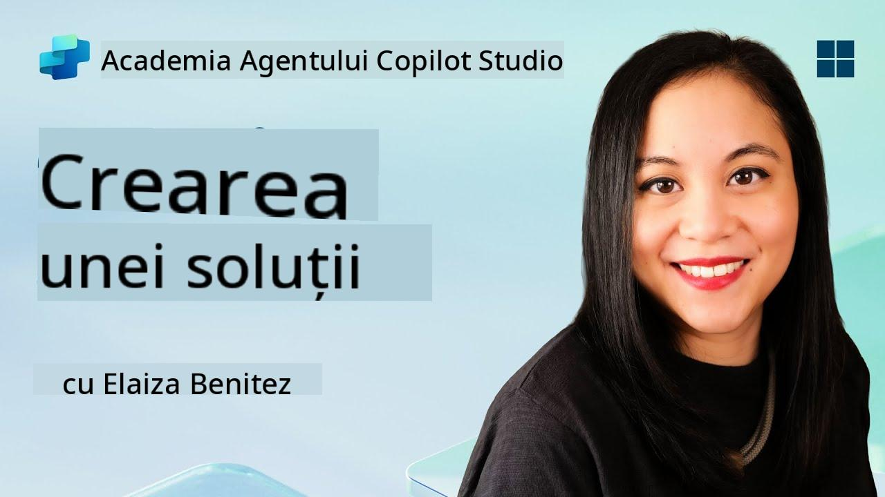](https://www.youtube.com/watch?v=1iATbkgfcpU "Urmărește tutorialul pe YouTube")

## 🎯 Scopul Misiunii

Creator de Agenți, bine ai venit la următoarea ta operațiune tactică. În această misiune, vei învăța să asamblezi o Soluție - vehiculul oficial de implementare pentru Agentul tău de Helpdesk IT construit cu Microsoft Copilot Studio. Gândește-te la aceasta ca la crearea unei serviete digitale care conține agentul tău și artefactele acestuia.

Fiecare agent are nevoie de o casă bine organizată. Asta oferă o soluție Power Platform - ordine, portabilitate și pregătire pentru producție.

Să împachetăm.

## 🔎 Obiective

În această misiune, vei învăța:

1. Ce sunt soluțiile Power Platform și rolul lor în dezvoltarea agenților
1. Beneficiile utilizării soluțiilor pentru organizarea și implementarea agenților
1. Explorarea editorilor de soluții și importanța lor în gestionarea componentelor
1. Înțelegerea ciclului de viață al soluțiilor Power Platform, de la dezvoltare la producție
1. Crearea propriului editor de soluții și a unei soluții personalizate pentru Agentul tău de Helpdesk IT

## 🕵🏻‍♀️ Soluție? Ce este asta?

În Microsoft Power Platform, soluțiile sunt ca niște containere sau pachete care conțin toate părțile aplicațiilor sau agenților tăi - acestea pot fi tabele, formulare, fluxuri și logică personalizată. Soluțiile sunt esențiale pentru Managementul Ciclului de Viață al Aplicațiilor (ALM), permițându-ți să gestionezi aplicația și agenții de la idee la dezvoltare, testare, implementare și actualizări.

În Copilot Studio, fiecare agent pe care îl creezi este stocat într-o soluție Power Platform. În mod implicit, agenții sunt creați în soluția Default, cu excepția cazului în care creezi o nouă soluție personalizată pentru a-ți crea agentul. Asta vom învăța 🤓 în această lecție și în laboratorul practic.

Soluțiile au fost create tradițional în **portalul de creație Power Apps** - o interfață web unde poți construi și personaliza aplicații, Dataverse, fluxuri, explora componente AI și multe altele.

   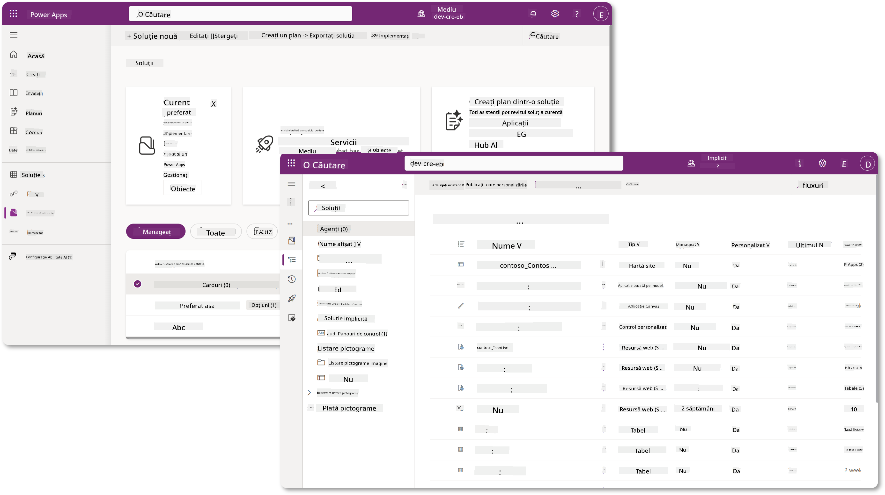

În Copilot Studio, există acum **Solution Explorer**, unde poți gestiona soluțiile direct. Nu mai este nevoie să treci la portalul de creație Power Apps pentru a gestiona soluțiile, totul se poate face direct în Copilot Studio 🪄

Asta înseamnă că poți face sarcinile obișnuite legate de soluții:

- **Crearea unei soluții** - soluțiile personalizate permit agenților să fie exportați și importați între medii.
- **Setarea soluției preferate** - alegerea soluției în care agenții, aplicațiile etc. vor fi create implicit.
- **Adăugarea sau eliminarea componentelor** - agentul tău poate face referire la alte componente, cum ar fi variabilele de mediu sau fluxurile cloud. Prin urmare, aceste componente trebuie incluse în soluție.
- **Exportul soluțiilor** - pentru a muta soluțiile într-un alt mediu țintă.
- **Importul soluțiilor** - importul soluțiilor create în altă parte, inclusiv actualizarea sau îmbunătățirea soluțiilor.
- **Crearea și gestionarea conductelor de soluții** - automatizarea implementării soluțiilor între medii.
- **Integrarea cu Git** - permite dezvoltatorilor să conecteze soluțiile cu depozitele Git pentru controlul versiunilor, colaborare și ALM. Destinat să fie utilizat doar în medii de dezvoltare.

   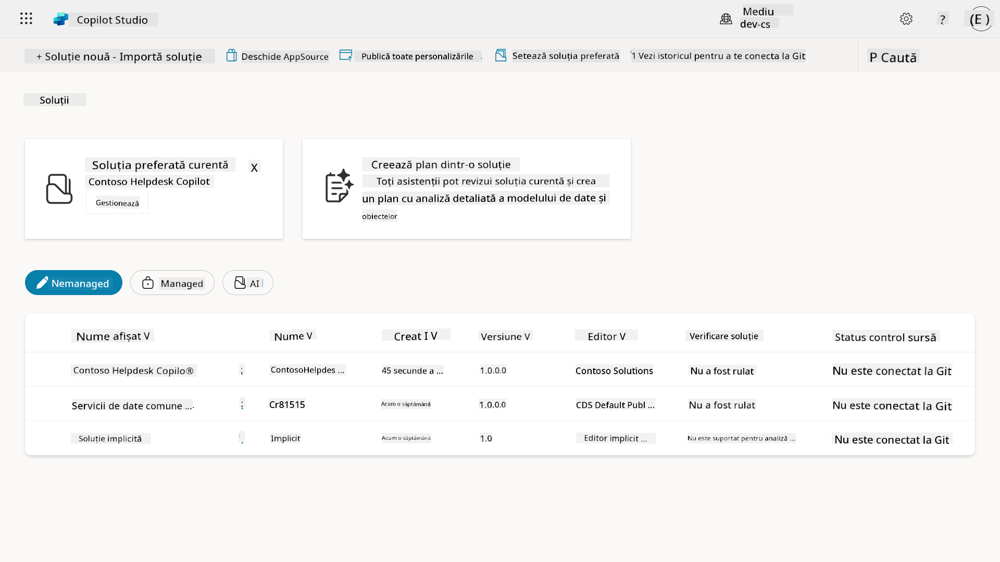

Există două tipuri de soluții:

- **Soluții neadministrate** - utilizate în timpul dezvoltării. Poți edita și personaliza liber, după cum este necesar.
- **Soluții administrate** - utilizate atunci când ești gata să implementezi aplicația pentru testare sau producție. Acestea sunt blocate pentru a preveni modificările accidentale.

## 🤔 De ce _ar trebui_ să folosesc o Soluție pentru agentul meu?

Gândește-te la Soluții ca la o _trusă de scule_. Când ai nevoie să repari sau să construiești ceva (un agent) într-o locație diferită (mediu), aduni toate instrumentele necesare (componentele) și le pui în trusa ta de scule (Soluție). Apoi poți transporta această trusă în noua locație (mediu) și folosi instrumentele (componentele) pentru a-ți finaliza munca sau pentru a adăuga noi instrumente (componente) pentru a personaliza agentul sau proiectul pe care îl construiești.

!!! quote "Elaiza, avocatul tău prietenos al cloud-ului, intervine aici 🙋🏻‍♀️ pentru a împărtăși câteva cuvinte:"
    Avem o vorbă în Noua Zeelandă, "Fii un Kiwi ordonat!" care este un îndemn pentru neozeelandezi 🥝 să își asume responsabilitatea pentru mediul lor, aruncând gunoiul în mod corespunzător și păstrând spațiile publice curate. Putem folosi același context pentru agenți, păstrând tot ce ține de agentul tău organizat și portabil, ceea ce te va ajuta să menții un mediu ordonat.

Este o practică bună să creezi un agent într-o soluție dedicată în mediul sursă (de dezvoltare). Iată de ce soluțiile sunt valoroase:

🧩 **Dezvoltare organizată**

- Îți păstrezi agentul separat de soluția Default, care conține totul în mediu. Toate componentele agentului tău sunt într-un singur loc 🎯

- Tot ce ai nevoie pentru agentul tău este într-o soluție, ceea ce face mai ușor exportul și importul într-un mediu țintă 👉🏻 acesta este un obicei sănătos pentru ALM.

🧩 **Implementare sigură**

- Poți exporta aplicația sau agentul tău ca soluție administrată și să o implementezi în alte medii țintă (cum ar fi testarea sau producția) fără riscul modificărilor accidentale.

🧩 **Controlul versiunilor**

- Poți crea patch-uri (fixări țintite), actualizări (o schimbare mai amplă) sau upgrade-uri (înlocuirea unei soluții - de obicei schimbări majore și introducerea de noi funcționalități).

- Te ajută să implementezi modificările într-un mod controlat.

🧩 **Gestionarea dependențelor**

- Soluțiile urmăresc ce părți depind de altele. Acest lucru te împiedică să strici lucrurile atunci când faci modificări.

🧩 **Colaborare în echipă**

- Dezvoltatorii și creatorii pot lucra împreună folosind soluții neadministrate în dezvoltare, apoi să predea o soluție administrată pentru implementare.

## 🪪 Înțelegerea Editorilor de Soluții

Un Editor de Soluții în Power Platform este ca o etichetă sau un brand care identifică cine a creat sau deține o soluție. Este o parte mică, dar importantă, a gestionării aplicațiilor, agenților și personalizărilor fluxurilor, mai ales când lucrezi în echipă sau între medii.

Când creezi o soluție, trebuie să alegi un editor. Acest editor definește:

- Un prefix care se adaugă tuturor componentelor personalizate (cum ar fi tabele, câmpuri și fluxuri).

- Un nume și informații de contact pentru organizația sau persoana care deține soluția.

### 🤔 De ce este important?

1. **Identificare ușoară** - prefixul (Exemplu - `new_` sau `abc_`) te ajută să identifici rapid ce componente aparțin cărei soluții sau echipe.

1. **Evitarea conflictelor** - dacă două echipe creează o coloană numită status, prefixele lor (`teamA_status`, `teamB_status`) previn coliziunile de nume.

1. **Sprijină ALM** - când muți soluțiile între medii (Dezvoltare → Testare → Producție), editorul ajută la urmărirea proprietății și menținerea consistenței.

### ✨ Exemplu

Să presupunem că creezi un editor numit Contoso Solutions cu prefixul `cts_`.

Dacă adaugi o coloană personalizată numită _Prioritate_, aceasta va fi stocată ca `cts_Prioritate` în soluție.

Oricine întâlnește coloana la nivel de soluție, indiferent de mediu, poate identifica cu ușurință că este o coloană asociată cu Contoso Solutions.

## 🧭 Ciclul de viață al soluțiilor Power Platform

Acum că ai înțeles scopul unei Soluții, să învățăm despre ciclul de viață.

**1. Creează Soluția în mediul de Dezvoltare** - începe prin crearea unei soluții noi în mediul tău de Dezvoltare.

**2. Adaugă Componente** - adaugă aplicații, fluxuri, tabele și alte elemente în soluția ta.

**3. Exportă ca soluție Administrată** - împachetează soluția pentru implementare prin exportarea ei ca soluție Administrată.

**4. Importă în mediul de Testare** - testează soluția într-un mediu de Testare separat pentru a te asigura că totul funcționează conform așteptărilor.

**5. Importă în mediul de Producție** - implementează soluția testată în mediul tău live de Producție.

**6. Aplică Patch-uri, Actualizări sau Upgrade-uri** - adu îmbunătățiri sau corecții folosind patch-uri, actualizări sau upgrade-uri. 🔁 Repetă ciclul!

### ✨ Exemplu

Imaginează-ți că construiești un agent de helpdesk IT pentru a ajuta angajații cu probleme precum probleme de dispozitive, depanarea rețelei, configurarea imprimantei și altele.

- Începi într-un mediu de Dezvoltare folosind o soluție neadministrată.

- Odată ce este gata, o exporți ca soluție administrată și o imporți într-un mediu țintă, cum ar fi un mediu de Testare Sistem sau Testare Acceptare Utilizator (UAT).

- După testare, o muți în mediul de Producție - totul fără a atinge versiunea originală de dezvoltare.

## 🧪 Laboratorul 04: Creează o nouă Soluție

Acum vom învăța

- [4.1 Cum să creezi un editor de Soluții](../../../../../docs/recruit/04-creating-a-solution)
- [4.2 Cum să creezi o Soluție](../../../../../docs/recruit/04-creating-a-solution)

Vom rămâne la exemplul de mai devreme, unde vom crea o soluție în mediul dedicat Copilot Studio pentru a construi agentul nostru de helpdesk IT.

Să începem!

### Cerințe preliminare

#### Rol de securitate

În Copilot Studio, ceea ce _poți face_ în Solution Explorer depinde de rolul tău de securitate al utilizatorului.
Dacă nu ai permisiunea de a gestiona soluțiile în centrul de administrare Power Apps, nu vei putea efectua aceste sarcini nici în Copilot Studio.

Pentru a te asigura că totul funcționează fără probleme, verifică dacă ai rolurile și permisiunile de securitate corespunzătoare. Sau, dacă nu gestionezi mediile în organizația ta, cere echipei de administratori IT (sau echivalentul) care gestionează tenant-ul/mediile.

Următoarele sunt rolurile de securitate care permit utilizatorilor să creeze o soluție în mediul lor.

| Rol de securitate    | Descriere |
| ---------- | ---------- |
| Creator de Mediu | Oferă permisiunile necesare pentru a crea, personaliza și gestiona resursele într-un mediu specific, inclusiv soluții  |
| Personalizator de Sistem  | Permisiuni mai largi decât Creator de Mediu, inclusiv capacitatea de a personaliza mediul și de a gestiona rolurile de securitate |
| Administrator de Sistem   | Cel mai înalt nivel de permisiuni și poate gestiona toate aspectele mediului, inclusiv crearea și atribuirea rolurilor de securitate     |

#### Mediu de dezvoltare

Asigură-te că te-ai mutat în mediul tău dedicat de dezvoltare, consultă [Lecția 00 - Configurarea cursului - Pasul 3: Creează un nou dezvoltator](../00-course-setup/README.md#step-3-create-new-developer-environment).

1. În partea dreaptă sus, selectează pictograma **Roată dințată** și schimbă mediul implicit în mediul tău, de exemplu **Mediul lui Adele Vance**.

    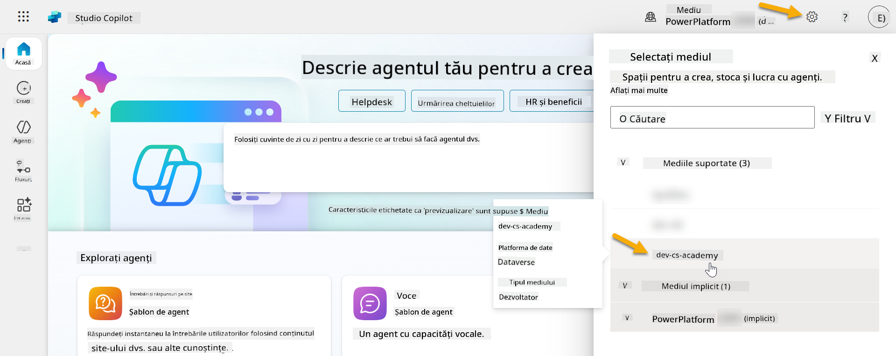

### 4.1 Creează un editor de Soluții

1. Folosind același mediu Copilot Studio utilizat în lecția anterioară, selectează pictograma **trei puncte (. . .)** din meniul din partea stângă a Copilot Studio. Selectează **Soluții** sub antetul **Explorează**.

    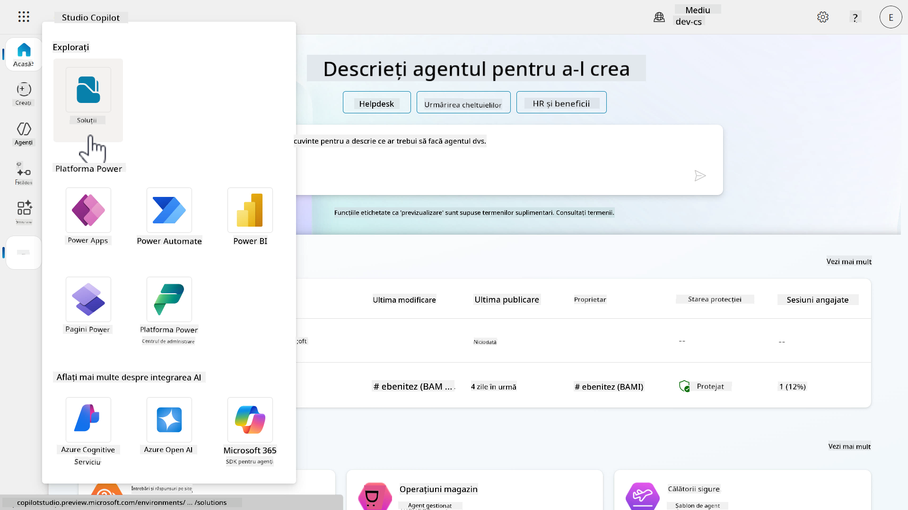

1. **Solution Explorer** din Copilot Studio se va încărca. Selectează **+ Soluție nouă**

    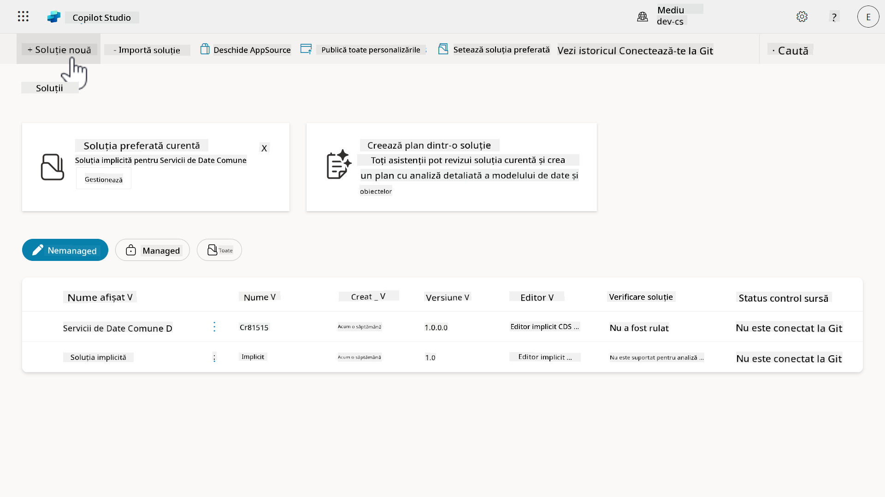

1. Panoul **Soluție nouă** va apărea, unde putem defini detaliile soluției noastre. Mai întâi, trebuie să creăm un editor nou. Selectează **+ Editor nou**.

    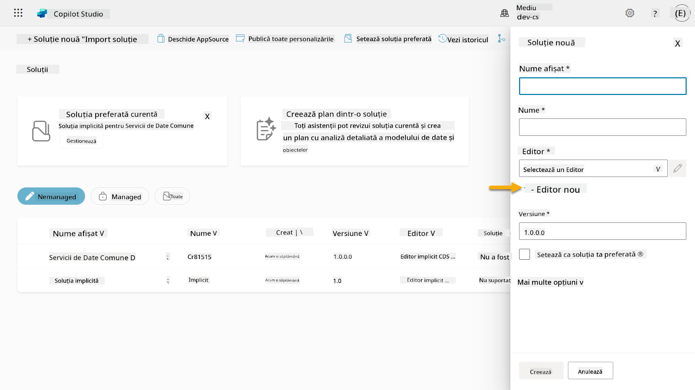  

1. Va apărea fila **Proprietăți** a panoului **Editor nou**, cu câmpuri obligatorii și opționale care trebuie completate în fila **Proprietăți**. Aici putem contura detaliile editorului, care va fi utilizat ca etichetă sau brand ce identifică cine a creat sau deține soluția.

    | Proprietate    | Descriere | Obligatoriu |
    | ---------- | ---------- | :----------: |
    | Nume afișat | Numele afișat pentru editor | Da   |
    | Nume  | Numele unic și numele schema pentru editor  | Da    |
    | Descriere   | Conturează scopul soluției    | Nu     |
    | Prefix    | Prefixul editorului care va fi aplicat componentelor nou create   | Da      |
    | Prefix valoare opțiune   | Generează un număr bazat pe prefixul editorului. Acest număr este utilizat atunci când adaugi opțiuni la alegeri și oferă un indicator al soluției utilizate pentru a adăuga opțiunea.   | Da      |

    Copiază și lipește următoarele ca **Nume afișat**,

    ```text
    Contoso Solutions
    ```

    Copiază și lipește următoarele ca **Nume**,

    ```text
    ContosoSolutions
    ```

    Copiază și lipește următoarele ca **Descriere**,

    ```text
    Copilot Studio Agent Academy
    ```

    Copiază și lipește următoarele pentru **Prefix**,

    ```text
    cts
    ```

    În mod implicit, prefixul **Valoare opțiune** va afișa o valoare întreagă. Actualizează această valoare întreagă la cea mai apropiată mie. De exemplu, în captura mea de ecran de mai jos, inițial era `77074`. Actualizează aceasta de la `77074` la `77000`.

    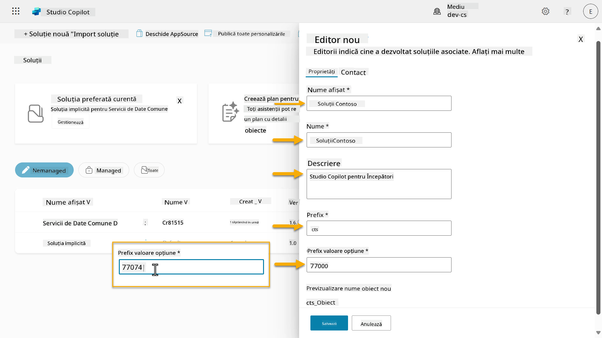  

1. Dacă dorești să oferi detalii de contact pentru Soluție, selectează fila **Contact** și completează coloanele afișate.

    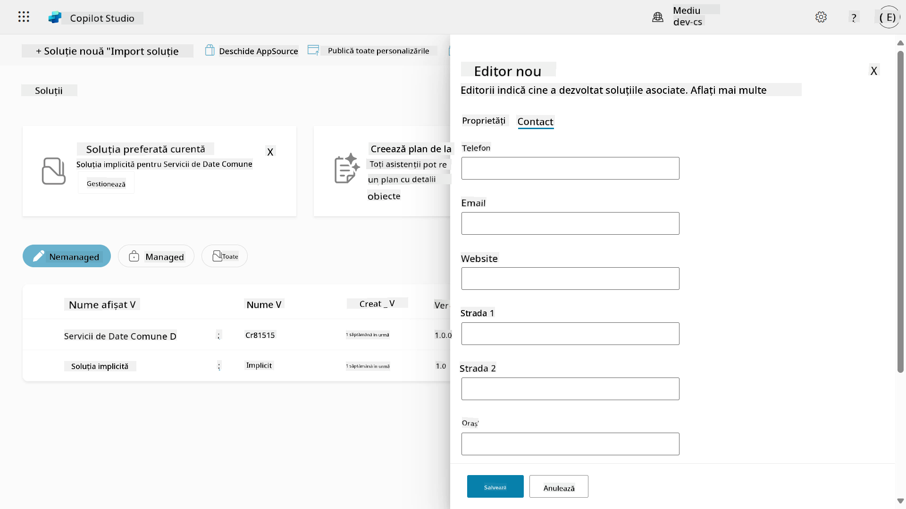

1. Selectează fila **Proprietăți** și apasă **Salvează** pentru a crea Editorul.

    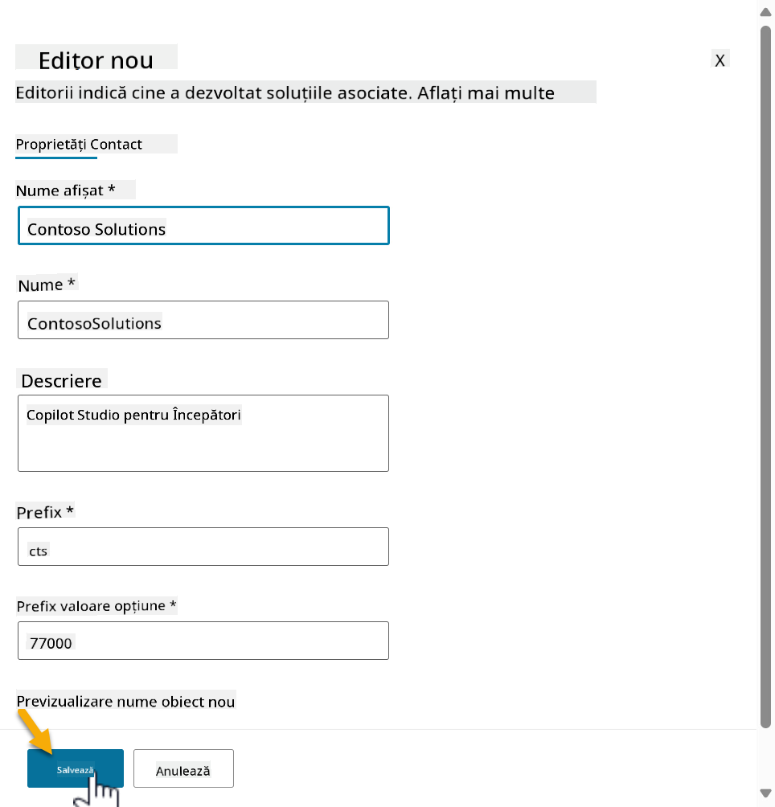
1. Panoul **New publisher** se va închide și vei fi redirecționat înapoi la panoul **New solution**, cu Publisher-ul nou creat selectat.

    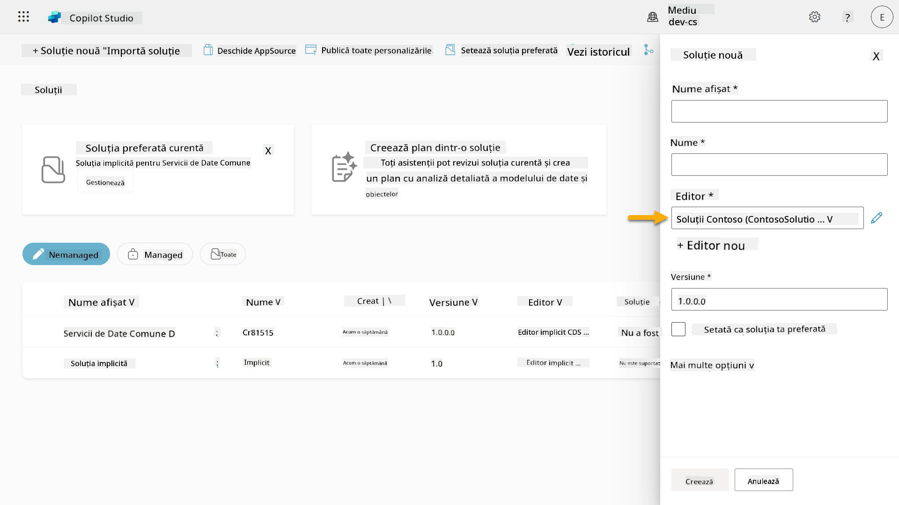  

Bravo, ai creat acum un Publisher pentru soluții! 🙌🏻 Următorul pas este să învățăm cum să creăm o soluție personalizată nouă.

### 4.2 Crearea unei soluții noi

1. Acum că am creat Publisher-ul nostru, putem completa restul formularului din panoul **New solution**.

    Copiază și lipește următorul text ca **Display name**,

    ```text
    Contoso Helpdesk Agent
    ```

    Copiază și lipește următorul text ca **Name**,

    ```text
    ContosoHelpdeskAgent
    ```

    Deoarece creăm o soluție nouă, [**Numărul versiunii**](https://learn.microsoft.com/power-apps/maker/data-platform/update-solutions#understanding-version-numbers-for-updates/?WT.mc_id=power-172615-ebenitez) va fi, în mod implicit, `1.0.0.0`.

    Bifează caseta **Set as your preferred solution**.

    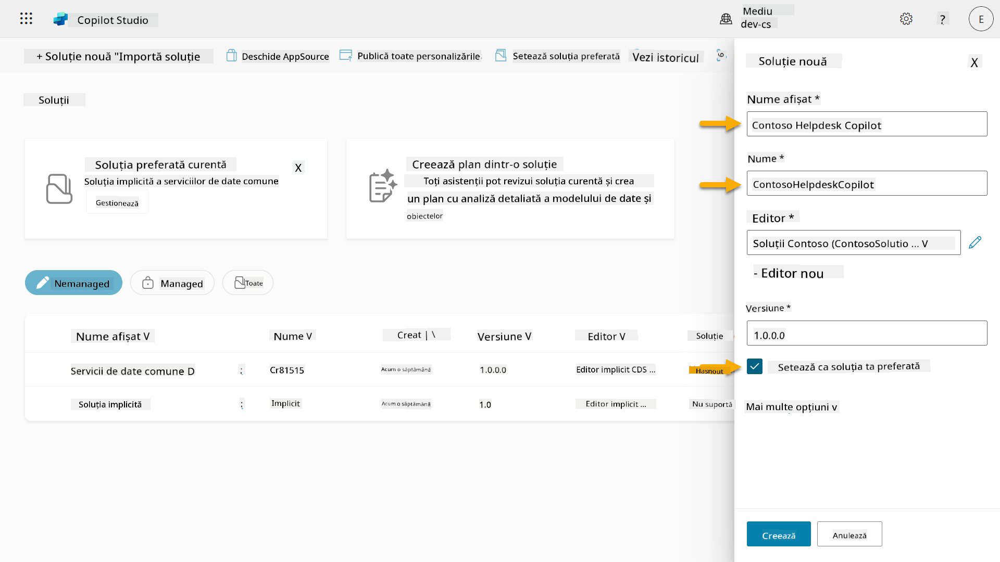  

1. Extinde **More options** pentru a vedea detalii suplimentare care pot fi furnizate într-o soluție.

    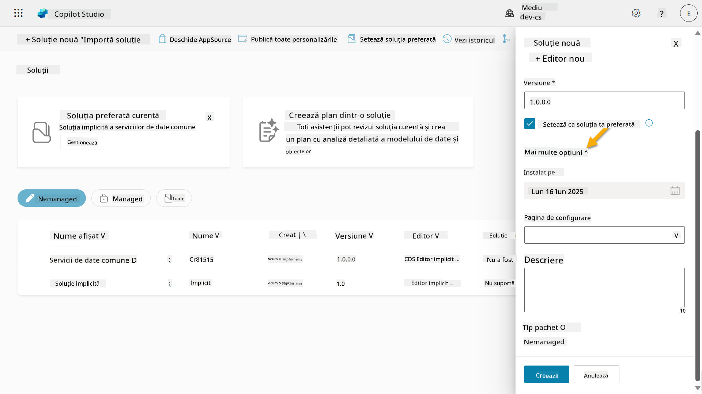

1. Vei vedea următoarele:

    - **Installed on** - data la care soluția a fost instalată.

    - **Configuration page** - dezvoltatorii configurează o resursă web HTML pentru a ajuta utilizatorii să interacționeze cu aplicația, agentul sau instrumentul lor, unde aceasta va apărea ca o pagină web în secțiunea de informații, cu instrucțiuni sau butoane. Este utilizată în principal de companii sau dezvoltatori care construiesc și împărtășesc soluții cu alții.

    - **Description** - descrie soluția sau oferă o descriere generală a paginii de configurare.

    Vom lăsa aceste câmpuri necompletate pentru acest laborator.

    Selectează **Create**.

    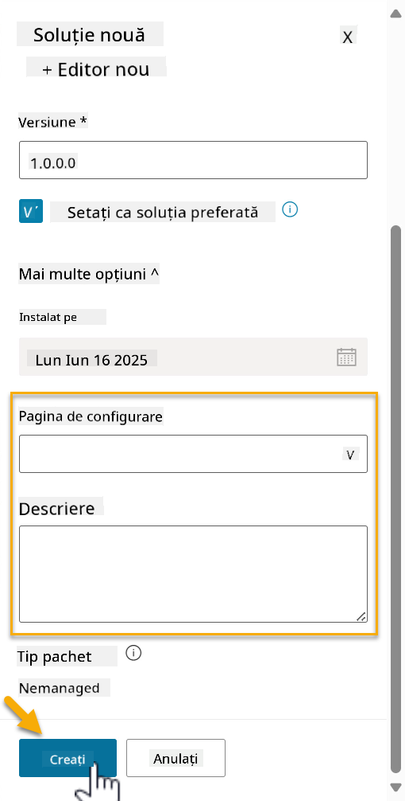

1. Soluția pentru Contoso Helpdesk Agent a fost acum creată. Nu va avea componente până când nu vom crea un agent în Copilot Studio.

    Selectează pictograma **back arrow** pentru a reveni la Solution Explorer.

    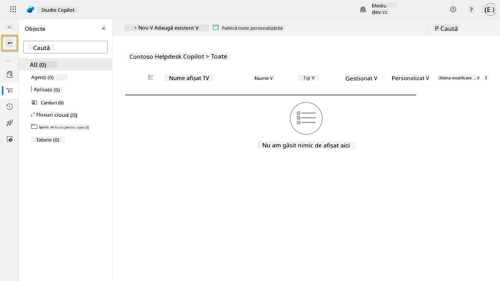

1. Observă cum Contoso Helpdesk Agent este acum afișat ca **Current preferred solution**, deoarece am bifat caseta **Set as your preferred solution** mai devreme.

    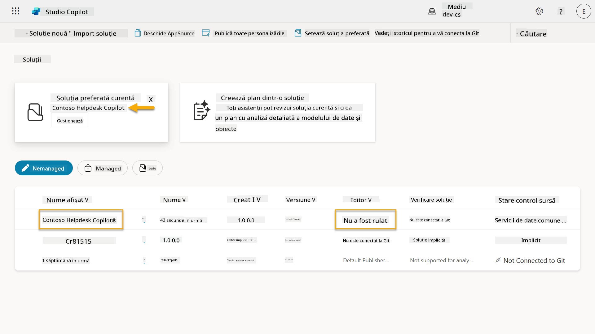

## ✅ Misiune Îndeplinită

Felicitări! 👏🏻 Ai creat un Publisher și l-ai utilizat în soluția nou creată pentru a construi agentul tău!

Bravo, Agent Maker. Un amprentă digitală bine organizată este primul pas către operabilitate la scară. Acum ai instrumentele și mentalitatea necesare pentru dezvoltarea sustenabilă a agenților pregătiți pentru întreprinderi.

Acesta este sfârșitul **Lab 04 - Creating a Solution**, selectează linkul de mai jos pentru a trece la lecția următoare. Soluția creată în acest laborator va fi utilizată în laboratorul lecției următoare.

⏭️ [Treci la lecția **Get started quickly with pre-built agents**](../05-using-prebuilt-agents/README.md)

## 📚 Resurse Tactice

🔗 [Crearea unei soluții](https://learn.microsoft.com/power-apps/maker/data-platform/create-solution/?WT.mc_id=power-172615-ebenitez)

🔗 [Crearea și gestionarea soluțiilor în Copilot Studio](https://learn.microsoft.com/microsoft-copilot-studio/authoring-solutions-overview/?WT.mc_id=power-172615-ebenitez)

🔗 [Partajarea agenților cu alți utilizatori](https://learn.microsoft.com/microsoft-copilot-studio/admin-share-bots/?WT.mc_id=power-172615-ebenitez)

🔗 [Rezumatul resurselor disponibile pentru rolurile de securitate predefinite](https://learn.microsoft.com/power-platform/admin/database-security#summary-of-resources-available-to-predefined-security-roles/?WT.mc_id=power-172615-ebenitez)

🔗 [Actualizarea sau îmbunătățirea unei soluții](https://learn.microsoft.com/power-apps/maker/data-platform/update-solutions/?WT.mc_id=power-172615-ebenitez)

🔗 [Prezentare generală a pipeline-urilor în Power Platform](https://learn.microsoft.com/power-platform/alm/pipelines/?WT.mc_id=power-172615-ebenitez)

🔗 [Prezentare generală a integrării Git în Power Platform](https://learn.microsoft.com/power-platform/alm/git-integration/overview/?WT.mc_id=power-172615-ebenitez)


---

**Declinare de responsabilitate**:  
Acest document a fost tradus folosind serviciul de traducere AI [Co-op Translator](https://github.com/Azure/co-op-translator). Deși ne străduim să asigurăm acuratețea, vă rugăm să fiți conștienți că traducerile automate pot conține erori sau inexactități. Documentul original în limba sa natală ar trebui considerat sursa autoritară. Pentru informații critice, se recomandă traducerea profesională realizată de un specialist uman. Nu ne asumăm responsabilitatea pentru eventualele neînțelegeri sau interpretări greșite care pot apărea din utilizarea acestei traduceri.