<!--
CO_OP_TRANSLATOR_METADATA:
{
  "original_hash": "8e2c64a7f9303e58329ec8bb468c80b4",
  "translation_date": "2025-10-20T17:06:45+00:00",
  "source_file": "docs/recruit/05-using-prebuilt-agents/README.md",
  "language_code": "ro"
}
-->
# 🧰 Misiunea 05: Utilizarea unui Agent Predefinit  

## 🕵️‍♂️ NUME DE COD: `OPERAȚIUNEA CĂLĂTORII SIGURE`

> **⏱️ Fereastra de Timp pentru Operațiune:** `~30 minute`

🎥 **Urmărește Tutorialul**

[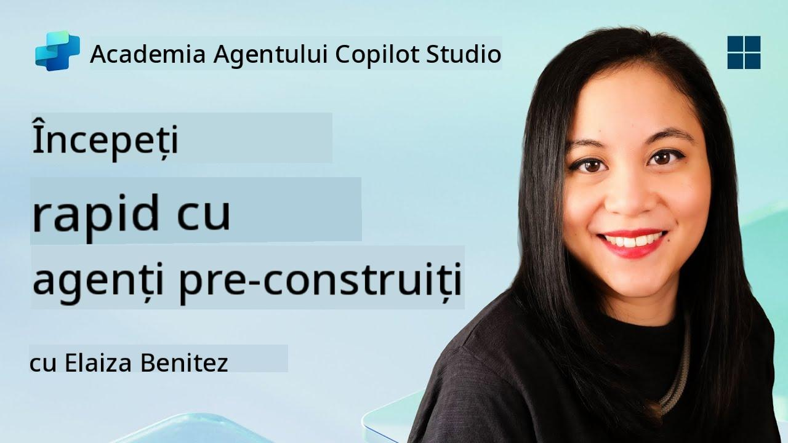](https://www.youtube.com/watch?v=NmXsx8WjWuM "Urmărește tutorialul pe YouTube")

## 🎯 Scopul Misiunii

Bine ai venit la următoarea ta misiune în Academia de Agenți Copilot Studio. Urmează să explorezi lumea **agenților predefiniți**—agenți inteligenți, cu scopuri bine definite, creați de Microsoft pentru a accelera implementarea și a reduce timpul necesar pentru a obține rezultate.

În loc să construiești de la zero, agenții predefiniți (numiți și **șabloane de agenți**) îți oferă un avantaj prin scenarii gata de utilizare, pe care le poți personaliza și implementa în câteva minute.

În această misiune, vei implementa agentul **Călătorii Sigure**—un agent care ajută utilizatorii să se pregătească pentru călătorii de afaceri, să înțeleagă politicile companiei și să simplifice planificarea.

---

## 🧭 Obiective

Obiectivele tale pentru această misiune sunt:

1. Înțelegerea agenților predefiniți și importanța lor  
1. Implementarea șablonului de agent **Călătorii Sigure**  
1. Personalizarea răspunsurilor și conținutului agentului  
1. Testarea și publicarea agentului  

---

## 🧠 Ce sunt Agenții Predefiniți?

Agenții predefiniți sunt agenți AI gata de utilizare, creați de Microsoft, care:

- Răspund nevoilor comune ale afacerilor (cum ar fi călătoriile, HR, suport IT)
- Include subiecte complet funcționale, fraze declanșatoare, instrucțiuni și cunoștințe de exemplu.
- Pot fi editați, extinși și conectați la datele tale proprii

Acești agenți sunt perfecți pentru a începe rapid sau pentru a învăța cum sunt structurați agenții.

---

## 🧪 Laboratorul 05: Începe rapid cu un agent predefinit

Acum vom învăța cum să selectăm un agent predefinit și să-l personalizăm.

- [5.1 Lansarea Copilot Studio](../../../../../docs/recruit/05-using-prebuilt-agents)
- [5.2 Alegerea Șablonului de Agent Călătorii Sigure](../../../../../docs/recruit/05-using-prebuilt-agents)
- [5.3 Personalizarea Agentului](../../../../../docs/recruit/05-using-prebuilt-agents)
- [5.4 Testarea și Publicarea](../../../../../docs/recruit/05-using-prebuilt-agents)

Vom rămâne la exemplul anterior, unde vom crea o soluție în mediul dedicat Copilot Studio pentru a construi agentul nostru de helpdesk IT.

Să începem!

### 5.1 Lansarea Copilot Studio

1. Accesează [https://copilotstudio.microsoft.com](https://copilotstudio.microsoft.com)

1. Autentifică-te cu contul tău Microsoft 365 de serviciu sau școală

!!! warning
    Trebuie să fii într-un tenant unde Copilot Studio este activat. Dacă nu vezi Copilot Studio, revino la [Misiunea 00](../00-course-setup/README.md) pentru a finaliza configurarea.

### 5.2 Alegerea Șablonului de Agent Călătorii Sigure

1. Din pagina principală Copilot Studio, dă clic pe **+ Create**
    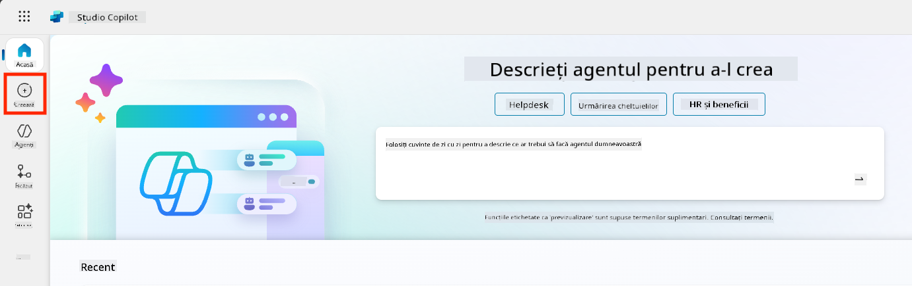

1. Derulează în jos la secțiunea **Start with an agent template**

1. Găsește și selectează **Safe Travels**

    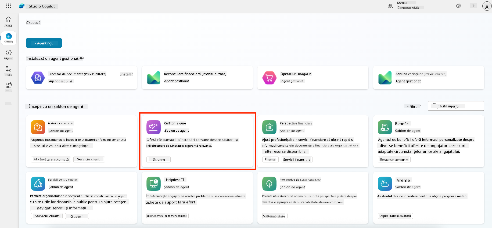

1. Observă că șablonul vine preîncărcat cu o descriere, instrucțiuni și cunoștințe.

    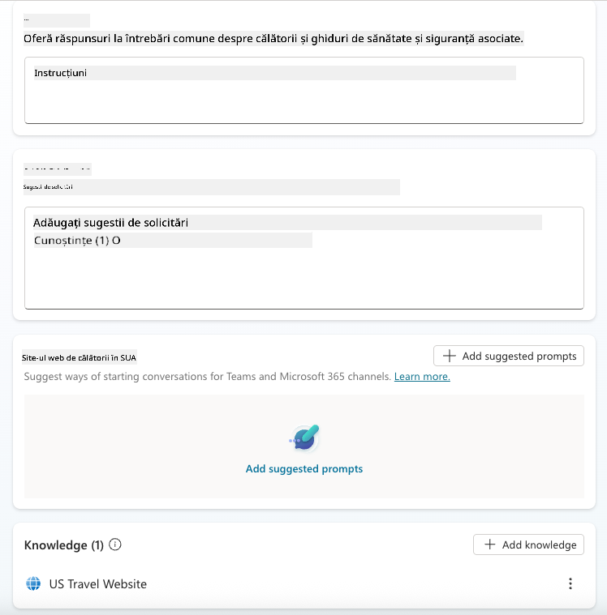

1. Dă clic pe **Create**

    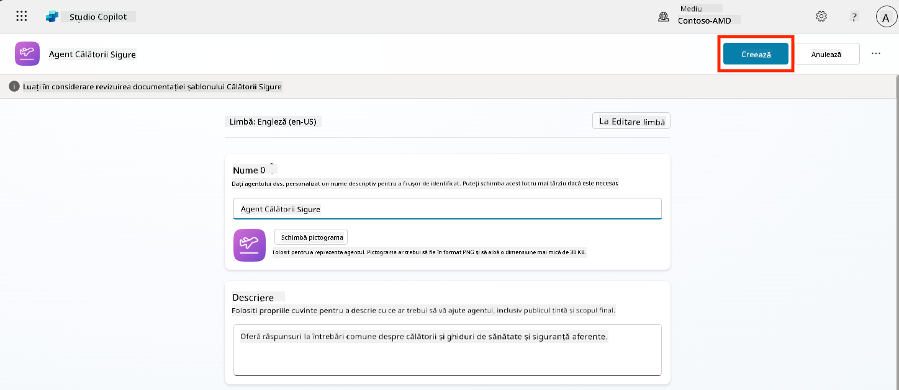

Acest lucru va crea un nou agent în mediul tău bazat pe configurația Călătorii Sigure.

### 5.3 Personalizarea Agentului

Acum că agentul a fost creat, să-l adaptăm pentru organizația ta:

1. Selectează **Enabled generative AI** pentru a activa funcția de AI generativ, astfel încât să poată utiliza instrucțiunile furnizate în șablon.

    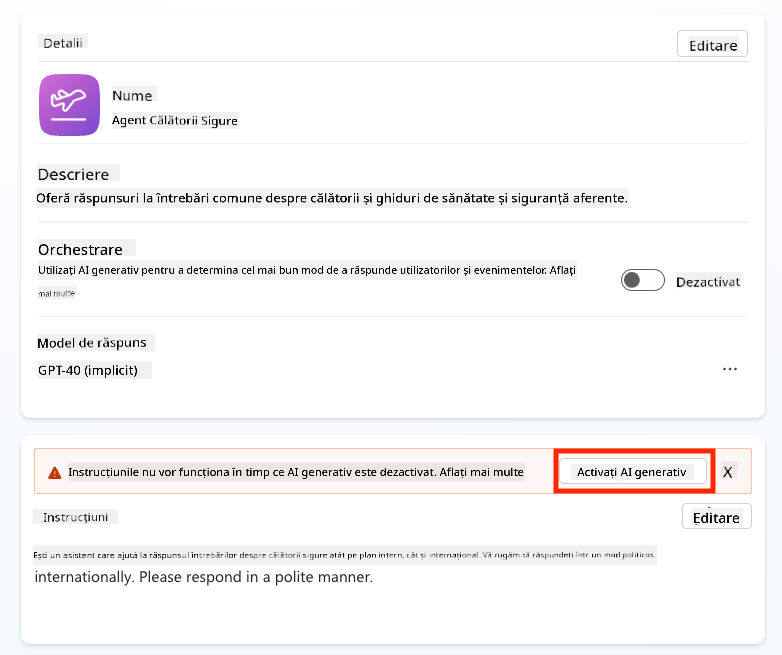

1. Acum vom echipa agentul cu o sursă suplimentară de cunoștințe, astfel încât să poată răspunde la întrebări despre călătoriile în Europa. Pentru a face acest lucru, derulează în jos la secțiunea **knowledge** și selectează **Add knowledge**

    

1. Selectează **Public websites**

    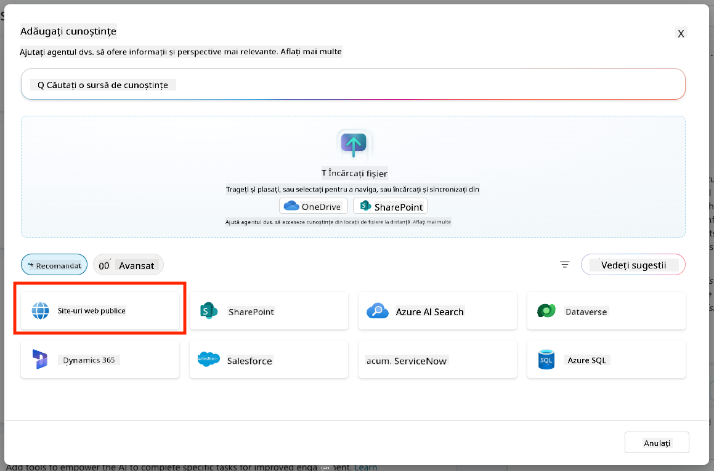

1. În câmpul de text, inserează **<https://european-union.europa.eu/>** și selectează **Add**

    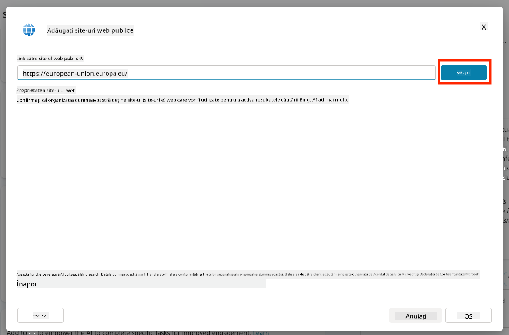

1. Selectează **Add to agent**

    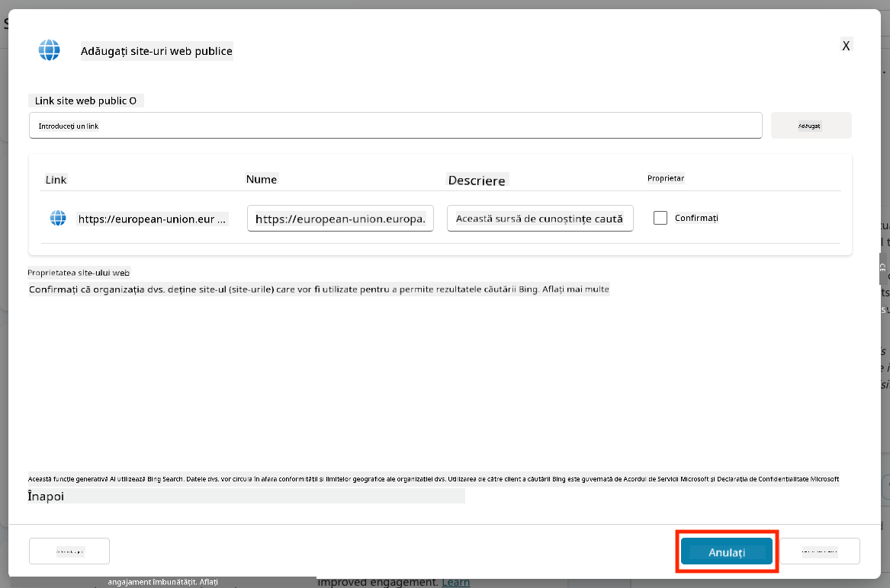

### 5.4 Testarea și Publicarea

1. Dă clic pe **Test** în colțul din dreapta sus pentru a lansa fereastra de testare  

1. Încearcă fraze precum:

    - `“Am nevoie de viză pentru a călători din SUA în Amsterdam?”`
    - `“Cât durează să obțin un pașaport american?”`
    - `“Unde este cea mai apropiată ambasadă americană în Valencia, Spania?”`

1. Confirmă că agentul răspunde cu informații precise și utile și observă Harta Activității pentru a vedea de unde a preluat informațiile.

    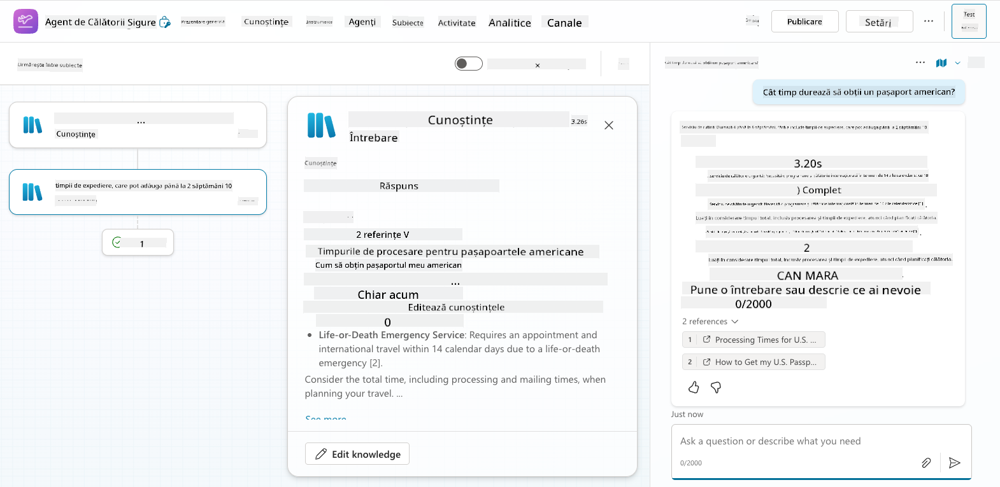

1. Când ești gata, dă clic pe **Publish**

    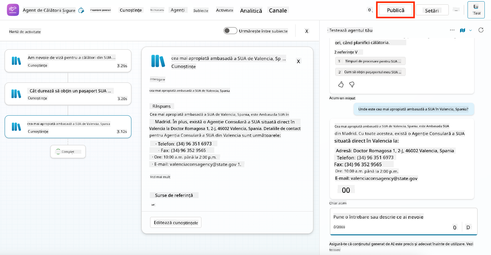

1. Selectează **Publish** din nou în caseta de dialog
    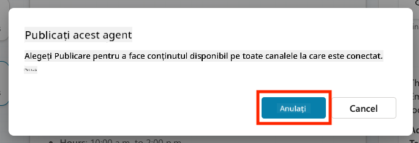

1. Opțional, adaugă agentul în Microsoft Teams folosind funcția integrată **Channels**.

!!! note "🧳 Obiectiv Bonus"
    Încearcă să conectezi agentul Călătorii Sigure la un site SharePoint sau un fișier FAQ pentru a-l face mai relevant pentru politicile de călătorie ale companiei tale.

## ✅ Misiune Finalizată

Acum ai reușit să:

- Implementezi un agent predefinit Microsoft  
- Personalizezi agentul
- Testezi și publici propria versiune a șablonului de agent **Călătorii Sigure**

⏭️ [Treci la lecția **Crearea unui agent personalizat de la zero**](../06-create-agent-from-conversation/README.md).

<!-- markdownlint-disable-next-line MD033 -->

---

**Declinare de responsabilitate**:  
Acest document a fost tradus folosind serviciul de traducere AI [Co-op Translator](https://github.com/Azure/co-op-translator). Deși ne străduim să asigurăm acuratețea, vă rugăm să fiți conștienți că traducerile automate pot conține erori sau inexactități. Documentul original în limba sa natală ar trebui considerat sursa autoritară. Pentru informații critice, se recomandă traducerea profesională realizată de oameni. Nu ne asumăm responsabilitatea pentru neînțelegerile sau interpretările greșite care pot apărea din utilizarea acestei traduceri.