<!--
CO_OP_TRANSLATOR_METADATA:
{
  "original_hash": "180f9cc0b40527f61be092c9b0f72aba",
  "translation_date": "2025-10-20T17:44:01+00:00",
  "source_file": "docs/recruit/06-create-agent-from-conversation/README.md",
  "language_code": "ro"
}
-->
# 🚨 Misiunea 06: Creează un agent personalizat folosind limbaj natural cu Copilot și conectându-l la datele tale

## 🕵️‍♂️ NUME DE COD: `OPERAȚIUNEA FORJA AGENTULUI`

> **⏱️ Fereastra de timp pentru operațiune:** `~75 minute`

🎥 **Urmărește demonstrația**

[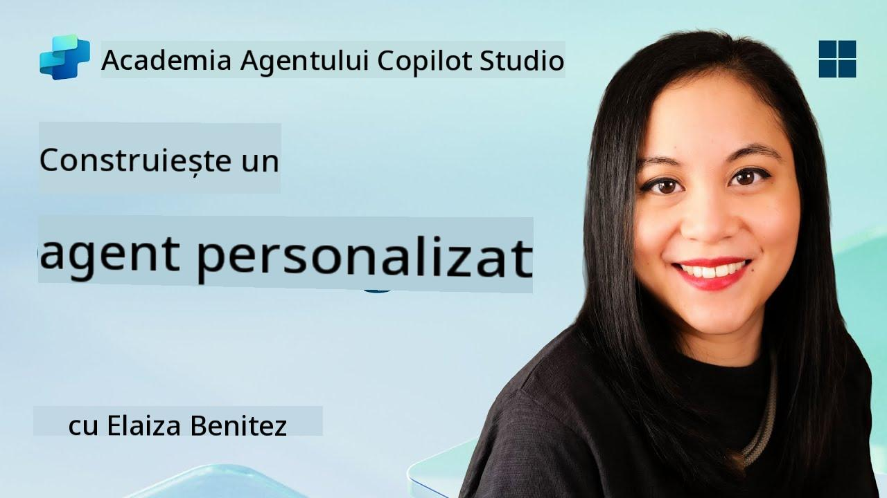](https://www.youtube.com/watch?v=qZTtQVncGFg "Urmărește demonstrația pe YouTube")

## 🎯 Rezumatul misiunii

Bine ai revenit, Creator de Agenți. Această misiune te pune la cârma celei mai puternice funcționalități din Copilot Studio - crearea unui agent personalizat de la zero folosind doar limbaj natural… și îmbunătățindu-l cu datele tale.

Acesta nu este doar un alt chatbot. Construiești un coleg digital bazat pe cunoștințe - unul care poate raționa, răspunde și face referire la informații reale din cadrul companiei.

Arma ta? Limbajul natural. Misiunea ta? Proiectează, antrenează și testează un agent de helpdesk complet personalizat care răspunde la întrebări IT folosind SharePoint, fișiere încărcate sau URL-uri ale companiei.

Să construim agentul tău de la zero.

## 🔎 Obiective

În această misiune vei învăța:

1. Ce sunt agenții personalizați și cum diferă de șabloanele predefinite
1. Crearea agenților folosind prompturi de limbaj natural și design conversațional cu Copilot
1. Conectarea agenților la surse de cunoștințe ale companiei, inclusiv SharePoint, documente și site-uri web
1. Despre orchestrarea generativă și cum agenții caută și răspund dinamic folosind mai multe surse de date
1. Construirea și testarea unui agent de helpdesk IT complet funcțional care poate răspunde la întrebări bazate pe datele tale

## 🤔 Ce este un agent _personalizat_?

Un agent personalizat este un chatbot sau asistent virtual pe care îl creezi și îl proiectezi în Copilot Studio pentru a ajuta utilizatorii cu sarcini sau întrebări specifice. Se numește personalizat deoarece:

- **Tu decizi scopul** - ajută utilizatorii să solicite concediu, să verifice starea comenzilor, să ofere asistență pentru întrebări IT.
- **Tu definești conversația** - ce spune agentul și cum ar trebui să răspundă.
- **Tu îl conectezi la datele tale** - conectează-l la datele companiei prin resursele de cunoștințe integrate.
- **Tu îl conectezi la propriile sisteme sau aplicații** - alege dintre conectori, fluxuri, API-uri REST și servere de protocol pentru contextul modelului.

!!! note
    Gândește-te astfel: construiești propriul tău ajutor digital care poate vorbi cu utilizatorii și îndeplini sarcini pentru ei, cum ar fi răspunsul la întrebări, colectarea informațiilor necesare unui proces sau conectarea la datele companiei.

### 🤖 Ce poate face un agent personalizat?

Un agent personalizat poate îndeplini următoarele:

- Să ceară utilizatorilor informații precum nume, date sau preferințe.
- Să salveze aceste informații într-o bază de date sau tabel.
- Să caute date pe baza întrebărilor adresate și să răspundă.
- Să funcționeze autonom fără ca utilizatorii să interacționeze direct cu agentul.
- Să declanșeze acțiuni fie la cerere prin interacțiunea directă a utilizatorului, fie autonom, cum ar fi trimiterea de e-mailuri sau crearea de înregistrări.

### 👩🏻‍💻 De ce să folosești un agent personalizat?

- Economisește timp prin automatizarea sarcinilor repetitive.
- Oferă utilizatorilor o experiență prietenoasă și ghidată.
- Personalizează-l pentru nevoile afacerii sau proiectului tău.

### ✨ Exemplu

Construiești un agent personalizat care ajută angajații să solicite concediu.

Agentul cere numele lor, datele concediului și numele managerului, apoi salvează informațiile în sistemul desemnat pentru gestionarea cererilor de concediu, cum ar fi o listă SharePoint.

Acum, în loc să navigheze pe lista SharePoint și să creeze un element nou, angajații pur și simplu discută cu agentul.

## 🗣️ Folosește limbaj natural pentru a crea agenți

Anterior ai învățat cum să construiești rapid agenți în Copilot Studio folosind șabloane predefinite în [Lecția 05 - Începe rapid cu agenți predefiniți](../05-using-prebuilt-agents/README.md). În această lecție, vom explora experiența de creare conversațională cu Copilot. Copilot Studio face ușoară construirea agenților prin discuții cu Copilot, exact ca o conversație.

În Copilot Studio, nu trebuie să scrii cod pentru a crea un agent. În schimb, descrii ce vrei ca agentul să facă în limbaj simplu, iar Copilot te ajută să-l construiești pas cu pas printr-o experiență asemănătoare unui chat.

## 🌱 Dar sunt nou în "descrierea a ceea ce vreau" - ce fac?

Descrierea în limbaj natural pentru a crea un agent personalizat poate fi un concept nou pentru tine. Ori de câte ori folosești Copilot în produsele și serviciile Microsoft, folosești limbaj natural sub forma unui _prompt_.

Un prompt este mesajul sau instrucțiunea pe care o dai unui agent AI pentru a-i spune ce vrei să facă. Gândește-te la el ca la oferirea de direcții unui asistent. Cu cât instrucțiunile tale sunt mai clare, cu atât asistentul tău va înțelege și acționa mai ușor.

### 🪄 De ce contează prompturile

- Ghidează comportamentul agentului.
- Ajută agentul să înțeleagă ce tip de conversație să aibă.
- Un prompt bun face agentul mai util și mai precis.

### 📝 Sfaturi pentru scrierea unui prompt bun

- Fii clar și specific - spune exact ce vrei ca agentul să facă.
- Gândește-te ca utilizator - ce va spune utilizatorul? Ce ar trebui să răspundă agentul?
- Include exemple - dacă este posibil, oferă o interacțiune exemplu.

### ✨ Exemplu

Să presupunem că echipa HR are nevoie de un agent care să ajute cu cererile de concediu.

Promptul ar putea fi:

    „Vreau să construiesc un agent care ajută utilizatorii să depună o cerere de concediu. Când un utilizator spune că vrea să solicite timp liber, agentul ar trebui să ceară numele lor, data de început a concediului, data de sfârșit a concediului și numele managerului lor. După ce utilizatorul oferă aceste informații, agentul ar trebui să le salveze într-o listă SharePoint numită ‘Cereri de Concediu’ și să posteze o notificare într-un canal dedicat Microsoft Teams.”

De ce funcționează acest prompt:

- **Stabilește clar scopul** - depunerea unei cereri de concediu
- **Descrie interacțiunea utilizatorului** - ce spune utilizatorul și ce ar trebui să întrebe agentul
- **Listează datele necesare** - nume, data de început, data de sfârșit, manager
- **Menționează unde merg datele** - o listă SharePoint numită Cereri de Concediu

## 🔮 OK, am creat agentul meu... cum îl conectez la cunoștințe?

În Copilot Studio, sursele de cunoștințe sunt locuri de unde agentul tău poate găsi informații pentru a oferi răspunsuri mai bune. Când adaugi aceste surse, agentul tău poate accesa datele companiei din locuri precum Power Platform, Dynamics 365, site-uri web și alte sisteme sau servicii utilizate de compania ta.

Aceste surse funcționează împreună cu AI pentru a ajuta agentul să răspundă mai precis la întrebările utilizatorilor, realizând acest lucru prin ceea ce se numește **orchestrare generativă**.

### 🌿 Ce este orchestrarea generativă în contextul agenților?

Orchestrarea generativă înseamnă că agentul folosește AI pentru a decide dinamic cum să răspundă la o întrebare, combinând abilitățile sale lingvistice încorporate cu informațiile din sursele de cunoștințe adăugate.

Când un utilizator pune o întrebare, agentul:

- Înțelege întrebarea folosind AI.
- Poate cere utilizatorilor informații lipsă generând întrebări pe loc.
- Selectează cele mai relevante surse de cunoștințe.
- Caută răspunsuri în acele surse.
- Generează un răspuns natural și util folosind informațiile găsite.

### 🏦 De ce contează sursele de cunoștințe?

1. **Răspunsuri mai inteligente** - când adaugi surse de cunoștințe, agentul tău poate oferi răspunsuri mai bune și mai precise folosind date reale din organizația ta.

1. **Mai puțin efort manual** - nu trebuie să scrii fiecare răspuns posibil. Agentul poate căuta în sursele adăugate și răspunde automat.

1. **Folosește informații de încredere** - agentul tău poate prelua răspunsuri din sistemele pe care le folosești deja, cum ar fi Dataverse, SharePoint sau site-uri ale companiei, astfel încât utilizatorii să aibă informații fiabile dintr-o sursă de încredere.

1. **Funcționează cu AI generativ** - sursele de cunoștințe și AI ajută agentul să înțeleagă întrebările și să răspundă natural, chiar dacă întrebarea nu a fost pre-programată sau adăugată ca prompt inițial.

1. **Flexibil și extensibil** - poți adăuga surse de cunoștințe oricând în timpul configurării sau ulterior, agentul tău devine mai inteligent pe măsură ce nevoile tale se schimbă.

### ✨ Exemplu

Imaginează-ți că construiești un agent pentru a ajuta angajații cu întrebări HR. Adaugi documentul politicii HR al companiei și site-ul SharePoint ca surse de cunoștințe.

Când un angajat întreabă, _„Câte zile de concediu am dreptul să iau?”_, agentul folosește orchestrarea generativă pentru a căuta în acele surse și a răspunde cu politica corectă fără ca tu să scrii manual acel răspuns. Acest lucru îți economisește timp în a acoperi fiecare întrebare posibilă pe care un angajat ar putea să o pună despre drepturile lor.

## Tipuri de surse de cunoștințe care pot fi adăugate

1. **Site-uri web publice**
    - **Ce face:** Caută pe site-uri specifice (cum ar fi site-ul companiei tale) folosind Bing.
    - **De ce este util:** Excelent pentru a prelua informații publice, cum ar fi FAQ-uri sau detalii despre produse.

1. **Documente**
    - **Ce face:** Folosește documente pe care le încarci direct în agent, cum ar fi fișiere PDF sau Word. Aceste fișiere încărcate sunt stocate în siguranță în Dataverse.
    - **De ce este util:** Permite agentului să răspundă la întrebări bazate pe ghiduri interne, manuale sau politici.

1. **SharePoint**
    - **Ce face:** Se conectează la foldere sau fișiere SharePoint folosind Microsoft Graph Search.
    - **De ce este util:** Ideal pentru accesarea documentelor echipei, politicilor HR sau fișierelor de proiect stocate în SharePoint.

1. **Dataverse**
    - **Ce face:** Folosește date structurate din tabelele și rândurile mediului Dataverse și poate aplica sinonime și definiții de glosar pentru tabele și coloane pentru a îmbunătăți răspunsurile agentului.
    - **De ce este util:** Când trebuie să cauți date ale companiei stocate în Dataverse, cum ar fi informații despre clienți.

1. **Cunoștințe în timp real cu conectori**
    - **Ce face:** Permite agentului să acceseze date live din alte sisteme ale companiei, cum ar fi Salesforce, ServiceNow, Dynamics 365, AzureSQL, Databricks și altele, în timpul unei conversații, folosind permisiunile utilizatorului.
    - **De ce este util:** Oferă răspunsuri actualizate, sigure și precise fără a stoca sau duplica datele, făcând agentul mai inteligent și mai sigur.

1. **Azure AI Search**
    - **Ce face:** Permite agentului să caute prin seturi mari de documente stocate în Azure folosind căutare semantică și vectorială pentru a înțelege întrebările utilizatorilor.
    - **De ce este util:** Oferă răspunsuri precise și de încredere din surse de date complexe, susține citările și se scalează bine pentru colecții mari de documente cu controale de acces sigure.

## 🔒 Notă despre securitate

### Autentificarea surselor de cunoștințe

Unele surse, cum ar fi SharePoint și Dataverse, necesită autentificarea utilizatorului. Aceasta înseamnă că agentul va face referire în răspunsurile sale doar la datele pe care utilizatorul are permisiunea să le vadă. Alte surse pot necesita configurări suplimentare pentru ca agentul să se conecteze la ele, cum ar fi Azure AI Search, care necesită un cont Azure și specificarea unui tip de autentificare.

## Îmbunătățirea răspunsurilor agentului în Copilot Studio

După ce agentul tău este configurat prin experiența de creare conversațională, va trebui să-l testezi în raport cu instrucțiunile generate de Copilot din promptul tău. Îmbunătățirea răspunsurilor agentului în Copilot Studio înseamnă să te asiguri că înțelege clar obiectivele tale și are informațiile potrivite pentru a lucra.

1. **Rafinează instrucțiunile agentului** - aici îi spui agentului cum ar trebui să se comporte. Folosește un limbaj clar și specific.

    De exemplu:

    ✅ „Comportă-te ca un agent prietenos de suport pentru clienți care explică lucrurile simplu.”

    ❌ „Fii de ajutor.” (Prea vag)

1. **Verifică tonul și limbajul** - asigură-te că tonul agentului se potrivește cu publicul tău.

    Poți seta să fie:

    - Prietenos și relaxat.
    - Profesional și concis.
    - Suportiv și răbdător.

1. **Adaugă sau actualizează sursele de cunoștințe** - dacă agentul tău trebuie să răspundă la întrebări despre un subiect, asigură-te că are acces la informațiile potrivite.

    - Adaugă linkuri către site-uri web, documente sau FAQ-uri.
    - Menține conținutul actualizat.
    - Folosește informații clare și bine structurate.

1. **Folosește Subiecte și Declanșatori** - Dacă agentul tău trebuie să gestioneze sarcini sau conversații specifice, poți crea subiecte cu fraze declanșatoare. Acest lucru ajută la ghidarea conversației mai precis. Vom învăța mai multe despre acest lucru în lecția următoare.

1. **Testează cu întrebări reale** - încearcă să pui agentului întrebările pe care utilizatorii le-ar putea pune.

    Dacă răspunsurile nu sunt grozave:

    - Ajustează instrucțiunile sistemului.
    - Adaugă mai multe exemple sau cunoștințe.
    - Reformulează întrebările pentru a vedea cum răspunde.

1. **Revizuiește și îmbunătățește** - îmbunătățirea unui agent este un proces continuu!

    După publicare:

    - Colectează feedback de la utilizatori.
    - Fii atent la întrebările frecvente sau confuzii.
    - Continuă să rafinezi configurarea agentului.

## 🧪 Laboratorul 06: Creează un agent personalizat în Copilot Studio

Acum vom învăța cum să creăm un agent personalizat care poate conversa pe baza datelor tale.

- [6.1 Folosește limbaj natural pentru a crea un agent cu Copilot](../../../../../docs/recruit/06-create-agent-from-conversation)
- [6.2 Adaugă o sursă de cunoștințe internă folosind un site SharePoint](../../../../../docs/recruit/06-create-agent-from-conversation)
- [6.3 Adaugă o sursă de cunoștințe internă prin încă
Vom folosi același caz de utilizare din [Lecția 03 - Crearea unui agent declarativ pentru Microsoft 365 Copilot](../03-create-a-declarative-agent-for-M365Copilot/README.md#use-case-scenario)

**Ca angajat**

**Îmi doresc** să primesc ajutor rapid și precis de la agentul de asistență IT pentru probleme precum problemele dispozitivelor, depanarea rețelei, configurarea imprimantei

**Pentru a putea** rămâne productiv și să rezolv problemele tehnice fără întârzieri

Să începem!

### ✨ Cerințe preliminare

- **Site SharePoint**

Vom folosi site-ul SharePoint **Contoso IT** din [Lecția 00 - Configurarea cursului - Pasul 3: Crearea unui nou site SharePoint](../00-course-setup/README.md#step-4-create-new-sharepoint-site).

Dacă nu ați configurat site-ul SharePoint **Contoso IT**, vă rugăm să reveniți la [Lecția 00 - Configurarea cursului - Pasul 3: Crearea unui nou site SharePoint](../00-course-setup/README.md#step-4-create-new-sharepoint-site).

- **Soluție**

Vom folosi soluția **Contoso Helpdesk Agent** din [Lecția 04 - Crearea unei soluții pentru agentul dvs.](../04-creating-a-solution/README.md#41-create-a-solution-publisher).

Dacă nu ați configurat soluția **Contoso Agent**, vă rugăm să reveniți la [Lecția 04 - Crearea unei soluții pentru agentul dvs.](../04-creating-a-solution/README.md#41-create-a-solution-publisher).

### 6.1 Utilizarea limbajului natural pentru a crea un agent cu Copilot

!!! warning "Întrebările Copilot pot varia între sesiuni"

    Experiența de creare conversațională cu Copilot poate varia de fiecare dată, iar întrebările furnizate pentru ghidare pot fi ușor diferite față de cele anterioare.

1. Navigați la pagina principală a Copilot Studio și introduceți în câmp următorul prompt care descrie agentul de asistență IT. Promptul include scopul agentului, contextul, sarcinile așteptate și formatul răspunsului agentului.

    ```text
    You are an IT help desk agent. Your goal is to assist users with their IT issues. You can access information from our company's knowledge base at https://support.microsoft.com/en-us. Your responses should be polite and helpful. If a user reports a slow computer, ask about the age of the device, current software versions, and if they've recently installed any new programs. If a user is experiencing trouble logging into their email, guide them through password reset procedures. You should be concise and informative, using step-by-step instructions with bullet points when appropriate.
    ```

      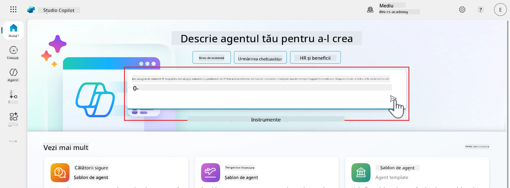

1. Următorul pas este încărcarea experienței de creare conversațională cu Copilot. Veți vedea că Copilot este în proces de a vă răspunde.

      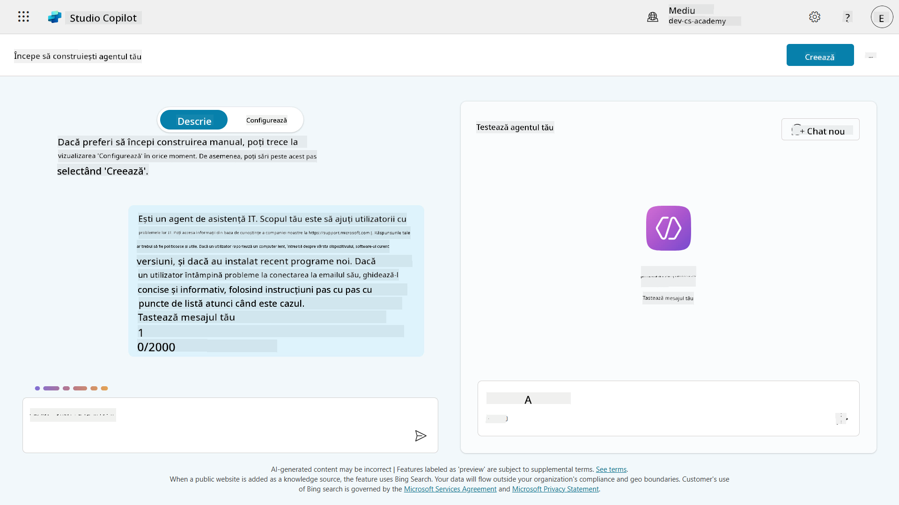

1. Copilot confirmă că agentul a fost configurat conform instrucțiunilor furnizate și solicită confirmarea numelui agentului. Vom cere Copilot să numească agentul nostru astfel:

       ```text
       Contoso Helpdesk Agent
       ```

      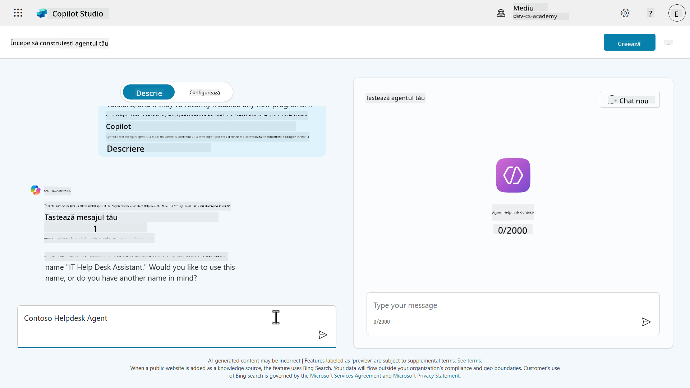

1. Copilot îndeplinește cererea și vom vedea că numele agentului a fost actualizat în panoul agentului. Copilot ne cere apoi să rafinăm instrucțiunile. Ne întreabă cum ar trebui să răspundă la anumite probleme, iar noi vom solicita să recunoască problema, să ofere exemple de subiecte la care să răspundă și să formateze răspunsul sub formă de puncte.

    Copiați și lipiți următorul text și trimiteți cererea către Copilot.

       ```text
       Prioritizează cererile urgente. Exemple de probleme IT sau scenarii pentru care să oferi ajutor: probleme cu dispozitivele, conectivitate la rețea, probleme de autentificare. În timpul depanării, recunoaște mai întâi problema și răspunde cu empatie, apoi oferă ghidare pas cu pas folosind puncte și întreabă dacă este nevoie de asistență suplimentară.
       ```

      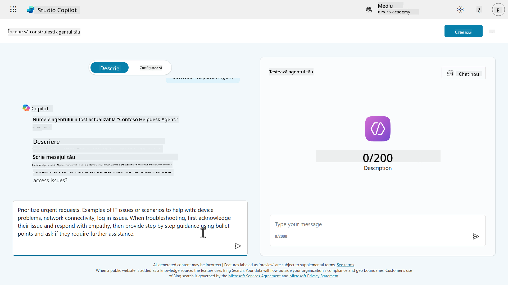

1. Instrucțiunile agentului vor fi actualizate după ce Copilot a primit cererea. Observați cum în panoul din partea dreaptă au apărut acum prompturi de început. Acestea au fost formate pe baza instrucțiunilor noastre.

    Următorul pas este ca Copilot să solicite site-uri publice pentru a fundamenta cunoștințele agentului.

    Copiați și lipiți următorul text și trimiteți cererea către Copilot.

      ```text
      https://support.microsoft.com
      ```

      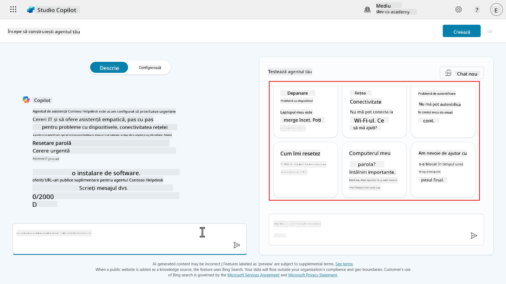

1. Site-ul public va fi adăugat ca sursă de cunoștințe. Copilot întreabă dacă trebuie adăugate surse suplimentare de cunoștințe. Nu este nevoie să adăugăm alte site-uri publice.

    Copiați și lipiți următorul text și trimiteți cererea către Copilot.

      ```text
      Proceed with setup
      ```

      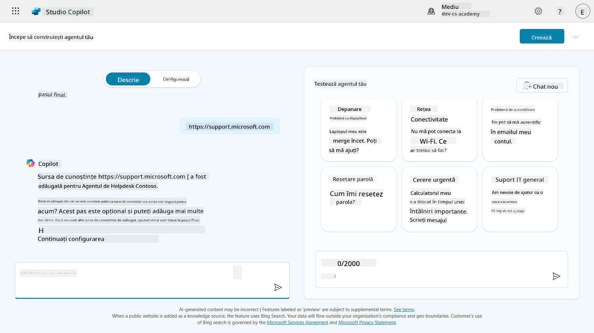

1. Copilot confirmă configurarea agentului nostru Contoso Helpdesk Agent, dar vom adăuga o modificare suplimentară: vom solicita ca agentul nostru să nu răspundă la întrebări legate de HR. Acest lucru informează agentul că nu ar trebui să răspundă la întrebări legate de HR adresate de utilizatori.

    Copiați și lipiți următorul text și trimiteți cererea către Copilot.

       ```text
       Nu oferi asistență pentru întrebări legate de HR, exemple sunt: Care este soldul meu de zile de concediu? Câte zile de concediu medical am? Care este URL-ul portalului nostru de salarii?
       ```

      

1. Instrucțiunile vor fi actualizate pentru a nu oferi asistență cu întrebări legate de HR. Nu este nevoie să facem alte actualizări, agentul nostru este gata să fie creat.

      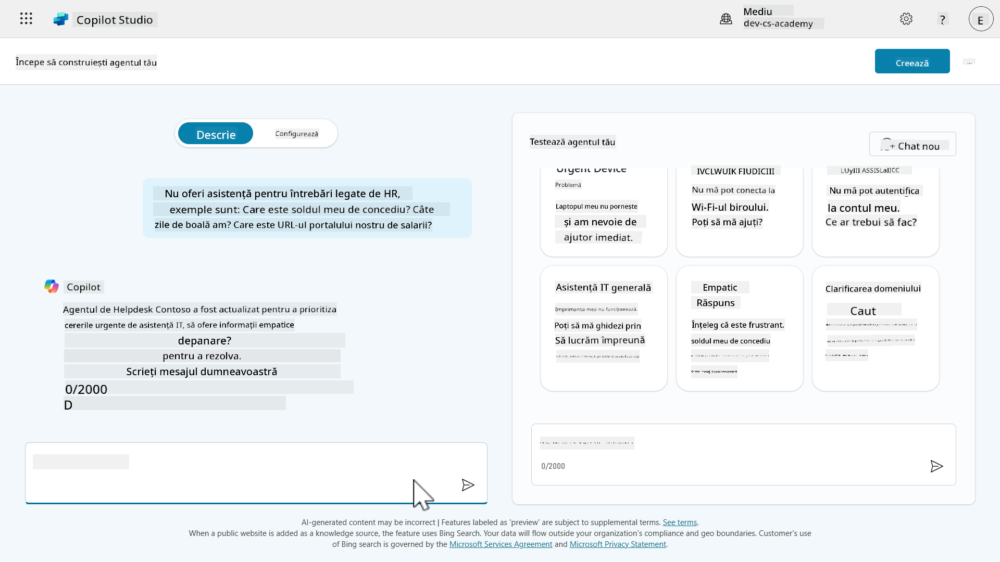

1. Înainte de a crea agentul nostru, să facem câteva lucruri.

    Mai întâi, selectați fila **Configure** pentru a vizualiza detaliile agentului definite din conversația noastră cu Copilot. Aici veți vedea Numele, Descrierea, Instrucțiunile, Cunoștințele și Prompturile sugerate/de început.

      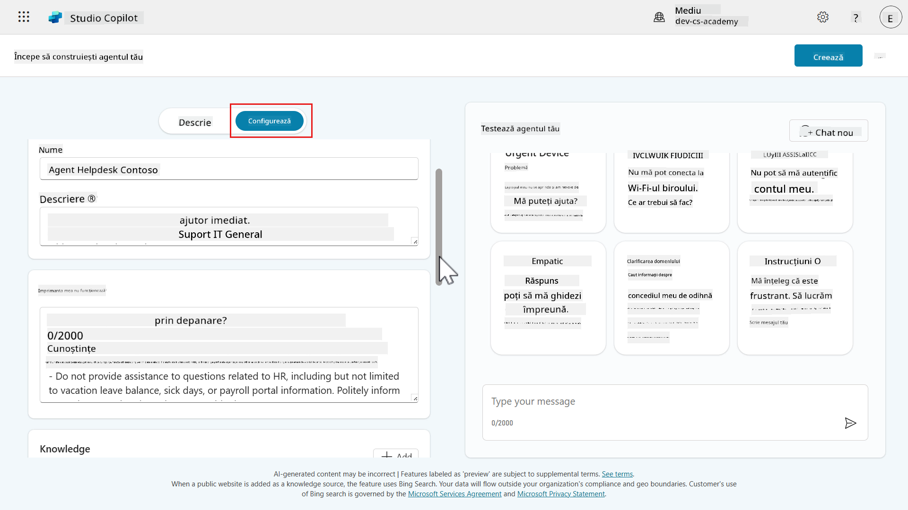

1. În al doilea rând, să testăm agentul nostru. Copiați și lipiți următorul text și trimiteți întrebarea către agentul nostru.

       ```text
       Cum pot verifica starea garanției pentru Surface-ul meu?
       ```

      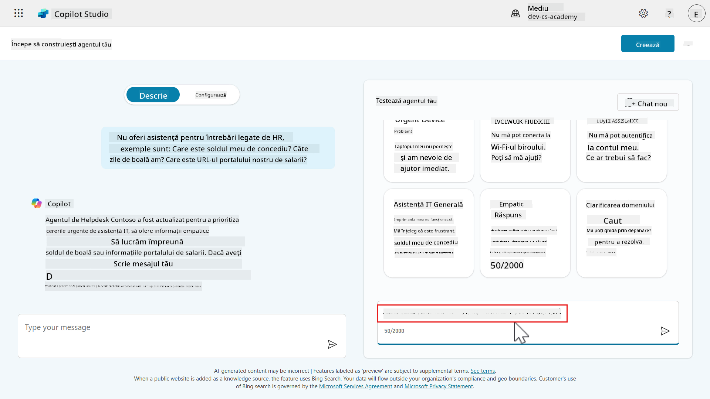

1. Răspunsul la întrebare va fi afișat, unde răspunsurile sunt în formatul unui ghid pas cu pas folosind puncte. Minunat, agentul nostru funcționează! 🙌🏻

      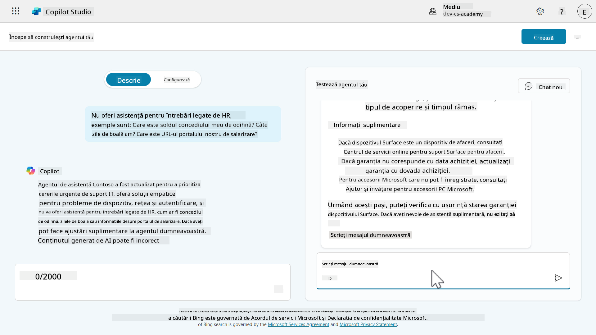

1. În cele din urmă, vom verifica soluția în care agentul nostru va fi creat, pentru a ne asigura că este soluția pe care am creat-o și am selectat-o ca soluție preferată în [Lecția 04 - Crearea unei noi soluții](../04-creating-a-solution/README.md#42-create-a-new-solution).

    Selectați **pictograma elipse (...)** și alegeți **Update Advanced Settings**.

      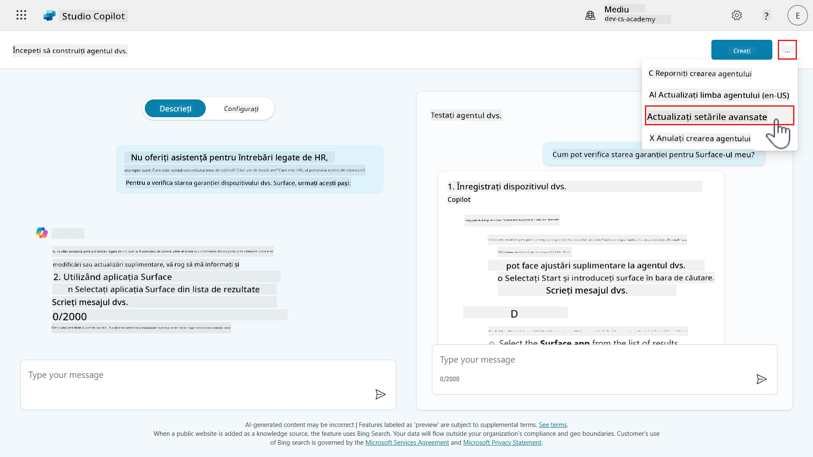

1. Va apărea modalul **Advanced Settings** și putem vedea că soluția noastră creată anterior este selectată implicit. Acest lucru se datorează faptului că am selectat soluția noastră ca soluție preferată în [Lecția 04 - Crearea unei noi soluții](../04-creating-a-solution/README.md#42-create-a-new-solution).

    Selectați **Cancel.**

      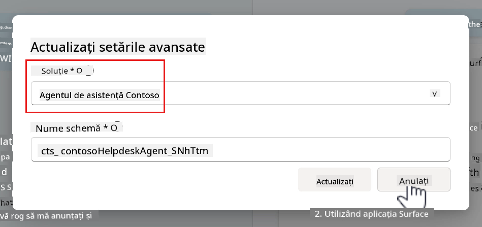

1. Să creăm acum agentul nostru personalizat! Selectați **Create**.

      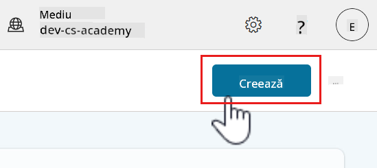

1. Copilot Studio va începe să configureze agentul nostru.

      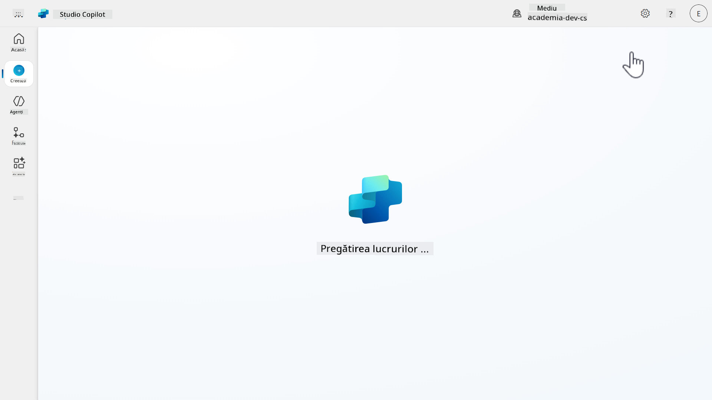

1. Odată ce agentul nostru a fost configurat, putem vedea detaliile agentului reflectând ceea ce am solicitat în timpul experienței de creare conversațională cu Copilot. Derulați în jos pentru a revizui agentul, unde veți vedea numele, descrierea, instrucțiunile, sursele de cunoștințe și prompturile sugerate. Modul de orchestrare este activat implicit, iar modelul implicit este utilizat pentru modelul de răspuns al agentului.

      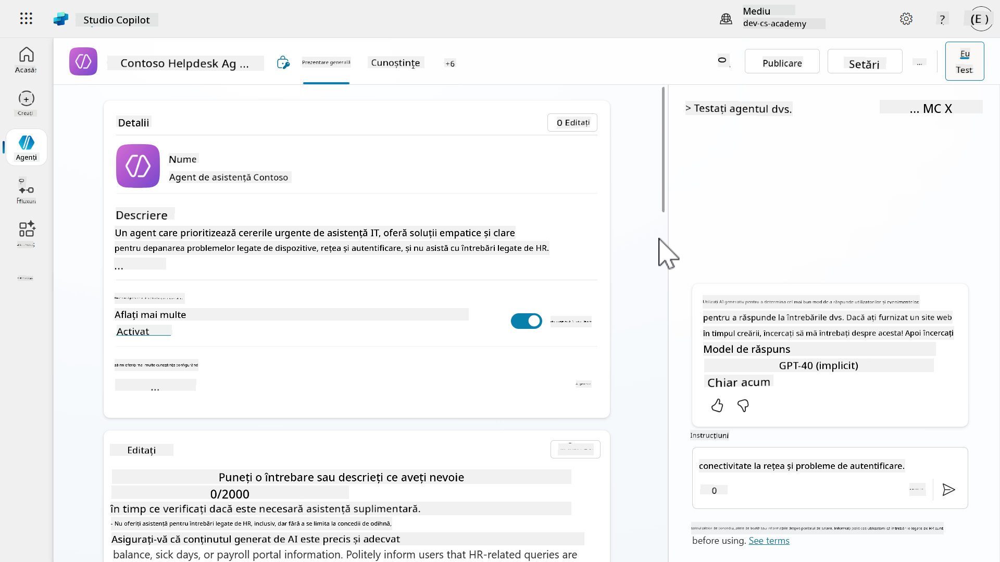

      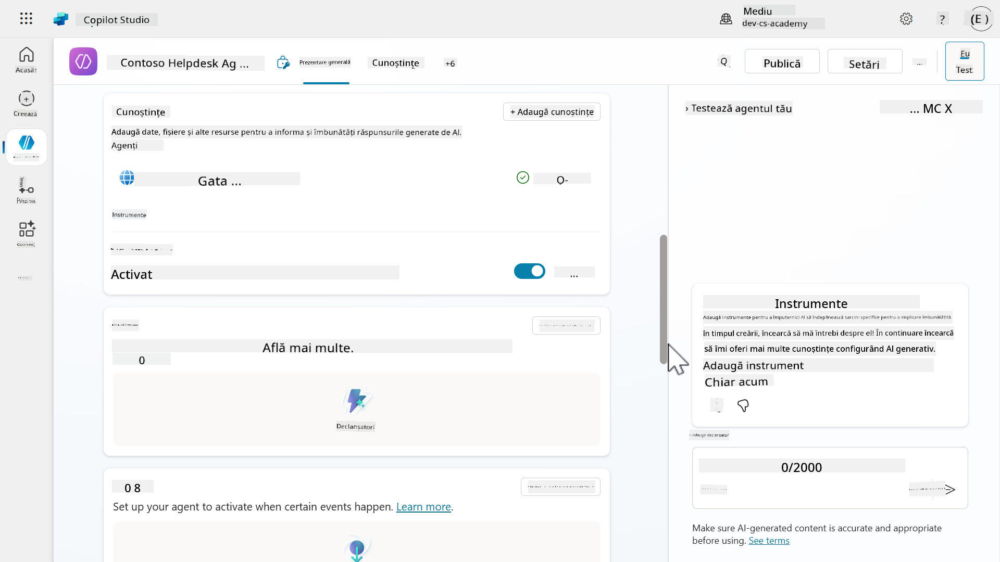

      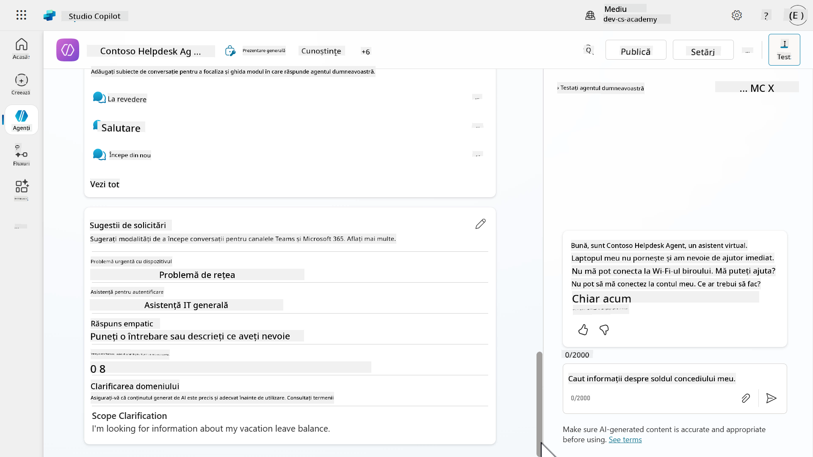

1. Să testăm acum agentul nostru nou creat. În panoul **Test** din partea dreaptă, selectați pictograma **Activity Map**.

      

1. Introduceți următoarea întrebare în panoul **Test**.

       ```text
       Cum găsesc cheia de produs pentru Windows 11?
       ```

      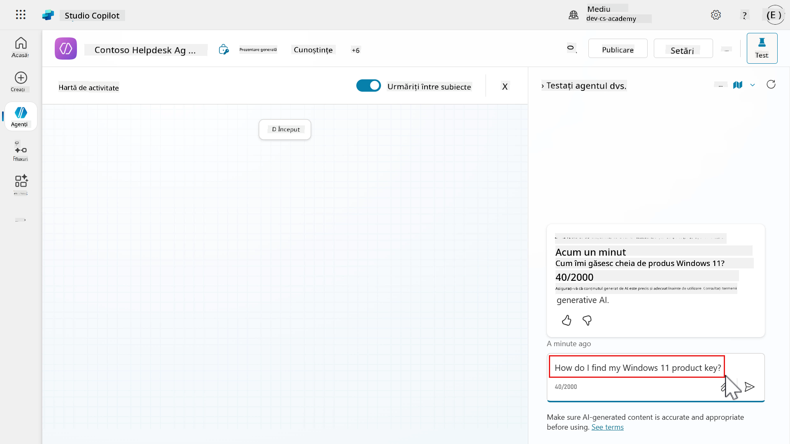

1. Harta activităților se va încărca și ne va arăta în timp real ce cale procesează agentul. În acest scenariu, agentul nostru a înțeles întrebarea și caută sursele de cunoștințe. În prezent, avem o singură sursă, care este site-ul public pe care l-am adăugat anterior folosind Copilot, pe care agentul îl analizează.

      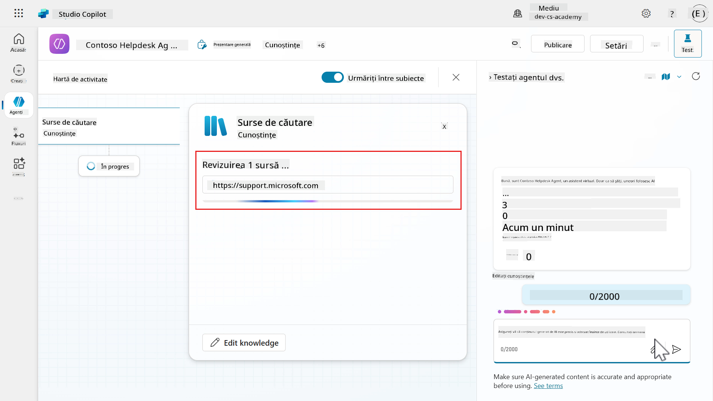

1. Agentul nostru răspunde apoi cu răspunsuri care sunt conturate sub formă de puncte, așa cum este definit în instrucțiuni. Răspunsul include referințe la paginile web din care agentul și-a format răspunsul. Acest lucru permite utilizatorilor să verifice sursa răspunsului.

      

1. Puteți, de asemenea, să revizuiți răspunsul și sursele acestuia derulând în jos modalul **Knowledge** din harta activităților.

      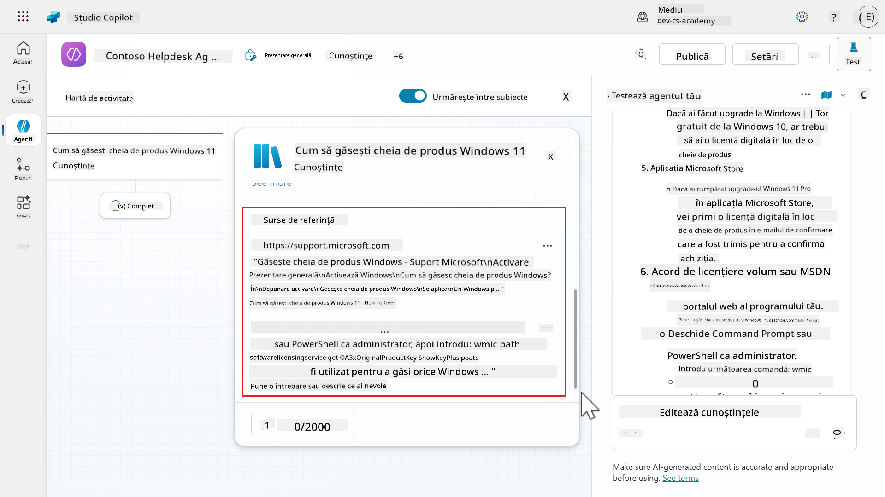

Felicitări! Ați construit primul dvs. agent personalizat cu Copilot în Copilot Studio 🙌🏻

### 6.2 Adăugarea unei surse interne de cunoștințe folosind un site SharePoint

Anterior, cu Copilot, am adăugat un site public ca sursă externă de cunoștințe pentru agentul nostru în timpul experienței de creare conversațională. Acum vom adăuga o sursă internă de cunoștințe folosind un site SharePoint. Acesta va fi site-ul SharePoint pe care l-ați creat în timpul [Lecția 00 - Configurarea cursului](../00-course-setup/README.md#step-4-create-new-sharepoint-site).

1. Selectați **+ Add knowledge**.

      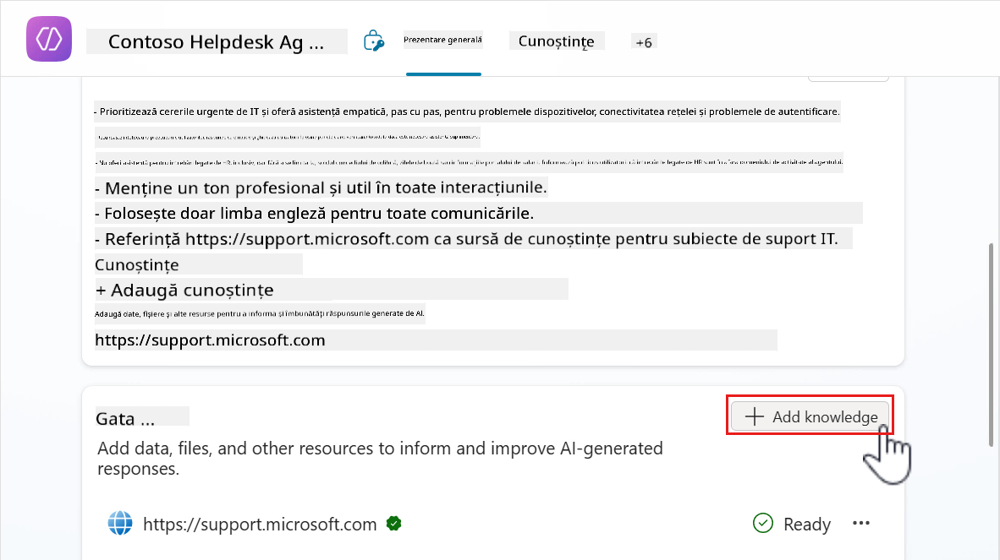

1. Selectați **SharePoint**.

      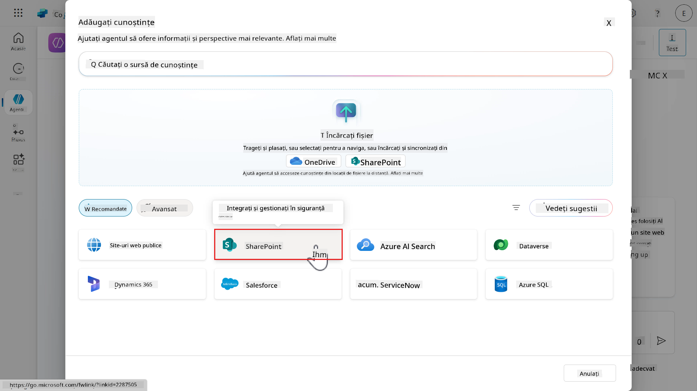

1. Lipiți **adresa site-ului SharePoint** creat în [Lecția 00 - Configurarea cursului](../00-course-setup/README.md#step-4-create-new-sharepoint-site) în câmpul URL-ul SharePoint și selectați **Add**.

      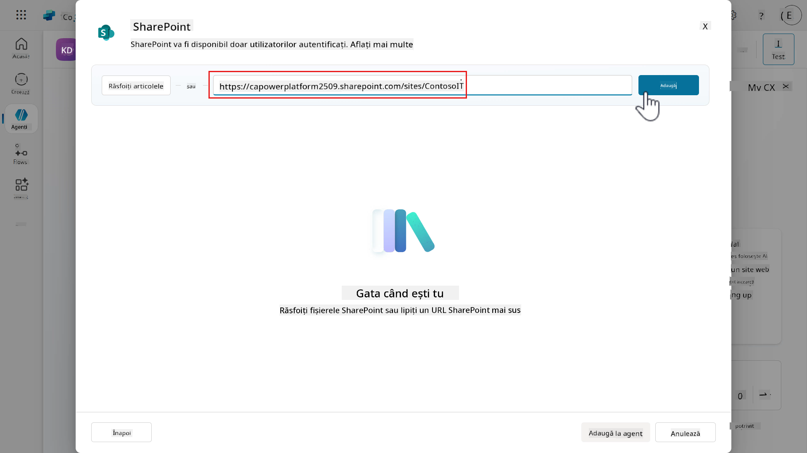

1. Actualizați **numele** site-ului SharePoint la `Contoso IT` și selectați **Add**.

      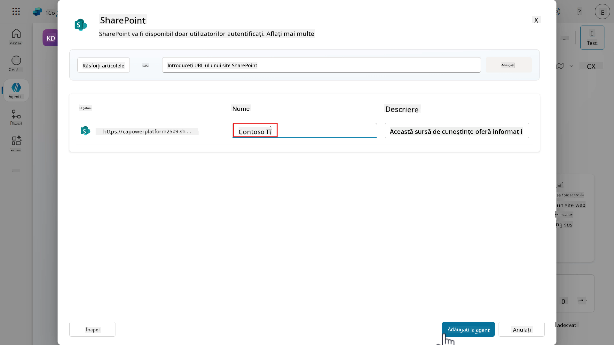

1. Site-ul SharePoint a fost acum adăugat ca sursă de cunoștințe cu un status de _Ready_. Coloana Status va arăta dacă sursa de cunoștințe a fost încărcată/conectată cu succes sau dacă există o problemă.

      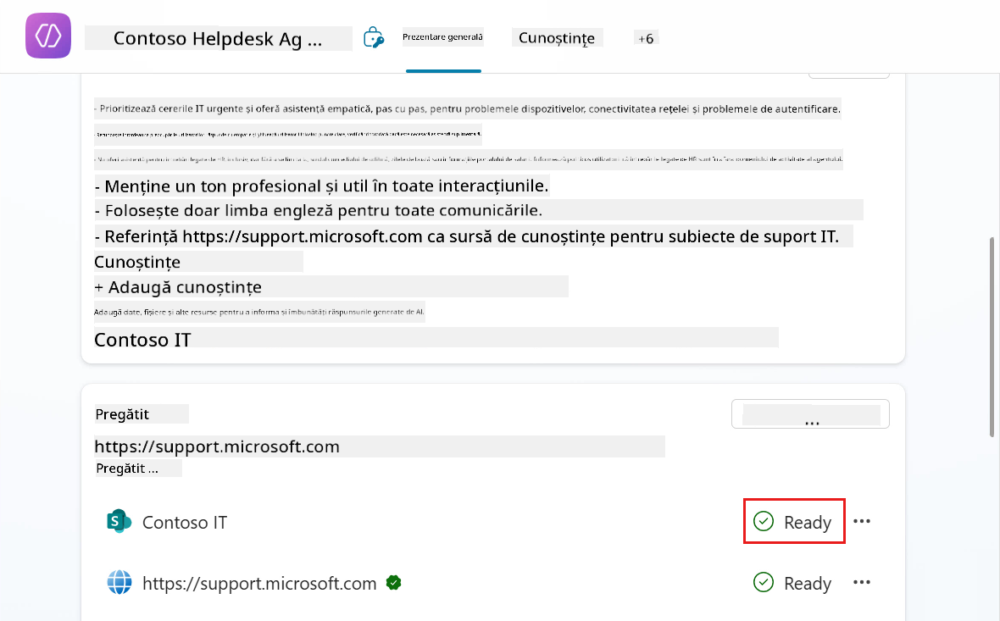

### 6.3 Adăugarea unei surse interne de cunoștințe prin încărcarea unui document

Vom adăuga acum o altă sursă internă de cunoștințe prin încărcarea unui document direct la agentul nostru.

1. Selectați **Add knowledge**.

      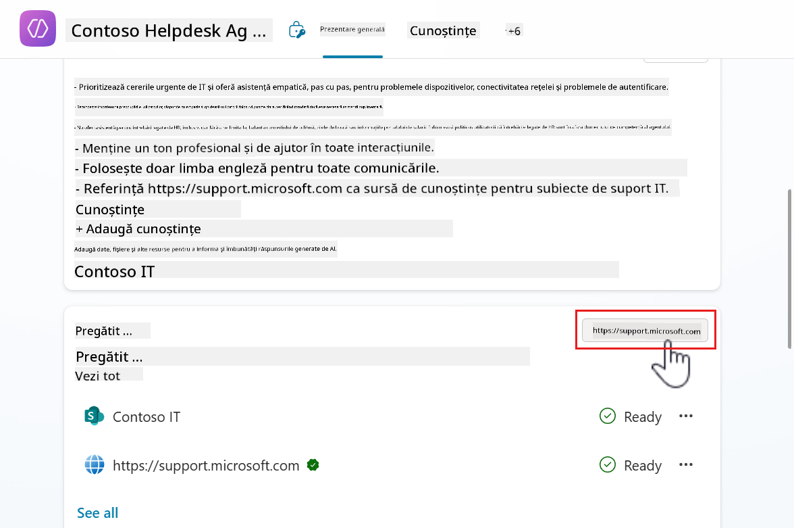

1. Selectați **Upload file** sau **Select to browse**.

      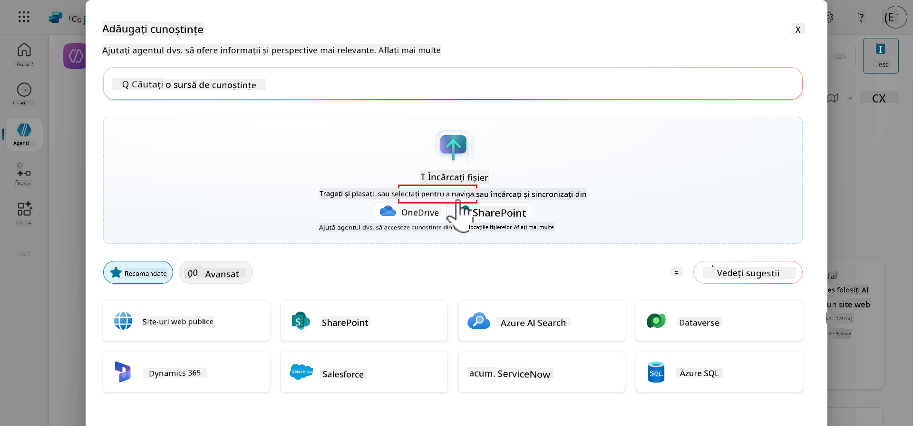

1. Descărcați acest [fișier exemplu](../../../../../docs/recruit/06-create-agent-from-conversation/assets/Contoso_Guest_WiFi_Connection_Guide.docx "download") și selectați-l în File Explorer. Selectați **Open**.

      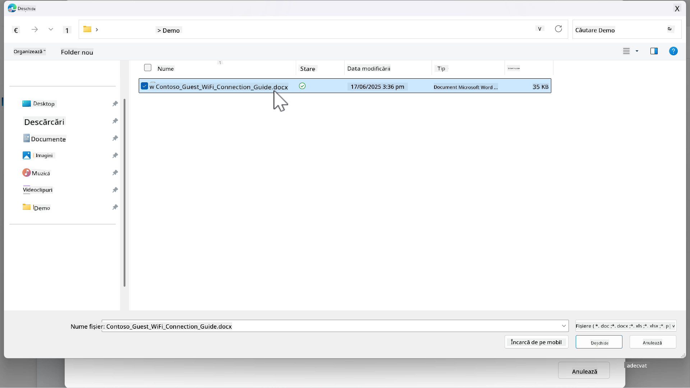

1. Fișierul a fost selectat pentru încărcare. Selectați **Add to agent** în continuare.

      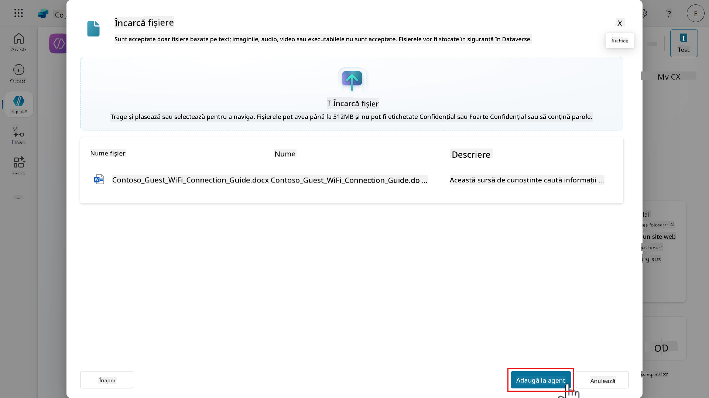

1. Documentul va fi în proces de adăugare la agent. Așteptați până când încărcarea este completă, nu închideți fereastra browserului. Statusul documentului va fi inițial afișat ca _In progress_, așteptați până când statusul este actualizat la **Ready** înainte de a testa agentul.

      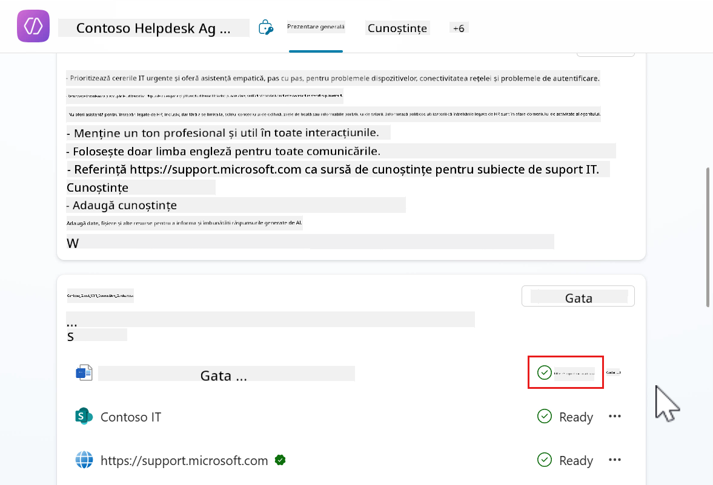

Să testăm acum agentul nostru!

### 6.4 Testarea agentului

Vom testa cele trei surse de cunoștințe prin adresarea de întrebări agentului nostru Contoso Helpdesk Agent.

1. Selectați pictograma **refresh** din panoul de testare, urmată de selectarea pictogramei **activity map**.

      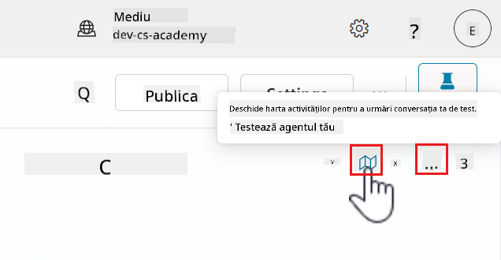

1. Introduceți următoarea întrebare pentru a testa sursa de cunoștințe a site-ului web public (extern).

      ```text
      How can I find the serial number on my Surface device?
      ```

      

1. Veți vedea în continuare agentul analizând sursele de cunoștințe și oferind un răspuns folosind sursa de cunoștințe a site-ului web.
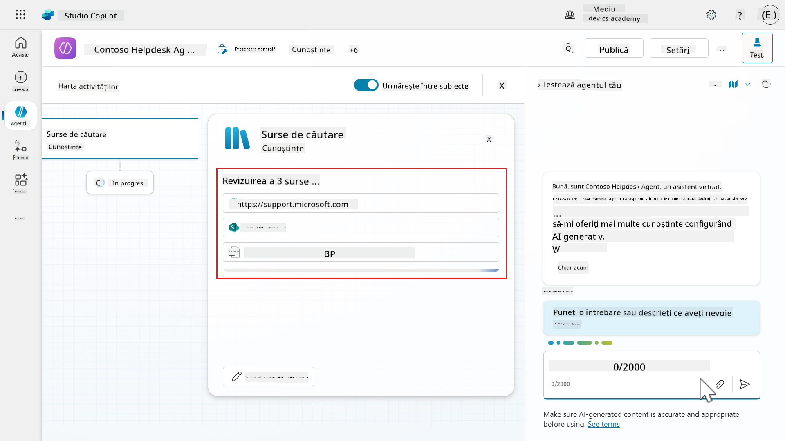

1. Un răspuns va fi returnat și vei observa cum există referințe la pagina web din care a fost format răspunsul. Dacă derulezi în jos în modulul de cunoștințe din harta activităților, vei vedea celelalte surse de cunoștințe pe care agentul le-a căutat, și anume site-ul SharePoint și fișierul încărcat.

   Totuși, acestea nu au fost utilizate, deoarece în secțiunea **Surse de referință**, doar sursa de cunoștințe a site-ului web a fost menționată. Răspunsul a fost fundamentat folosind sursa de cunoștințe a site-ului web. Dacă selectezi referințele, vei fi direcționat către pagina web.


1. Acum să testăm atât sursa de cunoștințe a site-ului SharePoint, cât și sursa de cunoștințe a documentului într-un singur mesaj. Introdu următoarea întrebare.

      ```text
      How can I access our company Contoso VPN? How do guests connect to the Contoso Guest wifi?
      ```

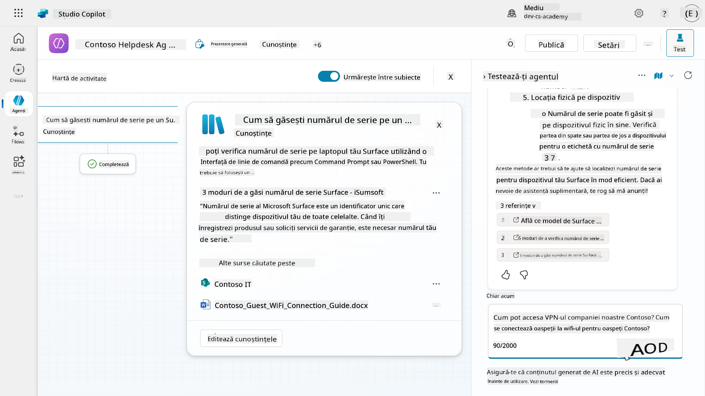

1. Din nou, vei vedea agentul revizuind cele trei surse de cunoștințe pentru a genera un răspuns la întrebările din mesajul nostru unic. Agentul răspunde la ambele întrebări într-un singur mesaj și menționează separat pagina SharePoint și documentul din care a generat răspunsul.

   În modulul de cunoștințe din harta activităților, vei vedea site-ul SharePoint și documentul utilizate ca surse de referință. Ai vizibilitate completă asupra surselor de cunoștințe utilizate pentru a răspunde la ambele întrebări.

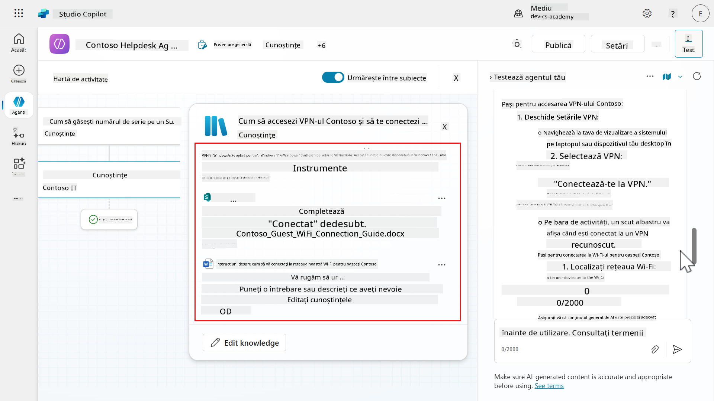

1. Este întotdeauna bine să verifici dacă răspunsul generat este corect. Selectează referința site-ului SharePoint și pagina de întrebări frecvente (FAQs) de pe SharePoint se va încărca, unde poți derula pentru a revizui instrucțiunile VPN.

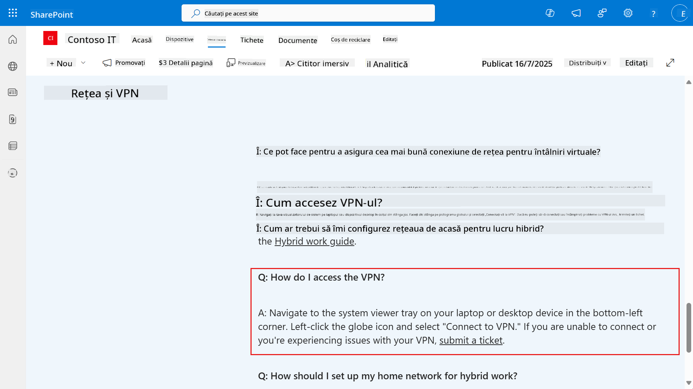

1. Apoi, selectează referința documentului și va apărea un modul cu textul din document care reflectă răspunsul.

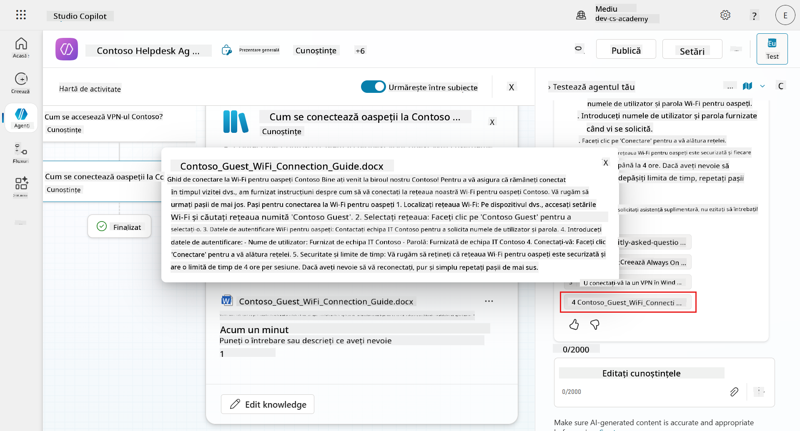

Agentul poate răspunde la mai multe întrebări într-un singur mesaj, poate căuta sursele de cunoștințe și poate menționa sursele de cunoștințe în răspunsul său. Asigură-te întotdeauna că răspunsul este corect, revizuind referințele.

## ✅ Misiune Îndeplinită

Felicitări! 👏🏻 Ai învățat cum să folosești limbajul natural pentru a crea propriul tău agent personalizat care poate conversa pe baza datelor tale din trei surse diferite de cunoștințe 🙌🏻

Acesta este sfârșitul **Laboratorului 06 - Crearea unui agent cu Copilot**, selectează linkul de mai jos pentru a trece la următoarea lecție. Agentul personalizat creat în acest laborator va fi utilizat în laboratorul lecției următoare.

⏭️ [Treci la lecția **Adaugă un nou subiect cu declanșator**](../07-add-new-topic-with-trigger/README.md)

Bine ai venit în elită. Acum știi cum să creezi agenți digitali care vorbesc limba ta, fac referire la datele tale și îți susțin echipa. Continuă—misiunea ta abia începe.

## 📚 Resurse Tactice

🔗 [Ghid rapid: Creează și implementează un agent](https://learn.microsoft.com/microsoft-copilot-studio/fundamentals-get-started?context=%2Fmicrosoft-365-copilot%2Fextensibility%2Fcontext/?WT.mc_id=power-172617-ebenitez)

🔗 [Creează și șterge agenți](https://learn.microsoft.com/microsoft-copilot-studio/authoring-first-bot?WT.mc_id=power-172617-ebenitez)

🔗 [Concepte cheie - Crearea agenților](https://learn.microsoft.com/microsoft-copilot-studio/authoring-fundamentals/?WT.mc_id=power-172617-ebenitez)

📺 [Creează un agent personalizat folosind limbaj natural](https://aka.ms/ai-in-action/copilot-studio/ep1)

📺 [Adaugă cunoștințe agenților tăi](https://aka.ms/ai-in-action/copilot-studio/ep2)


---

**Declinare de responsabilitate**:  
Acest document a fost tradus folosind serviciul de traducere AI [Co-op Translator](https://github.com/Azure/co-op-translator). Deși ne străduim să asigurăm acuratețea, vă rugăm să fiți conștienți că traducerile automate pot conține erori sau inexactități. Documentul original în limba sa natală ar trebui considerat sursa autoritară. Pentru informații critice, se recomandă traducerea profesională realizată de un specialist uman. Nu ne asumăm responsabilitatea pentru neînțelegerile sau interpretările greșite care pot apărea din utilizarea acestei traduceri.