<!--
CO_OP_TRANSLATOR_METADATA:
{
  "original_hash": "cd99a76bcb7372ac2771b6ae178b023d",
  "translation_date": "2025-10-20T17:51:56+00:00",
  "source_file": "docs/recruit/10-add-event-triggers/README.md",
  "language_code": "ro"
}
-->
# 🚨 Misiunea 10: Adăugarea declanșatorilor de evenimente - Activarea capacităților agentului autonom

## 🕵️‍♂️ NUME DE COD: `OPERAȚIUNEA RUTINA FANTOMĂ`

> **⏱️ Fereastra de timp a operațiunii:** `~45 minute`

🎥 **Urmărește demonstrația**

[](https://www.youtube.com/watch?v=ZgwHL8PQ1nY "Urmărește demonstrația pe YouTube")

## 🎯 Scopul misiunii

Este momentul să îți transformi agentul dintr-un asistent conversațional într-un operativ autonom. Misiunea ta este să îi permiți agentului să acționeze fără a fi chemat - răspunzând semnalelor din domeniul tău digital cu precizie și rapiditate.

Cu declanșatori de evenimente, vei antrena agentul să monitorizeze sisteme externe precum SharePoint, Teams și Outlook și să execute acțiuni inteligente imediat ce primește un semnal. Această operațiune transformă agentul tău într-un activ complet operațional - silențios, rapid și mereu vigilent.

Succesul înseamnă construirea de agenți care inițiază valoare - nu doar răspund la aceasta.

## 🔎 Obiective

📖 Această lecție va acoperi:

- Înțelegerea declanșatorilor de evenimente și cum permit comportamentul autonom al agentului
- Diferența dintre declanșatorii de evenimente și declanșatorii de subiecte, inclusiv fluxurile de declanșare și pachetele de date
- Explorarea scenariilor comune pentru declanșatorii de evenimente
- Înțelegerea considerațiilor privind autentificarea, securitatea și publicarea pentru agenții bazați pe evenimente
- Construirea unui agent autonom pentru Help Desk IT care răspunde la evenimentele din SharePoint și trimite recunoașteri prin email

## 🤔 Ce este un declanșator de eveniment?

Un **declanșator de eveniment** este un mecanism care permite agentului tău să acționeze autonom ca răspuns la evenimente externe, fără a necesita input direct de la utilizator. Gândește-te la el ca la o modalitate de a face agentul să "observe" evenimente specifice și să acționeze automat atunci când acestea au loc.

Spre deosebire de declanșatorii de subiecte, care necesită ca utilizatorii să tasteze ceva pentru a activa o conversație, declanșatorii de evenimente se activează pe baza lucrurilor care se întâmplă în sistemele conectate. De exemplu:

- Când un fișier nou este creat în SharePoint sau OneDrive for Business
- Când un înregistrare este creată în Dataverse
- Când o sarcină este finalizată în Planner
- Când un răspuns nou la un formular Microsoft este trimis
- Când un mesaj nou este adăugat în Microsoft Teams
- Pe baza unui program recurent (cum ar fi mementouri zilnice)  
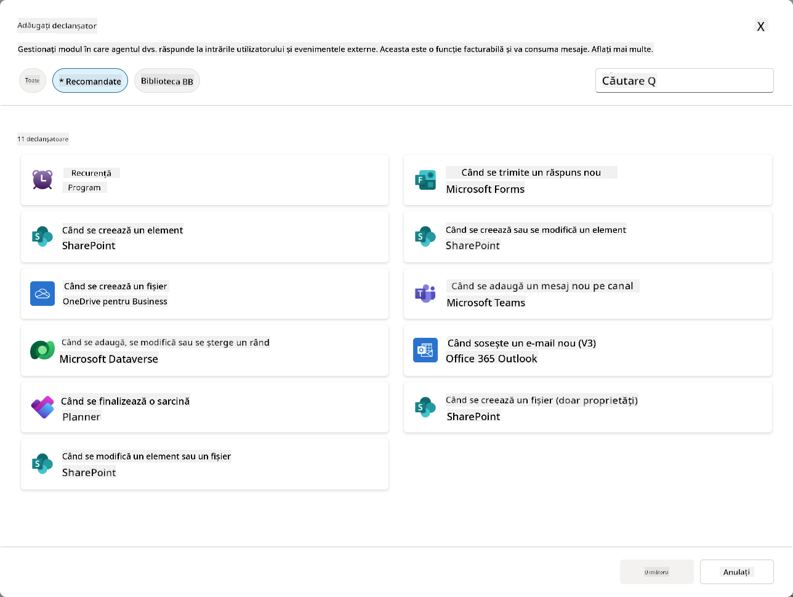

### De ce sunt importanți declanșatorii de evenimente pentru agenții autonomi

Declanșatorii de evenimente transformă agentul tău dintr-un asistent reactiv într-un ajutor proactiv și autonom:

1. **Operare autonomă** - agentul tău poate lucra 24/7 fără intervenția umană, răspunzând la evenimente pe măsură ce acestea se întâmplă.
    - *Exemplu:* Bine ai venit automat noilor membri ai echipei când sunt adăugați într-o echipă.

1. **Reactivitate în timp real** - în loc să aștepte ca utilizatorii să pună întrebări, agentul tău răspunde imediat la evenimentele relevante.
    - *Exemplu*: Alertează echipa IT când un document SharePoint este modificat.

1. **Automatizarea fluxurilor de lucru** - leagă mai multe acțiuni pe baza unui singur eveniment declanșator.
    - *Exemplu:* Când se creează un tichet de suport nou, creează o sarcină, notifică managerul și actualizează tabloul de bord de urmărire.

1. **Procese consistente** - asigură-te că pașii importanți nu sunt niciodată omisi prin automatizarea răspunsurilor la evenimente cheie.
    - *Exemplu:* Fiecare angajat nou primește automat materiale de onboarding și cereri de acces.

1. **Acțiuni bazate pe date** - folosește informațiile din evenimentul declanșator pentru a lua decizii inteligente și a întreprinde acțiuni adecvate.
    - *Exemplu:* Direcționează tichetele urgente către personalul senior pe baza nivelului de prioritate din pachetul de date al declanșatorului.

## ⚙️ Cum funcționează declanșatorii de evenimente?

Declanșatorii de evenimente funcționează printr-un flux de lucru în trei pași care permite agentului tău să răspundă autonom la evenimente externe:

### Fluxul de lucru al declanșatorului

1. **Detectarea evenimentului** - Un eveniment specific are loc într-un sistem conectat (SharePoint, Teams, Outlook etc.)
1. **Activarea declanșatorului** - Declanșatorul de eveniment detectează acest eveniment și trimite un pachet de date către agentul tău printr-un Power Automate Cloud Flow.
1. **Răspunsul agentului** - Agentul tău primește pachetul de date și execută instrucțiunile pe care le-ai definit.

### Declanșatori de evenimente vs declanșatori de subiecte

Înțelegerea diferenței dintre aceste două tipuri de declanșatori este crucială:

| **Declanșatori de evenimente** | **Declanșatori de subiecte** |
|-------------------|-------------------|
| Activați de evenimentele din sistemele externe | Activați de inputul utilizatorului/fraze |
| Permit comportamentul autonom al agentului | Permit răspunsuri conversaționale |
| Folosesc autentificarea creatorului | Opțiune pentru autentificarea utilizatorului |
| Rulează fără interacțiunea utilizatorului | Necesită ca utilizatorul să înceapă conversația |
| Exemple: Fișier creat, email primit | Exemplu: "Cum e vremea?" |

## 📦 Înțelegerea pachetelor de date ale declanșatorilor

Când are loc un eveniment, declanșatorul trimite un **pachet de date** către agentul tău, care conține informații despre eveniment și instrucțiuni despre cum să răspundă.

### Pachete de date implicite vs personalizate

Fiecare tip de declanșator vine cu o structură de pachet de date implicită, dar o poți personaliza:

**Pachet de date implicit** - Folosește formatul standard, cum ar fi `Folosește conținutul din {Body}`

- Conține informații de bază despre eveniment
- Folosește instrucțiuni de procesare generice
- Bun pentru scenarii simple

**Pachet de date personalizat** - Adaugă instrucțiuni specifice și formatarea datelor

- Include direcții detaliate pentru agentul tău
- Specifică exact ce date să folosească și cum
- Mai bun pentru fluxuri de lucru complexe

### Instrucțiuni pentru agent vs instrucțiuni pentru pachetul de date personalizat

Ai două locuri unde poți ghida comportamentul agentului tău cu declanșatori de evenimente:

**Instrucțiuni pentru agent** (Generale)

- Ghidare generală care se aplică tuturor declanșatorilor
- Exemplu: "Când procesezi tichete, verifică întotdeauna mai întâi duplicatele"
- Cel mai potrivit pentru modele generale de comportament

**Instrucțiuni pentru pachetul de date** (Specifice declanșatorului)

- Direcții specifice pentru tipuri individuale de declanșatori  
- Exemplu: "Pentru această actualizare din SharePoint, trimite un rezumat canalului de proiect"
- Cel mai potrivit pentru agenți complexi cu mai mulți declanșatori

💡 **Sfat util**: Evită instrucțiunile contradictorii între aceste două niveluri, deoarece acest lucru poate cauza comportamente neașteptate.

## 🎯 Scenarii comune pentru declanșatorii de evenimente

Iată câteva exemple practice despre cum declanșatorii de evenimente pot îmbunătăți agentul tău:

### Agent Help Desk IT

- **Declanșator**: Element nou în lista SharePoint (tichet de suport)
- **Acțiune**: Categorizează automat, atribuie prioritate și notifică membrii echipei corespunzători

### Agent de onboarding pentru angajați

- **Declanșator**: Utilizator nou adăugat în Dataverse
- **Acțiune**: Trimite mesaj de bun venit, creează sarcini de onboarding și oferă acces

### Agent de management de proiect

- **Declanșator**: Sarcină finalizată în Planner
- **Acțiune**: Actualizează tabloul de bord al proiectului, notifică părțile interesate și verifică blocajele

### Agent de gestionare a documentelor

- **Declanșator**: Fișier încărcat într-un folder specific din SharePoint
- **Acțiune**: Extrage metadate, aplică etichete și notifică proprietarii documentului

### Asistent pentru întâlniri

- **Declanșator**: Eveniment de calendar creat
- **Acțiune**: Trimite mementouri și agenda înainte de întâlnire, rezervă resurse

## ⚠️ Considerații privind publicarea și autentificarea

Înainte ca agentul tău să poată folosi declanșatorii de evenimente în producție, trebuie să înțelegi implicațiile autentificării și securității.

### Autentificarea creatorului

Declanșatorii de evenimente folosesc **credibilitatea creatorului agentului** pentru toate autentificările:

- Agentul tău accesează sistemele folosind permisiunile tale
- Utilizatorii pot accesa date prin credibilitatea ta
- Toate acțiunile sunt efectuate "în numele tău" chiar și atunci când utilizatorii interacționează cu agentul

### Cele mai bune practici pentru protecția datelor

Pentru a menține securitatea atunci când publici agenți cu declanșatori de evenimente:

1. **Evaluează accesul la date** - Revizuiește ce sisteme și date pot accesa declanșatorii tăi
1. **Testează temeinic** - Înțelege ce informații includ declanșatorii în pachetele de date
1. **Restrânge domeniul declanșatorului** - Folosește parametri specifici pentru a limita ce evenimente activează declanșatorii
1. **Revizuiește datele din pachet** - Asigură-te că declanșatorii nu expun informații sensibile
1. **Monitorizează utilizarea** - Urmărește activitatea declanșatorilor și consumul de resurse

## ⚠️ Depanare și limitări

Ține cont de aceste considerații importante atunci când lucrezi cu declanșatori de evenimente:

### Impactul asupra cotelor și facturării

- Fiecare activare a declanșatorului se contorizează în consumul de mesaje
- Declanșatorii frecvenți (cum ar fi recurența la fiecare minut) pot consuma rapid cota
- Monitorizează utilizarea pentru a evita limitările

### Cerințe tehnice

- Disponibil doar pentru agenții cu orchestrare generativă activată
- Necesită activarea partajării fluxului de cloud conștient de soluție în mediul tău

### Prevenirea pierderii datelor (DLP)

- Politicile DLP ale organizației tale determină ce declanșatori sunt disponibili
- Administratorii pot bloca complet declanșatorii de evenimente
- Contactează administratorul dacă declanșatorii așteptați nu sunt disponibili

## 🧪 Laboratorul 10 - Adăugarea declanșatorilor de evenimente pentru comportamentul autonom al agentului

### 🎯 Caz de utilizare

Vei îmbunătăți agentul tău Help Desk IT pentru a răspunde automat la cererile noi de suport. Când cineva creează un element nou în lista de tichete de suport din SharePoint, agentul tău va:

1. Se va declanșa autonom când tichetul SharePoint este creat
1. Va furniza detaliile tichetului și instrucțiuni despre pașii pe care dorești să îi urmeze
1. Va recunoaște automat tichetul către expeditor printr-un email generat de AI

Acest laborator demonstrează cum declanșatorii de evenimente permit un comportament cu adevărat autonom al agentului.

### Cerințe preliminare

Înainte de a începe acest laborator, asigură-te că ai:

- ✅ Finalizat laboratoarele anterioare (în special Laboratoarele 6-8 pentru agentul Help Desk IT)
- ✅ Acces la site-ul SharePoint cu lista de tichete de suport IT
- ✅ Mediu Copilot Studio cu declanșatori de evenimente activați
- ✅ Agentul tău are orchestrare generativă activată
- ✅ Permisiuni adecvate în SharePoint și în mediul Copilot Studio

### 10.1 Activează AI generativ și creează un declanșator pentru crearea unui element în SharePoint

1. Deschide **agentul Help Desk IT** în **Copilot Studio**

1. Mai întâi, asigură-te că **AI generativ** este activat pentru agentul tău:
   - Navighează la fila **Overview**
   - Sub secțiunea Orchestrare, activează **Generative orchestration** dacă nu este deja activat  
     

1. Navighează la fila **Overview** și localizează secțiunea **Triggers**

1. Apasă pe **+ Add trigger** pentru a deschide biblioteca de declanșatori  
    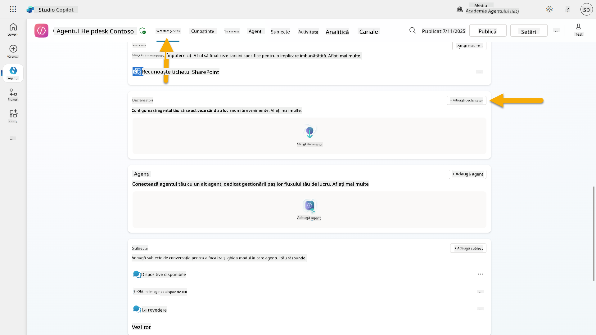

1. Caută și selectează **When an item is created** (SharePoint)  
    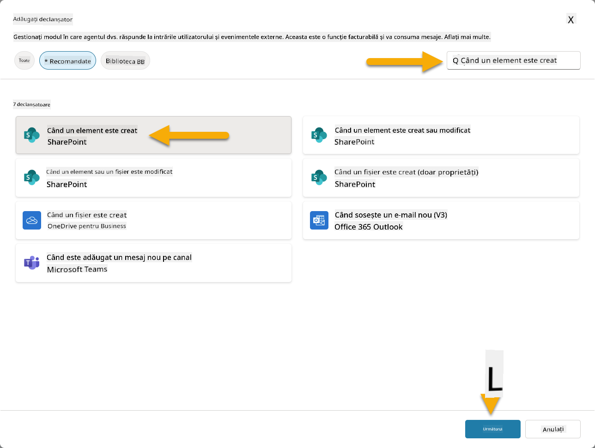

1. Configurează numele declanșatorului și conexiunile:

   - **Nume declanșator:** Tichet nou de suport creat în SharePoint

1. Așteaptă configurarea conexiunilor și selectează **Next** pentru a continua.  
   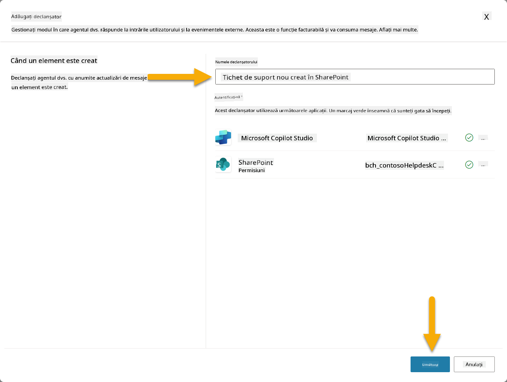

1. Configurează parametrii declanșatorului:

   - **Adresa site-ului**: Selectează site-ul SharePoint "Contoso IT"

   - **Numele listei**: Alege lista "Tickets"

   - **Instrucțiuni suplimentare pentru agent când este invocat de declanșator:**

     ```text
     New Support Ticket Created in SharePoint: {Body}
     
     Use the 'Acknowledge SharePoint Ticket' tool to generate the email body automatically and respond.
     
     IMPORTANT: Do not wait for any user input. Work completely autonomously.
     ```

     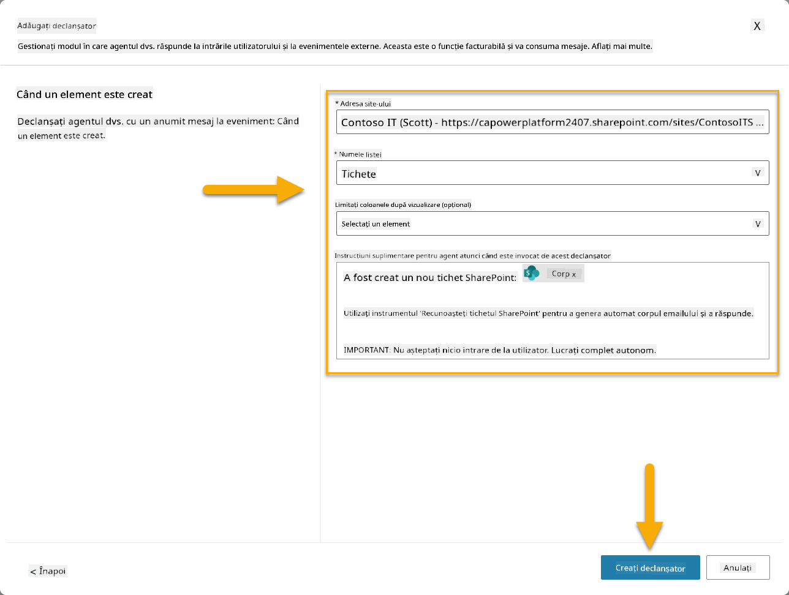

1. Selectează **Create trigger** pentru a finaliza crearea declanșatorului. Un Power Automate Cloud Flow este creat automat pentru a declanșa agentul autonom.

1. Selectează **Close**.

### 10.2 Editează declanșatorul

1. În secțiunea **Triggers** din fila **Overview**, selectează meniul **...** de lângă declanșatorul **New Support Ticket Created in SharePoint**

1. Selectează **Edit in Power Automate**  
   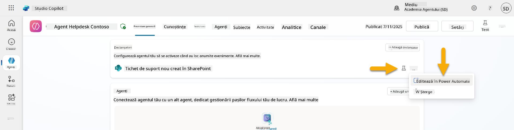

1. Selectează nodul **Sends a prompt to the specified copilot for processing**

1. În câmpul **Body/message**, elimină conținutul Body, **apasă tasta slash** (/) și selectează **Insert Expression**  
   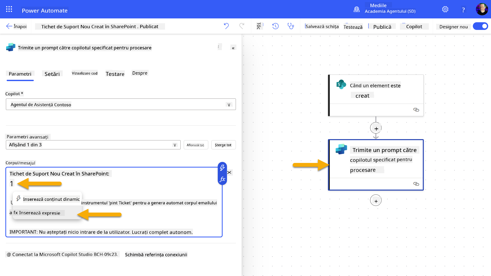

1. Introdu următoarea expresie pentru a oferi agentului detalii specifice despre tichet:

    ```text
    concat('Submitted By Name: ', first(triggerOutputs()?['body/value'])?['Author/DisplayName'], '\nSubmitted By Email: ', first(triggerOutputs()?['body/value'])?['Author/Email'], '\nTitle: ', first(triggerOutputs()?['body/value'])?['Title'], '\nIssue Description: ', first(triggerOutputs()?['body/value'])?['Description'], '\nPriority: ', first(triggerOutputs()?['body/value'])?['Priority/Value'],'\nTicket ID : ', first(triggerOutputs()?['body/value'])?['ID'])
    ```

1. Selectează **Add**  
   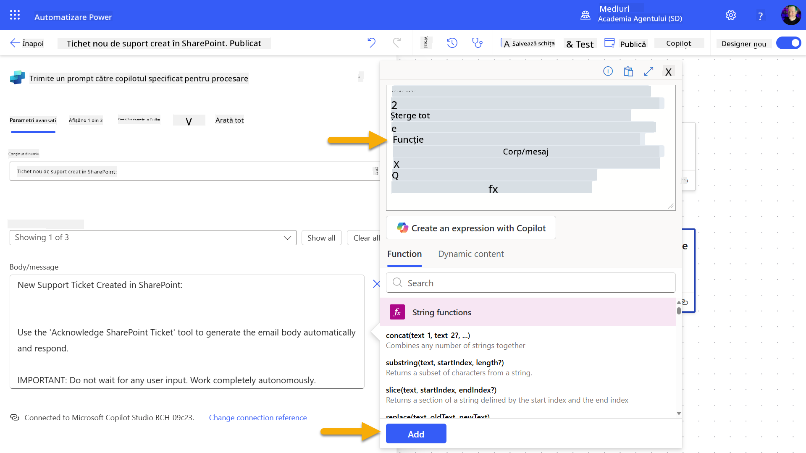

1. Selectează **Publish** din bara de instrumente din dreapta sus.

### 10.3 Creează un instrument pentru recunoașterea prin email

1. **Revin-o** la agentul tău în Copilot Studio

1. Navighează la fila **Tools** din agentul tău

1. Apasă pe **+ Add a tool** și selectează **Connector**

1. Caută și selectează conectorul **Send an email (V2)**  
    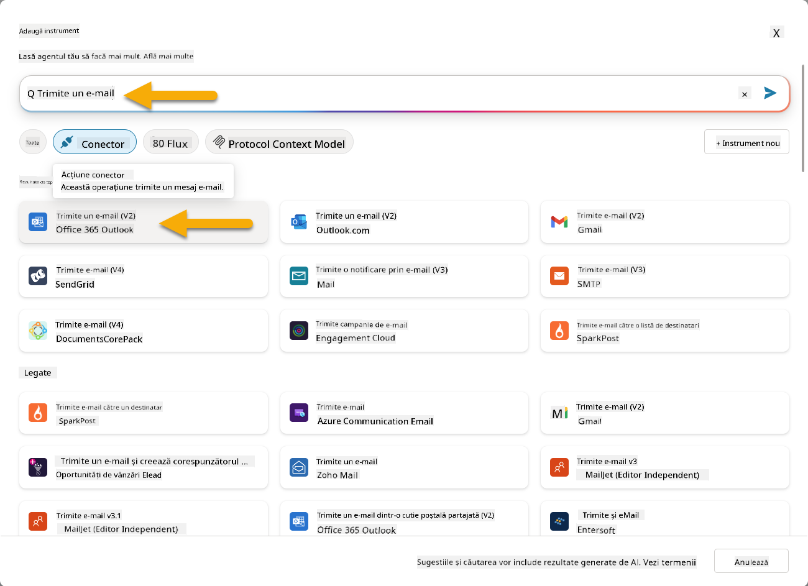

1. Așteaptă configurarea conexiunii, apoi selectează **Add and configure**

1. Configurează setările instrumentului:

   -
1. Deschideți un nou tab în browser și navigați la lista **SharePoint IT Support Tickets**.
1. Faceți clic pe **+ Adăugați un element nou** pentru a crea un tichet de test:
   - **Titlu**: "Nu se poate conecta la VPN"
   - **Descriere**: "Nu se poate conecta la rețeaua WIFI corporativă după actualizarea recentă"
   - **Prioritate**: "Normal"

1. **Salvați** elementul SharePoint  
    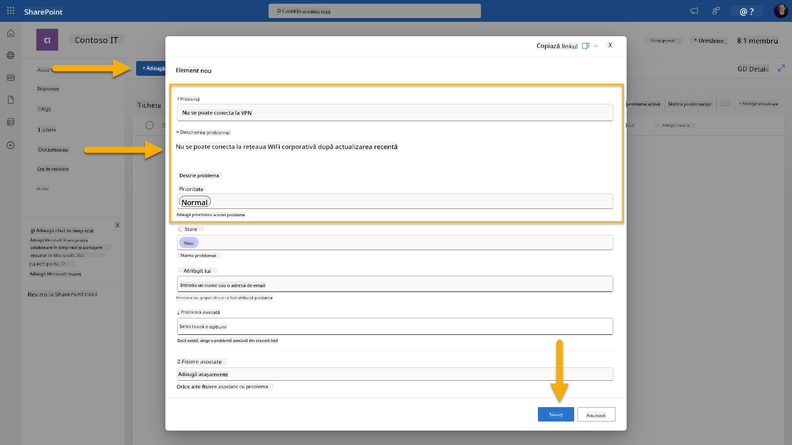
1. Reveniți la **Copilot Studio** și monitorizați panoul **Testați declanșatorul** pentru activarea declanșatorului. Utilizați pictograma **Reîmprospătare** pentru a încărca evenimentul declanșator, acest lucru poate dura câteva minute.  
    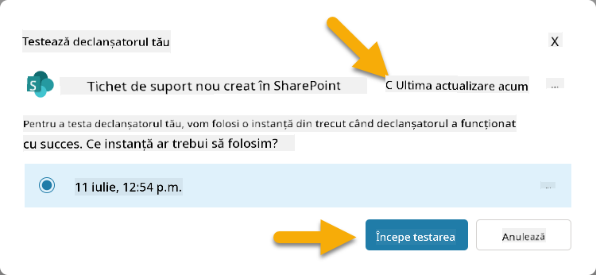
1. După ce declanșatorul apare, selectați **Începeți testarea**.
1. Selectați **Pictograma Harta Activităților** din partea de sus a panoului **Testați agentul**.
1. Verificați că agentul dvs.:
   - A primit datele declanșatorului
   - A apelat instrumentul "Confirmare tichet SharePoint"  
     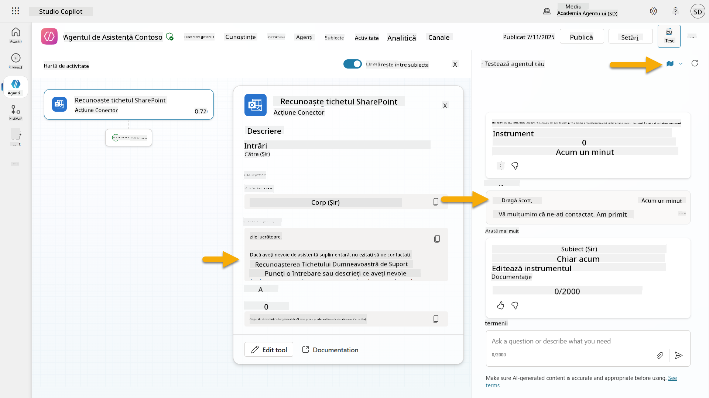
1. Verificați inbox-ul de email al persoanei care a trimis tichetul pentru a confirma că emailul de confirmare a fost trimis  
    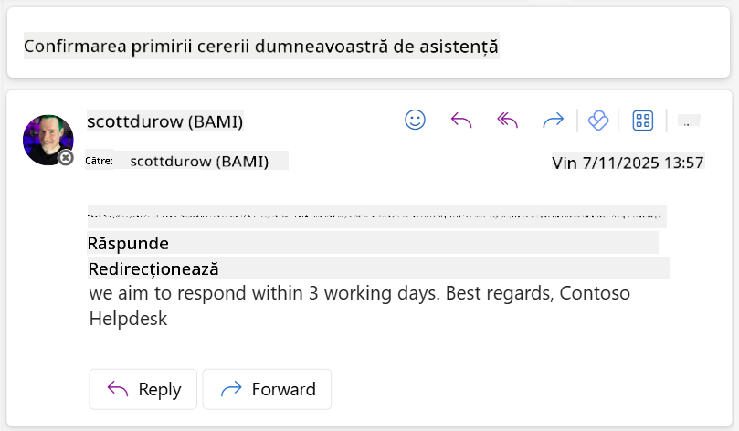
1. Examinați fila **Activitate** din Copilot Studio pentru a vedea execuția completă a declanșatorului și a instrumentului.

## ✅ Misiune Îndeplinită

🎉 **Felicitări!** Ați implementat cu succes declanșatoare de evenimente cu instrumente conector care permit agentului dvs. să funcționeze autonom, trimițând automat emailuri de confirmare și procesând tichete de suport fără intervenția utilizatorului. După ce agentul dvs. este publicat, acesta va acționa autonom în numele dvs.

🚀 **Urmează**: În lecția următoare, veți învăța cum să [publicați agentul dvs.](../11-publish-your-agent/README.md) în Microsoft Teams și Microsoft 365 Copilot, făcându-l disponibil pentru întreaga organizație!

⏭️ [Treceți la lecția **Publicați agentul dvs.**](../11-publish-your-agent/README.md)

## 📚 Resurse Tactice

Doriți să aprofundați cunoștințele despre declanșatoare de evenimente și agenți autonomi? Consultați aceste resurse:

- **Microsoft Learn**: [Faceți agentul dvs. autonom în Copilot Studio](https://learn.microsoft.com/training/modules/autonomous-agents-online-workshop/?WT.mc_id=power-177340-scottdurow)
- **Documentație**: [Adăugați un declanșator de eveniment](https://learn.microsoft.com/microsoft-copilot-studio/authoring-trigger-event?WT.mc_id=power-177340-scottdurow)
- **Cele mai bune practici**: [Introducere în declanșatoarele Power Automate](https://learn.microsoft.com/power-automate/triggers-introduction?WT.mc_id=power-177340-scottdurow)
- **Scenarii avansate**: [Utilizarea fluxurilor Power Automate cu agenți](https://learn.microsoft.com/microsoft-copilot-studio/advanced-flow-create?WT.mc_id=power-177340-scottdurow)
- **Securitate**: [Prevenirea pierderii de date pentru Copilot Studio](https://learn.microsoft.com/microsoft-copilot-studio/admin-data-loss-prevention?WT.mc_id=power-177340-scottdurow)


---

**Declinare de responsabilitate**:  
Acest document a fost tradus folosind serviciul de traducere AI [Co-op Translator](https://github.com/Azure/co-op-translator). Deși ne străduim să asigurăm acuratețea, vă rugăm să fiți conștienți că traducerile automate pot conține erori sau inexactități. Documentul original în limba sa maternă ar trebui considerat sursa autoritară. Pentru informații critice, se recomandă traducerea profesională realizată de un specialist uman. Nu ne asumăm responsabilitatea pentru eventualele neînțelegeri sau interpretări greșite care pot apărea din utilizarea acestei traduceri.