<!--
CO_OP_TRANSLATOR_METADATA:
{
  "original_hash": "9dceeba2eae2bb73e328602a060eddab",
  "translation_date": "2025-10-20T17:30:51+00:00",
  "source_file": "docs/recruit/11-publish-your-agent/README.md",
  "language_code": "ro"
}
-->
# 🚨 Misiunea 11: Publică Agentul Tău

## 🕵️‍♂️ NUME DE COD: `OPERAȚIUNEA PUBLICĂ PUBLICĂ PUBLICĂ`

> **⏱️ Fereastra de timp pentru operațiune:** `~30 minute`  

🎥 **Urmărește Tutorialul**

[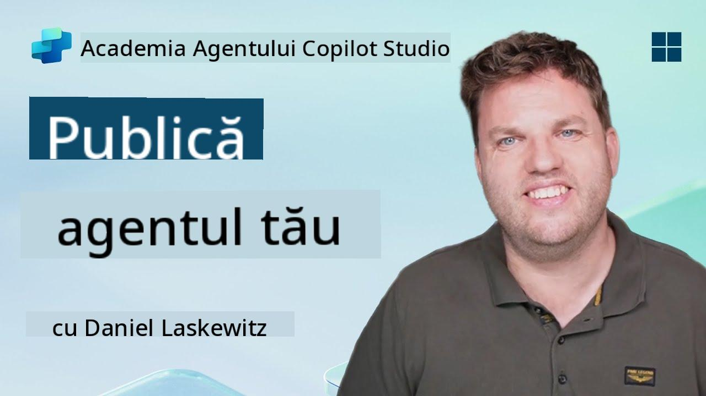](https://www.youtube.com/watch?v=eVZmljhYlSI "Urmărește tutorialul pe YouTube")

## 🎯 Scopul Misiunii

După ce ai finalizat o serie de module provocatoare, Creator de Agenți, ești acum pregătit pentru cel mai important pas: publicarea agentului tău. Este momentul să faci creația ta disponibilă utilizatorilor din Microsoft Teams și Microsoft 365 Copilot.

Agentul tău—echipat cu o misiune clară, instrumente puternice și acces la surse de cunoștințe esențiale—este gata să servească. Folosind Microsoft Copilot Studio, vei lansa agentul tău pentru a începe să ajute utilizatorii reali, exact acolo unde își desfășoară activitatea.

Hai să lansăm agentul tău în acțiune.

## 🔎 Obiective

📖 Această lecție acoperă:

1. De ce este important să publici agentul tău
1. Ce se întâmplă când publici agentul tău
1. Cum să adaugi un canal (Microsoft Teams & Microsoft 365 Copilot)
1. Cum să adaugi agentul în Microsoft Teams
1. Cum să faci agentul disponibil în Microsoft Teams pentru întreaga organizație

## 🚀 Publică un agent

De fiecare dată când lucrezi la un agent în Copilot Studio, s-ar putea să îl actualizezi adăugând cunoștințe sau instrumente. Când ești gata cu toate modificările și ai testat temeinic, ești pregătit să-l publici. Publicarea asigură că actualizările cele mai recente sunt active. Dacă actualizezi agentul cu instrumente noi și nu apeși butonul de publicare, acestea nu vor fi disponibile pentru utilizatorii finali.

Asigură-te că apeși întotdeauna butonul de publicare atunci când vrei să transmiți actualizările utilizatorilor agentului tău. Agentul tău poate avea canale adăugate, iar când apeși publicare, actualizările vor fi disponibile pentru toate canalele adăugate agentului.

## ⚙️ Configurează canale

Canalele determină unde utilizatorii tăi pot accesa și interacționa cu agentul tău. După ce publici agentul, îl poți face disponibil în mai multe canale. Fiecare canal poate afișa conținutul agentului tău diferit.

Poți adăuga agentul tău în următoarele canale:

- **Microsoft Teams și Microsoft 365 Copilot** - Fă agentul tău disponibil în chat-urile și întâlnirile din Teams, precum și în experiențele Microsoft 365 Copilot ([Află mai multe](https://learn.microsoft.com/microsoft-copilot-studio/publication-add-bot-to-microsoft-teams))
- **Website demo** - Testează agentul tău pe un website demo oferit de Copilot Studio ([Află mai multe](https://learn.microsoft.com/microsoft-copilot-studio/publication-connect-bot-to-web-channels))
- **Website personalizat** - Încorporează agentul tău direct pe propriul website ([Află mai multe](https://learn.microsoft.com/microsoft-copilot-studio/publication-connect-bot-to-web-channels))
- **Aplicație mobilă** - Integrează agentul tău într-o aplicație mobilă personalizată ([Află mai multe](https://learn.microsoft.com/microsoft-copilot-studio/publication-connect-bot-to-custom-application))
- **SharePoint** - Adaugă agentul tău pe site-uri SharePoint pentru asistență în documente și site-uri ([Află mai multe](https://learn.microsoft.com/microsoft-copilot-studio/publication-add-bot-to-sharepoint))
- **Facebook Messenger** - Conectează-te cu utilizatorii prin platforma de mesagerie Facebook ([Află mai multe](https://learn.microsoft.com/microsoft-copilot-studio/publication-add-bot-to-facebook))
- **Power Pages** - Integrează agentul tău în website-uri Power Pages ([Află mai multe](https://learn.microsoft.com/microsoft-copilot-studio/publication-add-bot-to-power-pages))
- **Canale Azure Bot Service** - Accesează canale suplimentare, inclusiv Slack, Telegram, Twilio SMS și altele ([Află mai multe](https://learn.microsoft.com/microsoft-copilot-studio/publication-connect-bot-to-azure-bot-service-channels))

Pentru a adăuga un canal, navighează la fila **Channels** din agentul tău și selectează canalul pe care dorești să-l configurezi. Fiecare canal are cerințe specifice de configurare și poate necesita autentificare sau pași suplimentari de configurare.

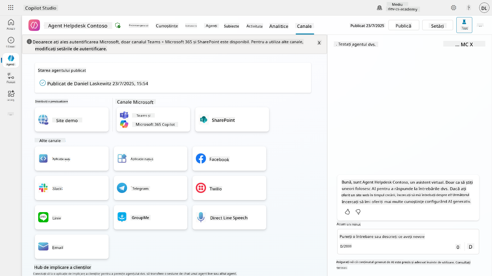

## 📺 Experiențe pe canale

Canalele diferite oferă experiențe diferite utilizatorilor. Când construiești un agent pentru mai multe canale, asigură-te că ești conștient de diferențele dintre canale. Este întotdeauna o strategie bună să testezi agentul tău pe mai multe canale pentru a vedea dacă funcționează conform intenției tale.

| Experiență                        | Website       | Teams și Microsoft 365 Copilot         | Facebook                 | Dynamics Omnichannel pentru Serviciul Clienți               |
| --------------------------------- | ------------- | --------------------------------------- | ------------------------ | ----------------------------------------------------------- |
| [Chestionar de satisfacție][1]    | Adaptive card | Doar text                               | Doar text                | Doar text                                                   |
| [Opțiuni multiple][1]             | Suportat      | [Suportat până la șase (ca hero card)][4] | [Suportat până la 13][6] | [Parțial Suportat][8]                                       |
| [Markdown][2]                     | Suportat      | [Parțial Suportat][5]                   | [Parțial suportat][7]    | [Parțial Suportat][9]                                       |
| [Mesaj de bun venit][1]           | Suportat      | Suportat                               | Nu este suportat         | Suportat pentru [Chat][10]. Nu este suportat pentru alte canale. |
| [Did-You-Mean][3]                 | Suportat      | Suportat                               | Suportat                 | Suportat pentru [Microsoft Teams][11], [Chat][10], Facebook și canale doar text (mesaje scurte (SMS) prin [TeleSign][12] și [Twilio][13], [WhatsApp][14], [WeChat][15], și [Twitter][16]). Acțiunile sugerate sunt prezentate ca o listă doar text; utilizatorii trebuie să reintroducă o opțiune pentru a răspunde. |

[1]: https://learn.microsoft.com/microsoft-copilot-studio/authoring-create-edit-topics
[2]: https://daringfireball.net/projects/markdown/
[3]: https://learn.microsoft.com/microsoft-copilot-studio/advanced-ai-features
[4]: https://learn.microsoft.com/microsoftteams/platform/concepts/cards/cards-reference#hero-card
[5]: https://learn.microsoft.com/microsoftteams/platform/bots/how-to/format-your-bot-messages#text-only-messages
[6]: https://developers.facebook.com/docs/messenger-platform/send-messages/quick-replies/
[7]: https://www.facebook.com/help/147348452522644?helpref=related
[8]: https://learn.microsoft.com/dynamics365/customer-service/asynchronous-channels#suggested-actions-support
[9]: https://learn.microsoft.com/dynamics365/customer-service/asynchronous-channels#preview-support-for-formatted-messages
[10]: https://learn.microsoft.com/dynamics365/customer-service/set-up-chat-widget
[11]: https://learn.microsoft.com/dynamics365/customer-service/configure-microsoft-teams
[12]: https://learn.microsoft.com/dynamics365/customer-service/configure-sms-channel
[13]: https://learn.microsoft.com/dynamics365/customer-service/configure-sms-channel-twilio
[14]: https://learn.microsoft.com/dynamics365/customer-service/configure-whatsapp-channel
[15]: https://learn.microsoft.com/dynamics365/customer-service/configure-wechat-channel
[16]: https://learn.microsoft.com/dynamics365/customer-service/configure-twitter-channel

> [!NOTE]
> Există câteva exemple despre cum poți folosi logica diferită pentru canale diferite. Un exemplu poate fi găsit în depozitul Power Platform Snippets:
>
> Henry Jammes a împărtășit un exemplu despre cum să afișezi un card adaptiv diferit atunci când canalul este Microsoft Teams. ([Link către exemplu](https://github.com/pnp/powerplatform-snippets/blob/main/copilot-studio/multiple-topics-matched-topic/source/multiple-topics-matched.yaml#L40))

## 🧪 Laboratorul 11: Publică agentul tău în Teams și Microsoft 365 Copilot

### 🎯 Caz de utilizare

Agentul tău Contoso IT Help Desk este acum complet configurat cu capabilități puternice—poate accesa surse de cunoștințe din SharePoint, crea tichete de suport, trimite notificări proactive și răspunde inteligent la întrebările utilizatorilor. Totuși, toate aceste funcționalități sunt disponibile doar în mediul de dezvoltare unde le-ai construit.

**Provocarea:** Utilizatorii finali nu pot beneficia de capabilitățile agentului tău până când acesta nu este publicat și făcut accesibil prin canalele unde își desfășoară activitatea.

**Soluția:** Publicarea agentului tău asigură că cea mai recentă versiune—cu toate actualizările recente, subiectele noi, sursele de cunoștințe îmbunătățite și fluxurile configurate—este disponibilă utilizatorilor reali. Fără publicare, utilizatorii ar interacționa cu o versiune mai veche a agentului care ar putea lipsi funcționalități critice.

Adăugarea canalului Teams și Microsoft 365 Copilot este la fel de importantă deoarece:

- **Integrare Teams**: Angajații organizației tale își petrec cea mai mare parte a zilei în Microsoft Teams pentru colaborare, întâlniri și comunicare. Prin adăugarea agentului în Teams, utilizatorii pot obține suport IT fără să părăsească mediul lor principal de lucru.

- **Microsoft 365 Copilot**: Utilizatorii pot accesa agentul tău specializat de suport IT direct în experiența Microsoft 365 Copilot, integrându-se perfect în fluxul lor zilnic de lucru în aplicațiile Office.

- **Acces centralizat**: În loc să-și amintească site-uri web sau aplicații separate, utilizatorii pot accesa suportul IT prin platformele pe care le folosesc deja, reducând fricțiunea și crescând adoptarea.

Această misiune transformă munca ta de dezvoltare într-o soluție gata de producție care oferă valoare reală utilizatorilor finali ai organizației tale.

### Cerințe preliminare

Înainte de a începe acest laborator, asigură-te că ai:

- ✅ Finalizat laboratoarele anterioare și ai un agent Contoso Helpdesk complet configurat
- ✅ Agentul tău a fost testat și este gata pentru utilizare în producție
- ✅ Permisiuni în mediul Copilot Studio pentru a publica agenți
- ✅ Acces la Microsoft Teams în organizația ta

### 11.1 Publică agentul tău

Acum că am terminat munca pe agent, trebuie să ne asigurăm că tot ce am realizat este disponibil pentru utilizatorii finali care vor folosi agentul nostru. Pentru a ne asigura că conținutul este disponibil pentru toți utilizatorii, trebuie să publicăm agentul nostru.

1. Accesează agentul Contoso Helpdesk în Copilot Studio (prin [portalul Copilot Studio maker](https://copilotstudio.microsoft.com))

    În Copilot Studio, este ușor să publici agentul tău. Poți selecta pur și simplu butonul de publicare din partea de sus a paginii de prezentare a agentului.

    

1. Selectează butonul **Publish** în agentul tău

    Se deschide o fereastră pop-up de publicare - pentru a confirma că dorești cu adevărat să publici agentul tău.

    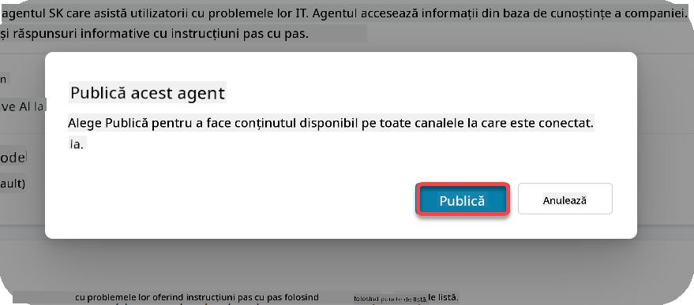

1. Selectează **Publish** pentru a confirma publicarea agentului tău

    Acum apare un mesaj care indică faptul că agentul tău este în proces de publicare. Nu trebuie să păstrezi fereastra pop-up deschisă. Vei fi notificat când agentul este publicat.

    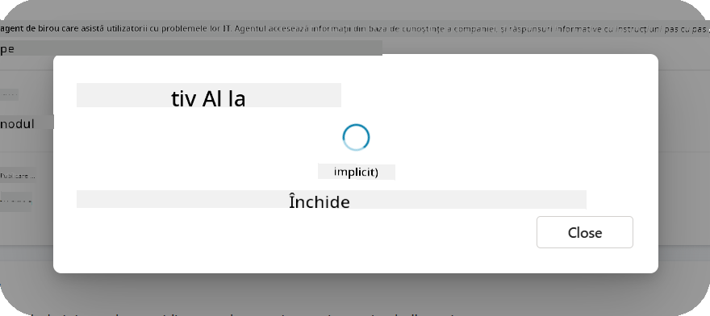

    Când agentul a fost publicat, vei vedea notificarea în partea de sus a paginii agentului.

    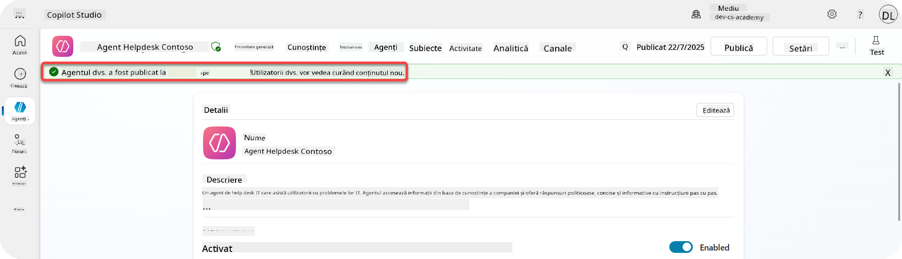

Dar - am publicat doar agentul, nu l-am adăugat încă într-un canal, așa că să rezolvăm asta acum!

### 11.2 Adaugă canalul Teams și Microsoft 365 Copilot

1. Pentru a adăuga canalul Teams și Microsoft 365 Copilot la agentul nostru, trebuie să selectăm **Channel** în navigarea de sus a agentului

    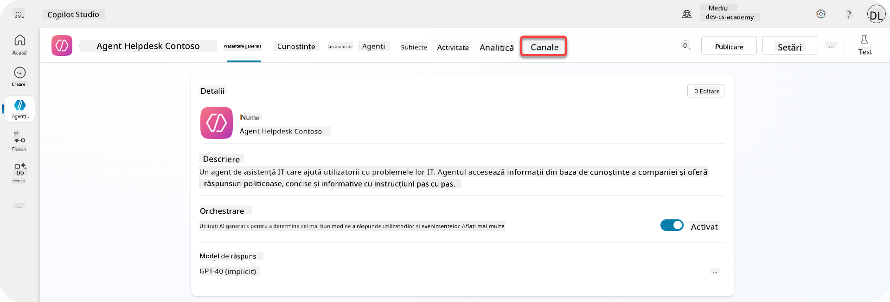

    Aici putem vedea toate canalele pe care le putem adăuga acestui agent.

1. Selectează **Teams și Microsoft 365**

    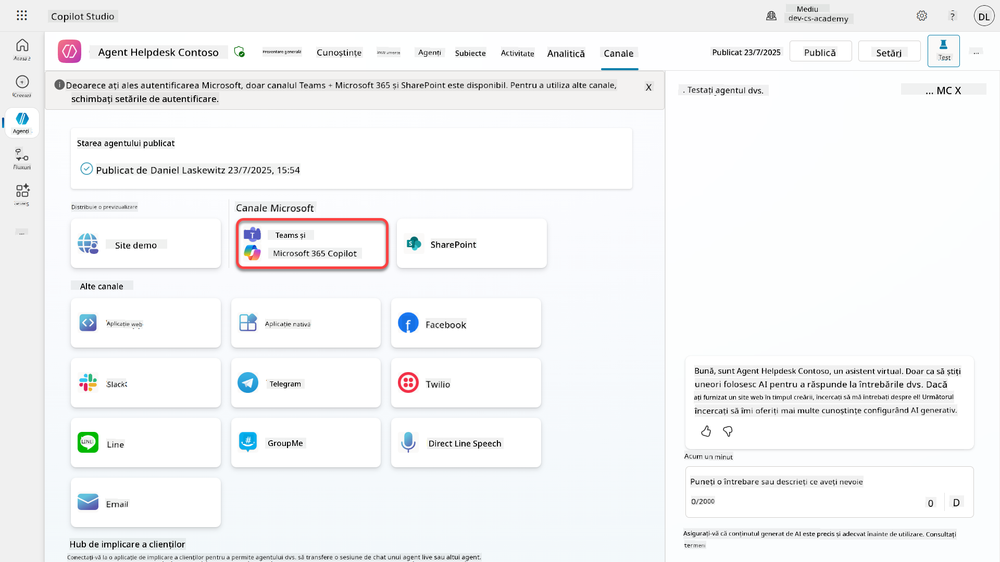

1. Selectează **Add channel** pentru a finaliza configurarea și a adăuga canalul la agent

    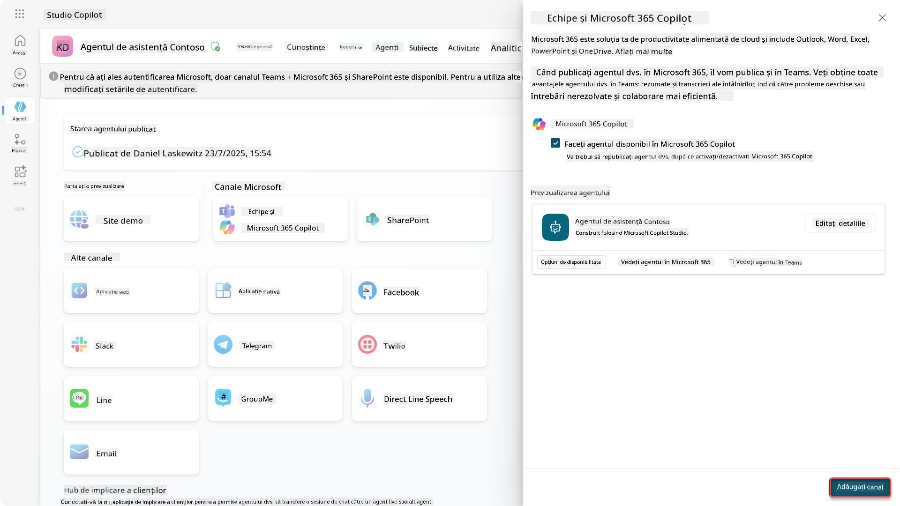

    Va dura puțin până va fi adăugat. După ce este adăugat, va apărea o notificare verde în partea de sus a barei laterale.

    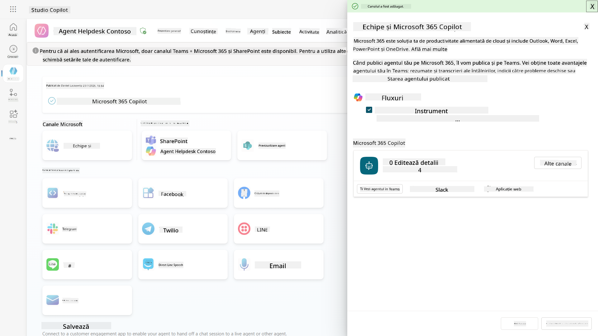

1. Selectează **See agent in Teams** pentru a deschide o filă nouă

    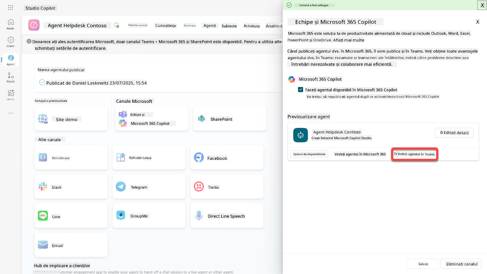

1. Selectează **Add** pentru a adăuga agentul Contoso Helpdesk în Teams

    

    Acest proces va dura puțin. După finalizare, ar trebui să apară următorul ecran:

    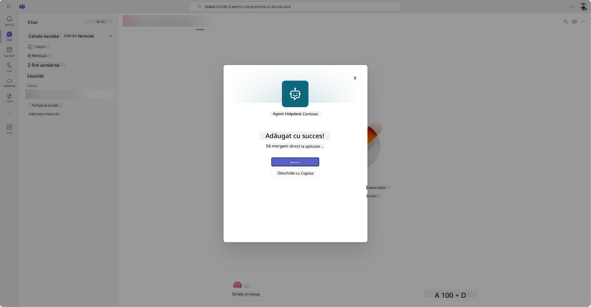

1. Selectează **Open** pentru a deschide agentul în Teams

    Acest lucru va deschide agentul în Teams ca o aplicație Teams

    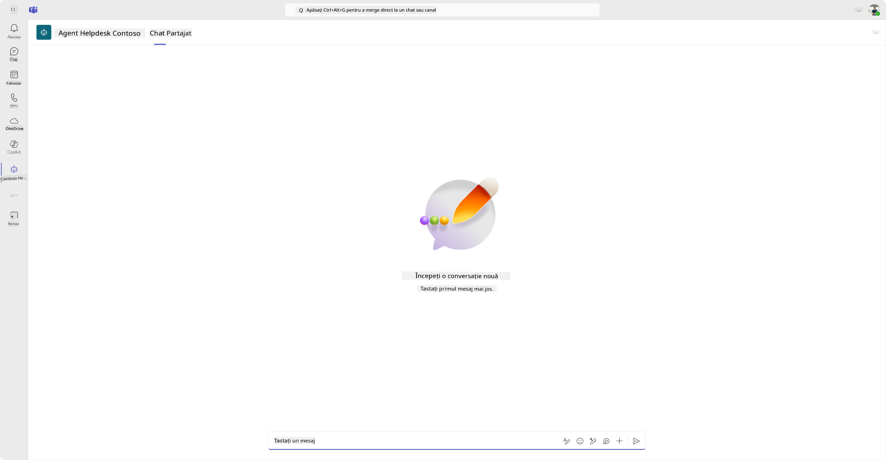

Acum am publicat agentul pentru a funcționa în Microsoft Teams, dar s-ar putea să dorești să-l faci disponibil pentru mai mulți utilizatori.

### 11.3 Fă agentul disponibil pentru toți utilizatorii din tenant

1. Închide fila browserului unde agentul Contoso Helpdesk este deschis

    Acest lucru ar trebui să te aducă înapoi la Copilot Studio, unde panoul lateral Teams și Microsoft 365 Copilot este încă deschis. Am deschis doar agentul în Teams acum, dar putem face mult mai multe aici. Putem edita detaliile agentului, îl putem distribui mai multor utilizatori și multe altele.

1. Selectează **Edit details**

    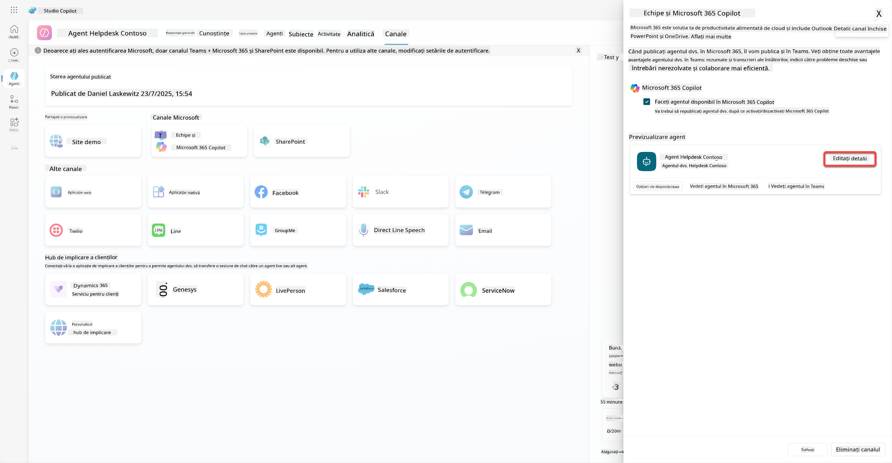
Aceasta va deschide un panou unde putem modifica o serie de detalii și setări ale agentului. Putem schimba detalii de bază, cum ar fi pictograma, culoarea de fundal a pictogramei și descrierile. De asemenea, putem modifica setările Teams (de exemplu, să permitem unui utilizator să adauge agentul într-o echipă sau să permită utilizarea acestui agent în chat-uri de grup și întâlniri) aici. Când selectați *mai multe*, puteți modifica detalii pentru dezvoltatori, cum ar fi numele dezvoltatorului, site-ul web, declarația de confidențialitate și termenii de utilizare.

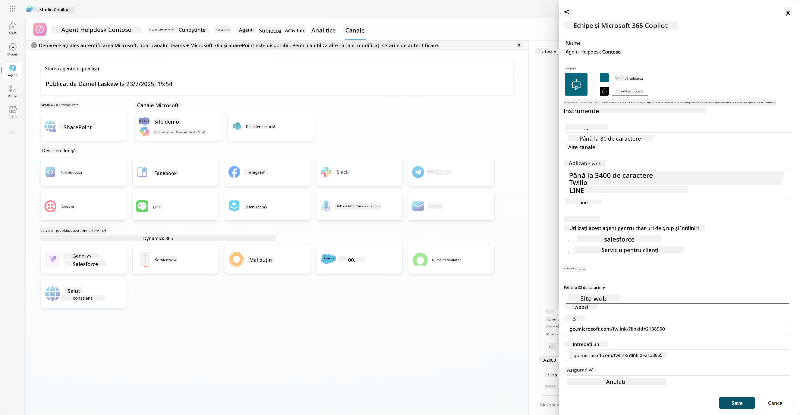

1. Selectați **Anulare** pentru a închide panoul de editare detalii.

1. Selectați **Opțiuni de disponibilitate**.

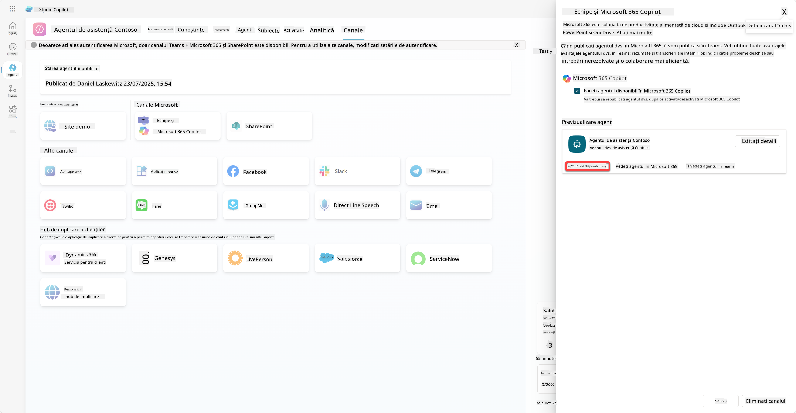

Aceasta va deschide panoul de opțiuni de disponibilitate, unde puteți copia un link pentru a-l trimite utilizatorilor pentru a folosi acest agent (fiți atenți, trebuie să partajați agentul cu utilizatorul) și puteți descărca un fișier pentru a adăuga agentul în magazinul Microsoft Teams sau Microsoft 365. Pentru a afișa agentul în magazin, aveți alte opțiuni: îl puteți afișa colegilor și utilizatorilor partajați (pentru a-l afișa în secțiunea *Creat cu Power Platform*) sau îl puteți afișa tuturor din organizația dvs. (acest lucru necesită aprobarea administratorului).

1. Selectați **Afișează tuturor din organizația mea**.

1. Selectați **Trimite pentru aprobare administratorului**.

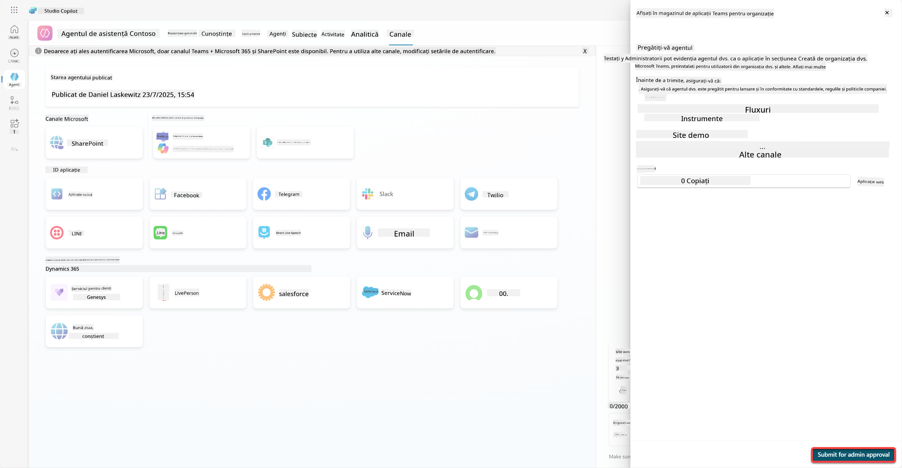

Acum, administratorul dvs. trebuie să aprobe trimiterea agentului. Acesta poate face acest lucru accesând Centrul de administrare Teams și căutând Contoso Helpdesk Agent în Aplicații. În captura de ecran puteți vedea ce ar vedea administratorul în Centrul de administrare Teams.

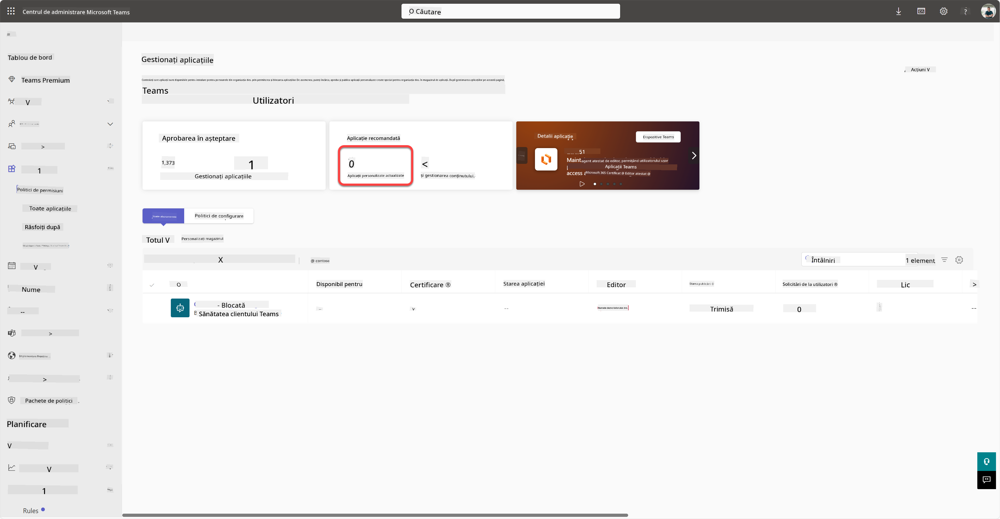

Administratorul trebuie să selecteze Contoso Helpdesk Agent și să aleagă *Publică* pentru a publica Contoso Helpdesk Agent pentru toată lumea.

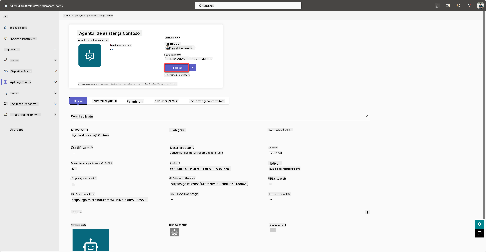

Când administratorul a publicat trimiterea agentului, veți putea să reîmprospătați Copilot Studio și ar trebui să vedeți bannerul *disponibil în magazinul de aplicații* în opțiunile de disponibilitate.

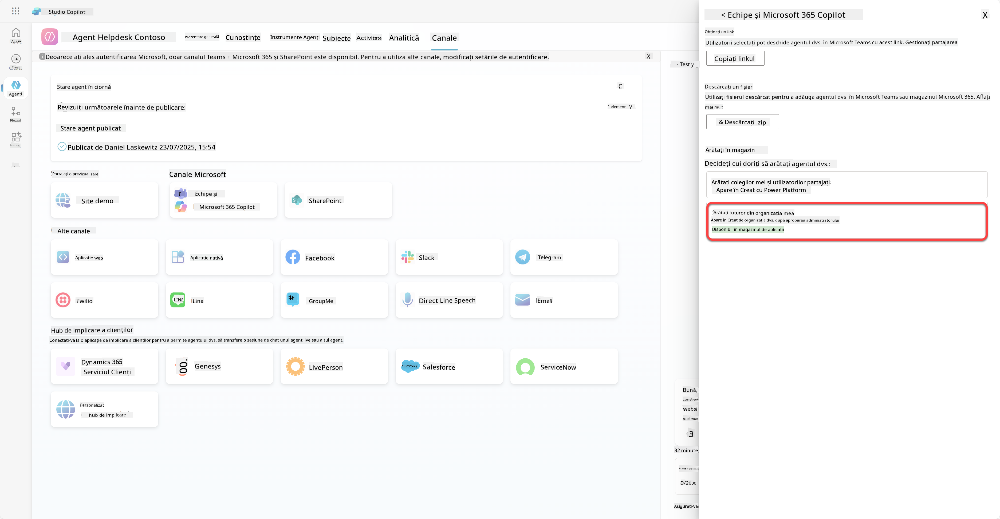

Există chiar mai multe posibilități aici. Administratorul dvs. poate modifica politica globală de configurare și poate instala automat Contoso Helpdesk Agent pentru toată lumea din tenant. Pe lângă asta, puteți fixa Contoso Helpdesk Agent pe bara laterală stângă, astfel încât toată lumea să aibă acces ușor la acesta.

## ✅ Misiune Îndeplinită

🎉 **Felicitări!** Ați publicat cu succes agentul și l-ați adăugat în Teams și Microsoft 365 Copilot! Următorul pas este ultima misiune a cursului: Înțelegerea licențierii.

⏭️ [Treceți la lecția **Înțelegerea licențierii**](../12-understanding-licensing/README.md)

## 📚 Resurse Tactice

🔗 [Documentație despre canalele de publicare](https://learn.microsoft.com/microsoft-copilot-studio/publication-fundamentals-publish-channels)

---

**Declinare de responsabilitate**:  
Acest document a fost tradus folosind serviciul de traducere AI [Co-op Translator](https://github.com/Azure/co-op-translator). Deși ne străduim să asigurăm acuratețea, vă rugăm să fiți conștienți că traducerile automate pot conține erori sau inexactități. Documentul original în limba sa natală ar trebui considerat sursa autoritară. Pentru informații critice, se recomandă traducerea profesională realizată de oameni. Nu ne asumăm responsabilitatea pentru neînțelegerile sau interpretările greșite care pot apărea din utilizarea acestei traduceri.