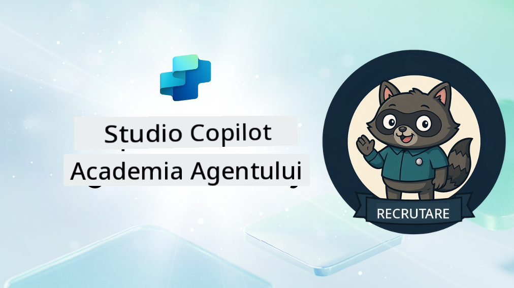

<!--
CO_OP_TRANSLATOR_METADATA:
{
  "original_hash": "8b5ecad9d5d073ea3f4c2b844e80f2e5",
  "translation_date": "2025-10-20T17:05:49+00:00",
  "source_file": "docs/recruit/README.md",
  "language_code": "ro"
}
-->
# Bun venit, Recruit

**Bun venit, Recruit.**  
Misiunea ta—dacă alegi să o accepți—este să stăpânești arta construirii agenților folosind **Microsoft Copilot Studio**.

Acest training practic este punctul tău de intrare în **lumea agenților**: de la prompturi fundamentate la Adaptive Cards și fluxuri de agenți, vei învăța cum să construiești, să scalezi și să implementezi agenți inteligenți utilizând instrumente și cazuri reale.

---

## 🎯 Obiectivul Misiunii

După finalizarea Academiei Agent, vei putea:

- Înțelege ce sunt agenții în contextul Microsoft Copilot Studio
- Explora cum Modelele de Limbaj Extins (LLMs), generarea augmentată prin recuperare (RAG) și orchestrarea se îmbină într-un agent
- Construi atât agenți **declarativi**, cât și **personalizați**
- Îmbunătăți agenții cu **Topics**, **Adaptive Cards** și **Agent Flows**
- Implementa agenți în **Microsoft Teams** și **Microsoft 365 Copilot**

---

## 🧪 Cerințe preliminare

Pentru a finaliza toate misiunile, vei avea nevoie de:

- Un tenant Microsoft 365 Developer (cu SharePoint activat)
- Acces la **Microsoft Copilot Studio** (versiune de probă sau licențiată)
- Opțional: Cunoștințe de bază despre SharePoint, Power Platform sau Power Fx

---

## 🧬 Cui se adresează

Acest curs este ideal pentru:

- Creatori și dezvoltatori care explorează **Copilot Studio**
- Profesioniști IT care construiesc **extensii Microsoft 365 Copilot**
- Entuziaști ai Power Platform care doresc să **progreseze** cu agenți inteligenți
- Oricine preferă să învețe prin **practică**

---

## 🧭 Prezentare generală a curriculumului

Această academie este împărțită în lecții progresive—fiecare concepută ca o misiune pe teren pentru a-ți dezvolta abilitățile de construire a agenților.

| Lecție | Titlu | Briefing Misiune |
|--------|-------|------------------|
| `00` | 🧰 [Configurarea Cursului](./00-course-setup/README.md) | Configurează mediul de dezvoltare, versiunea de probă Copilot Studio și site-ul SharePoint |
| `01` | 🧠 [Introducere în Agenți](./01-introduction-to-agents/README.md) | Înțelege conceptele AI conversațional, LLM-urile și diferența dintre agenți autonomi și declarativi |
| `02` | 🛠️ [Fundamentele Copilot Studio](./02-copilot-studio-fundamentals/README.md) | Învață elementele de bază: cunoștințe, abilități, autonomie |
| `03` | 👩‍💻 [Crearea unui Agent Declarativ](./03-create-a-declarative-agent-for-M365Copilot/README.md) | Adaugă propriul agent la Microsoft 365 Copilot, fundamentat într-un prompt |
| `04` | 🧩 [Crearea unei Soluții](./04-creating-a-solution/README.md) | Ambalează agentul într-o soluție reutilizabilă pentru gestionarea mediului |
| `05` | 🚀 [Începe cu Agenți Predefiniți](./05-using-prebuilt-agents/README.md) | Utilizează și personalizează un agent șablon pentru a accelera configurarea |
| `06` | ✍️ [Construiește un Agent Personalizat](./06-create-agent-from-conversation/README.md) | Creează un nou Copilot fundamentat pe surse de cunoștințe |
| `07` | 🧠 [Adaugă un Subiect cu Declanșatori](./07-add-new-topic-with-trigger/README.md) | Folosește Topics pentru a defini căi personalizate de întrebări/răspunsuri |
| `08` | 🪪 [Îmbunătățește cu Adaptive Cards](./08-add-adaptive-card/README.md) | Construiește un Adaptive Card folosind Power Fx și SharePoint |
| `09` | 🔁 [Automatizează cu Fluxuri de Agenți](./09-add-an-agent-flow/README.md) | Folosește inputul Adaptive Card pentru a declanșa fluxuri de back-end |
| `10` | 🧭 [Adaugă Declanșatori de Evenimente](./10-add-event-triggers/README.md) | Permite agentului să acționeze autonom folosind logica bazată pe evenimente |
| `11` | 📢 [Publică Agentul Tău](./11-publish-your-agent/README.md) | Implementează agentul în Microsoft Teams și Microsoft 365 Copilot |
| `12` | 🪪 [Înțelegerea Licențierii](./12-understanding-licensing/README.md) | Învață cum funcționează licențierea și facturarea cu Copilot Studio |
| `13` | 🚨 [Obține Insigna de Recruit](./course-completion-badges-recruit/README.md) | Obține insigna ta și marchează-ți realizarea! |

!!! note
    ✅ Finalizarea acestui curriculum îți oferă insigna **Recruit**.  
    🔓 **Operative** și **Commander** vor fi deblocate în fazele viitoare.

<!-- markdownlint-disable-next-line MD033 -->

---

**Declinare de responsabilitate**:  
Acest document a fost tradus folosind serviciul de traducere AI [Co-op Translator](https://github.com/Azure/co-op-translator). Deși ne străduim să asigurăm acuratețea, vă rugăm să fiți conștienți că traducerile automate pot conține erori sau inexactități. Documentul original în limba sa maternă ar trebui considerat sursa autoritară. Pentru informații critice, se recomandă traducerea profesională realizată de un specialist uman. Nu ne asumăm responsabilitatea pentru eventualele neînțelegeri sau interpretări greșite care pot apărea din utilizarea acestei traduceri.