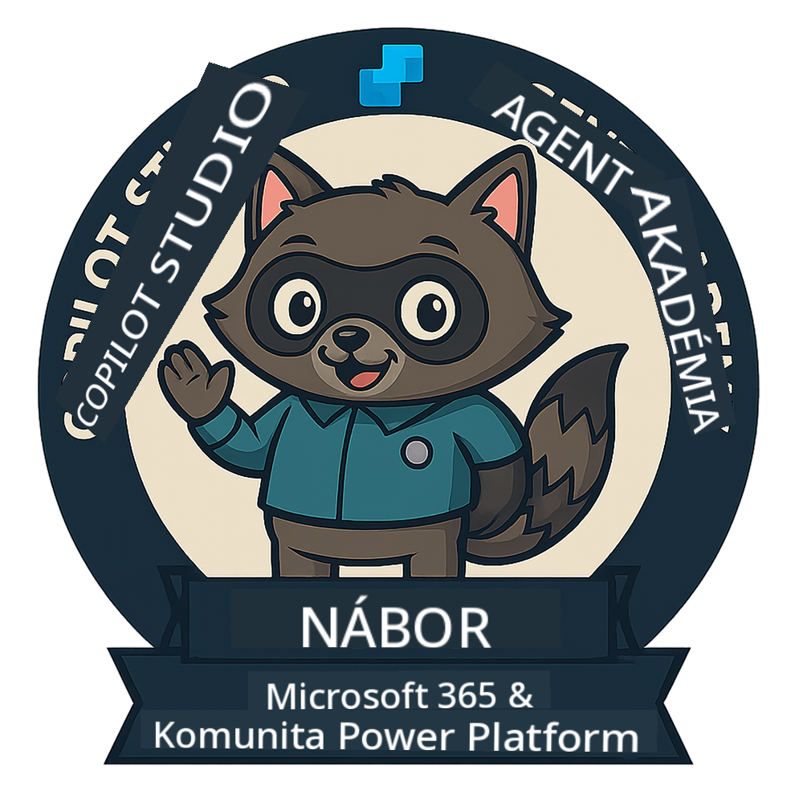
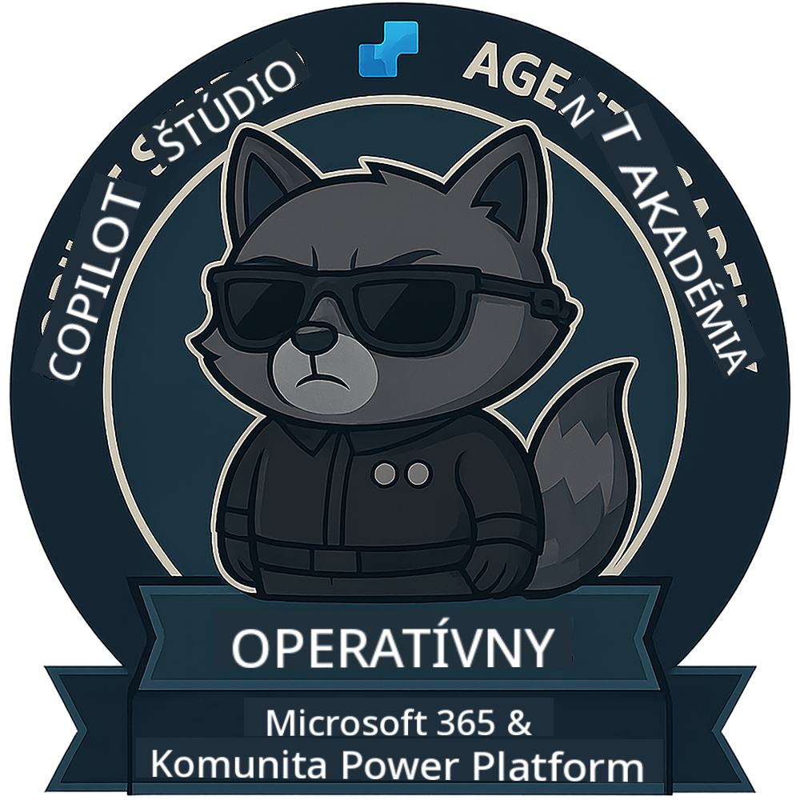
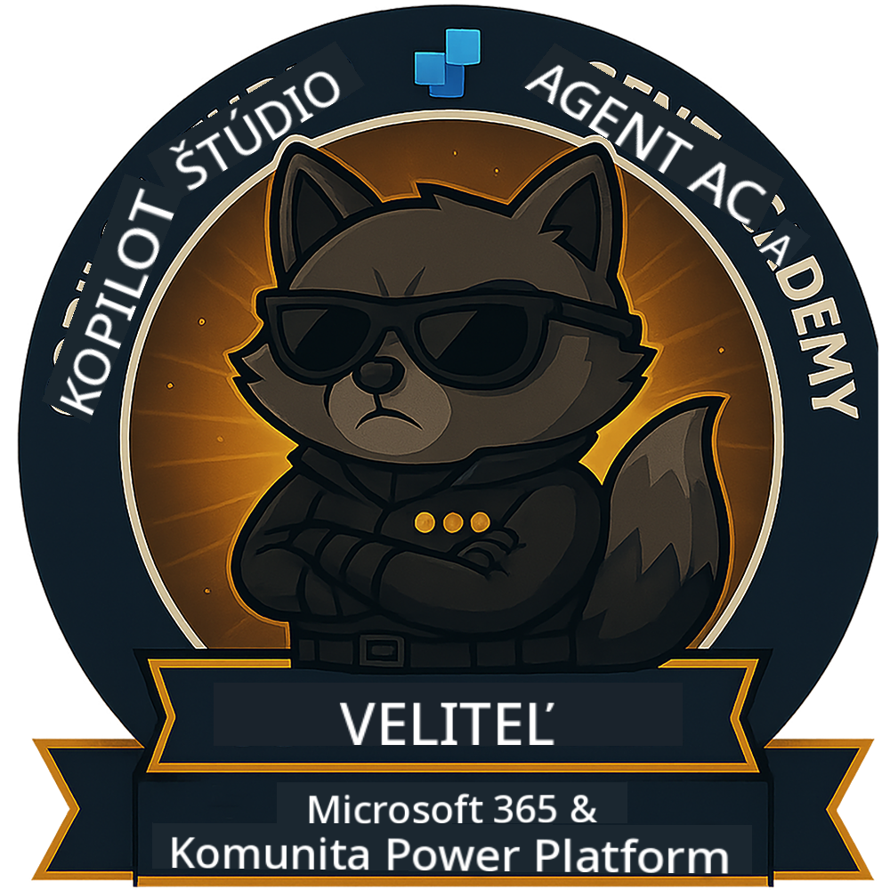

<!--
CO_OP_TRANSLATOR_METADATA:
{
  "original_hash": "15e57e059ce7689d602d7853187235cd",
  "translation_date": "2025-10-20T17:04:54+00:00",
  "source_file": "docs/index.md",
  "language_code": "sk"
}
-->
---
hide:
- navigation
---

# Akadémia agentov Copilot Studio

**Vitajte v Akadémii agentov Copilot Studio.**  

Vašou misiou – ak sa ju rozhodnete prijať – je zvládnuť umenie vytvárania agentov pomocou **Microsoft Copilot Studio**.

Tento praktický tréning je vaším vstupom do **sveta agentov**: od základných výziev cez Adaptive Cards až po toky agentov. Naučíte sa, ako vytvárať, škálovať a nasadzovať inteligentných agentov pomocou reálnych nástrojov a prípadov použitia.

---

## 🏅 Postup v hodnostiach

**Akadémia agentov Copilot Studio** je viacfázový tréningový program navrhnutý na rozvoj vašich zručností v troch úrovniach hodností agentov. Každá úroveň zahŕňa odznak a rastúce zodpovednosti:

| Hodnosť          | Úroveň | Vizualizácia |
|------------------|:-----:|--------------|
| 🟢 **Regrút**  [🚀 Začať](https://aka.ms/agent-academy-recruit){ .md-button .md-button--primary }     | •     | { width="300" }     |
| 🔵 **Operatívny agent** (Čoskoro)   | ••    | { width="300" } |
| 🟡 **Veliteľ** (Čoskoro)    | •••   | { width="300" } |

Každá úroveň stavia na predchádzajúcej. Dokončite svoju misiu Regrúta a sledujte novinky, aby ste mohli povýšiť svoje agentúrne schopnosti.

---

## 🎒 Ďalšie kurzy

Pozrite si tieto ďalšie kurzy, aby ste pokračovali v učení o AI a agentoch:

- [Microsoft Copilot Studio <3 MCP Lab](https://aka.ms/mcsmcplab)
- [Copilot Developer Camp](https://microsoft.github.io/copilot-camp/)
- [AI Agents for Beginners](https://microsoft.github.io/ai-agents-for-beginners/)
- [Model Context Protocol (MCP) For Beginners](https://github.com/microsoft/mcp-for-beginners)

---

## 🚑 Problémy

Vaša spätná väzba je pre nás veľmi cenná! Použite [zoznam problémov](https://github.com/microsoft/agent-academy/issues) na zdieľanie vašich komentárov a problémov. Ďakujeme!

---

## 📜 Kódex správania

Tento projekt prijal [Kódex správania pre otvorený zdroj od Microsoftu](https://opensource.microsoft.com/codeofconduct/).

!!! info "Zdroje:"

    - [Kódex správania pre otvorený zdroj od Microsoftu](https://opensource.microsoft.com/codeofconduct/)
    - [Často kladené otázky o kódexe správania](https://opensource.microsoft.com/codeofconduct/faq/)
    - Kontaktujte [opencode@microsoft.com](mailto:opencode@microsoft.com) s otázkami alebo obavami

---

[⭐️ Ohodnoťte náš repozitár](https://github.com/microsoft/agent-academy){ .md-button .md-button--primary }

<!-- markdownlint-disable-next-line MD033 -->

---

**Zrieknutie sa zodpovednosti**:  
Tento dokument bol preložený pomocou služby AI prekladu [Co-op Translator](https://github.com/Azure/co-op-translator). Hoci sa snažíme o presnosť, prosím, berte na vedomie, že automatizované preklady môžu obsahovať chyby alebo nepresnosti. Pôvodný dokument v jeho rodnom jazyku by mal byť považovaný za autoritatívny zdroj. Pre kritické informácie sa odporúča profesionálny ľudský preklad. Nenesieme zodpovednosť za akékoľvek nedorozumenia alebo nesprávne interpretácie vyplývajúce z použitia tohto prekladu.