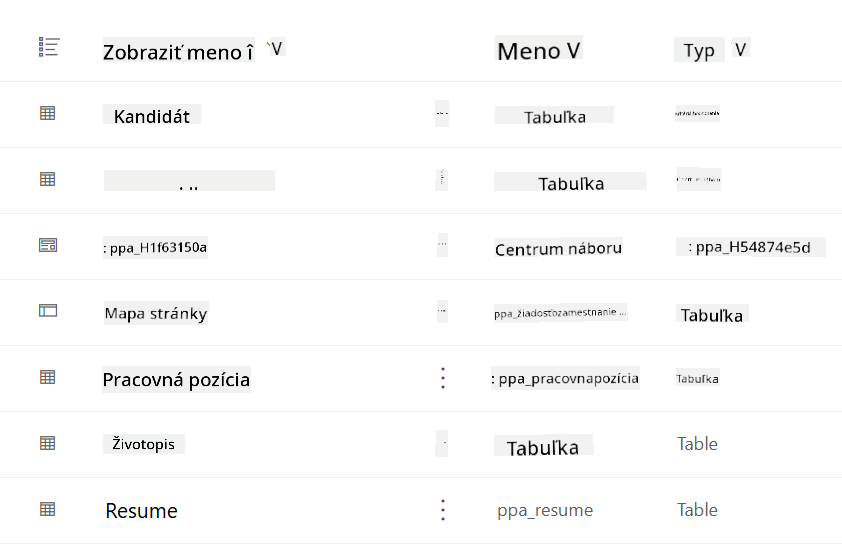
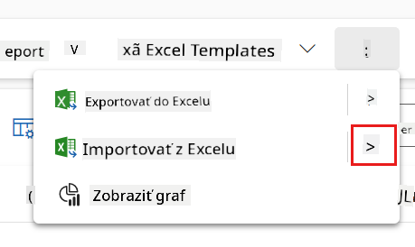
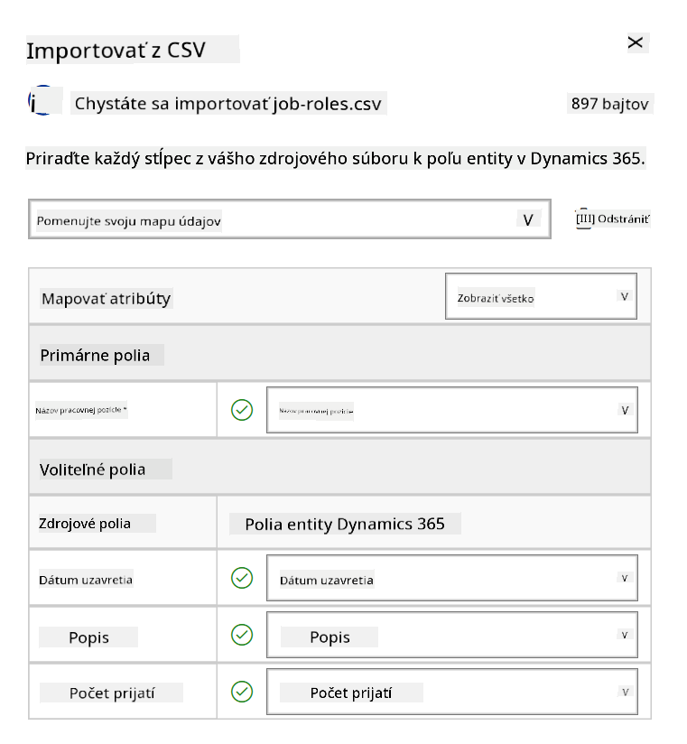
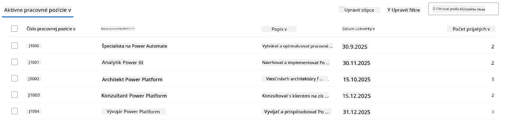
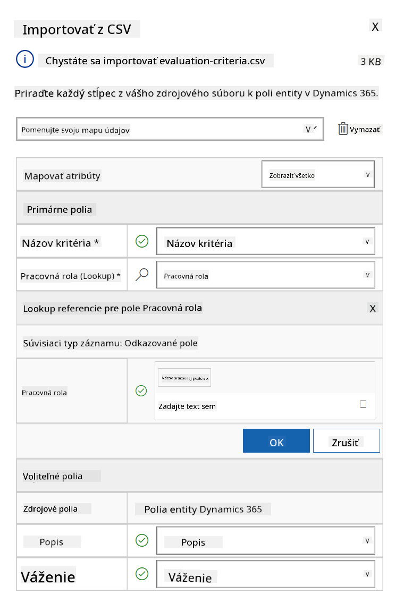

<!--
CO_OP_TRANSLATOR_METADATA:
{
  "original_hash": "2620cf9eaf09a3fc6be7fa31a3a62956",
  "translation_date": "2025-10-20T18:04:47+00:00",
  "source_file": "docs/operative-preview/01-get-started/README.md",
  "language_code": "sk"
}
-->
# 🚨 Misia 01: Začnite s náborovým agentom

--8<-- "disclaimer.md"

## 🕵️‍♂️ KRYCÍ NÁZOV: `OPERÁCIA TALENT SCOUT`

> **⏱️ Časový rámec operácie:** `~45 minút`

## 🎯 Popis misie

Vitajte, agent. Vašou prvou úlohou je **Operácia Talent Scout** - vytvorenie základnej infraštruktúry pre AI-poháňaný náborový systém, ktorý zmení spôsob, akým organizácie identifikujú a prijímajú najlepšie talenty.

Vašou misiou, ak ju prijmete, je nasadiť a nakonfigurovať komplexný systém na správu náboru pomocou Microsoft Copilot Studio. Importujete predpripravené riešenie obsahujúce všetky potrebné dátové štruktúry a následne vytvoríte svojho prvého AI agenta - **Náborového agenta**, ktorý bude slúžiť ako centrálny koordinátor pre všetky budúce náborové operácie.

Toto počiatočné nasadenie vytvára veliteľské centrum, ktoré budete vylepšovať počas programu Agent Academy Operative. Považujte to za svoju základňu - základ, na ktorom budete budovať celú sieť špecializovaných agentov v nasledujúcich misiách.

---

## 🔎 Ciele

Po splnení tejto misie budete schopní:

- **Porozumenie scenáru**: Získať komplexné znalosti o výzvach a riešeniach automatizácie náboru
- **Nasadenie riešenia**: Úspešne importovať a nakonfigurovať základy systému na správu náboru
- **Vytvorenie agenta**: Vytvoriť náborového agenta, ktorý bude začiatkom scenára, ktorý budete budovať ako operatívny agent akadémie

---

## 🔍 Predpoklady

Pred začatím tejto misie sa uistite, že máte:

- Licenciu na Copilot Studio
- Prístup k prostrediu Microsoft Power Platform
- Administrátorské oprávnenia na vytváranie riešení a agentov

---

## 🏢 Porozumenie scenáru automatizácie náboru

Tento scenár ukazuje, ako môže spoločnosť využiť Microsoft Copilot Studio na zlepšenie a automatizáciu svojho náborového procesu. Predstavuje systém agentov, ktorí spolupracujú na úlohách, ako je prezeranie životopisov, odporúčanie pracovných pozícií, príprava materiálov na pohovory a hodnotenie kandidátov.

### Hodnota pre podnikanie

Riešenie pomáha HR tímom šetriť čas a robiť lepšie rozhodnutia tým, že:

- Automaticky spracováva životopisy prijaté e-mailom.
- Navrhuje vhodné pracovné pozície na základe profilov kandidátov.
- Vytvára pracovné aplikácie a príručky na pohovory prispôsobené každému kandidátovi.
- Zabezpečuje spravodlivé a súladné náborové praktiky prostredníctvom zabudovaných bezpečnostných a moderovacích funkcií.
- Zbiera spätnú väzbu na zlepšenie riešenia.

### Ako to funguje

- Centrálny **Náborový agent** koordinuje proces a uchováva údaje v Microsoft Dataverse.
- **Agent na spracovanie žiadostí** číta životopisy a vytvára pracovné aplikácie.
- **Agent na prípravu pohovorov** generuje otázky na pohovory a dokumenty na základe pozadia kandidáta.
- Systém môže byť publikovaný na demo webovej stránke, čo umožňuje zainteresovaným stranám interakciu s ním.

Tento scenár je ideálny pre organizácie, ktoré chcú modernizovať svoje náborové pracovné postupy pomocou automatizácie poháňanej AI, pričom si zachovávajú transparentnosť, spravodlivosť a efektivitu.

---

## 🧪 Laboratórium: Nastavenie náborového agenta

V tomto praktickom laboratóriu vytvoríte základ pre váš systém automatizácie náboru. Začnete importovaním predkonfigurovaného riešenia, ktoré obsahuje všetky potrebné Dataverse tabuľky a dátové štruktúry na správu kandidátov, pracovných pozícií a náborových pracovných postupov. Následne naplníte tieto tabuľky vzorovými údajmi, ktoré podporia vaše učenie počas tohto modulu a poskytnú realistické scenáre na testovanie. Nakoniec vytvoríte Náborového agenta v Copilot Studio, nastavíte základné konverzačné rozhranie, ktoré bude základom pre všetky ostatné funkcie, ktoré pridáte v budúcich misiách.

### 🧪 Laboratórium 1.1: Import riešenia

1. Prejdite na **[Copilot Studio](https://copilotstudio.microsoft.com)**
1. Vyberte **...** v ľavej navigácii a zvoľte **Solutions**
1. Kliknite na tlačidlo **Import Solution** v hornej časti
1. **[Stiahnite](https://raw.githubusercontent.com/microsoft/agent-academy/refs/heads/main/docs/operative-preview/01-get-started/assets/Operative_1_0_0_0.zip)** pripravené riešenie
1. Vyberte **Browse** a zvoľte stiahnuté riešenie z predchádzajúceho kroku
1. Kliknite na **Next**
1. Kliknite na **Import**

!!! success
    Po úspešnom importe sa zobrazí zelený oznamovací panel s nasledujúcou správou:  
    "Solution "Operative" imported successfully."

Keď je riešenie importované, pozrite sa na to, čo ste importovali, výberom zobrazovaného názvu riešenia (`Operative`).



Nasledujúce komponenty boli importované:

| Zobrazovaný názov | Typ | Popis |
|-------------------|------|-------|
| Kandidát | Tabuľka | Informácie o kandidátovi |
| Kritériá hodnotenia | Tabuľka | Kritériá hodnotenia pre pozíciu |
| Náborové centrum | Aplikácia riadená modelom | Aplikácia na správu náborového procesu |
| Náborové centrum | Mapa stránky | Navigačná štruktúra pre aplikáciu Náborové centrum |
| Pracovná aplikácia | Tabuľka | Pracovné aplikácie |
| Pracovná pozícia | Tabuľka | Pracovné pozície |
| Životopis | Tabuľka | Životopisy kandidátov |

Ako poslednú úlohu pre toto laboratórium kliknite na tlačidlo **Publish all customizations** v hornej časti stránky.

### 🧪 Laboratórium 1.2: Import vzorových údajov

V tomto laboratóriu pridáte vzorové údaje do niektorých tabuliek, ktoré ste importovali v laboratóriu 1.1.

#### Stiahnite súbory na import

1. **[Stiahnite](https://raw.githubusercontent.com/microsoft/agent-academy/refs/heads/main/docs/operative-preview/01-get-started/assets/evaluation-criteria.csv)** CSV súbor s kritériami hodnotenia
1. **[Stiahnite](https://raw.githubusercontent.com/microsoft/agent-academy/refs/heads/main/docs/operative-preview/01-get-started/assets/job-roles.csv)** CSV súbor s pracovnými pozíciami

#### Import vzorových údajov pracovných pozícií

1. Vráťte sa k riešeniu, ktoré ste práve importovali v poslednom laboratóriu
1. Vyberte **Náborové centrum** aplikáciu riadenú modelom výberom zaškrtávacieho políčka pred riadkom
1. Kliknite na tlačidlo **Play** v hornej časti

    !!! warning
        Môže sa stať, že budete musieť znova prihlásiť. Uistite sa, že to urobíte. Po prihlásení by ste mali vidieť aplikáciu Náborové centrum.

1. Vyberte **Pracovné pozície** v ľavej navigácii
1. Kliknite na ikonu **Viac** (tri bodky pod sebou) v príkazovom paneli
1. Kliknite na **pravú šípku** vedľa *Import from Excel*

    

1. Kliknite na **Import from CSV**

    

1. Kliknite na tlačidlo **Choose File**, vyberte súbor **job-roles.csv**, ktorý ste práve stiahli, a potom kliknite na **Open**
1. Kliknite na **Next**
1. Nechajte ďalší krok tak, ako je, a kliknite na **Review Mapping**

    

1. Uistite sa, že mapovanie je správne, a kliknite na **Finish Import**

    !!! info
        Týmto sa spustí import a budete môcť sledovať jeho priebeh alebo proces okamžite dokončiť kliknutím na **Done**

1. Kliknite na **Done**

Toto môže chvíľu trvať, ale môžete kliknúť na tlačidlo **Refresh**, aby ste zistili, či bol import úspešný.



#### Import vzorových údajov kritérií hodnotenia

1. Vyberte **Kritériá hodnotenia** v ľavej navigácii
1. Kliknite na ikonu **Viac** (tri bodky pod sebou) v príkazovom paneli
1. Kliknite na **pravú šípku** vedľa *Import from Excel*

    

1. Kliknite na **Import from CSV**

    

1. Kliknite na tlačidlo **Choose File**, vyberte súbor **evaluation-criteria.csv**, ktorý ste práve stiahli, a potom kliknite na **Open**
1. Kliknite na **Next**
1. Nechajte ďalší krok tak, ako je, a kliknite na **Review Mapping**

    

1. Teraz musíme urobiť trochu viac práce na mapovaní. Kliknite na lupu (ikona 🔎) vedľa poľa Job Role
1. Uistite sa, že je tu vybrané **Job Title**, a ak nie - pridajte ho
1. Kliknite na **OK**
1. Uistite sa, že zvyšok mapovania je tiež správny, a kliknite na **Finish Import**

    !!! info
        Týmto sa opäť spustí import a budete môcť sledovať jeho priebeh alebo proces okamžite dokončiť kliknutím na **Done**

1. Kliknite na **Done**

Toto môže chvíľu trvať, ale môžete kliknúť na tlačidlo **Refresh**, aby ste zistili, či bol import úspešný.


### 🧪 Laboratórium 1.3: Vytvorenie náborového agenta

Teraz, keď ste dokončili nastavenie predpokladov, je čas na skutočnú prácu! Poďme najprv pridať nášho Náborového agenta!

1. Prejdite na **[Copilot Studio](https://copilotstudio.microsoft.com)** a uistite sa, že ste v rovnakom prostredí, kde ste importovali riešenie a údaje
1. Vyberte **Agents** v ľavej navigácii
1. Kliknite na **New Agent**
1. Kliknite na **Configure**
1. Pre **Name**, zadajte:

    ```text
    Hiring Agent
    ```

1. Pre **Description**, zadajte:

    ```text
    Central orchestrator for all hiring activities
    ```

1. Kliknite na **...** vedľa tlačidla *Create* v pravom hornom rohu
1. Kliknite na **Update advanced settings**
1. Ako **Solution**, vyberte `Operative`
1. Kliknite na **Update**
1. Kliknite na **Create** v pravom hornom rohu

Týmto sa vytvorí Náborový agent, ktorého budete používať počas celého kurzu Operative.

---

## 🎉 Misia splnená

Misia 01 je dokončená! Teraz ste zvládli nasledujúce zručnosti:

✅ **Porozumenie scenáru**: Komplexné znalosti o výzvach a riešeniach automatizácie náboru  
✅ **Nasadenie riešenia**: Úspešne importované a nakonfigurované základy systému na správu náboru  
✅ **Vytvorenie agenta**: Vytvorený náborový agent, ktorý je začiatkom scenára, ktorý budete budovať ako operatívny agent akadémie  

Ďalšia misia je [Misia 02](../02-multi-agent/README.md): Pripravte svojho agenta na prácu s viacerými agentmi pomocou prepojených agentov.

---

## 📚 Taktické zdroje

📖 [Microsoft Copilot Studio - Vytvorenie agenta](https://learn.microsoft.com/microsoft-copilot-studio/authoring-first-bot)  
📖 [Microsoft Dataverse Dokumentácia](https://learn.microsoft.com/power-apps/maker/data-platform)  

---

**Zrieknutie sa zodpovednosti**:  
Tento dokument bol preložený pomocou služby AI prekladu [Co-op Translator](https://github.com/Azure/co-op-translator). Aj keď sa snažíme o presnosť, prosím, berte na vedomie, že automatizované preklady môžu obsahovať chyby alebo nepresnosti. Pôvodný dokument v jeho rodnom jazyku by mal byť považovaný za autoritatívny zdroj. Pre kritické informácie sa odporúča profesionálny ľudský preklad. Nenesieme zodpovednosť za akékoľvek nedorozumenia alebo nesprávne interpretácie vyplývajúce z použitia tohto prekladu.