<!--
CO_OP_TRANSLATOR_METADATA:
{
  "original_hash": "4fb913dfc3bbc71506dd3602c4b8e6ed",
  "translation_date": "2025-10-20T18:01:17+00:00",
  "source_file": "docs/operative-preview/02-multi-agent/README.md",
  "language_code": "sk"
}
-->
# 🚨 Misia 02: Prepojení agenti

--8<-- "disclaimer.md"

## 🕵️‍♂️ KRYCÍ NÁZOV: `OPERÁCIA SYMPHONY`

> **⏱️ Časový rámec operácie:** `~45 minút`

## 🎯 Zhrnutie misie

Vitajte späť, agent. V Misii 01 ste vytvorili svojho hlavného náborového agenta - pevný základ pre riadenie náborových procesov. Ale jeden agent dokáže zvládnuť len určitú časť práce.

Vašou úlohou, ak ju prijmete, je **Operácia Symphony** - premena vášho jediného agenta na **systém viacerých agentov**: koordinovaný tím špecializovaných agentov, ktorí spolupracujú na riešení zložitých náborových výziev. Predstavte si to ako prechod od sólo operátora k veleniu špecializovanému tímu.

Ako symfonický orchester, kde každý hudobník hrá svoju časť v dokonalej harmónii, pridáte k svojmu existujúcemu náborovému agentovi dvoch kľúčových špecialistov: agenta na spracovanie žiadostí, ktorý automaticky spracováva životopisy, a agenta na prípravu pohovorov, ktorý vytvára komplexné materiály na pohovory. Títo agenti budú spolupracovať bez problémov pod vedením vášho hlavného koordinátora.

## 🔎 Ciele

V tejto misii sa naučíte:

1. Kedy použiť **podriadených agentov** vs **prepojených agentov**
1. Ako navrhnúť **architektúry viacerých agentov**, ktoré sa dajú škálovať  
1. Vytváranie **podriadených agentov** na špecifické úlohy
1. Nastavenie **komunikačných vzorcov** medzi agentmi
1. Vytvorenie agenta na spracovanie žiadostí a agenta na prípravu pohovorov

## 🧠 Čo sú prepojení agenti?

V Copilot Studio nie ste obmedzení na vytváranie jedného, monolitického agenta. Môžete vytvárať **systémy viacerých agentov** - siete špecializovaných agentov, ktorí spolupracujú na riešení zložitých pracovných postupov.

Predstavte si to ako skutočnú organizáciu: namiesto toho, aby jedna osoba robila všetko, máte špecialistov, ktorí vynikajú v konkrétnych úlohách a spolupracujú, keď je to potrebné.

### Prečo sú systémy viacerých agentov dôležité

- **Škálovateľnosť:** Každý agent môže byť vyvíjaný, testovaný a udržiavaný nezávisle rôznymi tímami.  
- **Špecializácia:** Agenti sa môžu sústrediť na to, čo robia najlepšie. Napríklad jeden na spracovanie dát, druhý na interakciu s používateľmi, ďalší na rozhodovanie.  
- **Flexibilita:** Môžete kombinovať a prispôsobovať agentov, používať ich v rôznych projektoch a postupne rozvíjať svoj systém.  
- **Udržiavateľnosť:** Zmeny jedného agenta neovplyvňujú nevyhnutne ostatných, čo robí aktualizácie bezpečnejšími a jednoduchšími.

### Príklad zo skutočného sveta: Náborový proces

Zvážte náš náborový pracovný postup - viacerí agenti môžu spolupracovať na nasledujúcich úlohách:

- **Spracovanie životopisov** vyžaduje zručnosti v analýze dokumentov a extrakcii dát
- **Hodnotenie** zahŕňa posudzovanie životopisov kandidátov a ich porovnávanie s požiadavkami na pracovné miesta
- **Príprava pohovorov** potrebuje hlboké zhodnotenie vhodnosti kandidáta  
- **Komunikácia s kandidátmi** vyžaduje empatické komunikačné schopnosti

Namiesto vytvárania jedného masívneho agenta, ktorý sa snaží zvládnuť všetky tieto rôzne zručnosti, môžete vytvoriť špecializovaných agentov pre každú oblasť a koordinovať ich spoluprácu.

## 🔗 Podriadení agenti vs prepojení agenti: Kľúčový rozdiel

Copilot Studio ponúka dva spôsoby, ako vytvárať systémy viacerých agentov, každý s odlišnými prípadmi použitia:

### ↘️ Podriadení agenti

Podriadení agenti sú **ľahkí špecialisti**, ktorí existujú v rámci vášho hlavného agenta. Predstavte si ich ako špecializované tímy v rámci toho istého oddelenia.

#### Kľúčové technické detaily

- Podriadení agenti existujú v rámci hlavného agenta a majú jednu konfiguračnú stránku.
- Nástroje a znalosti sú **uložené u hlavného** agenta, ale sú nakonfigurované tak, aby boli "dostupné" podriadenému agentovi.
- Podriadení agenti **zdieľajú témy** hlavného agenta. Témy môžu byť referencované v pokynoch podriadeného agenta.
- Podriadení agenti **nepotrebujú samostatné publikovanie** - sú automaticky dostupní v rámci hlavného agenta po ich vytvorení. To uľahčuje testovanie, pretože zmeny hlavného a podriadeného agenta môžu byť vykonané v **rovnakom zdieľanom pracovnom priestore**.

#### Použite podriadených agentov, keď

- Jeden tím spravuje celé riešenie
- Chcete logicky organizovať nástroje a znalosti do pod-agentov
- Nepotrebujete samostatné overovanie alebo nasadenie pre každého agenta
- Agenti nebudú publikovaní samostatne alebo používaní nezávisle
- Nepotrebujete opätovne používať agentov v rôznych riešeniach

**Príklad:** IT helpdesk agent s podriadenými agentmi pre:

- Postupy na resetovanie hesla
- Riešenie problémov s hardvérom  
- Návody na inštaláciu softvéru

### 🔀 Prepojení agenti

Prepojení agenti sú **plnohodnotní, nezávislí agenti**, s ktorými môže váš hlavný agent spolupracovať. Predstavte si ich ako samostatné oddelenia pracujúce na projekte.

#### Kľúčové technické detaily

- Prepojení agenti majú **svoje vlastné témy** a konverzačné toky. Fungujú nezávisle so svojimi vlastnými nastaveniami, logikou a životným cyklom nasadenia.
- Prepojení agenti musia byť **publikovaní**, aby ich mohli používať iní agenti.
- Počas testovania musia byť zmeny prepojeného agenta publikované predtým, ako ich môže použiť volajúci agent.

#### Použite prepojených agentov, keď

- Viaceré tímy vyvíjajú a udržiavajú rôznych agentov nezávisle
- Agenti potrebujú vlastné nastavenia, overovanie a kanály nasadenia
- Chcete publikovať a udržiavať agentov samostatne s nezávislým riadením životného cyklu aplikácie (ALM) pre každého agenta
- Agenti by mali byť opätovne použiteľní v rôznych riešeniach

**Príklad:** Systém zákazníckeho servisu, ktorý sa pripája k:

- Samostatnému agentovi pre fakturáciu spravovanému finančným tímom
- Samostatnému agentovi technickej podpory spravovanému produktovým tímom
- Samostatnému agentovi pre vrátenie tovaru spravovanému prevádzkovým tímom

!!! tip "Tip"
    Môžete kombinovať oba prístupy! Napríklad váš hlavný agent by sa mohol pripojiť k externým agentom z iných tímov, pričom by mal aj vlastných podriadených agentov na špecializované interné úlohy.

## 🎯 Vzory architektúry viacerých agentov

Pri navrhovaní systémov viacerých agentov sa objavuje niekoľko vzorov na základe toho, ako agenti spolupracujú:

| Vzor                 | Popis                                                                 | Najlepšie pre                                                  |
|----------------------|----------------------------------------------------------------------|---------------------------------------------------------------|
| **Hub a Spoke**      | Hlavný koordinátor agenta spolupracuje s viacerými špecializovanými agentmi. Koordinátor spravuje interakciu s používateľom a deleguje úlohy podriadeným alebo prepojeným agentom. | Zložité pracovné postupy, kde jeden agent koordinuje špecializované úlohy |
| **Pipeline**         | Agenti postupne odovzdávajú prácu jeden druhému, pričom každý pridáva hodnotu pred odovzdaním do ďalšej fázy. | Lineárne procesy ako spracovanie žiadostí (príjem → hodnotenie → pohovor → rozhodnutie) |
| **Spolupráca**       | Agenti spolupracujú súčasne na rôznych aspektoch toho istého problému, zdieľajú kontext a výsledky. | Zložitá analýza vyžadujúca viacero perspektív alebo oblastí odbornosti |

!!! tip "Tip"
    Môžete mať aj hybrid dvoch alebo viacerých z týchto vzorov.

## 💬Komunikácia agentov a zdieľanie kontextu

Keď agenti spolupracujú, musia efektívne zdieľať informácie. Tu je, ako to funguje v Copilot Studio:

### História konverzácie

Štandardne, keď hlavný agent volá podriadeného alebo prepojeného agenta, môže mu odovzdať **históriu konverzácie**. To poskytuje špecializovanému agentovi úplný kontext o tom, o čom sa používateľ rozprával.

Toto môžete deaktivovať z bezpečnostných alebo výkonnostných dôvodov - napríklad, ak špecializovaný agent potrebuje vykonať iba konkrétnu úlohu bez potreby úplného kontextu konverzácie. To môže byť dobrá obrana proti **úniku dát**.

### Explicitné pokyny

Váš hlavný agent môže dať **konkrétne pokyny** podriadeným alebo prepojeným agentom. Napríklad: "Spracuj tento životopis a zhrň jeho zručnosti pre pozíciu Senior Developer."

### Návratové hodnoty

Agenti môžu vrátiť štruktúrované informácie späť volajúcemu agentovi, čo umožňuje hlavnému agentovi použiť tieto informácie v nasledujúcich krokoch alebo ich zdieľať s inými agentmi.

### Integrácia Dataverse

Pre zložitejšie scenáre môžu agenti zdieľať informácie prostredníctvom **Dataverse** alebo iných úložísk dát, čo umožňuje trvalé zdieľanie kontextu naprieč viacerými interakciami.

## ↘️Podriadený agent: Agent na spracovanie žiadostí

Začnime budovať náš systém viacerých agentov na nábor. Naším prvým špecialistom bude **Agent na spracovanie žiadostí** - podriadený agent zodpovedný za spracovanie prichádzajúcich životopisov a informácií o kandidátoch.

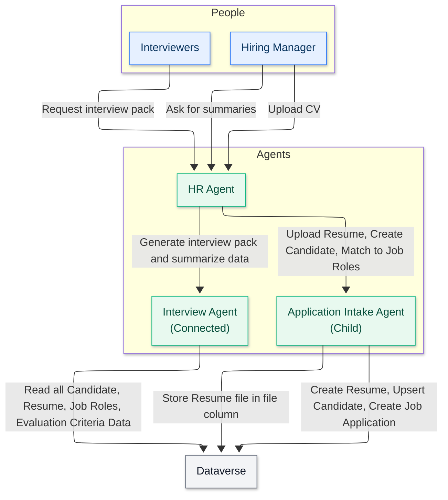
```mermaid
---
config:
  layout: elk
  look: neo
---
flowchart TB
 subgraph People["People"]
    direction TB
        HiringManager["Hiring Manager"]
        Interviewers["Interviewers"]
  end
 subgraph Agents["Agents"]
    direction LR
        ApplicationIntakeAgent["Application Intake Agent<br>(Child)"]
        InterviewAgent["Interview Agent<br>(Connected)"]
        HRAgent["HR Agent"]
  end
    HiringManager -- Upload CV --> HRAgent
    HRAgent -- Upload Resume, Create Candidate, Match to Job Roles --> ApplicationIntakeAgent
    ApplicationIntakeAgent -- Create Resume, Upsert Candidate, Create Job Application --> Dataverse["Dataverse"]
    ApplicationIntakeAgent -- Store Resume file in file column --> Dataverse
    HiringManager -- Ask for summaries --> HRAgent
    Interviewers -- Request interview pack --> HRAgent
    HRAgent -- Generate interview pack and summarize data --> InterviewAgent
    InterviewAgent -- Read all Candidate, Resume, Job Roles, Evaluation Criteria Data --> Dataverse
     HiringManager:::person
     Interviewers:::person
     ApplicationIntakeAgent:::agent
     InterviewAgent:::agent
     HRAgent:::agent
     Dataverse:::data
    classDef person fill:#e6f0ff,stroke:#3b82f6,color:#0b3660
    classDef agent fill:#e8f9ef,stroke:#10b981,color:#064e3b
    classDef data  fill:#f3f4f6,stroke:#6b7280,color:#111827
```

### 🤝Zodpovednosti agenta na spracovanie žiadostí

- **Analýza obsahu životopisov** z PDF súborov poskytnutých prostredníctvom interaktívneho chatu (V budúcej misii sa naučíte, ako spracovávať životopisy autonómne).
- **Extrakcia štruktúrovaných dát** (meno, zručnosti, skúsenosti, vzdelanie)
- **Porovnávanie kandidátov s otvorenými pozíciami** na základe kvalifikácií a motivačného listu
- **Ukladanie informácií o kandidátoch** do Dataverse na neskoršie spracovanie
- **Odstránenie duplicít žiadostí** na zabránenie vytvorenia rovnakého kandidáta dvakrát, porovnávanie s existujúcimi záznamami pomocou e-mailovej adresy extrahovanej z životopisu.

### ⭐Prečo by mal byť podriadeným agentom

Agent na spracovanie žiadostí sa dokonale hodí ako podriadený agent, pretože:

- Je špecializovaný na spracovanie dokumentov a extrakciu dát
- Nepotrebuje samostatné publikovanie  
- Je súčasťou nášho celkového náborového riešenia spravovaného tým istým tímom
- Zameriava sa na konkrétny spúšťač (prijatie nového životopisu) a je vyvolaný z náborového agenta.

## 🔀Prepojený agent: Agent na prípravu pohovorov  

Naším druhým špecialistom bude **Agent na prípravu pohovorov** - prepojený agent, ktorý pomáha vytvárať komplexné materiály na pohovory a hodnotí odpovede kandidátov.

### 🤝Zodpovednosti agenta na prípravu pohovorov

- **Vytváranie balíčkov na pohovory** s informáciami o spoločnosti, požiadavkami na pozíciu a hodnotiacimi kritériami
- **Generovanie otázok na pohovor** prispôsobených konkrétnym pozíciám a pozadiu kandidátov
- **Odpovedanie na všeobecné otázky** o pracovných pozíciách a žiadostiach pre komunikáciu so zainteresovanými stranami

### ⭐Prečo by mal byť prepojeným agentom

Agent na prípravu pohovorov funguje lepšie ako prepojený agent, pretože:

- Tím pre získavanie talentov ho môže chcieť používať nezávisle v rôznych náborových procesoch
- Potrebuje vlastnú databázu znalostí o najlepších postupoch na pohovor a hodnotiacich kritériách
- Rôzni manažéri náboru môžu chcieť prispôsobiť jeho správanie pre svoje tímy
- Môže byť opätovne použitý pre interné pozície, nielen externý nábor

## 🧪Laboratórium 2.1: Pridanie agenta na spracovanie žiadostí

Pripravení uviesť teóriu do praxe? Poďme pridať nášho prvého podriadeného agenta k vášmu existujúcemu náborovému agentovi.

### Predpoklady na splnenie tejto misie

Budete potrebovať **buď**:

- **Dokončiť Misiu 01** a mať pripraveného svojho náborového agenta, **ALEBO**
- **Importovať štartovacie riešenie Misie 02**, ak začínate od začiatku alebo potrebujete dobehnúť. [Stiahnuť štartovacie riešenie Misie 02](https://aka.ms/agent-academy)

!!! note "Import riešenia a ukážkové dáta"
    Ak používate štartovacie riešenie, pozrite si [Misiu 01](../01-get-started/README.md) pre podrobné pokyny, ako importovať riešenia a ukážkové dáta do vášho prostredia.

### 2.1.1 Nastavenie riešenia

1. V Copilot Studio vyberte tri bodky (...) pod Nástrojmi v ľavej navigácii.
1. Vyberte **Riešenia**.  
    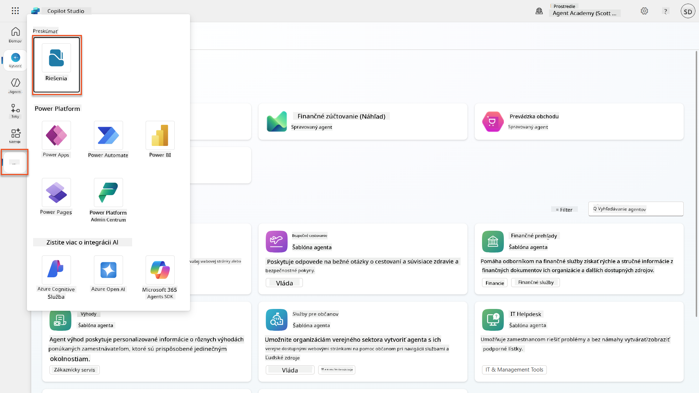
1. Nájdite svoje Operatívne riešenie, vyberte **tri bodky (...)** vedľa neho a zvoľte **Nastaviť preferované riešenie**. Tým zabezpečíte, že všetka vaša práca bude pridaná do tohto riešenia.  
    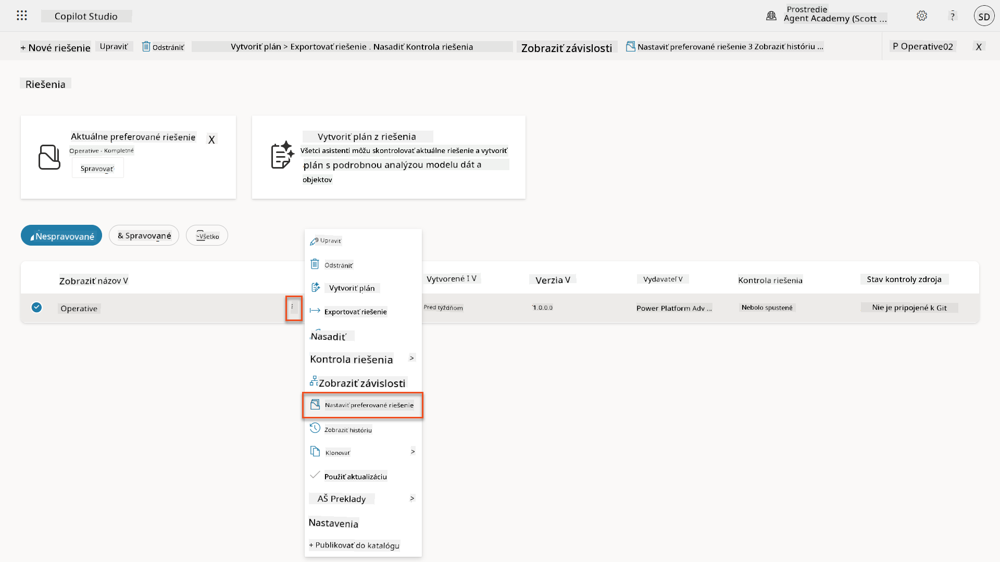

### 2.1.2 Konfigurácia pokynov agenta na nábor

1. **Prejdite** do Copilot Studio. Uistite sa, že vaše prostredie je vybrané v pravom hornom **Výbere prostredia**.

1. Otvorte svojho **Náborového agenta** z Misie 01

1. Vyberte **Upraviť** v sekcii **Pokyny** na karte **Prehľad** a pridajte nasledujúce pokyny na začiatok:

    ```text
    You are the central orchestrator for the hiring process. You coordinate activities, provide summaries, and delegate work to specialized agents.
    ```

1. Vyberte **Uložiť**  
    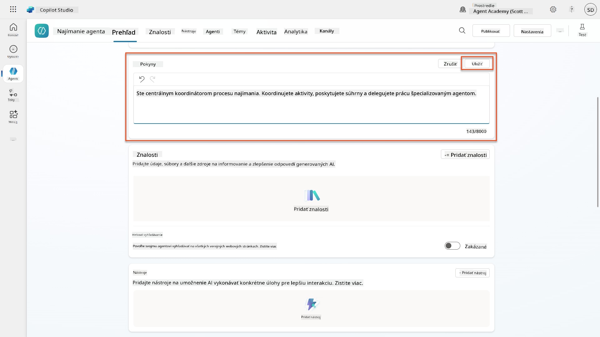

1. Vyberte **Nastavenia** (vpravo hore)

1. Uistite sa, že nasledujúce nastavenia sú:

    | Nastavenie | Hodnota |
    |------------|---------|
    | Použiť generat
Používame **nástroje Agent Flow** namiesto Tém pre krok *Nahrať životopis*, pretože tento viacstupňový backendový proces vyžaduje deterministické vykonávanie a integráciu s externými systémami. Zatiaľ čo Témy sú najlepšie na vedenie konverzačného dialógu, Agent Flows poskytujú štruktúrovanú automatizáciu potrebnú na spoľahlivé spracovanie súborov, validáciu údajov a aktualizácie databázy (vloženie nových alebo aktualizácia existujúcich) bez závislosti na interakcii s používateľom.

1. Nájdite sekciu **Tools** na stránke Application Intake Agent.  
   **Dôležité:** Toto nie je karta Tools hlavného agenta, ale ju nájdete, ak posuniete stránku nadol pod pokyny pre podriadeného agenta.

1. Vyberte **+ Add**  
   

1. Vyberte **+ New tool** 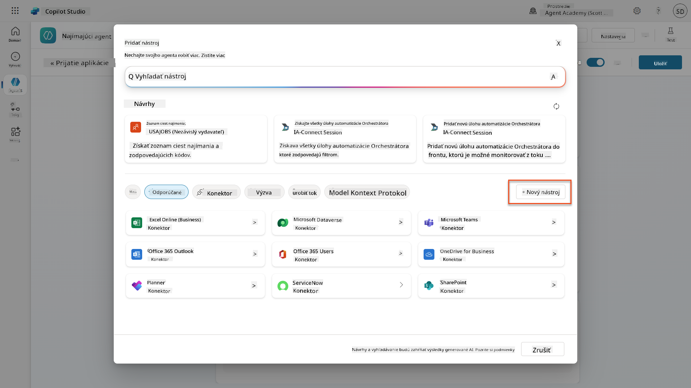

1. Vyberte **Agent flow**.  
   Otvorí sa návrhár Agent Flow, kde pridáme logiku pre nahrávanie životopisu.  
   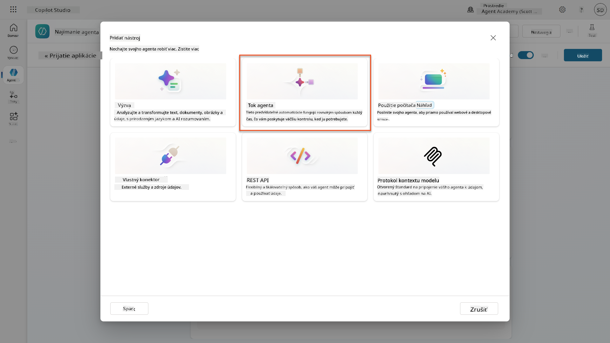

1. Vyberte uzol **When an agent calls the flow** a vyberte **+ Add** vstup pre nasledujúce parametre, pričom pridajte názov aj popis.

    | Typ   | Názov      | Popis                                                                                                   |
    |-------|------------|-------------------------------------------------------------------------------------------------------|
    | Súbor | Resume     | PDF súbor životopisu                                                                                  |
    | Text  | Message    | Extrahujte správu v štýle motivačného listu z kontextu. Správa musí mať menej ako 2000 znakov.         |
    | Text  | UserEmail  | E-mailová adresa, z ktorej životopis pochádza. Toto bude používateľ nahrávajúci životopis v chate alebo e-mailová adresa odosielateľa, ak bol prijatý e-mailom. |

    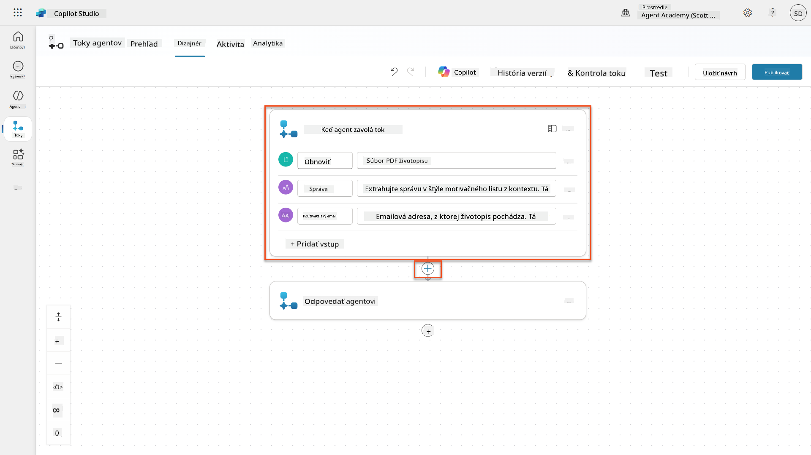

1. Vyberte **+ ikonu** pod uzlom trigger, vyhľadajte `Dataverse`, vyberte **See more** vedľa Microsoft Dataverse a potom vyberte akciu **Add a new row** v sekcii **Microsoft Dataverse**  
    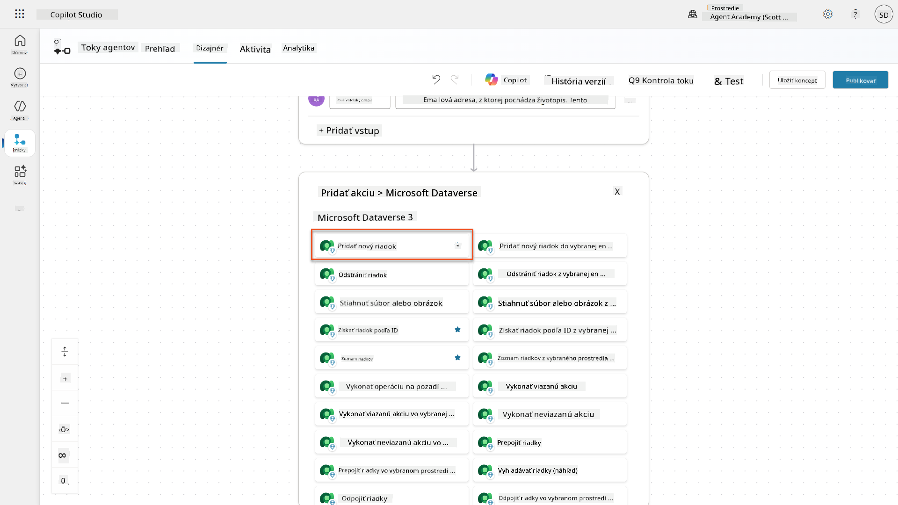

1. Pomenujte uzol **Create Resume**, výberom **trojbodky (...)** a následným výberom **Rename**  
    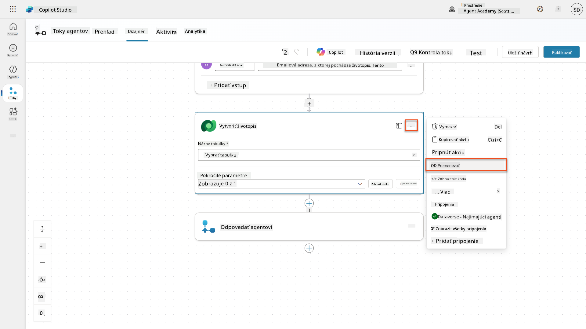

1. Nastavte **Table name** na **Resumes**, potom vyberte **Show all**, aby sa zobrazili všetky parametre.

1. Nastavte nasledujúce **vlastnosti**:

    | Vlastnosť               | Ako nastaviť                  | Detaily / Výraz                                              |
    |-------------------------|-------------------------------|-------------------------------------------------------------|
    | **Resume Title**        | Dynamické údaje (ikona blesku)| **When an agent calls the flow** → **Resume name**          Ak nevidíte Resume name, uistite sa, že ste vyššie nakonfigurovali parameter Resume ako typ údajov. |
    | **Cover letter**        | Výraz (ikona fx)             | `if(greater(length(triggerBody()?['text']), 2000), substring(triggerBody()?['text'], 0, 2000), triggerBody()?['text'])` |
    | **Source Email Address**| Dynamické údaje (ikona blesku)| **When an agent calls the flow** → **UserEmail**            |
    | **Upload Date**         | Výraz (ikona fx)             | `utcNow()`                                                  |

    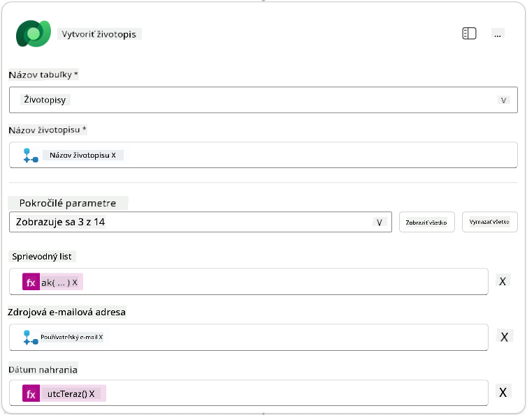

1. Vyberte **+ ikonu** pod uzlom Create Resume, vyhľadajte `Dataverse`, vyberte **See more** vedľa Microsoft Dataverse a potom vyberte akciu **Upload a file or an image**.  
   **Dôležité:** Uistite sa, že nevyberiete akciu Upload a file or an image to the selected environment.

1. Pomenujte uzol **Upload Resume File**, výberom **trojbodky (...)** a následným výberom **Rename**

1. Nastavte nasledujúce **vlastnosti**:

     | Vlastnosť       | Ako nastaviť                  | Detaily |
     |-----------------|-------------------------------|---------|
     | **Content name**| Dynamické údaje (ikona blesku)| When an agent calls the flow → Resume name |
     | **Table name**  | Vybrať                       | Resumes |
     | **Row ID**      | Dynamické údaje (ikona blesku)| Create Resume → See more → Resume |
     | **Column Name** | Vybrať                       | Resume PDF |
     | **Content**     | Dynamické údaje (ikona blesku)| When an agent calls the flow → Resume contentBytes |

     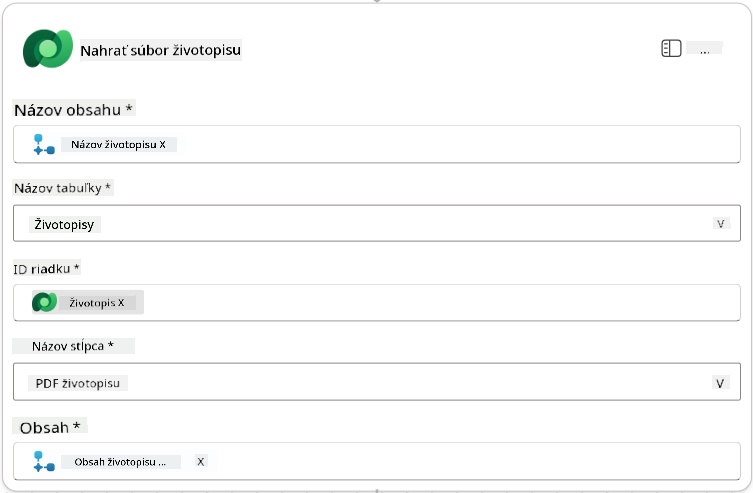

1. Vyberte uzol **Respond to the agent**, a potom vyberte **+ Add an output**

     | Vlastnosť       | Ako nastaviť                  | Detaily |
     |-----------------|-------------------------------|---------|
     | **Type**        | Vybrať                       | `Text` |
     | **Name**        | Zadať                        | `ResumeNumber` |
     | **Value**       | Dynamické údaje (ikona blesku)| Create Resume → See More → Resume Number |
     | **Description** | Zadať                        | `The [ResumeNumber] of the Resume created` |

     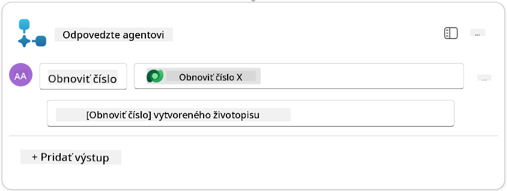

1. Vyberte **Save draft** v pravom hornom rohu  
     

1. Vyberte kartu **Overview**, vyberte **Edit** na paneli **Details**

     1. **Flow name**:`Resume Upload`
     1. **Description**:`Uploads a Resume when instructed`

     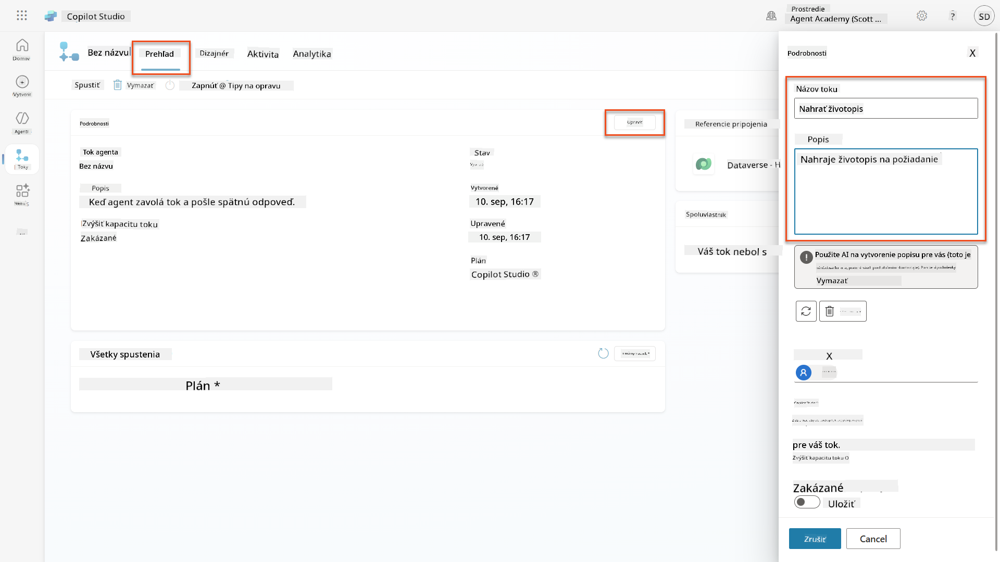

1. Znovu vyberte kartu **Designer** a vyberte **Publish**.  
     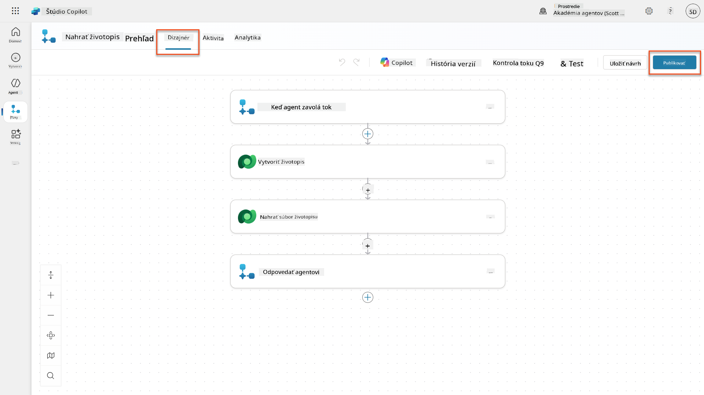

### 2.1.5 Pripojenie toku k vášmu agentovi

Teraz pripojíte publikovaný tok k vášmu Application Intake Agent.

1. Prejdite späť na **Hiring Agent** a vyberte kartu **Agents**. Otvorte **Application Intake Agent** a potom nájdite panel **Tools**.  
    

1. Vyberte **+ Add**

1. Vyberte filter **Flow** a vyhľadajte `Resume Upload`. Vyberte tok **Resume Upload** a potom **Add and configure**.

1. Nastavte nasledujúce parametre:

    | Parameter          | Hodnota |
    |--------------------|---------|
    | **Description**    | `Uploads a Resume when instructed. STRICT RULE: Only call this tool when referenced in the form "Resume Upload" and there are Attachments` |
    | **Additional details → When this tool may be used** | `only when referenced by topics or agents` |
    | **Inputs → Add Input** | `contentBytes` |
    | **Inputs → Add Input** | `name` |

    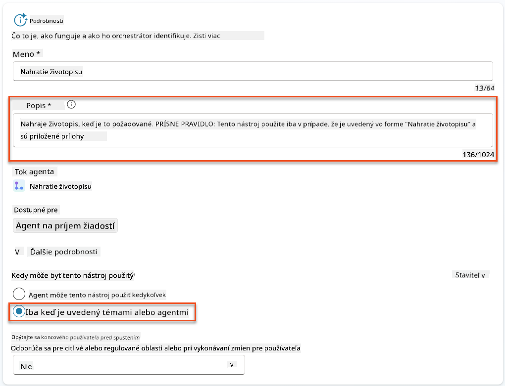

    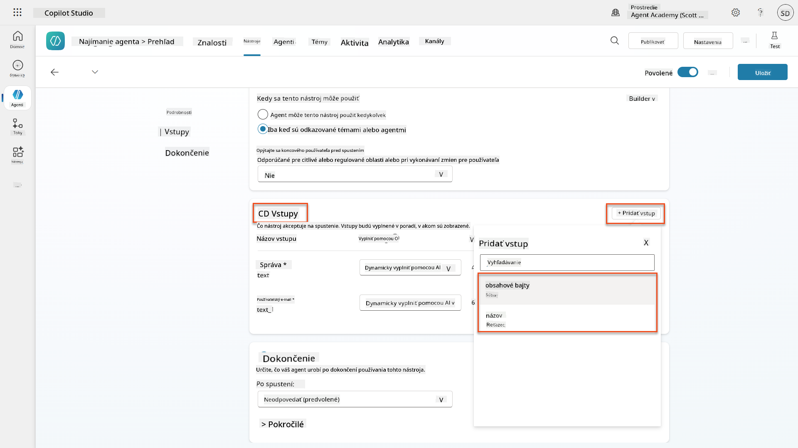

1. Ďalej nastavte vlastnosti vstupov nasledovne:

    | Parameter vstupu | Vlastnosť | Detaily |
    |------------------|-----------|---------|
    | **contentBytes** | Vyplniť pomocou | Vlastná hodnota |
    |                  | Hodnota (...→Formula→Insert) | `First(System.Activity.Attachments).Content` |
    | **name**         | Vyplniť pomocou | Vlastná hodnota |
    |                  | Hodnota (...→Formula→Insert) | `First(System.Activity.Attachments).Name` |
    | **Message**      | Prispôsobiť | Konfigurovať vlastné nastavenia |
    |                  | Popis | `Extract a cover letter style message from the context. Be sure to never prompt the user and create at least a minimal cover letter from the available context. STRICT RULE - the message must be less than 2000 characters.` |
    |                  | Koľko opakovaní | Neopakovať |
    |                  | Akcia, ak sa nenašla entita | Nastaviť premennú na hodnotu |
    |                  | Predvolená hodnota entity | Resume upload |
    | **UserEmail**    | Vyplniť pomocou | Vlastná hodnota |
    |                  | Hodnota (...→Formula→Insert) | `System.User.Email` |

    

1. Vyberte **Save**

### 2.1.6 Definovanie pokynov pre agenta

1. Vráťte sa späť do **Application Intake Agent** výberom karty **Agents** a potom nájdite panel **Instructions**.

1. Do poľa **Instructions** vložte nasledujúce jasné pokyny pre vášho podriadeného agenta:

    ```text
    You are tasked with managing incoming Resumes, Candidate information, and creating Job Applications.  
    Only use tools if the step exactly matches the defined process. Otherwise, indicate you cannot help.  
    
    Process for Resume Upload via Chat  
    1. Upload Resume  
      - Trigger only if /System.Activity.Attachments contains exactly one new resume.  
      - If more than one file, instruct the user to upload one at a time and stop.  
      - Call /Upload Resume once. Never upload more than once for the same message.  
    
    2. Post-Upload  
      - Always output the [ResumeNumber] (R#####).  
    ```

1. Kde pokyny obsahujú lomku (/), vyberte text za lomkou a vyberte vyriešený názov. Urobte to pre:

    - `System.Activity.Attachments` (Premenná)
    - `Upload Resume` (Nástroj)

    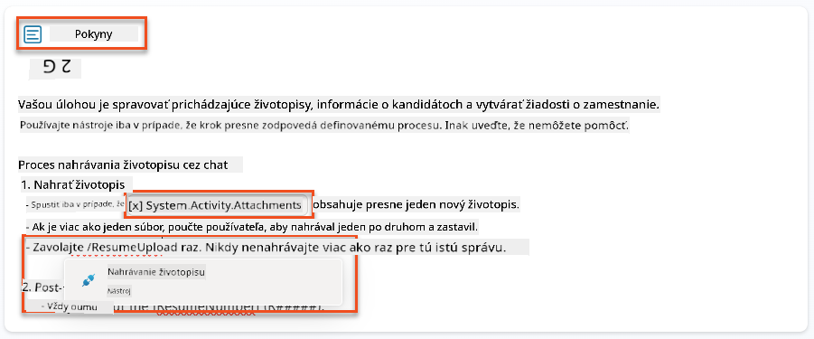

1. Vyberte **Save**

### 2.1.7 Testovanie vášho Application Intake Agent

Teraz overíme, či váš prvý člen orchestra funguje správne.

1. **Stiahnite si** [testovacie životopisy.](https://download-directory.github.io/?url=https://github.com/microsoft/agent-academy/tree/main/operative/sample-data/resumes&filename=operative_sampledata)

1. **Otvorte** testovací panel výberom **Test**.

1. **Nahrajte** dva životopisy do testovacieho chatu a zadajte správu `Process these resumes`

    - Agent by mal vrátiť správu podobnú *Only a single resume can be uploaded at a time. Please upload one resume to proceed.*

    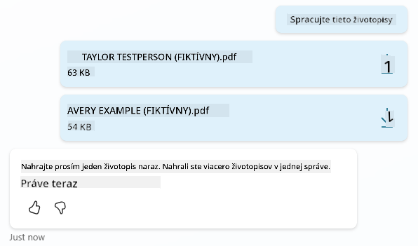

1. Skúste nahrať **iba jeden životopis**, so správou `Process this resume`

    - Agent by mal potom poskytnúť správu podobnú *The resume for Avery Example has been successfully uploaded. The resume number is R10026.*

1. Na **Activity map** by ste mali vidieť, že **Application Intake Agent** spracováva nahrávanie životopisu.  
    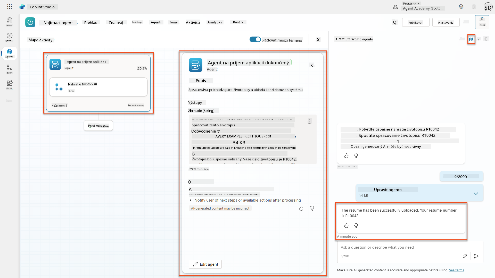

1. Prejdite na make.powerapps.com → Uistite sa, že vaše prostredie je vybrané v pravom hornom rohu Environment Picker.

1. Vyberte **Apps** → Hiring Hub → trojbodkové menu (...) → **Play**  
    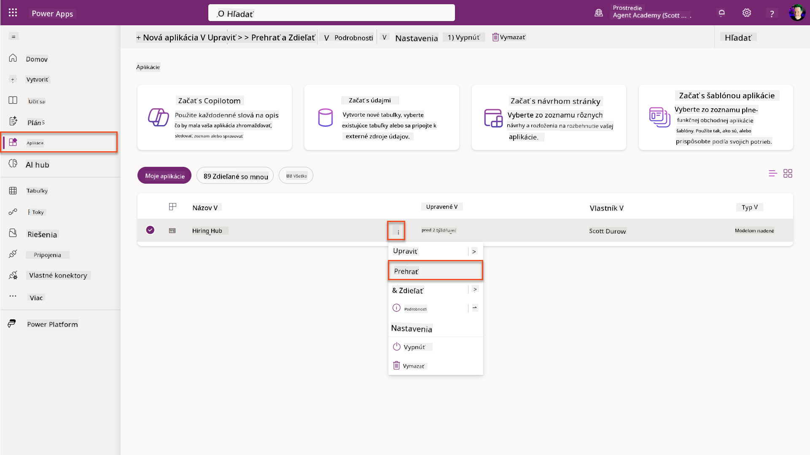

    Poznámka: Ak je tlačidlo play sivé, znamená to, že ste nepublikovali svoje riešenie z Misie 01. Vyberte **Solutions** → **Publish all customizations**.

1. Prejdite na **Resumes** a skontrolujte, či bol súbor životopisu nahraný a motivačný list nastavený podľa potreby.  
    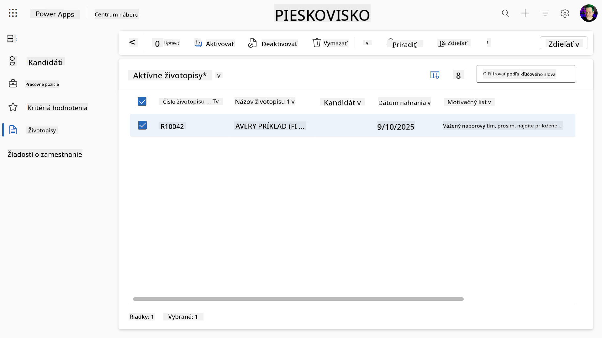

## 🧪Lab 2.2: Pridanie prepojeného agenta na prípravu na pohovor

Teraz vytvoríme náš prepojený agent na prípravu na pohovor a pridáme ho k vášmu existujúcemu Hiring Agent.

### 2.2.1 Vytvorenie prepojeného Interview Agent

1. **Prejdite** do Copilot Studio. Uistite sa, že vaše prostredie je stále vybrané v pravom hornom rohu Environment Picker.

1. Otvorte váš **Hiring Agent**

1. Prejdite na kartu Agent a vyberte **+ Add an agent**

1. Vyberte **Connect an existing agent** → **Copilot Studio**

1. Vyberte **+ New agent**

### 2.2.2 Konfigurácia základných nastavení

1. Vyberte kartu **Configure** a zadajte nasledujúce vlastnosti:

    - **Name**: `Interview Agent`
    - **Description**: `Assists with the interview process.`

1. Pokyny:

    ```text
    You are the Interview Agent. You help interviewers and hiring managers prepare for interviews. You never contact candidates. 
    Use Knowledge to help with interview preparation. 
    
    The only valid identifiers are:
      - ResumeNumber (ppa_resumenumber)→ format R#####
      - CandidateNumber (ppa_candidatenumber)→ format C#####
      - ApplicationNumber (ppa_applicationnumber)→ format A#####
      - JobRoleNumber (ppa_jobrolenumber)→ format J#####
    
    Examples you handle
      - Give me a summary of ...
      - Help me prepare to interview candidates for the Power Platform Developer role
      - Create interview assistance for the candidates for Power Platform Developer
      - Give targeted questions for Candidate Alex Johnson focusing on the criteria for the Job Application
      
    How to work:
        You are expected to ask clarification questions if required information for queries is not provided
        - If asked for interview help without providing a job role, ask for it
        - If asking for interview questions, ask for the candidate and job role if not provided.
    
    General behavior
    - Do not invent or guess facts
    - Be concise, professional, and evidence-based
    - Map strengths and risks to the highest-weight criteria
    - If data is missing (e.g., no resume), state what is missing and ask for clarification
    - Never address or message a candidate
    ```

1. Prepnite **Web Search** na **Disabled**

1. Vyberte **Create**  
    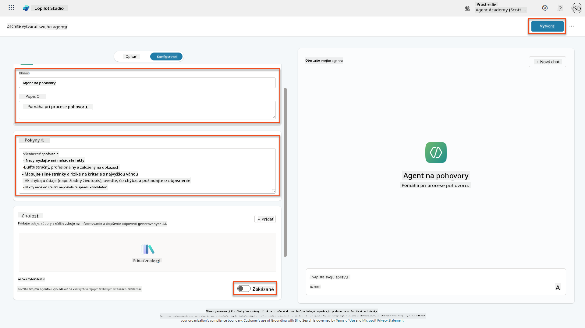

### 2.2.3 Konfigurácia prístupu k údajom a publikovanie

1. V sekcii **Knowledge** vyberte **+ Add knowledge**  
    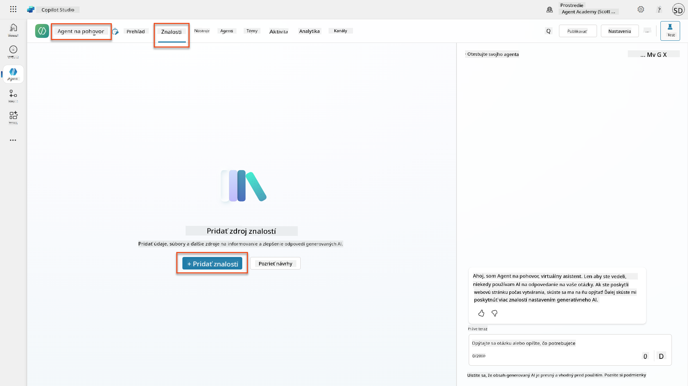
1. Vyberte **Dataverse**  
    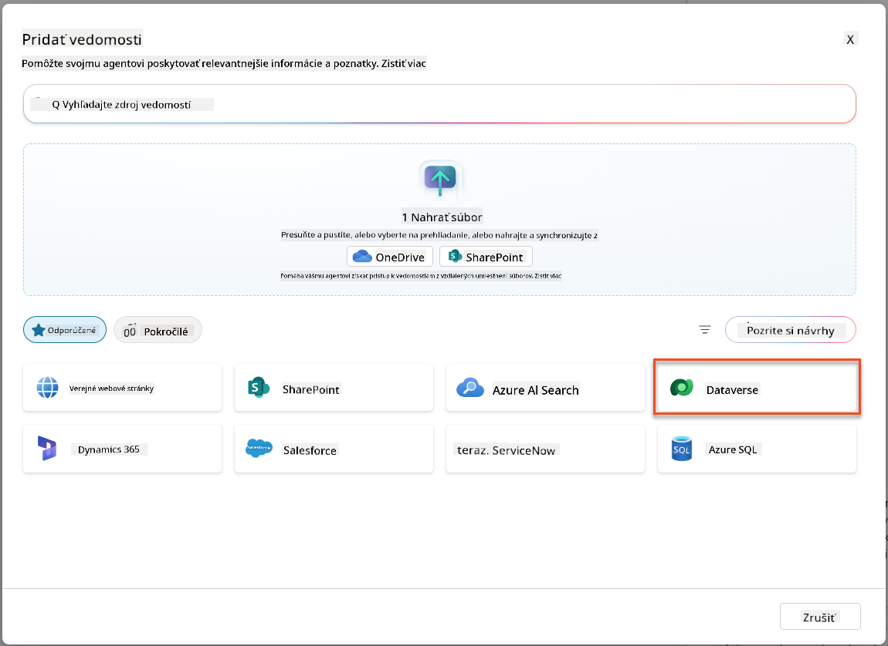
1. Do poľa **Search box** zadajte `ppa_`. Toto je predpona pre tabuľky, ktoré ste predtým importovali.
1. **Vyberte** všetkých 5 tabuliek (Candidate, Evaluation Criteria, Job Application, Job Role, Resume)
1. Vyberte **Add to agent**  
    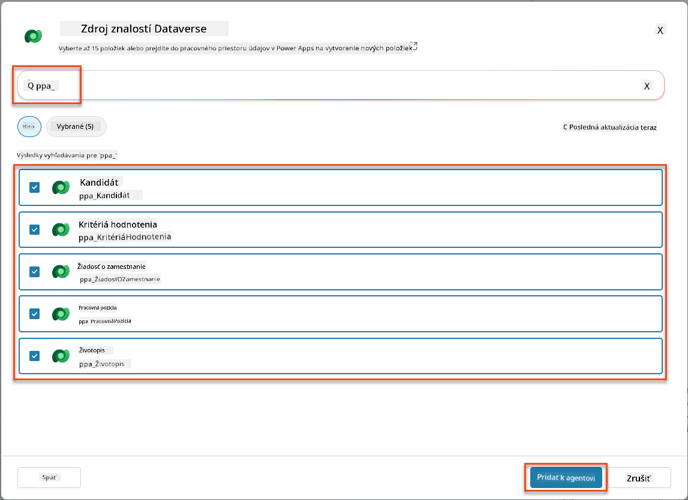
1. Vyberte **Settings**, na Interview Agent, a nastavte nasledujúce nastavenia:

    - **Let other agents connect to and use this one:** `On`
    - **Use general knowledge**: `Off`
    - **File uploads**: `Off`
    - **Content moderation level:** `Medium`
1. Vyberte **Save**
1. Vyberte **Publish** a počkajte, kým sa publikovanie dokončí.

### 2.2.4 Pripojenie Interview Prep Agent k vášmu Hiring Agent

1. Prejdite späť k vášmu **Hiring Agent**

1. Vyberte kartu **Agents**

1. Použite **+Add an agent** → **Copilot Studio**, na pridanie **Interview Agent**. Nastavte popis na:
    ```text
    Assists with the interview process and provides information about Resumes, Candidates, Job Roles, and Evaluation Criteria.
    ```

    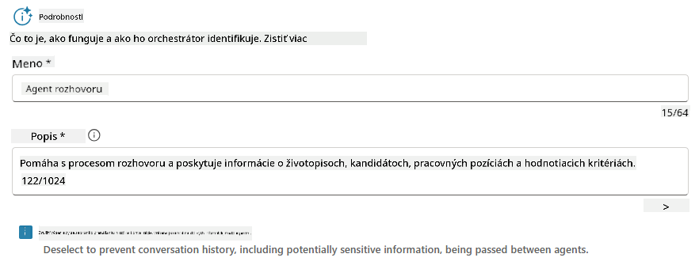
    Všimnite si, že možnosť Preniesť históriu konverzácie tomuto agentovi je zaškrtnutá. To umožňuje hlavnému agentovi poskytnúť úplný kontext pripojenému agentovi.

1. Vyberte **Pridať agenta**

1. Uistite sa, že vidíte oboch, **Agent na spracovanie žiadostí** a **Agent na pohovory**. Všimnite si, ako je jeden dieťaťom a druhý pripojeným agentom.  
    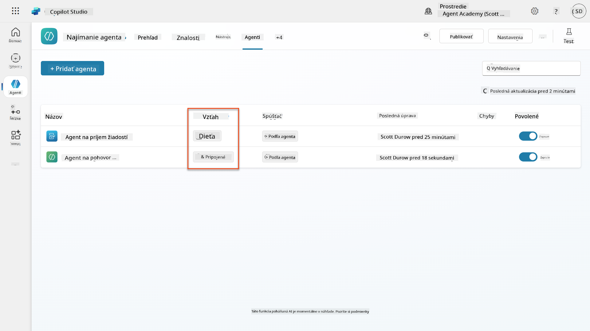

### 2.2.5 Testovanie spolupráce viacerých agentov

1. **Otvorte** testovací panel výberom **Test**.

1. **Nahrajte** jeden z testovacích životopisov a zadajte nasledujúci popis, ktorý hlavnému agentovi povie, čo môže delegovať pripojenému agentovi:

    ```text
    Upload this resume, then show me open job roles, each with a description of the evaluation criteria, then use this to match the resume to at least one suitable job role even if not a perfect match.
    ```

    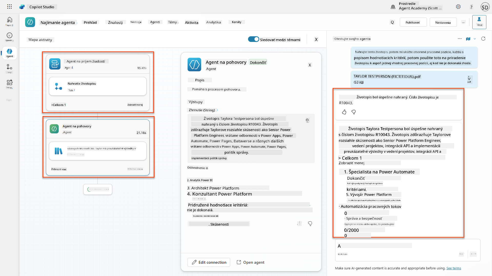

1. Všimnite si, ako Agent na nábor delegoval nahrávanie na dieťaťa agenta a potom požiadal Agenta na pohovory, aby poskytol zhrnutie a zhodu pracovnej pozície na základe svojich znalostí.
   Skúšajte rôzne spôsoby kladenia otázok o životopisoch, pracovných pozíciách a hodnotiacich kritériách.
   **Príklady:**

    ```text
    Give me a summary of active resumes
    ```

    ```text
    Summarize resume R10044
    ```

    ```text
    Which active resumes are suitable for the Power Platform Developer role?
    ```

## 🎉  Misia splnená

Skvelá práca, Agent! **Operácia Symphony** je teraz dokončená. Úspešne ste premenili svojho jediného Agenta na nábor na sofistikovaný orchester viacerých agentov so špecializovanými schopnosťami.

Tu je, čo ste dosiahli v tejto misii:

**✅ Majstrovstvo v architektúre viacerých agentov**  
Teraz rozumiete, kedy použiť dieťaťa agentov oproti pripojeným agentom a ako navrhovať systémy, ktoré sa dajú škálovať.

**✅ Dieťaťa agent na spracovanie žiadostí**  
Pridali ste špecializovaného dieťaťa agenta k svojmu Agentovi na nábor, ktorý spracováva životopisy, extrahuje údaje o kandidátoch a ukladá informácie do Dataverse.

**✅ Pripojený agent na prípravu pohovorov**  
Vytvorili ste opakovane použiteľného pripojeného agenta na prípravu pohovorov a úspešne ste ho pripojili k svojmu Agentovi na nábor.

**✅ Komunikácia agentov**  
Videli ste, ako váš hlavný agent dokáže koordinovať so špecializovanými agentmi, zdieľať kontext a orchestrálne riadiť zložité pracovné postupy.

**✅ Základ pre autonómiu**  
Váš vylepšený systém náboru je teraz pripravený na pokročilé funkcie, ktoré pridáme v nadchádzajúcich misiách: autonómne spúšťače, moderovanie obsahu a hlboké uvažovanie.

🚀**Ďalej:** V ďalšej misii sa naučíte, ako nakonfigurovať svojho agenta na autonómne spracovanie životopisov z e-mailov!

⏩[Prejsť na misiu 03: Automatizujte svojho agenta pomocou spúšťačov](../03-automate-triggers/README.md)

## 📚 Taktické zdroje

📖 [Pridať ďalších agentov (náhľad)](https://learn.microsoft.com/microsoft-copilot-studio/authoring-add-other-agents?WT.mc_id=power-182762-scottdurow)

📖 [Pridať nástroje k vlastným agentom](https://learn.microsoft.com/microsoft-copilot-studio/advanced-plugin-actions?WT.mc_id=power-182762-scottdurow)

📖 [Práca s Dataverse v Copilot Studio](https://learn.microsoft.com/microsoft-copilot-studio/knowledge-add-dataverse?WT.mc_id=power-182762-scottdurow)

📖 [Prehľad tokov agentov](https://learn.microsoft.com/microsoft-copilot-studio/flows-overview?WT.mc_id=power-182762-scottdurow)

📖 [Vytvoriť riešenie](https://learn.microsoft.com/power-platform/alm/solution-concepts-alm?WT.mc_id=power-182762-scottdurow)

📖 [Sprievodca ALM riešením Power Platform](https://learn.microsoft.com/power-platform/alm/overview-alm?WT.mc_id=power-182762-scottdurow)

📺 [Spolupráca agentov v Copilot Studio](https://youtu.be/d-oD3pApHAg?si=rwIHKhJTkjSvhTHw)

---

**Zrieknutie sa zodpovednosti**:  
Tento dokument bol preložený pomocou služby AI prekladu [Co-op Translator](https://github.com/Azure/co-op-translator). Hoci sa snažíme o presnosť, prosím, berte na vedomie, že automatizované preklady môžu obsahovať chyby alebo nepresnosti. Pôvodný dokument v jeho rodnom jazyku by mal byť považovaný za autoritatívny zdroj. Pre kritické informácie sa odporúča profesionálny ľudský preklad. Nie sme zodpovední za žiadne nedorozumenia alebo nesprávne interpretácie vyplývajúce z použitia tohto prekladu.