<!--
CO_OP_TRANSLATOR_METADATA:
{
  "original_hash": "616d142d4fb5f45d2a168fad6c1f9545",
  "translation_date": "2025-10-20T18:30:04+00:00",
  "source_file": "docs/operative-preview/07-multimodal-prompts/README.md",
  "language_code": "sk"
}
-->
# 🚨 Misia 07: Extrahovanie obsahu životopisov pomocou multimodálnych výziev

--8<-- "disclaimer.md"

## 🕵️‍♂️ KRYCIE MENO: `DOKUMENT ŽIVOTOPIS REKON`

> **⏱️ Časový rámec operácie:** `~45 minút`

## 🎯 Popis misie

Vitajte, Operatívci. Vaše predchádzajúce misie vás vybavili silnými zručnosťami v orchestrácii agentov, ale teraz je čas odomknúť schopnosť, ktorá mení pravidlá hry: **analýza multimodálnych dokumentov**.

Vaša úloha, ak sa ju rozhodnete prijať, je **Dokument Životopis Rekon** - presné extrahovanie štruktúrovaných údajov z akéhokoľvek dokumentu. Zatiaľ čo vaši agenti dokážu ľahko spracovať text, skutočný svet si vyžaduje každodenné spracovanie PDF, obrázkov a zložitých dokumentov. Životopisy sa hromadia, faktúry potrebujú spracovanie a formuláre vyžadujú okamžitú digitalizáciu.

Táto misia vás premení z tvorcu agentov pracujúcich len s textom na **multimodálneho experta**. Naučíte sa konfigurovať AI, ktorá číta a rozumie dokumentom ako ľudský analytik - ale s rýchlosťou a konzistenciou AI. Na konci misie budete mať vybudovaný kompletný systém na extrahovanie životopisov, ktorý sa integruje do vášho náborového procesu.

Techniky, ktoré sa tu naučíte, budú nevyhnutné pre pokročilé operácie s dátami vo vašej ďalšej misii.

## 🔎 Ciele

V tejto misii sa naučíte:

1. Čo sú multimodálne výzvy a kedy používať rôzne AI modely
1. Ako konfigurovať výzvy s obrazovými a dokumentovými vstupmi
1. Ako formátovať výstupy výziev ako JSON pre extrahovanie štruktúrovaných údajov
1. Najlepšie postupy pri navrhovaní výziev pre analýzu dokumentov
1. Ako integrovať multimodálne výzvy s Agent Flows

## 🧠 Pochopenie multimodálnych výziev

### Čo robí výzvu "multimodálnou"?

Tradičné výzvy pracujú iba s textom. Multimodálne výzvy však dokážu spracovať viacero typov obsahu:

- **Text**: Písomné inštrukcie a obsah
- **Obrázky**: Fotografie, snímky obrazovky, grafy a diagramy (.PNG, .JPG, .JPEG)  
- **Dokumenty**: Faktúry, životopisy, formuláre (.PDF)

Táto schopnosť otvára silné scenáre, ako je analýza životopisov, spracovanie faktúr alebo extrahovanie údajov z formulárov.

### Prečo sú multimodálne výzvy dôležité pre vaše pracovné postupy

Každý deň vaša organizácia čelí týmto výzvam pri spracovaní dokumentov:

- **Prezeranie životopisov**: Ručné čítanie stoviek životopisov zaberá cenný čas
- **Spracovanie faktúr**: Extrahovanie údajov o dodávateľoch, sumách a dátumoch z rôznych formátov dokumentov
- **Analýza formulárov**: Konverzia papierových formulárov na digitálne údaje

Multimodálne výzvy eliminujú tieto prekážky kombináciou jazykového porozumenia AI s vizuálnymi analytickými schopnosťami. To dáva vašej AI schopnosť spracovávať dokumenty rovnako efektívne ako text.

### Bežné obchodné scenáre

Tu sú niektoré príklady použitia multimodálnych výziev:

| Scenár                | Úloha                                                                                                                                      | Príklad výstupných polí                                                                                   |
|-----------------------|-------------------------------------------------------------------------------------------------------------------------------------------|---------------------------------------------------------------------------------------------------------|
| **Prezeranie životopisov**    | Extrahovanie mena kandidáta, e-mailu, telefónneho čísla, aktuálneho titulu, rokov skúseností a kľúčových zručností.                                                 | Meno kandidáta, E-mailová adresa, Telefónne číslo, Aktuálny pracovný titul, Roky skúseností, Kľúčové zručnosti         |
| **Spracovanie faktúr**  | Extrahovanie informácií o dodávateľovi, dátume faktúry, celkovej sume a položkách z tejto faktúry.                                                 | Meno dodávateľa, Dátum faktúry, Celková suma, Položky faktúry                                             |
| **Analýza formulárov**       | Analyzovanie tohto formulára žiadosti a extrahovanie všetkých vyplnených polí.                                                                              | Názov poľa (napr. Meno žiadateľa), Zadaná hodnota (napr. Ján Novák), ...                                  |
| **Overenie dokladu totožnosti** | Extrahovanie mena, čísla dokladu, dátumu platnosti a adresy z tohto dokladu totožnosti. Overenie, že všetok text je jasne čitateľný a označenie nejasných častí. | Celé meno, Číslo dokladu totožnosti, Dátum platnosti, Adresa, Označenie nejasných častí                        |

## ⚙️ Výber modelu v AI Builder

AI Builder ponúka rôzne modely optimalizované pre konkrétne úlohy. Pochopenie, ktorý model použiť, je kľúčové pre úspech.

!!! note "Platné od septembra 2025"
    Modely AI Builder sa pravidelne aktualizujú, preto si pozrite najnovšiu [dokumentáciu nastavení modelov AI Builder](https://learn.microsoft.com/ai-builder/prompt-modelsettings) pre aktuálnu dostupnosť modelov.

### Porovnanie modelov

Všetky nasledujúce modely podporujú spracovanie vizuálnych a dokumentových údajov

| Model | 💰Cena | ⚡Rýchlosť | ✅Najlepšie pre |
|-------|------|-------|----------|
| **GPT-4.1 mini** | Základný (najekonomickejší) | Rýchly | Štandardné spracovanie dokumentov, sumarizácia, projekty s obmedzeným rozpočtom |
| **GPT-4.1** | Štandardný | Stredný | Zložité dokumenty, pokročilé vytváranie obsahu, potreby vysokej presnosti |
| **o3** | Prémiový | Pomalý (najprv dôvody) | Analýza údajov, kritické myslenie, sofistikované riešenie problémov |
| **GPT-5 chat** | Štandardný | Vylepšený | Najnovšie porozumenie dokumentom, najvyššia presnosť odpovedí |
| **GPT-5 reasoning** | Prémiový | Pomalý (zložitá analýza) | Najsofistikovanejšia analýza, plánovanie, pokročilé uvažovanie |

### Vysvetlenie nastavení teploty

Teplota ovláda, ako kreatívne alebo predvídateľné sú odpovede AI:

- **Teplota 0**: Najpredvídateľnejšie, konzistentné výsledky (najlepšie pre extrahovanie údajov)
- **Teplota 0.5**: Vyvážená kreativita a konzistencia  
- **Teplota 1**: Maximálna kreativita (najlepšie pre generovanie obsahu)

Pre analýzu dokumentov použite **teplotu 0**, aby ste zabezpečili konzistentné extrahovanie údajov.

## 📊 Formáty výstupov: Text vs JSON

Výber správneho formátu výstupu je kritický pre následné spracovanie.

### Kedy použiť textový výstup

Textový výstup je vhodný pre:

- Čitateľné zhrnutia pre ľudí
- Jednoduché klasifikácie
- Obsah, ktorý nepotrebuje štruktúrované spracovanie

### Kedy použiť JSON výstup

JSON výstup je nevyhnutný pre:

- Extrahovanie štruktúrovaných údajov
- Integráciu s databázami alebo systémami
- Spracovanie v Power Automate flow
- Konzistentné mapovanie polí

### Najlepšie postupy pre JSON

1. **Definujte jasné názvy polí**: Používajte popisné, konzistentné názvy
1. **Poskytnite príklady**: Zahrňte ukážkové výstupy a hodnoty pre každé pole
1. **Špecifikujte typy údajov**: Zahrňte príklady pre dátumy, čísla a text
1. **Riešte chýbajúce údaje**: Plánujte pre nulové alebo prázdne hodnoty
1. **Validujte štruktúru**: Testujte s rôznymi typmi dokumentov

### Úvahy o kvalite dokumentov

- **Rozlíšenie**: Zabezpečte, aby boli obrázky jasné a čitateľné
- **Orientácia**: Otočte dokumenty do správnej orientácie pred spracovaním
- **Podpora formátov**: Testujte s vašimi konkrétnymi typmi dokumentov (PDF, JPG, PNG)
- **Obmedzenia veľkosti**: Buďte si vedomí obmedzení veľkosti súborov vo vašom prostredí

### Optimalizácia výkonu

- **Vyberte vhodné modely**: Aktualizujte modely len v prípade potreby
- **Optimalizujte výzvy**: Často kratšie, jasnejšie inštrukcie fungujú lepšie
- **Riešenie chýb**: Plánujte pre dokumenty, ktoré sa nedajú spracovať
- **Monitorujte náklady**: Rôzne modely spotrebujú rôzne množstvo kreditov AI Builder

## 🧪 Laboratórium 7: Budovanie systému na extrahovanie životopisov

Čas uviesť vaše znalosti o multimodálnych výzvach do praxe. Vybudujete komplexný systém na extrahovanie životopisov, ktorý analyzuje dokumenty kandidátov a transformuje ich na štruktúrované údaje pre váš náborový proces.

### Predpoklady na splnenie tejto misie

1. Budete potrebovať **buď**:

    - **Dokončiť Misia 06** a mať pripravený váš multi-agentový náborový systém, **ALEBO**
    - **Importovať štartovacie riešenie Misia 07**, ak začínate od začiatku alebo potrebujete dobehnúť. [Stiahnuť štartovacie riešenie Misia 07](https://aka.ms/agent-academy)

1. Ukážkové dokumenty životopisov z [Testovacie životopisy](https://download-directory.github.io/?url=https://github.com/microsoft/agent-academy/tree/main/operative/sample-data/resumes&filename=operative_sampledata)

!!! note "Import riešenia a ukážkových údajov"
    Ak používate štartovacie riešenie, pozrite si [Misia 01](../01-get-started/README.md) pre podrobné pokyny, ako importovať riešenia a ukážkové údaje do vášho prostredia.

### 7.1 Vytvorenie multimodálnej výzvy

Vaším prvým cieľom je vytvoriť výzvu schopnú analyzovať dokumenty životopisov a extrahovať štruktúrované údaje.

1. Prihláste sa do [Copilot Studio](https://copilotstudio.microsoft.com) a vyberte **Nástroje** z ľavej navigácie.

1. Vyberte **+ Nový nástroj**, potom vyberte **Výzva**.  
    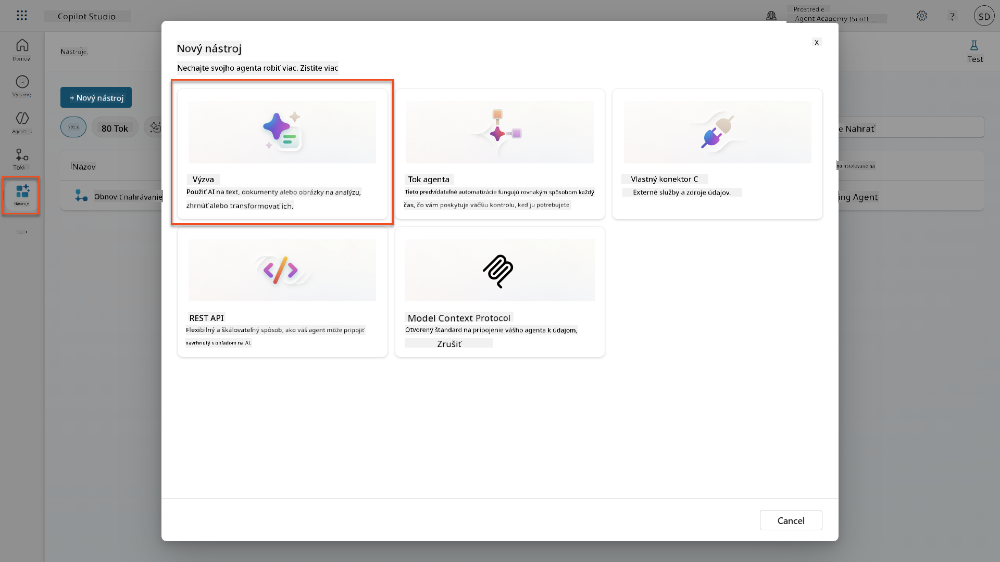

1. **Premenujte** výzvu z predvoleného názvu s časovou pečiatkou (napr. *Vlastná výzva 09/04/2025, 04:59:11 PM*) na `Zhrnutie životopisu`.

1. Do poľa Inštrukcie pridajte túto výzvu:

    ```text
    You are tasked with extracting key candidate information from a resume and cover letter to facilitate matching with open job roles and creating a summary for application review.
    
    Instructions:
    1. Extract Candidate Details:
        - Identify and extract the candidate’s full name.
        - Extract contact information, specifically the email address.
    2. Create Candidate Summary:
        - Summarize the candidate’s profile as multiline text (max 2000 characters) with the following sections:
            - Candidate name
            - Role(s) applied for if present
            - Contact and location
            - One-paragraph summary
            - Experience snapshot (last 2–3 roles with outcomes)
            - Key projects (1–3 with metrics)
            - Education and certifications
            - Top skills (Top 10)
            - Availability and work authorization
    
    Guidelines:
    - Extract information only from the provided resume and cover letter documents.
    - Ensure accuracy in identifying all details such as contact details and skills.
    - The summary should be concise but informative, suitable for quick application review.
    
    Resume: /document
    CoverLetter: /text
    ```

    !!! tip "Použite asistenciu Copilot"
        Môžete použiť "Začať s Copilotom" na generovanie vašej výzvy pomocou prirodzeného jazyka. Skúste požiadať Copilota, aby vytvoril výzvu na zhrnutie životopisu!

1. **Konfigurujte** vstupné parametre:

    | Parameter | Typ | Názov | Ukážkové údaje |
    |-----------|------|------|-------------|
    | Životopis | Obrázok alebo dokument | Životopis | Nahrajte ukážkový životopis z testovacieho priečinka |
    | Motivačný list | Text | Motivačný list | Tu je životopis! |

1. Vyberte **Test**, aby ste videli počiatočný textový výstup z vašej výzvy.  
    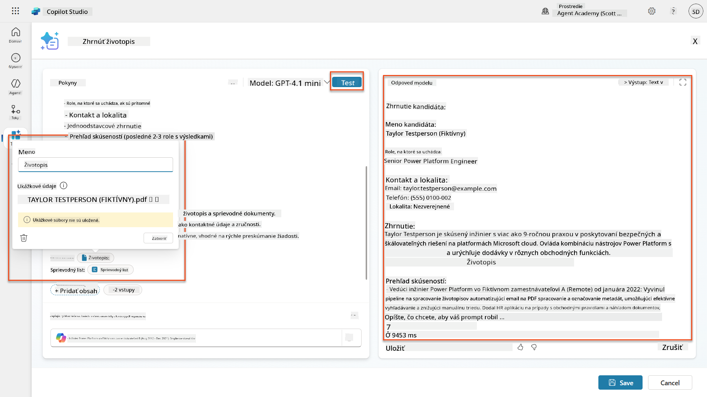

### 7.2 Konfigurácia JSON výstupu

Teraz konvertujete výzvu na výstup štruktúrovaných údajov vo formáte JSON namiesto obyčajného textu.

1. Pridajte túto špecifikáciu formátu JSON na koniec inštrukcií vašej výzvy:

    ```text
    Output Format:
    Provide the output in valid JSON format with the following structure:
    
    {
        "CandidateName": "string",
        "Email": "string",
        "Summary": "string max 2000 characters",
        "Skills": [ {"item": "Skill 1"}, {"item": "Skill 2"}],
        "Experience": [ {"item": "Experience 1"}, {"item": "Experience 2"}],
    }
    ```

1. Zmeňte nastavenie **Výstup** z "Text" na **JSON**.

1. Vyberte **Test** znova, aby ste overili, že výstup je teraz formátovaný ako JSON.  
    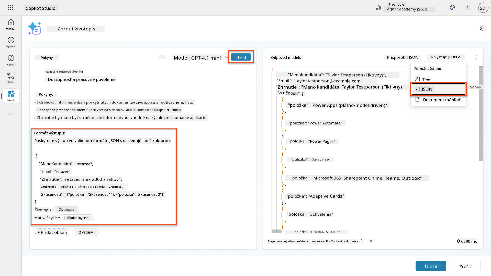

1. **Voliteľné:** Experimentujte s rôznymi AI modelmi, aby ste videli, ako sa výstupy líšia, potom sa vráťte k predvolenému modelu.

1. Vyberte **Uložiť**, aby ste vytvorili výzvu.

1. V dialógu **Konfigurácia na použitie v agentovi** vyberte **Zrušiť**.

    !!! info "Prečo túto výzvu nepridávame ako nástroj"
        Túto výzvu použijete v Agent Flow namiesto priamo ako nástroj, čo vám dáva väčšiu kontrolu nad pracovným postupom spracovania údajov.

### 7.3 Pridanie výzvy do Agent Flow

Vytvoríte Agent Flow, ktorý používa vašu výzvu na spracovanie životopisov uložených v Dataverse.

!!! tip "Výrazy Agent Flow"
    Je veľmi dôležité, aby ste presne dodržiavali pokyny na pomenovanie vašich uzlov a zadávanie výrazov, pretože výrazy odkazujú na predchádzajúce uzly pomocou ich názvu! Pozrite si [Misia Agent Flow v Recruit](../../recruit/09-add-an-agent-flow/README.md#you-mentioned-expressions-what-are-expressions) pre rýchle osvieženie!

1. Prejdite na váš **Náborový agent** v Copilot Studio

1. Vyberte kartu **Agenti** a vyberte podriadeného **Agent na príjem žiadostí**

1. V paneli **Nástroje** vyberte **+ Pridať** → **+ Nový nástroj** → **Agent flow**

1. Vyberte uzol Keď agent zavolá flow, použite **+ Pridať vstup** na pridanie nasledujúceho parametra:

    | Typ | Názov | Popis |
    |------|------|-------------|
    | Text | Číslo životopisu | Uistite sa, že používate [Číslo životopisu]. Toto musí vždy začínať písmenom R |

1. Vyberte ikonu **+** Vložiť akciu pod prvým uzlom, vyhľadajte **Dataverse**, vyberte **Zobraziť viac**, a potom nájdite akciu **Zoznam riadkov**

1. Vyberte **tri bodky (...)** na uzle Zoznam riadkov a vyberte **Premenovať** na `Získať záznam životopisu`, a potom nastavte nasledujúce parametre:

    | Vlastnosť | Ako nastaviť | Hodnota |
    |----------|------------|-------|
    | **Názov tabuľky** | Vybrať | Životopisy |
    | **Filter riadkov** | Dynamické údaje (ikona blesku) | `ppa_resumenumber eq 'Číslo životopisu'` Nahraďte **Číslo životopisu** s **Keď agent zavolá flow** → **Číslo životopisu** |
    | **Počet riadkov** | Zadať | 1 |

    !!! tip "Optimalizujte tieto dotazy!"
        Pri používaní tejto techniky v produkcii by ste mali vždy obmedziť vyberané stĺpce len na tie, ktoré sú potrebné pre Agent Flow.

     | `first(body('Get_Resume_Record')?['value'])?['ppa_coverletter']` |
| **Životopis** | Dynamické údaje (ikona blesku) | Stiahnuť životopis → Obsah súboru alebo obrázku |

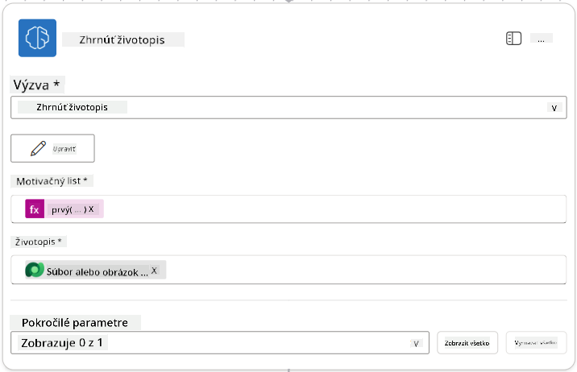

!!! tip "Parametre výzvy"
    Všimnite si, že parametre, ktoré vypĺňate, sú rovnaké ako tie, ktoré ste nastavili ako vstupné parametre pri vytváraní výzvy.

### 7.4 Vytvorenie záznamu kandidáta

Ďalej musíte použiť informácie, ktoré vám poskytla výzva, a vytvoriť nový záznam kandidáta, ak ešte neexistuje.

1. Vyberte ikonu **+** Vložiť akciu pod uzlom Zhrnúť životopis, vyhľadajte **Dataverse**, vyberte **Zobraziť viac** a potom nájdite akciu **List rows**.

1. Premenujte uzol na `Get Existing Candidate` a nastavte nasledujúce parametre:

    | Vlastnosť | Ako nastaviť | Hodnota |
    |-----------|--------------|---------|
    | **Názov tabuľky** | Vybrať | Kandidáti |
    | **Filtrovať riadky** | Dynamické údaje (ikona blesku) | `ppa_email eq 'Email'`  **Nahradiť** `Email` za **Zhrnúť životopis → Email** |
    | **Počet riadkov** | Zadať | 1 |

    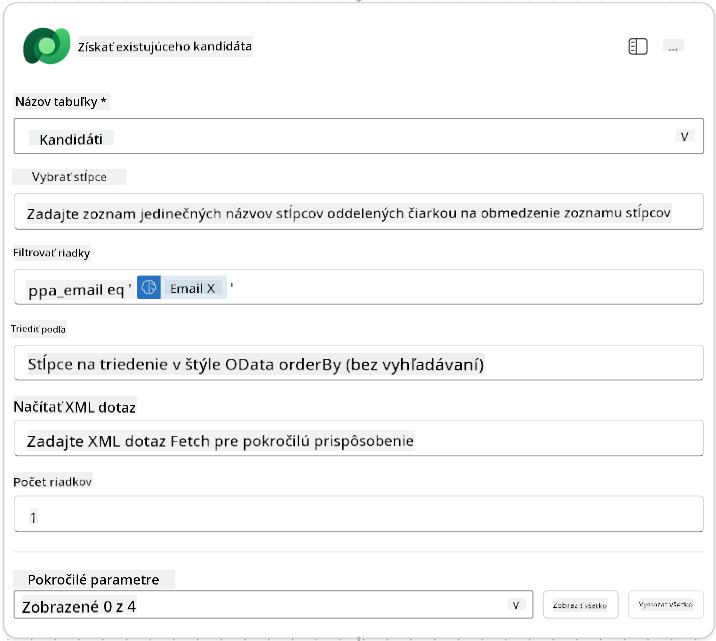

1. Vyberte ikonu **+** Vložiť akciu pod uzlom Get Existing Candidate, vyhľadajte **Control**, vyberte **Zobraziť viac** a potom nájdite akciu **Condition**.

1. V nastaveniach podmienky nastavte nasledujúcu podmienku:

    | Podmienka | Operátor | Hodnota |
    |-----------|----------|---------|
    | Výraz (ikona fx): `length(outputs('Get_Existing_Candidate')?['body/value'])` | rovná sa | 0 |

    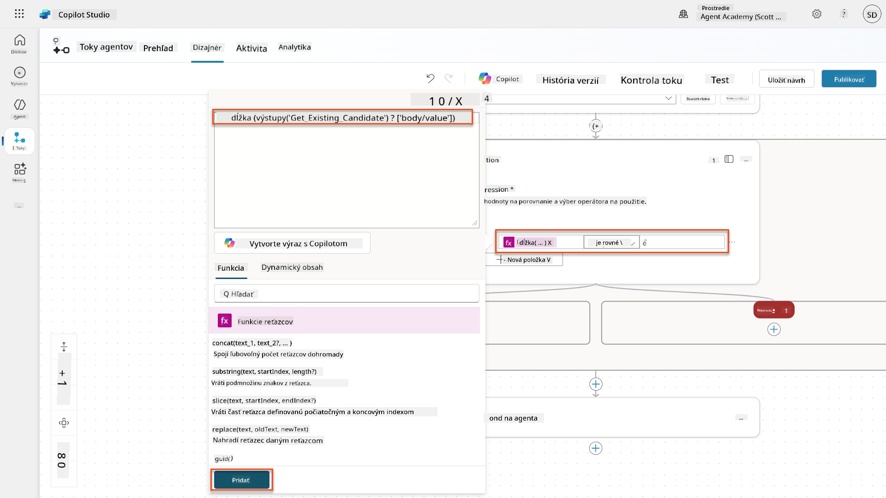

1. Vyberte ikonu **+** Vložiť akciu v vetve **True**, vyhľadajte **Dataverse**, vyberte **Zobraziť viac** a potom nájdite akciu **Add a new row**.

1. Premenujte uzol na `Add a New Candidate` a nastavte nasledujúce parametre:

    | Vlastnosť | Ako nastaviť | Hodnota |
    |-----------|--------------|---------|
    | **Názov tabuľky** | Vybrať | Kandidáti |
    | **Meno kandidáta** | Dynamické údaje (ikona blesku) | Zhrnúť životopis → `CandidateName` |
    | **Email** | Dynamické údaje (ikona blesku) | Zhrnúť životopis → `Email` |

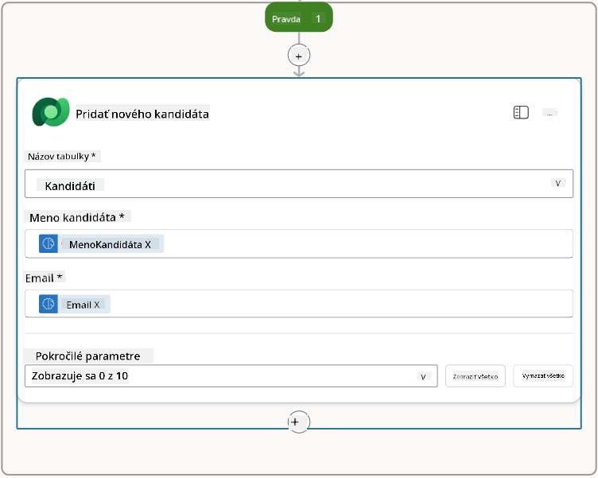

### 7.5 Aktualizácia životopisu a konfigurácia výstupov toku

Dokončite tok aktualizáciou záznamu životopisu a konfiguráciou údajov, ktoré sa majú vrátiť agentovi.

1. Vyberte ikonu **+** Vložiť akciu pod podmienkou, vyhľadajte **Dataverse**, vyberte **Zobraziť viac** a potom nájdite akciu **Update a row**.

1. Vyberte názov a premenujte uzol na `Update Resume`, vyberte **Zobraziť všetko** a nastavte nasledujúce parametre:

    | Vlastnosť | Ako nastaviť | Hodnota |
    |-----------|--------------|---------|
    | **Názov tabuľky** | Vybrať | Životopisy |
    | **ID riadku** | Výraz (ikona fx) | `first(body('Get_Resume_Record')?['value'])?['ppa_resumeid']` |
    | **Zhrnutie** | Dynamické údaje (ikona blesku) | Zhrnúť životopis → Text |
    | **Kandidát (Kandidáti)** | Výraz (ikona fx) | `if(equals(length(outputs('Get_Existing_Candidate')?['body/value']), 1), first(outputs('Get_Existing_Candidate')?['body/value'])?['ppa_candidateid'], outputs('Add_a_New_Candidate')?['body/ppa_candidateid'])` |

    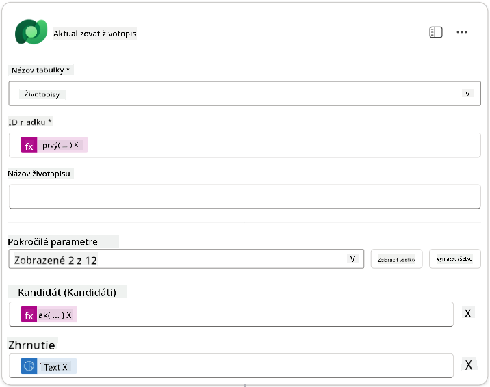

1. Vyberte uzol **Respond to the agent** a potom použite **+ Add an output** na konfiguráciu:

    | Typ | Názov              | Ako nastaviť                      | Hodnota                                                        | Popis                                            |
    |-----|--------------------|-----------------------------------|----------------------------------------------------------------|-------------------------------------------------|
    | Text | `CandidateName`   | Dynamické údaje (ikona blesku)    | Zhrnúť životopis → Zobraziť viac → CandidateName               | [CandidateName] uvedené v životopise            |
    | Text | `CandidateEmail`  | Dynamické údaje (ikona blesku)    | Zhrnúť životopis → Zobraziť viac → Email                       | [CandidateEmail] uvedené v životopise           |
    | Text | `CandidateNumber` | Výraz (ikona fx)                 | `concat('ppa_candidates/', if(equals(length(outputs('Get_Existing_Candidate')?['body/value']), 1), first(outputs('Get_Existing_Candidate')?['body/value'])?['ppa_candidateid'], outputs('Add_a_New_Candidate')?['body/ppa_candidateid']) )` | [CandidateNumber] nového alebo existujúceho kandidáta |
    | Text | `ResumeSummary`   | Dynamické údaje (ikona blesku)    | Zhrnúť životopis → Zobraziť viac → body/responsev2/predictionOutput/structuredOutput | Zhrnutie životopisu a detaily vo formáte JSON   |

    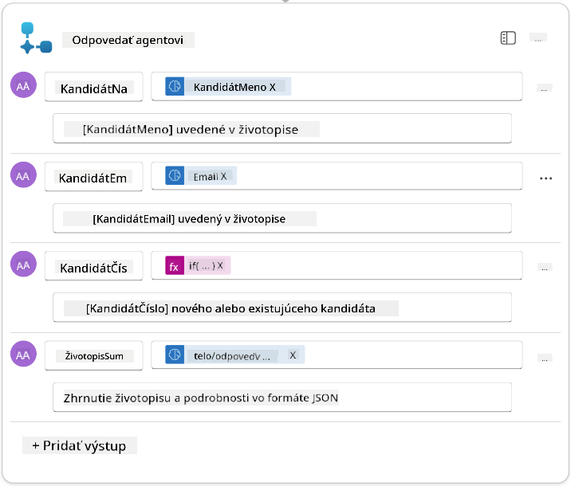

1. Vyberte **Uložiť návrh** v pravom hornom rohu. Váš Agent Flow by mal vyzerať nasledovne  
    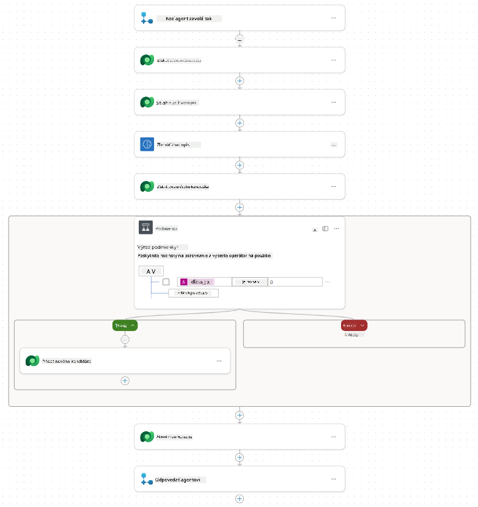

1. Vyberte kartu **Prehľad**, vyberte **Upraviť** na paneli **Detaily**

    1. **Názov toku**:`Zhrnúť životopis`
    1. **Popis**:

        ```text
        Summarize an existing Resume stored in Dataverse using a [ResumeNumber] as input, return the [CandidateNumber], and resume summary JSON
        ```

1. Vyberte **Uložiť**

1. Znova vyberte kartu **Designer** a vyberte **Publikovať**.

### 7.6 Pripojenie toku k vášmu agentovi

Teraz pridáte tok ako nástroj a nakonfigurujete svojho agenta, aby ho používal.

1. Otvorte svojho **Hiring Agent** v Copilot Studio

1. Vyberte kartu **Agents** a otvorte **Application Intake Agent**

1. Vyberte panel **Tools** a vyberte **+ Add a tool** - > **Flow** -> **Summarize Resume** **(Agent Flow)**

1. Vyberte **Add and configure**

1. Nakonfigurujte nastavenia nástroja nasledovne:

    | Nastavenie | Hodnota |
    |------------|---------|
    | **Popis** | Zhrnúť existujúci životopis uložený v Dataverse pomocou [ResumeNumber] ako vstupu, vrátiť [CandidateNumber] a zhrnutie životopisu vo formáte JSON |
    | **Kedy môže byť tento nástroj použitý** | Iba keď je odkazovaný témami alebo agentmi |

1. Vyberte **Uložiť**  
    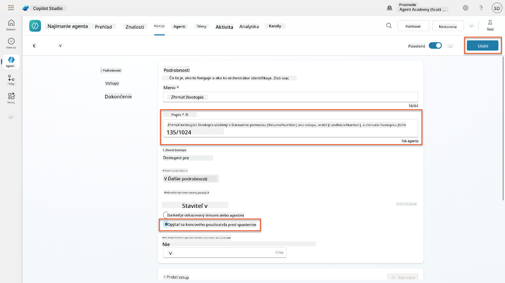

1. Ak vyberiete Tools vo svojom Hiring Agent, teraz uvidíte oba naše nástroje, ktoré sú použiteľné agentom **Application Intake Agent**.  
    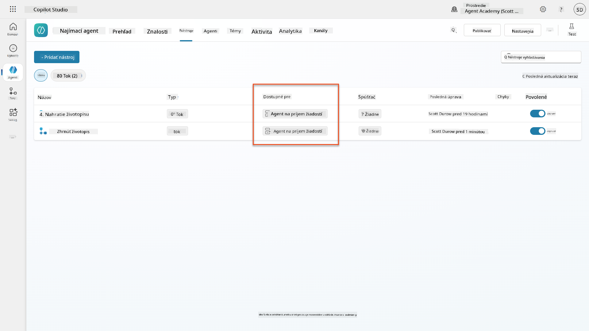

1. Prejdite na pokyny agenta **Application Intake Child** a upravte krok **Post-Upload** na nasledujúce:

    ```text
    2. Post-Upload Processing  
        - After uploading, be sure to also output the [ResumeNumber] in all messages
        - Pass [ResumeNumber] to /Summarize Resume  - Be sure to use the correct value that will start with the letter R.
        - Be sure to also output the [CandidateNumber] in all messages
        - Use the [ResumeSummary] to output a summary of the processed Resume and candidate
    ```

    Nahraďte `/Summarize Resume` vložením odkazu na **Summarize Resume agent flow** napísaním lomky (`/)` alebo výberom `/Summarize` na vloženie odkazu.  
    

1. Vyberte **Uložiť**.

### 7.7 Testovanie vášho agenta

Otestujte celý multimodálny systém, aby ste sa uistili, že všetko funguje správne.

1. **Začnite testovanie**:

    - Vyberte **Test** na otvorenie testovacieho panela
    - Napíšte: `Tu je životopis kandidáta`

    - Nahrajte jeden zo vzorových životopisov z [Test Resumes](https://download-directory.github.io/?url=https://github.com/microsoft/agent-academy/tree/main/operative/sample-data/resumes&filename=operative_sampledata)

1. **Overte výsledky**:
    - Po odoslaní správy a životopisu skontrolujte, či ste dostali číslo životopisu (formát: R#####)
    - Overte, či ste dostali číslo kandidáta a zhrnutie
    - Použite mapu aktivít na zobrazenie nástroja na nahrávanie životopisu a nástroja na zhrnutie životopisu v akcii a výstupy výzvy na zhrnutie, ktoré agent dostal:  
        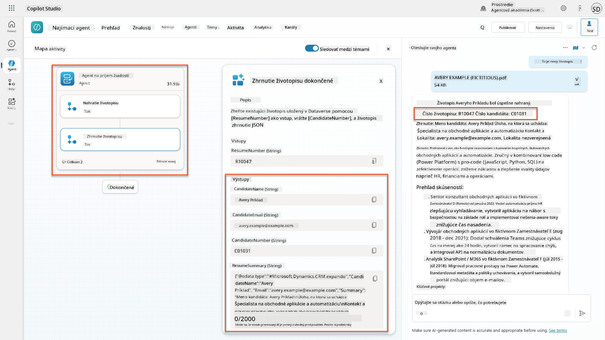

1. **Skontrolujte uchovanie údajov**:
    - Prejdite na [Power Apps](https://make.powerapps.com)
    - Otvorte **Apps** → **Hiring Hub** → **Play**
    - Prejdite na **Resumes**, aby ste overili, že životopis bol nahraný a spracovaný. Mal by obsahovať informácie o zhrnutí a priradený záznam kandidáta.
    - Skontrolujte **Candidates**, aby ste videli extrahované informácie o kandidátovi  
        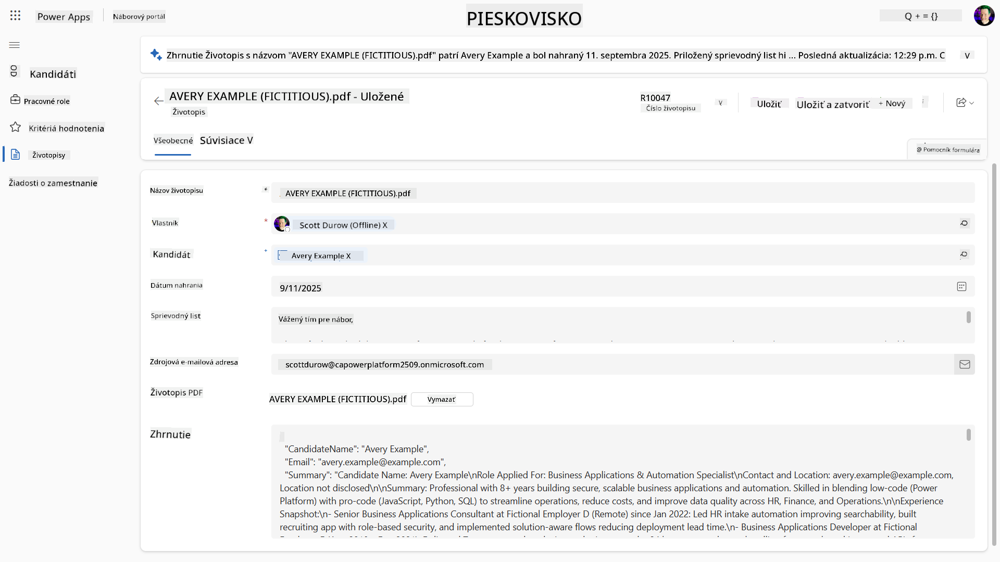
    - Keď proces spustíte znova, mal by použiť existujúceho kandidáta (zhodného na základe emailu extrahovaného zo životopisu) namiesto vytvorenia nového.

!!! tip "Riešenie problémov"
    - **Životopis sa nespracováva**: Uistite sa, že súbor je vo formáte PDF a pod limitom veľkosti
    - **Žiadny kandidát nebol vytvorený**: Skontrolujte, či bol email správne extrahovaný zo životopisu
    - **Chyby vo formáte JSON**: Overte, že vaše pokyny vo výzve obsahujú presnú štruktúru JSON
    - **Chyby toku**: Skontrolujte, či sú všetky pripojenia Dataverse a výrazy správne nakonfigurované

### Pripravenosť na produkciu

Aj keď to nie je súčasťou tejto misie, na to, aby bol tento tok agenta pripravený na produkciu, môžete zvážiť nasledujúce:

1. **Riešenie chýb** - Ak číslo životopisu nebolo nájdené alebo výzva nedokázala analyzovať dokument, malo by byť pridané riešenie chýb na vrátenie jasnej chyby agentovi.
1. **Aktualizácia existujúcich kandidátov** - Kandidát je nájdený pomocou emailu, potom by mohlo byť meno aktualizované tak, aby zodpovedalo tomu v životopise.
1. **Rozdelenie zhrnutia životopisu a vytvorenia kandidáta** - Táto funkcionalita by mohla byť rozdelená na menšie toky agenta, aby sa uľahčila ich údržba, a potom agentovi poskytnuté pokyny na ich postupné použitie.

## 🎉 Misia splnená

Výborná práca, Operatívny! **Dokument Resume Recon** je teraz dokončený. Úspešne ste zvládli multimodálne výzvy a teraz dokážete extrahovať štruktúrované údaje z akéhokoľvek dokumentu s presnosťou.

Tu je to, čo ste dosiahli v tejto misii:

**✅ Majstrovstvo multimodálnych výziev**  
Teraz rozumiete, čo sú multimodálne výzvy a kedy používať rôzne AI modely pre optimálne výsledky.

**✅ Odbornosť v spracovaní dokumentov**  
Naučili ste sa konfigurovať výzvy s obrazovými a dokumentovými vstupmi a formátovať výstupy ako JSON pre extrakciu štruktúrovaných údajov.

**✅ Systém na extrakciu životopisov**  
Vytvorili ste kompletný systém na spracovanie životopisov, ktorý integruje dokumenty kandidátov do vášho pracovného procesu náboru.

**✅ Implementácia najlepších postupov**  
Aplikovali ste najlepšie postupy pre inžinierstvo výziev s analýzou dokumentov a integrovali multimodálne výzvy s tokmi agenta.

**✅ Základ pre pokročilé spracovanie**  
Vaše vylepšené schopnosti analýzy dokumentov sú teraz pripravené na pokročilé funkcie uzemnenia údajov, ktoré pridáme v nadchádzajúcich misiách.

🚀 **Ďalej:** V misii 08 objavíte, ako vylepšiť svoje výzvy pomocou údajov v reálnom čase z Dataverse, čím vytvoríte dynamické AI riešenia, ktoré sa prispôsobujú meniacim sa obchodným požiadavkám.

⏩ [Prejsť na misiu 08: Vylepšené výzvy s uzemnením Dataverse](../08-dataverse-grounding/README.md)

## 📚 Taktické zdroje

📖 [Vytvorte výzvu](https://learn.microsoft.com/ai-builder/create-a-custom-prompt?WT.mc_id=power-power-182762-scottdurow)

📖 [Pridajte text, obraz alebo dokument ako vstup do vašej výzvy](https://learn.microsoft.com/ai-builder/add-inputs-prompt?WT.mc_id=power-182762-scottdurow)

📖 [Spracovanie odpovedí s výstupom JSON](https://learn.microsoft.com/ai-builder/process-responses-json-output?WT.mc_id=power-182762-scottdurow)

📖 [Výber modelu a nastavenia teploty](https://learn.microsoft.com/ai-builder/prompt-modelsettings?WT.mc_id=power-182762-scottdurow)

📖 [Použitie výzvy v Power Automate](https://learn.microsoft.com/ai-builder/use-a-custom-prompt-in-flow?WT.mc_id=power-182762-scottdurow)

📺 [AI Builder: JSON výstupy vo výzve](https://www.youtube.com/watch?v=F0fGnWrRY_I)

---

**Zrieknutie sa zodpovednosti**:  
Tento dokument bol preložený pomocou služby AI prekladu [Co-op Translator](https://github.com/Azure/co-op-translator). Hoci sa snažíme o presnosť, prosím, berte na vedomie, že automatizované preklady môžu obsahovať chyby alebo nepresnosti. Pôvodný dokument v jeho rodnom jazyku by mal byť považovaný za autoritatívny zdroj. Pre kritické informácie sa odporúča profesionálny ľudský preklad. Nenesieme zodpovednosť za akékoľvek nedorozumenia alebo nesprávne interpretácie vyplývajúce z použitia tohto prekladu.