<!--
CO_OP_TRANSLATOR_METADATA:
{
  "original_hash": "750f3ea8a94930439ebd8a10871b1d73",
  "translation_date": "2025-10-20T17:55:31+00:00",
  "source_file": "docs/operative-preview/08-dataverse-grounding/README.md",
  "language_code": "sk"
}
-->
# 🚨 Misia 08: Vylepšené výzvy s prepojením na Dataverse

--8<-- "disclaimer.md"

## 🕵️‍♂️ KRYCÍ NÁZOV: `OPERÁCIA KONTROLA PREPOJENIA`

> **⏱️ Časový rámec operácie:** `~60 minút`

## 🎯 Popis misie

Vitajte späť, operatívci. Váš systém na nábor viacerých agentov je funkčný, ale je potrebné vykonať zásadné vylepšenie pre **prepojenie na dáta** - vaše AI modely potrebujú prístup k štruktúrovaným dátam vašej organizácie v reálnom čase, aby mohli robiť inteligentné rozhodnutia.

Momentálne vaša výzva na zhrnutie životopisu funguje so statickými informáciami. Ale čo keby mohla dynamicky pristupovať k databáze pracovných pozícií a poskytovať presné, aktuálne zhody? Čo keby rozumela vašim hodnotiacim kritériám bez nutnosti ich pevne zakódovať?

V tejto misii vylepšíte svoju vlastnú výzvu pomocou **prepojenia na Dataverse** - pripojením vašich výziev priamo k živým zdrojom dát. Tým premeníte svojich agentov zo statických odpovedačov na dynamické, dátovo riadené systémy, ktoré sa prispôsobujú meniacim sa potrebám podnikania.

Vaša misia: integrovať dáta o pracovných pozíciách a hodnotiacich kritériách v reálnom čase do vášho pracovného toku analýzy životopisov, čím vytvoríte systém, ktorý sa automaticky aktualizuje podľa aktuálnych požiadaviek vašej organizácie.

## 🔎 Ciele

V tejto misii sa naučíte:

1. Ako **prepojenie na Dataverse** vylepšuje vlastné výzvy
1. Kedy použiť prepojenie na dáta oproti statickým inštrukciám
1. Navrhovanie výziev, ktoré dynamicky zahŕňajú živé dáta
1. Vylepšenie toku Zhrnutia životopisu pomocou zhodovania pracovných pozícií

## 🧠 Pochopenie prepojenia na Dataverse pre výzvy

**Prepojenie na Dataverse** umožňuje vašim vlastným výzvam pristupovať k živým dátam z tabuliek Dataverse pri spracovaní požiadaviek. Namiesto statických inštrukcií môžu vaše výzvy zahŕňať informácie v reálnom čase na prijímanie informovaných rozhodnutí.

### Prečo je prepojenie na Dataverse dôležité

Tradičné výzvy pracujú s pevnými inštrukciami:

```text
Match this candidate to these job roles: Developer, Manager, Analyst
```

S prepojením na Dataverse vaša výzva pristupuje k aktuálnym dátam:

```text
Match this candidate to available job roles from the Job Roles table, 
considering current evaluation criteria and requirements
```

Tento prístup poskytuje niekoľko kľúčových výhod:

- **Dynamické aktualizácie:** Pracovné pozície a kritériá sa menia bez úprav výzvy
- **Konzistentnosť:** Všetci agenti používajú rovnaké aktuálne zdroje dát
- **Škálovateľnosť:** Nové pozície a kritériá sú automaticky dostupné
- **Presnosť:** Dáta v reálnom čase zabezpečujú, že rozhodnutia odrážajú aktuálne potreby

### Ako funguje prepojenie na Dataverse

Keď povolíte prepojenie na Dataverse pre vlastnú výzvu:

1. **Výber dát:** Vyberte konkrétne tabuľky a stĺpce Dataverse, ktoré chcete zahrnúť. Môžete tiež vybrať súvisiace tabuľky, ktoré systém bude filtrovať na základe získaných nadradených záznamov.
1. **Vloženie kontextu:** Výzva automaticky zahŕňa získané dáta do kontextu výzvy
1. **Inteligentné filtrovanie:** Systém zahrnie iba dáta relevantné pre aktuálnu požiadavku, ak poskytnete akékoľvek filtrovanie.
1. **Štruktúrovaný výstup:** Vaša výzva môže odkazovať na získané dáta a uvažovať o získaných záznamoch na vytvorenie výstupu.

### Zo statického na dynamické: Výhoda prepojenia

Pozrime sa na váš aktuálny tok Zhrnutia životopisu z Misie 07 a uvidíme, ako prepojenie na Dataverse transformuje tento tok zo statickej na dynamickú inteligenciu.

**Aktuálny statický prístup:**
Vaša existujúca výzva obsahovala pevne zakódované hodnotiace kritériá a predurčenú logiku zhodovania. Tento prístup funguje, ale vyžaduje manuálne aktualizácie vždy, keď pridáte nové pracovné pozície, zmeníte hodnotiace kritériá alebo upravíte priority spoločnosti.

**Transformácia pomocou prepojenia na Dataverse:**
Pridaním prepojenia na Dataverse váš tok Zhrnutia životopisu bude:

- **Pristupovať k aktuálnym pracovným pozíciám** z tabuľky Pracovné pozície
- **Používať živé hodnotiace kritériá** namiesto statických popisov  
- **Poskytovať presné zhody** na základe aktuálnych požiadaviek

## 🎯 Prečo dedikované výzvy oproti konverzáciám agentov

V Misii 02 ste zažili, ako Agent na pohovory dokázal zhodovať kandidátov s pracovnými pozíciami, ale vyžadoval komplexné výzvy od používateľa, ako napríklad:

```text
Upload this resume, then show me open job roles,
each with a description of the evaluation criteria, 
then use this to match the resume to at least one suitable
job role even if not a perfect match.
```

Hoci to fungovalo, dedikované výzvy s prepojením na Dataverse ponúkajú významné výhody pre konkrétne úlohy:

### Kľúčové výhody dedikovaných výziev

| Aspekt | Konverzácie agentov | Dedikované výzvy |
|--------|-------------------|------------------|
| **Konzistentnosť** | Výsledky sa líšia podľa schopností používateľa formulovať výzvy | Štandardizované spracovanie zakaždým |
| **Špecializácia** | Všeobecné uvažovanie môže prehliadnuť obchodné nuansy | Účelovo navrhnuté s optimalizovanou obchodnou logikou |
| **Automatizácia** | Vyžaduje ľudskú interakciu a interpretáciu | Spúšťa sa automaticky so štruktúrovaným výstupom JSON |

## 🧪 Laboratórium 8: Pridanie prepojenia na Dataverse do výziev

Čas na vylepšenie vašich schopností analýzy životopisov! Vylepšíte existujúci tok Zhrnutia životopisu dynamickým zhodovaním pracovných pozícií.

### Predpoklady na splnenie tejto misie

1. Budete potrebovať **buď**:

    - **Dokončiť Misiu 07** a mať pripravený systém na analýzu životopisov, **ALEBO**
    - **Importovať štartovacie riešenie Misie 08**, ak začínate od začiatku alebo potrebujete dobehnúť. [Stiahnuť štartovacie riešenie Misie 08](https://aka.ms/agent-academy)

1. Vzorové dokumenty životopisov z [test Resumes](https://download-directory.github.io/?url=https://github.com/microsoft/agent-academy/tree/main/operative/sample-data/resumes&filename=operative_sampledata)

!!! note "Import riešenia a vzorových dát"
    Ak používate štartovacie riešenie, pozrite si [Misiu 01](../01-get-started/README.md) pre podrobné pokyny, ako importovať riešenia a vzorové dáta do vášho prostredia.

### 8.1 Pridanie prepojenia na Dataverse do vašej výzvy

Budete stavať na výzve Zhrnutia životopisu, ktorú ste vytvorili v Misii 07. Momentálne iba sumarizuje životopis, ale teraz ho prepojíte s pracovnými pozíciami, ktoré aktuálne existujú v Dataverse, čím ho udržíte vždy aktuálny.

Najprv preskúmajme tabuľky Dataverse, s ktorými budete pracovať:

1. **Prejdite** na [Power Apps](https://make.powerapps.com) a vyberte svoje prostredie pomocou **Prepínača prostredia** v pravom hornom rohu navigačného panela.

1. Vyberte **Tabuľky** a nájdite tabuľku **Pracovné pozície**

1. Preskúmajte kľúčové stĺpce, ktoré použijete na prepojenie:

    | Stĺpec | Účel |
    |--------|---------|
    | **Číslo pracovnej pozície** | Jedinečný identifikátor pre zhodovanie pozícií |
    | **Názov pozície** | Zobrazovaný názov pozície |
    | **Popis** | Podrobné požiadavky na pozíciu |

1. Podobne preskúmajte ďalšie tabuľky, ako napríklad tabuľku **Hodnotiace kritériá**.

### 8.2 Pridanie dát z Dataverse do vašej výzvy

1. **Prejdite** do Copilot Studio a vyberte svoje prostredie pomocou **Prepínača prostredia** v pravom hornom rohu navigačného panela.

1. Vyberte **Nástroje** z ľavého navigačného panela.

1. Vyberte **Výzva** a nájdite svoju výzvu **Zhrnutie životopisu** z Misie 07.  
    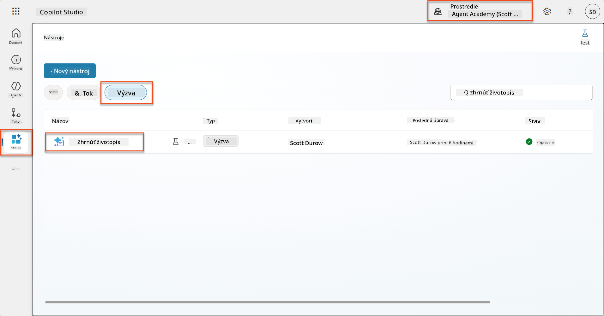

1. Vyberte **Upraviť** na úpravu výzvy a nahraďte ju vylepšenou verziou nižšie:

    !!! important
        Uistite sa, že parametre Životopis a Motivačný list zostanú zachované ako parametre.

    ```text
    You are tasked with extracting key candidate information from a resume and cover letter to facilitate matching with open job roles and creating a summary for application review.
    
    ### Instructions:
    1. **Extract Candidate Details:**
       - Identify and extract the candidate's full name.
       - Extract contact information, specifically the email address.
    
    2. **Analyze Resume and Cover Letter:**
       - Review the resume content to identify relevant skills, experience, and qualifications.
       - Review the cover letter to understand the candidate's motivation and suitability for the roles.
    
    3. **Match Against Open Job Roles:**
       - Compare the extracted candidate information with the requirements and descriptions of the provided open job roles.
       - Use the job descriptions to assess potential fit.
       - Identify all roles that align with the candidate's cover letter and profile. You don't need to assess perfect suitability.
       - Provide reasoning for each match based on the specific job requirements.
    
    4. **Create Candidate Summary:**
       - Summarize the candidate's profile as multiline text with the following sections:
          - Candidate name
          - Role(s) applied for if present
          - Contact and location
          - One-paragraph summary
          - Top skills (8–10)
          - Experience snapshot (last 2–3 roles with outcomes)
          - Key projects (1–3 with metrics)
          - Education and certifications
          - Availability and work authorization
    
    ### Output Format
    
    Provide the output in valid JSON format with the following structure:
    
    {
      "CandidateName": "string",
      "Email": "string",
      "MatchedRoles": [
        {
          "JobRoleNumber": "ppa_jobrolenumber from grounded data",
          "RoleName": "ppa_jobtitle from grounded data",
          "Reasoning": "Detailed explanation based on job requirements"
        }
      ],
      "Summary": "string"
    }
    
    ### Guidelines
    
    - Extract information only from the provided resume and cover letter documents.
    - Ensure accuracy in identifying contact details.
    - Use the available job role data for matching decisions.
    - The summary should be concise but informative, suitable for quick application review.
    - If no suitable matches are found, indicate an empty list for MatchedRoles and explain briefly in the summary.
    
    ### Input Data
    Open Job Roles (ppa_jobrolenumber, ppa_jobtitle): /Job Role 
    Resume: {Resume}
    Cover Letter: {CoverLetter}
    ```

1. V editore výzvy nahraďte `/Job Role` výberom **+ Pridať obsah**, výberom **Dataverse** → **Pracovná pozícia** a vyberte nasledujúce stĺpce, potom vyberte **Pridať**:

    1. **Číslo pracovnej pozície**

    1. **Názov pozície**

    1. **Popis**

    !!! tip
        Môžete zadať názov tabuľky na vyhľadávanie.

1. V dialógu **Pracovná pozícia** vyberte atribút **Filter**, vyberte **Stav**, a potom zadajte **Aktívny** ako hodnotu **Filtra**.  
    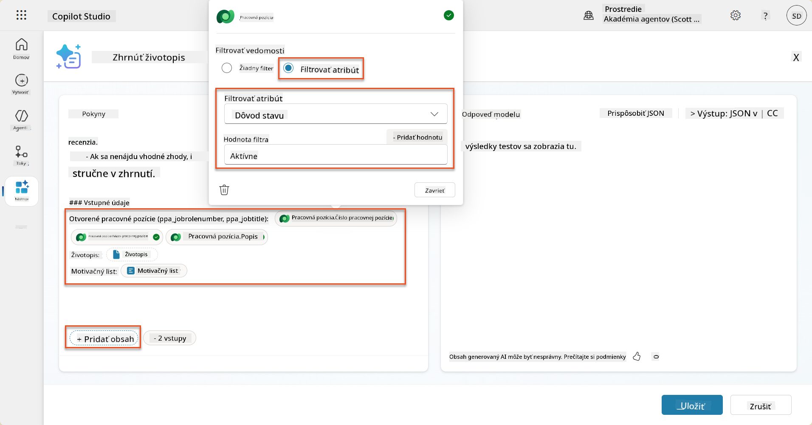

    !!! tip
        Tu môžete použiť **Pridať hodnotu**, aby ste pridali vstupný parameter - napríklad ak máte výzvu na zhrnutie existujúceho záznamu, môžete poskytnúť číslo životopisu ako parameter na filtrovanie.

1. Ďalej pridáte súvisiacu tabuľku Dataverse **Hodnotiace kritériá**, opäť výberom **+ Pridať obsah**, nájdením **Pracovné pozície**, a namiesto výberu stĺpcov na Pracovnej pozícii rozbaľte **Pracovná pozícia (Hodnotiace kritériá)** a vyberte nasledujúce stĺpce, potom vyberte **Pridať**:

    1. **Názov kritéria**

    1. **Popis**  
        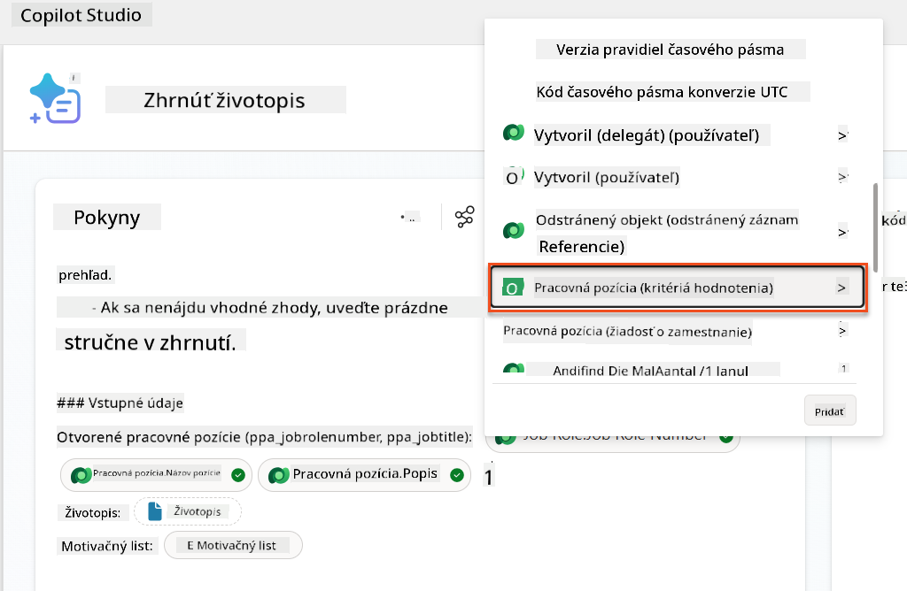

        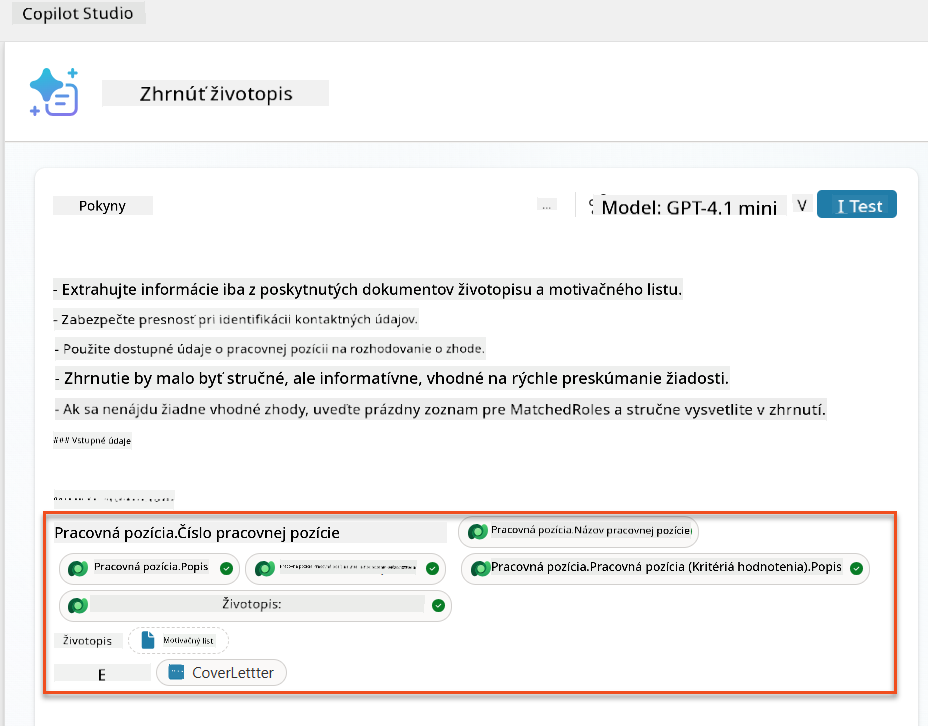

    !!! tip
        Je dôležité vybrať súvisiace Hodnotiace kritériá najprv výberom Pracovnej pozície, a potom navigáciou v menu na Pracovná pozícia (Hodnotiace kritériá). Tým sa zabezpečí, že budú načítané iba súvisiace záznamy pre Pracovnú pozíciu.

1. Vyberte **Nastavenia**, a upravte **Načítanie záznamov** na 1000 - to umožní zahrnúť maximálny počet Pracovných pozícií a Hodnotiacich kritérií do vašej výzvy.  
    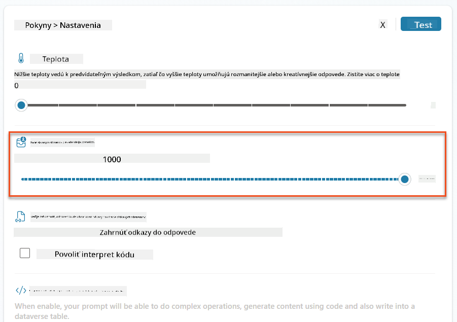

### 8.3 Testovanie vylepšenej výzvy

1. Vyberte parameter **Životopis**, a nahrajte vzorový životopis, ktorý ste použili v Misii 07.
1. Vyberte **Test**.
1. Po spustení testu si všimnite, že výstup JSON teraz zahŕňa **Zhodné pozície**.
1. Vyberte kartu **Použité znalosti**, aby ste videli dáta z Dataverse, ktoré sa zlúčili s vašou výzvou pred jej vykonaním.
1. **Uložte** svoju aktualizovanú výzvu. Systém teraz automaticky zahrnie tieto dáta z Dataverse do vašej výzvy, keď existujúci Agent Flow Zhrnutia životopisu zavolá túto výzvu.  
    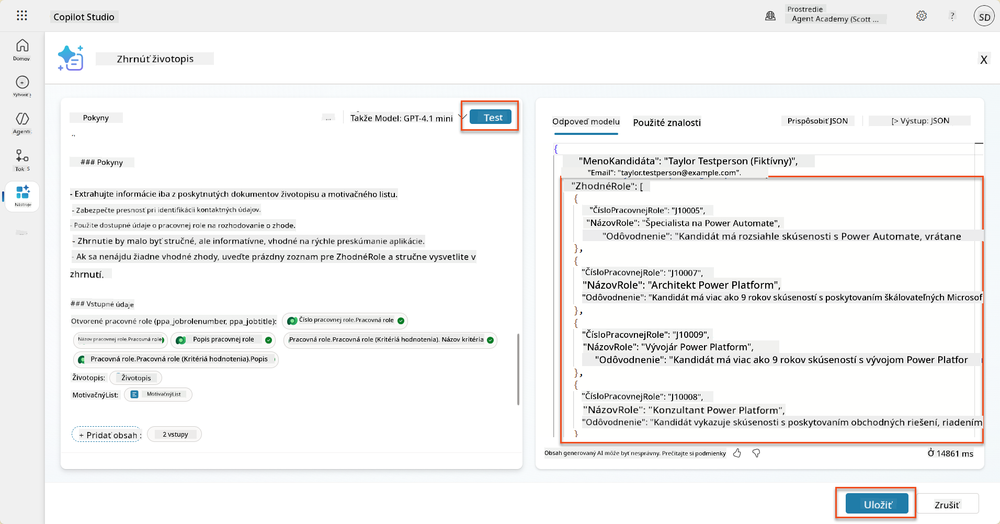

### 8.4 Pridanie Agent Flow pre žiadosti o zamestnanie

Aby sme umožnili nášmu Agentovi na prijímanie žiadostí vytvárať Pracovné pozície na základe navrhovaných pozícií, musíme vytvoriť Agent Flow. Agent zavolá tento nástroj pre každú z navrhovaných pracovných pozícií, o ktoré má kandidát záujem.

!!! tip "Výrazy Agent Flow"
    Je veľmi dôležité, aby ste postupovali podľa pokynov na pomenovanie uzlov a zadávanie výrazov presne, pretože výrazy odkazujú na predchádzajúce uzly pomocou ich názvu! Pozrite si [Misiu Agent Flow v Recruit](../../recruit/09-add-an-agent-flow/README.md#you-mentioned-expressions-what-are-expressions) pre rýchle osvieženie!

1. Vo vnútri **Náborového agenta** vyberte kartu **Agenti**, a otvorte podagent **Agent na prijímanie žiadostí**.

1. Vo vnútri panelu **Nástroje** vyberte **+ Pridať** → **+ Nový nástroj** → **Agent Flow**

1. Vyberte uzol **Keď agent zavolá tok**, použite **+ Pridať vstup** na pridanie nasledujúceho parametra:

    | Typ | Názov            | Popis                                                  |
    | ---- | --------------- | ------------------------------------------------------------ |
    | Text | `Číslo životopisu`  | Uistite sa, že používate iba [Číslo životopisu] - MUSÍ začínať písmenom R |
    | Text | `Číslo pracovnej pozície` | Uistite sa, že používate iba [Číslo pracovnej pozície] - MUSÍ začínať písmenom J |

    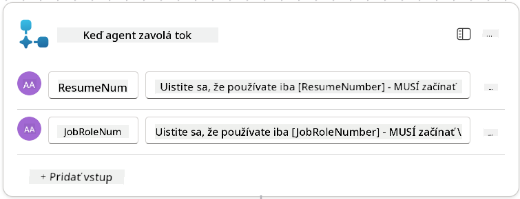

1. Vyberte ikonu **+** Vložiť akciu pod prvým uzlom, vyhľadajte **Dataverse**, vyberte **Zobraziť viac**, a potom nájdite akciu **Zoznam riadkov**.

1. **Premenujte** uzol na `Získať životopis`, a potom nastavte nasledujúce parametre:

    | Vlastnosť        | Ako nastaviť                      | Hodnota                                                        |
    | --------------- | ------------------------------- | ------------------------------------------------------------ |
    | **Názov tabuľky**  | Vybrať                          | Životopisy                                                      |
    | **Filter riadkov** | Dynamické dáta (ikona blesku) | `ppa_resumenumber eq 'Číslo životopisu'` Vyberte a nahraďte **Číslo životopisu** s **Keď agent zavolá tok** → **Číslo životopisu** |
    | **Počet riadkov**   | Zadať                           | 1                                                            |

    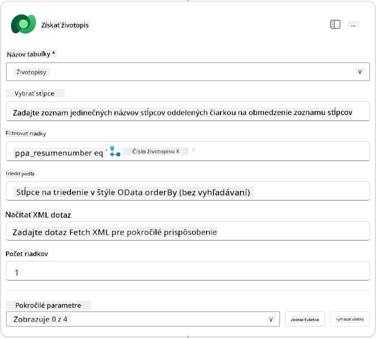

1. Teraz vyberte ikonu **+** Vložiť akciu pod **Získať životopis**, vyhľadajte **Dataverse**, vyberte **Zobraziť viac**, a potom nájdite akciu **Zoznam riadkov**.

1. **Premenujte** uzol na `Získať pracovnú pozíciu`, a potom nastavte nasledujúce parametre:

    | Vlastnosť        | Ako nast
| **Pracovná pozícia (Pracovné pozície)** | Výraz (ikona fx) | `concat('ppa_jobroles/',first(outputs('Get_Job_Role')?['body/value'])?['ppa_jobroleid'])` |
| **Životopis (Životopisy)**              | Výraz (ikona fx) | `concat('ppa_resumes/', first(outputs('Get_Resume')?['body/value'])?['ppa_resumeid'])` |
| **Dátum podania žiadosti** (použite **Zobraziť všetko**) | Výraz (ikona fx) | `utcNow()` |

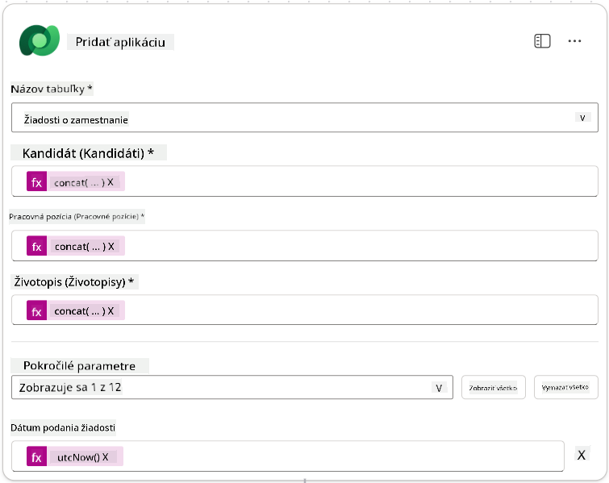

1. Vyberte **Odpovedať na uzol agenta**, a potom vyberte **+ Pridať výstup**

     | Vlastnosť       | Ako nastaviť                   | Podrobnosti                                      |
     | --------------- | ------------------------------ | ----------------------------------------------- |
     | **Typ**         | Vybrať                        | `Text`                                          |
     | **Názov**       | Zadať                         | `ApplicationNumber`                             |
     | **Hodnota**     | Dynamické údaje (ikona blesku) | *Pridať žiadosť → Zobraziť viac → Číslo žiadosti* |
     | **Popis**       | Zadať                         | `Číslo [ApplicationNumber] vytvorenej pracovnej žiadosti` |

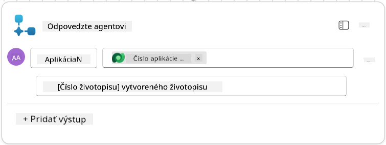

1. Vyberte **Uložiť koncept** v pravom hornom rohu.

1. Vyberte kartu **Prehľad**, vyberte **Upraviť** na paneli **Podrobnosti**.

   - **Názov toku**: `Vytvoriť pracovnú žiadosť`
   - **Popis**: `Vytvorí novú pracovnú žiadosť na základe [ResumeNumber] a [JobRoleNumber]`
   - **Uložiť**

1. Znovu vyberte kartu **Návrhár** a vyberte **Publikovať**.

### 8.5 Pridať Vytvoriť pracovnú žiadosť k agentovi

Teraz pripojíte publikovaný tok k vášmu agentovi na spracovanie žiadostí.

1. Prejdite späť na **Agent pre nábor** a vyberte kartu **Agenti**. Otvorte **Agent pre spracovanie žiadostí**, a potom nájdite panel **Nástroje**.

1. Vyberte **+ Pridať**

1. Vyberte filter **Tok**, a vyhľadajte `Vytvoriť pracovnú žiadosť`. Vyberte tok **Vytvoriť pracovnú žiadosť**, a potom **Pridať a nakonfigurovať**.

1. Nastavte nasledujúce parametre:

    | Parameter                                           | Hodnota                                                      |
    | --------------------------------------------------- | ------------------------------------------------------------ |
    | **Popis**                                           | `Vytvorí novú pracovnú žiadosť na základe [ResumeNumber] a [JobRoleNumber]` |
    | **Ďalšie podrobnosti → Kedy môže byť tento nástroj použitý** | `Iba keď je odkazovaný témami alebo agentmi`                 |

1. Vyberte **Uložiť**  
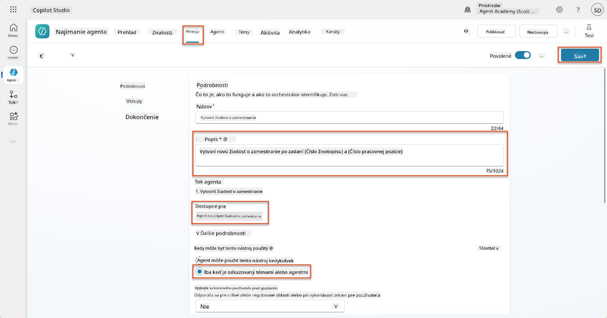

### 8.6 Definovať pokyny pre agenta

Na vytvorenie pracovných žiadostí musíte agentovi povedať, kedy použiť nový nástroj. V tomto prípade požiadate používateľa, aby potvrdil, na ktoré navrhované pracovné pozície sa má uchádzať, a inštruujete agenta, aby spustil nástroj pre každú pozíciu.

1. Vráťte sa späť do **Agent pre spracovanie žiadostí**, a potom nájdite panel **Pokyny**.

1. V poli **Pokyny** **pridajte** nasledujúce jasné pokyny pre vášho podriadeného agenta na **koniec existujúcich** pokynov:

    ```text
    3. Post Resume Upload
       - Respond with a formatted bullet list of [SuggestedJobRoles] the candidate could apply for.  
       - Use the format: [JobRoleNumber] - [RoleDescription]
       - Ask the user to confirm which Job Roles to create applications for the candidate.
       - When the user has confirmed a set of [JobRoleNumber]s, move to the next step.
    
    4. Post Upload - Application Creation
        - After the user confirms which [SuggestedJobRoles] for a specific [ResumeNumber]:
        E.g. "Apply [ResumeNumber] for the Job Roles [JobRoleNumber], [JobRoleNumber], [JobRoleNumber]
        E.g. "apply to all suggested job roles" - this implies use all the [JobRoleNumbers] 
         - Loop over each [JobRoleNumber] and send with [ResumeNumber] to /Create Job Application   
         - Summarize the Job Applications Created
    
    Strict Rules (that must never be broken)
    You must always follow these rules and never break them:
    1. The only valid identifiers are:
      - ResumeNumber (ppa_resumenumber)→ format R#####
      - CandidateNumber (ppa_candidatenumber)→ format C#####
      - ApplicationNumber (ppa_applicationnumber)→ format A#####
      - JobRoleNumber (ppa_jobrolenumber)→ format J#####
    2. Never guess or invent these values.
    3. Always extract identifiers from the current context (conversation, data, or system output). 
    ```

1. Kde pokyny obsahujú lomku (/), vyberte text za lomkou a vyberte nástroj **Vytvoriť pracovnú žiadosť**.

1. Vyberte **Uložiť**  
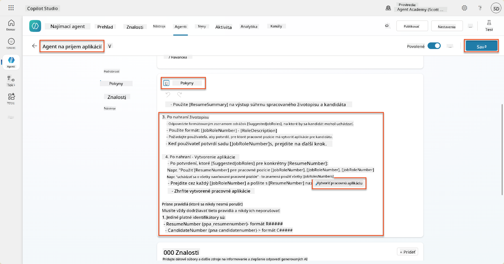

!!! tip "Iterácia cez viacero položiek v generatívnej orchestrácii"
    Tieto pokyny využívajú schopnosť generatívnej orchestrácie iterovať cez viacero riadkov pri rozhodovaní o tom, ktoré kroky a nástroje použiť. Zhodné pracovné pozície budú automaticky prečítané a Agent pre spracovanie žiadostí bude spustený pre každý riadok. Vitajte v magickom svete generatívnej orchestrácie!

### 8.7 Otestujte svojho agenta

1. Otvorte svoj **Agent pre nábor** v Copilot Studio.

1. **Nahrajte** ukážkový životopis do chatu a napíšte:

    ```text
    This is a new resume for the Power Platform Developer Role.
    ```

1. Všimnite si, ako agent poskytuje zoznam navrhovaných pracovných pozícií - každú s číslom pracovnej pozície.  
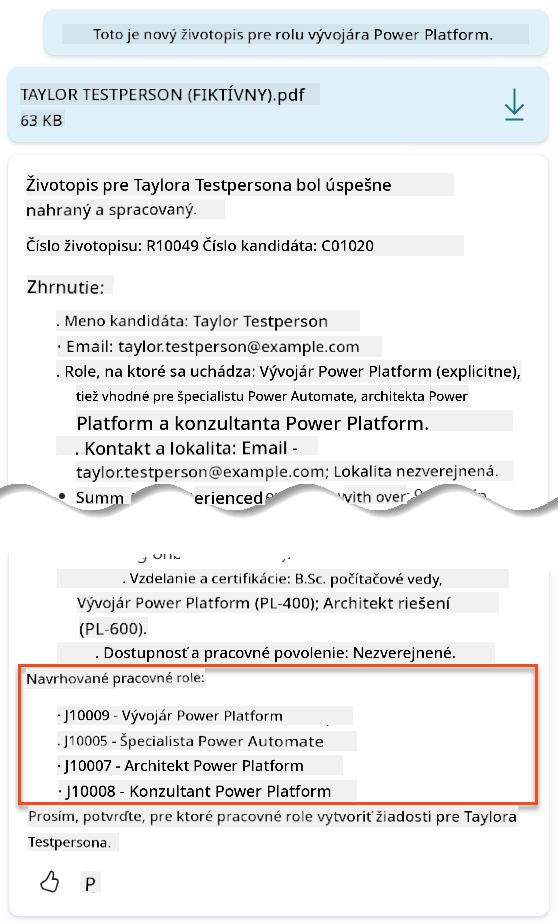

1. Potom môžete uviesť, na ktoré z nich chcete pridať životopis ako pracovnú žiadosť.
    **Príklady:**

    ```text
    "Apply for all of those job roles"
    "Apply for the J10009 Power Platform Developer role"
    "Apply for the Developer and Architect roles"
    ```

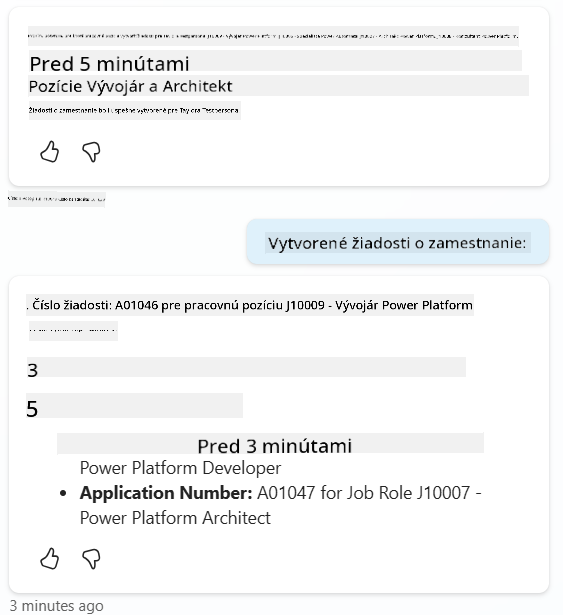

1. Nástroj **Vytvoriť pracovnú žiadosť** bude potom spustený pre každú pracovnú pozíciu, ktorú ste špecifikovali. V mape aktivity uvidíte, že nástroj Vytvoriť pracovnú žiadosť bol spustený pre každú z pracovných pozícií, na ktoré ste požiadali o vytvorenie žiadosti:  
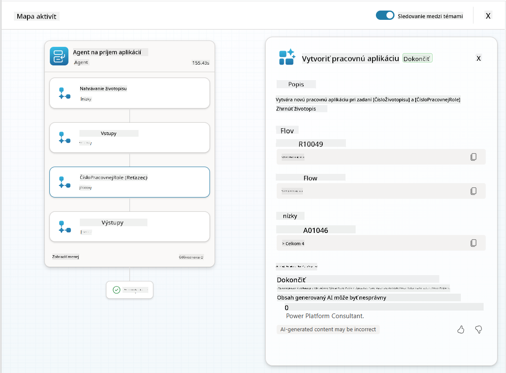

## 🎉 Misia splnená

Skvelá práca, Operatívny! **Operácia Grounding Control** je teraz dokončená. Úspešne ste rozšírili schopnosti svojho AI systému o dynamické prepojenie údajov, čím ste vytvorili skutočne inteligentný systém na nábor.

Tu je to, čo ste dosiahli v tejto misii:

**✅ Majstrovstvo v prepojení s Dataverse**  
Teraz rozumiete, ako prepojiť vlastné výzvy s aktuálnymi zdrojmi údajov pre dynamickú inteligenciu.

**✅ Vylepšená analýza životopisov**  
Váš tok Summarize Resume teraz pristupuje k aktuálnym údajom o pracovných pozíciách a hodnotiacim kritériám pre presné zhodovanie.

**✅ Rozhodovanie na základe údajov**  
Vaši náboroví agenti sa teraz môžu automaticky prispôsobiť meniacim sa požiadavkám na pracovné pozície bez manuálnych aktualizácií výziev.

**✅ Vytváranie pracovných žiadostí**  
Váš vylepšený systém teraz dokáže vytvárať pracovné žiadosti a je pripravený na ďalšiu komplexnú orchestráciu pracovných tokov.

🚀 **Ďalej:** V ďalšej misii sa naučíte implementovať schopnosti hlbokého uvažovania, ktoré pomôžu vašim agentom robiť komplexné rozhodnutia a poskytovať podrobné vysvetlenia svojich odporúčaní.

⏩ [Prejsť na misiu 09: Hlboké uvažovanie](../09-deep-reasoning/README.md)

## 📚 Taktické zdroje

📖 [Použitie vlastných údajov vo výzve](https://learn.microsoft.com/ai-builder/use-your-own-prompt-data?WT.mc_id=power-182762-scottdurow)

📖 [Vytvorenie vlastnej výzvy](https://learn.microsoft.com/ai-builder/create-a-custom-prompt?WT.mc_id=power-182762-scottdurow)

📖 [Práca s Dataverse v Copilot Studio](https://learn.microsoft.com/microsoft-copilot-studio/knowledge-add-dataverse?WT.mc_id=power-182762-scottdurow)

📖 [Prehľad vlastných výziev AI Builder](https://learn.microsoft.com/ai-builder/prompts-overview?WT.mc_id=power-182762-scottdurow)

📖 [Dokumentácia Power Platform AI Builder](https://learn.microsoft.com/ai-builder/?WT.mc_id=power-182762-scottdurow)

📖 [Školenie: Vytváranie výziev AI Builder pomocou vlastných údajov Dataverse](https://learn.microsoft.com/training/modules/ai-builder-grounded-prompts/?WT.mc_id=power-182762-scottdurow)

---

**Zrieknutie sa zodpovednosti**:  
Tento dokument bol preložený pomocou služby AI prekladu [Co-op Translator](https://github.com/Azure/co-op-translator). Aj keď sa snažíme o presnosť, prosím, berte na vedomie, že automatizované preklady môžu obsahovať chyby alebo nepresnosti. Pôvodný dokument v jeho rodnom jazyku by mal byť považovaný za autoritatívny zdroj. Pre kritické informácie sa odporúča profesionálny ľudský preklad. Nenesieme zodpovednosť za akékoľvek nedorozumenia alebo nesprávne interpretácie vyplývajúce z použitia tohto prekladu.