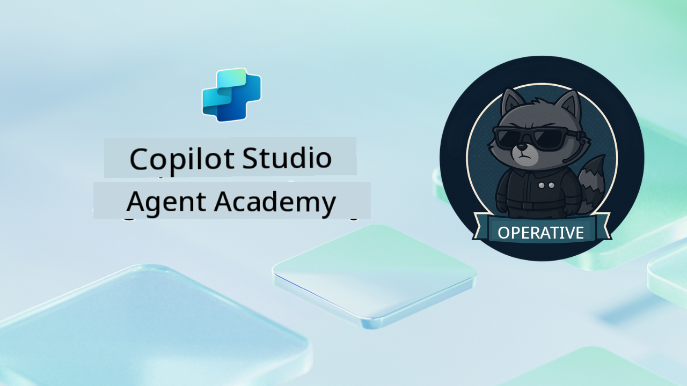

<!--
CO_OP_TRANSLATOR_METADATA:
{
  "original_hash": "24fcbe9a57d3439e05f8866e550c0a84",
  "translation_date": "2025-10-20T17:53:17+00:00",
  "source_file": "docs/operative-preview/README.md",
  "language_code": "sk"
}
-->
# Vitajte, Operatívny pracovník

**Vitajte, Operatívny pracovník.**  
Vaša pokročilá misia—ak sa ju rozhodnete prijať—je zvládnuť umenie budovania **podnikových systémov s viacerými agentmi** pomocou **Microsoft Copilot Studio**.

Tento intenzívny tréning vás posunie za hranice základného vytvárania agentov do sofistikovaného sveta **orchestrácie viacerých agentov**: od automatizácie náboru po bezpečnosť AI, naučíte sa budovať, koordinovať a nasadzovať inteligentné ekosystémy agentov na základe reálnych podnikových scenárov.

--8<-- "disclaimer.md"

---

## 🎯 Cieľ misie

Po absolvovaní programu Agent Academy Operative budete schopní:

- Navrhovať a implementovať **systémy s viacerými agentmi** pre komplexné obchodné scenáre
- Ovládnuť **orchestráciu agentov** a vzory spolupráce
- Implementovať **bezpečnosť AI a moderovanie obsahu** v produkčných systémoch
- Vytvárať **multimodálne výzvy** na spracovanie a analýzu dokumentov
- Nasadzovať **podnikových agentov pripravených na prevádzku** s riadnym riadením a testovaním

---

## 🧪 Predpoklady

Na splnenie všetkých misií budete potrebovať:

- Absolvované školenie **Agent Academy Recruit**
- Prostredie Microsoft Power Platform s licenciou **Copilot Studio**
- Prístup k **Microsoft Dataverse**
- Administrátorské oprávnenia na vytváranie riešení a agentov

---

## 🧬 Pre koho je určený

Tento pokročilý kurz je ideálny pre:

- **Architektov riešení**, ktorí navrhujú podnikové AI systémy
- **Vývojárov**, ktorí vytvárajú agentové riešenia pripravené na produkciu
- **IT profesionálov**, ktorí implementujú riadenie a bezpečnosť AI
- **Obchodných analytikov**, ktorí vytvárajú komplexné automatizačné pracovné postupy
- Každého, kto je pripravený **posunúť sa na vyššiu úroveň** od základných agentov k podnikovým systémom

---

## 🧭 Prehľad učebného plánu

Táto akadémia je štruktúrovaná ako progresívna séria terénnych operácií—každá misia nadväzuje na predchádzajúcu, aby vytvorila komplexný systém automatizácie náboru.

| Misia | Názov | Popis operácie |
|-------|-------|---------------|
| `01` | 🚨 [Začnite s náborovým agentom](./01-get-started/README.md) | Nasadenie základnej infraštruktúry a vytvorenie centrálneho orchestrátora agenta |
| `02` | 🎭 [Pripravte svojho agenta na spoluprácu s viacerými agentmi](./02-multi-agent/README.md) | Transformácia jedného agenta na koordinovaný systém viacerých agentov |
| `03` | ⚡ [Automatizujte svojho agenta pomocou spúšťačov](./03-automate-triggers/README.md) | Implementácia autonómneho správania agenta pomocou spúšťačov založených na udalostiach |
| `04` | 📝 [Tvorba pokynov pre agenta](./04-agent-instructions/README.md) | Ovládnutie presnej komunikácie a kontroly správania agenta |
| `05` | 💬 [Personalizácia odpovedí agenta](./05-agent-responses/README.md) | Prispôsobenie odpovedí agenta pre maximálny dopad a zapojenie |
| `06` | 🛡️ [Základy moderovania obsahu a bezpečnosti AI](./06-ai-safety/README.md) | Implementácia bezpečnostných opatrení a súladu na podnikovej úrovni |
| `07` | 🎨 [Extrahovanie obsahu životopisov pomocou multimodálnych výziev](./07-multimodal-prompts/README.md) | Spracovanie dokumentov a obrázkov pomocou pokročilých AI schopností |
| `08` | 🗄️ [Výzvy - Dataverse Grounding](./08-dataverse-grounding/README.md) | Ukotvenie agentov v podnikových dátach pre presné odpovede |
| `09` | 🧠 [Použitie hlbokého uvažovania na hodnotenie vhodnosti kandidátov a prípravu na pohovor](./09-deep-reasoning/README.md) | Implementácia sofistikovaného AI uvažovania pre komplexné rozhodnutia |
| `10` | 📄 [Generovanie dokumentov špecifických pre kandidátov pomocou výziev](./10-generate-documents/README.md) | Vytváranie dynamických dokumentov na základe analýzy agenta |
| `11` | 📊 [Získavanie spätnej väzby od používateľov pomocou adaptívnych kariet](./11-obtain-user-feedback/README.md) | Zber a spracovanie spätnej väzby od používateľov pre neustále zlepšovanie |
| `12` | 🌐 [Publikovanie vašich agentov na demo webovej stránke pre testovanie zainteresovaných strán](./12-demo-website/README.md) | Nasadenie kompletného riešenia na demonštráciu a testovanie zainteresovanými stranami |

!!! note
    ✅ Po dokončení tohto učebného plánu získate odznak **Operative**.  
    🔓 **Commander** bude odomknutý v budúcich fázach.

<!-- markdownlint-disable-next-line MD033 -->

---

**Zrieknutie sa zodpovednosti**:  
Tento dokument bol preložený pomocou služby AI prekladu [Co-op Translator](https://github.com/Azure/co-op-translator). Hoci sa snažíme o presnosť, prosím, berte na vedomie, že automatizované preklady môžu obsahovať chyby alebo nepresnosti. Pôvodný dokument v jeho rodnom jazyku by mal byť považovaný za autoritatívny zdroj. Pre kritické informácie sa odporúča profesionálny ľudský preklad. Nenesieme zodpovednosť za akékoľvek nedorozumenia alebo nesprávne interpretácie vyplývajúce z použitia tohto prekladu.