<!--
CO_OP_TRANSLATOR_METADATA:
{
  "original_hash": "d9cd8cd1a4fbd8915171a2ed972cc322",
  "translation_date": "2025-10-20T17:19:54+00:00",
  "source_file": "docs/recruit/00-course-setup/README.md",
  "language_code": "sk"
}
-->
# 🚨 Misia 00: Nastavenie kurzu

## 🕵️‍♂️ KRYCÍ NÁZOV: `OPERÁCIA PRIPRAVENÁ NA NASADENIE`

> **⏱️ Časový rámec operácie:** `~30 minút`  

## 🎯 Zhrnutie misie

Vitajte na prvej misii vášho výcviku ako agenta Copilot Studio.  
Skôr než začnete vytvárať svojho prvého AI agenta, musíte si nastaviť **vývojové prostredie pripravené na prácu v teréne**.

Tento dokument obsahuje prehľad systémov, prístupových údajov a krokov nastavenia potrebných na úspešné fungovanie v ekosystéme Microsoft 365.

## 🔎 Ciele

Vaša misia zahŕňa:

1. Získanie účtu Microsoft 365  
1. Získanie prístupu k Microsoft Copilot Studio  
1. (Voliteľné) Zabezpečenie licencie Microsoft 365 Copilot na publikovanie v produkcii  
1. Vytvorenie vývojového prostredia ako vášho prostredia Copilot Studio  
1. Vytvorenie SharePoint stránky, ktorá bude slúžiť ako váš zdroj dát v neskorších misiách

---

## 🔍 Predpoklady

Pred začiatkom sa uistite, že máte:

1. **Pracovnú alebo školskú e-mailovú adresu** (osobné adresy ako @outlook.com, @gmail.com, atď. nie sú podporované).
1. Prístup k internetu a moderný prehliadač (odporúča sa Edge, Chrome alebo Firefox).  
1. Základné znalosti Microsoft 365 (napríklad prihlásenie do aplikácií Office alebo Teams).  
1. (Voliteľné) Kreditnú kartu alebo spôsob platby, ak plánujete zakúpiť platené licencie.

---

## Krok 1: Získajte účet Microsoft 365

Copilot Studio sa nachádza v rámci Microsoft 365, takže na prístup k nemu potrebujete účet Microsoft 365. Môžete použiť existujúci účet, ak ho máte, alebo postupovať podľa týchto krokov na získanie vhodnej licencie:

1. **Získajte platené predplatné Microsoft 365 Business**  
   1. Prejdite na [stránku plánov a cien Microsoft 365 Business](https://www.microsoft.com/microsoft-365/business/microsoft-365-plans-and-pricing)
   1. Najlacnejšou možnosťou na začiatok je plán Microsoft 365 Business Basic. Vyberte `Vyskúšať zadarmo` a prejdite cez sprievodný formulár na vyplnenie údajov o predplatnom, účte a platbe.
   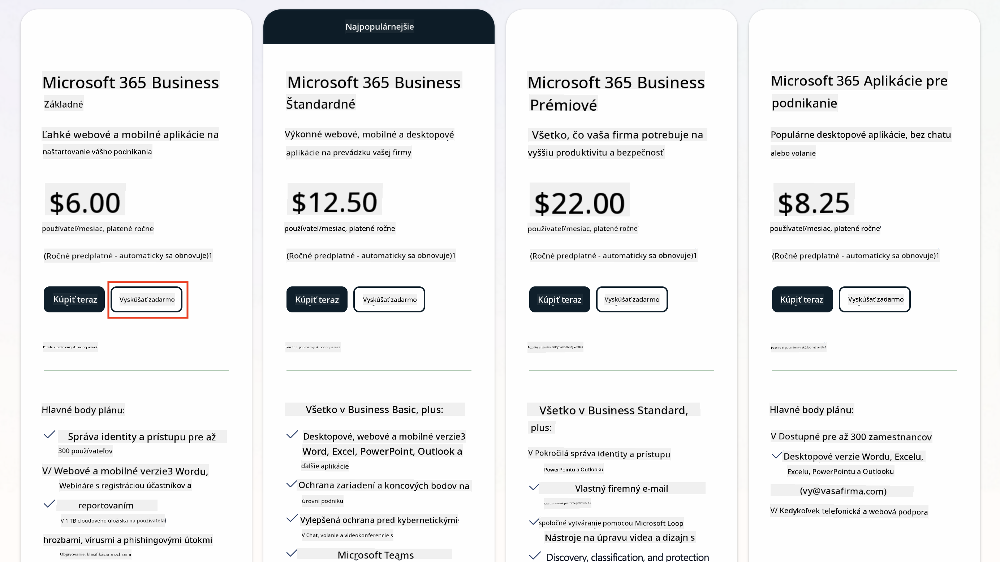
   1. Po získaní nového účtu sa prihláste.

    !!! Tip
        Ak plánujete publikovať agentov do Microsoft 365 Copilot Chat alebo pripojiť k organizačným dátam (SharePoint, OneDrive, Dataverse), je potrebná licencia Microsoft 365 Copilot. Ide o doplnkovú licenciu, o ktorej sa môžete dozvedieť viac [na stránke licencovania](https://www.microsoft.com/microsoft-365/copilot#plans)

---

## Krok 2: Spustite skúšobnú verziu Copilot Studio

Keď máte svoj Microsoft 365 Tenant, musíte získať prístup k Copilot Studio. Bezplatnú 30-dňovú skúšobnú verziu môžete získať podľa týchto krokov:

1. Prejdite na [aka.ms/TryCopilotStudio](https://aka.ms/TryCopilotStudio).  
1. Zadajte e-mailovú adresu z nového účtu, ktorý ste nastavili v predchádzajúcom kroku, a vyberte `Ďalej`.  
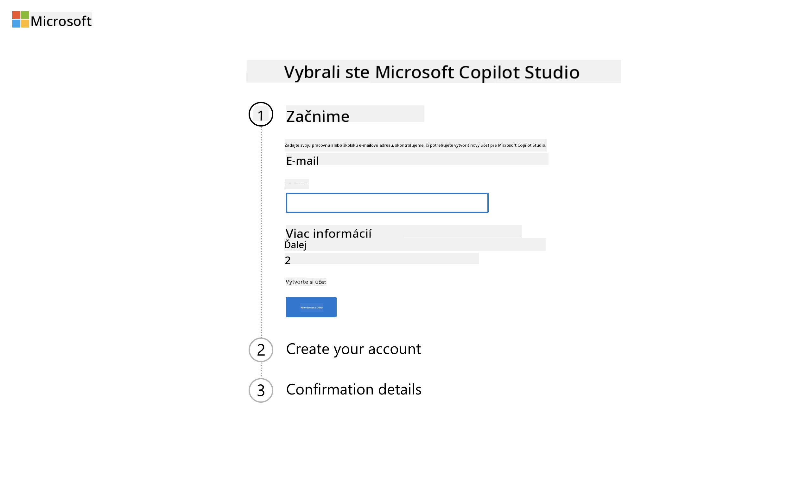
1. Malo by rozpoznať váš účet. Vyberte `Prihlásiť sa`.
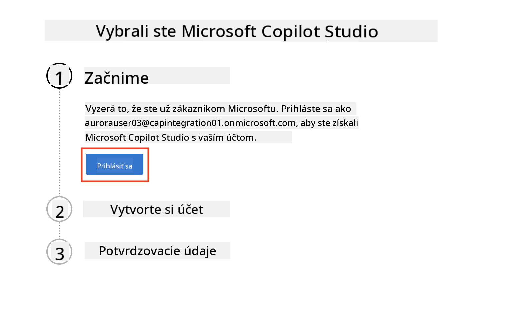  
1. Vyberte `Spustiť bezplatnú skúšobnú verziu`.
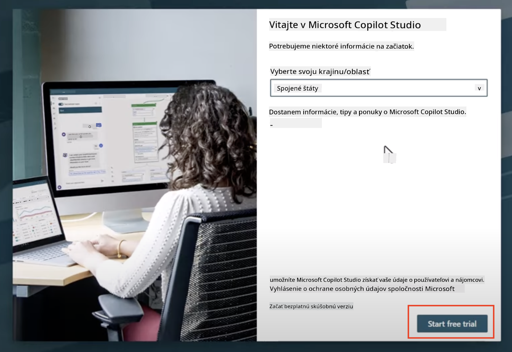

!!! info "Poznámky k skúšobnej verzii"  
     1. Bezplatná skúšobná verzia poskytuje **plné schopnosti Copilot Studio**.
     1. Dostanete e-mailové upozornenia o vypršaní platnosti skúšobnej verzie. Skúšobnú verziu môžete predĺžiť o 30 dní (až do 90 dní runtime agenta).  
     1. Ak váš správca tenantu zakázal samoobslužné prihlásenie, zobrazí sa chyba—kontaktujte svojho správcu Microsoft 365, aby ho znovu povolil.

---

## Krok 3: Vytvorte nové vývojové prostredie

### Zaregistrujte sa do plánu Power Apps Developer

Pomocou toho istého tenantu Microsoft 365 z kroku 1 sa zaregistrujte do plánu Power Apps Developer, aby ste vytvorili bezplatné vývojové prostredie na tvorbu a testovanie s Copilot Studio.

1. Zaregistrujte sa na [webovej stránke plánu Power Apps Developer](https://aka.ms/PowerAppsDevPlan).

    - Zadajte svoju e-mailovú adresu
    - Zaškrtnite políčko
    - Vyberte **Začať zadarmo**

    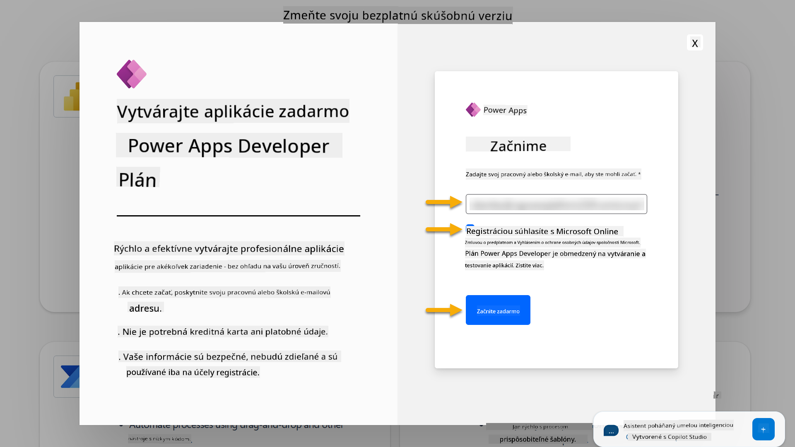

1. Po registrácii do plánu Developer budete presmerovaní na [Power Apps](https://make.powerapps.com/). Prostredie používa vaše meno, napríklad **Prostredie Adele Vanceovej**. Ak už existuje prostredie s týmto názvom, nové vývojové prostredie bude pomenované **Prostredie Adele Vanceovej (1)**.

    Použite toto vývojové prostredie v Copilot Studio pri dokončovaní laboratórií.

!!! Note
    Ak používate existujúci účet Microsoft 365 a nevytvorili ste ho v kroku 1, napríklad - používate svoj vlastný účet vo vašej pracovnej organizácii, váš IT administrátor (alebo ekvivalentný tím) spravujúci váš tenant/prostredia mohol vypnúť proces registrácie. V takom prípade kontaktujte svojho administrátora alebo vytvorte testovací tenant podľa kroku 1.

---

## Krok 4: Vytvorte novú SharePoint stránku

Je potrebné vytvoriť novú SharePoint stránku, ktorá bude použitá v [Lekcii 06 - Vytvorenie vlastného agenta pomocou konverzačného tvorivého zážitku s Copilotom a jeho ukotvenie vašimi dátami](../06-create-agent-from-conversation/README.md#62-add-an-internal-knowledge-source-using-a-sharepoint-site).

1. Vyberte ikonu vafle v ľavom hornom rohu Microsoft Copilot Studio na zobrazenie menu. Vyberte SharePoint z menu.

    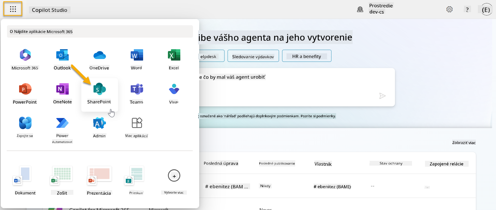

1. SharePoint sa načíta. Vyberte **+ Vytvoriť stránku** na vytvorenie novej SharePoint stránky.

    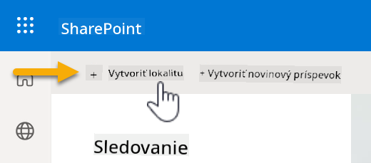

1. Zobrazí sa dialóg na vedenie pri vytváraní novej SharePoint stránky. Vyberte **Tímová stránka**.

    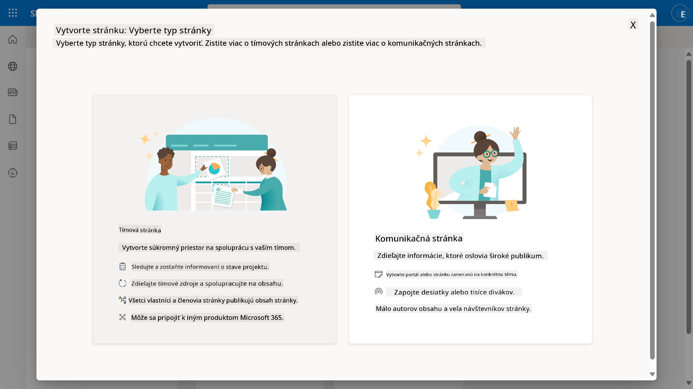

1. V ďalšom kroku sa predvolene načíta zoznam šablón Microsoft. Posuňte sa nadol a vyberte šablónu **IT help desk**.

    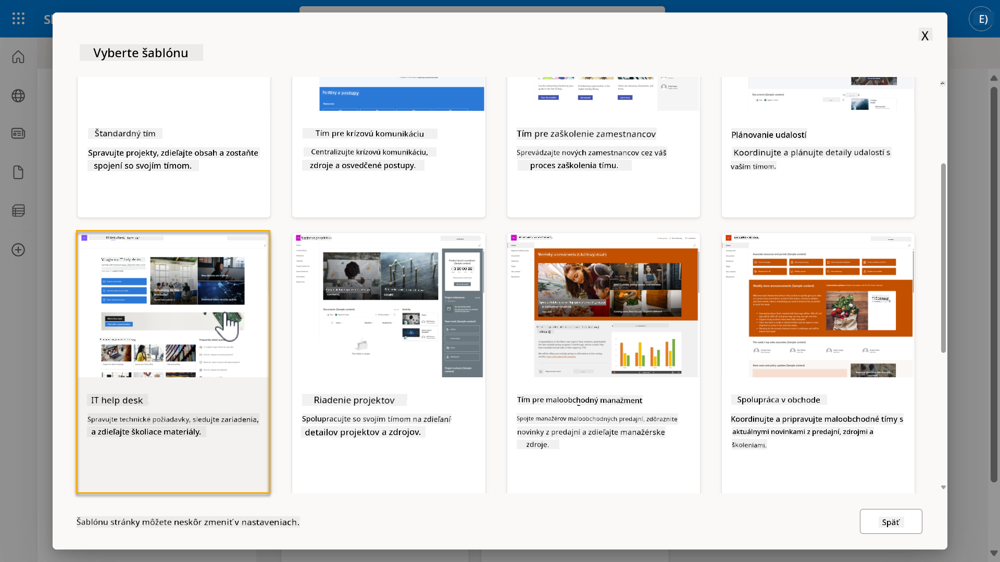

1. Vyberte **Použiť šablónu** na vytvorenie novej SharePoint stránky pomocou šablóny IT help desk.

    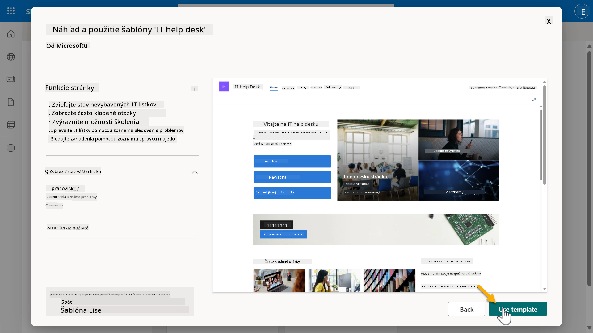

1. Zadajte informácie o svojej stránke. Nasledujúci je príklad:

    | Pole | Hodnota |
    | --- | --- |
    | Názov stránky | Contoso IT |
    | Popis stránky | Copilot Studio pre začiatočníkov |
    | Adresa stránky | ContosoIT |

    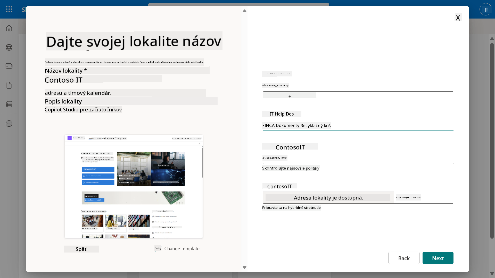

1. V poslednom kroku môžete vybrať jazyk pre SharePoint stránku. Predvolene bude **Angličtina**. Nechajte jazyk ako **Angličtina** a vyberte **Vytvoriť stránku**.

    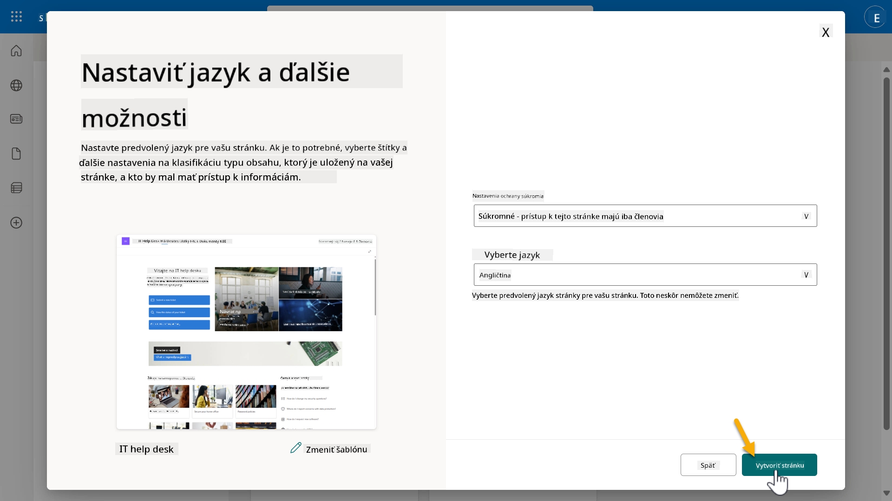

1. SharePoint stránka sa bude niekoľko sekúnd vytvárať. Medzitým môžete pridať ďalších používateľov na svoju stránku zadaním ich e-mailovej adresy do poľa **Pridať členov**. Po dokončení vyberte **Dokončiť**.

    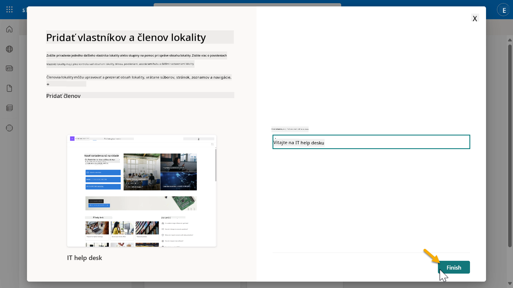

1. Načítanie domovskej stránky SharePoint stránky bude nasledovať. **Skopírujte** URL adresu SharePoint stránky.

1. Táto šablóna poskytuje stránky so vzorovými dátami o rôznych IT politikách a dva vzorové zoznamy (Tickets a Devices).

### Použite zoznam Devices na SharePoint stránke

Použijeme zoznam **Devices** v [Misii 07 - Pridanie novej témy s triggerom a uzlami](../07-add-new-topic-with-trigger/README.md#73-add-a-tool-using-a-connector).

### Pridajte nový stĺpec

Posuňte sa úplne doprava v zozname a vyberte tlačidlo **+ Pridať stĺpec**. Vyberte typ **hyperlink**, zadajte **Obrázok** ako názov stĺpca a vyberte pridať.

### Vytvorte vzorové dáta v zozname Devices na SharePoint stránke

Musíte zabezpečiť, aby bol tento zoznam vyplnený aspoň 4 vzorovými položkami dát a pridať jeden ďalší stĺpec do tohto zoznamu.  

Pri pridávaní vzorových dát sa uistite, že sú vyplnené nasledujúce polia:

- Fotografia zariadenia - použite obrázky z [priečinka s obrázkami zariadení](https://github.com/microsoft/agent-academy/tree/main/docs/recruit/00-course-setup/images/device-images)
- Názov
- Stav
- Výrobca
- Model
- Typ majetku
- Farba
- Sériové číslo
- Dátum nákupu
- Cena nákupu
- Číslo objednávky
- Obrázok - použite nasledujúce odkazy

|Zariadenie  |URL  |
|---------|---------|
|Surface Laptop 13     | [https://raw.githubusercontent.com/microsoft/agent-academy/refs/heads/main/docs/recruit/00-course-setup/images/device-images/Surface-Laptop-13.png](https://raw.githubusercontent.com/microsoft/agent-academy/refs/heads/main/docs/recruit/00-course-setup/images/device-images/Surface-Laptop-13.png)        |
|Surface Laptop 15     | [https://raw.githubusercontent.com/microsoft/agent-academy/refs/heads/main/docs/recruit/00-course-setup/images/device-images/Surface-Laptop-15.png](https://raw.githubusercontent.com/microsoft/agent-academy/refs/heads/main/docs/recruit/00-course-setup/images/device-images/Surface-Laptop-15.png)        |
|Surface Pro    | [https://raw.githubusercontent.com/microsoft/agent-academy/refs/heads/main/docs/recruit/00-course-setup/images/device-images/Surface-Pro-12.png](https://raw.githubusercontent.com/microsoft/agent-academy/refs/heads/main/docs/recruit/00-course-setup/images/device-images/Surface-Pro-12.png)        |
|Surface Studio    | [https://raw.githubusercontent.com/microsoft/agent-academy/refs/heads/main/docs/recruit/00-course-setup/images/device-images/Surface-Studio.png](https://raw.githubusercontent.com/microsoft/agent-academy/refs/heads/main/docs/recruit/00-course-setup/images/device-images/Surface-Studio.png)        |

---

## ✅ Misia splnená

Úspešne ste:

- Nastavili vývojové prostredie Microsoft 365  
- Aktivovali skúšobnú verziu Copilot Studio  
- Vytvorili SharePoint stránku na ukotvenie agentov  
- Naplnili zoznam Devices na použitie v budúcich misiách

Oficiálne ste pripravení začať svoj **výcvik agenta na úrovni Rekrut** v [Lekcii 01](../01-introduction-to-agents/README.md).  

<!-- markdownlint-disable-next-line MD033 -->

---

**Zrieknutie sa zodpovednosti**:  
Tento dokument bol preložený pomocou služby AI prekladu [Co-op Translator](https://github.com/Azure/co-op-translator). Aj keď sa snažíme o presnosť, prosím, berte na vedomie, že automatizované preklady môžu obsahovať chyby alebo nepresnosti. Pôvodný dokument v jeho rodnom jazyku by mal byť považovaný za autoritatívny zdroj. Pre kritické informácie sa odporúča profesionálny ľudský preklad. Nenesieme zodpovednosť za akékoľvek nedorozumenia alebo nesprávne interpretácie vyplývajúce z použitia tohto prekladu.