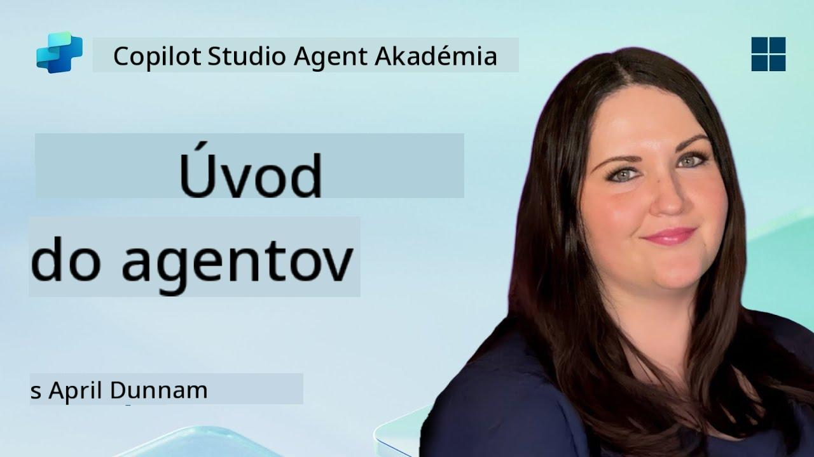

<!--
CO_OP_TRANSLATOR_METADATA:
{
  "original_hash": "d6706e107678264168d77b2e107710b1",
  "translation_date": "2025-10-20T17:45:49+00:00",
  "source_file": "docs/recruit/01-introduction-to-agents/README.md",
  "language_code": "sk"
}
-->
# 🚨 Misia 01: Úvod do agentov

## 🕵️‍♂️ KRYCÍ NÁZOV: `OPERÁCIA DEKÓDOVANIE AI AGENTA`

> **⏱️ Časový rámec operácie:** `~30 minút – iba informácie, nie je potrebná práca v teréne`

🎥 **Pozrite si prehľad**

## 🎯 Misia: Zhrnutie

Vitajte, Rekrut. Predtým, než sa pustíme do vytvárania agentov, potrebujete pevné základy AI konceptov, ktoré ich poháňajú. Táto misia vás vybaví základnými poznatkami o konverzačnej AI, veľkých jazykových modeloch (LLMs), generovaní s podporou vyhľadávania (RAG) a typoch agentov, ktoré môžete vytvoriť v Copilot Studio.

## 🔎 Ciele

V tejto misii sa naučíte:

1. Čo je konverzačná AI a prečo je dôležitá  
1. Ako veľké jazykové modely (LLMs) poháňajú chatovacie skúsenosti  
1. Čo prináša generovanie s podporou vyhľadávania (RAG)  
1. Rozdiel medzi konverzačnými agentmi a autonómnymi agentmi  
1. Ako agenti v Copilot Studio využívajú tieto koncepty  

Poďme na to!

---

## Čo je konverzačná AI?

Konverzačná AI označuje akýkoľvek systém, ktorý dokáže porozumieť, spracovať a odpovedať na ľudský jazyk – či už text alebo reč – spôsobom, ktorý pôsobí prirodzene. Myslite na chatboty v helpdeskoch alebo virtuálnych osobných asistentov vo vašich obľúbených aplikáciách. Pod povrchom väčšina moderných konverzačných AI spolieha na veľké jazykové modely (LLMs), o ktorých si povieme ďalej.

### Prečo je to dôležité

- **Používateľská skúsenosť:** Konverzačné rozhrania sú často intuitívnejšie než preklikávanie sa cez menu.  
- **Škálovateľnosť:** Jeden agent dokáže zvládnuť desiatky alebo stovky súbežných konverzácií.  
- **Efektivita:** Namiesto vytvárania vlastných skriptov založených na pravidlách sa agenti poháňaní LLM prispôsobujú na základe vstupov používateľa.  
- **Rozšíriteľnosť:** Pri správnom návrhu môžu agenti čerpať z databáz znalostí, pripájať sa k API alebo fungovať ako „digitálni kolegovia“ v rámci pracovných procesov.

---

## Veľké jazykové modely (LLMs) 101

Jadrom väčšiny konverzačných AI systémov sú **veľké jazykové modely** – neurónové siete trénované na obrovských textových korpusoch. Učia sa štatistické vzory jazyka, aby mohli generovať súvislé vety, odpovedať na otázky alebo dokonca navrhovať nápady. Kľúčové body na pochopenie:

1. **Tréningové dáta:** LLMs spracovávajú terabajty textu (webové stránky, knihy, články). Táto „svetová znalosť“ im umožňuje odpovedať na mnohé témy.  
1. **Tokenizácia:** Text sa rozdelí na menšie jednotky nazývané tokeny (slová, podslová alebo znaky). Model predpovedá jeden token naraz.  
1. **Kontextové okno:** Každý LLM má limit na počet tokenov, ktoré dokáže „vidieť“ naraz. Po prekročení limitu sa predchádzajúce tokeny odstránia.  
1. **Promptovanie:** S LLM komunikujete zaslaním promptu. Čím lepší je váš prompt, tým sústredenejšia a relevantnejšia je odpoveď.  
1. **Zero-shot vs. Fine-tuning:** Zero-shot znamená používanie LLM tak, ako je (len surové váhy). Fine-tuning znamená prispôsobenie modelu na špecifické dáta, aby odpovedal presnejšie na vaše potreby.

!!! Tip "Profesionálny tip"
    Bežná analógia je, že LLM je ako „super-inteligentné automatické dopĺňanie“. Skutočne nerozumie významu ako ľudský mozog, ale je mimoriadne dobré v predpovedaní ďalšieho najlepšieho slova (alebo frázy) v sekvencii.

---

## Generovanie s podporou vyhľadávania (RAG)

Keď sa LLMs spoliehajú výlučne na statické tréningové dáta, môžu halucinovať alebo byť zastarané. RAG tento problém rieši tým, že modelu umožňuje „vyhľadávať“ aktuálne informácie pred vytvorením odpovede. Na vysokej úrovni RAG funguje takto:

1. **Dotaz používateľa:** Používateľ položí otázku (napr. „Aké sú najnovšie výsledky štvrťročného zisku Contoso?“).  
1. **Krok vyhľadávača:** Systém vyhľadáva zdroj znalostí (dokumenty, interné databázy, knižnice SharePoint atď.), aby našiel relevantné pasáže.  
1. **Doplnenie:** Nájdené pasáže sa pridajú k promptu LLM.  
1. **Generovanie:** LLM spracuje otázku používateľa aj získaný kontext a vytvorí odpoveď založenú na aktuálnych údajoch.  

S RAG môže váš agent vyhľadávať interné firemné wiki, plugin API alebo prehľadávať databázu FAQ – a poskytovať odpovede, ktoré nie sú obmedzené na staticky publikované parametre modelu.

---

## Konverzační vs. autonómni agenti

V kontexte Copilot Studio môže termín **agent** označovať rôzne typy AI asistentov. Je užitočné rozlíšiť:

**Konverzační agenti:**

- Primárne sa zameriavajú na obojsmerný dialóg.  
- Uchovávajú kontext počas viacerých krokov konverzácie.  
- Zvyčajne sú riadení preddefinovanými tokmi alebo spúšťačmi (napr. „Ak používateľ povie X, odpovedz Y“).  
- Ideálne pre zákaznícku podporu, FAQ, vedené interakcie, plánovanie alebo jednoduché otázky a odpovede.  
  - Príklady:  
    - Chatbot v Teams, ktorý odpovedá na otázky o HR politikách.  
    - Bot Power Virtual Agents na stránke SharePoint, ktorý vedie používateľov cez formulár.  

**Autonómni agenti:**

- Idú nad rámec dialógu; môžu **vykonávať akcie** v mene používateľa.  
- Používajú LLM slučky uvažovania (myslite na „plán → akcia → pozorovanie → preplánovanie“) na dokončenie úloh.  
- Pripájajú sa k externým nástrojom alebo API (napr. spustenie toku Power Automate, odoslanie pozvánok na kalendár, manipulácia s dátami v Dataverse).  
- Fungujú bez neustálych podnetov od človeka – po spustení môžu samostatne zvládnuť viacstupňové procesy.  
  - Príklady:  
    - Agent, ktorý vytvorí cestovný itinerár, rezervuje lety a pošle potvrdenia e-mailom.  
    - Agent „Zhrnutie stretnutia“, ktorý sa pripojí k hovoru v Teams, v reálnom čase ho prepíše a napíše výkonný súhrn do OneNote.  

!!! Info "Kľúčový rozdiel"
    Konverzační agenti čakajú na vstup používateľa a držia sa dialógu. Autonómni agenti proaktívne plánujú a vykonávajú sekvenciu krokov s využitím širšieho prístupu k nástrojom.

---

## Agenti v Copilot Studio

**Copilot Studio** spája konverzačné aj autonómne scenáre pod jedným rámcom. Tu je, ako Copilot Studio pomáha pri vytváraní agentov:

1. **Vizualizovaný návrh agenta:** Nástroj s nízkym kódom na definovanie promptov, pamäte a nástrojov pre chatové aj akčné pracovné toky.  
1. **Konfigurácie LLM:** Vyberte si z rôznych modelov OpenAI alebo podnikových modelov GPT od Microsoftu, ktoré zodpovedajú vašim výkonnostným a nákladovým potrebám.  
1. **Konektory na vyhľadávanie:** Predpripravené integrácie pre SharePoint, OneDrive, Azure Cognitive Search a Dataverse, umožňujúce RAG priamo z krabice.  
1. **Vlastné nástroje a funkcie:** Definujte vlastné HTTP akcie alebo toky Power Automate, ktoré môže váš agent autonómne vyvolať.  
1. **Podpora multimodálnosti:** Okrem textu môžu agenti Copilot Studio spracovávať obrázky, súbory alebo štruktúrované dáta na obohatenie kontextu.  
1. **Publikovanie a distribúcia:** Keď je váš agent pripravený, môžete ho publikovať do Microsoft 365 Copilot (aby ho používatelia mohli vyvolať v Teams, SharePoint, Outlook atď.) alebo ho vložiť ako samostatný chatový widget na webovú stránku.

---

## 🎉 Misia splnená

Teraz ste dokončili svoj úvod do agentov a základných AI konceptov. Rozumiete:

1. **LLMs = „Mozog“ vášho agenta**  
   - Zodpovedný za porozumenie jazyka a generovanie.  
   - Viac tokenov = bohatší kontext, ale aj vyššie náklady na volanie.  

1. **RAG = Integrácia aktuálnych znalostí**  
   - Prekonáva medzeru medzi statickým LLM a neustále sa meniacimi zdrojmi dát.  
   - Vyhľadáva a vkladá relevantné dokumenty alebo záznamy do promptu LLM.  

1. **Konverzační vs. autonómni**  
   - **Konverzační:** Zameriavajú sa na tok dialógu a uchovávanie kontextu (napr. „Pamäť relácie“).  
   - **Autonómni:** Pridávajú „Akčné bloky“, ktoré umožňujú agentovi vyvolávať externé nástroje alebo služby.

---
Ďalej preskúmate [základy Copilot Studio](../02-copilot-studio-fundamentals/README.md)!

Buďte ostražití, Rekrut – vaša AI cesta sa práve začína!

## 📚 Taktické zdroje

🔗 [Domovská stránka dokumentácie Copilot Studio](https://learn.microsoft.com/microsoft-copilot-studio/)

---

---

**Zrieknutie sa zodpovednosti**:  
Tento dokument bol preložený pomocou služby AI prekladu [Co-op Translator](https://github.com/Azure/co-op-translator). Hoci sa snažíme o presnosť, prosím, berte na vedomie, že automatizované preklady môžu obsahovať chyby alebo nepresnosti. Pôvodný dokument v jeho rodnom jazyku by mal byť považovaný za autoritatívny zdroj. Pre kritické informácie sa odporúča profesionálny ľudský preklad. Nenesieme zodpovednosť za akékoľvek nedorozumenia alebo nesprávne interpretácie vyplývajúce z použitia tohto prekladu.