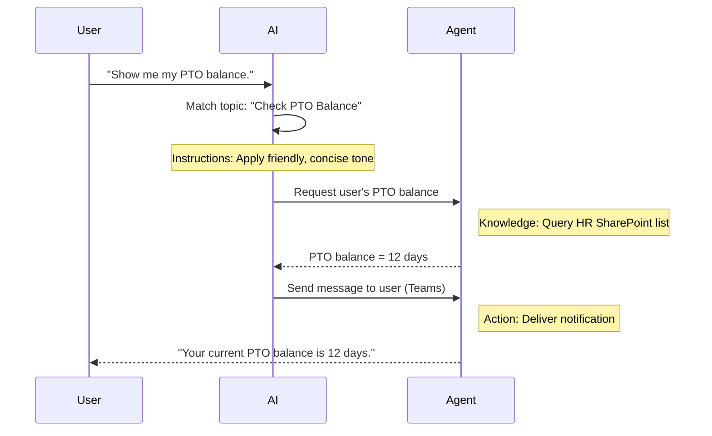

<!--
CO_OP_TRANSLATOR_METADATA:
{
  "original_hash": "90a3c5122f5687bbc8cc819990f175d4",
  "translation_date": "2025-10-20T17:47:24+00:00",
  "source_file": "docs/recruit/02-copilot-studio-fundamentals/README.md",
  "language_code": "sk"
}
-->
# 🚨 Misia 02: Základy Copilot Studio

## 🕵️‍♂️ KRYCÍ NÁZOV: `OPERÁCIA CORE PROTOCOL`

> **⏱️ Časový rámec operácie:** `~30 minút – iba informácie, žiadna práca v teréne`  

🎥 **Pozrite si prehľad**

[](https://www.youtube.com/watch?v=x4OCwDRGeLE "Pozrite si prehľad na YouTube")

## 🎯 Popis misie

Vitajte, regrút. Táto misia vás vybaví základnými informáciami o tom, ako funguje Copilot Studio a ako vytvárať inteligentných agentov, ktorí prinášajú skutočnú hodnotu pre podnikanie.

Predtým, než vytvoríte svojho prvého agenta, musíte pochopiť štyri kľúčové komponenty, ktoré tvoria každého vlastného AI agenta: Znalosti, Nástroje, Témy a Inštrukcie. Tiež sa naučíte, ako tieto prvky spolupracujú v orchestrátore Copilot Studio.

## 🔎 Ciele

V tejto misii sa naučíte:

- **Čo je Copilot Studio**
- **Kedy a prečo používať agentov**
- **Preskúmať štyri stavebné bloky agentov**
      - **Znalosti**
      - **Nástroje**
      - **Témy**
      - **Inštrukcie**
- **Pochopiť, ako tieto komponenty spolupracujú** na vytvorení inteligentného, automatizovaného agenta

---

## Čo sú agenti v Copilot Studio?

**Agent** je špecializovaný AI asistent, ktorého navrhnete na riešenie konkrétnych úloh alebo otázok. Na rozdiel od všeobecného chatbota váš agent:

- **Pozná špecifické údaje spoločnosti** (politiky, dokumenty, databázy)  
- **Vykonáva úlohy v reálnom svete** (posielanie správ, vytváranie udalostí v kalendári, aktualizácia záznamov)  
- **Udržiava kontext konverzácie**, aby mohol nadviazať na predchádzajúce otázky  

Keďže Copilot Studio je nízko-kódové, môžete jednoducho presúvať predpripravené komponenty – nie sú potrebné hlboké programovacie zručnosti. Po vytvorení agenta ho môžu ľudia používať v Teams, Slacku alebo dokonca na vlastnej webovej stránke na získanie odpovedí alebo automatické spúšťanie pracovných postupov.

---

## Kedy a prečo používať Copilot Studio

Zatiaľ čo Microsoft 365 Copilot poskytuje všeobecnú AI asistenciu v aplikáciách Office, vlastného agenta budete chcieť použiť, keď:

### Potrebujete špecifické znalosti pre danú oblasť

- Prednastavený Copilot nemusí poznať interné postupy alebo údaje vašej spoločnosti. Agent môže dotazovať vaše SharePoint stránky, databázy alebo vlastné zdroje na poskytovanie presných a aktuálnych odpovedí.  

### Chcete automatizovať viacstupňové pracovné postupy

- Napríklad: "Keď niekto podá výdavok, pošlite ho na schválenie, aktualizujte finančný sledovač a upozornite manažéra." Vlastný agent môže zvládnuť každý krok, spustený jediným príkazom alebo udalosťou.  

### Potrebujete kontextovú skúsenosť priamo v nástroji  

- Predstavte si agenta na onboarding nových zamestnancov v Teams, ktorý vedie HR tím cez každú politiku, posiela potrebné formuláre a plánuje orientačné stretnutia – priamo vo vašej existujúcej platforme na spoluprácu.  

---

## Štyri stavebné bloky agenta

Každý agent v Copilot Studio je postavený zo štyroch základných komponentov:

1. **Znalosti**  
1. **Nástroje (Akcie)**  
1. **Témy**  
1. **Inštrukcie**

Nižšie definujeme každý stavebný blok a ukážeme, ako spolupracujú na vytvorení efektívneho agenta.

### 1. Znalosti

**Znalosti** sú údaje a kontext, ktoré váš agent používa na presné odpovedanie na otázky. Majú dve časti:

#### Vlastné inštrukcie a kontext

- Napíšete stručný popis účelu a tónu agenta. Napríklad:  

    ```text
    You are an IT support agent. You help employees troubleshoot common software issues, provide troubleshooting steps, and escalate urgent tickets.
    ```

- Počas konverzácie si agent pamätá predchádzajúce kroky, aby sa mohol odvolávať na to, čo už bolo diskutované (napríklad, ak používateľ najprv povie: "Moja tlačiareň je offline," a neskôr sa opýta: "Skontrolovali ste úroveň atramentu?" agent si zapamätá kontext tlačiarne).

#### Zdroje znalostí (Základné údaje)

- Pripojíte svojho agenta k viacerým zdrojom údajov – knižniciam SharePoint, stránkam s dokumentáciou, wiki alebo iným databázam.  
- Keď používateľ položí otázku, agent vyhľadá relevantné výňatky z týchto zdrojov, aby odpovede boli **založené** na skutočných politikách, manuáloch produktov alebo akýchkoľvek vlastných informáciách vašej organizácie.  
- Môžete dokonca prinútiť agenta, aby odpovedal iba na základe týchto zdrojov, čím zabránite tomu, aby si vymýšľal alebo "halucinoval" odpovede.

!!! example
    Agent "Asistent pre politiky" môže byť pripojený k vášmu HR SharePointu. Ak sa používateľ opýta: "Aká je naša miera akumulácie PTO?" agent vyhľadá presný text z dokumentu HR politiky namiesto toho, aby sa spoliehal na všeobecnú AI odpoveď.

---

### 2. Nástroje (Akcie)

**Nástroje (Akcie)** definujú, čo agent dokáže urobiť nad rámec chatovania. Každá akcia je úloha, ktorú agent vykonáva programovo, ako napríklad:

- Posielanie e-mailu alebo správy v Teams  
- Vytváranie alebo aktualizácia udalosti v kalendári  
- Pridávanie alebo úprava záznamu v databáze (napr. zoznam SharePoint alebo tabuľka Dataverse)  
- Volanie Power Automate flow alebo REST API  

#### Ako fungujú akcie

- **Definovanie vstupov a výstupov**  
      - Napríklad akcia Poslať e-mail môže vyžadovať:  
        - `RecipientEmailAddress`  
        - `SubjectLine`  
        - `EmailBody`  

- **Kombinovanie akcií do pracovných postupov**  
      - Často splnenie požiadavky používateľa zahŕňa viacero krokov.  
      - Môžete usporiadať akcie tak, aby:  
             1. Agent získal údaje zo zoznamu SharePoint.  
             2. Vygeneroval zhrnutie pomocou LLM.  
             3. Poslal správu v Teams s týmto zhrnutím.  

- **Pripojenie k externým systémom**  
      - Ak potrebujete aktualizovať CRM alebo zavolať interné API, vytvorte vlastnú akciu na spracovanie.  
      - Copilot Studio sa môže integrovať s Power Platform alebo akýmkoľvek HTTP-based endpointom.

!!! example "Agent "Pomocník pre výdavky" by mohol:"  
    1. Počúvať požiadavku "Podanie výdavku".  
    2. Získať detaily výdavku používateľa z formulára.  
    3. Použiť akciu "Pridať do zoznamu SharePoint" na uloženie údajov.  
    4. Spustiť akciu "Poslať e-mail" na upozornenie schvaľovateľa.  

---

### 3. Témy

**Témy** definujú konverzačné spúšťače alebo vstupné body pre vášho agenta. Každá téma zodpovedá funkčnosti alebo kategórii otázok.

#### Konverzačné spúšťače  

- Téma môže byť "Podanie IT lístka," "Kontrola zostatku dovolenky," alebo "Vytvorenie predajnej správy."  
- V pozadí Copilot Studio používa **generatívnu orchestráciu**: namiesto spoliehania sa na presné kľúčové slová AI interpretuje zámer používateľa a vyberá správnu tému na základe stručného popisu, ktorý poskytnete.  

#### Popisy tém  

- V každej téme napíšete jasný, stručný popis toho, čo téma pokrýva.

!!! example "Príklad popisu témy"
    Táto téma pomáha používateľom podať IT lístok podpory zhromaždením detailov problému, priority a kontaktných informácií.

- AI používa tento popis na rozhodnutie, kedy aktivovať túto tému, aj keď formulácia používateľa presne nezodpovedá.

#### Mapovanie tém na akcie  

- Každá téma je pripojená k jednej alebo viacerým akciám alebo krokom na získanie údajov.  
- Keď AI vyberie tému, vedie konverzáciu cez sekvenciu, ktorú ste definovali (kladenie doplňujúcich otázok, volanie akcií, návrat výsledkov).

!!! example
    Ak používateľ povie: "Potrebujem pomoc s nastavením nového laptopu," AI môže priradiť tento zámer k téme "Podanie IT lístka." Agent potom požiada o model laptopu, detaily používateľa a automaticky vloží lístok do systému technickej podpory.

---

### 4. Inštrukcie

**Inštrukcie** (niekedy nazývané "Podnety" alebo "Systémové správy") usmerňujú tón, štýl a hranice LLM. Formujú, ako agent reaguje v akejkoľvek situácii.

#### Úloha a osobnosť  

- Povedzte AI, kto je (napr. "Ste zákaznícky servisný agent pre Contoso Retail").  
- Tým nastavíte tón – priateľský, stručný, formálny alebo neformálny – v závislosti od vášho použitia.

#### Usmernenia pre odpovede  

- Špecifikujte akékoľvek pravidlá, ktoré musí agent dodržiavať, ako napríklad:  
      - "Vždy sumarizujte informácie o politike v bodoch."  
      - "Ak nepoznáte odpoveď, povedzte: ‘Je mi ľúto, nemám tieto informácie.’"  
      - "Nikdy nezdieľajte dôverné údaje mimo kontext."

#### Pravidlá pamäte a kontextu

- Môžete inštruovať agenta, koľko krokov konverzácie si má pamätať.  
- Napríklad: "Pamätajte si detaily z požiadaviek tohto používateľa na až tri doplňujúce otázky."

!!! example "V agentovi "Poradca pre benefity" by ste mohli zahrnúť:"
    "Vždy odkazujte na najnovšiu HR príručku pri odpovedaní na otázky. Ak sa pýtajú na termíny registrácie, poskytnite konkrétne dátumy z politiky. Udržujte odpovede pod 150 slov."

---

## Ako štyri stavebné bloky spolupracujú

Keď zostavíte **Znalosti**, **Nástroje**, **Témy** a **Inštrukcie**, orchestrátor AI Copilot Studio vytvorí agenta, ktorý:

1. **Počúva relevantnú tému** (usmernenú vašimi popismi tém).  
1. **Aplikuje inštrukcie** na nastavenie tónu, rozhodovanie, kedy klásť doplňujúce otázky, a dodržiavanie pravidiel.  
1. **Využíva zdroje znalostí** na zakotvenie odpovedí v údajoch vašej organizácie.  
1. **Volá nástroje (akcie)** podľa potreby na vykonanie úloh – posielanie správ, aktualizáciu záznamov alebo volanie API.  

V pozadí orchestrátor používa **generatívne plánovanie**: rozhoduje, ktoré kroky vykonať, v akom poradí, aby splnil požiadavku používateľa. Ak akcia zlyhá (napríklad e-mail sa nedá poslať), agent dodržiava vaše pokyny na spracovanie výnimiek (položiť objasňujúcu otázku alebo nahlásiť chybu). Keďže LLM sa prispôsobuje kontextu konverzácie, agent si môže pamätať informácie počas viacerých krokov a začleniť nové údaje, ako sa konverzácia vyvíja.

**Príklad vizuálneho toku:**  
<!--
1. **Používateľ:** "Ukáž mi môj zostatok PTO."
1. **AI (Témy):** Priradí tému "Kontrola zostatku PTO".  
1. **AI (Inštrukcie):** Použije priateľský, stručný tón.  
1. **Agent (Znalosti):** Dotazuje zoznam HR SharePoint na zostatok používateľa.  
1. **Agent (Akcie):** Získa hodnotu a pošle správu v Teams:  
   > "Váš aktuálny zostatok PTO je 12 dní."  
-->



---

## 🎉 Misia splnená

Úspešne ste dokončili základné školenie. Teraz ste sa naučili štyri základné stavebné bloky každého agenta v Copilot Studio:

1. **Znalosti** – Miesto, kde agent vyhľadáva faktické informácie a udržiava pamäť konverzácie.  
1. **Nástroje** – Úlohy, ktoré agent dokáže vykonávať na automatizáciu procesov.  
1. **Témy** – Ako agent rozpoznáva zámer používateľa a rozhoduje, ktorý pracovný postup spustiť.  
1. **Inštrukcie** – Pravidlá, tón a hranice, ktoré usmerňujú každú odpoveď.

S týmito komponentmi môžete vytvoriť základného agenta, ktorý odpovedá na otázky a vykonáva jednoduché pracovné postupy. V ďalšej lekcii prejdeme krok za krokom tutoriál na vytvorenie agenta "Service Desk" – od pripojenia prvého zdroja znalostí po definovanie témy a prepojenie akcie.

Ďalej: Vytvoríte svojho [prvého deklaratívneho agenta pre M365 Copilot](../03-create-a-declarative-agent-for-M365Copilot/README.md).

<!-- markdownlint-disable-next-line MD033 -->


---

**Zrieknutie sa zodpovednosti**:  
Tento dokument bol preložený pomocou služby AI prekladu [Co-op Translator](https://github.com/Azure/co-op-translator). Hoci sa snažíme o presnosť, prosím, berte na vedomie, že automatizované preklady môžu obsahovať chyby alebo nepresnosti. Pôvodný dokument v jeho rodnom jazyku by mal byť považovaný za autoritatívny zdroj. Pre kritické informácie sa odporúča profesionálny ľudský preklad. Nenesieme zodpovednosť za akékoľvek nedorozumenia alebo nesprávne interpretácie vyplývajúce z použitia tohto prekladu.