<!--
CO_OP_TRANSLATOR_METADATA:
{
  "original_hash": "0c51aabca81d6256990caf4c015e6195",
  "translation_date": "2025-10-20T17:33:19+00:00",
  "source_file": "docs/recruit/04-creating-a-solution/README.md",
  "language_code": "sk"
}
-->
# 🚨 Misia 04: Vytvorenie riešenia pre vášho agenta

## 🕵️‍♂️ KRYCÍ NÁZOV: `OPERÁCIA CTRL-ALT-PACKAGE`

> **⏱️ Časový rámec operácie:** `~45 minút`

🎥 **Pozrite si prehľad**

[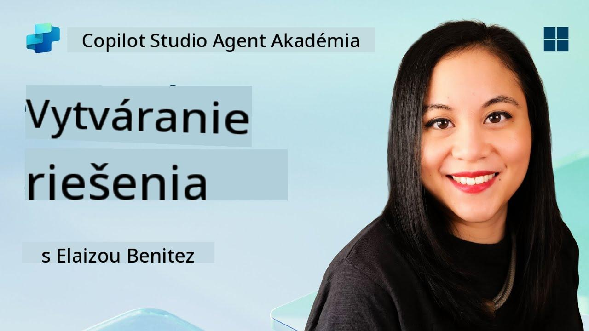](https://www.youtube.com/watch?v=1iATbkgfcpU "Pozrite si prehľad na YouTube")

## 🎯 Misia - stručný prehľad

Tvorca agentov, vitajte na ďalšej taktickej operácii. V tejto misii sa naučíte zostaviť Riešenie - oficiálny nástroj na nasadenie vášho IT Helpdesk Agenta vytvoreného pomocou Microsoft Copilot Studio. Predstavte si to ako digitálny kufrík, ktorý obsahuje vášho agenta a jeho artefakty.

Každý agent potrebuje dobre štruktúrovaný domov. To je presne to, čo poskytuje riešenie Power Platform - poriadok, prenosnosť a pripravenosť na produkciu.

Poďme baliť.

## 🔎 Ciele

V tejto misii sa naučíte:

1. Pochopiť, čo sú riešenia Power Platform a ich úlohu vo vývoji agentov
1. Zistiť výhody používania riešení na organizáciu a nasadenie agentov
1. Preskúmať vydavateľov riešení a ich význam pri správe komponentov
1. Pochopiť životný cyklus riešení Power Platform od vývoja po produkciu
1. Vytvoriť vlastného vydavateľa riešení a vlastné riešenie pre vášho IT Helpdesk Agenta

## 🕵🏻‍♀️ Riešenie? Čo to je?

V Microsoft Power Platform sú riešenia ako kontajnery alebo balíky, ktoré obsahujú všetky časti vašich aplikácií alebo agentov - môžu to byť tabuľky, formuláre, toky a vlastná logika. Riešenia sú nevyhnutné pre správu životného cyklu aplikácií (ALM), umožňujú vám spravovať vašu aplikáciu a agentov od nápadu cez vývoj, testovanie, nasadenie až po aktualizácie.

V Copilot Studio je každý agent, ktorého vytvoríte, uložený v riešení Power Platform. Predvolene sú agenti vytvorení v predvolenom riešení, pokiaľ nevytvoríte nové vlastné riešenie, v ktorom svojho agenta vytvoríte. To sa naučíme 🤓 v tejto lekcii a praktickom cvičení.

Riešenia sa tradične vytvárali v **Power Apps maker portáli** - webovom rozhraní, kde môžete vytvárať a prispôsobovať aplikácie, Dataverse, toky, preskúmavať AI komponenty a ďalšie.

   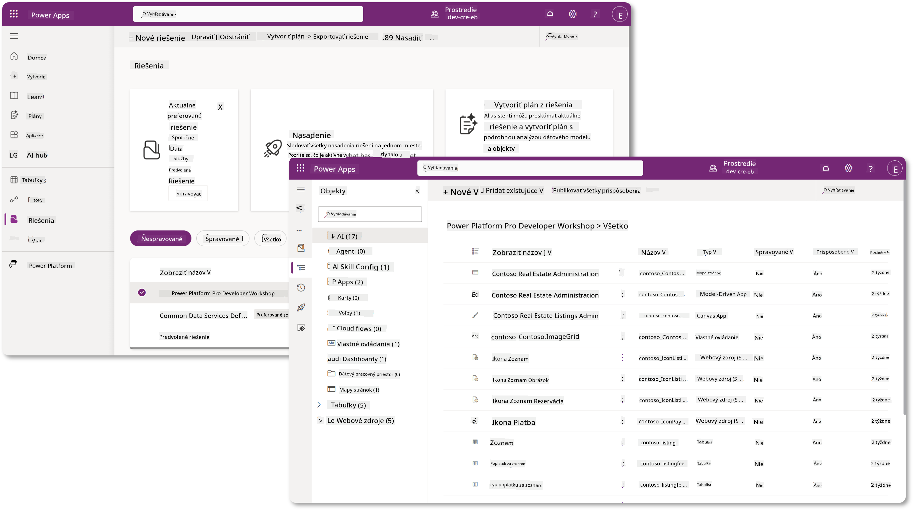

V Copilot Studio je teraz k dispozícii **Solution Explorer**, kde môžete spravovať svoje riešenia priamo. Už nemusíte prechádzať na Power Apps maker portál, aby ste spravovali svoje riešenia, všetko sa dá urobiť priamo v Copilot Studio 🪄

To znamená, že môžete vykonávať bežné úlohy súvisiace s riešeniami:

- **Vytvoriť riešenie** - vlastné riešenia umožňujú export a import agentov medzi prostrediami.
- **Nastaviť preferované riešenie** - vybrať riešenie, v ktorom budú predvolene vytváraní agenti, aplikácie atď.
- **Pridať alebo odstrániť komponenty** - váš agent môže odkazovať na iné komponenty, ako sú environmentálne premenné alebo cloudové toky. Preto je potrebné tieto komponenty zahrnúť do riešenia.
- **Exportovať riešenia** - presunúť riešenia do iného cieľového prostredia.
- **Importovať riešenia** - importovať riešenia vytvorené inde, vrátane ich aktualizácie alebo vylepšenia.
- **Vytvoriť a spravovať riešenia pipeline** - automatizovať nasadenie riešení medzi prostrediami.
- **Integrácia s Git** - umožňuje vývojárom pripojiť riešenia k Git repozitárom na kontrolu verzií, spoluprácu a ALM. Určené na použitie iba vo vývojových prostrediach.

   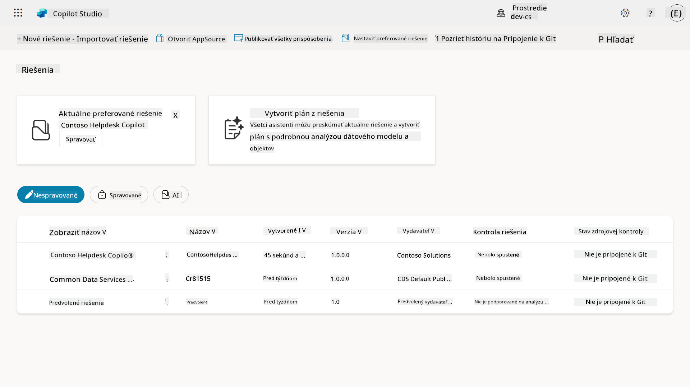

Existujú dva typy riešení:

- **Nespravované riešenia** - používané počas vývoja. Môžete ich voľne upravovať a prispôsobovať podľa potreby.
- **Spravované riešenia** - používané, keď ste pripravení nasadiť svoju aplikáciu na testovanie alebo produkciu. Tieto sú uzamknuté, aby sa zabránilo náhodným zmenám.

## 🤔 Prečo _by som mal_ používať riešenie pre svojho agenta?

Predstavte si riešenia ako _nástrojovú skrinku_. Keď potrebujete opraviť alebo vytvoriť niečo (agenta) na inom mieste (v prostredí), zhromaždíte všetky potrebné nástroje (komponenty) a vložíte ich do svojej nástrojovej skrinky (Riešenie). Potom môžete túto skrinku preniesť na nové miesto (prostredie) a použiť nástroje (komponenty) na dokončenie svojej práce alebo pridať nové nástroje (komponenty) na prispôsobenie svojho agenta alebo projektu, ktorý vytvárate.

!!! quote "Elaiza, vaša priateľská cloudová advokátka sa hlási 🙋🏻‍♀️, aby sa podelila o pár slov:"
    Na Novom Zélande máme príslovie: "Buď uprataný Kiwi!" čo je výzva pre Novozélanďanov 🥝, aby prevzali zodpovednosť za svoje prostredie tým, že správne zlikvidujú odpadky a udržia verejné priestory čisté. Rovnaký princíp môžeme použiť aj na agentov tým, že všetko, čo sa týka vášho agenta, bude organizované a prenosné, čo vám pomôže udržiavať upratané prostredie.

Je dobrým zvykom vytvoriť agenta v dedikovanom riešení vo vašom zdrojovom (vývojovom) prostredí. Tu je dôvod, prečo sú riešenia hodnotné:

🧩 **Organizovaný vývoj**

- Udržiavate svojho agenta oddeleného od predvoleného riešenia, ktoré obsahuje všetko v prostredí. Všetky komponenty vášho agenta sú na jednom mieste 🎯

- Všetko, čo potrebujete pre svojho agenta, je v riešení, čo uľahčuje export a import do cieľového prostredia 👉🏻 toto je zdravý zvyk ALM.

🧩 **Bezpečné nasadenie**

- Môžete exportovať svoju aplikáciu alebo agenta ako spravované riešenie a nasadiť ho do iných cieľových prostredí (ako testovanie alebo produkcia) bez rizika náhodných úprav.

🧩 **Kontrola verzií**

- Môžete vytvárať opravy (cielené opravy), aktualizácie (rozsiahlejšie zmeny) alebo upgrady (nahradenie riešenia - zvyčajne veľké zmeny a zavedenie nových funkcií).

- Pomáha vám zavádzať zmeny kontrolovaným spôsobom.

🧩 **Správa závislostí**

- Riešenia sledujú, ktoré časti závisia od iných. To vám zabráni v narušení vecí pri vykonávaní zmien.

🧩 **Tímová spolupráca**

- Vývojári a tvorcovia môžu spolupracovať pomocou nespravovaných riešení vo vývoji, potom odovzdať spravované riešenie na nasadenie.

## 🪪 Pochopenie vydavateľov riešení

Vydavateľ riešení v Power Platform je ako značka alebo označenie, ktoré identifikuje, kto vytvoril alebo vlastní riešenie. Je to malá, ale dôležitá súčasť správy vašich aplikácií, agentov a prispôsobení tokov, najmä pri práci v tímoch alebo medzi rôznymi prostrediami.

Keď vytvoríte riešenie, musíte si vybrať vydavateľa. Tento vydavateľ definuje:

- Predponu, ktorá sa pridáva ku všetkým vlastným komponentom (napríklad tabuľky, polia a toky).

- Názov a kontaktné informácie organizácie alebo osoby, ktorá vlastní riešenie.

### 🤔 Prečo je to dôležité?

1. **Jednoduchá identifikácia** - predpona (napríklad `new_` alebo `abc_`) vám pomáha rýchlo identifikovať, ktoré komponenty patria ku ktorému riešeniu alebo tímu.

1. **Zabraňuje konfliktom** - ak dva tímy vytvoria stĺpec s názvom status, ich predpony (`teamA_status`, `teamB_status`) zabránia kolíziám názvov.

1. **Podpora ALM** - pri presúvaní riešení medzi prostrediami (Vývoj → Test → Produkcia) vydavateľ pomáha sledovať vlastníctvo a udržiavať konzistenciu.

### ✨ Príklad

Predstavte si, že vytvoríte vydavateľa s názvom Contoso Solutions s predponou `cts_`.

Ak pridáte vlastný stĺpec s názvom _Priority_, bude uložený ako `cts_Priority` v riešení.

Každý, kto narazí na tento stĺpec na úrovni riešenia, bez ohľadu na to, v akom prostredí sa nachádza, ho môže ľahko identifikovať ako stĺpec spojený s Contoso Solutions.

## 🧭 Životný cyklus riešenia Power Platform

Teraz, keď rozumiete účelu riešenia, poďme sa naučiť o jeho životnom cykle.

**1. Vytvorte riešenie vo vývojovom prostredí** - začnite vytvorením nového riešenia vo vašom vývojovom prostredí.

**2. Pridajte komponenty** - pridajte aplikácie, toky, tabuľky a ďalšie prvky do vášho riešenia.

**3. Exportujte ako spravované riešenie** - zabalte svoje riešenie na nasadenie exportovaním ako spravované riešenie.

**4. Importujte do testovacieho prostredia** - otestujte svoje riešenie v samostatnom testovacom prostredí, aby ste sa uistili, že všetko funguje podľa očakávania.

**5. Importujte do produkčného prostredia** - nasadte otestované riešenie do vášho živého produkčného prostredia.

**6. Aplikujte opravy, aktualizácie alebo upgrady** - vykonajte vylepšenia alebo opravy pomocou opráv, aktualizácií alebo upgradov. 🔁 Opakujte cyklus!

### ✨ Príklad

Predstavte si, že vytvárate IT helpdesk agenta, ktorý pomáha zamestnancom s problémami, ako sú problémy so zariadeniami, riešenie problémov so sieťou, nastavenie tlačiarne a ďalšie.

- Začnete vo vývojovom prostredí pomocou nespravovaného riešenia.

- Keď je pripravené, exportujete ho ako spravované riešenie a importujete ho do cieľového prostredia, ako je testovacie prostredie alebo prostredie na akceptáciu používateľov (UAT).

- Po testovaní ho presuniete do produkčného prostredia - všetko bez toho, aby ste sa dotkli pôvodnej vývojovej verzie.

## 🧪 Laboratórium 04: Vytvorenie nového riešenia

Teraz sa naučíme

- [4.1 Ako vytvoriť vydavateľa riešení](../../../../../docs/recruit/04-creating-a-solution)
- [4.2 Ako vytvoriť riešenie](../../../../../docs/recruit/04-creating-a-solution)

Budeme sa držať príkladu z predchádzajúceho, kde vytvoríme riešenie v dedikovanom prostredí Copilot Studio na vytvorenie nášho IT helpdesk agenta.

Začnime!

### Predpoklady

#### Bezpečnostná rola

V Copilot Studio závisí to, čo _môžete robiť_ v Solution Explorer, od vašej používateľskej bezpečnostnej roly.
Ak nemáte povolenie na správu riešení v Power Apps admin centre, nebudete môcť vykonávať tieto úlohy ani v Copilot Studio.

Aby všetko fungovalo hladko, skontrolujte, či máte správne bezpečnostné role a povolenia. Ak nespravujete prostredia vo vašej organizácii, požiadajte svojho IT administrátora (alebo ekvivalentný tím), ktorý spravuje váš tenant/prostredia.

Nasledujúce bezpečnostné role umožňujú používateľom vytvárať riešenia vo svojom prostredí.

| Bezpečnostná rola    | Popis |
| ---------- | ---------- |
| Tvorca prostredia | Poskytuje potrebné povolenia na vytváranie, prispôsobovanie a správu zdrojov v konkrétnom prostredí, vrátane riešení  |
| Systémový prispôsobovateľ  | Širšie povolenia ako Tvorca prostredia, vrátane schopnosti prispôsobovať prostredie a spravovať bezpečnostné role |
| Systémový administrátor   | Najvyššia úroveň povolení a môže spravovať všetky aspekty prostredia, vrátane vytvárania a priraďovania bezpečnostných rolí     |

#### Vývojové prostredie

Uistite sa, že ste prešli do svojho dedikovaného vývojového prostredia, pozrite si [Lekciu 00 - Nastavenie kurzu - Krok 3: Vytvorenie nového vývojového prostredia](../00-course-setup/README.md#step-3-create-new-developer-environment).

1. V pravom hornom rohu vyberte ikonu **Zubové koleso** a prepnite z predvoleného prostredia na vaše prostredie, napríklad **Prostredie Adele Vance**.

    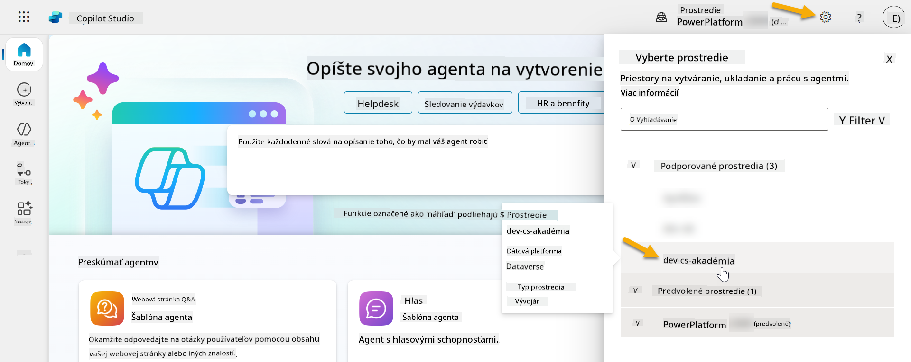

### 4.1 Vytvorenie vydavateľa riešení

1. Použitím rovnakého prostredia Copilot Studio, ktoré ste použili v predchádzajúcej lekcii, vyberte ikonu **tri bodky (. . .)** na ľavej strane menu v Copilot Studio. Vyberte **Riešenia** pod hlavičkou **Preskúmať**.

    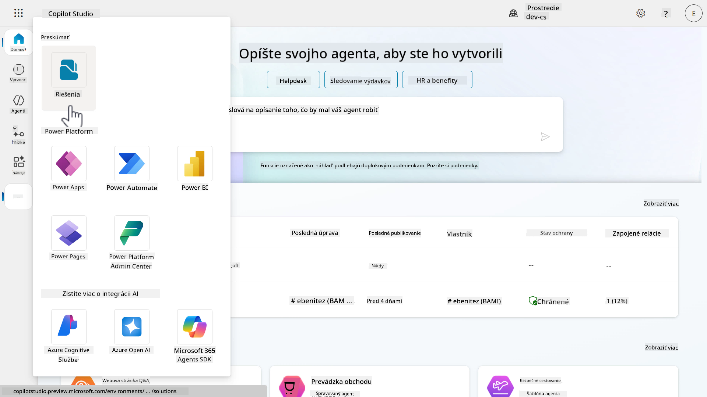

1. Načítava sa **Solution Explorer** v Copilot Studio. Vyberte **+ Nové riešenie**

    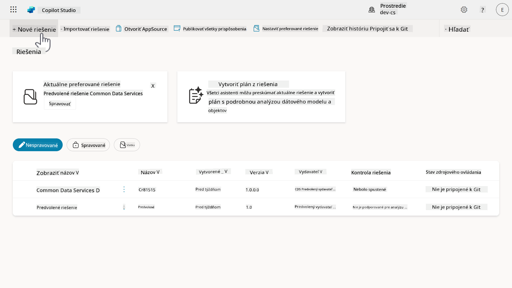

1. Zobrazí sa panel **Nové riešenie**, kde môžeme definovať detaily nášho riešenia. Najskôr musíme vytvoriť nového vydavateľa. Vyberte **+ Nový vydavateľ**.

    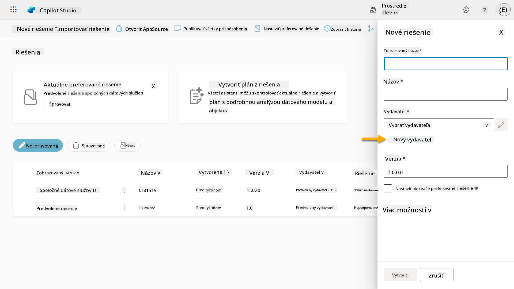  

1. Zobrazí sa karta **Vlastnosti** panelu **Nový vydavateľ** s povinnými a nepovinnými poliami, ktoré je potrebné vyplniť na karte **Vlastnosti**. Tu môžeme načrtnúť detaily vydavateľa, ktorý bude slúžiť ako značka alebo označenie, ktoré identifikuje, kto vytvoril alebo vlastní riešenie.

    | Vlastnosť    | Popis | Povinné |
    | ---------- | ---------- | :----------: |
    | Zobrazený názov | Zobrazený názov pre vydavateľa | Áno   |
    | Názov  | Jedinečný názov a schéma názvu pre vydavateľa  | Áno    |
    | Popis   | Načrtáva účel riešenia    | Nie     |
    | Predpona    | Predpona vydavateľa, ktorá sa bude aplikovať na novo vytvorené komponenty   | Áno      |
    | Predpona hodnoty výberu   | Generuje číslo na základe predpony vydavateľa. Toto číslo sa používa pri pridávaní možností do výberov a poskytuje indikátor, ktoré riešenie bolo použité na pridanie možnosti.   | Áno      |

    Skopírujte a vložte nasledujúce ako **Zobrazený názov**,

    ```text
    Contoso Solutions
    ```

    Skopírujte a vložte nasledujúce ako **Názov**,

    ```text
    ContosoSolutions
    ```

    Skopírujte a vložte nasledujúce ako **Popis**,

    ```text
    Copilot Studio Agent Academy
    ```

    Skopí
1. Panel **Nový vydavateľ** sa zatvorí a budete presmerovaní späť na panel **Nové riešenie** s vybraným novovytvoreným vydavateľom.

    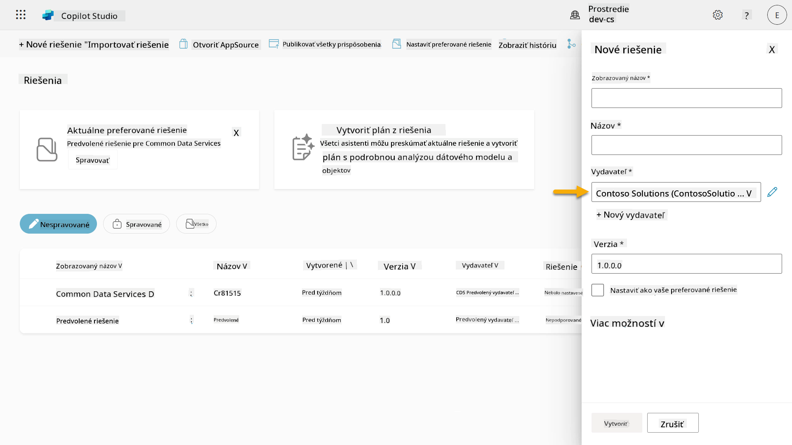  

Skvelé, práve ste vytvorili vydavateľa riešení! 🙌🏻 Teraz sa naučíme, ako vytvoriť nové vlastné riešenie.

### 4.2 Vytvorenie nového riešenia

1. Teraz, keď sme vytvorili naše riešenia, môžeme dokončiť zvyšok formulára v paneli **Nové riešenie**.

    Skopírujte a vložte nasledujúce ako **Zobrazovaný názov**,

    ```text
    Contoso Helpdesk Agent
    ```

    Skopírujte a vložte nasledujúce ako **Názov**,

    ```text
    ContosoHelpdeskAgent
    ```

    Keďže vytvárame nové riešenie, [**Číslo verzie**](https://learn.microsoft.com/power-apps/maker/data-platform/update-solutions#understanding-version-numbers-for-updates/?WT.mc_id=power-172615-ebenitez) bude predvolene `1.0.0.0`.

    Zaškrtnite políčko **Nastaviť ako preferované riešenie**.

    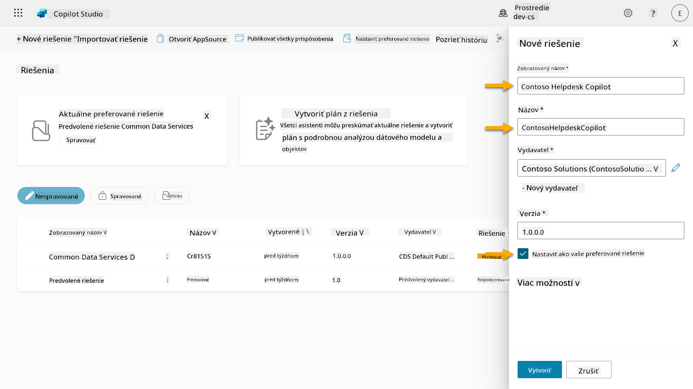  

1. Rozbaľte **Viac možností**, aby ste videli ďalšie detaily, ktoré je možné poskytnúť v riešení.

    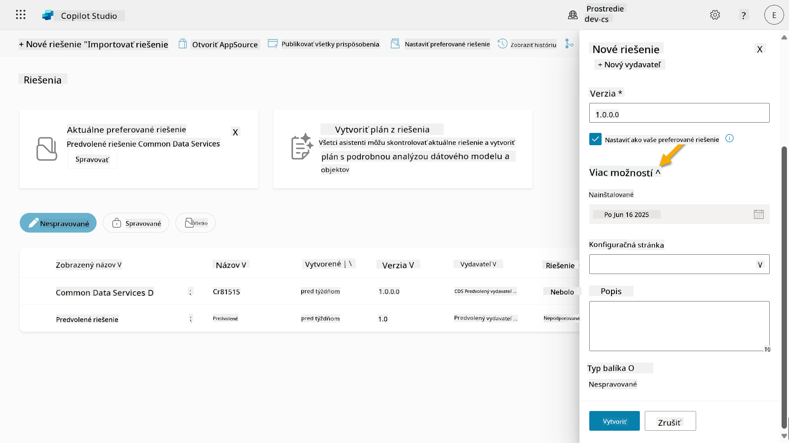

1. Uvidíte nasledujúce:

    - **Nainštalované dňa** - dátum, kedy bolo riešenie nainštalované.

    - **Konfiguračná stránka** - vývojári nastavujú HTML webový zdroj, ktorý pomáha používateľom interagovať s ich aplikáciou, agentom alebo nástrojom, kde sa zobrazí ako webová stránka v sekcii Informácie s pokynmi alebo tlačidlami. Väčšinou sa používa spoločnosťami alebo vývojármi, ktorí vytvárajú a zdieľajú riešenia s ostatnými.

    - **Popis** - popisuje riešenie alebo poskytuje všeobecný popis konfiguračnej stránky.

    Tieto polia necháme prázdne pre tento lab.

    Vyberte **Vytvoriť**.

    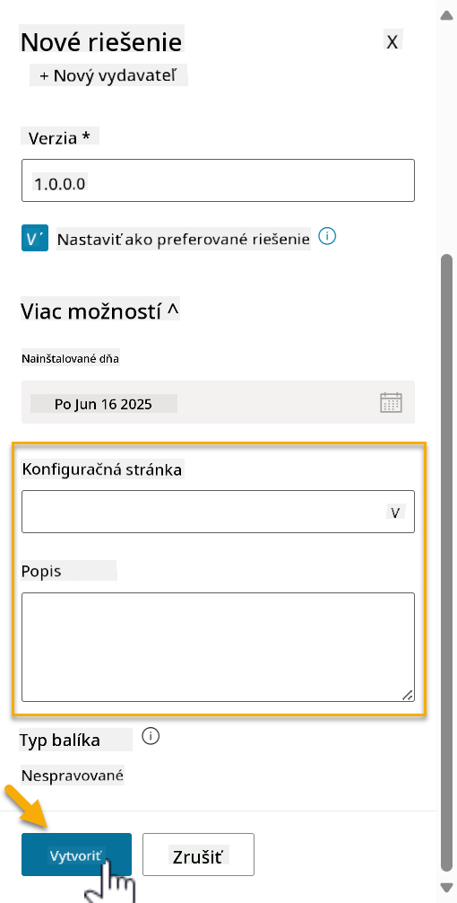

1. Riešenie pre Contoso Helpdesk Agent bolo teraz vytvorené. Nebudú v ňom žiadne komponenty, kým nevytvoríme agenta v Copilot Studio.

    Vyberte ikonu **šípka späť**, aby ste sa vrátili do Solution Explorer.

    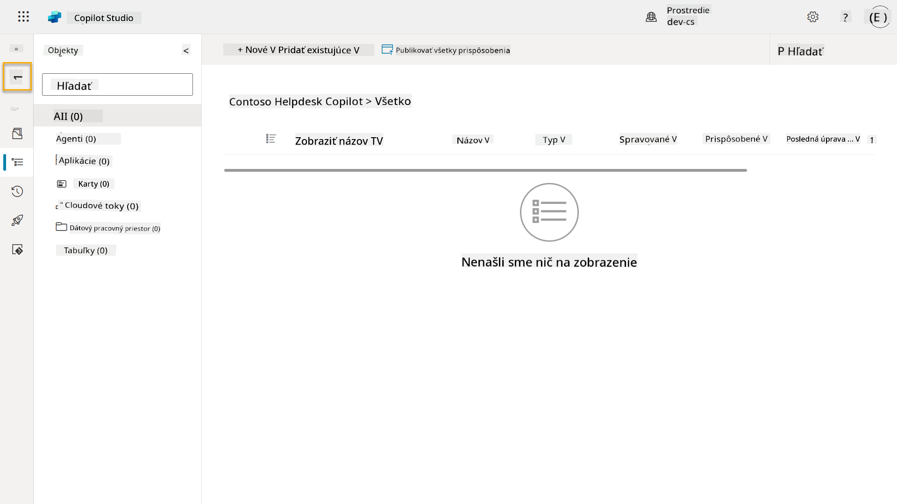

1. Všimnite si, že Contoso Helpdesk Agent sa teraz zobrazuje ako **Aktuálne preferované riešenie**, pretože sme predtým zaškrtli políčko **Nastaviť ako preferované riešenie**.

    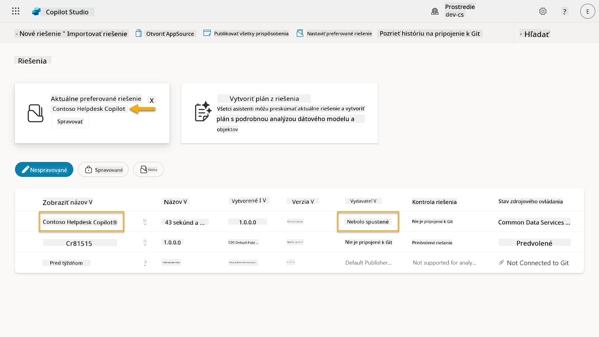

## ✅ Misia splnená

Gratulujeme! 👏🏻 Vytvorili ste vydavateľa a použili ho vo vašom novovytvorenom riešení na vytvorenie agenta!

Výborne, tvorca agentov. Usporiadaná digitálna stopa je prvým krokom k operabilite vo veľkom rozsahu. Teraz máte nástroje a myslenie pre udržateľný, podnikový vývoj agentov.

Toto je koniec **Lab 04 - Vytvorenie riešenia**, vyberte odkaz nižšie, aby ste prešli na ďalšiu lekciu. Riešenie vytvorené v tomto labu bude použité v labu nasledujúcej lekcie.

⏭️ [Prejsť na lekciu **Rýchly začiatok s predpripravenými agentmi**](../05-using-prebuilt-agents/README.md)

## 📚 Taktické zdroje

🔗 [Vytvorenie riešenia](https://learn.microsoft.com/power-apps/maker/data-platform/create-solution/?WT.mc_id=power-172615-ebenitez)

🔗 [Vytváranie a správa riešení v Copilot Studio](https://learn.microsoft.com/microsoft-copilot-studio/authoring-solutions-overview/?WT.mc_id=power-172615-ebenitez)

🔗 [Zdieľanie agentov s ostatnými používateľmi](https://learn.microsoft.com/microsoft-copilot-studio/admin-share-bots/?WT.mc_id=power-172615-ebenitez)

🔗 [Zhrnutie dostupných zdrojov pre preddefinované bezpečnostné roly](https://learn.microsoft.com/power-platform/admin/database-security#summary-of-resources-available-to-predefined-security-roles/?WT.mc_id=power-172615-ebenitez)

🔗 [Aktualizácia alebo upgrade riešenia](https://learn.microsoft.com/power-apps/maker/data-platform/update-solutions/?WT.mc_id=power-172615-ebenitez)

🔗 [Prehľad pipeline v Power Platform](https://learn.microsoft.com/power-platform/alm/pipelines/?WT.mc_id=power-172615-ebenitez)

🔗 [Prehľad integrácie Git v Power Platform](https://learn.microsoft.com/power-platform/alm/git-integration/overview/?WT.mc_id=power-172615-ebenitez)


---

**Zrieknutie sa zodpovednosti**:  
Tento dokument bol preložený pomocou služby AI prekladu [Co-op Translator](https://github.com/Azure/co-op-translator). Hoci sa snažíme o presnosť, prosím, berte na vedomie, že automatizované preklady môžu obsahovať chyby alebo nepresnosti. Pôvodný dokument v jeho rodnom jazyku by mal byť považovaný za autoritatívny zdroj. Pre kritické informácie sa odporúča profesionálny ľudský preklad. Nenesieme zodpovednosť za akékoľvek nedorozumenia alebo nesprávne interpretácie vyplývajúce z použitia tohto prekladu.