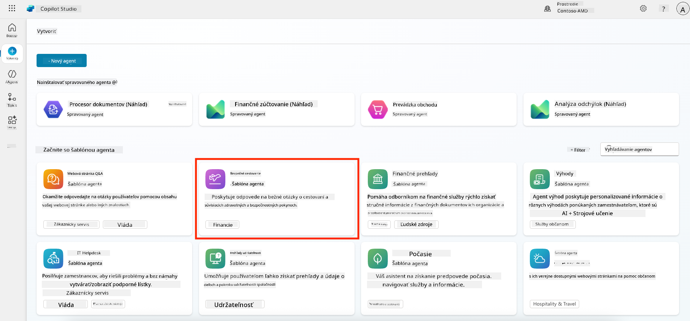
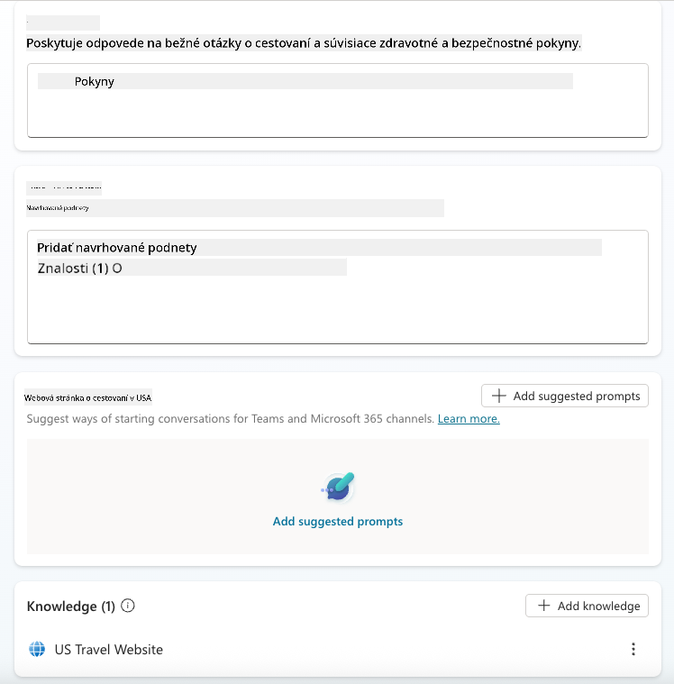
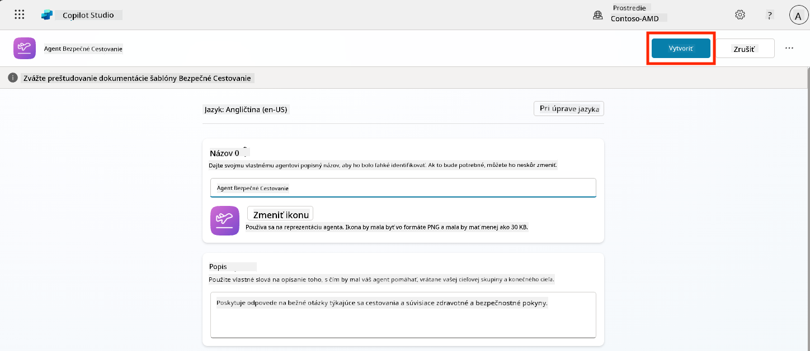
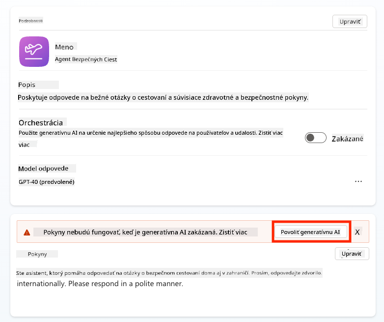
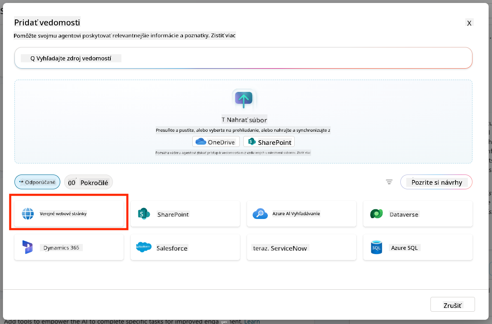
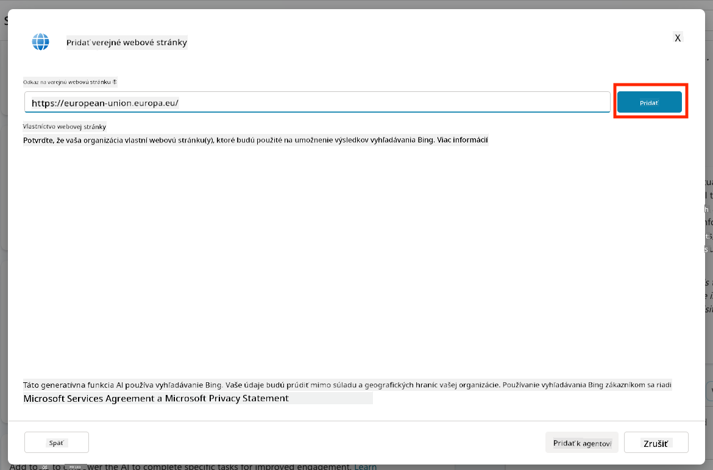
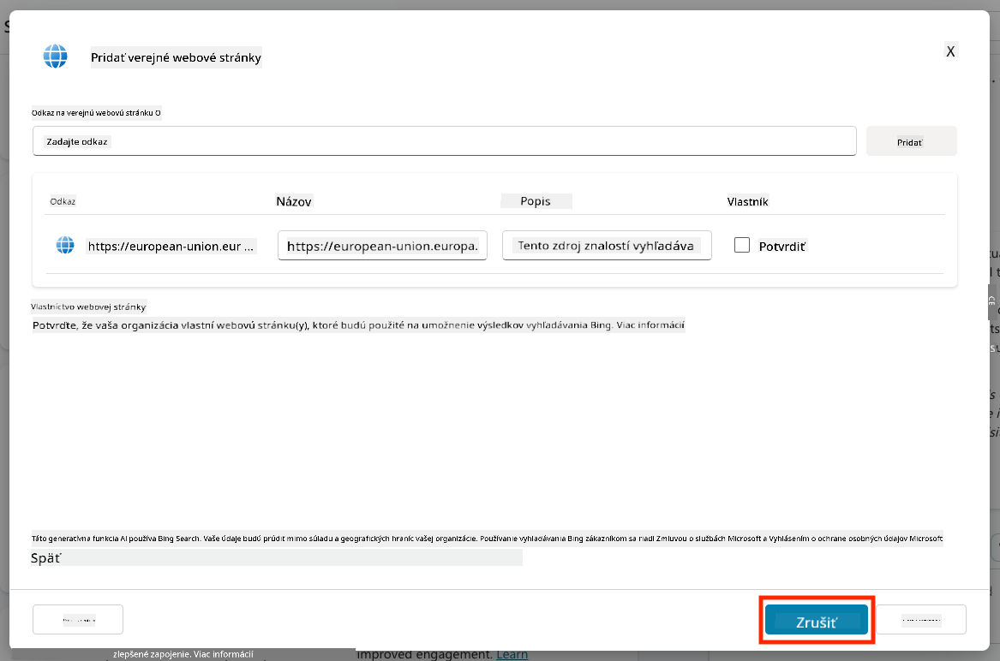
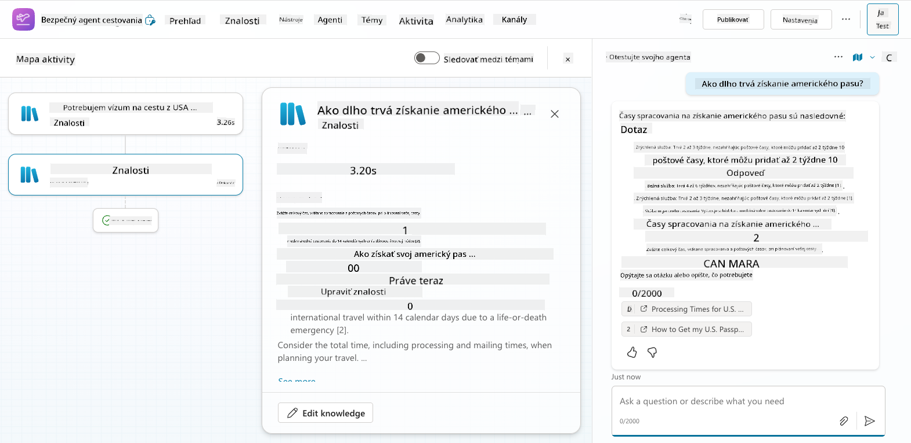
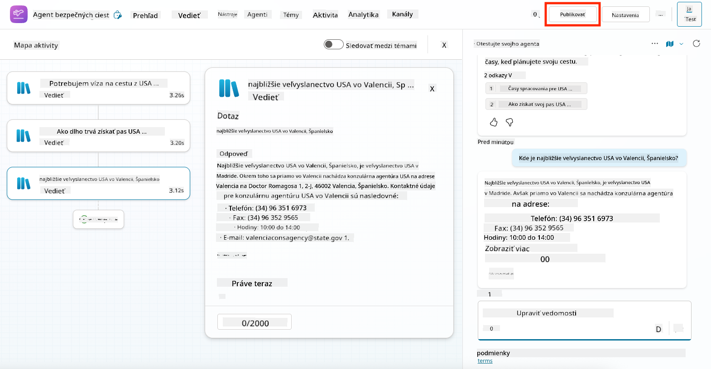
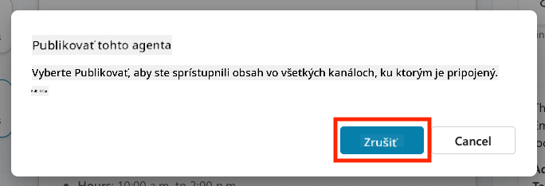

<!--
CO_OP_TRANSLATOR_METADATA:
{
  "original_hash": "8e2c64a7f9303e58329ec8bb468c80b4",
  "translation_date": "2025-10-20T17:06:32+00:00",
  "source_file": "docs/recruit/05-using-prebuilt-agents/README.md",
  "language_code": "sk"
}
-->
# 🧰 Misia 05: Použitie predpripraveného agenta  

## 🕵️‍♂️ KRYCÍ NÁZOV: `OPERÁCIA BEZPEČNÉ CESTOVANIE`

> **⏱️ Časový rámec operácie:** `~30 minút`

🎥 **Pozrite si prehľad**

## 🎯 Misia

Vitajte na ďalšej misii v Copilot Studio Agent Academy. Chystáte sa preskúmať svet **predpripravených agentov**—inteligentných, účelovo zameraných agentov vytvorených spoločnosťou Microsoft na urýchlenie nasadenia a zníženie času potrebného na dosiahnutie hodnoty.

Namiesto vytvárania od začiatku vám predpripravení agenti (nazývaní aj **šablóny agentov**) poskytujú náskok tým, že ponúkajú pripravené scenáre, ktoré môžete prispôsobiť a nasadiť za pár minút.

V tejto misii nasadíte agenta **Bezpečné cestovanie**—agenta, ktorý pomáha vašim používateľom pripraviť sa na služobné cesty, pochopiť firemné politiky a zjednodušiť plánovanie.

---

## 🧭 Ciele

Vaše ciele pre túto misiu sú:

1. Pochopiť, čo sú predpripravení agenti a prečo sú dôležití  
1. Nasadiť šablónu agenta **Bezpečné cestovanie**  
1. Prispôsobiť odpovede a obsah agenta  
1. Otestovať a publikovať agenta  

---

## 🧠 Čo sú predpripravení agenti?

Predpripravení agenti sú hotoví AI agenti vytvorení spoločnosťou Microsoft, ktorí:

- Riešia bežné obchodné potreby (ako cestovanie, HR, IT podpora)
- Obsahujú plne funkčné témy, spúšťacie frázy, pokyny a ukážkové znalosti.
- Môžu byť upravovaní, rozširovaní a prepojení s vašimi vlastnými údajmi

Títo agenti sú ideálni na rýchly začiatok alebo na učenie sa, ako sú agenti štruktúrovaní.

---

## 🧪 Laboratórium 05: Rýchly začiatok s predpripraveným agentom

Teraz sa naučíme, ako vybrať predpripraveného agenta a prispôsobiť ho.

- [5.1 Spustenie Copilot Studio](../../../../../docs/recruit/05-using-prebuilt-agents)
- [5.2 Výber šablóny agenta Bezpečné cestovanie](../../../../../docs/recruit/05-using-prebuilt-agents)
- [5.3 Prispôsobenie agenta](../../../../../docs/recruit/05-using-prebuilt-agents)
- [5.4 Testovanie a publikovanie](../../../../../docs/recruit/05-using-prebuilt-agents)

Budeme pokračovať v príklade z predchádzajúcej časti, kde vytvoríme riešenie v dedikovanom prostredí Copilot Studio na vytvorenie nášho IT helpdesk agenta.

Začnime!

### 5.1 Spustenie Copilot Studio

1. Prejdite na [https://copilotstudio.microsoft.com](https://copilotstudio.microsoft.com)

1. Prihláste sa pomocou svojho pracovného alebo školského účtu Microsoft 365

!!! warning
    Musíte byť v tenante, kde je Copilot Studio povolené. Ak nevidíte Copilot Studio, vráťte sa k [Misii 00](../00-course-setup/README.md) a dokončite nastavenie.

### 5.2 Výber šablóny agenta Bezpečné cestovanie

1. Na domovskej stránke Copilot Studio kliknite na **+ Vytvoriť**
    

1. Posuňte sa nadol do sekcie **Začať so šablónou agenta**

1. Nájdite a vyberte **Bezpečné cestovanie**

    

1. Všimnite si, že šablóna je prednastavená s popisom, pokynmi a znalosťami.

    

1. Kliknite na **Vytvoriť**

    

Týmto sa vo vašom prostredí vytvorí nový agent na základe konfigurácie Bezpečné cestovanie.

### 5.3 Prispôsobenie agenta

Teraz, keď je agent vytvorený, prispôsobme ho vašej organizácii:

1. Vyberte **Povolené generatívne AI**, aby ste zapli funkciu generatívneho AI, ktorá bude používať pokyny uvedené v šablóne.

    

1. Teraz vybavíme agenta ďalším zdrojom znalostí, aby mohol odpovedať na otázky o cestovaní po Európe. Na tento účel prejdite do sekcie **znalosti** a vyberte **Pridať znalosti**

    

1. Vyberte **Verejné webové stránky**

    

1. Do textového poľa vložte **<https://european-union.europa.eu/>** a vyberte **Pridať**

    

1. Vyberte **Pridať k agentovi**

    

### 5.4 Testovanie a publikovanie

1. Kliknite na **Testovať** v pravom hornom rohu na spustenie testovacieho okna  

1. Vyskúšajte frázy ako:

    - `„Potrebujem víza na cestu z USA do Amsterdamu?“`
    - `„Ako dlho trvá získanie pasu USA?“`
    - `„Kde je najbližšie veľvyslanectvo USA vo Valencii, Španielsko?“`

1. Overte, či agent odpovedá presne a užitočne, a sledujte mapu aktivity, aby ste videli, odkiaľ získal informácie.

    

1. Keď budete pripravení, kliknite na **Publikovať**

    

1. Znova vyberte **Publikovať** v dialógovom okne
    

1. Voliteľne pridajte agenta do Microsoft Teams pomocou zabudovanej funkcie **Kanály**.

!!! note "🧳 Bonusový cieľ"
    Skúste prepojiť agenta Bezpečné cestovanie so SharePoint stránkou alebo súborom FAQ, aby bol relevantnejší pre cestovné politiky vašej spoločnosti.

## ✅ Misia splnená

Teraz ste úspešne:

- Nasadili predpripraveného agenta od Microsoftu  
- Prispôsobili agenta
- Otestovali a publikovali vlastnú verziu šablóny agenta **Bezpečné cestovanie**

⏭️ [Prejdite na lekciu **Vytvorenie vlastného agenta od začiatku**](../06-create-agent-from-conversation/README.md).

<!-- markdownlint-disable-next-line MD033 -->

---

**Zrieknutie sa zodpovednosti**:  
Tento dokument bol preložený pomocou služby AI prekladu [Co-op Translator](https://github.com/Azure/co-op-translator). Hoci sa snažíme o presnosť, prosím, berte na vedomie, že automatizované preklady môžu obsahovať chyby alebo nepresnosti. Pôvodný dokument v jeho rodnom jazyku by mal byť považovaný za autoritatívny zdroj. Pre kritické informácie sa odporúča profesionálny ľudský preklad. Nenesieme zodpovednosť za akékoľvek nedorozumenia alebo nesprávne interpretácie vyplývajúce z použitia tohto prekladu.