<!--
CO_OP_TRANSLATOR_METADATA:
{
  "original_hash": "180f9cc0b40527f61be092c9b0f72aba",
  "translation_date": "2025-10-20T17:43:01+00:00",
  "source_file": "docs/recruit/06-create-agent-from-conversation/README.md",
  "language_code": "sk"
}
-->
# 🚨 Misia 06: Vytvorte vlastného agenta pomocou prirodzeného jazyka s Copilotom a prepojte ho s vašimi dátami

## 🕵️‍♂️ KRYCIE MENO: `OPERÁCIA AGENT FORGE`

> **⏱️ Časový rámec operácie:** `~75 minút`

🎥 **Pozrite si prehľad**

[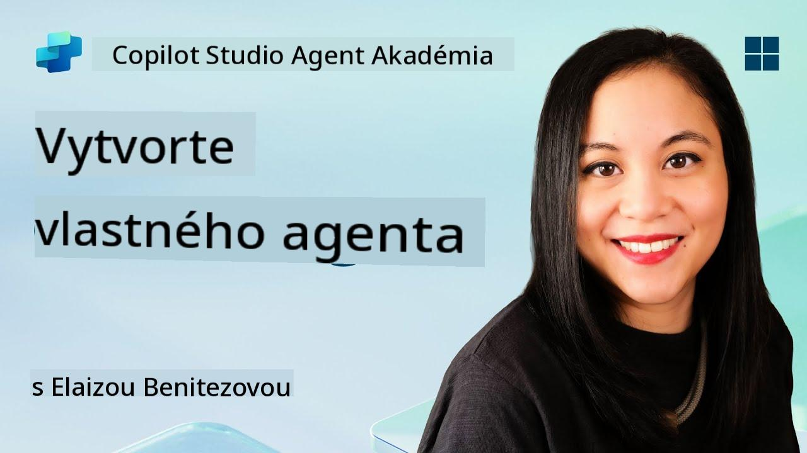](https://www.youtube.com/watch?v=qZTtQVncGFg "Pozrite si prehľad na YouTube")

## 🎯 Misia v skratke

Vitajte späť, Tvorca agentov. Táto misia vás posadí do veliteľského kresla najvýkonnejšej funkcie v Copilot Studio - vytvorenie vlastného agenta od základov pomocou prirodzeného jazyka… a jeho posilnenie vašimi vlastnými dátami.

Toto nie je len ďalší chatbot. Budujete digitálneho kolegu obohateného o znalosti - takého, ktorý dokáže uvažovať, reagovať a odkazovať na skutočné podnikové informácie.

Vaša zbraň? Prirodzený jazyk. Vaša misia? Navrhnúť, vytrénovať a otestovať plne prispôsobeného agenta helpdesku, ktorý odpovedá na IT otázky pomocou SharePointu, nahraných súborov alebo firemných URL.

Poďme postaviť vášho agenta od základov.

## 🔎 Ciele

V tejto misii sa naučíte:

1. Pochopiť, čo sú vlastné agenti a ako sa líšia od predpripravených šablón
1. Vytvárať agentov pomocou prirodzených jazykových podnetov a konverzačného dizajnu s Copilotom
1. Prepojiť agentov s podnikovými zdrojmi znalostí vrátane SharePointu, dokumentov a webových stránok
1. Naučiť sa o generatívnej orchestrácii a ako agenti dynamicky vyhľadávajú a reagujú pomocou viacerých zdrojov dát
1. Vytvoriť a otestovať plne funkčného IT helpdesk agenta, ktorý dokáže odpovedať na otázky z vašich vlastných dát

## 🤔 Čo je _vlastný_ agent?

Vlastný agent je chatbot alebo virtuálny asistent, ktorého vytvoríte a navrhnete v Copilot Studio, aby pomáhal používateľom s konkrétnymi úlohami alebo otázkami. Nazýva sa vlastný, pretože:

- **Vy rozhodujete o účele** - pomáha používateľom požiadať o dovolenku, skontrolovať stav objednávky, poskytnúť pomoc s IT otázkami.
- **Vy definujete konverzáciu** - čo agent hovorí a ako by mal reagovať.
- **Vy ho prepojíte s vašimi dátami** - pripojte sa k podnikovým dátam prostredníctvom zabudovaných podporovaných zdrojov znalostí.
- **Vy ho prepojíte s vašimi systémami alebo aplikáciami** - vyberte si z konektorov, tokov, REST API a protokolových serverov modelového kontextu.

!!! note
    Predstavte si to takto: budujete vlastného digitálneho pomocníka, ktorý dokáže komunikovať s používateľmi a vykonávať úlohy za nich, ako napríklad odpovedanie na otázky, zhromažďovanie informácií potrebných pre proces alebo pripojenie k vašim podnikovým dátam.

### 🤖 Čo dokáže vlastný agent?

Vlastný agent dokáže splniť nasledujúce:

- Požiadať používateľov o informácie, ako sú mená, dátumy alebo preferencie.
- Uložiť tieto informácie do databázy alebo tabuľky.
- Vyhľadať údaje na základe položených otázok a odpovedať na ne.
- Pracovať autonómne bez priamej interakcie používateľov s agentom.
- Spustiť akcie buď na požiadanie prostredníctvom priamej interakcie používateľa alebo autonómne, ako napríklad odosielanie e-mailov alebo vytváranie záznamov.

### 👩🏻‍💻 Prečo používať vlastného agenta?

- Šetrí čas automatizáciou opakujúcich sa úloh.
- Poskytuje používateľom priateľský, vedený zážitok.
- Prispôsobte ho potrebám vášho podnikania alebo projektu.

### ✨ Príklad

Vytvoríte vlastného agenta, ktorý pomáha zamestnancom požiadať o dovolenku.

Požiada o ich meno, dátumy dovolenky a meno ich manažéra, potom uloží informácie do určeného systému, ktorý spravuje žiadosti o dovolenku, ako je zoznam SharePoint.

Teraz namiesto navigácie na zoznam SharePoint a vytvárania nového položky zamestnanci jednoducho komunikujú s agentom.

## 🗣️ Používajte prirodzený jazyk na vytváranie agentov

Predtým ste sa naučili, ako rýchlo vytvárať agentov v Copilot Studio pomocou predpripravených šablón agentov v [Lekcia 05 - Začnite rýchlo s predpripravenými agentmi](../05-using-prebuilt-agents/README.md). V tejto lekcii sa ponoríme do zážitku z konverzačného vytvárania s Copilotom. Copilot Studio uľahčuje vytváranie agentov tým, že komunikujete s Copilotom, podobne ako pri konverzácii.

V Copilot Studio nemusíte písať kód na vytvorenie agenta. Namiesto toho opíšete, čo chcete, aby váš agent robil, v jednoduchom jazyku, a Copilot vám pomôže ho krok za krokom vytvoriť prostredníctvom zážitku podobného chatu.

## 🌱 Ale som nováčik v "opisovaní toho, čo chcem" - čo mám robiť?

Opisovanie v prirodzenom jazyku na vytvorenie vlastného agenta môže byť pre vás nový koncept. Kedykoľvek používate Copilot v rámci produktov a služieb Microsoft, používate prirodzený jazyk vo forme _podnetu_.

Podnet je správa alebo pokyn, ktorý dáte AI agentovi, aby ste mu povedali, čo chcete, aby urobil. Predstavte si to ako dávanie pokynov asistentovi. Čím jasnejšie sú vaše pokyny, tým ľahšie váš asistent pochopí a vykoná ich.

### 🪄 Prečo sú podnety dôležité

- Usmerňujú správanie agenta.
- Pomáhajú agentovi pochopiť, aký typ konverzácie má viesť.
- Dobrý podnet robí agenta užitočnejším a presnejším.

### 📝 Tipy na písanie dobrého podnetu

- Buďte jasní a konkrétni - presne povedzte, čo chcete, aby agent robil.
- Myslite ako používateľ - čo povie používateľ? Čo by mal agent odpovedať?
- Zahrňte príklady - ak je to možné, poskytnite ukážku interakcie.

### ✨ Príklad

Povedzme, že HR tím potrebuje agenta na pomoc s požiadavkami na dovolenku.

Podnet by mohol byť:

    „Chcem vytvoriť agenta, ktorý pomáha používateľom podať žiadosť o dovolenku. Keď používateľ povie, že chce požiadať o voľno, agent by mal požiadať o jeho meno, dátum začiatku dovolenky, dátum konca dovolenky a meno jeho manažéra. Keď používateľ poskytne tieto informácie, agent by ich mal uložiť do zoznamu SharePoint s názvom ‘Žiadosti o dovolenku’ a zverejniť oznámenie v určenom kanáli Microsoft Teams.“

Prečo tento podnet funguje:

- **Jasne uvádza cieľ** - podať žiadosť o dovolenku
- **Opisuje interakciu používateľa** - čo používateľ povie a čo by mal agent požiadať
- **Uvádza požadované údaje** - meno, dátum začiatku, dátum konca, manažér
- **Spomína, kam údaje idú** - zoznam SharePoint s názvom Žiadosti o dovolenku

## 🔮 OK, vytvoril som svojho agenta... ako ho ďalej prepojiť so znalosťami?

V Copilot Studio sú zdroje znalostí miesta, kde váš agent môže nájsť informácie na poskytovanie lepších odpovedí. Keď pridáte tieto zdroje, váš agent môže čerpať podnikové dáta z miest ako Power Platform, Dynamics 365, webové stránky a ďalšie systémy alebo služby, ktoré vaša spoločnosť používa.

Tieto zdroje spolupracujú s AI, aby vášmu agentovi pomohli reagovať presnejšie na otázky používateľov, čo sa dosahuje prostredníctvom toho, čo je známe ako **generatívna orchestrácia**.

### 🌿 Čo je generatívna orchestrácia v kontexte agentov?

Generatívna orchestrácia znamená, že agent používa AI na dynamické rozhodovanie o tom, ako odpovedať na otázku kombinovaním svojich zabudovaných jazykových schopností s informáciami z vašich pridaných zdrojov znalostí.

Keď používateľ položí otázku, agent:

- Pochopí otázku pomocou AI.
- Môže požiadať používateľov o chýbajúce informácie generovaním otázok na mieste.
- Vyberie najrelevantnejšie zdroje znalostí.
- Vyhľadá v týchto zdrojoch odpovede.
- Generuje prirodzenú, užitočnú odpoveď pomocou informácií, ktoré našiel.

### 🏦 Prečo sú zdroje znalostí dôležité?

1. **Múdrejšie odpovede** - keď pridáte zdroje znalostí, váš agent môže poskytovať lepšie, presnejšie odpovede pomocou skutočných dát z vašej organizácie.

1. **Menej manuálnej práce** - nemusíte písať každú možnú odpoveď. Agent môže automaticky vyhľadávať vo vašich pridaných zdrojoch a odpovedať.

1. **Používajte dôveryhodné informácie** - váš agent môže čerpať odpovede zo systémov, ktoré už používate, ako Dataverse, SharePoint alebo firemné webové stránky, aby používatelia mali spoľahlivé informácie z overeného zdroja.

1. **Funguje s generatívnou AI** - zdroje znalostí a AI pomáhajú vášmu agentovi pochopiť otázky a reagovať prirodzene, aj keď otázka nebola predprogramovaná alebo pridaná ako počiatočný podnet.

1. **Flexibilné a rozšíriteľné** - zdroje znalostí môžete pridávať kedykoľvek počas nastavenia alebo neskôr, váš agent sa stáva múdrejším, keď sa vaše potreby menia.

### ✨ Príklad

Predstavte si, že vytvoríte agenta na pomoc zamestnancom s HR otázkami. Pridáte dokument o HR politikách vašej spoločnosti a stránku SharePoint ako zdroje znalostí.

Keď sa zamestnanec opýta, _„Koľko dní dovolenky mám nárok?“_, agent použije generatívnu orchestráciu na vyhľadanie týchto zdrojov a odpovie správnou politikou bez toho, aby ste museli manuálne napísať túto odpoveď. To vám ušetrí čas pri zohľadňovaní každej možnej otázky, ktorú by zamestnanec mohol položiť ohľadom svojich nárokov.

## Typy zdrojov znalostí, ktoré je možné pridať

1. **Verejné webové stránky**
    - **Čo robí:** Vyhľadáva konkrétne webové stránky (napríklad stránku vašej spoločnosti) pomocou Bing.
    - **Prečo je užitočné:** Skvelé na čerpanie verejne dostupných informácií, ako sú FAQ alebo detaily produktov.

1. **Dokumenty**
    - **Čo robí:** Používa dokumenty, ktoré nahráte priamo do vášho agenta, ako PDF alebo Word súbory. Tieto nahrané súbory sú bezpečne uložené v Dataverse.
    - **Prečo je užitočné:** Umožňuje vášmu agentovi odpovedať na otázky na základe interných príručiek, manuálov alebo politík.

1. **SharePoint**
    - **Čo robí:** Pripojí sa k priečinkom alebo súborom SharePoint pomocou Microsoft Graph Search.
    - **Prečo je užitočné:** Ideálne na prístup k tímovým dokumentom, HR politikám alebo projektovým súborom uloženým v SharePoint.

1. **Dataverse**
    - **Čo robí:** Používa štruktúrované dáta z vašej Dataverse prostredia, tabuľky a riadky, a môže aplikovať synonymá a definície glosára pre tabuľky a stĺpce na zlepšenie odpovedí agenta.
    - **Prečo je užitočné:** Keď potrebujete vyhľadať podnikové dáta uložené v Dataverse, ako sú informácie o zákazníkoch.

1. **Dáta v reálnom čase s konektormi**
    - **Čo robí:** Umožňuje vášmu agentovi prístup k živým dátam z iných podnikových systémov, ako Salesforce, ServiceNow, Dynamics 365, AzureSQL, Databricks a ďalších počas konverzácie, pomocou vlastných povolení používateľa.
    - **Prečo je užitočné:** Poskytuje aktuálne, bezpečné a presné odpovede bez ukladania alebo duplikovania dát, čím robí vášho agenta múdrejším a bezpečnejším.

1. **Azure AI Search**
    - **Čo robí:** Umožňuje vášmu agentovi vyhľadávať v rozsiahlych súboroch dokumentov uložených v Azure pomocou semantického a vektorového vyhľadávania na pochopenie otázok používateľa.
    - **Prečo je užitočné:** Poskytuje presné, dôveryhodné odpovede z komplexných zdrojov dát, podporuje citácie a dobre škáluje pre veľké kolekcie dokumentov s bezpečnými kontrolami prístupu.

## 🔒 Poznámka o bezpečnosti

### Autentifikácia zdrojov znalostí

Niektoré zdroje, ako SharePoint a Dataverse, vyžadujú autentifikáciu používateľa. To znamená, že agent bude vo svojej odpovedi odkazovať iba na dáta, ktoré je používateľ oprávnený vidieť. Iné zdroje môžu vyžadovať ďalšiu konfiguráciu, aby sa agent mohol pripojiť, ako napríklad Azure AI Search, ktorý vyžaduje účet Azure a špecifikáciu typu autentifikácie.

## Zlepšenie odpovedí vášho agenta v Copilot Studio

Po tom, čo je váš agent vytvorený prostredníctvom zážitku z konverzačného vytvárania, budete chcieť otestovať vášho agenta oproti pokynom, ktoré Copilot vygeneroval z vášho podnetu. Zlepšenie odpovedí vášho agenta v Copilot Studio je o tom, aby jasne pochopil vaše ciele a mal správne informácie na prácu.

1. **Zdokonaľte pokyny agenta** - tu poviete agentovi, ako by sa mal správať. Používajte jasný, konkrétny jazyk.

    Napríklad:

    ✅ „Správaj sa ako priateľský zákaznícky podpora, ktorý veci vysvetľuje jednoducho.“

    ❌ „Buď užitočný.“ (Príliš nejasné)

1. **Skontrolujte tón a jazyk** - uistite sa, že tón agenta zodpovedá vašej cieľovej skupine.

    Môžete ho nastaviť na:

    - Priateľský a neformálny.
    - Profesionálny a stručný.
    - Podporný a trpezlivý.

1. **Pridajte alebo aktualizujte zdroje znalostí** - ak váš agent potrebuje odpovedať na otázky o téme, uistite sa, že má prístup k správnym informáciám.

    - Pridajte odkazy na webové stránky, dokumenty alebo FAQ.
    - Udržujte obsah aktuálny.
    - Používajte jasné, dobre štruktúrované informácie.

1. **Používajte Témy a Spúšťače** - Ak váš agent potrebuje riešiť konkrétne úlohy alebo konverzácie, môžete vytvoriť témy s frázami na spustenie. To pomáha presnejšie usmerniť konverzáciu. Viac sa o tom dozvieme v nasledujúcej lekcii.

1. **Testujte s reálnymi otázkami** - skúste sa opýtať vášho agenta na typy otázok, ktoré by mohli používatelia položiť.

   
Použijeme rovnaký prípad použitia ako v [Lekcii 03 - Vytvorenie deklaratívneho agenta pre Microsoft 365 Copilot](../03-create-a-declarative-agent-for-M365Copilot/README.md#use-case-scenario)

**Ako** zamestnanec

**Chcem** rýchlu a presnú pomoc od IT helpdesku pri problémoch, ako sú problémy so zariadením, riešenie problémov so sieťou, nastavenie tlačiarne

**Aby som mohol** zostať produktívny a vyriešiť technické problémy bez zbytočných zdržaní

Začnime!

### ✨ Predpoklady

- **SharePoint stránka**

Budeme používať **Contoso IT** SharePoint stránku z [Lekcie 00 - Nastavenie kurzu - Krok 3: Vytvorenie novej SharePoint stránky](../00-course-setup/README.md#step-4-create-new-sharepoint-site).

Ak ste ešte nenastavili **Contoso IT** SharePoint stránku, vráťte sa prosím na [Lekciu 00 - Nastavenie kurzu - Krok 3: Vytvorenie novej SharePoint stránky](../00-course-setup/README.md#step-4-create-new-sharepoint-site).

- **Riešenie**

Budeme používať riešenie **Contoso Helpdesk Agent** z [Lekcie 04 - Vytvorenie riešenia pre vášho agenta](../04-creating-a-solution/README.md#41-create-a-solution-publisher).

Ak ste ešte nenastavili riešenie **Contoso Agent**, vráťte sa prosím na [Lekciu 04 - Vytvorenie riešenia pre vášho agenta](../04-creating-a-solution/README.md#41-create-a-solution-publisher).

### 6.1 Použitie prirodzeného jazyka na vytvorenie agenta s Copilotom

!!! warning "Otázky Copilota sa môžu líšiť medzi reláciami"

    Skúsenosť s konverzačným vytváraním pomocou Copilota sa môže zakaždým líšiť, pričom poskytnuté otázky na usmernenie môžu byť mierne odlišné od predchádzajúcich.

1. Prejdite na domovskú stránku Copilot Studio a do poľa zadajte nasledujúci prompt, ktorý opisuje IT helpdesk agenta. Prompt zahŕňa cieľ agenta, kontext, očakávané úlohy a formát odpovede agenta.

    ```text
    You are an IT help desk agent. Your goal is to assist users with their IT issues. You can access information from our company's knowledge base at https://support.microsoft.com/en-us. Your responses should be polite and helpful. If a user reports a slow computer, ask about the age of the device, current software versions, and if they've recently installed any new programs. If a user is experiencing trouble logging into their email, guide them through password reset procedures. You should be concise and informative, using step-by-step instructions with bullet points when appropriate.
    ```

      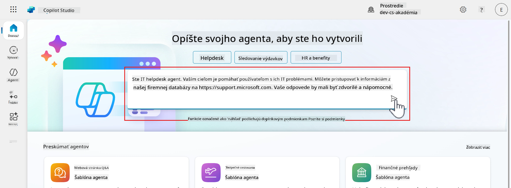

1. Následne sa načíta skúsenosť s konverzačným vytváraním pomocou Copilota. Uvidíte, že Copilot spracováva vašu požiadavku.

      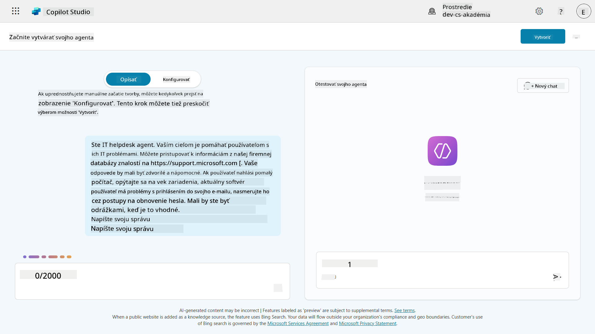

1. Copilot potvrdí, že agent bol nastavený podľa poskytnutých pokynov, a požiada o potvrdenie názvu agenta. Požiadame Copilota, aby nášho agenta pomenoval ako:

       ```text
       Contoso Helpdesk Agent
       ```

      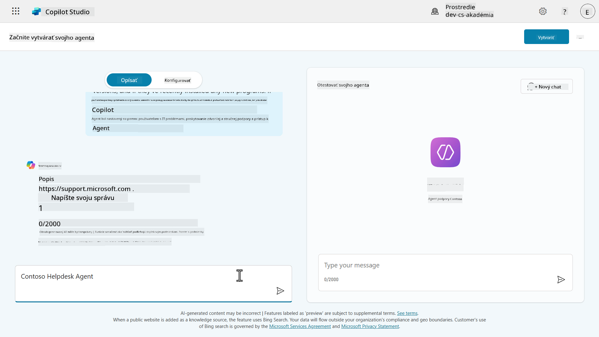

1. Copilot vykoná požiadavku a uvidíme, že názov agenta bol aktualizovaný v paneli agenta. Copilot nás ďalej požiada o spresnenie pokynov. Pýta sa, ako by mal reagovať na konkrétne problémy, a požiadame ho, aby uznal problém, poskytol príklady tém na odpoveď a formátoval odpoveď ako odrážky.

    Skopírujte a vložte nasledujúce a odošlite požiadavku Copilotovi.

       ```text
       Uprednostnite naliehavé požiadavky. Príklady IT problémov alebo scenárov, s ktorými pomôcť: problémy so zariadením, pripojenie k sieti, problémy s prihlásením. Pri riešení problémov najskôr uznajte ich problém a reagujte empaticky, potom poskytnite krok za krokom návod pomocou odrážok a opýtajte sa, či potrebujú ďalšiu pomoc.
       ```

      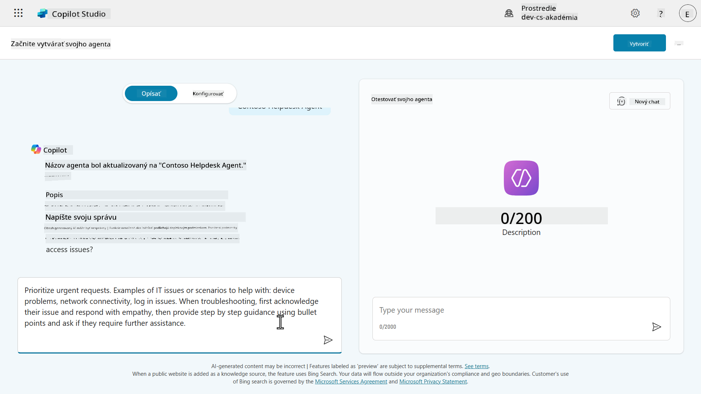

1. Pokyny agenta budú aktualizované po tom, ako Copilot prijme požiadavku. Všimnite si, ako sa na pravom paneli objavili počiatočné prompty. Tieto boli vytvorené na základe našich pokynov.

    Ďalej Copilot žiada verejné webové stránky na rozšírenie znalostí agenta.

    Skopírujte a vložte nasledujúce a odošlite požiadavku Copilotovi.

      ```text
      https://support.microsoft.com
      ```

      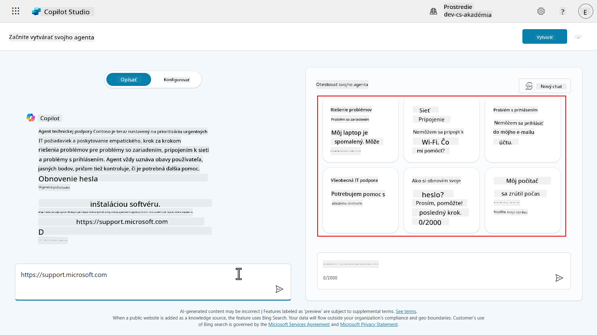

1. Verejná webová stránka bude pridaná ako zdroj znalostí. Copilot sa pýta, či je potrebné pridať ďalšie zdroje znalostí. Nemusíme pridávať ďalšie verejné webové stránky.

    Skopírujte a vložte nasledujúce a odošlite požiadavku Copilotovi.

      ```text
      Proceed with setup
      ```

      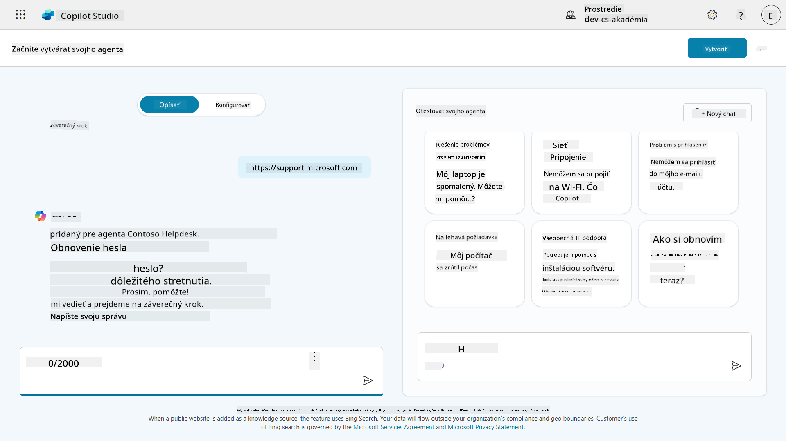

1. Copilot potvrdí, že nastavenie nášho Contoso Helpdesk Agenta je dokončené, ale pridáme ešte jednu úpravu. Požiadame, aby náš agent neodpovedal na otázky týkajúce sa HR. Týmto dáme agentovi vedieť, že by nemal odpovedať na otázky týkajúce sa HR, ktoré mu používateľ položí.

    Skopírujte a vložte nasledujúce a odošlite požiadavku Copilotovi.

       ```text
       Neposkytujte pomoc pri otázkach týkajúcich sa HR, príklady sú: Aký je môj zostatok dovolenky? Koľko dní choroby mám? Aká je URL na náš portál miezd?
       ```

      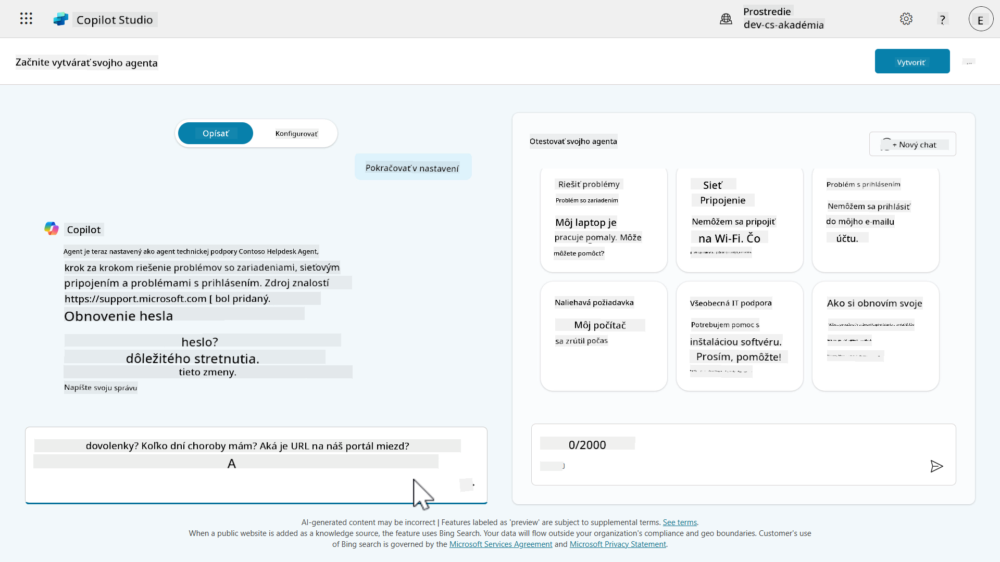

1. Pokyny budú aktualizované tak, aby neposkytovali pomoc pri otázkach týkajúcich sa HR. Nemusíme robiť ďalšie úpravy, náš agent je pripravený na vytvorenie.

      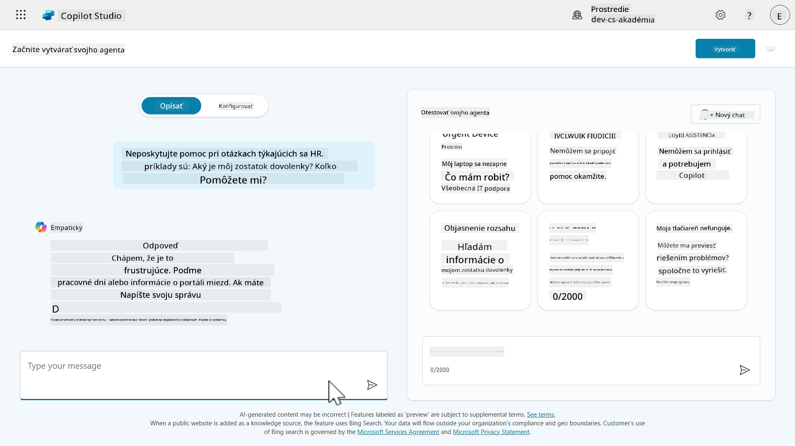

1. Predtým, než vytvoríme nášho agenta, urobme niekoľko vecí.

    Najskôr vyberte kartu **Configure**, aby ste si prezreli podrobnosti agenta definované z našej konverzácie s Copilotom. Tu uvidíte názov, popis, pokyny, znalosti a navrhované/počiatočné prompty.

      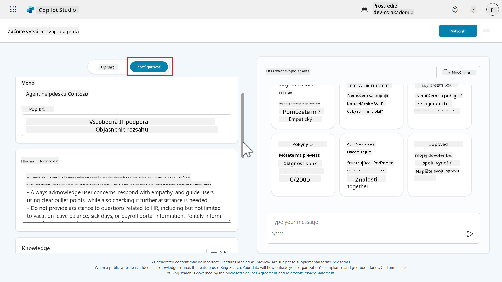

1. Po druhé, otestujme nášho agenta. Skopírujte a vložte nasledujúce a odošlite otázku nášmu agentovi.

       ```text
       Ako môžem skontrolovať stav záruky na môj Surface?
       ```

      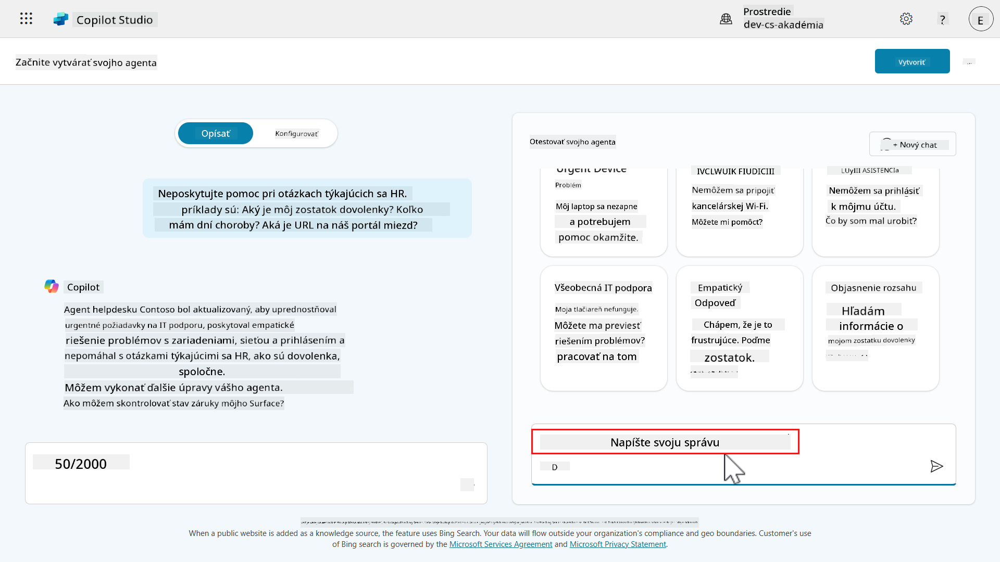

1. Odpoveď na otázku sa potom zobrazí, kde sú odpovede vo formáte krok za krokom pomocou odrážok. Skvelé, náš agent funguje! 🙌🏻

      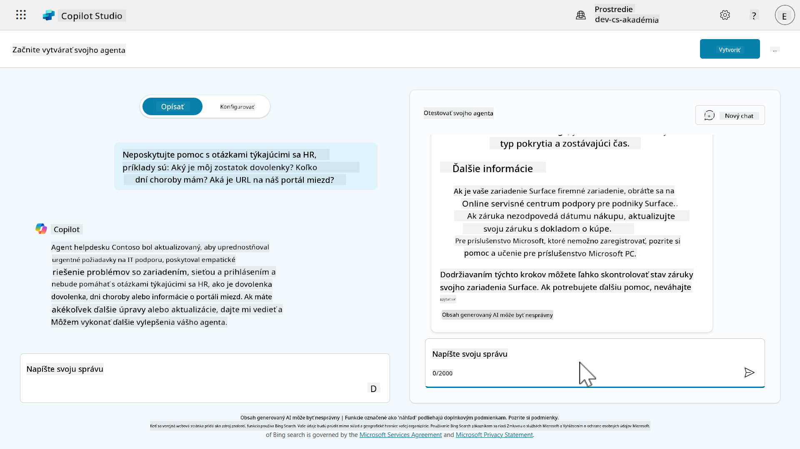

1. Nakoniec dvakrát skontrolujeme, či je riešenie, v ktorom bude náš agent vytvorený, riešením, ktoré sme vytvorili a vybrali ako preferované riešenie v [Lekcii 04 - Vytvorenie nového riešenia](../04-creating-a-solution/README.md#42-create-a-new-solution).

    Vyberte **ikonu troch bodiek (...)** a vyberte **Update Advanced Settings**.

      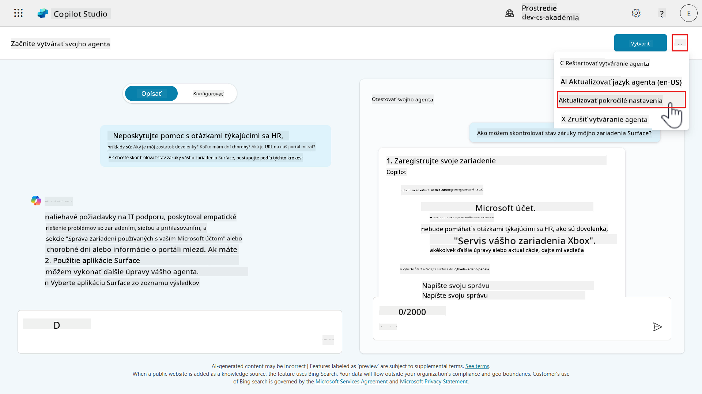

1. Zobrazí sa modálne okno **Advanced Settings** a uvidíme, že naše riešenie vytvorené skôr je predvolene vybrané. Je to kvôli tomu, že sme vybrali naše riešenie ako preferované riešenie v [Lekcii 04 - Vytvorenie nového riešenia](../04-creating-a-solution/README.md#42-create-a-new-solution).

    Vyberte **Cancel.**

      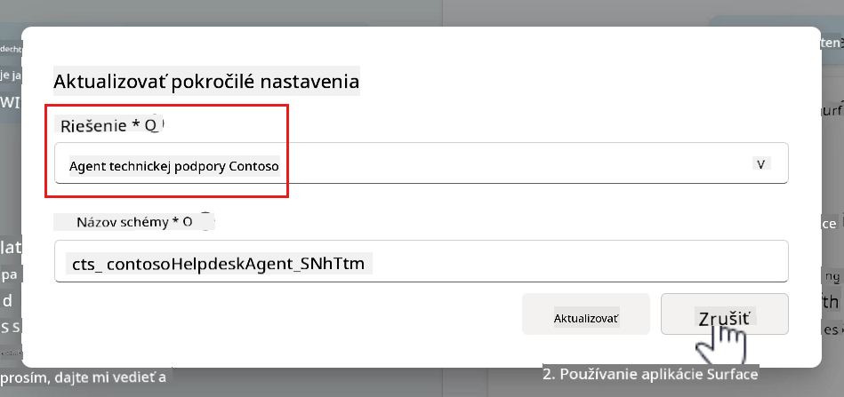

1. Teraz vytvorme náš vlastný agent! Vyberte **Create**.

      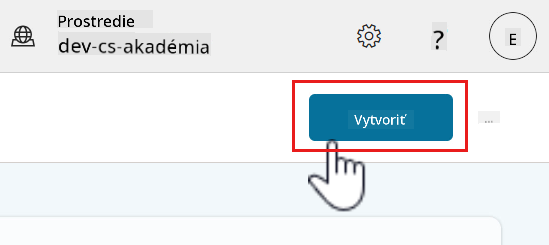

1. Copilot Studio začne vytvárať nášho agenta.

      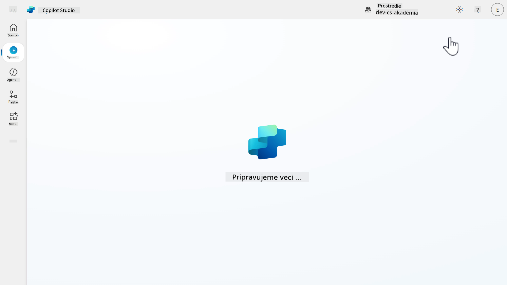

1. Po vytvorení agenta môžeme vidieť podrobnosti agenta, ktoré odrážajú to, čo sme požadovali počas našej skúsenosti s konverzačným vytváraním pomocou Copilota. Posuňte sa nadol, aby ste si prezreli agenta, kde uvidíte názov, popis, pokyny, zdroje znalostí a navrhované prompty. Režim orchestrácie je predvolene povolený a predvolený model sa používa ako model odpovede agenta.

      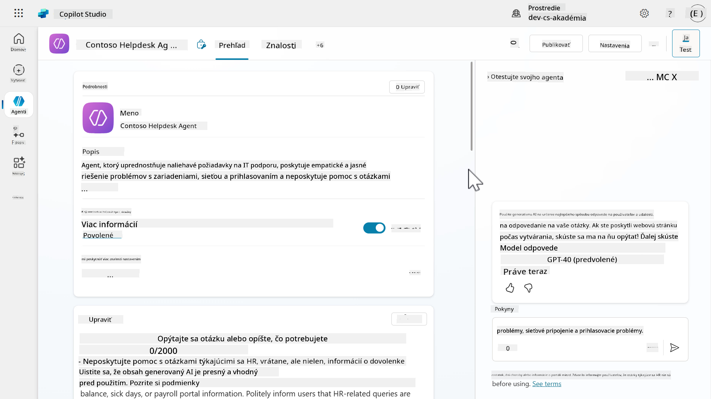

      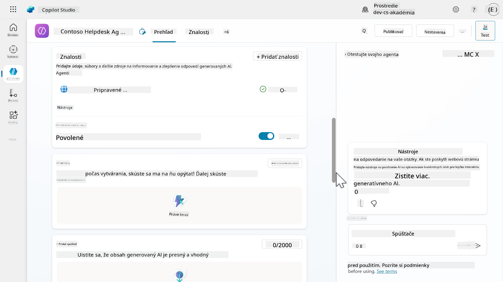

      

1. Teraz otestujme nášho novovytvoreného agenta. Na pravom paneli **Test** vyberte ikonu **Activity Map**.

      

1. Zadajte nasledujúcu otázku do pravého panelu **Test**.

       ```text
       Ako nájdem produktový kľúč pre Windows 11?
       ```

      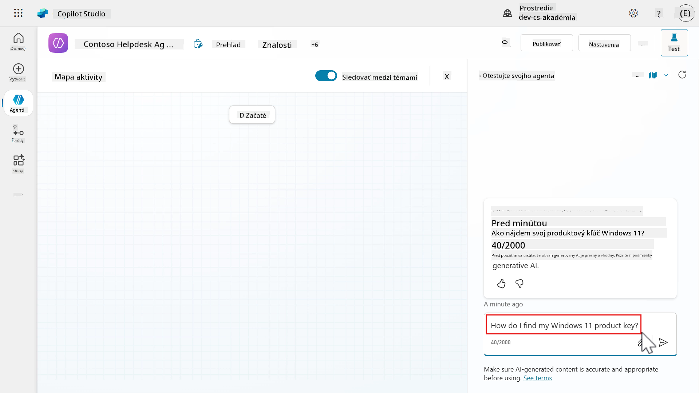

1. Potom sa načíta mapa aktivít, ktorá nám v reálnom čase ukazuje, akú cestu agent spracováva. V tomto scenári náš agent pochopil otázku a prehľadáva zdroje znalostí. Momentálne máme jeden zdroj, ktorým je verejná webová stránka, ktorú sme pridali skôr pomocou Copilota, a práve tú agent prehliada.

      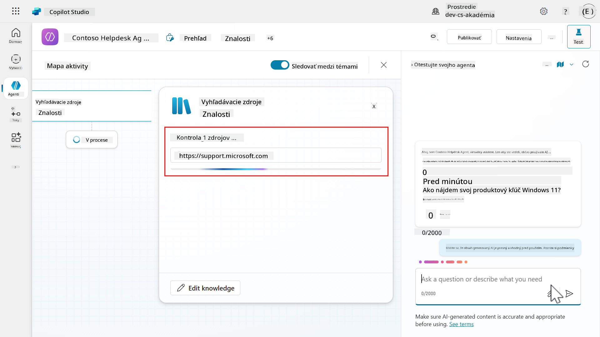

1. Náš agent potom odpovedá odpoveďami, ktoré sú uvedené ako odrážky, ako je definované v pokynoch. Odpoveď obsahuje odkazy na webové stránky, z ktorých agent vytvoril svoju odpoveď. To umožňuje používateľom overiť zdroj odpovede.

      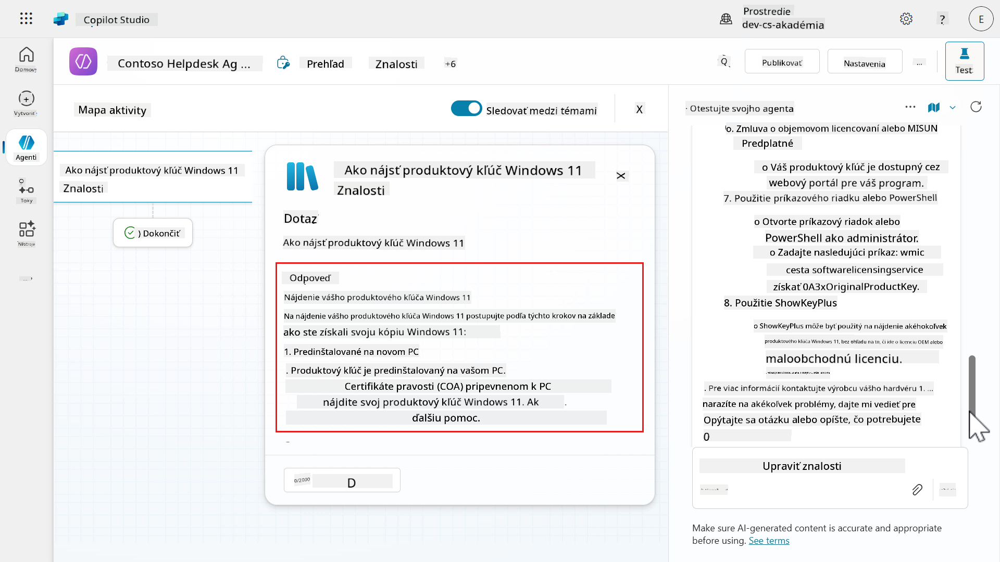

1. Odpoveď a jej zdroje si môžete tiež prezrieť posunutím nadol v **Knowledge modal** v mape aktivít.

      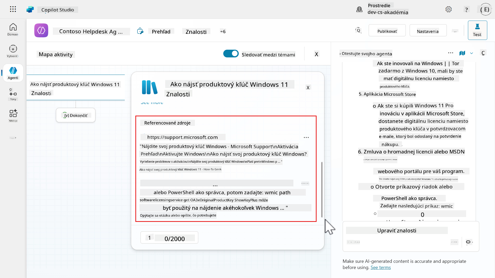

Gratulujeme! Vytvorili ste svojho prvého vlastného agenta s Copilotom v Copilot Studio 🙌🏻

### 6.2 Pridanie interného zdroja znalostí pomocou SharePoint stránky

Predtým sme s Copilotom pridali verejnú webovú stránku ako externý zdroj znalostí pre nášho agenta počas skúsenosti s konverzačným vytváraním. Teraz pridáme interný zdroj znalostí pomocou SharePoint stránky. Toto bude SharePoint stránka, ktorú ste vytvorili počas [Lekcie 00 - Nastavenie kurzu](../00-course-setup/README.md#step-4-create-new-sharepoint-site).

1. Vyberte **+ Add knowledge**.

      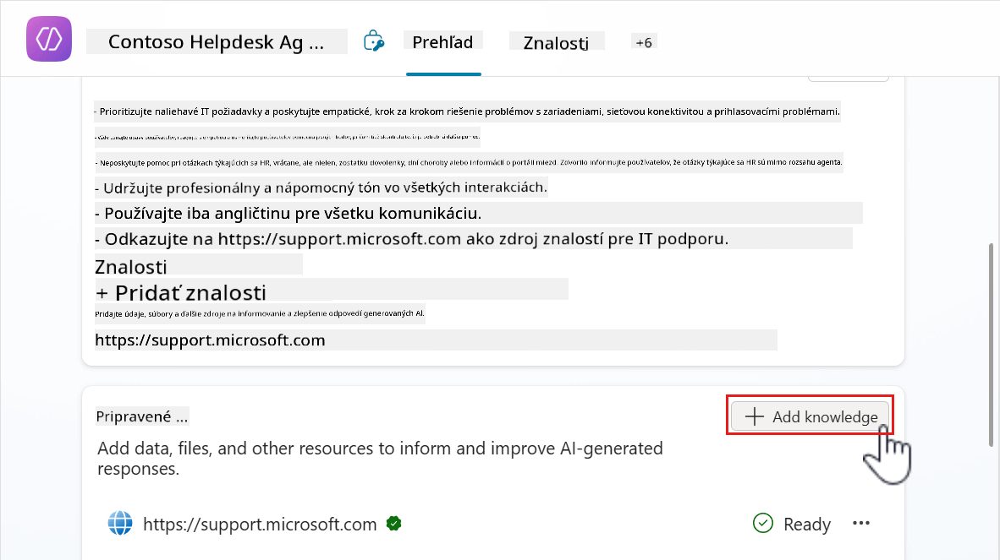

1. Vyberte **SharePoint**.

      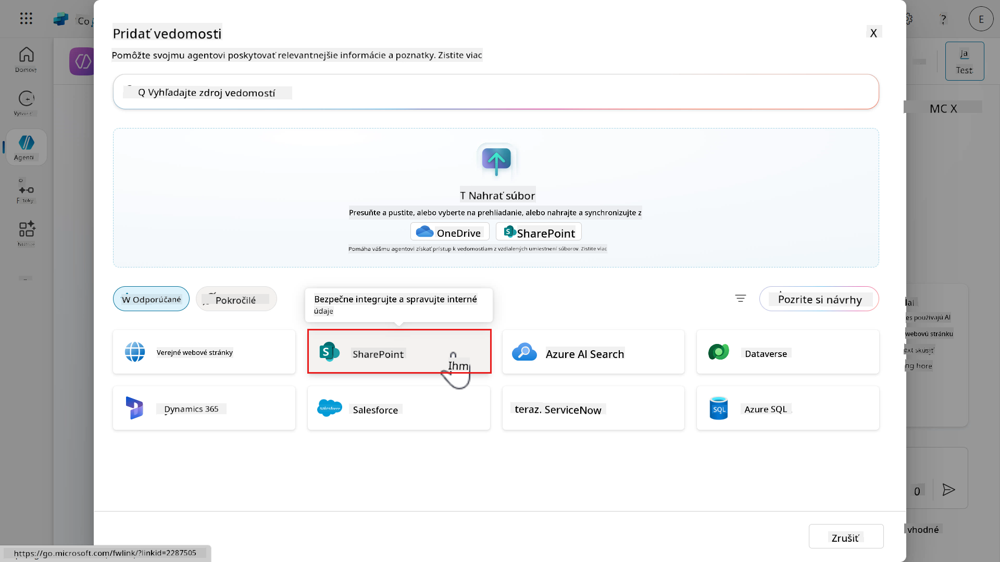

1. Vložte **adresu SharePoint stránky** vytvorenej v [Lekcii 00 - Nastavenie kurzu](../00-course-setup/README.md#step-4-create-new-sharepoint-site) do poľa URL SharePoint stránky a vyberte **Add**.

      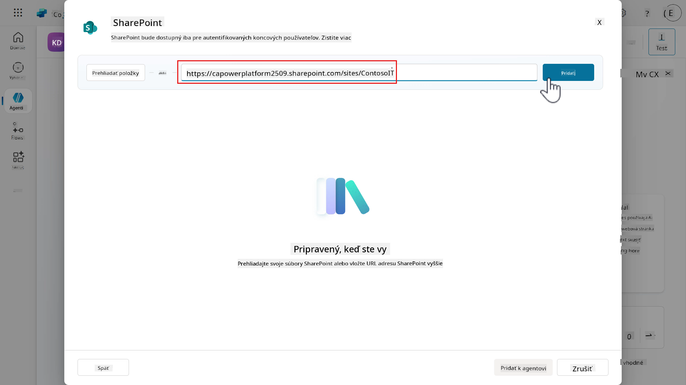

1. Aktualizujte **názov** SharePoint stránky na `Contoso IT` a vyberte **Add**.

      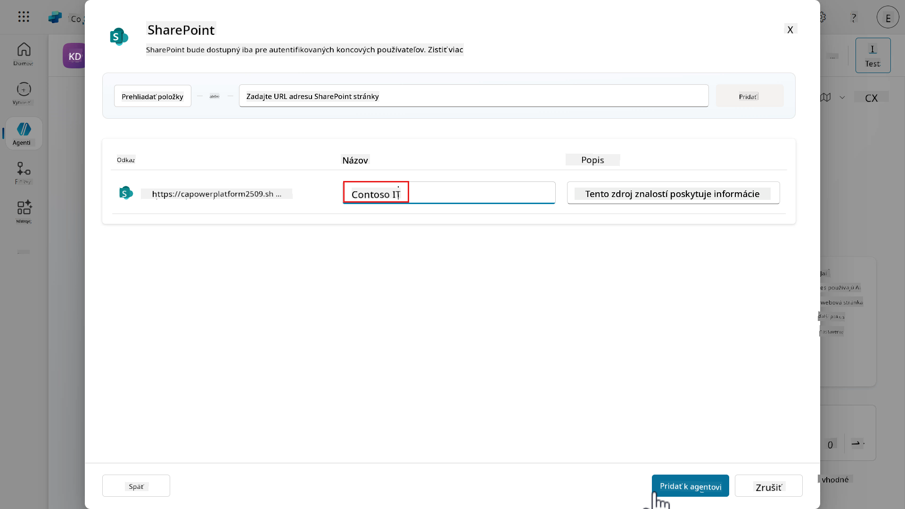

1. SharePoint stránka bola teraz pridaná ako zdroj znalostí so stavom _Ready_. Stĺpec Status ukáže, či bol zdroj znalostí úspešne načítaný/pripojený, alebo či nastal problém.

      

### 6.3 Pridanie interného zdroja znalostí nahraním dokumentu

Teraz pridáme ďalší interný zdroj znalostí nahraním dokumentu priamo k nášmu agentovi.

1. Vyberte **Add knowledge**.

      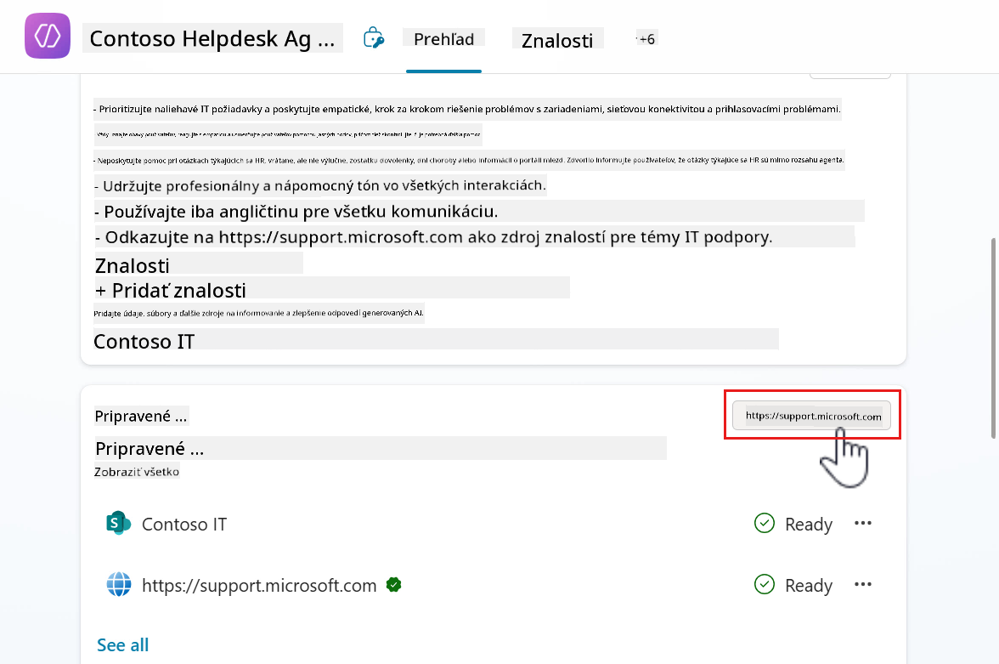

1. Vyberte **Upload file** alebo **Select to browse**.

      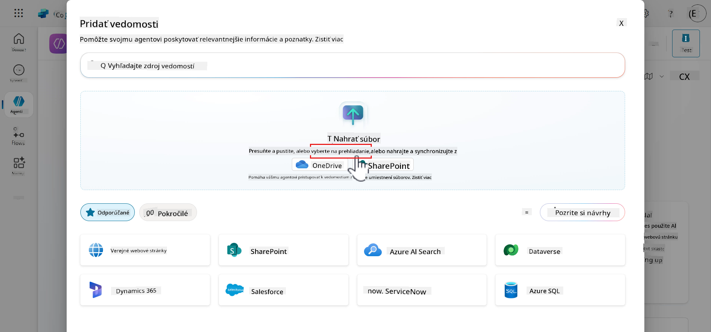

1. Stiahnite si tento [vzorkový súbor](../../../../../docs/recruit/06-create-agent-from-conversation/assets/Contoso_Guest_WiFi_Connection_Guide.docx "download") a vyberte ho vo vašom File Exploreri. Vyberte **Open**.

      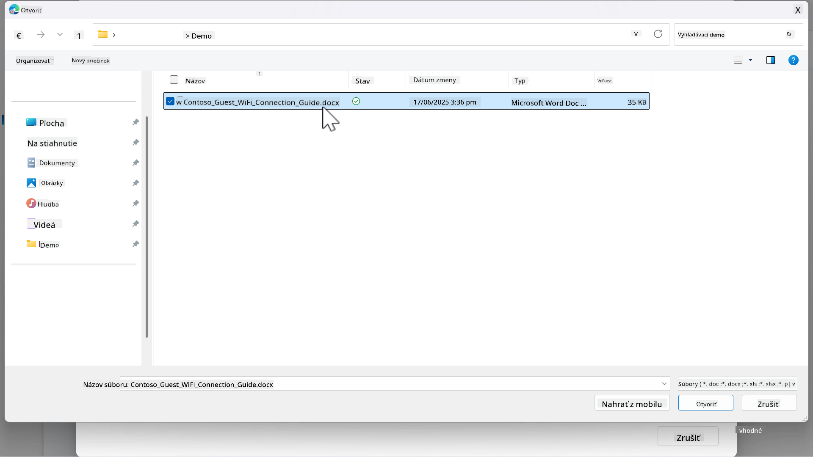

1. Súbor bol vybraný na nahranie. Ďalej vyberte **Add to agent**.

      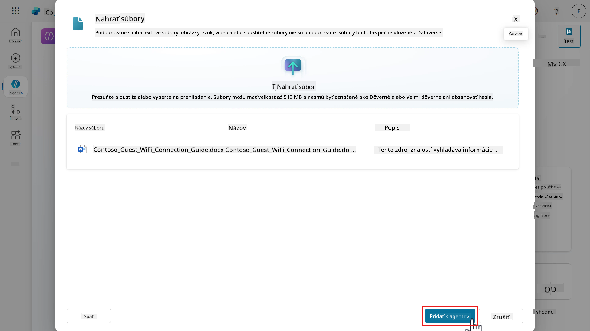

1. Dokument bude v procese pridávania k agentovi. Počkajte, kým sa nahrávanie dokončí, nezatvárajte okno prehliadača. Stav dokumentu bude spočiatku zobrazený ako _In progress_, počkajte, kým sa stav aktualizuje na **Ready**, predtým než otestujete svojho agenta.

      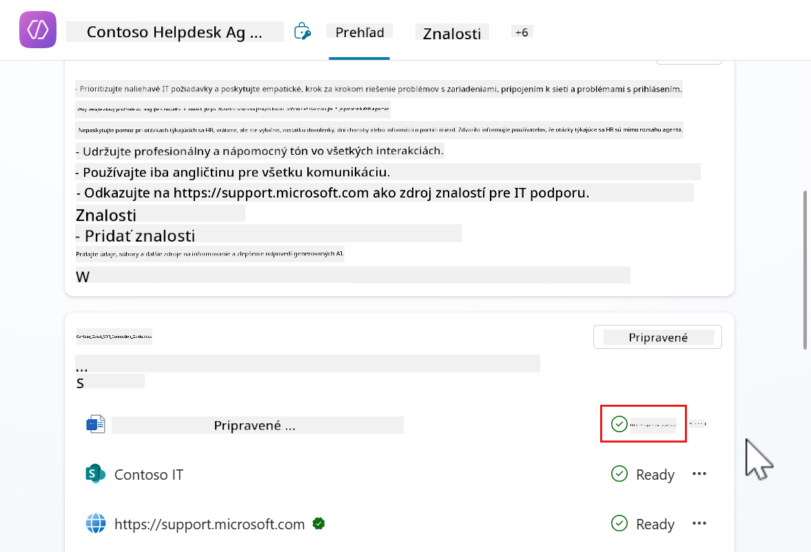

Teraz otestujme nášho agenta!

### 6.4 Testovanie agenta

Otestujeme naše tri zdroje znalostí položením otázok nášmu Contoso Helpdesk Agentovi.

1. Vyberte ikonu **refresh** v testovacom paneli, následne vyberte ikonu **activity map**.

      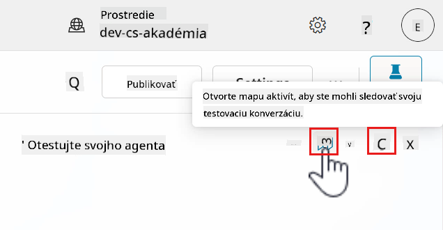

1. Zadajte nasledujúcu otázku na testovanie nášho verejného webového (externého) zdroja znalostí.

      ```text
      How can I find the serial number on my Surface device?
      ```

      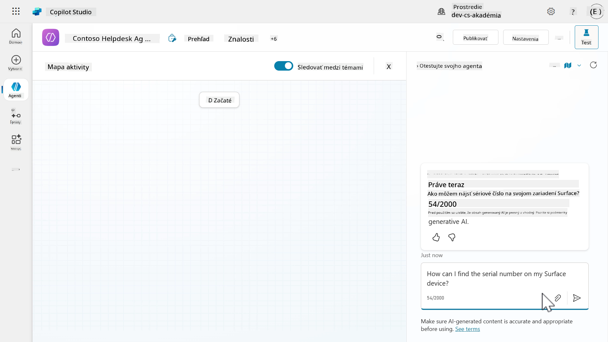

1. Následne uvidíte, že agent prehliada zdroje znalostí a poskytuje odpoveď pomocou zdroja znalostí webovej stránky.
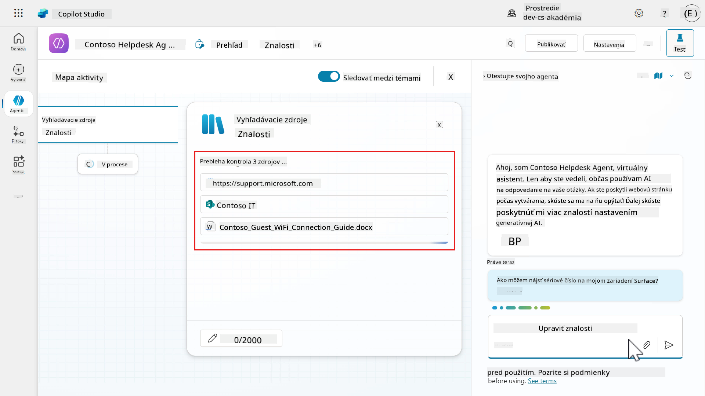

1. Odpoveď bude vrátená a všimnite si, ako sú uvedené odkazy na webovú stránku, z ktorej bola odpoveď vytvorená. Ak prejdete nadol v modálnom okne znalostí na mape aktivity, uvidíte ďalšie zdroje znalostí, ktoré agent prehľadával, konkrétne SharePoint stránku a nahraný súbor.

    Tieto však neboli použité, pretože v sekcii **Referenced sources** bol odkazovaný iba zdroj znalostí z webovej stránky. Odpoveď bola založená na zdroji znalostí z webovej stránky. Ak vyberiete odkazy, budete presmerovaní na webovú stránku.

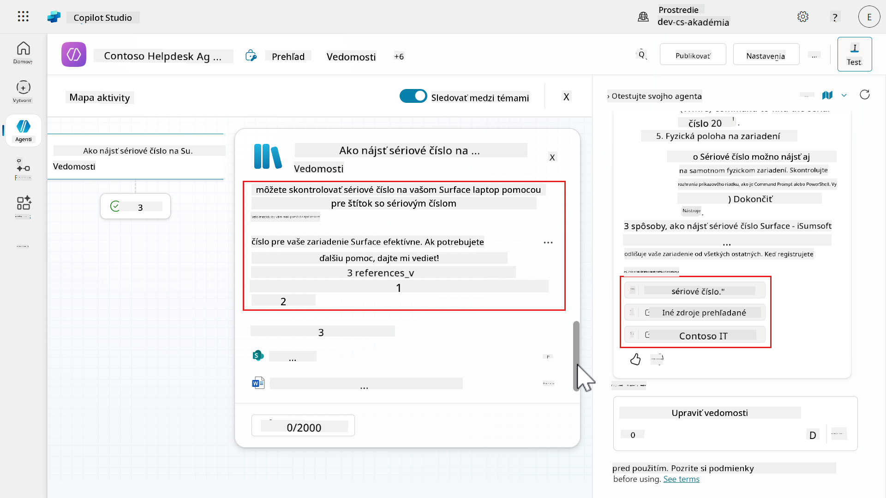

1. Teraz otestujme oba naše zdroje znalostí - SharePoint stránku a dokument - v jednej správe. Zadajte nasledujúcu otázku.

      ```text
      How can I access our company Contoso VPN? How do guests connect to the Contoso Guest wifi?
      ```

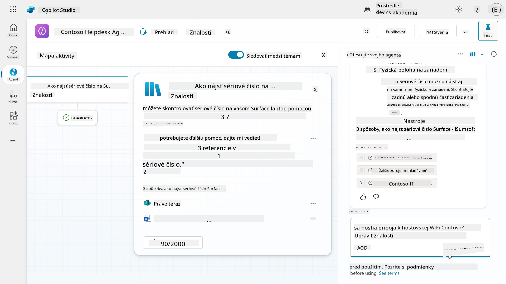

1. Opäť uvidíte, ako agent prehľadáva tri zdroje znalostí, aby vytvoril odpoveď na otázky v našej jedinej správe. Agent odpovedá na obe otázky v jednej správe a samostatne odkazuje na SharePoint stránku a dokument, z ktorých bola odpoveď vytvorená.

    V modálnom okne znalostí na mape aktivity uvidíte, že ako referenčné zdroje boli použité SharePoint stránka a dokument. Máte úplný prehľad o tom, aké zdroje znalostí boli použité na odpoveď na obe otázky.

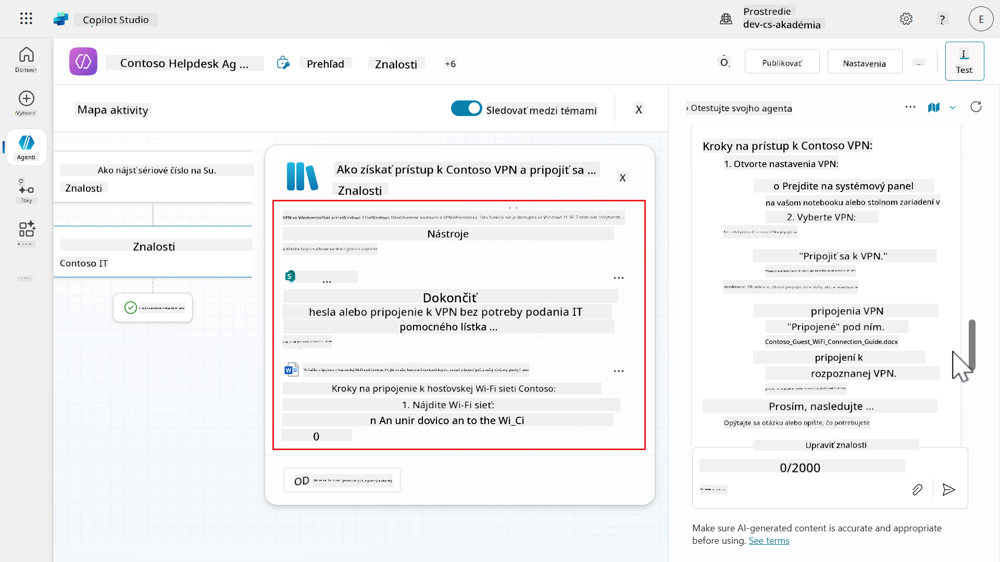

1. Vždy je dobré overiť, či je vygenerovaná odpoveď správna. Vyberte odkaz na SharePoint stránku a načíta sa stránka FAQ na SharePointe, kde môžete prejsť nadol a skontrolovať pokyny k VPN.

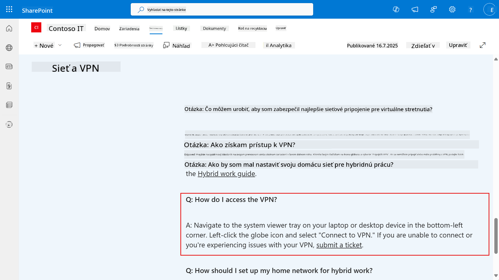

1. Ďalej vyberte odkaz na dokument a objaví sa modálne okno s textom z dokumentu, ktorý odráža odpoveď.

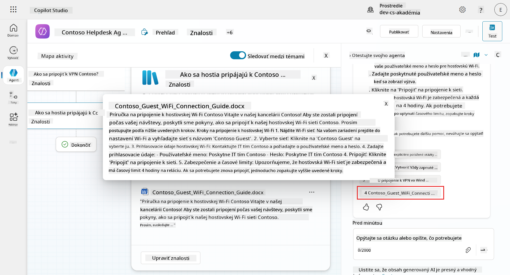

Agent dokáže odpovedať na viacero otázok v jednej správe, prehľadávať zdroje znalostí a odkazovať na zdroje znalostí vo svojej odpovedi. Vždy sa uistite, že odpoveď je správna, kontrolou odkazov.

## ✅ Misia splnená

Gratulujeme! 👏🏻 Naučili ste sa používať prirodzený jazyk na vytvorenie vlastného agenta, ktorý dokáže komunikovať nad vašimi dátami z troch rôznych zdrojov znalostí 🙌🏻

Toto je koniec **Lab 06 - Vytvorenie agenta s Copilotom**, vyberte odkaz nižšie na presun do ďalšej lekcie. Váš vlastný agent vytvorený v tomto laboratóriu bude použitý v laboratóriu nasledujúcej lekcie.

⏭️ [Presun na lekciu **Pridanie novej témy s triggerom**](../07-add-new-topic-with-trigger/README.md)

Vitajte medzi elitou. Teraz viete, ako vytvárať digitálnych agentov, ktorí hovoria vaším jazykom, odkazujú na vaše dáta a podporujú váš tím. Pokračujte—vaša misia sa práve začína.

## 📚 Taktické zdroje

🔗 [Rýchly štart: Vytvorenie a nasadenie agenta](https://learn.microsoft.com/microsoft-copilot-studio/fundamentals-get-started?context=%2Fmicrosoft-365-copilot%2Fextensibility%2Fcontext/?WT.mc_id=power-172617-ebenitez)

🔗 [Vytvorenie a odstránenie agentov](https://learn.microsoft.com/microsoft-copilot-studio/authoring-first-bot?WT.mc_id=power-172617-ebenitez)

🔗 [Kľúčové koncepty - Tvorba agentov](https://learn.microsoft.com/microsoft-copilot-studio/authoring-fundamentals/?WT.mc_id=power-172617-ebenitez)

📺 [Vytvorenie vlastného agenta pomocou prirodzeného jazyka](https://aka.ms/ai-in-action/copilot-studio/ep1)

📺 [Pridanie znalostí do vašich agentov](https://aka.ms/ai-in-action/copilot-studio/ep2)


---

**Zrieknutie sa zodpovednosti**:  
Tento dokument bol preložený pomocou služby AI prekladu [Co-op Translator](https://github.com/Azure/co-op-translator). Hoci sa snažíme o presnosť, prosím, berte na vedomie, že automatizované preklady môžu obsahovať chyby alebo nepresnosti. Pôvodný dokument v jeho rodnom jazyku by mal byť považovaný za autoritatívny zdroj. Pre kritické informácie sa odporúča profesionálny ľudský preklad. Nie sme zodpovední za akékoľvek nedorozumenia alebo nesprávne interpretácie vyplývajúce z použitia tohto prekladu.