<!--
CO_OP_TRANSLATOR_METADATA:
{
  "original_hash": "cd99a76bcb7372ac2771b6ae178b023d",
  "translation_date": "2025-10-20T17:51:22+00:00",
  "source_file": "docs/recruit/10-add-event-triggers/README.md",
  "language_code": "sk"
}
-->
# 🚨 Misia 10: Pridanie spúšťačov udalostí - Aktivácia schopností autonómneho agenta

## 🕵️‍♂️ KRYCÍ NÁZOV: `OPERÁCIA DUCHOVÁ RUTINA`

> **⏱️ Časový rámec operácie:** `~45 minút`

🎥 **Pozrite si prehľad**

[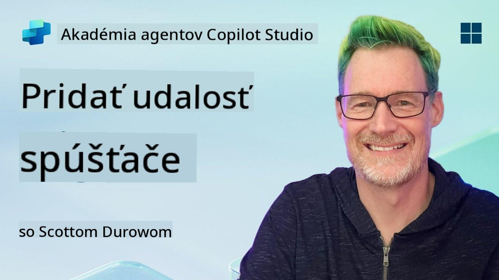](https://www.youtube.com/watch?v=ZgwHL8PQ1nY "Pozrite si prehľad na YouTube")

## 🎯 Zhrnutie misie

Je čas povýšiť vášho agenta z konverzačného asistenta na autonómneho operatívca. Vašou misiou je umožniť vášmu agentovi konať bez toho, aby bol vyzvaný – reagovať na signály z vášho digitálneho prostredia s presnosťou a rýchlosťou.

Pomocou spúšťačov udalostí naučíte svojho agenta monitorovať externé systémy ako SharePoint, Teams a Outlook a vykonávať inteligentné akcie okamžite po prijatí signálu. Táto operácia premení vášho agenta na plne funkčný terénny nástroj – tichý, rýchly a vždy pripravený.

Úspech znamená vytvoriť agentov, ktorí iniciujú hodnotu – nielen na ňu reagujú.

## 🔎 Ciele

📖 Táto lekcia pokrýva:

- Pochopenie spúšťačov udalostí a ich schopnosti umožniť autonómne správanie agenta
- Naučenie sa rozdielu medzi spúšťačmi udalostí a spúšťačmi tém, vrátane pracovných postupov spúšťačov a ich payloadov
- Preskúmanie bežných scenárov spúšťačov udalostí
- Pochopenie autentifikácie, bezpečnosti a úvah o publikovaní pre agentov riadených udalosťami
- Vytvorenie autonómneho IT Help Desk agenta, ktorý reaguje na udalosti v SharePointe a posiela potvrdenia e-mailom

## 🤔 Čo je spúšťač udalostí?

**Spúšťač udalostí** je mechanizmus, ktorý umožňuje vášmu agentovi konať autonómne v reakcii na externé udalosti, bez potreby priameho vstupu od používateľa. Predstavte si to ako spôsob, ako váš agent "sleduje" konkrétne udalosti a automaticky koná, keď k nim dôjde.

Na rozdiel od spúšťačov tém, ktoré vyžadujú, aby používatelia niečo napísali na aktiváciu konverzácie, spúšťače udalostí sa aktivujú na základe vecí, ktoré sa dejú vo vašich pripojených systémoch. Napr.:

- Keď sa vytvorí nový súbor v SharePointe alebo OneDrive for Business
- Keď sa vytvorí záznam v Dataverse
- Keď sa dokončí úloha v Planneri
- Keď sa odošle nová odpoveď na Microsoft Form
- Keď sa pridá nová správa v Microsoft Teams
- Na základe opakujúceho sa harmonogramu (napríklad denné pripomienky)  
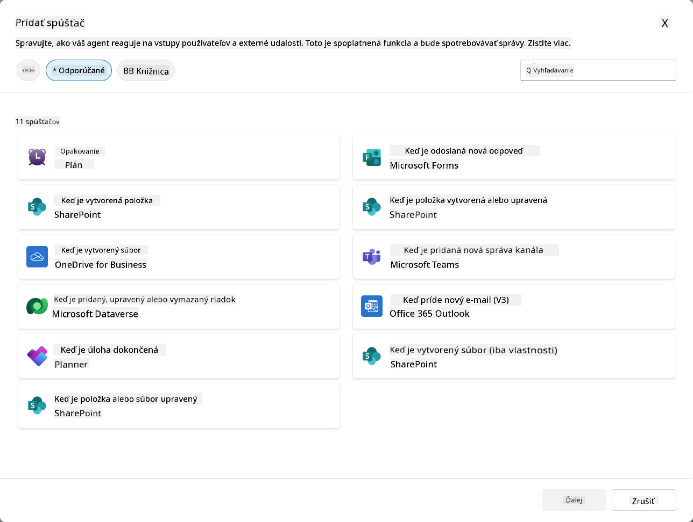

### Prečo sú spúšťače udalostí dôležité pre autonómnych agentov

Spúšťače udalostí transformujú vášho agenta z reaktívneho asistenta na proaktívneho, autonómneho pomocníka:

1. **Autonómna prevádzka** - váš agent môže pracovať 24/7 bez zásahu človeka, reagujúc na udalosti, keď sa vyskytnú.
    - *Príklad:* Automaticky privíta nových členov tímu, keď sú pridaní do tímu.

1. **Reakcia v reálnom čase** - namiesto čakania na otázky od používateľov váš agent okamžite reaguje na relevantné udalosti.
    - *Príklad*: Upozorní IT tím, keď sa upraví dokument v SharePointe.

1. **Automatizácia pracovných postupov** - prepojenie viacerých akcií na základe jednej spúšťacej udalosti.
    - *Príklad:* Keď sa vytvorí nový tiket podpory, vytvorí úlohu, upozorní manažéra a aktualizuje sledovací panel.

1. **Konzistentné procesy** - zabezpečenie, že dôležité kroky sa nikdy nevynechajú automatizáciou reakcií na kľúčové udalosti.
    - *Príklad:* Každý nový zamestnanec automaticky dostane materiály na zaškolenie a prístupové požiadavky.

1. **Akcie založené na dátach** - použitie informácií z spúšťacej udalosti na inteligentné rozhodnutia a vykonanie vhodných akcií.
    - *Príklad:* Presmerovanie urgentných tiketov na senior personál na základe úrovne priority v spúšťacom payloade.

## ⚙️ Ako fungujú spúšťače udalostí?

Spúšťače udalostí fungujú prostredníctvom trojstupňového pracovného postupu, ktorý umožňuje vášmu agentovi autonómne reagovať na externé udalosti:

### Pracovný postup spúšťača

1. **Detekcia udalosti** - V pripojenom systéme (SharePoint, Teams, Outlook, atď.) nastane konkrétna udalosť.
1. **Aktivácia spúšťača** - Spúšťač udalosti detekuje túto udalosť a pošle payload vášmu agentovi prostredníctvom Power Automate Cloud Flow.
1. **Reakcia agenta** - Váš agent prijme payload a vykoná pokyny, ktoré ste definovali.

### Spúšťače udalostí vs spúšťače tém

Pochopenie rozdielu medzi týmito dvoma typmi spúšťačov je kľúčové:

| **Spúšťače udalostí** | **Spúšťače tém** |
|-----------------------|-----------------|
| Aktivované udalosťami v externých systémoch | Aktivované vstupom/povedaním používateľa |
| Umožňujú autonómne správanie agenta | Umožňujú konverzačné reakcie |
| Používajú autentifikáciu tvorcu | Možnosť autentifikácie používateľa |
| Fungujú bez interakcie používateľa | Vyžadujú, aby používateľ začal konverzáciu |
| Príklady: Vytvorenie súboru, prijatie e-mailu | Príklad: "Aké je počasie?" |

## 📦 Pochopenie payloadov spúšťačov

Keď nastane udalosť, spúšťač pošle **payload** vášmu agentovi, ktorý obsahuje informácie o udalosti a pokyny, ako reagovať.

### Predvolené vs vlastné payloady

Každý typ spúšťača má predvolenú štruktúru payloadu, ktorú však môžete prispôsobiť:

**Predvolený payload** - Používa štandardný formát ako `Použiť obsah z {Body}`

- Obsahuje základné informácie o udalosti
- Používa generické pokyny na spracovanie
- Vhodné pre jednoduché scenáre

**Vlastný payload** - Pridajte konkrétne pokyny a formátovanie dát

- Zahrňuje podrobné pokyny pre vášho agenta
- Presne špecifikuje, aké údaje použiť a ako
- Lepšie pre zložité pracovné postupy

### Pokyny pre agenta vs pokyny pre payload

Máte dve miesta, kde môžete usmerniť správanie vášho agenta pomocou spúšťačov udalostí:

**Pokyny pre agenta** (Globálne)

- Všeobecné pokyny, ktoré sa vzťahujú na všetky spúšťače
- Príklad: "Pri spracovaní tiketov vždy najprv skontrolujte duplicity"
- Najlepšie pre všeobecné vzory správania

**Pokyny pre payload** (Špecifické pre spúšťač)

- Konkrétne pokyny pre jednotlivé typy spúšťačov  
- Príklad: "Pre túto aktualizáciu v SharePointe pošli zhrnutie do projektového kanála"
- Najlepšie pre zložité agentov s viacerými spúšťačmi

💡 **Tip**: Vyhnite sa konfliktom medzi týmito dvoma úrovňami pokynov, pretože to môže spôsobiť neočakávané správanie.

## 🎯 Bežné scenáre spúšťačov udalostí

Tu sú praktické príklady, ako môžu spúšťače udalostí zlepšiť vášho agenta:

### IT Help Desk Agent

- **Spúšťač**: Nová položka zoznamu v SharePointe (tiket podpory)
- **Akcia**: Automaticky kategorizovať, priradiť prioritu a upozorniť príslušných členov tímu

### Agent pre zaškolenie zamestnancov

- **Spúšťač**: Nový používateľ pridaný do Dataverse
- **Akcia**: Poslať uvítaciu správu, vytvoriť úlohy na zaškolenie a poskytnúť prístup

### Agent projektového manažmentu

- **Spúšťač**: Dokončenie úlohy v Planneri
- **Akcia**: Aktualizovať projektový panel, upozorniť zainteresované strany a skontrolovať blokátory

### Agent správy dokumentov

- **Spúšťač**: Nahranie súboru do konkrétneho priečinka v SharePointe
- **Akcia**: Extrahovať metadáta, aplikovať značky a upozorniť vlastníkov dokumentu

### Agent pre stretnutia

- **Spúšťač**: Vytvorenie udalosti v kalendári
- **Akcia**: Poslať pripomienky pred stretnutím a agendu, rezervovať zdroje

## ⚠️ Úvahy o publikovaní a autentifikácii

Predtým, než váš agent môže používať spúšťače udalostí v produkcii, musíte pochopiť autentifikáciu a bezpečnostné dôsledky.

### Autentifikácia tvorcu

Spúšťače udalostí používajú **prihlasovacie údaje tvorcu agenta** pre všetku autentifikáciu:

- Váš agent pristupuje k systémom pomocou vašich oprávnení
- Používatelia môžu potenciálne pristupovať k údajom prostredníctvom vašich prihlasovacích údajov
- Všetky akcie sú vykonávané "ako vy", aj keď používatelia interagujú s agentom

### Najlepšie postupy ochrany údajov

Na zachovanie bezpečnosti pri publikovaní agentov so spúšťačmi udalostí:

1. **Vyhodnoťte prístup k údajom** - Skontrolujte, aké systémy a údaje môžu vaše spúšťače pristupovať
1. **Dôkladne testujte** - Pochopte, aké informácie obsahujú payloady spúšťačov
1. **Obmedzte rozsah spúšťačov** - Používajte konkrétne parametre na obmedzenie udalostí, ktoré aktivujú spúšťače
1. **Skontrolujte údaje v payloadoch** - Uistite sa, že spúšťače neodhalia citlivé informácie
1. **Monitorujte používanie** - Sledujte aktivitu spúšťačov a spotrebu zdrojov

## ⚠️ Riešenie problémov a obmedzenia

Majte na pamäti tieto dôležité úvahy pri práci so spúšťačmi udalostí:

### Dopady na kvóty a fakturáciu

- Každá aktivácia spúšťača sa počíta do vašej spotreby správ
- Časté spúšťače (napr. opakovanie každú minútu) môžu rýchlo spotrebovať kvótu
- Monitorujte používanie, aby ste sa vyhli obmedzeniam

### Technické požiadavky

- Dostupné iba pre agentov s povolenou generatívnou orchestráciou
- Vyžaduje povolenie zdieľania cloudových tokov s riešením vo vašom prostredí

### Prevencia straty údajov (DLP)

- Politiky DLP vašej organizácie určujú, ktoré spúšťače sú dostupné
- Administrátori môžu úplne blokovať spúšťače udalostí
- Kontaktujte svojho administrátora, ak očakávané spúšťače nie sú dostupné

## 🧪 Laboratórium 10 - Pridanie spúšťačov udalostí pre autonómne správanie agenta

### 🎯 Prípad použitia

Vylepšíte svojho IT Help Desk agenta, aby automaticky reagoval na nové požiadavky na podporu. Keď niekto vytvorí novú položku v zozname tiketov podpory v SharePointe, váš agent:

1. Autonómne sa spustí, keď sa vytvorí tiket v SharePointe
1. Poskytne podrobnosti o tikete a pokyny na kroky, ktoré chcete, aby vykonal
1. Automaticky potvrdí prijatie tiketu odosielateľovi prostredníctvom AI generovaného e-mailu

Toto laboratórium demonštruje, ako spúšťače udalostí umožňujú skutočne autonómne správanie agenta.

### Predpoklady

Pred začatím tohto laboratória sa uistite, že máte:

- ✅ Dokončené predchádzajúce laboratóriá (najmä Laboratórium 6-8 pre IT Help Desk agenta)
- ✅ Prístup na stránku SharePoint s zoznamom tiketov podpory
- ✅ Prostredie Copilot Studio s povolenými spúšťačmi udalostí
- ✅ Váš agent má povolenú generatívnu orchestráciu
- ✅ Vhodné oprávnenia v SharePointe a vašom prostredí Copilot Studio

### 10.1 Povolenie Generatívnej AI a vytvorenie spúšťača pre vytvorenie položky v SharePointe

1. Otvorte svojho **IT Help Desk agenta** v **Copilot Studio**

1. Najprv sa uistite, že je pre vášho agenta povolená **Generatívna AI**:
   - Prejdite na kartu **Prehľad**
   - V sekcii Orchestrácia zapnite **Generatívnu orchestráciu** na **Zapnuté**, ak už nie je povolená  
     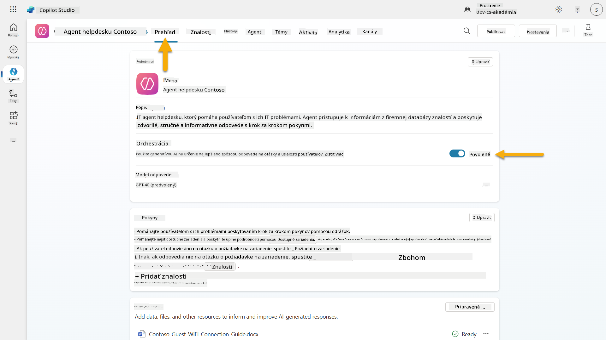

1. Prejdite na kartu **Prehľad** a nájdite sekciu **Spúšťače**

1. Kliknite na **+ Pridať spúšťač**, aby ste otvorili knižnicu spúšťačov  
    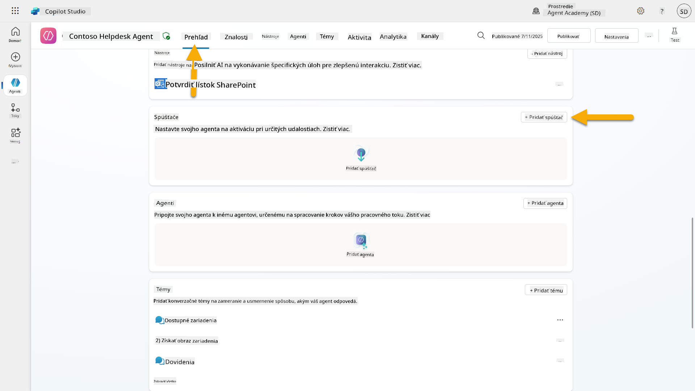

1. Vyhľadajte a vyberte **Keď sa vytvorí položka** (SharePoint)  
    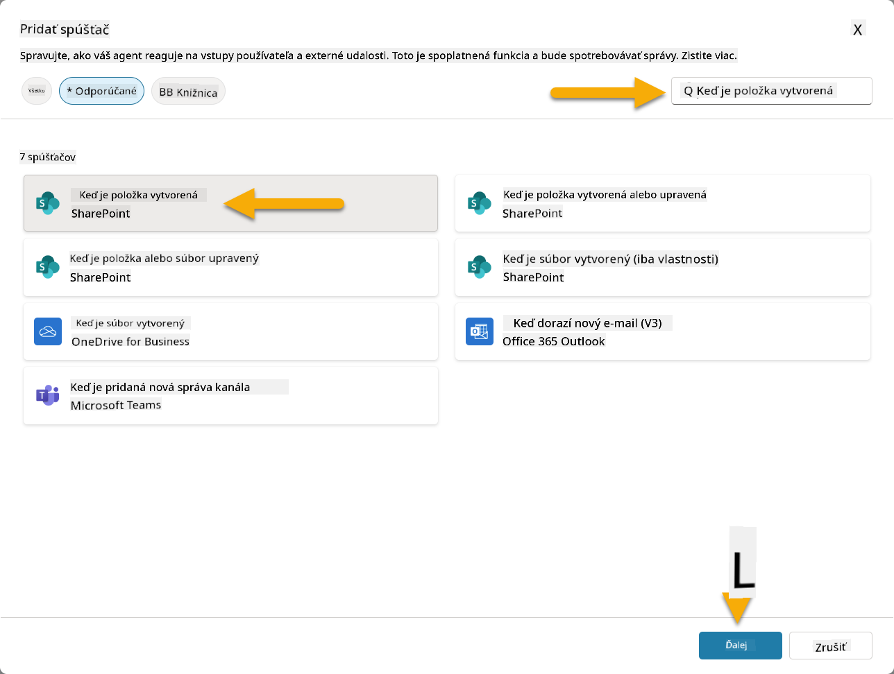

1. Nakonfigurujte názov spúšťača a pripojenia:

   - **Názov spúšťača:** Nový tiket podpory vytvorený v SharePointe

1. Počkajte na konfiguráciu pripojení a vyberte **Ďalej**, aby ste pokračovali.  
   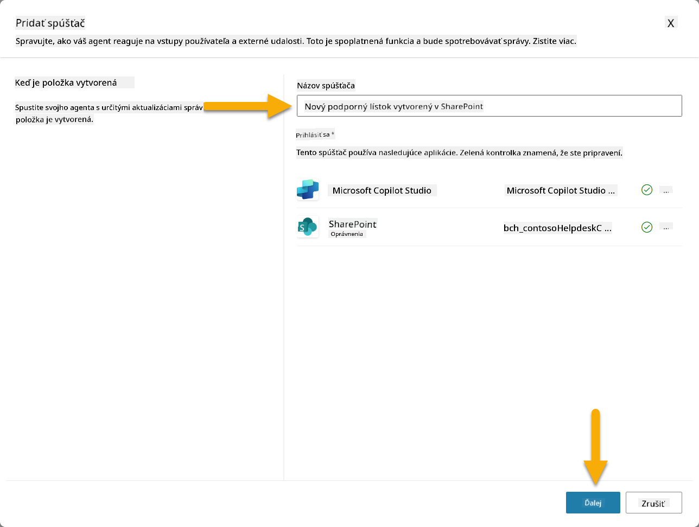

1. Nakonfigurujte parametre spúšťača:

   - **Adresa stránky**: Vyberte svoju stránku "Contoso IT" v SharePointe

   - **Názov zoznamu**: Vyberte svoj zoznam "Tikety"

   - **Ďalšie pokyny pre agenta, keď je spustený spúšťač:**

     ```text
     New Support Ticket Created in SharePoint: {Body}
     
     Use the 'Acknowledge SharePoint Ticket' tool to generate the email body automatically and respond.
     
     IMPORTANT: Do not wait for any user input. Work completely autonomously.
     ```

     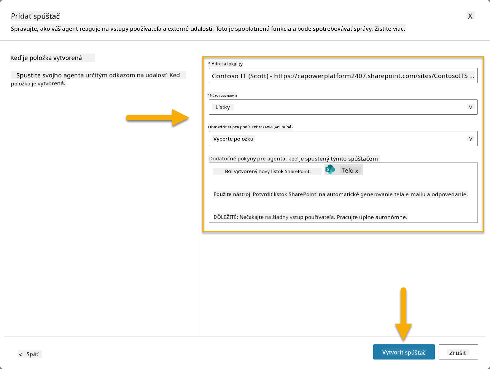

1. Vyberte **Vytvoriť spúšťač**, aby ste dokončili vytvorenie spúšťača. Automaticky sa vytvorí Power Automate Cloud Flow na autonómne spustenie agenta.

1. Vyberte **Zatvoriť**.

### 10.2 Úprava spúšťača

1. V sekcii **Spúšťače** na karte **Prehľad** vyberte menu **...** na spúšťači **Nový tiket podpory vytvorený v SharePointe**

1. Vyberte **Upraviť v Power Automate**  
   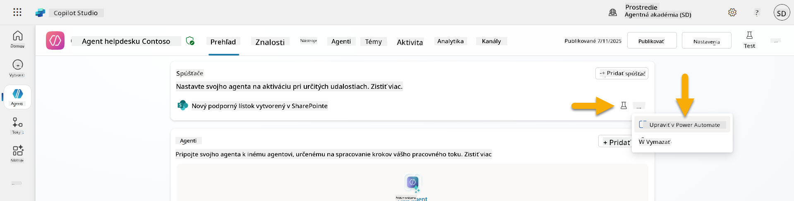

1. Vyberte uzol **Odosiela výzvu určenému copilotovi na spracovanie**

1. V poli **Telo/s
1. Otvorte novú kartu prehliadača a prejdite na svoj **zoznam SharePoint IT Support Tickets**
1. Kliknite na **+ Pridať novú položku** na vytvorenie testovacieho tiketu:
   - **Názov**: "Nie je možné pripojiť sa k VPN"
   - **Popis**: "Nie je možné pripojiť sa k firemnej WIFI sieti po nedávnej aktualizácii"
   - **Priorita**: "Normálna"

1. **Uložte** položku v SharePointe  
    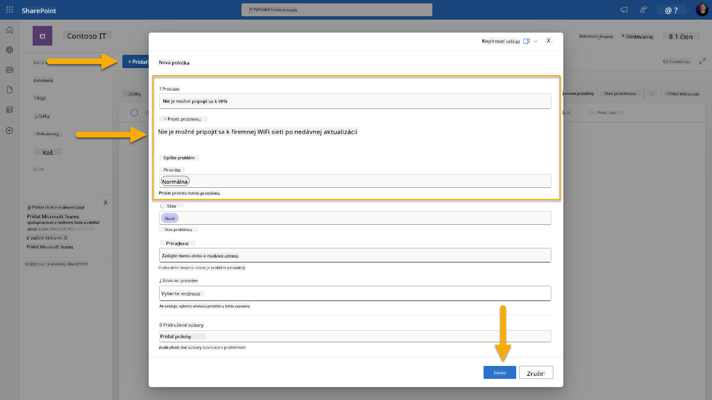
1. Vráťte sa do **Copilot Studio** a sledujte panel **Testujte svoj spúšťač** pre aktiváciu spúšťača. Použite ikonu **Obnoviť** na načítanie udalosti spúšťača, môže to trvať niekoľko minút.  
    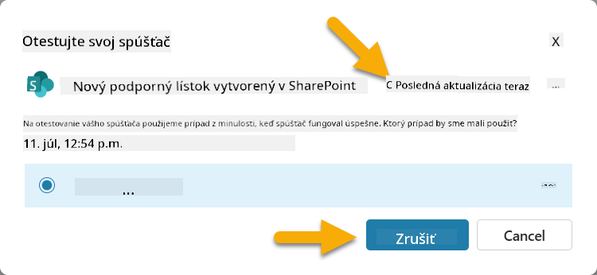
1. Keď sa spúšťač objaví, vyberte **Začať testovanie**
1. Kliknite na **ikonu Activity Map** v hornej časti panelu **Testujte svojho agenta**
1. Overte, že váš agent:
   - Prijal payload spúšťača
   - Použil nástroj "Potvrdiť tiket v SharePointe"  
     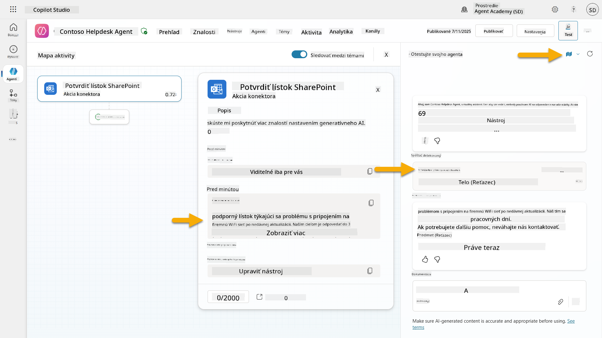
1. Skontrolujte e-mailovú schránku odosielateľa, aby ste potvrdili, že bol odoslaný potvrdzovací e-mail  
    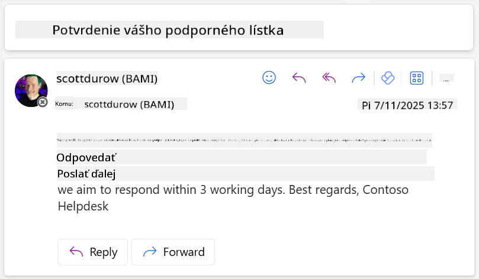
1. Prezrite si kartu **Activity** v Copilot Studio, aby ste videli kompletné spustenie spúšťača a vykonanie nástroja

## ✅ Misia splnená

🎉 **Gratulujeme!** Úspešne ste implementovali spúšťače udalostí s konektorovými nástrojmi, ktoré umožňujú vášmu agentovi pracovať autonómne, automaticky odosielať potvrdzovacie e-maily a spracovávať tikety podpory bez zásahu používateľa. Po publikovaní vášho agenta bude konať autonómne vo vašom mene.

🚀 **Ďalej**: V našej ďalšej lekcii sa naučíte, ako [publikovať svojho agenta](../11-publish-your-agent/README.md) do Microsoft Teams a Microsoft 365 Copilot, aby bol dostupný pre celú vašu organizáciu!

⏭️ [Prejsť na lekciu **Publikovať svojho agenta**](../11-publish-your-agent/README.md)

## 📚 Taktické zdroje

Pripravení ponoriť sa hlbšie do spúšťačov udalostí a autonómnych agentov? Pozrite si tieto zdroje:

- **Microsoft Learn**: [Urobte svojho agenta autonómnym v Copilot Studio](https://learn.microsoft.com/training/modules/autonomous-agents-online-workshop/?WT.mc_id=power-177340-scottdurow)
- **Dokumentácia**: [Pridať spúšťač udalostí](https://learn.microsoft.com/microsoft-copilot-studio/authoring-trigger-event?WT.mc_id=power-177340-scottdurow)
- **Najlepšie postupy**: [Úvod do spúšťačov Power Automate](https://learn.microsoft.com/power-automate/triggers-introduction?WT.mc_id=power-177340-scottdurow)
- **Pokročilé scenáre**: [Používanie tokov Power Automate s agentmi](https://learn.microsoft.com/microsoft-copilot-studio/advanced-flow-create?WT.mc_id=power-177340-scottdurow)
- **Bezpečnosť**: [Prevencia straty dát pre Copilot Studio](https://learn.microsoft.com/microsoft-copilot-studio/admin-data-loss-prevention?WT.mc_id=power-177340-scottdurow)


---

**Zrieknutie sa zodpovednosti**:  
Tento dokument bol preložený pomocou služby AI prekladu [Co-op Translator](https://github.com/Azure/co-op-translator). Hoci sa snažíme o presnosť, prosím, berte na vedomie, že automatizované preklady môžu obsahovať chyby alebo nepresnosti. Pôvodný dokument v jeho rodnom jazyku by mal byť považovaný za autoritatívny zdroj. Pre kritické informácie sa odporúča profesionálny ľudský preklad. Nenesieme zodpovednosť za akékoľvek nedorozumenia alebo nesprávne interpretácie vyplývajúce z použitia tohto prekladu.