<!--
CO_OP_TRANSLATOR_METADATA:
{
  "original_hash": "9dceeba2eae2bb73e328602a060eddab",
  "translation_date": "2025-10-20T17:30:17+00:00",
  "source_file": "docs/recruit/11-publish-your-agent/README.md",
  "language_code": "sk"
}
-->
# 🚨 Misia 11: Publikujte svojho agenta

## 🕵️‍♂️ KRYCÍ NÁZOV: `OPERÁCIA PUBLIKOVAŤ PUBLIKOVAŤ PUBLIKOVAŤ`

> **⏱️ Časový rámec operácie:** `~30 minút`  

🎥 **Pozrite si návod**

## 🎯 Misia: Zhrnutie

Po absolvovaní série náročných modulov, Agent Maker, ste teraz pripravení na svoj najdôležitejší krok: publikovanie vášho agenta. Je čas sprístupniť vaše dielo používateľom v Microsoft Teams a Microsoft 365 Copilot.

Váš agent—vybavený jasnou misiou, výkonnými nástrojmi a prístupom k dôležitým zdrojom informácií—je pripravený slúžiť. Pomocou Microsoft Copilot Studio nasadíte svojho agenta, aby mohol začať pomáhať skutočným používateľom priamo tam, kde pracujú.

Spustime vášho agenta do akcie.

## 🔎 Ciele

📖 Táto lekcia pokrýva:

1. Prečo je dôležité publikovať vášho agenta
1. Čo sa stane, keď publikujete vášho agenta
1. Ako pridať kanál (Microsoft Teams & Microsoft 365 Copilot)
1. Ako pridať agenta do Microsoft Teams
1. Ako sprístupniť agenta v Microsoft Teams pre celú organizáciu

## 🚀 Publikujte agenta

Kedykoľvek pracujete na agentovi v Copilot Studio, môžete ho aktualizovať pridaním nových znalostí alebo nástrojov. Keď ste so všetkými zmenami hotoví a dôkladne ich otestujete, ste pripravení na publikovanie. Publikovanie zabezpečuje, že najnovšie aktualizácie sú aktívne. Ak aktualizujete svojho agenta novými nástrojmi a nestlačíte tlačidlo publikovať, aktualizácie ešte nie sú dostupné pre koncových používateľov.

Uistite sa, že vždy stlačíte tlačidlo publikovať, keď chcete posunúť aktualizácie používateľom vášho agenta. Váš agent môže mať pridané kanály, a keď stlačíte publikovať, aktualizácie sú dostupné pre všetky kanály, ktoré ste pridali k agentovi.

## ⚙️ Konfigurácia kanálov

Kanály určujú, kde môžu vaši používatelia pristupovať k vášmu agentovi a interagovať s ním. Po publikovaní vášho agenta ho môžete sprístupniť vo viacerých kanáloch. Každý kanál môže zobrazovať obsah vášho agenta odlišne.

Môžete pridať svojho agenta do nasledujúcich kanálov:

- **Microsoft Teams a Microsoft 365 Copilot** - Sprístupnite svojho agenta v chatovacích miestnostiach a stretnutiach Teams, ako aj v prostredí Microsoft 365 Copilot ([Viac informácií](https://learn.microsoft.com/microsoft-copilot-studio/publication-add-bot-to-microsoft-teams))
- **Demo webová stránka** - Otestujte svojho agenta na demo webovej stránke poskytovanej Copilot Studio ([Viac informácií](https://learn.microsoft.com/microsoft-copilot-studio/publication-connect-bot-to-web-channels))
- **Vlastná webová stránka** - Vložte svojho agenta priamo na svoju vlastnú webovú stránku ([Viac informácií](https://learn.microsoft.com/microsoft-copilot-studio/publication-connect-bot-to-web-channels))
- **Mobilná aplikácia** - Integrujte svojho agenta do vlastnej mobilnej aplikácie ([Viac informácií](https://learn.microsoft.com/microsoft-copilot-studio/publication-connect-bot-to-custom-application))
- **SharePoint** - Pridajte svojho agenta na SharePoint stránky pre pomoc s dokumentmi a stránkami ([Viac informácií](https://learn.microsoft.com/microsoft-copilot-studio/publication-add-bot-to-sharepoint))
- **Facebook Messenger** - Spojte sa s používateľmi prostredníctvom platformy na odosielanie správ Facebooku ([Viac informácií](https://learn.microsoft.com/microsoft-copilot-studio/publication-add-bot-to-facebook))
- **Power Pages** - Integrujte svojho agenta do webových stránok Power Pages ([Viac informácií](https://learn.microsoft.com/microsoft-copilot-studio/publication-add-bot-to-power-pages))
- **Kanály Azure Bot Service** - Prístup k ďalším kanálom vrátane Slack, Telegram, Twilio SMS a ďalších ([Viac informácií](https://learn.microsoft.com/microsoft-copilot-studio/publication-connect-bot-to-azure-bot-service-channels))

Ak chcete pridať kanál, prejdite na kartu **Kanály** vo vašom agentovi a vyberte kanál, ktorý chcete nakonfigurovať. Každý kanál má špecifické požiadavky na nastavenie a môže vyžadovať dodatočné overenie alebo kroky konfigurácie.

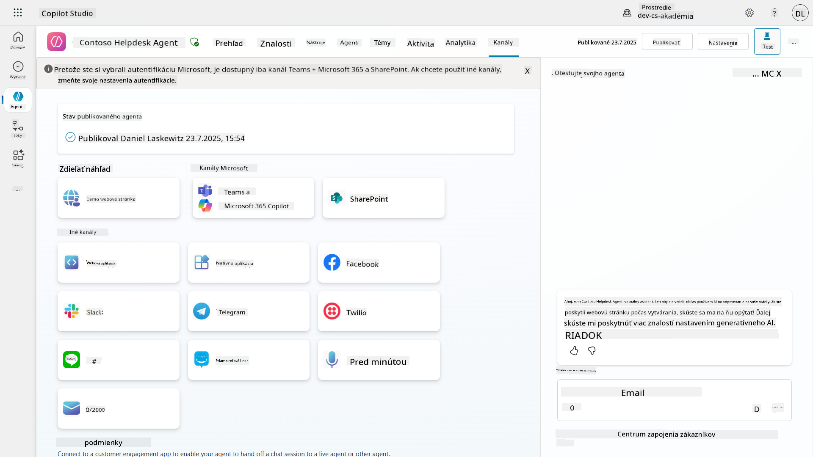

## 📺 Skúsenosti s kanálmi

Rôzne kanály majú rôzne používateľské skúsenosti. Pri vytváraní agenta pre viacero kanálov sa uistite, že ste si vedomí rozdielov medzi jednotlivými kanálmi. Vždy je dobré testovať svojho agenta vo viacerých kanáloch, aby ste zistili, či naozaj robí to, čo ste zamýšľali.

| Skúsenosť                        | Webová stránka | Teams a Microsoft 365 Copilot         | Facebook                 | Dynamics Omnichannel for Customer Service                   |
| -------------------------------- | ------------- | ------------------------------------- | ------------------------ | ----------------------------------------------------------- |
| [Prieskum spokojnosti zákazníkov][1] | Adaptívna karta | Len text                              | Len text                 | Len text                                                    |
| [Možnosti výberu][1]             | Podporované   | [Podporované až šesť (ako hero karta)][4] | [Podporované až 13][6]   | [Čiastočne podporované][8]                                 |
| [Markdown][2]                    | Podporované   | [Čiastočne podporované][5]            | [Čiastočne podporované][7] | [Čiastočne podporované][9]                                 |
| [Uvítacia správa][1]             | Podporované   | Podporované                           | Nepodporované            | Podporované pre [Chat][10]. Nepodporované pre iné kanály.   |
| [Did-You-Mean][3]                | Podporované   | Podporované                           | Podporované              | Podporované pre [Microsoft Teams][11], [Chat][10], Facebook a textové kanály (SMS cez [TeleSign][12] a [Twilio][13], [WhatsApp][14], [WeChat][15] a [Twitter][16]). Navrhované akcie sú prezentované ako zoznam len textu; používatelia musia znovu napísať možnosť, aby odpovedali. |

[1]: https://learn.microsoft.com/microsoft-copilot-studio/authoring-create-edit-topics  
[2]: https://daringfireball.net/projects/markdown/  
[3]: https://learn.microsoft.com/microsoft-copilot-studio/advanced-ai-features  
[4]: https://learn.microsoft.com/microsoftteams/platform/concepts/cards/cards-reference#hero-card  
[5]: https://learn.microsoft.com/microsoftteams/platform/bots/how-to/format-your-bot-messages#text-only-messages  
[6]: https://developers.facebook.com/docs/messenger-platform/send-messages/quick-replies/  
[7]: https://www.facebook.com/help/147348452522644?helpref=related  
[8]: https://learn.microsoft.com/dynamics365/customer-service/asynchronous-channels#suggested-actions-support  
[9]: https://learn.microsoft.com/dynamics365/customer-service/asynchronous-channels#preview-support-for-formatted-messages  
[10]: https://learn.microsoft.com/dynamics365/customer-service/set-up-chat-widget  
[11]: https://learn.microsoft.com/dynamics365/customer-service/configure-microsoft-teams  
[12]: https://learn.microsoft.com/dynamics365/customer-service/configure-sms-channel  
[13]: https://learn.microsoft.com/dynamics365/customer-service/configure-sms-channel-twilio  
[14]: https://learn.microsoft.com/dynamics365/customer-service/configure-whatsapp-channel  
[15]: https://learn.microsoft.com/dynamics365/customer-service/configure-wechat-channel  
[16]: https://learn.microsoft.com/dynamics365/customer-service/configure-twitter-channel  

> [!NOTE]  
> Existujú niektoré príklady, kde môžete použiť rôznu logiku pre rôzne kanály. Príklad toho nájdete v repozitári Power Platform Snippets:  
>  
> Henry Jammes zdieľal príklad, ako zobraziť inú adaptívnu kartu, keď je kanál Microsoft Teams. ([Odkaz na príklad](https://github.com/pnp/powerplatform-snippets/blob/main/copilot-studio/multiple-topics-matched-topic/source/multiple-topics-matched.yaml#L40))

## 🧪 Laboratórium 11: Publikujte svojho agenta do Teams a Microsoft 365 Copilot

### 🎯 Použitie

Váš agent Contoso IT Help Desk je teraz plne nakonfigurovaný s výkonnými schopnosťami—má prístup k zdrojom informácií na SharePointe, dokáže vytvárať podporné lístky, posielať proaktívne oznámenia a inteligentne reagovať na otázky používateľov. Avšak všetky tieto funkcie sú momentálne dostupné iba v prostredí vývoja, kde ste ich vytvorili.

**Výzva:** Koncoví používatelia nemôžu využívať schopnosti vášho agenta, pokiaľ nie je správne publikovaný a sprístupnený prostredníctvom kanálov, kde skutočne pracujú.

**Riešenie:** Publikovanie vášho agenta zabezpečí, že najnovšia verzia—so všetkými vašimi nedávnymi aktualizáciami, novými témami, rozšírenými zdrojmi informácií a nakonfigurovanými tokmi—bude dostupná skutočným používateľom. Bez publikovania by používatelia stále interagovali so staršou verziou vášho agenta, ktorá by mohla postrádať dôležité funkcie.

Pridanie kanála Teams a Microsoft 365 Copilot je rovnako dôležité, pretože:

- **Integrácia s Teams**: Zamestnanci vašej organizácie trávia väčšinu svojho dňa v Microsoft Teams pri spolupráci, stretnutiach a komunikácii. Pridaním vášho agenta do Teams môžu používatelia získať IT podporu bez opustenia svojho primárneho pracovného prostredia.

- **Microsoft 365 Copilot**: Používatelia môžu priamo v prostredí Microsoft 365 Copilot pristupovať k vášmu špecializovanému IT agentovi, čo ho bezproblémovo integruje do ich každodenného pracovného toku v aplikáciách Office.

- **Centralizovaný prístup**: Namiesto zapamätania si samostatných webových stránok alebo aplikácií môžu používatelia pristupovať k IT podpore prostredníctvom platforiem, ktoré už používajú, čím sa znižuje zložitosť a zvyšuje sa adopcia.

Táto misia transformuje vašu vývojovú prácu na produkčne pripravené riešenie, ktoré prináša skutočnú hodnotu koncovým používateľom vašej organizácie.

### Predpoklady

Pred začatím tohto laboratória sa uistite, že máte:

- ✅ Dokončené predchádzajúce laboratóriá a plne nakonfigurovaného agenta Contoso Helpdesk
- ✅ Váš agent bol otestovaný a je pripravený na produkčné použitie
- ✅ Oprávnenia vo vašom prostredí Copilot Studio na publikovanie agentov
- ✅ Prístup k Microsoft Teams vo vašej organizácii

### 11.1 Publikujte svojho agenta

Teraz, keď je všetka práca na agentovi hotová, musíme zabezpečiť, aby bol dostupný pre koncových používateľov, ktorí ho budú používať. Aby sme zabezpečili dostupnosť obsahu pre všetkých používateľov, musíme publikovať nášho agenta.

1. Prejdite na Contoso Helpdesk Agent v Copilot Studio (cez [portál Copilot Studio maker](https://copilotstudio.microsoft.com))

    V Copilot Studio je jednoduché publikovať vášho agenta. Stačí kliknúť na tlačidlo publikovať v hornej časti prehľadu agenta.

    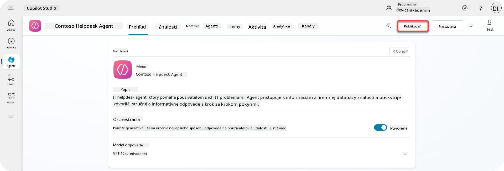

1. Kliknite na tlačidlo **Publikovať** vo vašom agentovi

    Otvorí sa vyskakovacie okno na potvrdenie, že naozaj chcete publikovať svojho agenta.

    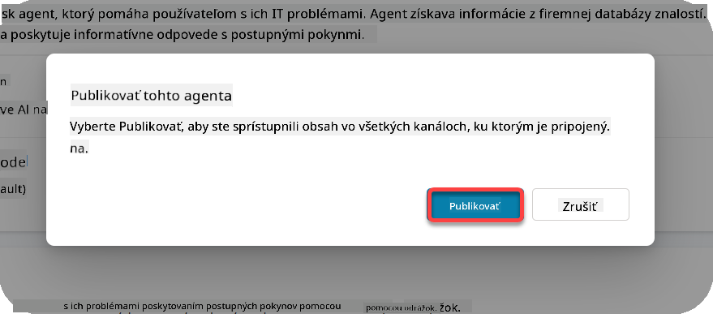

1. Kliknite na **Publikovať** na potvrdenie publikovania vášho agenta

    Teraz sa zobrazí správa, že váš agent sa publikuje. Nemusíte ponechať toto vyskakovacie okno otvorené. Budete upozornení, keď bude agent publikovaný.

    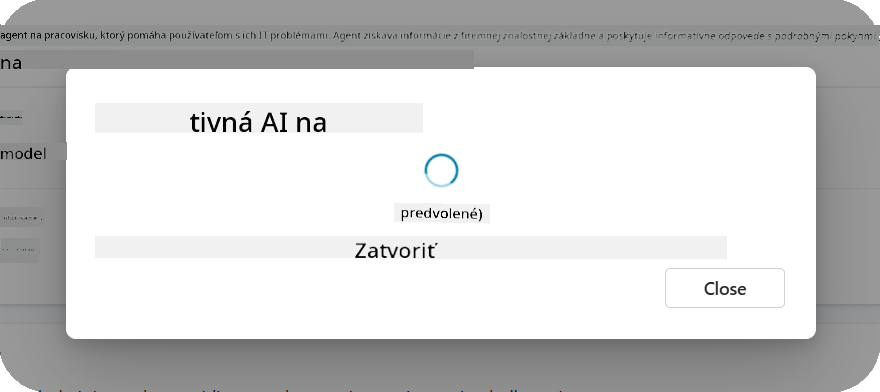

    Keď je agent publikovaný, zobrazí sa upozornenie v hornej časti stránky agenta.

    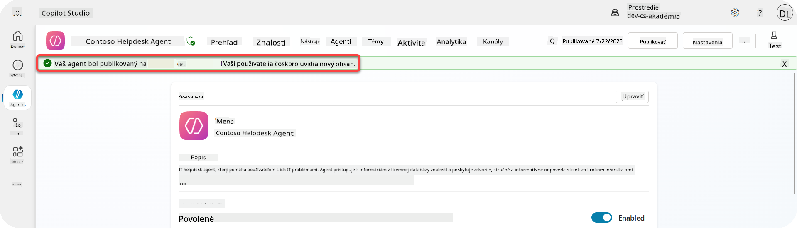

Ale - publikovali sme iba agenta, ešte sme ho nepridali do kanála, takže to teraz napravíme!

### 11.2 Pridajte kanál Teams a Microsoft 365 Copilot

1. Ak chcete pridať kanál Teams a Microsoft 365 Copilot k nášmu agentovi, musíme vybrať **Kanál** v hornej navigácii agenta

    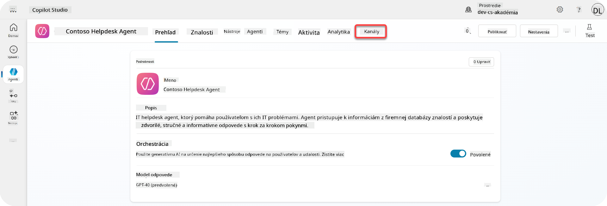

    Tu môžeme vidieť všetky kanály, ktoré môžeme pridať k tomuto agentovi.

1. Vyberte **Teams a Microsoft 365**

    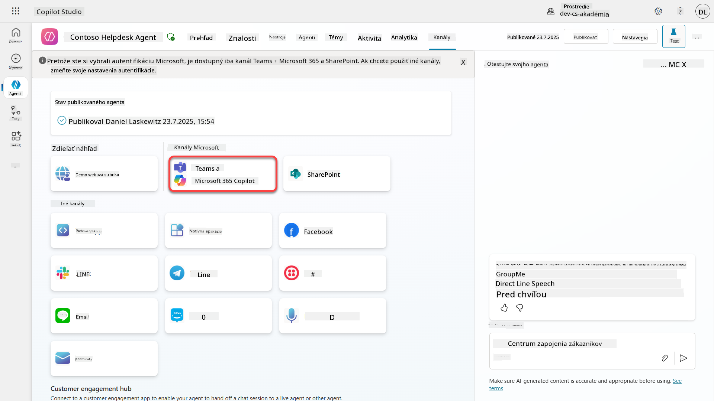

1. Kliknite na **Pridať kanál** na dokončenie sprievodcu a pridanie kanála k agentovi

    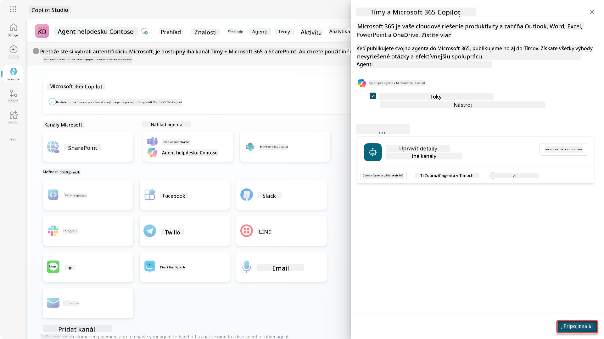

    Bude to chvíľu trvať, kým sa pridá. Po pridaní sa zobrazí zelené upozornenie v hornej časti bočného panela.

    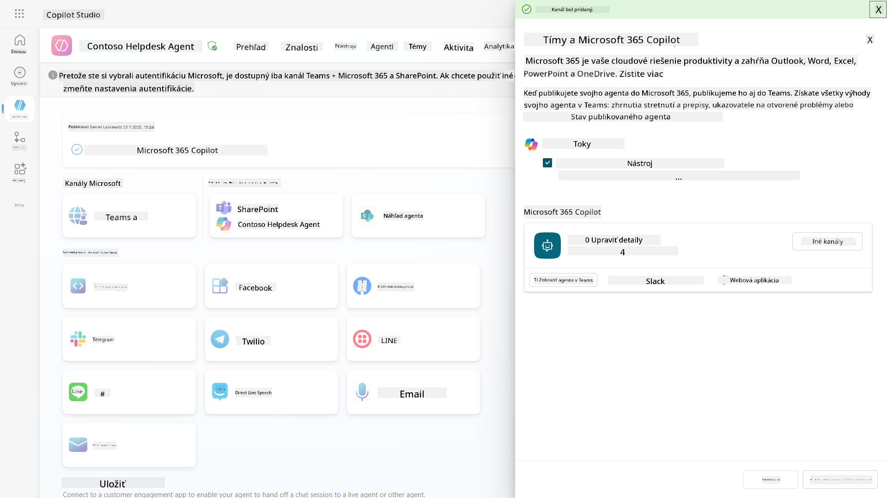

1. Kliknite na **Zobraziť agenta v Teams** na otvorenie novej karty

    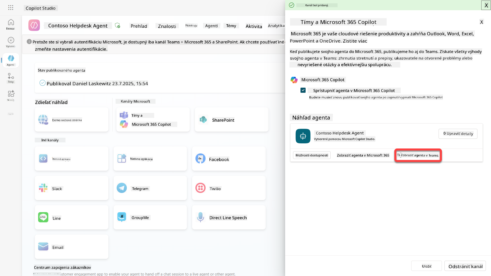

1. Kliknite na **Pridať** na pridanie agenta Contoso Helpdesk do Teams

    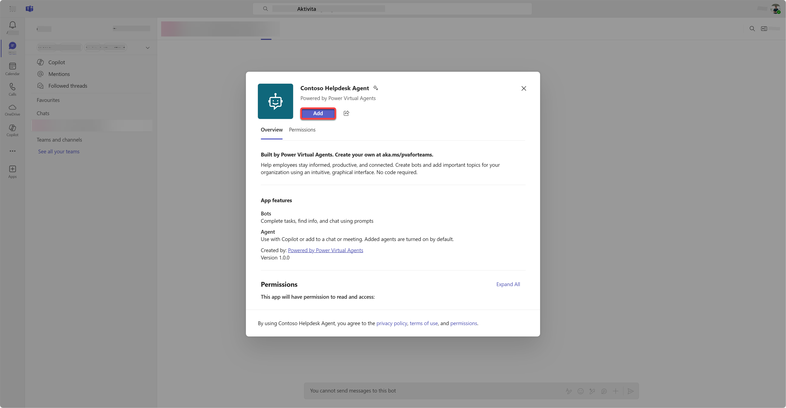

    Toto by malo chvíľu trvať. Po dokončení by sa mala zobraziť nasledujúca obrazovka:

    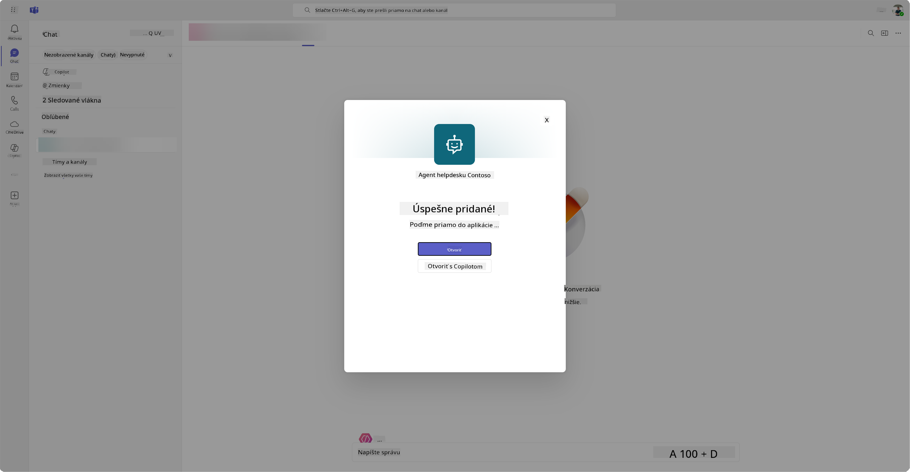

1. Kliknite na **Otvoriť** na otvorenie agenta v Teams

    Tým sa otvorí agent v Teams ako aplikácia Teams

    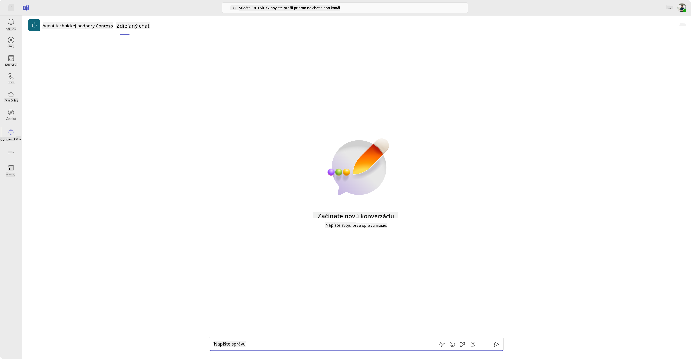

Teraz sme publikovali agenta, aby pracoval pre vás v Microsoft Teams, ale možno ho budete chcieť sprístupniť pre viac ľudí.

### 11.3 Sprístupnite agenta pre všetkých používateľov v tenante

1. Zatvorte kartu prehliadača, kde je otvorený agent Contoso Helpdesk

    Tým by ste sa mali vrátiť do Copilot Studio, kde je stále otvorený bočný panel Teams a Microsoft 365 Copilot. Teraz sme agenta otvorili iba v Teams, ale môžeme tu urobiť oveľa viac. Môžeme upraviť detaily agenta, nasadiť agenta pre viac používateľov a ďalšie.

1. Kliknite na **Upraviť detaily**

    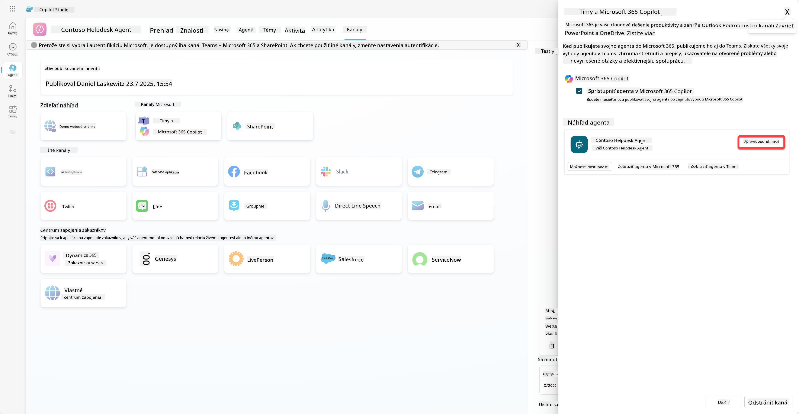
Týmto sa otvorí panel, kde môžeme zmeniť množstvo detailov a nastavení agenta. Môžeme upraviť základné detaily, ako ikonu, farbu pozadia ikony a popisy. Taktiež tu môžeme zmeniť nastavenia pre Teams (napríklad povoliť používateľovi pridať agenta do tímu alebo povoliť používanie tohto agenta v skupinových a stretnutiach chatoch). Po výbere *viac* môžete upraviť aj detaily vývojára, ako meno vývojára, webovú stránku, vyhlásenie o ochrane súkromia a podmienky používania.

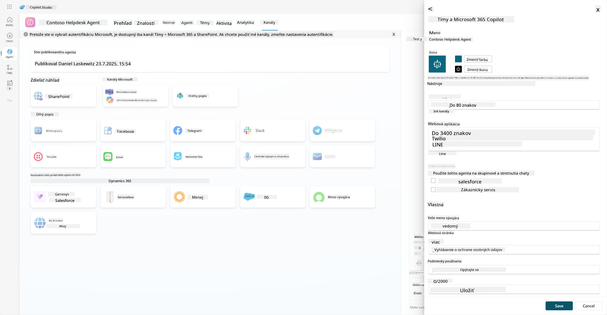

1. Vyberte **Zrušiť**, aby ste zavreli panel na úpravu detailov.

1. Vyberte **Možnosti dostupnosti**.

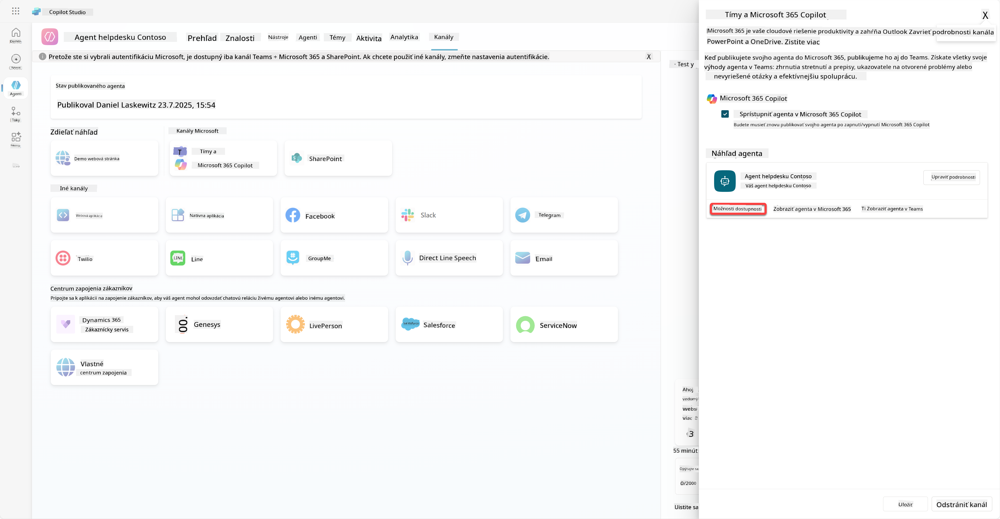

Týmto sa otvorí panel možností dostupnosti, kde môžete skopírovať odkaz na zdieľanie s používateľmi, aby mohli používať tohto agenta (pozor, agenta musíte s používateľom zdieľať) a môžete stiahnuť súbor na pridanie vášho agenta do obchodu Microsoft Teams alebo Microsoft 365. Na zobrazenie agenta v obchode máte aj ďalšie možnosti: môžete ho zobraziť svojim kolegom a zdieľaným používateľom (na zobrazenie v sekcii *Vytvorené pomocou Power Platform*) alebo ho môžete zobraziť všetkým vo vašej organizácii (to vyžaduje schválenie administrátorom).

1. Vyberte **Zobraziť všetkým vo mojej organizácii**.

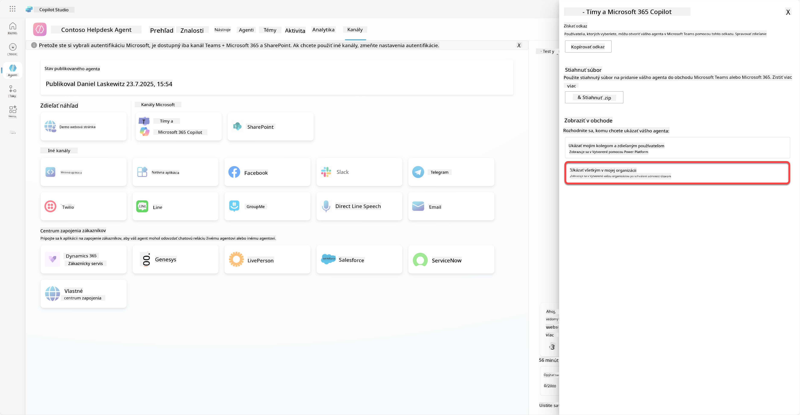

1. Vyberte **Odoslať na schválenie administrátorom**.

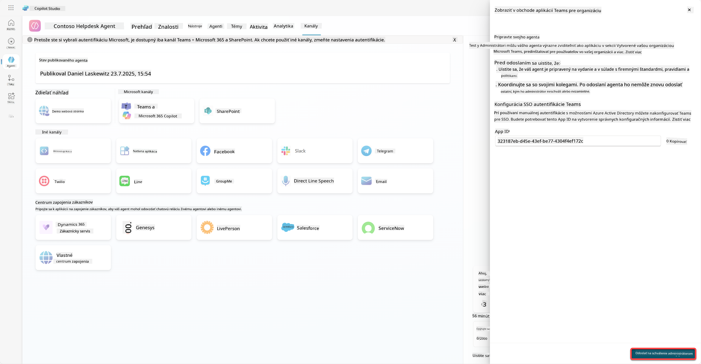

Teraz musí váš administrátor schváliť odoslanie vášho agenta. Môže to urobiť tak, že prejde do Teams Admin Center a vyhľadá Contoso Helpdesk Agent v aplikáciách. Na snímke obrazovky môžete vidieť, čo by administrátor videl v Teams Admin Center.

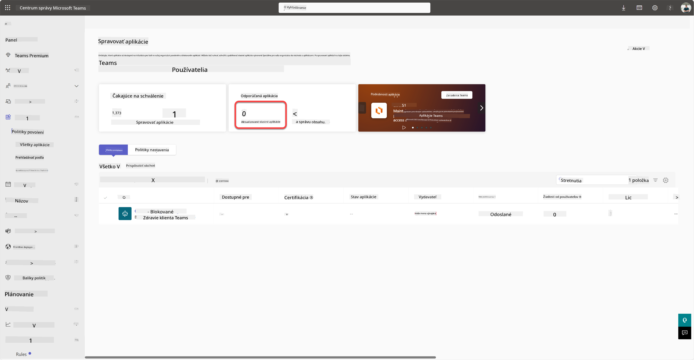

Administrátor musí vybrať Contoso Helpdesk Agent a zvoliť *Publikovať*, aby publikoval Contoso Helpdesk Agent pre všetkých.

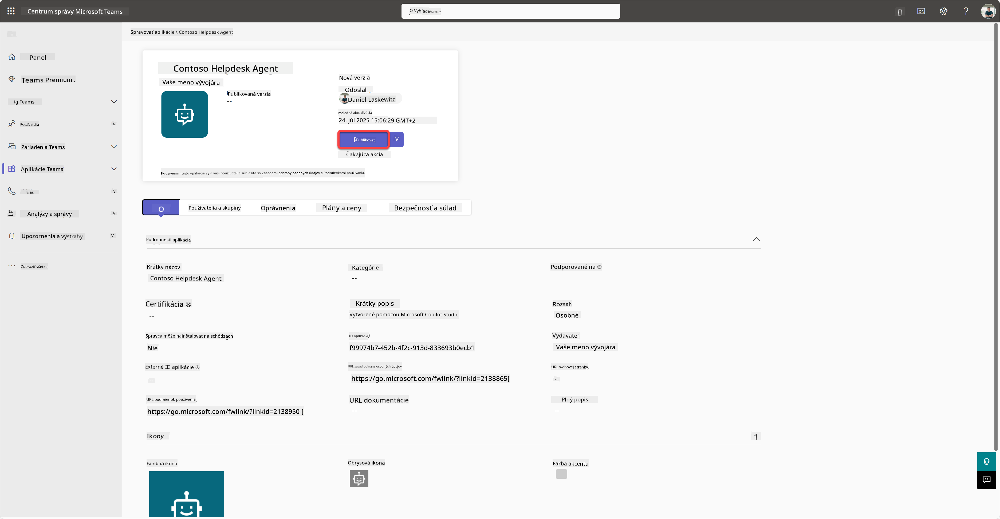

Keď administrátor publikoval odoslanie agenta, budete môcť obnoviť Copilot Studio a mali by ste vidieť banner *dostupné v obchode aplikácií* v možnostiach dostupnosti.

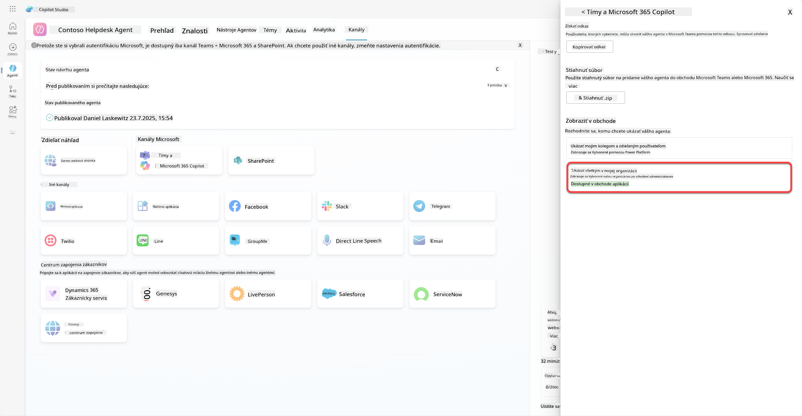

Tu sú dokonca ďalšie možnosti. Váš administrátor môže zmeniť globálnu politiku nastavenia a automaticky nainštalovať Contoso Helpdesk Agent pre všetkých v tenante. Okrem toho - môžete pripnúť Contoso Helpdesk Agent na ľavý panel, aby k nemu mali všetci jednoduchý prístup.

## ✅ Misia splnená

🎉 **Gratulujeme!** Úspešne ste publikovali svojho agenta a pridali ho do Teams a Microsoft 365 Copilot! Ďalšia misia kurzu: Pochopenie licencovania.

⏭️ [Prejsť na lekciu **Pochopenie licencovania**](../12-understanding-licensing/README.md)

## 📚 Taktické zdroje

🔗 [Dokumentácia k publikovacím kanálom](https://learn.microsoft.com/microsoft-copilot-studio/publication-fundamentals-publish-channels)

---

**Zrieknutie sa zodpovednosti**:  
Tento dokument bol preložený pomocou služby AI prekladu [Co-op Translator](https://github.com/Azure/co-op-translator). Hoci sa snažíme o presnosť, prosím, berte na vedomie, že automatizované preklady môžu obsahovať chyby alebo nepresnosti. Pôvodný dokument v jeho rodnom jazyku by mal byť považovaný za autoritatívny zdroj. Pre kritické informácie sa odporúča profesionálny ľudský preklad. Nenesieme zodpovednosť za akékoľvek nedorozumenia alebo nesprávne interpretácie vyplývajúce z použitia tohto prekladu.