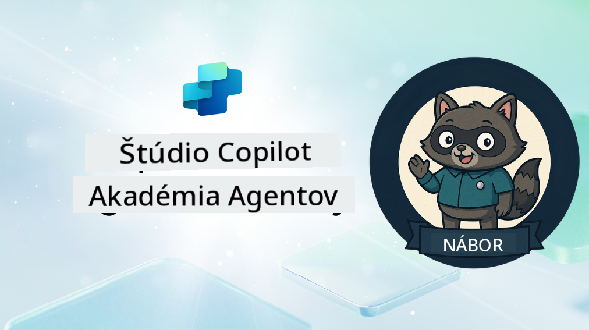

<!--
CO_OP_TRANSLATOR_METADATA:
{
  "original_hash": "8b5ecad9d5d073ea3f4c2b844e80f2e5",
  "translation_date": "2025-10-20T17:05:37+00:00",
  "source_file": "docs/recruit/README.md",
  "language_code": "sk"
}
-->
# Vitaj, Rekrut

**Vitaj, Rekrut.**  
Tvoja misia—ak sa ju rozhodneš prijať—je zvládnuť umenie vytvárania agentov pomocou **Microsoft Copilot Studio**.

Tento praktický tréning je tvojím vstupom do **sveta agentov**: od základných promptov cez Adaptive Cards až po agentové toky. Naučíš sa, ako vytvárať, škálovať a nasadzovať inteligentných agentov pomocou reálnych nástrojov a prípadov použitia.

---

## 🎯 Cieľ misie

Po absolvovaní Agent Academy budeš schopný:

- Pochopiť, čo sú agenti v kontexte Microsoft Copilot Studio
- Preskúmať, ako sa veľké jazykové modely (LLMs), generovanie s podporou vyhľadávania (RAG) a orchestrácia spájajú v agentovi
- Vytvárať **deklaratívnych** aj **vlastných agentov**
- Vylepšiť agentov pomocou **Topics**, **Adaptive Cards** a **Agent Flows**
- Nasadiť agentov do **Microsoft Teams** a **Microsoft 365 Copilot**

---

## 🧪 Predpoklady

Na splnenie všetkých misií budeš potrebovať:

- Microsoft 365 Developer tenant (s povoleným SharePointom)
- Prístup k **Microsoft Copilot Studio** (skúšobná verzia alebo licencovaná)
- Voliteľné: Základné znalosti SharePointu, Power Platform alebo Power Fx

---

## 🧬 Pre koho je určený

Tento kurz je ideálny pre:

- Tvorcov a vývojárov skúmajúcich **Copilot Studio**
- IT profesionálov vytvárajúcich **rozšírenia Microsoft 365 Copilot**
- Nadšencov Power Platform, ktorí chcú **zlepšiť svoje schopnosti** s inteligentnými agentmi
- Každého, kto sa rád učí **prakticky**

---

## 🧭 Prehľad učebného plánu

Táto akadémia je rozdelená do postupných lekcií—každá je navrhnutá ako terénna misia na zlepšenie tvojich schopností pri vytváraní agentov.

| Lekcia | Názov | Popis misie |
|--------|-------|------------------|
| `00` | 🧰 [Nastavenie kurzu](./00-course-setup/README.md) | Nastav svoje vývojové prostredie, skúšobnú verziu Copilot Studio a SharePoint stránku |
| `01` | 🧠 [Úvod do agentov](./01-introduction-to-agents/README.md) | Pochop koncepty konverzačnej AI, LLMs a autonómnych vs. deklaratívnych agentov |
| `02` | 🛠️ [Základy Copilot Studio](./02-copilot-studio-fundamentals/README.md) | Nauč sa stavebné bloky: znalosti, schopnosti, autonómia |
| `03` | 👩‍💻 [Vytvorenie deklaratívneho agenta](./03-create-a-declarative-agent-for-M365Copilot/README.md) | Pridaj vlastného agenta do Microsoft 365 Copilot, založeného na prompte |
| `04` | 🧩 [Vytvorenie riešenia](./04-creating-a-solution/README.md) | Zabal svojho agenta do opakovane použiteľného riešenia pre správu prostredia |
| `05` | 🚀 [Začiatok s predpripravenými agentmi](./05-using-prebuilt-agents/README.md) | Použi a prispôsob šablónu agenta na urýchlenie nastavenia |
| `06` | ✍️ [Vytvorenie vlastného agenta](./06-create-agent-from-conversation/README.md) | Vytvor nový Copilot založený na zdrojoch znalostí |
| `07` | 🧠 [Pridanie témy s triggermi](./07-add-new-topic-with-trigger/README.md) | Použi Topics na definovanie vlastných otázok/odpovedí |
| `08` | 🪪 [Vylepšenie pomocou Adaptive Cards](./08-add-adaptive-card/README.md) | Vytvor Adaptive Card pomocou Power Fx a SharePointu |
| `09` | 🔁 [Automatizácia pomocou Agent Flows](./09-add-an-agent-flow/README.md) | Použi vstup Adaptive Card na spustenie back-endových tokov |
| `10` | 🧭 [Pridanie triggerov udalostí](./10-add-event-triggers/README.md) | Umožni svojmu agentovi konať autonómne pomocou logiky založenej na udalostiach |
| `11` | 📢 [Publikovanie agenta](./11-publish-your-agent/README.md) | Nasadi svojho agenta do Microsoft Teams a Microsoft 365 Copilot |
| `12` | 🪪 [Pochopenie licencovania](./12-understanding-licensing/README.md) | Nauč sa, ako funguje licencovanie a fakturácia v Copilot Studio |
| `13` | 🚨 [Získanie odznaku Rekrut](./course-completion-badges-recruit/README.md) | Získaj svoj odznak a označ svoje dosiahnutie! |

!!! note
    ✅ Dokončením tohto učebného plánu získaš odznak **Rekrut**.  
    🔓 **Operatívny pracovník** a **Veliteľ** budú odomknutí v budúcich fázach.

<!-- markdownlint-disable-next-line MD033 -->

---

**Zrieknutie sa zodpovednosti**:  
Tento dokument bol preložený pomocou služby AI prekladu [Co-op Translator](https://github.com/Azure/co-op-translator). Hoci sa snažíme o presnosť, prosím, berte na vedomie, že automatizované preklady môžu obsahovať chyby alebo nepresnosti. Pôvodný dokument v jeho rodnom jazyku by mal byť považovaný za autoritatívny zdroj. Pre kritické informácie sa odporúča profesionálny ľudský preklad. Nie sme zodpovední za žiadne nedorozumenia alebo nesprávne interpretácie vyplývajúce z použitia tohto prekladu.