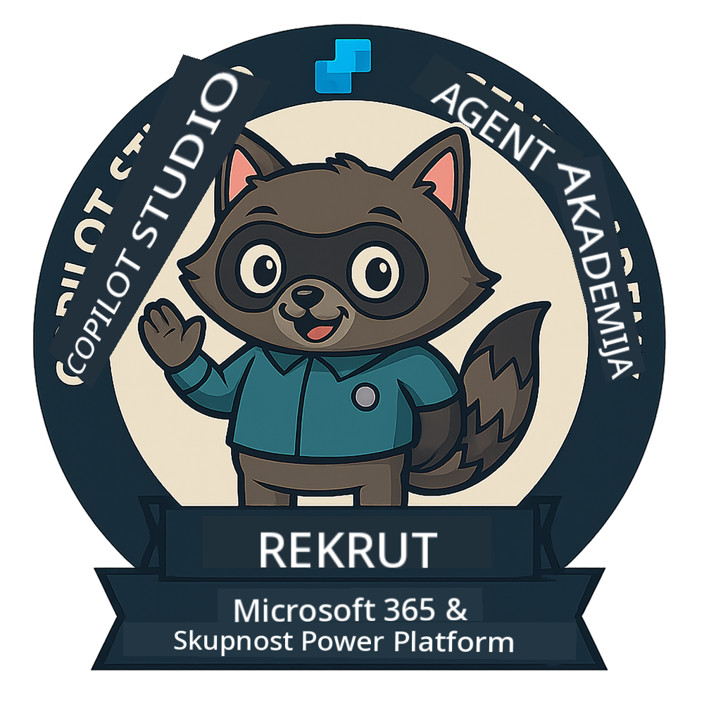
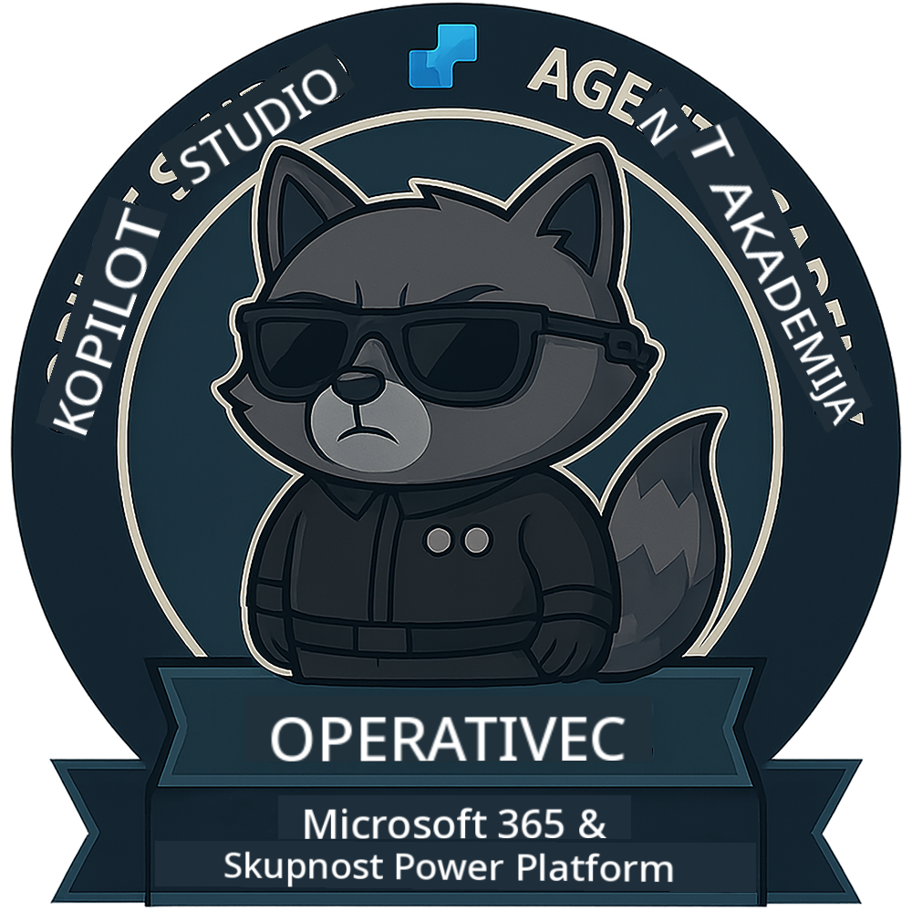
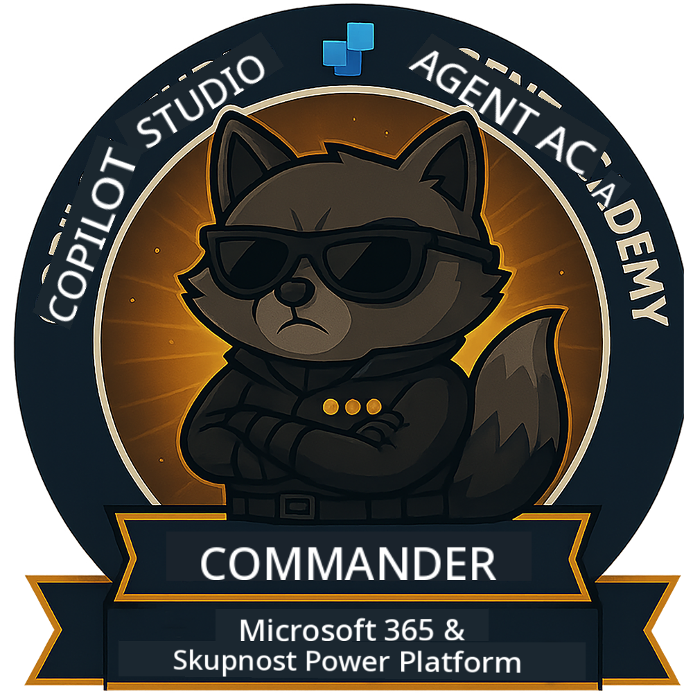

<!--
CO_OP_TRANSLATOR_METADATA:
{
  "original_hash": "15e57e059ce7689d602d7853187235cd",
  "translation_date": "2025-10-20T22:41:25+00:00",
  "source_file": "docs/index.md",
  "language_code": "sl"
}
-->
---
hide:
- navigation
---

# Akademija agentov Copilot Studio

**Dobrodošli v Akademiji agentov Copilot Studio.**  

Vaša naloga—če jo sprejmete—je obvladati umetnost ustvarjanja agentov z uporabo **Microsoft Copilot Studio**.

Ta praktična izobraževalna delavnica je vaš vstop v **svet agentov**: od osnovnih pozivov do prilagodljivih kartic in tokov agentov. Naučili se boste, kako zgraditi, razširiti in implementirati inteligentne agente z uporabo resničnih orodij in primerov uporabe.

---

## 🏅 Napredovanje po stopnjah

**Akademija agentov Copilot Studio** je večfazni izobraževalni program, zasnovan za razvoj vaših veščin skozi tri stopnje agentov. Vsaka stopnja vključuje značko in naraščajoče odgovornosti:

| Stopnja          | Raven | Vizualno |
|------------------|:-----:|----------|
| 🟢 **Rekrut**  [🚀 Začni](https://aka.ms/agent-academy-recruit){ .md-button .md-button--primary }     | •     | { width="300" }     |
| 🔵 **Operativec** (Kmalu na voljo)   | ••    | { width="300" } |
| 🟡 **Poveljnik** (Kmalu na voljo)    | •••   | { width="300" } |

Vsaka stopnja temelji na prejšnji. Dokončajte svojo misijo kot Rekrut in spremljajte novosti, da napredujete v svojih agentnih kvalifikacijah.

---

## 🎒 Drugi tečaji

Oglejte si te druge tečaje za nadaljnje učenje o AI in agentih:

- [Microsoft Copilot Studio <3 MCP Lab](https://aka.ms/mcsmcplab)
- [Copilot Developer Camp](https://microsoft.github.io/copilot-camp/)
- [AI Agenti za začetnike](https://microsoft.github.io/ai-agents-for-beginners/)
- [Protokol konteksta modela (MCP) za začetnike](https://github.com/microsoft/mcp-for-beginners)

---

## 🚑 Težave

Zelo cenimo vaše povratne informacije! Prosimo, uporabite [seznam težav](https://github.com/microsoft/agent-academy/issues) za deljenje svojih komentarjev in težav. Hvala!

---

## 📜 Kodeks ravnanja

Ta projekt je sprejel [Kodeks ravnanja za odprtokodno programsko opremo Microsoft](https://opensource.microsoft.com/codeofconduct/).

!!! info "Viri:"

    - [Kodeks ravnanja za odprtokodno programsko opremo Microsoft](https://opensource.microsoft.com/codeofconduct/)
    - [Pogosta vprašanja o kodeksu ravnanja Microsoft](https://opensource.microsoft.com/codeofconduct/faq/)
    - Kontaktirajte [opencode@microsoft.com](mailto:opencode@microsoft.com) za vprašanja ali pomisleke

---

[⭐️ Ocenite naš repozitorij](https://github.com/microsoft/agent-academy){ .md-button .md-button--primary }

<!-- markdownlint-disable-next-line MD033 -->

---

**Omejitev odgovornosti**:  
Ta dokument je bil preveden z uporabo storitve za prevajanje z umetno inteligenco [Co-op Translator](https://github.com/Azure/co-op-translator). Čeprav si prizadevamo za natančnost, vas prosimo, da upoštevate, da lahko avtomatski prevodi vsebujejo napake ali netočnosti. Izvirni dokument v njegovem maternem jeziku naj se šteje za avtoritativni vir. Za ključne informacije je priporočljivo profesionalno človeško prevajanje. Ne odgovarjamo za morebitne nesporazume ali napačne razlage, ki bi nastale zaradi uporabe tega prevoda.