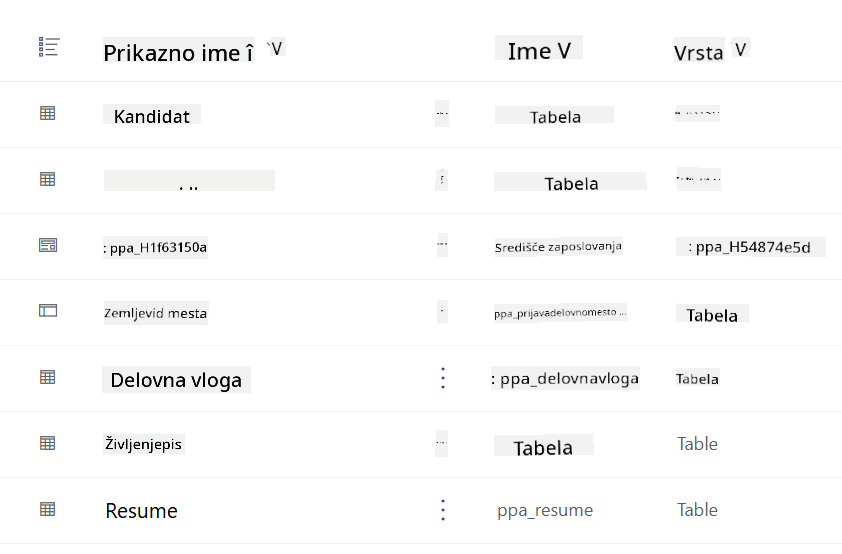
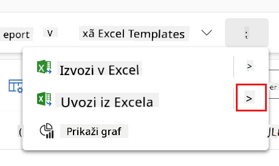
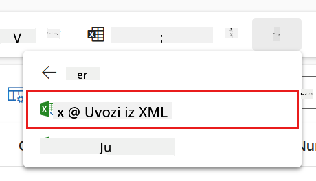
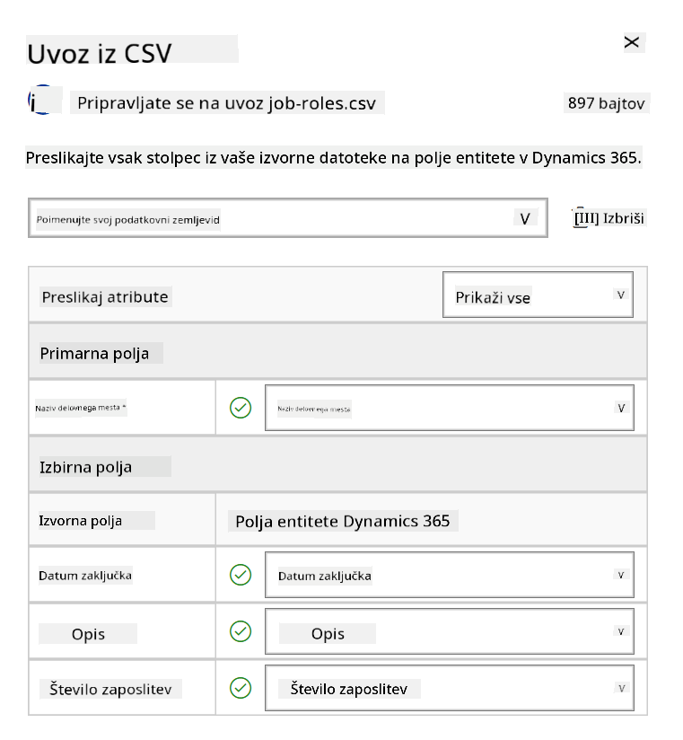
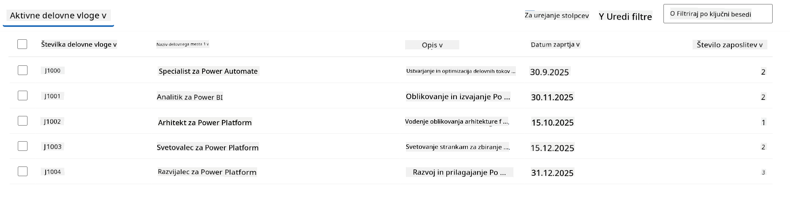
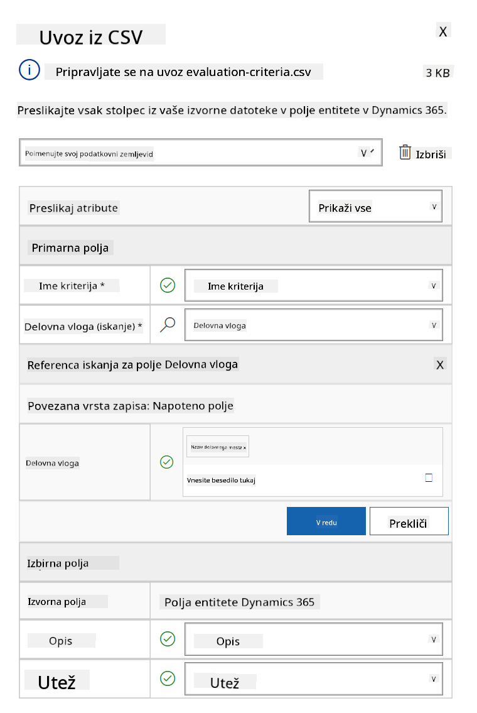
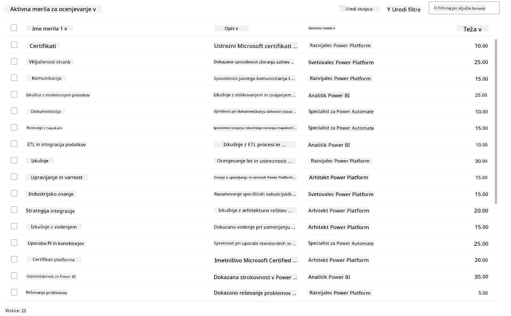

<!--
CO_OP_TRANSLATOR_METADATA:
{
  "original_hash": "2620cf9eaf09a3fc6be7fa31a3a62956",
  "translation_date": "2025-10-20T23:07:18+00:00",
  "source_file": "docs/operative-preview/01-get-started/README.md",
  "language_code": "sl"
}
-->
# 🚨 Misija 01: Začnite z zaposlitvenim agentom

--8<-- "disclaimer.md"

## 🕵️‍♂️ KODNO IME: `OPERACIJA ISKALCA TALENTOV`

> **⏱️ Časovni okvir operacije:** `~45 minut`

## 🎯 Povzetek misije

Dobrodošli, agent. Vaša prva naloga je **Operacija Iskalca Talentov** - vzpostavitev osnovne infrastrukture za sistem za zaposlovanje, ki temelji na umetni inteligenci in bo spremenil način, kako organizacije prepoznavajo in zaposlujejo vrhunske talente.

Vaša naloga, če jo sprejmete, je, da uvedete in konfigurirate celovit sistem za upravljanje zaposlovanja z uporabo Microsoft Copilot Studio. Uvozili boste že pripravljeno rešitev, ki vsebuje vse potrebne podatkovne strukture, nato pa ustvarili svojega prvega AI agenta - **Zaposlitvenega agenta** - ki bo služil kot osrednji koordinator za vse prihodnje operacije zaposlovanja.

Ta začetna uvedba vzpostavlja poveljniški center, ki ga boste nadgrajevali skozi program Agent Academy Operative. To je vaša osnovna baza - temelj, na katerem boste v naslednjih misijah zgradili celotno mrežo specializiranih agentov.

---

## 🔎 Cilji

Z dokončanjem te misije boste:

- **Razumevanje scenarija**: Pridobili celovito znanje o izzivih in rešitvah avtomatizacije zaposlovanja
- **Uvedba rešitve**: Uspešno uvozili in konfigurirali osnovne elemente sistema za upravljanje zaposlovanja
- **Ustvarjanje agenta**: Zgradili zaposlitvenega agenta, ki bo začetek scenarija, ki ga boste razvijali kot operativni agent Akademije agentov

---

## 🔍 Predpogoji

Preden začnete s to misijo, se prepričajte, da imate:

- Licenco za Copilot Studio
- Dostop do okolja Microsoft Power Platform
- Administrativna dovoljenja za ustvarjanje rešitev in agentov

---

## 🏢 Razumevanje scenarija avtomatizacije zaposlovanja

Ta scenarij prikazuje, kako lahko podjetje uporabi Microsoft Copilot Studio za izboljšanje in avtomatizacijo svojega procesa zaposlovanja. Predstavlja sistem agentov, ki sodelujejo pri opravljanju nalog, kot so pregledovanje življenjepisov, priporočanje delovnih mest, priprava gradiv za intervjuje in ocenjevanje kandidatov.

### Poslovna vrednost

Rešitev pomaga kadrovskim ekipam prihraniti čas in sprejemati boljše odločitve z:

- Samodejno obdelavo življenjepisov, prejetih prek e-pošte.
- Predlaganjem ustreznih delovnih mest na podlagi profilov kandidatov.
- Ustvarjanjem prijav na delovna mesta in vodičev za intervjuje, prilagojenih vsakemu kandidatu.
- Zagotavljanjem poštenih in skladnih praks zaposlovanja z vgrajenimi varnostnimi in moderacijskimi funkcijami.
- Zbiranje povratnih informacij za izboljšanje rešitve.

### Kako deluje

- Osrednji **Zaposlitveni agent** koordinira proces in shranjuje podatke v Microsoft Dataverse.
- **Agent za sprejem prijav** bere življenjepise in ustvarja prijave na delovna mesta.
- **Agent za pripravo intervjujev** generira vprašanja za intervjuje in dokumente na podlagi ozadja kandidata.
- Sistem je mogoče objaviti na demo spletni strani, kar omogoča interakcijo deležnikov z njim.

Ta scenarij je idealen za organizacije, ki želijo modernizirati svoje delovne procese zaposlovanja z avtomatizacijo, ki temelji na umetni inteligenci, hkrati pa ohranjati transparentnost, poštenost in učinkovitost.

---

## 🧪 Laboratorij: Nastavitev zaposlitvenega agenta

V tem praktičnem laboratoriju boste vzpostavili temelje za vaš sistem avtomatizacije zaposlovanja. Začeli boste z uvozom vnaprej konfigurirane rešitve, ki vsebuje vse potrebne tabele Dataverse in podatkovne strukture za upravljanje kandidatov, delovnih mest in delovnih procesov zaposlovanja. Nato boste te tabele napolnili z vzorčnimi podatki, ki bodo podpirali vaše učenje skozi ta modul in zagotovili realistične scenarije za testiranje. Na koncu boste v Copilot Studio ustvarili Zaposlitvenega agenta, s čimer boste vzpostavili osnovni pogovorni vmesnik, ki bo temelj za vse druge funkcije, ki jih boste dodali v prihodnjih misijah.

### 🧪 Laboratorij 1.1: Uvoz rešitve

1. Pojdite na **[Copilot Studio](https://copilotstudio.microsoft.com)**
1. Izberite **...** v levem meniju in izberite **Solutions**
1. Kliknite na gumb **Import Solution** na vrhu
1. **[Prenesite](https://raw.githubusercontent.com/microsoft/agent-academy/refs/heads/main/docs/operative-preview/01-get-started/assets/Operative_1_0_0_0.zip)** pripravljeno rešitev
1. Izberite **Browse** in izberite preneseno rešitev iz prejšnjega koraka
1. Kliknite **Next**
1. Kliknite **Import**

!!! success
    Če je uvoz uspešen, boste videli zeleno obvestilo z naslednjim sporočilom:  
    "Rešitev "Operative" je bila uspešno uvožena."

Ko je rešitev uvožena, si oglejte, kaj ste uvozili, tako da izberete prikazno ime rešitve (`Operative`).



Uvožene so naslednje komponente:

| Prikazno ime | Vrsta | Opis |
|--------------|-------|------|
| Kandidat | Tabela | Informacije o kandidatu |
| Merila za ocenjevanje | Tabela | Merila za ocenjevanje za vlogo |
| Hiring Hub | Model-Driven App | Aplikacija za upravljanje procesa zaposlovanja |
| Hiring Hub | Zemljevid mesta | Navigacijska struktura za aplikacijo Hiring Hub |
| Prijava na delo | Tabela | Prijave na delovna mesta |
| Delovna vloga | Tabela | Delovne vloge |
| Življenjepis | Tabela | Življenjepisi kandidatov |

Kot zadnjo nalogo v tem laboratoriju kliknite gumb **Publish all customizations** na vrhu strani.

### 🧪 Laboratorij 1.2: Uvoz vzorčnih podatkov

V tem laboratoriju boste dodali vzorčne podatke v nekatere tabele, ki ste jih uvozili v laboratoriju 1.1.

#### Prenesite datoteke za uvoz

1. **[Prenesite](https://raw.githubusercontent.com/microsoft/agent-academy/refs/heads/main/docs/operative-preview/01-get-started/assets/evaluation-criteria.csv)** CSV-datoteko z merili za ocenjevanje
1. **[Prenesite](https://raw.githubusercontent.com/microsoft/agent-academy/refs/heads/main/docs/operative-preview/01-get-started/assets/job-roles.csv)** CSV-datoteko z delovnimi vlogami

#### Uvoz vzorčnih podatkov za delovne vloge

1. Vrnite se k rešitvi, ki ste jo pravkar uvozili v prejšnjem laboratoriju
1. Izberite **Hiring Hub** Model-Driven App tako, da označite vrstico
1. Kliknite na gumb **Play** na vrhu

    !!! warning
        Morda boste morali ponovno prijaviti. Poskrbite, da to storite. Po prijavi bi morali videti aplikacijo Hiring Hub.

1. Izberite **Job Roles** v levem meniju
1. Kliknite na ikono **More** (tri pike ena pod drugo) v ukazni vrstici
1. Kliknite na **desno puščico** poleg *Import from Excel*

    

1. Izberite **Import from CSV**

    

1. Kliknite na gumb **Choose File**, izberite datoteko **job-roles.csv**, ki ste jo pravkar prenesli, in nato kliknite **Open**
1. Kliknite **Next**
1. Naslednji korak pustite nespremenjen in kliknite **Review Mapping**

    

1. Preverite, ali je preslikava pravilna, in kliknite **Finish Import**

    !!! info
        To bo začelo uvoz, napredek pa lahko spremljate ali takoj zaključite postopek s klikom na **Done**

1. Kliknite **Done**

To lahko traja nekaj časa, vendar lahko kliknete gumb **Refresh**, da preverite, ali je uvoz uspešen.



#### Uvoz vzorčnih podatkov za merila ocenjevanja

1. Izberite **Evaluation Criteria** v levem meniju
1. Kliknite na ikono **More** (tri pike ena pod drugo) v ukazni vrstici
1. Kliknite na **desno puščico** poleg *Import from Excel*

    

1. Izberite **Import from CSV**

    

1. Kliknite na gumb **Choose File**, izberite datoteko **evaluation-criteria.csv**, ki ste jo pravkar prenesli, in nato kliknite **Open**
1. Kliknite **Next**
1. Naslednji korak pustite nespremenjen in kliknite **Review Mapping**

    

1. Zdaj moramo narediti nekaj več dela za preslikavo. Kliknite na povečevalno steklo (ikona 🔎) poleg polja Job Role
1. Prepričajte se, da je tukaj izbrano **Job Title**, če ni - ga dodajte
1. Kliknite **OK**
1. Preverite, ali je preostala preslikava pravilna, in kliknite **Finish Import**

    !!! info
        To bo ponovno začelo uvoz, napredek pa lahko spremljate ali takoj zaključite postopek s klikom na **Done**

1. Kliknite **Done**

To lahko traja nekaj časa, vendar lahko kliknete gumb **Refresh**, da preverite, ali je uvoz uspešen.



### 🧪 Laboratorij 1.3: Ustvarite zaposlitvenega agenta

Zdaj, ko ste zaključili nastavitev predpogojev, je čas za dejansko delo! Najprej dodajmo našega Zaposlitvenega agenta!

1. Pojdite na **[Copilot Studio](https://copilotstudio.microsoft.com)** in se prepričajte, da ste v istem okolju, kjer ste uvozili rešitev in podatke
1. Izberite **Agents** v levem meniju
1. Kliknite na **New Agent**
1. Izberite **Configure**
1. Za **Name** vnesite:

    ```text
    Hiring Agent
    ```

1. Za **Description** vnesite:

    ```text
    Central orchestrator for all hiring activities
    ```

1. Kliknite na **...** poleg gumba *Create* v zgornjem desnem kotu
1. Izberite **Update advanced settings**
1. Kot **Solution** izberite `Operative`
1. Kliknite **Update**
1. Kliknite **Create** v zgornjem desnem kotu

To bo ustvarilo Zaposlitvenega agenta, ki ga boste uporabljali skozi celoten tečaj Operative.

---

## 🎉 Misija zaključena

Misija 01 je zaključena! Zdaj obvladate naslednje veščine:

✅ **Razumevanje scenarija**: Celovito znanje o izzivih in rešitvah avtomatizacije zaposlovanja  
✅ **Uvedba rešitve**: Uspešno uvozili in konfigurirali osnovne elemente sistema za upravljanje zaposlovanja  
✅ **Ustvarjanje agenta**: Zgradili zaposlitvenega agenta, ki je začetek scenarija, ki ga boste razvijali kot operativni agent Akademije agentov  

Naslednja naloga je [Misija 02](../02-multi-agent/README.md): Pripravite svojega agenta na večagentni način z povezanimi agenti.

---

## 📚 Taktični viri

📖 [Microsoft Copilot Studio - Ustvarjanje agenta](https://learn.microsoft.com/microsoft-copilot-studio/authoring-first-bot)  
📖 [Dokumentacija Microsoft Dataverse](https://learn.microsoft.com/power-apps/maker/data-platform)

---

**Omejitev odgovornosti**:  
Ta dokument je bil preveden z uporabo storitve za prevajanje AI [Co-op Translator](https://github.com/Azure/co-op-translator). Čeprav si prizadevamo za natančnost, vas prosimo, da upoštevate, da lahko avtomatizirani prevodi vsebujejo napake ali netočnosti. Izvirni dokument v njegovem maternem jeziku naj se šteje za avtoritativni vir. Za ključne informacije priporočamo profesionalni človeški prevod. Ne prevzemamo odgovornosti za morebitna nesporazumevanja ali napačne razlage, ki izhajajo iz uporabe tega prevoda.