<!--
CO_OP_TRANSLATOR_METADATA:
{
  "original_hash": "75efaf515d5694d4fd549bfd6518901a",
  "translation_date": "2025-10-20T23:16:48+00:00",
  "source_file": "docs/operative-preview/03-automate-triggers/README.md",
  "language_code": "sl"
}
-->
# Misija 03: Dodajanje sprožilcev dogodkov za avtonomno delovanje

--8<-- "disclaimer.md"

## 🕵️‍♂️ KODNO IME: `OPERACIJA SIGNALNA TOČKA`

> **⏱️ Časovni okvir operacije:** `~45 minut`

## 🎯 Povzetek misije

Dobrodošli nazaj, agent. V [Misiji 02](../02-multi-agent/README.md) ste se naučili, kako zgraditi otroškega agenta za sprejem aplikacij in povezanega agenta za pripravo na intervju, da razširite zmogljivosti vašega glavnega agenta za zaposlovanje.

Vaša naloga, če jo sprejmete, je **Operacija Signalna Točka** - poglobitev v **sprožilce dogodkov** - dvig vašega sistema agentov iz reaktivnega v **avtonomno delovanje**. Vaše agente boste preoblikovali iz tistih, ki _odgovarjajo na vprašanja_, v tiste, ki _predvidevajo potrebe_ in _delujejo neodvisno_. S pomočjo sprožilcev dogodkov in avtomatiziranih delovnih tokov bo vaš agent za zaposlovanje zaznal prihajajoče e-pošte z življenjepisi, samodejno obdelal priloge, shranil podatke v Dataverse in obvestil vašo ekipo za zaposlovanje prek Microsoft Teams - vse to, medtem ko se vi osredotočate na naloge z višjo vrednostjo.

Dobrodošli v svetu, kjer se avtomatizacija sreča z inteligenco.

## 🔎 Cilji

V tej misiji se boste naučili:

1. Kako sprožilci dogodkov omogočajo avtonomno vedenje agentov brez interakcije uporabnika
1. Razlike med interaktivnimi in avtonomnimi agenti v Copilot Studio
1. Kako ustvariti sprožilce dogodkov, ki samodejno obdelajo e-poštne priloge in naložijo datoteke v Dataverse
1. Kako zgraditi delovne tokove agentov, ki objavljajo prilagodljive kartice v kanalih Teams za obvestila
1. Kako prenašati podatke med sprožilci dogodkov in delovnimi tokovi agentov za avtomatizacijo od začetka do konca

## 🤔 Kaj je sprožilec dogodka?

Prej v [Recruit](../../recruit/10-add-event-triggers/README.md) smo se naučili o sprožilcih dogodkov. Naredimo kratek povzetek, če ste to zamudili.

**Sprožilci dogodkov** omogočajo agentu, da _deluje_ samostojno, ko se nekaj zgodi v drugem sistemu - brez potrebe po sporočilu uporabnika. Ko se sproži konfiguriran dogodek - na primer "nov element v SharePointu", "nova e-pošta", "dodeljena naloga v Plannerju" ali celo časovno ponavljajoč dogodek, konektor pošlje sprožilni paket vašemu agentu. Agent nato sledi vašim navodilom, da se odloči, katere ukrepe ali teme bo izvedel.

### Ključne značilnosti

- **Avtonomna aktivacija:**
      - Za razliko od sprožilcev tem, ki se začnejo, ko uporabnik piše agentu, se sprožilci dogodkov sprožijo zaradi zunanjih dogodkov, kar omogoča proaktivno vedenje.

- **Pogon s podatki:**
      - Vsak dogodek dostavi paket (spremenljivke + opcijska navodila) prek konektorja. Agent uporabi vaša določena navodila in paket, da izbere, kaj bo naredil naprej.
      - Na primer _pokliče temo_ ali _izvede ukrepe, določene z orodji_.

- **Primeri iz škatle:**
      - Datoteka ali element ustvarjen v SharePoint/OneDrive
      - Naloga v Plannerju zaključena/dodeljena
      - Odgovor na Microsoft Forms poslan
      - Ponavljanje/urnik

    Razpoložljivost je odvisna od podatkovnih politik vaše organizacije, konfiguriranih v Power Automate.

- **Zahteva generativno orkestracijo:**
      - Sprožilci dogodkov so na voljo le, ko je za agenta omogočena generativna orkestracija.

- **Obračunavanje/uporaba:**
      - Vsaka dostava sprožilca šteje kot sporočilo v zmogljivosti Copilot Studio.
      - Na primer, ponavljanje vsakih 10 minut pošlje sporočilo vsakih 10 minut.

- **Model avtentikacije in nastavitev:**
      - Sprožilce dodate v pregled agenta, pod _Sprožilci_. Avtentikacija za konektor sprožilca uporablja račun ustvarjalca agenta ("avtentikacija avtorja agenta").
      - Parametre sprožilca in paket lahko urejate v portalu Power Automate.

- **Testiranje in opazovanje:**
      - Sprožilce lahko testirate iz testnega okna agenta in preverite vedenje z aktivnostnim zemljevidom pred objavo.

!!! info "Povzetek za razvijalce"

    Pomislite na sprožilce dogodkov kot na **signale podobne webhookom**, ki potisnejo strukturiran paket v vašega agenta, kar mu omogoča, da _začne_ delo in poveže ukrepe med sistemi - brez čakanja na zahtevo uporabnika.

### Sprožilci tem - kako se razlikujejo

Prej ste se naučili o sprožilcih tem v [Recruit](../../recruit/07-add-new-topic-with-trigger/README.md), vendar se morda še vedno sprašujete, kako se _sprožilci tem_ razlikujejo od _sprožilcev dogodkov_ in zakaj je ta razlika pomembna za razumevanje, kaj naredi agenta avtonomnega.

Sprožilci tem nadzorujejo _kdaj_ se tema zažene, običajno kot odziv na sporočilo uporabnika.

- V generativni orkestraciji je privzeti sprožilec **Po agentu** - načrtovalec izbere temo, katere ime/opis najbolje ustreza sporočilu uporabnika.
- V klasični orkestraciji je privzeti sprožilec **Fraze** - načrtovalec izbere temo, ko ena ali več sprožilnih fraz najbolje ustreza sporočilu uporabnika.

Drugi tipi sprožilcev vključujejo `Prejeto sporočilo`, `Prejet dogodek`, `Prejeta aktivnost`, `Posodobitev pogovora`, `Prejeto povabilo`, `Preusmeritev`, `Neaktivnost` in `Zaključen načrt`.

!!! info "Osnovna razlika"

    Sprožilci tem so _začetniki aktivnosti pogovora_ znotraj klepeta.
    
    Sprožilci dogodkov so _začetniki sistemskih dogodkov_, dostavljeni prek konektorjev, ki lahko zaženejo agenta brez kakršnegakoli pogovora.

### Hiter vodič: Sprožilec teme vs. Sprožilec dogodka

- **Sprožilec teme:** Uporabnik (ali aktivnost v klepetu) reče/naredi X ➡️ zaženi temo T.
- **Sprožilec dogodka:** SharePoint/Planner/E-pošta/Časovnik sproži dogodek s paketom P ➡️ agent oceni navodila ➡️ ustrezno pokliče ukrepe/teme.

## 🏓 Primerjava interaktivnega agenta in avtonomnega agenta

Zdaj, ko poznate razliko med sprožilci dogodkov in sprožilci tem, se naučimo še razlike med interaktivnim agentom in avtonomnim agentom.

V terminologiji Copilot Studio "interaktivni" pomeni agente, ki se primarno vključujejo prek **tem** v klepetu ali kanalu. "Avtonomni" pa pomeni agente, ki uporabljajo tudi **sprožilce dogodkov**, da delujejo brez vnosa uporabnika.

Naslednja tabela povzema njihove razlike in podobnosti.

| Dimenzija                           | Interaktivni agent     | Avtonomni agent                                                                                              |
|-------------------------------------|-----------------------|---------------------------------------------------------------------------------------------------------------|
| Kako se začne                       | Uporabnik (ali aktivnost v klepetu) sproži temo. Primer: Po agentu, Fraze, Prejeto sporočilo.   | Zunanji sprožilec dogodka pošlje paket prek konektorja agentu. Primer: SharePoint, Planner, e-pošta, urnik itd. |
| Primarna uporaba                    | Vprašanja in odgovori, vodeni delovni tokovi, zahteve v klepetu - Teams, splet itd.  | Proaktivne operacije in avtomatizacija v ozadju - odziv na spremembe sistema in nato obveščanje, shranjevanje ali organizacija nalog. |
| Površina sprožilca                  | Sprožilci tem: Po agentu / Fraze / Prejeto sporočilo / Tipi aktivnosti / Povabilo / Neaktivnost / Zaključen načrt | Knjižnica sprožilcev dogodkov prek konektorjev; paket vključuje podatke dogodka + opcijska navodila. |
| Načrtovalec (generativna orkestracija) | Močno uporabljen za sprožilce Po agentu in Zaključen načrt za izbiro/sekvenciranje tem. | Zahtevano za sprožilce dogodkov; agent uporablja navodila + paket za odločitev, katere ukrepe/teme poklicati. |
| Tipičen primer                     | Uporabnik vpraša "Kakšna je naša politika vračila?" → Tema se zažene, poizveduje po znanju, odgovori. | Nova naloga v Plannerju dodeljena → Sprožilec dogodka se sproži → Agent objavi sporočilo v Teams, posodobi zapis ali pokliče temo. |
| Pot nastavitve                      | Ustvarite teme, določite tip sprožilca, napišite dialog/ukrepe; objavite v kanalih. | Dodajte sprožilec dogodka (Pregled → Sprožilci), avtenticirajte konektor z avtorjevim računom agenta, konfigurirajte paket/navodila; testirajte prek testnega okna; objavite. |
| Avtentikacija in upravljanje        | Deluje v kontekstu kanala/avtentikacije; sprožilci tem se odzivajo na aktivnosti klepeta v dovoljenih kanalih. | Razpoložljivost sprožilcev je odvisna od podatkovnih politik Power Automate; konektorji delujejo pod računom ustvarjalca agenta. |
| Opazovanje                         | Testirajte teme znotraj Copilot Studio, preverite transkripte pogovorov/aktivnosti. | Uporabite Testni sprožilec in aktivnostni zemljevid za preverjanje izvedbe pred objavo, spremljajte aktivnosti po objavi. |
| Vpliv na zmogljivost                | Vsako sporočilo uporabnika/odziv agenta je sporočilo, ki porabi zmogljivost. | Vsaka dostava dogodka je prav tako sporočilo, plus morebitni nadaljnji ukrepi. Primer: ponavljanje vsakih 10 minut = 6 sporočil/uro |

### Kdaj uporabiti katerega?

- Izberite **sprožilce tem (interaktivni)**, ko uporabniki začnejo pogovor z agentom - FAQ, vodeni sprejem, ali naloge v slogu ukazov znotraj klepeta. Sprožilec Po agentu zmanjša ročno kuriranje fraz.
- Dodajte **sprožilce dogodkov (avtonomni)**, ko naj bi agent začel pogovor ali sam izvedel ukrep - ob posodobitvah v SharePoint/Dataverse, prihajajoči e-pošti ali po urniku. To vas premakne iz reaktivnih v proaktivne operacije.

## Nasveti za razvijalce in opozorila

1. **Omogočite generativno orkestracijo** za vsakega agenta, ki ga želite narediti avtonomnega. Sprožilci dogodkov se sicer ne bodo prikazali.

1. **Modelirajte paket zgodaj.** Odločite se, katere minimalne podatke vaš agent potrebuje od sprožilca, kot so `itemId`, `assignedTo`, `dueDate`, in dodajte jedrnata navodila, ki agentu povedo, kateri ukrep/temo naj pokliče glede na vrednosti paketa.

1. **Obseg avtentikacije je pomemben.** Sprožilci se avtenticirajo z uporabo računa ustvarjalca agenta. Prepričajte se, da ima ta račun ustrezna dovoljenja za konektor in da je v skladu s podatkovnimi politikami Power Automate.

1. **Nadzorujte stroške in šum.** Visokofrekvenčna ponavljanja ali zelo "klepetavi" viri lahko hitro povečajo porabo sporočil - kjer je mogoče, omejite ali dodajte pogoje v sprožilec za filtriranje dogodkov.

1. **Testirajte pred objavo.** Uporabite **Testni sprožilec** in aktivnostni zemljevid za spremljanje načrta in izvedenih ukrepov - iterirajte navodila/paket, dokler vedenje ni stabilno.

## 🧪 Laboratorij 03 - Avtomatizacija e-poštnih sporočil s prijavami kandidatov

Naslednje bomo dodali sprožilec dogodka v **Agenta za zaposlovanje** in zgradili delovni tok agenta v otroškem **Agentu za sprejem aplikacij**, da omogočimo nadaljnjo obdelavo za avtonomijo.

### ✨ Scenarij uporabe

!!! info ""

    **Kot** HR kadrovik

    **Želim** biti obveščen, ko v moj nabiralnik prispe e-pošta z življenjepisom, ki je bila samodejno naložena v Dataverse

    **Da lahko** ostanem obveščen o življenjepisih, poslanih po e-pošti za prijave, ki so samodejno naloženi v Dataverse

To bomo dosegli z dvema tehnikama:

1. Sprožilec dogodka, ko prispe e-pošta,
    1. Preverite, ali je `contentType` datoteke enak `PDF` kot tip formata.
    1. Izvlecite datoteko in jo naložite v Dataverse z ukrepi prek konektorja Dataverse.
    1. Nato pošljite poziv agentu za nadaljnjo obdelavo s prenosom vhodnih parametrov iz ukrepov Dataverse.

1. Delovni tok agenta bo dodan otroškemu **Agentu za sprejem aplikacij**, ki ga sproži poziv v sprožilcu dogodka.
    1. Uporabite vhodne parametre, poslane iz poziva sprožilca dogodka, v prilagodljivi kartici, objavljeni v kanalu Microsoft Teams, da obvestite ekipo za zaposlovanje. Prilagodljiva kartica bo vsebovala povezavo do vrstice v Dataverse, ki bo vidna v **Agentu za zaposlovanje**.

Začnimo!

### ✨ Predpogoji za dokončanje te misije

Potrebovali boste **bodisi**:

- **Zaključeno Misijo 01 in Misijo 02** ter pripravljenega Agenta za zaposlovanje, **ALI**
- **Uvožen začetni paket za Misijo 03**, če začenjate na novo ali morate nadoknaditi. [Prenesi začetni paket za Misijo 03](https://aka.ms/agent-academy)

!!! note "Uvoz rešitve in vzorčni podatki"
    Če uporabljate začetni paket, si oglejte [Misijo 01](../01-get-started/README.md) za podrobna navodila o tem, kako uvoziti rešitve in vzorčne podatke v vaše okolje.

Potrebovali boste tudi dostop do **Microsoft Teams**, da dokončate drugi del laboratorijske vaje za objavo prilagodljive kartice v Microsoft Teams.

### Laboratorij 3.1 - Avtomatizacija nalaganja življenjepisov v Dataverse, prejetih po e-pošti

1. V Agentu za zaposlovanje se pomaknite navzdol na **Pregledni zavihek** in izberite **+ Dodaj sprožilec**.

       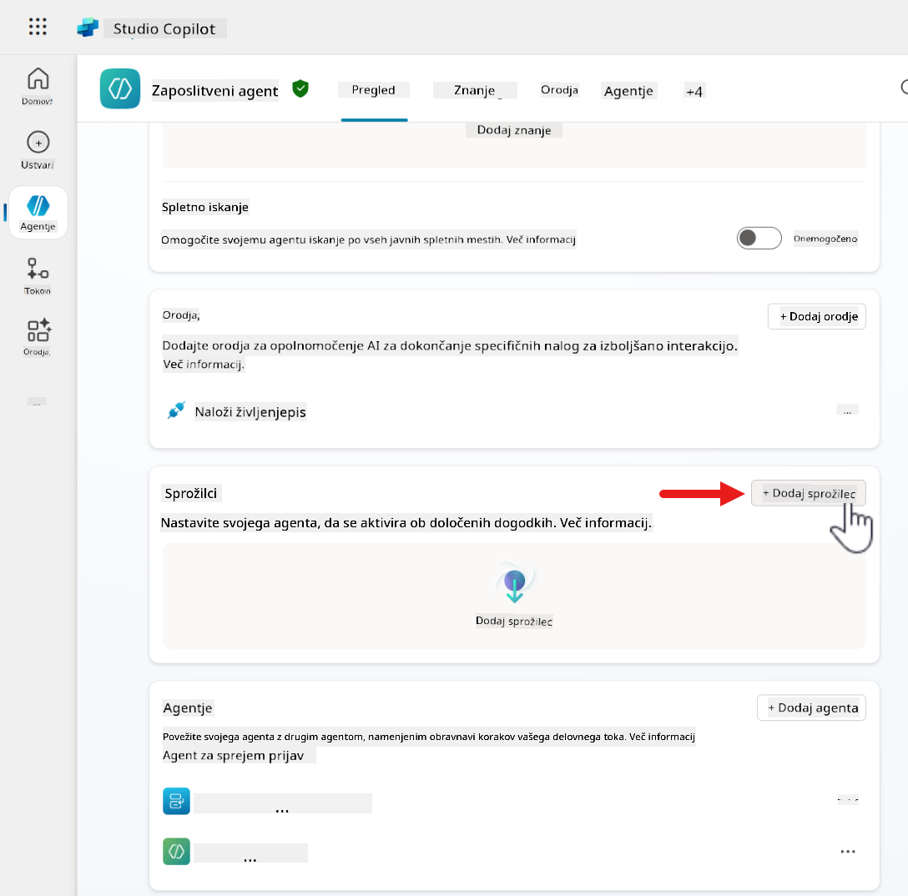

1. Prikazal se bo seznam sprožilcev. Izberite **Ko prispe nova e-pošta (V3)** in izberite **Naprej**.

       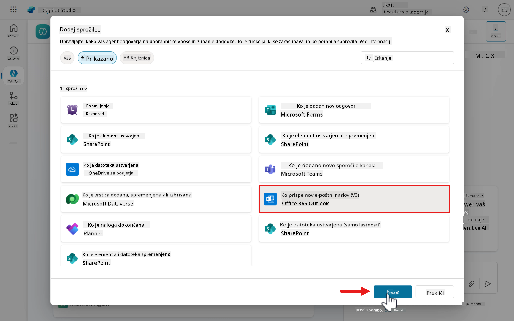

1. Zdaj boste videli **Ime sprožilca** in **Prijavo** za povezave aplikacij.

       Preimenujte ime sprožilca v naslednje,
    
       ```text
       Ko prispe nova e-pošta od kandidata
       ```

       Prepričajte se, da vidite zeleno kljukico pri vsaki od povezav aplikacij. Če ne vidite zelene kljukice, se prijavite prek elipse (...) in izberite **+ Nova povezava** za ustvarjanje nove povezave.

       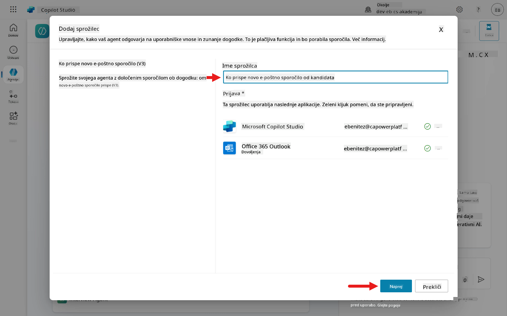

1. Zadnji korak je nastavitev vhodnih lastnosti sprožilca. Posodobite naslednje lastnosti na naslednje vrednosti,

     | Lastnost | Kako nastaviti | Podrobnosti |
     |----------|----------------|-------------|
     | **Vklju
Zdaj bomo posodobili sprožilec dogodka, da dodamo več avtomatizacijskih zmogljivosti. Izberite **tri pike (...)** pri sprožilcu in izberite **Uredi v Power Automate**.

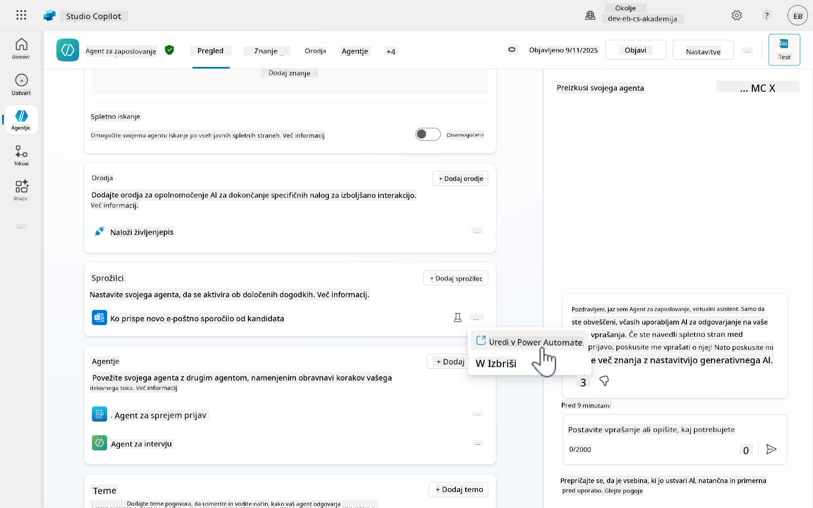

1. Sprožilec se bo nato naložil kot tok v portalu za ustvarjanje Power Automate. Kar vidite, je oblikovalec tokov v portalu za ustvarjanje Power Automate. Tukaj lahko dodamo dodatno logiko in dejanja za večjo avtomatizacijo. Sprožilec se bo pojavil na vrhu, sledilo pa bo **Pošlje poziv določenemu copilotu za obdelavo** kot zadnje dejanje v toku.

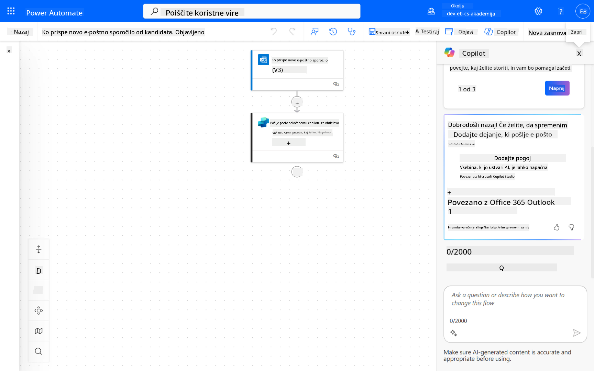

1. Privzeto lahko sprožilec **Ko prispe novo e-poštno sporočilo** v Power Automate obdeluje več e-poštnih sporočil hkrati, če jih več prispe naenkrat, in za celoten paket zažene tok le enkrat.

   Da zagotovite, da se tok zažene ločeno za vsako e-pošto, omogočite nastavitev **Split On** v nastavitvah sprožilca in v polju za spustni seznam izberite `@triggerOutputs()?['body/value']`.

   Z omogočeno nastavitvijo **Split On** in poljem za niz nastavljenim na `@triggerOutputs()?['body/value']` se bo tok izvajal posamično za vsako sporočilo, tudi če jih več prispe hkrati.

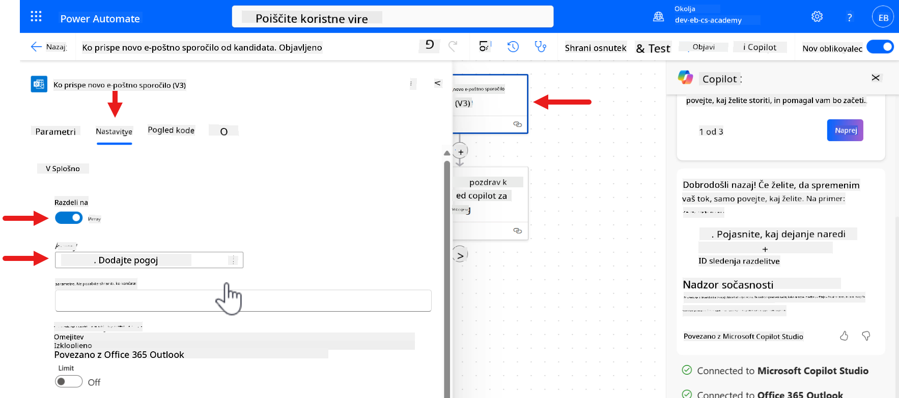

1. Nato bomo dodali nekaj logike za preverjanje vrste datoteke priloge. Želimo naložiti samo priloge datotek .PDF in ne slik (te bi lahko bile iz podpisov e-pošte). Izberite ikono **+** pod sprožilcem in izberite **Control** v razdelku **Vgrajena orodja**.

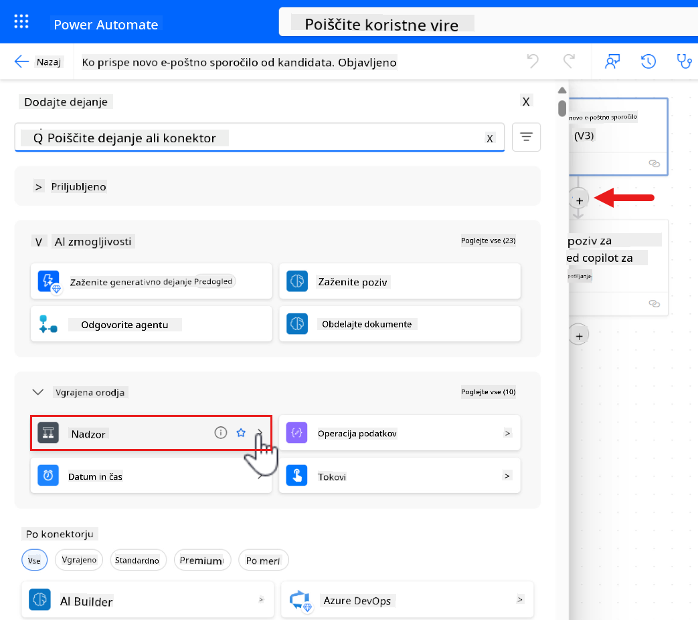

1. Izberite dejanje **Condition**.

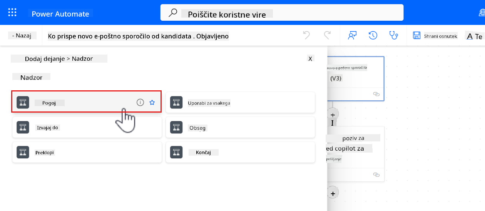

1. Zdaj konfiguriramo pogoj za preverjanje, ali je vrsta datoteke priloge .PDF. V polju **Izberite vrednost** izberite **ikono strele** ali **ikono fx** na desni strani.

   1. V polju **Iskanje** vnesite naslednje,

      ```text
      content type
      ```

   1. Nato izberite parameter **Attachments Content-Type** iz sprožilca.

   1. Nato izberite **Dodaj**, da dodate dinamični vhod vsebine v parameter **Id** dejanja.

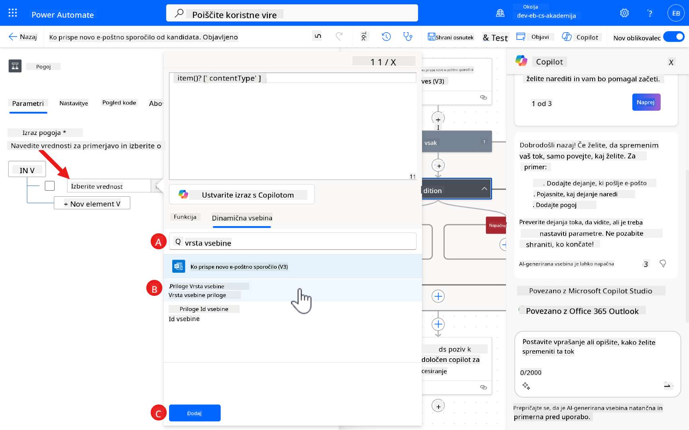

1. Tukaj se za trenutek ustavimo, verjetno ste opazili, da se je samodejno pojavilo dejanje **For each**.

   Izberite dejanje **For each**. To dejanje predstavlja zanko skozi vsako prilogo v e-pošti, saj je parameter **Attachments Content-Type** iz sprožilca povezan z vsako prilogo.

   V ozadju je to niz, zato je bilo dejanje **For each** samodejno dodano, ko smo izbrali parameter **Attachments Content-Type** v dejanju **Condition**.

   Če želite izvedeti več o tem, razširite naslednji dodatni učni blok.

??? info "Dodatno učenje: Samodejno pojavljanje dejanja For each"

🤔 **Zakaj se "Apply to each" ali "For each" samodejno pojavi?**

Ko izberete parameter (dinamično vsebino), ki predstavlja seznam ali niz elementov - na primer seznam prilog, e-poštnih sporočil ali vrstic - Power Automate prepozna, da morda želite obdelati vsak element posebej.

Da bi vam pri tem pomagal, Power Automate samodejno doda zanko **“Apply to each”** (ali **For each**) okoli vašega dejanja. To zagotavlja, da se vaše dejanje izvede enkrat za vsak element na seznamu, namesto da bi poskušalo obdelati celoten seznam naenkrat (kar bi lahko povzročilo napake).

🦋 **Primer**

- Če izberete "Attachments" iz prejšnjega dejanja (kar je niz) in poskušate uporabiti v dejanju, ki pričakuje eno datoteko, Power Automate ovije vaše dejanje v zanko **"Apply to each"** (ali **For each**). 
- Na ta način se vaše dejanje izvede za **vsako prilogo** - eno za drugo.

💡 **Ključne točke**

- **Samodejno:** Zanka se pojavi samodejno, da vam pomaga obdelati vsak element v zbirki.
- **Preprečuje napake:** Brez zanke bi vaše dejanje lahko spodletelo, ker ne more obdelati več elementov hkrati.
- **Vizualni namig:** To je vizualni način, ki prikazuje, da se bo vaš tok ponovil za vsak element na seznamu.

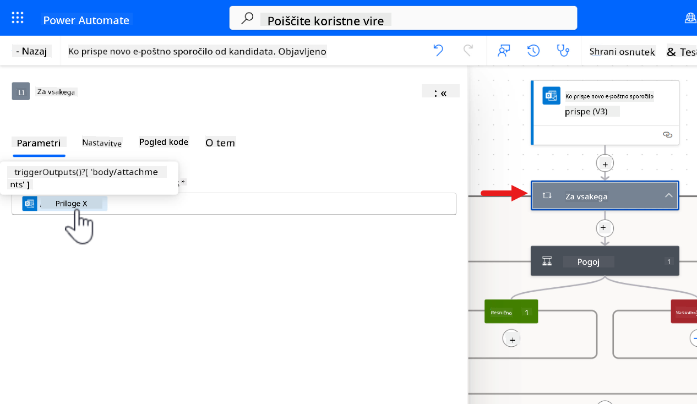

1. Nato v drugo polje **Izberite vrednost** vnesite naslednje,

   ```text
   application/pdf
   ```

   To bo zagotovilo, da bo za vsako datoteko priloge preverjeno, ali je format datotečne končnice .PDF.

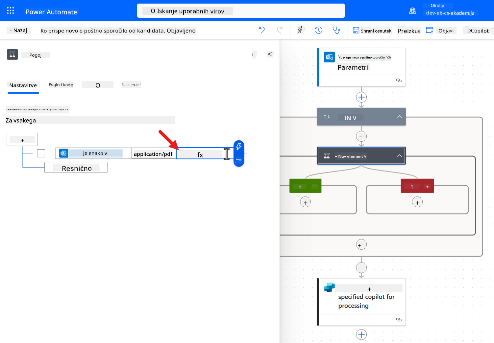

1. Zdaj bomo konfigurirali pot **True**, da izvlečemo datoteko iz e-pošte in jo naložimo v tabelo **Resume** v Dataverse.

   Dodajte novo dejanje spodaj v poti **True** in poiščite `html to text`. Izberite dejanje **Html to text**.

   Če želite izvedeti več o dejanju **Html to text**, razširite naslednji dodatni učni blok.

??? info "Dodatno učenje: Dejanje Html to text"

🤔 **Kaj je dejanje "HTML to text"?**

Dejanje **HTML to text** v Power Automate se uporablja za pretvorbo vsebine, oblikovane v HTML, v navadno besedilo. To je še posebej uporabno, ko prejmete podatke (kot so e-poštna sporočila, spletna vsebina ali odgovori API), ki vsebujejo HTML oznake, in želite izvleči samo berljivo besedilo brez kakršnega koli oblikovanja ali kode.

⚙️ **Kako deluje?**

- **Vhod:** Posredujete niz HTML vsebine (na primer telo e-pošte).
- **Izhod:** Dejanje odstrani vse HTML oznake in vrne samo navadno besedilo.

👍🏻 **Kdaj ga uporabiti?**

- Ko želite izvleči berljivo besedilo iz e-poštnih sporočil, spletnih strani ali odgovorov API, ki vsebujejo HTML.
- Pred pošiljanjem vsebine sistemom, ki ne podpirajo HTML oblikovanja (kot so SMS, Teams sporočila ali baze podatkov).
- Za čiščenje podatkov za nadaljnjo obdelavo ali analizo.

🔭 **Kje ga najti?**

- V Power Automate za Agent Flows poiščite dejanje z imenom `HTML to text`. Nahaja se pod konektorjem **Data Operations**.

💡 **Ključne točke**

- Odstrani vse HTML oznake in pusti samo besedilo.
- Ne interpretira ali izvaja skriptov/stilov - samo odstrani oznake.
- Uporabno za čiščenje podatkov in pripravo vsebine za izhode v navadnem besedilu.

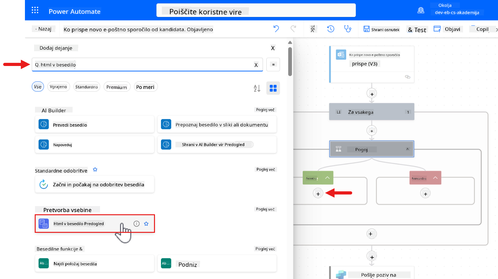

1. Nato moramo ustvariti novo referenco povezave za dejanje **Html to text** z izbiro **Dodaj novo**.

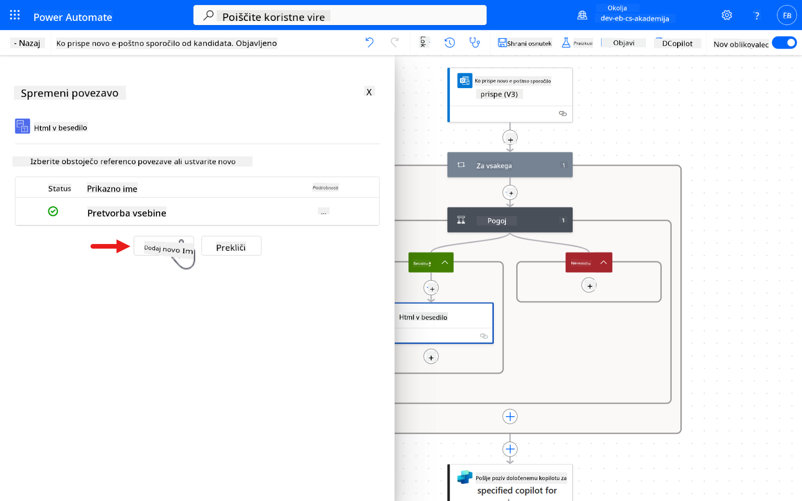

1. Dejanje je zdaj mogoče konfigurirati. Dodajmo parameter **Body** iz sprožilca. V polju **Vsebina** izberite **ikono strele** ali **ikono fx** na desni strani.

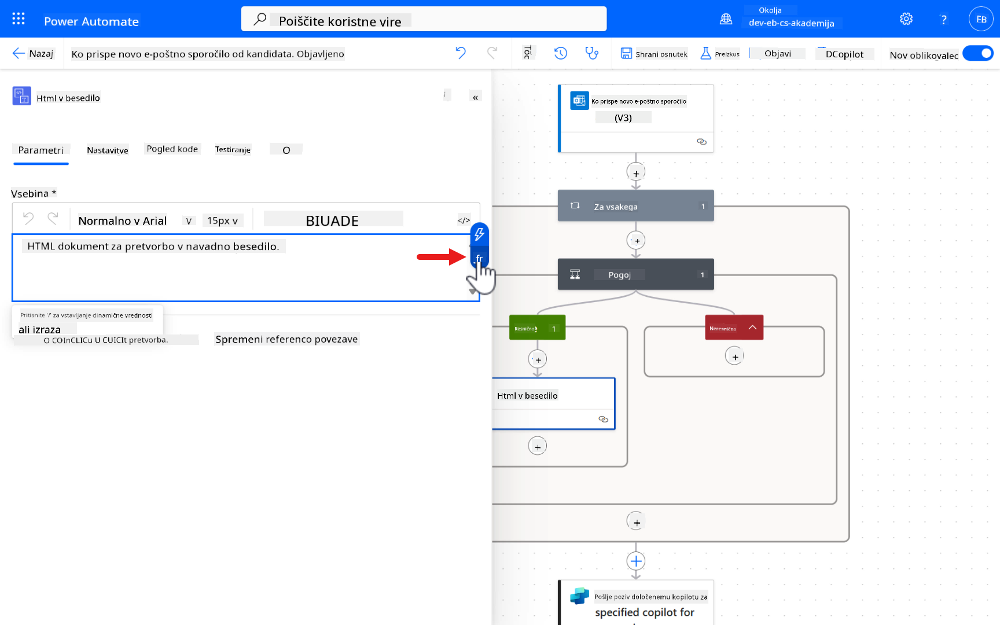

1. Na zavihku **Dinamična vsebina** poiščite `body` in izberite parameter **Body**, nato izberite **Dodaj**.

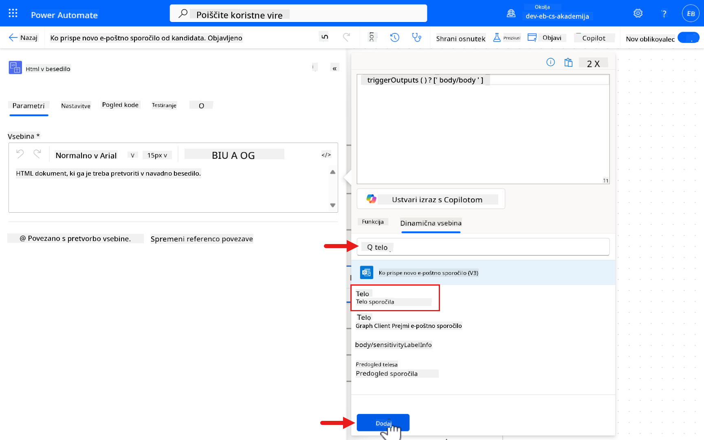

1. Konfiguracijo tega dejanja smo zaključili, zato izberite dvojne kotne oklepaje («), ki kažejo na levo, da zaprete ploščo.

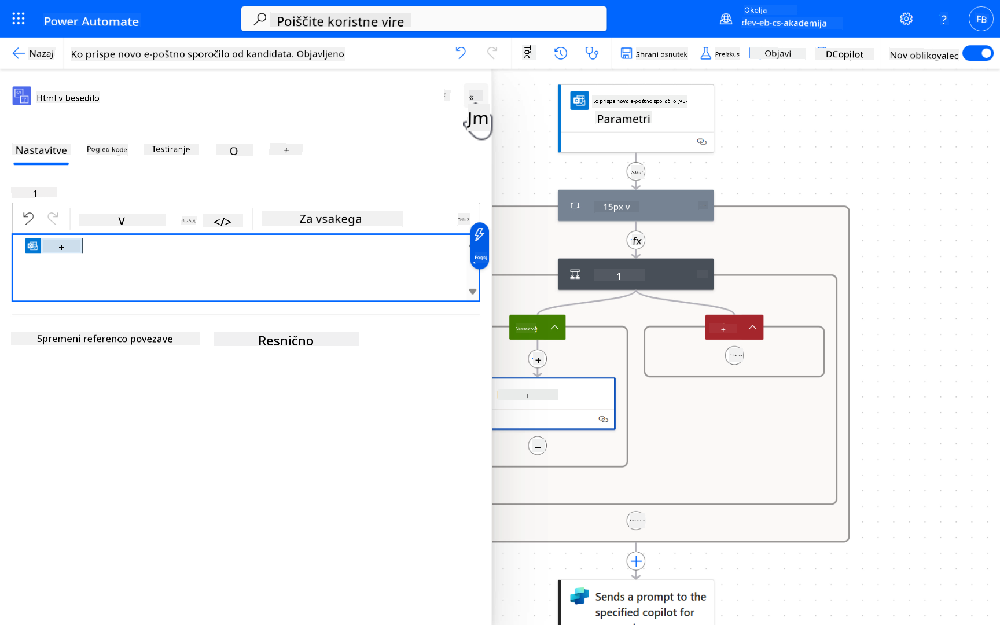

1. Dodali bomo novo dejanje z izbiro **ikone +** pod dejanjem **Html to text**, kar bo naložilo ploščo za dodajanje dejanj. Izberite konektor **Microsoft Dataverse**.

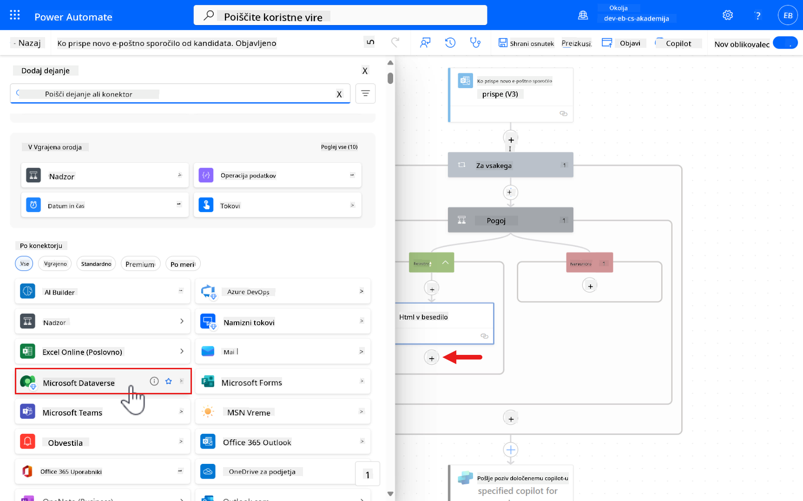

1. Izberite dejanje **Dodaj novo vrstico**.

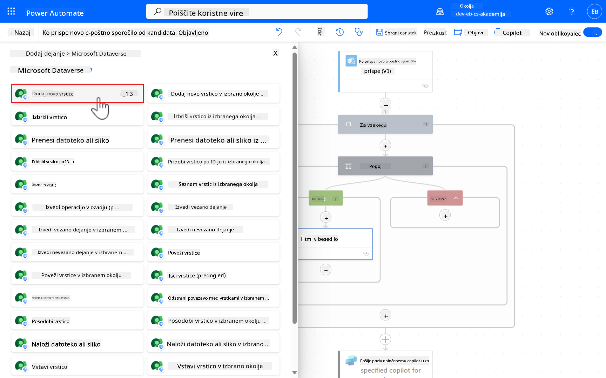

1. Preimenujte dejanje z izbiro **Tri pike (...)**, kopirajte in prilepite naslednje kot ime,

```text
Dodaj novo vrstico za življenjepis
```

Za parameter **Ime tabele** poiščite `res` in izberite tabelo **Resumes**.

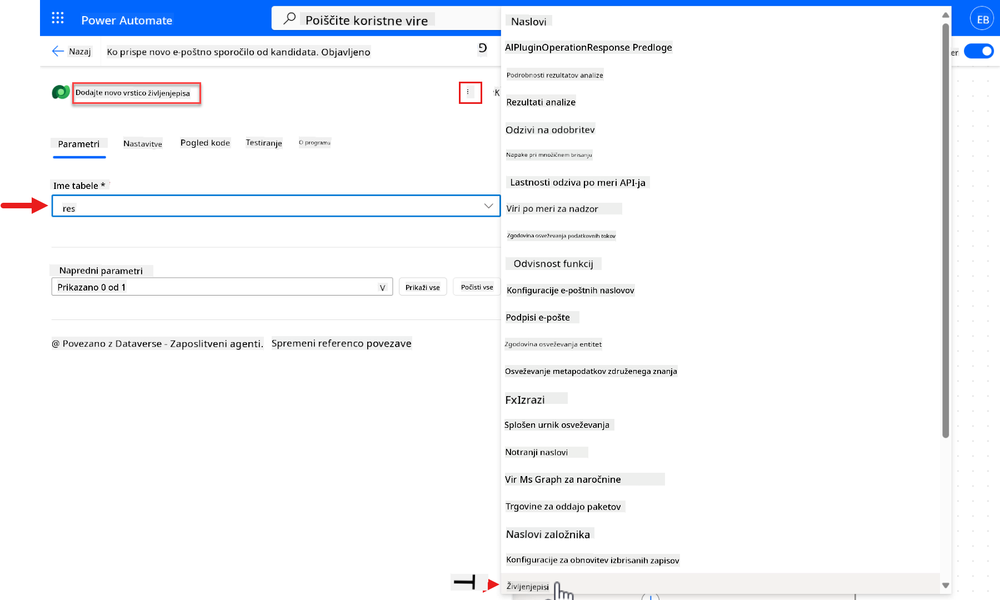

1. Nato izberite polje **Naslov življenjepisa** in izberite **ikono strele** ali **ikono fx** na desni strani.

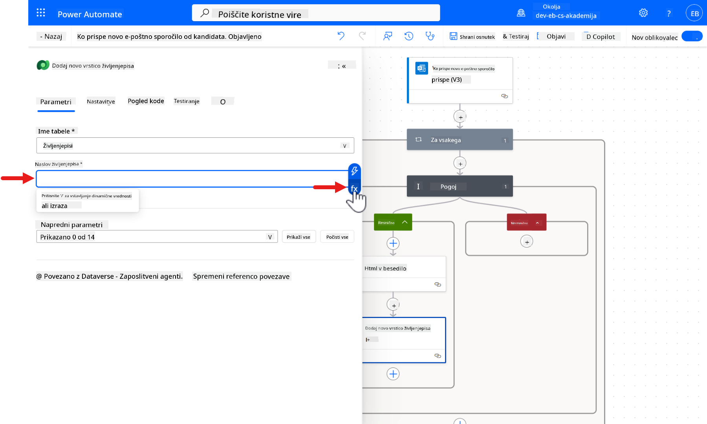

1. Na zavihku **Funkcija** vnesite naslednji izraz, ki uporablja funkcijo `item()`.

```text
item()?['name']
```

Če želite izvedeti več o funkciji `item()`, razširite naslednji dodatni učni blok.

??? info "Dodatno učenje: Funkcija `item()`"

🤔 **Kaj je funkcija `item()`?**

- Ko uporabite dejanje **Apply to each**, Power Automate prehaja skozi vsak element v zbirki (nizu).
- Najpogosteje se uporablja znotraj dejanj, kot so **Apply to each** (ali **For each**), **Select** ali **Filter array**.

⚙️ **Kako deluje?**

- Funkcija `item()` vrne trenutni element, ki se obdeluje v zanki ali operaciji niza.
- Znotraj te zanke `item()` se nanaša na _trenutni element_, ki se obdeluje.

📌 **Kje jo uporabiti?**

- **Apply to each:** za dostop do lastnosti trenutnega elementa.
- **Select:** za pretvorbo vsakega elementa v nizu.
- **Filter array:** za sklicevanje na trenutni element, ki se ocenjuje.

🦋 **Primer**

- Izraz znotraj zanke:
       -  `item()?['Email']`
- To pridobi lastnost `Email` trenutnega elementa.

💡 **Ključne točke**

- `item()` je _odvisen od konteksta_: vedno se nanaša na trenutni element v zanki ali operaciji niza, v kateri ste.
- Če gnezite zanke, lahko uporabite `items('ImeZanke')`, da se sklicujete na elemente v določeni zanki.

Izberite **Dodaj**, da dodate izraz v parameter **Naslov življenjepisa**.

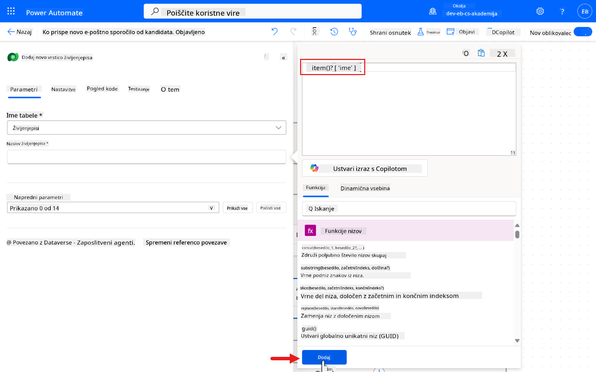

1. Še vedno moramo konfigurirati več parametrov, izberite **Prikaži vse** in v polju **Motivacijsko pismo** izberite **ikono strele** ali **ikono fx** na desni strani.

Na zavihku **Funkcija** vnesite naslednji izraz, ki uporablja isti izraz kot v prejšnji [misiji](../02-multi-agent/README.md).

```text
if(greater(length(body('Html_to_text')), 2000), substring(body('Html_to_text'), 0, 2000), body('Html_to_text'))
```

Ta izraz preveri, ali je _besedilo_ iz dejanja **Html to text** daljše od 2000 znakov, in če je, vrne le prvih 2000 znakov; sicer vrne celotno besedilo.

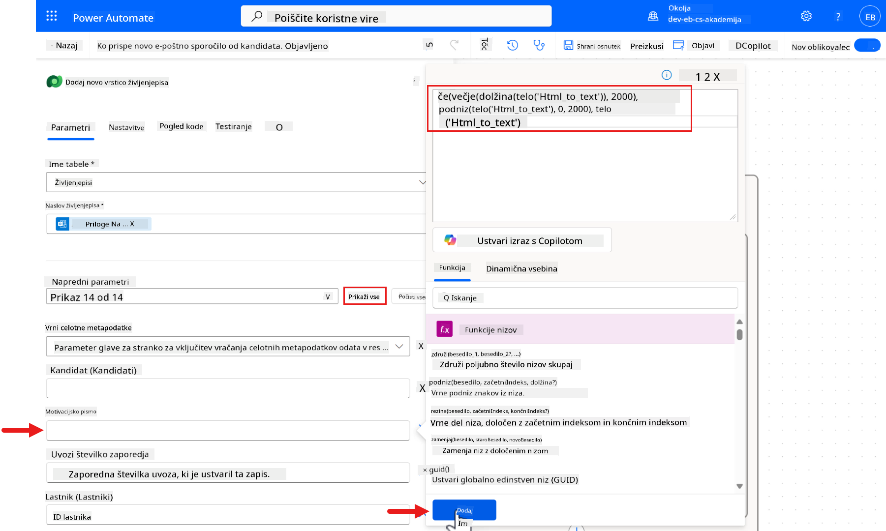

1. Izraz bo zdaj dodan v polje **Motivacijsko pismo**.


1. Za polje **E-poštni naslov pošiljatelja** poiščite `from` in izberite parameter **From** iz sprožilca, saj vsebuje vrednost e-poštnega naslova.

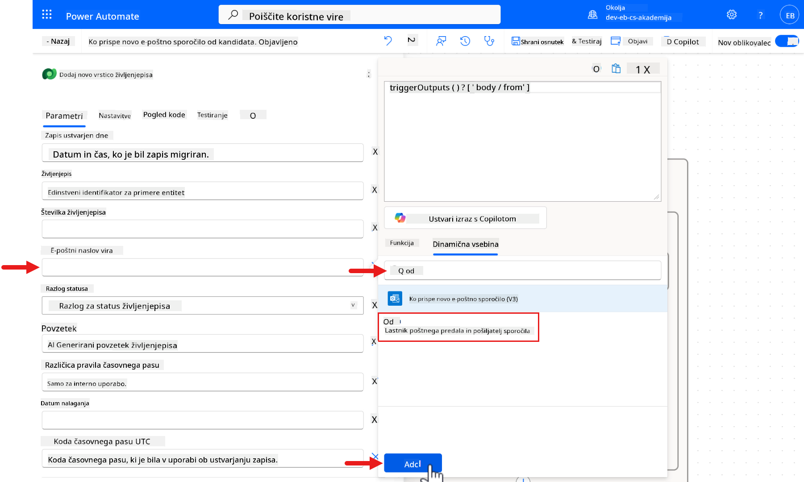

1. Za polje **Datum nalaganja** izberite **ikono strele** ali **ikono fx** na desni strani. Na zavihku **Funkcija** vnesite naslednji izraz, ki uporablja funkcijo `utcNow()`.

```text
utcNow()
```

Če želite izvedeti več o funkciji `utcNow`, razširite naslednji dodatni učni blok.

??? info "Dodatno učenje: Funkcija `utcNow`"

🤔 **Kaj je funkcija `utcNow()`?**

- Funkcija utcnow() v Power Automate vrne trenutni datum in čas v koordiniranem univerzalnem času (UTC) v formatu ISO 8601, kot je: `2025-09-23T04:32:14Z`

🦋 **Primer**

- Izraz:
       -  `concat('Poročilo ustvarjeno dne ', utcnow())`
- Izhod je:
       - Poročilo ustvarjeno dne `2025-09-23T04:32:14Z`

💡 **Ključne točke**
- **Brez potrebnih argumentov (vhodnih parametrov):** vedno vrne trenutni UTC časovni žig.
   - **Uporaba**
       - Dodajanje časovnih žigov v dnevnike ali imena datotek
       - Primerjava trenutnega časa z drugimi datumi
       - Načrtovanje ali pogoji, ki temeljijo na času

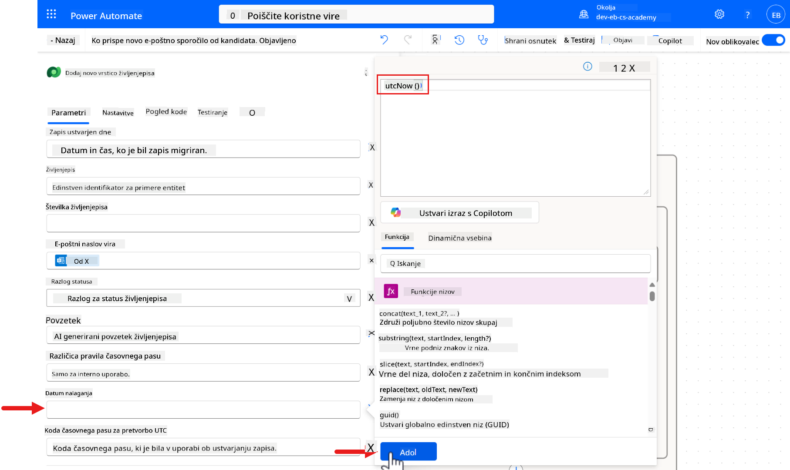

1. Zdaj smo zaključili konfiguracijo akcije **Dodaj novo vrstico življenjepisa**, zato zapustimo ploščo tako, da jo zapremo.

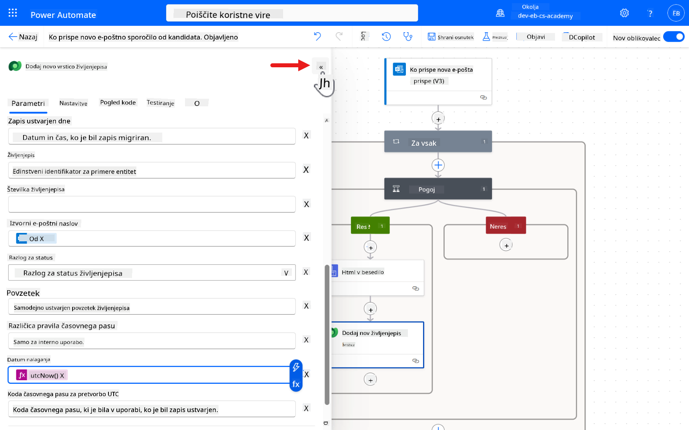

1. Dodali bomo novo akcijo tako, da izberemo **ikono +** pod akcijo **Dodaj novo vrstico življenjepisa**, kar bo naložilo ploščo za dodajanje akcij. Ponovno izberite konektor **Microsoft Dataverse**.

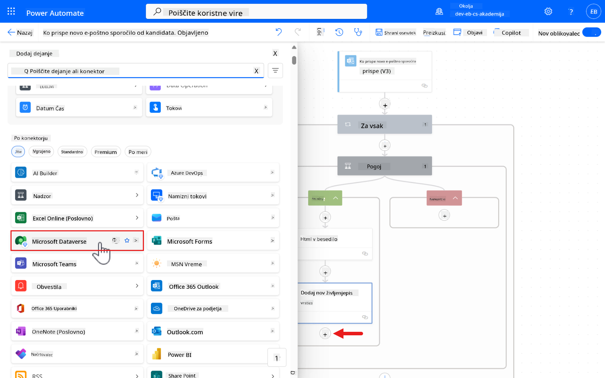

1. Izberite akcijo **Naloži datoteko ali sliko**.

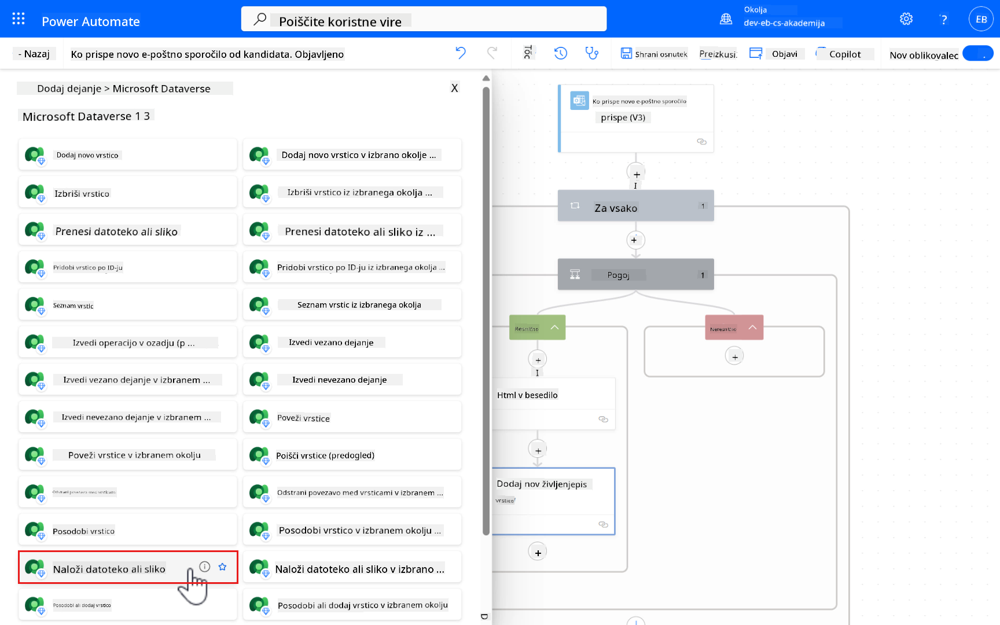

1. Preimenujte akcijo tako, da izberete **Tri pike (...)**, kopirate in prilepite naslednje kot ime:

```text
Naloži datoteko življenjepisa
```

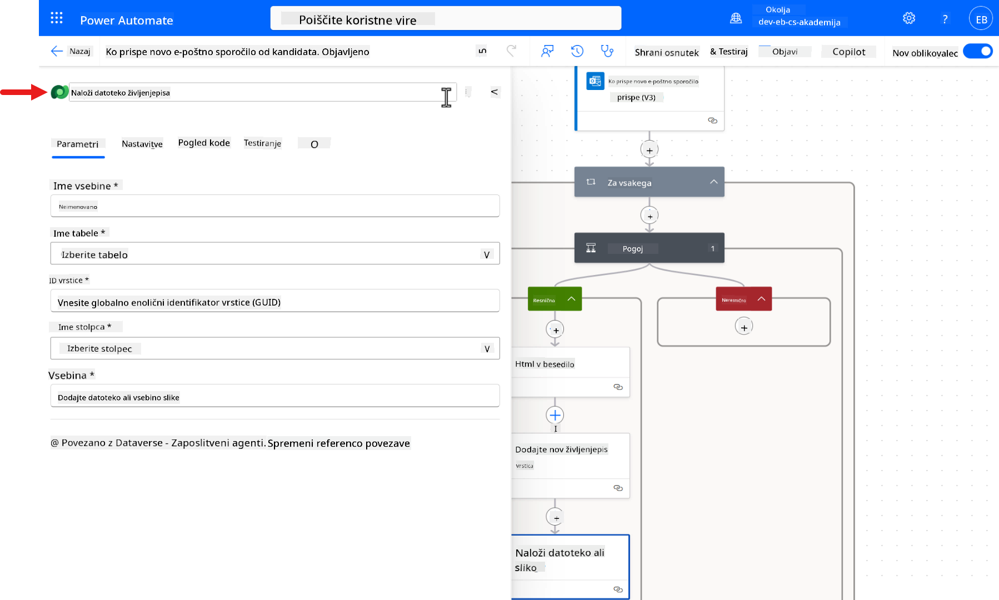

1. Nato izberite polje **Ime vsebine** in izberite **ikono strele** ali **ikono fx** na desni strani.

V zavihku **Funkcija** vnesite naslednji izraz, ki uporablja funkcijo `item()`. Ta pridobi lastnost `name` trenutnega elementa (priponka datoteke).

```text
item()?['name']
```

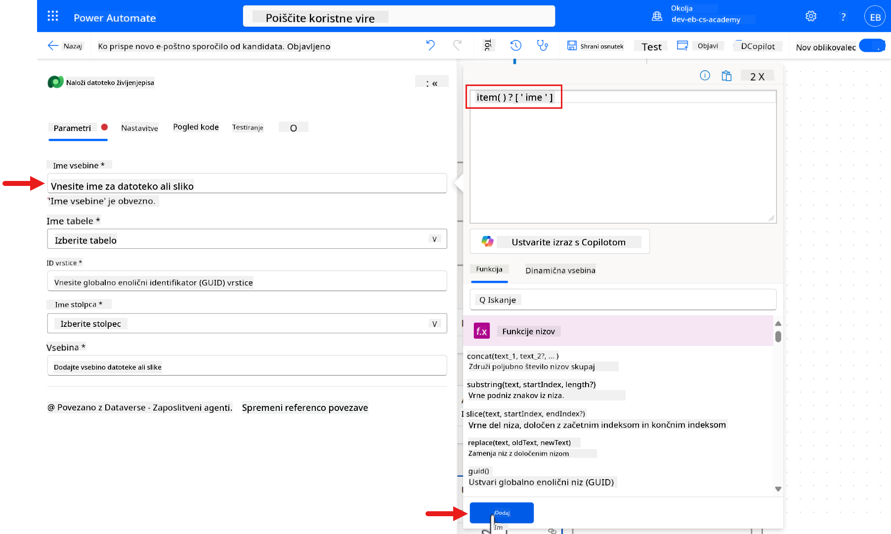

1. Za parameter **Ime tabele** poiščite `res` in izberite tabelo **Življenjepisi**.

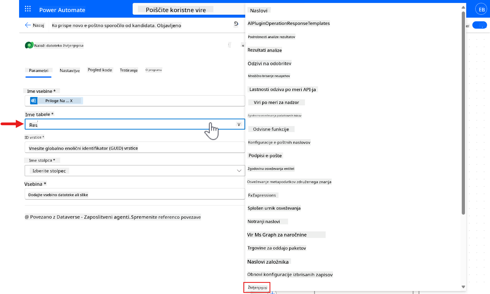

1. Nato izberite polje **ID vrstice** in izberite **ikono strele** ali **ikono fx** na desni strani.

Poiščite `ID` in izberite parameter **Življenjepis** iz akcije _Dodaj novo vrstico_ Dataverse, saj ta vsebuje vrednost ID vrstice, v katero želite naložiti datoteko PDF.

Izberite **Dodaj**.

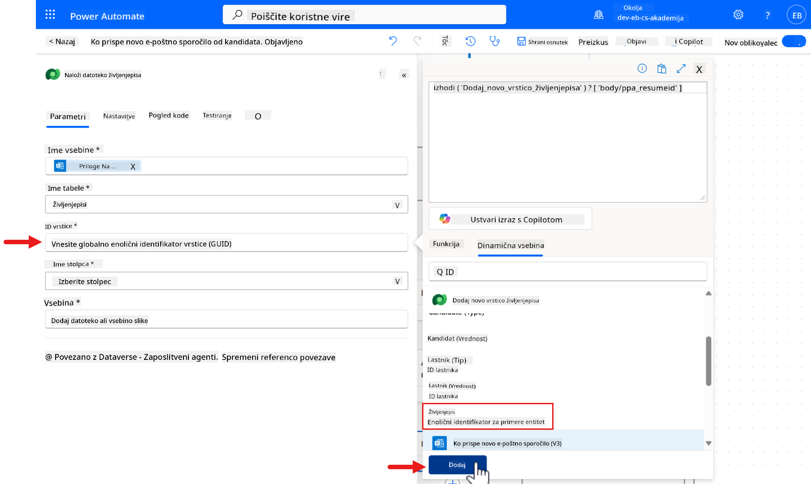

1. Izberite polje **Ime stolpca** in izberite možnost **PDF življenjepisa**.

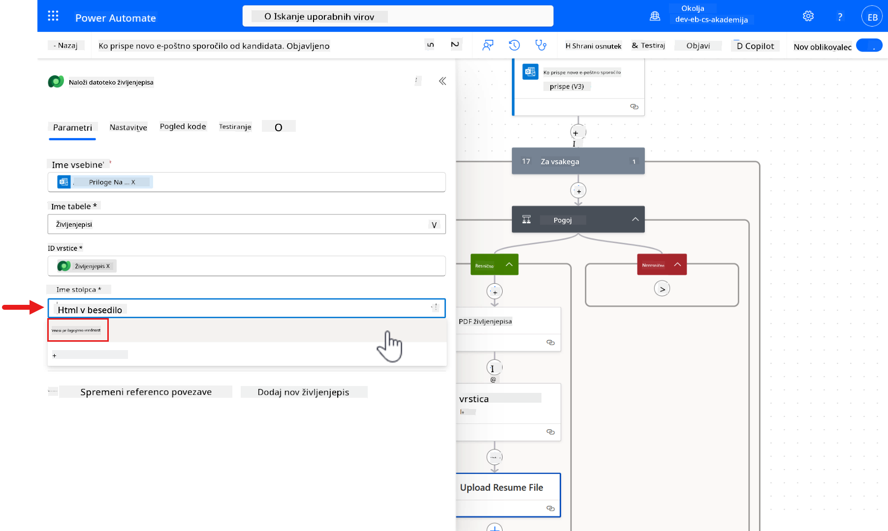

1. Izberite polje **Vsebina** in izberite **ikono strele** ali **ikono fx** na desni strani.

V zavihku **Funkcija** vnesite naslednji izraz, ki uporablja funkcijo `item()`. Ta pridobi lastnost `contentBytes` trenutnega elementa (priponka datoteke). `contentBytes` se nanaša na surove binarne podatke datoteke ali priponke, kodirane kot Base64 niz.

```text
item()?['contentBytes']
```

1. Zaključili smo konfiguracijo te akcije, zato zapustimo akcijo tako, da izberemo dvojne kotne oklepaje («), ki kažejo na levo, da zapremo ploščo.

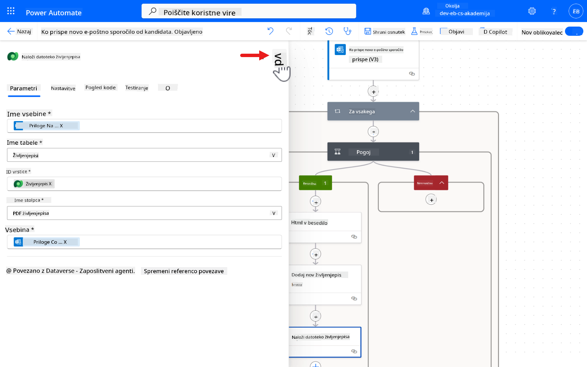

1. Nato izberite **Pošlji poziv določenemu copilotu za obdelavo**, nato pa povlecite in spustite to akcijo pod akcijo **Naloži datoteko življenjepisa** na _True_ poti pogoja.

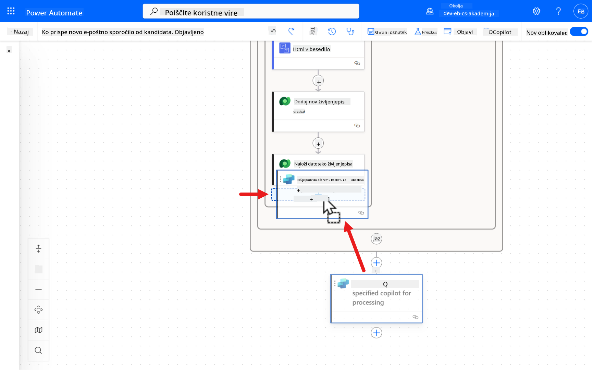

1. Izberite **Pošlji poziv določenemu copilotu za obdelavo**, da ga konfigurirate.

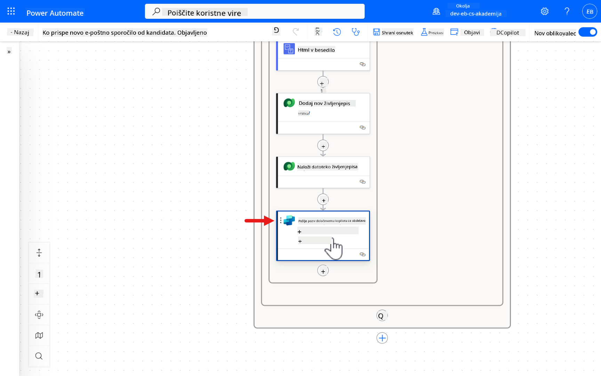

1. V polju **Telo/sporočilo** izberite vso vsebino polja in jo izbrišite.

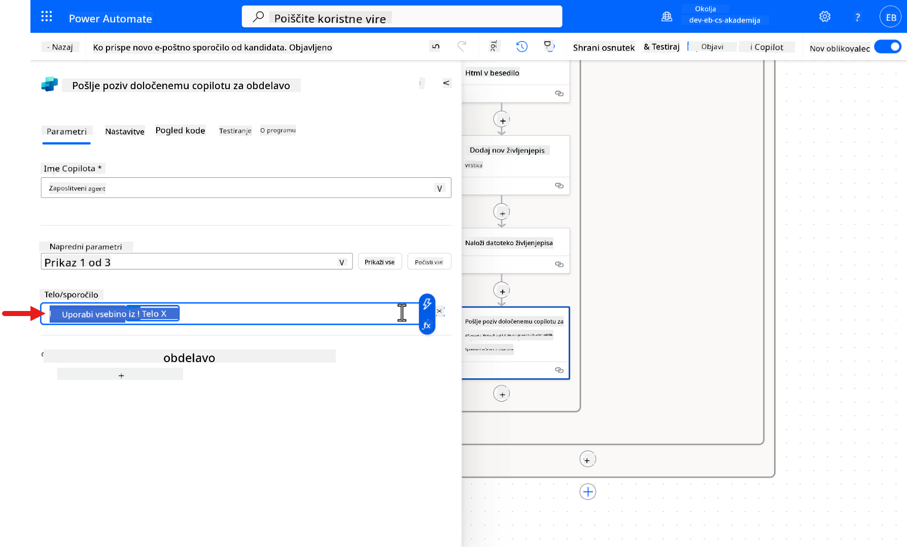

1. Kopirajte in prilepite naslednje besedilo v polje **Telo/sporočilo** ter označite `RESUME ID PLACEHOLDER`.

```text
Pošlji [ResumeId (text)] = "RESUME ID PLACEHOLDER" in [ResumeTitle (text_1)] = "RESUME TITLE PLACEHOLDER" in [ResumeNumber (text_2)]= "RESUME NUMBER PLACEHOLDER" orodju "Obvesti kanal Teams Applicant" v podrejenem agentu "Agent za sprejem prijav"
```

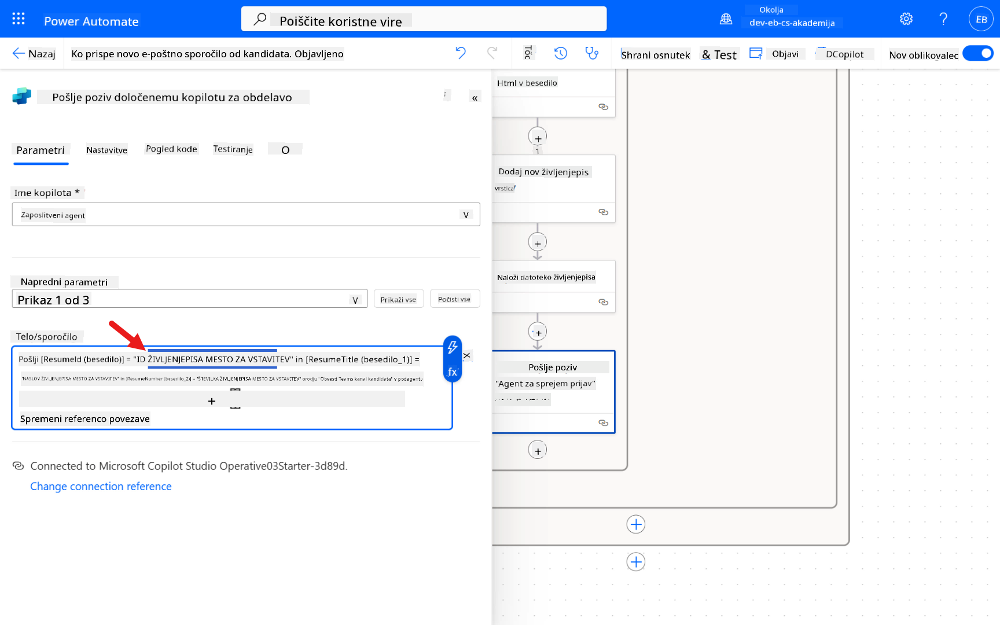

1. Izberite **ikono strele** ali **ikono fx** na desni strani.

Poiščite `resume` in izberite parameter **Življenjepis** iz akcije _Dodaj novo vrstico Dataverse_, saj ta vsebuje vrednost `ID` vrstice življenjepisa, ki je bila ustvarjena.

Izberite **Dodaj**.

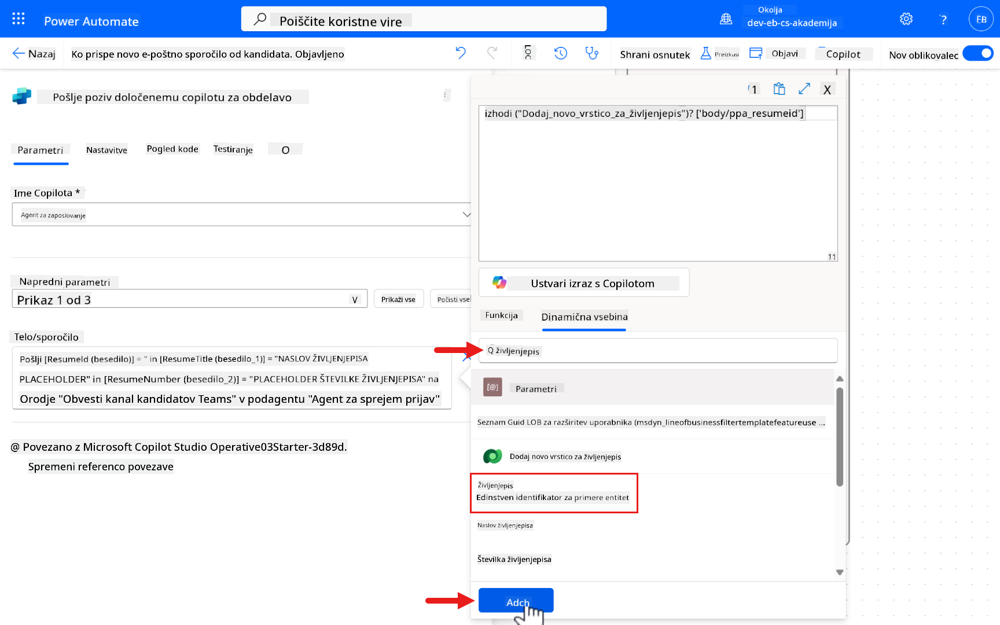

1. Označite `RESUME TITLE PLACEHOLDER`. Izberite **ikono strele** ali **ikono fx** na desni strani.

Poiščite `title` in izberite parameter **Naslov življenjepisa** iz akcije _Dodaj novo vrstico Dataverse_, saj ta vsebuje vrednost `naslov življenjepisa` vrstice življenjepisa, ki je bila ustvarjena.

Izberite **Dodaj**.

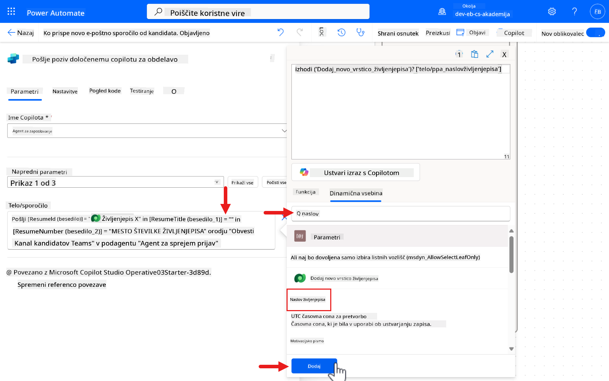

1. Označite `RESUME NUMBER PLACEHOLDER`. Izberite **ikono strele** ali **ikono fx** na desni strani.

Poiščite `resume number` in izberite parameter **Številka življenjepisa** iz akcije _Dodaj novo vrstico Dataverse_, saj ta vsebuje vrednost `Številka življenjepisa` vrstice življenjepisa, ki je bila ustvarjena.

Izberite **Dodaj**.


1. Zaključili smo konfiguracijo te akcije in našega toka agenta 🙌🏻 Odlično vam gre! Zdaj shranimo tok sprožilca dogodka tako, da izberemo **Shrani osnutek**.

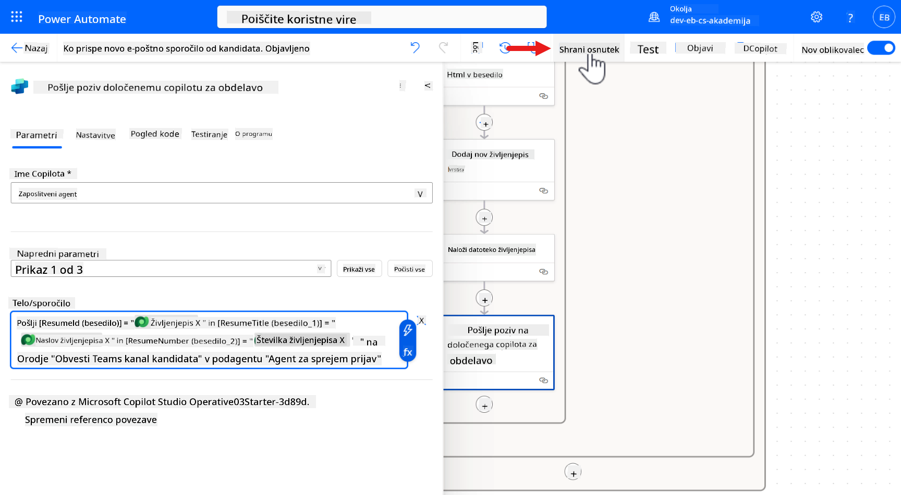

1. Zdaj moramo urediti podrobnosti toka agenta, izberite **Nazaj**.

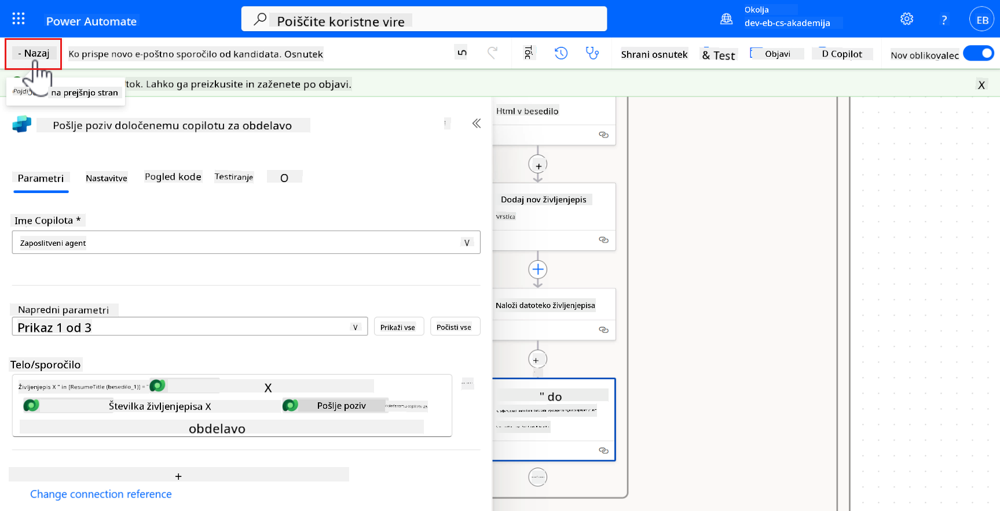

1. V razdelku **Podrobnosti** izberite **Uredi** in posodobite **Načrt** na možnost **Copilot Studio**.

Izberite **Shrani**.

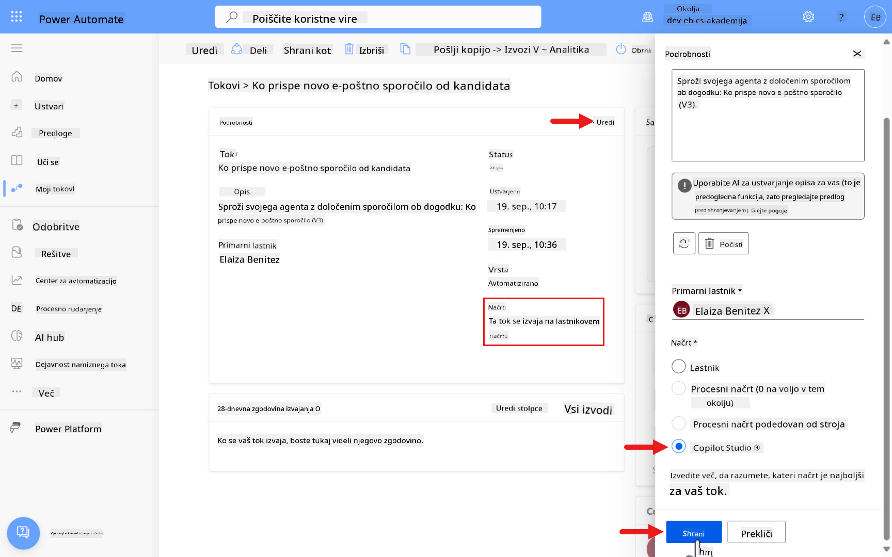

1. Pojavi se modalno okno, ki vas vpraša, ali želite potrditi preklop na načrt Copilot Studio. Izberite **Potrdi**.

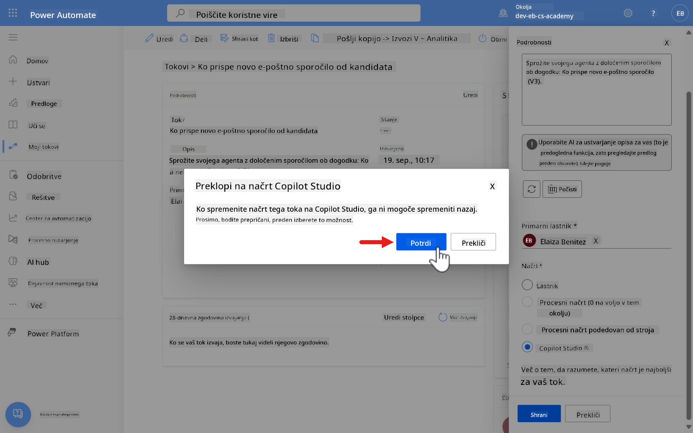

1. Načrt je zdaj posodobljen na **Copilot Studio**. Izberite **Uredi**, saj moramo objaviti tok sprožilca dogodka za našega agenta.

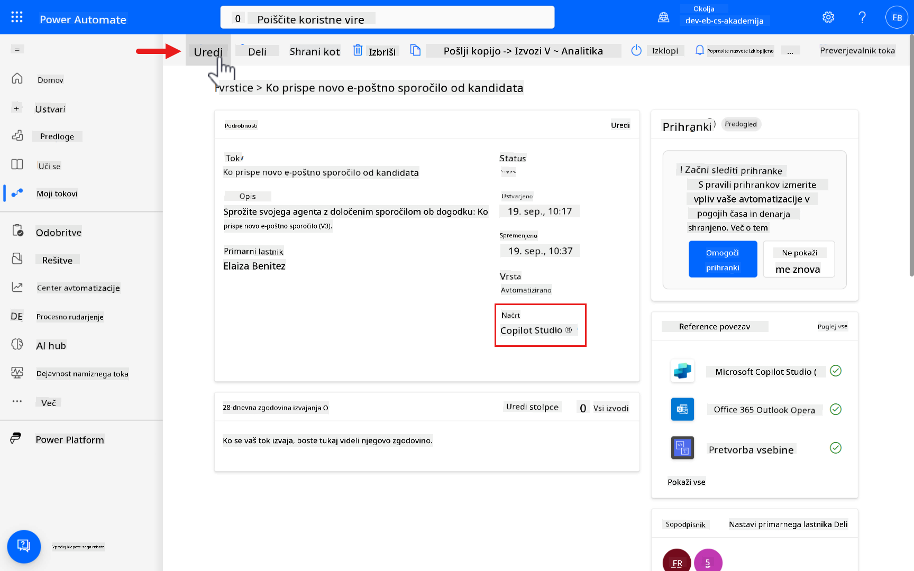

1. Izberite **Objavi**.


Hura! Tok sprožilca dogodka je zdaj objavljen 😃

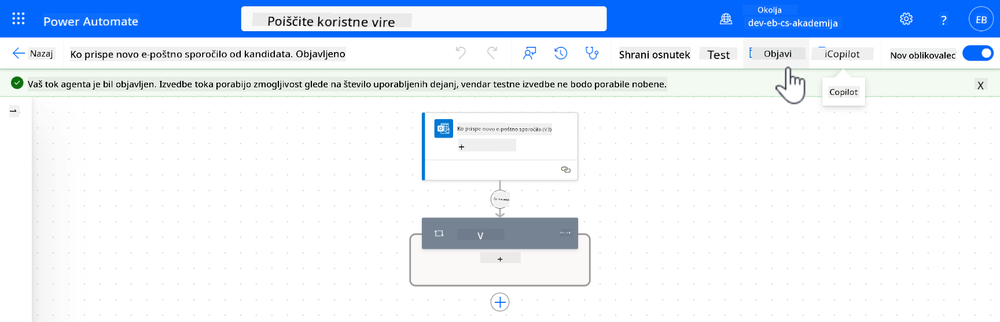

Nadaljujmo z ustvarjanjem novega toka agenta, ki ga bo sprožil podrejeni **Agent za sprejem prijav**.

### Lab 3.2 - Obvesti kanal Teams z uporabo prilagodljive kartice

Zdaj bomo ustvarili nov tok agenta za podrejenega **Agent za sprejem prijav**, ki bo uporabil vrednosti, posredovane s sprožilcem dogodka, za objavo prilagodljive kartice v kanalu Teams. Ta prilagodljiva kartica bo opozorila ekipo za zaposlovanje HR o PDF-ju, ki je bil samodejno naložen, da ga lahko pregledajo.

Začnimo!

1. V **Agent za zaposlovanje** izberite zavihek **Agenti** in izberite **Agent za sprejem prijav**.

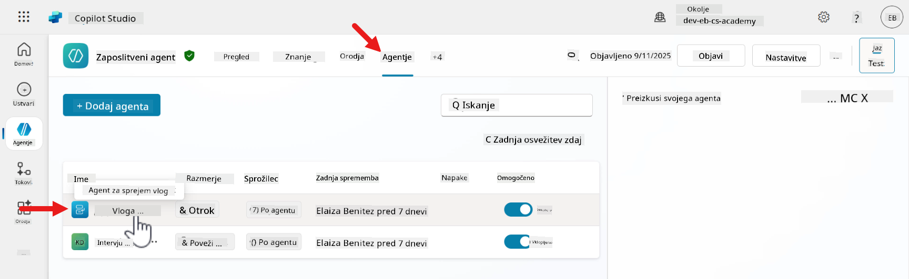

1. Pomaknite se navzdol do **Orodja** in izberite **+ Dodaj**.

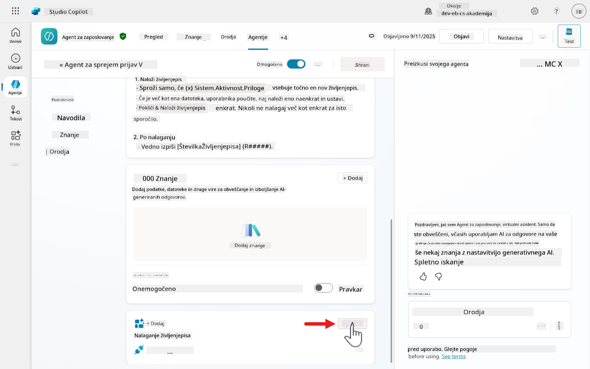

1. Pojavi se modalno okno **Dodaj orodje**. Izberite **+ Novo orodje**.

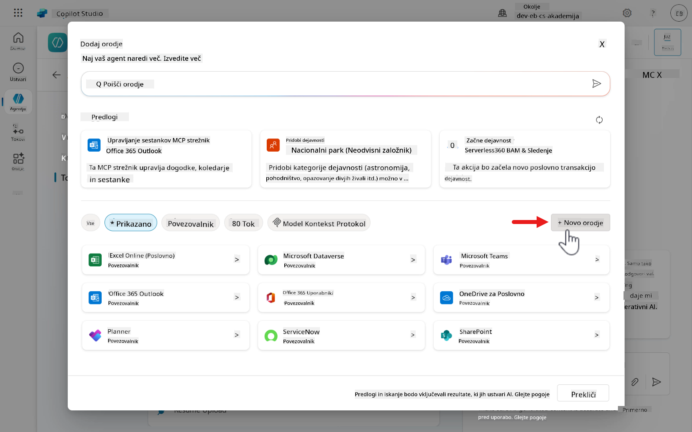

1. Izberite **Tok agenta**.

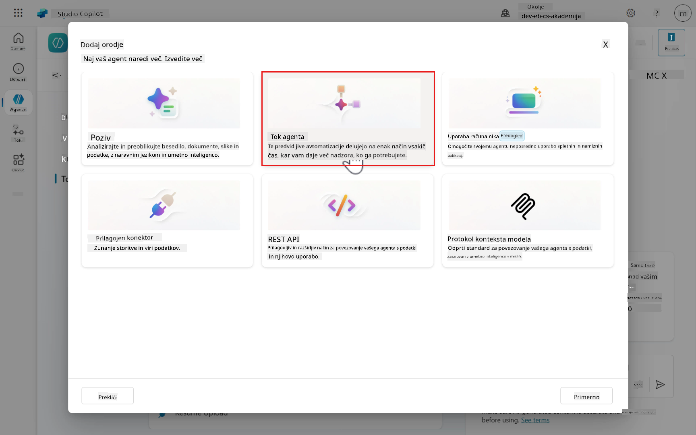

1. Nato se bo naložil **oblikovalec toka agenta**. V sprožilcu **Ko agent pokliče tok** izberite **+ Dodaj vnos**.

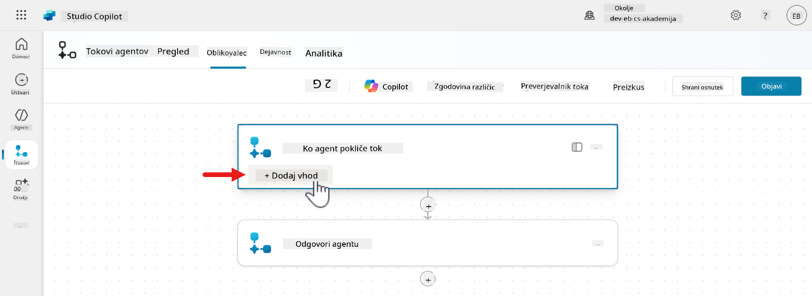

1. Izberite **Besedilo** kot vrsto uporabniškega vnosa.


1. V polje za vnos besedila kopirajte in prilepite naslednje za ime parametra vnosa.

```text
ResumeId
```


1. Ponovite iste korake za dodajanje drugega besedilnega vnosa. Kopirajte in prilepite naslednje za ime parametra vnosa.

```text
ResumeTitle
```


1. Ponovite iste korake za dodajanje tretjega besedilnega vnosa. Kopirajte in prilepite naslednje za ime parametra vnosa.

```text
ResumeNumber
```


1. Se spomnite, kako smo v [Recruit](../../recruit/08-add-adaptive-card/README.md#81-create-a-new-topic-with-an-adaptive-card-for-user-to-submit-their-request) dodali prilagodljivo kartico v temo za našega agenta? Tokrat bomo dodali prilagodljivo kartico v tok agenta. Zdaj bomo dodali še eno akcijo v naš tok agenta, ki bo objavila prilagodljivo kartico v kanalu Teams.

Izberite **ikono +** pod sprožilcem.


1. Izberite akcijo **Objavi kartico v klepetu ali kanalu**.


1. Referenca povezave z Microsoft Teams mora biti ustvarjena z vašim prijavljenim uporabniškim računom. Izberite **Prijava**.


1. Izberite svoj uporabniški račun in nato izberite **Dovoli dostop**.


1. Za naslednje vhodne parametre,

| Parameter | Kako nastaviti | Podrobnosti |
|----------|------------|---------|
| **Objavi kot** | Spustni meni | Izberite možnost `Flow bot` |
| **Objavi v** | Spustni meni | Izberite možnost `Kanal` |
| **Ekipa** | Spustni meni | Izberite ekipo, ki je na voljo v vašem okolju in do katere imate dostop za namen dokončanja te laboratorijske vaje |
| **Kanal** | Spustni meni | Izberite kanal, ki je na voljo v vašem okolju in do katerega imate dostop za namen dokončanja te laboratorijske vaje |


1. Nato bomo konfigurirali polje **Prilagodljiva kartica**. Izberite polje **Prilagodljiva kartica**.


1. Odprite [Posodobljena JSON datoteka tabele življenjepisa](../../../../../docs/operative-preview/03-automate-triggers/assets/3.2_ResumeTableUpdated.json), kopirajte celotno vsebino in jo prilepite v polje Prilagodljiva kartica.


1. Podobno kot smo storili v [Recruit](../../recruit/08-add-adaptive-card/README.md#81-create-a-new-topic-with-an-adaptive-card-for-user-to-submit-their-request), bomo zamenjali obstoječe vrednosti v JSON podatkih z dejanskimi vrednostmi ali dinamično vsebino.

Najprej posodobimo URL za lastnost `url` znotraj lastnosti `selectAction`. Ta URL bo zamenjan z URL-jem sistemskega pogleda Življenjepisi v modelno vodeni aplikaciji **Hiring Hub**. To bo omogočilo rekruterju, da izbere akcijo in bo preusmerjen na sistemski pogled Življenjepisi v modelno vodeni aplikaciji.

Označite trenutno vrednost URL-ja in jo izbrišite.


1. V modelno vodeni aplikaciji **Hiring Hub** pojdite na sistemski pogled **Življenjepisi** z uporabo menija na levi strani in kopirajte URL. Nato se vrnite na tok agenta in prilepite kopirani URL v lastnost **url** znotraj lastnosti `selectAction`.


1. Videti bi morali naslednje, kjer so podrobnosti o vašem okolju modelno vodene aplikacije **Hiring Hub** označene z rumeno.

     | Parameter | Vrednost | Pojasnilo |
     |----------|------------|---------|
     | **Organizacijski URI** | GUID | URL organizacije okolja Dataverse/Dynamics 365 |
     | **appid** | GUID | Za odprtje določene modelno vodene aplikacije se uporablja parameter poizvedbe bodisi appid ali appname. V tem primeru se uporablja appid |
     | **viewid** | GUID | Parameter poizvedbe, ki je ID pogleda |

       

1. Nato bomo dodali vrednosti dinamične vsebine za več lastnosti. Začnimo z besedilom, ki bo prikazalo referenco številke življenjepisa vrstice, ki jo je sprožilec dogodka samodejno ustvaril.

      Izberite ikono **panel**, da naložite akcijski panel.

       

1. Pomaknite se navzdol do vrstice, kjer vidite lastnost `text` za `RESUME NUMBER PLACEHOLDER`. Označite vrednost rezerviranega mesta in jo izbrišite.

       

1. Kliknite med dvema narekovajema in na desni strani izberite ikono **strele** ali **fx ikono**.

      V zavihku **Dynamic Content** izberite parameter **ResumeNumber** in kliknite **Add**.

       

1. Parameter **ResumeNumber** bo zdaj dodan kot dinamična vsebina lastnosti `text`.

       

1. Enake korake bomo ponovili za `RESUME NAME PLACEHOLDER`. Pomaknite se navzdol do vrstice, kjer vidite lastnost `text` za `RESUME NAME PLACEHOLDER`. Označite vrednost rezerviranega mesta in jo izbrišite.

       

1. Kliknite med dvema narekovajema in na desni strani izberite ikono **strele** ali **fx ikono**.

      V zavihku **Dynamic Content** izberite parameter **ResumeTitle** in kliknite **Add**.

       

1. Parameter **ResumeTitle** bo zdaj dodan kot dinamična vsebina lastnosti `text`.

       

1. Enake korake bomo ponovili za vrednost **Due Date**, ki predstavlja, kdaj naj kadrovnik pregleda življenjepis. Pomaknite se navzdol do vrstice, kjer vidite lastnost `text` za `May 21, 2023`.

       

1. Izbrišite to vrednost rezerviranega mesta za datum in kliknite med dvema narekovajema.

       

1. Na desni strani izberite ikono **strele** ali **fx ikono** in v zavihku **Function** vnesite naslednji izraz in kliknite **Add**.

       ```text
       addDays(utcNow(), 3, 'MMM dd, yyyy')
       ```

      Ta izraz uporablja dve funkciji.

     | Funkcija | Pojasnilo |
     |----------|------------|
     | **addDays** | Doda določeno število dni k danemu datumu in vrne rezultat v obliki niza |
     | **utcNow** | Vrne trenutni datum in čas v formatu Coordinated Universal Time (UTC) kot niz. |

      Za vrednost utcNow formatiramo datum, da je prikazan mesec in dan, sledi leto.

       

      Izraz bo zdaj dodan lastnosti `text`.

       

1. Na koncu bomo posodobili URL za lastnost `url` znotraj lastnosti `actions` array na dnu JSON payloada. Trenutni URL rezerviranega mesta bo zamenjan z URL-jem vrstice življenjepisa v modelno vodeni aplikaciji **Hiring Hub**. To bo kadrovniku omogočilo, da izbere akcijo `Action.OpenURL` prilagodljive kartice in se usmeri na življenjepis v modelno vodeni aplikaciji.

       

1. V modelno vodeni aplikaciji **Hiring Hub** odprite vrstico v sistemskem pogledu **Resumes** z uporabo menija na levi strani. Vrstica življenjepisa se bo naložila kot obrazec v modelno vodeni aplikaciji.

      Kopirajte URL vrstice življenjepisa.

    ??? info "Kako se vrniti v modelno vodeno aplikacijo **Hiring Hub**, če ste jo zapustili/zaprli"

        1. Obiščite [https://make.powerapps.com](https://make.powerapps.com) in se prepričajte, da ste v svojem razvijalskem okolju, ki ga uporabljate za te laboratorijske vaje, sicer preklopite nanj.
        
        

        1. Izberite **Apps** v meniju na levi strani in za modelno vodeno aplikacijo **Hiring Hub** izberite ikono **Play**, da jo naložite v brskalniku.
        
        

       

1. Nato se vrnite v tok agenta, označite trenutno vrednost rezerviranega mesta za URL in jo izbrišite.

       

1. Nato prilepite kopirani URL v lastnost **url** znotraj lastnosti `url property`.

       

1. Videti bi morali naslednje. Izbrišite vrednost ID-ja `GUID` na koncu. Zamenjali bomo to dinamično vsebino - parameter **ResumeId**.

       

1. Izberite ikono **strele** ali **fx ikono** na desni strani.

      V zavihku **Dynamic Content** izberite parameter **ResumeId** in kliknite **Add**.

       

1. Parameter **ResumeId** bo dodan kot dinamična vsebina. Naslednje, označeno z rumeno, so podrobnosti vašega okolja modelno vodene aplikacije **Hiring Hub**.

     | Parameter | Vrednost | Pojasnilo |
     |----------|------------|---------|
     | **Organizacijski URI** | GUID | URL organizacije okolja Dataverse/Dynamics 365 |
     | **appid** | GUID | Za odprtje določene modelno vodene aplikacije se uporablja parameter poizvedbe bodisi appid ali appname. V tem primeru se uporablja appid |
     | **id** | GUID | Parameter poizvedbe, ki je ID vrstice življenjepisa |

       

1. Zaključili smo konfiguracijo akcije **Post card in a chat or channel** 👏🏻 Zaprite konfiguracijski panel akcije z izbiro ikone **x**.

       

1. Na koncu bomo konfigurirali zadnjo akcijo, **Respond to the agent**, tako da pošljemo besedilo nazaj agentu za zaključek obdelave.

      V akciji **Respond to the agent** izberite **+Add an output**.

       

1. Izberite **Text** kot vrsto izhoda.

       

1. Vnesite naslednje kot ime izhoda.

       

1. Vnesite naslednje kot vrednost za izhod.

       ```text
       Finished
       ```

       

1. Zdaj smo zaključili konfiguracijo toka agenta. Izberite **Save draft**, da shranite tok agenta. Ko bo shranjen, se bo prikazalo potrditveno sporočilo.

       

1. Pred objavo toka agenta moramo posodobiti podrobnosti toka agenta. Izberite zavihek **Overview** in kliknite **Edit**.

      V polje za ime toka vnesite naslednje.

       ```text
       Notify Teams Applicant channel
       ```      

      Nato izberite ikono **Refresh**, da posodobite opis toka agenta z uporabo AI.

      Nato izberite **Save**, da shranite posodobljene podrobnosti toka agenta.

       

1. Pomaknite se nazaj na zavihek **Designer** in izberite **Publish**, da objavite tok agenta. Ko bo shranjen, se bo prikazalo potrditveno sporočilo.

       

1. Tok agenta je zdaj treba dodati kot orodje v **Application Intake Agent**. Pomaknite se nazaj na **Hiring Agent** in izberite zavihek **Agents**, nato izberite **Application Intake Agent**.

       

1. V razdelku **Details** agenta bomo posodobili polje **Description**. Kopirajte naslednje in prilepite na konec besedila opisa.

       ```text
       and also notify the Teams Applicant channel
       ```

       

1. Nato bomo dodali tok agenta kot orodje. Pomaknite se navzdol in izberite **+ Add**.

       

1. Izberite prej ustvarjeni tok agenta, **Notify Teams Applicant Channel**.

       

1. Nato izberite **Add and configure**.

       

1. V razdelku **Inputs** toka agenta so vidni trije vnosi, ki smo jih prej konfigurirali v toku agenta. Privzeto je konfiguracija **Fill using** nastavljena na **Dynamically fill with AI**. To nastavitev bomo ohranili, saj bo poziv iz sprožilca dogodka (v zadnji akciji, **Sends a prompt to the specified copilot for processing** - to so koraki 38-44 iz **Lab 3.1 - Automate uploading resumes to Dataverse received by email**) vseboval vrednosti parametrov, ki jih bo AI izvlekel.

       

1. Zdaj, ko je orodje dodano v **Application Intake Agent**, je treba posodobiti navodila agenta. Izberite ikono **back arrow**, da se vrnete na seznam agentov.

       

1. Izberite **Application Intake Agent** v zavihku **Agents** znotraj **Hiring Agent**.

       

1. V polju **Instructions** vnesite novo vrstico po navodilih `2.Post-Upload`. Kopirajte in prilepite naslednja navodila.

       ```text
       Process for Resume Upload via Email
       1. When you receive a message, **Send [ResumeId (text)] = "1680265f-5793-f011-b41b-7c1e525be9f7" and [ResumeTitle (text_1)] = "TAYLOR TESTPERSON (FICTITIOUS).pdf" and [ResumeNumber (text_2)]= "R01026" to the Tool "Notify Teams Applicant channel"** in the child agent "Application Intake Agent", call [AGENT FLOW PLACEHOLDER]
       ```

       

1. Označite besedilo `[AGENT FLOW PLACEHOLDER`.

       

1. Vnesite znak poševnice, `/`, in izberite orodje **Notify Teams Applicant Channel**.

       
1. Tok agentov bo zdaj sprožen s strani **Application Intake Agent** v skladu z navodili, po zadnjem dejanju (**Pošlje poziv določenemu copilotu za obdelavo**) v sprožilcu dogodka, ki pošlje poziv z vrednostmi parametrov nazaj agentu.

      Izberite **Save** za shranjevanje posodobljenih navodil za **Application Intake Agent**.

       

1. Navodila bodo zdaj posodobljena, ko bo agent shranjen.

       

1. Zdaj moramo **Publish** za **Hiring Agent**. Izberite **Publish** v zgornjem desnem kotu, nato pa v modalnem oknu _Publish this agent_, ki se prikaže, izberite **Publish**.

       

1. Ko je objavljeno, se prikaže potrditveno sporočilo, da je agent objavljen.

       

Zdaj lahko testiramo agenta!

### Lab 3.3 - Testiranje sprožilca dogodka

1. Za izvedbo sprožilca dogodka je treba poslati e-pošto s priloženo datoteko PDF življenjepisa. V Outlooku sestavite novo e-poštno sporočilo.

     | Komponenta e-pošte | Podrobnosti |
     |--------------------|-------------|
     | **Prejemnik** | Uporabite svoj prijavljen uporabniški račun kot vrednost |
     | **Priloga datoteke** | Naložite datoteko [TAYLOR TESTPERSON (FICTITIOUS)](../../../../../docs/operative-preview/test-data/resumes/TAYLOR%20TESTPERSON%20(FICTITIOUS).pdf) |
     | **Telo sporočila** | Kopirajte in prilepite naslednje besedilo kot telo e-pošte |

       ```text
       Spoštovani vodja zaposlovanja,

       Pišem vam, da izrazim svoje zanimanje za delovno mesto Senior Power Platform Engineer v vaši organizaciji. Z več kot devetimi leti izkušenj pri zagotavljanju varnih in skalabilnih rešitev na Microsoftovih oblačnih platformah sem prepričan, da lahko učinkovito prispevam k vaši ekipi.

       V svoji zadnji vlogi kot Lead Power Platform Engineer sem razvil avtomatiziran postopek sprejema življenjepisov, zmanjšal ročno razvrščanje in izboljšal iskalnost. Dostavil sem aplikacije za upravljanje HR primerov, uvedel rešitve zavedne tokove in implementiral PR preverjanja za izboljšanje časa uvajanja. Moje strokovno znanje vključuje Power Apps, Power Automate, Power Pages, Dataverse ter vrsto storitev Microsoft 365, kot tudi integracijo z Graph/REST API-ji in Azure Functions.

       Prej sem razvil odobritve v Teams z adaptivnimi karticami, skrajšal čas odobritve na isti dan in ustvaril robustne okvire za obravnavo napak. Moje ozadje vključuje tudi migracijo zastarelih delovnih tokov na Power Automate ter gradnjo portalov za samopostrežbo, ki jih je sprejelo na stotine zaposlenih.

       Imam diplomo iz računalništva in sem certificiran kot Power Platform Developer (PL-400) in Solution Architect (PL-600). Prav tako sem strasten mentor in sem prostovoljno sodeloval z lokalnimi skupinami ustvarjalcev.

       Priložen je moj življenjepis za vašo obravnavo. Vesel bi bil priložnosti, da razpravljam o tem, kako se moje veščine in izkušnje ujemajo z vašimi potrebami.

       Hvala za vaš čas in obravnavo.

       Lep pozdrav,
       Taylor Testperson
       ```

       **Pošljite** e-pošto, ko jo sestavite.

       

1. V portalu Power Automate maker za tok sprožilca dogodka izberite ikono **Refresh**, da si ogledate uspešno izveden tok za poslano e-pošto.

       

1. V Copilot Studio v **Hiring Agent** izberite zavihek **Activity**.

       

1. Zavihek **Activity** se bo naložil in prikazal vse aktivnosti **Hiring Agent**. Obstajala bo aktivnost z imenom **Automated**, ki ima status **Complete**. Ta aktivnost predstavlja sprožilec dogodka in tok agenta, ki je bil sprožen.

       

1. Izberite aktivnost in nato sprožilec dogodka na zemljevidu aktivnosti. Na desni strani panela opazite, kako vhodni parametri v pozivu vsebujejo vrednosti parametrov `Resume Id`, `Resume Title` in `Resume Number` iz vrstice **Dataverse**, ki je bila ustvarjena. To je bilo iz dinamičnih vrednosti vsebine, konfiguriranih prej v korakih 18 - 27 **Lab 3.1 - Avtomatizacija nalaganja življenjepisov v Dataverse, prejetih po e-pošti**.

       

1. Vrnite se v aplikacijo **Hiring Hub** in v sistemskem pogledu **Resumes** izberite **Refresh**, da osvežite pogled. Na novo ustvarjena vrstica za življenjepis, ki je bila poslana po e-pošti, bo zdaj navedena, saj je bila ustvarjena prek sprožilca dogodka.

       

1. Vrnite se v Copilot Studio in izberite tok agenta **Notify Teams Applicant Channel** znotraj **Application Intake Agent** na zemljevidu aktivnosti. Na desni strani panela opazite, kako imajo vhodne vrednosti vrednosti iz vrstice Dataverse. To je bilo iz poziva, poslanega z zadnjim dejanjem (**Pošlje poziv določenemu copilotu za obdelavo**) v sprožilcu dogodka, ki vsebuje vrednosti parametrov iz na novo ustvarjene vrstice Dataverse. Tako lahko prenesemo vrednosti parametrov iz sprožilcev dogodkov v tokove agentov.

       

1. Na koncu si oglejmo adaptivno kartico, objavljeno v kanalu **Microsoft Teams**. V kanalu bomo videli adaptivno kartico, ki prikazuje informacije o na novo ustvarjeni vrstici življenjepisa v Dataverse. Premaknite kazalec nad hiperpovezavo na začetku adaptivne kartice, opazite, kako je URL sistemski pogled Resumes, ki smo ga prej konfigurirali v JSON (koraki 15 - 19 **Lab 3.2 - Obvestilo kanalu Teams z adaptivno kartico**) vsebini adaptivne kartice.

       

1. Izberite hiperpovezavo in boste preusmerjeni na sistemski pogled Resumes v aplikaciji **Hiring Hub** na vašem brskalniku.

       

1. Vrnite se na adaptivno kartico, objavljeno v kanalu Microsoft Teams. Tokrat premaknite kazalec nad **View Resume**, kar je `Action.OpenURL` akcija adaptivne kartice. Opazite, kako je URL vrstica življenjepisa, ki smo jo prej konfigurirali v JSON (koraki 30 - 36 **Lab 3.2 - Obvestilo kanalu Teams z adaptivno kartico**) vsebini adaptivne kartice.

       

1. Izberite akcijo in boste preusmerjeni na obrazec vrstice življenjepisa v aplikaciji **Hiring Hub** na vašem brskalniku.

       

## ✅ Misija zaključena

Čestitke! 👏🏻 Odlično opravljeno, operativec.

✅ Sprožilec dogodka: ustvarili ste sprožilec dogodka, ki prenese vrednosti parametrov Dataverse v tok agenta.  
✅ Zgradili tok agenta: porabi vrednosti parametrov Dataverse za objavo adaptivne kartice v kanalu Microsoft Teams za obveščanje HR ekipe za zaposlovanje.  
✅ Posodobili navodila podrejenega agenta: za sprožitev toka, ko se sprožilec dogodka zaključi.

To omogoča **Hiring Agent**, da deluje samostojno, kadar so življenjepisi prejeti kot priloge e-pošte, in obvesti HR ekipo za zaposlovanje za ročni pregled.

To je konec **Lab 03 - Avtomatizacija e-poštnih sporočil s prijavami kandidatov**, izberite spodnjo povezavo za prehod na naslednjo lekcijo.

⏭️ [Premakni se na lekcijo **Navodila za avtorstvo agenta**](../04-agent-instructions/README.md)

## 📚 Taktični viri

📖 [Naredite svojega agenta avtonomnega v Copilot Studio](https://learn.microsoft.com/training/modules/autonomous-agents-online-workshop/?WT.mc_id=power-188561-ebenitez)  

📖 [Dodaj sprožilec dogodka](https://learn.microsoft.com/microsoft-copilot-studio/authoring-trigger-event?WT.mc_id=power-188561-ebenitez)  

📖 [Uporaba tokov agentov z vašim agentom](https://learn.microsoft.com/microsoft-copilot-studio/advanced-flow?WT.mc_id=power-188561-ebenitez)  

📖 [Uvod v sprožilce Power Automate](https://learn.microsoft.com/power-automate/triggers-introduction?WT.mc_id=power-188561-ebenitez)  

📖 [Uporaba tokov Power Automate z agenti](https://learn.microsoft.com/microsoft-copilot-studio/advanced-flow-create?WT.mc_id=power-188561-ebenitez)  

📖 [Preprečevanje izgube podatkov za Copilot Studio](https://learn.microsoft.com/microsoft-copilot-studio/admin-data-loss-prevention?WT.mc_id=power-188561-ebenitez)  

---

**Omejitev odgovornosti**:  
Ta dokument je bil preveden z uporabo storitve za prevajanje z umetno inteligenco [Co-op Translator](https://github.com/Azure/co-op-translator). Čeprav si prizadevamo za natančnost, vas prosimo, da upoštevate, da lahko avtomatizirani prevodi vsebujejo napake ali netočnosti. Izvirni dokument v njegovem maternem jeziku je treba obravnavati kot avtoritativni vir. Za ključne informacije priporočamo profesionalni človeški prevod. Ne odgovarjamo za morebitne nesporazume ali napačne razlage, ki bi nastale zaradi uporabe tega prevoda.