<!--
CO_OP_TRANSLATOR_METADATA:
{
  "original_hash": "616d142d4fb5f45d2a168fad6c1f9545",
  "translation_date": "2025-10-20T23:04:03+00:00",
  "source_file": "docs/operative-preview/07-multimodal-prompts/README.md",
  "language_code": "sl"
}
-->
# 🚨 Misija 07: Izvlečenje vsebine življenjepisov z multimodalnimi pozivi

--8<-- "disclaimer.md"

## 🕵️‍♂️ KODNO IME: `DOKUMENT ŽIVLJENJEPIS REKON`

> **⏱️ Časovno okno operacije:** `~45 minut`

## 🎯 Kratek opis misije

Dobrodošli, operativec. Vaše prejšnje misije so vas opremile z zmogljivimi veščinami orkestracije agentov, zdaj pa je čas, da odklenete prelomno sposobnost: **analizo multimodalnih dokumentov**.

Vaša naloga, če jo sprejmete, je **Dokument Življenjepis Rekon** - natančno izvleči strukturirane podatke iz kateregakoli dokumenta. Čeprav vaši agenti zlahka obdelujejo besedilo, resnični svet zahteva vsakodnevno obravnavo PDF-jev, slik in kompleksnih dokumentov. Življenjepisi se kopičijo, račune je treba obdelati, obrazce pa takoj digitalizirati.

Ta misija vas bo spremenila iz graditelja agentov, ki obdelujejo samo besedilo, v **multimodalnega strokovnjaka**. Naučili se boste konfigurirati AI, ki bere in razume dokumente kot človeški analitik - vendar s hitrostjo in doslednostjo AI. Do konca misije boste zgradili celoten sistem za izvlečenje življenjepisov, ki se integrira z vašim zaposlitvenim procesom.

Te tehnike bodo ključne za napredne operacije utemeljevanja podatkov v vaši naslednji misiji.

## 🔎 Cilji

V tej misiji se boste naučili:

1. Kaj so multimodalni pozivi in kdaj uporabiti različne modele AI
1. Kako konfigurirati pozive z vhodnimi podatki iz slik in dokumentov
1. Kako oblikovati izhode pozivov kot JSON za izvlečenje strukturiranih podatkov
1. Najboljše prakse za inženiring pozivov pri analizi dokumentov
1. Kako integrirati multimodalne pozive z Agent Flows

## 🧠 Razumevanje multimodalnih pozivov

### Kaj naredi poziv "multimodalen"?

Tradicionalni pozivi delujejo samo z besedilom. Multimodalni pozivi pa lahko obdelujejo več vrst vsebin:

- **Besedilo**: Pisna navodila in vsebina
- **Slike**: Fotografije, posnetki zaslona, grafikoni in diagrami (.PNG, .JPG, .JPEG)  
- **Dokumenti**: Računi, življenjepisi, obrazci (.PDF)

Ta sposobnost odpira močne scenarije, kot so analiza življenjepisov, obdelava računov ali izvlečenje podatkov iz obrazcev.

### Zakaj so multimodalni pozivi pomembni za vaše delovne procese

Vaša organizacija se vsakodnevno sooča s temi izzivi pri obdelavi dokumentov:

- **Pregledovanje življenjepisov**: Ročno branje stotine življenjepisov zahteva veliko časa
- **Obdelava računov**: Izvlečenje podatkov o dobaviteljih, zneskih in datumih iz različnih formatov dokumentov
- **Analiza obrazcev**: Pretvorba papirnatih obrazcev v digitalne podatke

Multimodalni pozivi odpravljajo te ozka grla z združevanjem jezikovnega razumevanja AI z vizualnimi analiznimi sposobnostmi. To daje vaši AI sposobnost obdelave dokumentov tako učinkovito kot besedilo.

### Pogosti poslovni scenariji

Tukaj je nekaj primerov uporabe multimodalnih pozivov:

| Scenarij                | Naloga                                                                                                                                      | Primeri izhodnih polj                                                                                   |
|-------------------------|-------------------------------------------------------------------------------------------------------------------------------------------|---------------------------------------------------------------------------------------------------------|
| **Pregledovanje življenjepisov**    | Izvleči ime kandidata, e-pošto, telefon, trenutni naziv, leta izkušenj in ključne veščine.                                                 | Ime kandidata, E-poštni naslov, Telefonska številka, Trenutni naziv dela, Leta izkušenj, Ključne veščine         |
| **Obdelava računov**  | Izvleči podatke o dobavitelju, datum računa, skupni znesek in postavke iz tega računa.                                                 | Ime dobavitelja, Datum računa, Skupni znesek, Postavke računa                                             |
| **Analiza obrazcev**       | Analiziraj ta obrazec za prijavo in izvleči vsa izpolnjena polja.                                                                              | Ime polja (npr. Ime prijavitelja), Vnesena vrednost (npr. Janez Novak), ...                                  |
| **Preverjanje identifikacijskih dokumentov** | Izvleči ime, številko ID, datum poteka in naslov iz tega identifikacijskega dokumenta. Preveri, da je vse besedilo jasno berljivo in označi nejasne dele. | Polno ime, Identifikacijska številka, Datum poteka, Naslov, Oznaka nejasnih delov                        |

## ⚙️ Izbor modela v AI Builder

AI Builder ponuja različne modele, optimizirane za specifične naloge. Razumevanje, kateri model uporabiti, je ključno za uspeh.

!!! note "Veljavno od septembra 2025"
    AI Builder modeli se redno posodabljajo, zato preverite najnovejšo [dokumentacijo nastavitev modelov AI Builder](https://learn.microsoft.com/ai-builder/prompt-modelsettings) za trenutno razpoložljivost modelov.

### Primerjava modelov

Vsi spodaj navedeni modeli podpirajo vizualno in dokumentno obdelavo

| Model | 💰Cena | ⚡Hitrost | ✅Najboljše za |
|-------|------|-------|----------|
| **GPT-4.1 mini** | Osnovno (najbolj stroškovno učinkovito) | Hitro | Standardna obdelava dokumentov, povzemanje, projekti z omejenim proračunom |
| **GPT-4.1** | Standardno | Zmerno | Kompleksni dokumenti, napredno ustvarjanje vsebine, potrebe po visoki natančnosti |
| **o3** | Premium | Počasno (najprej razloge) | Analiza podatkov, kritično razmišljanje, sofisticirano reševanje problemov |
| **GPT-5 chat** | Standardno | Izboljšano | Najnovejše razumevanje dokumentov, najvišja natančnost odgovorov |
| **GPT-5 reasoning** | Premium | Počasno (kompleksna analiza) | Najbolj sofisticirana analiza, načrtovanje, napredno razmišljanje |

### Pojasnilo nastavitev temperature

Temperatura nadzoruje, kako kreativni ali predvidljivi so odgovori AI:

- **Temperatura 0**: Najbolj predvidljivi, dosledni rezultati (najboljše za izvlečenje podatkov)
- **Temperatura 0.5**: Uravnotežena kreativnost in doslednost  
- **Temperatura 1**: Maksimalna kreativnost (najboljše za generiranje vsebine)

Za analizo dokumentov uporabite **temperaturo 0**, da zagotovite dosledno izvlečenje podatkov.

## 📊 Izhodni formati: Besedilo proti JSON

Izbira pravega izhodnega formata je ključna za nadaljnjo obdelavo.

### Kdaj uporabiti besedilni izhod

Besedilni izhod je primeren za:

- Povzetke, ki jih berejo ljudje
- Enostavne klasifikacije
- Vsebino, ki ne potrebuje strukturirane obdelave

### Kdaj uporabiti JSON izhod

JSON izhod je bistven za:

- Strukturirano izvlečenje podatkov
- Integracijo z bazami podatkov ali sistemi
- Obdelavo v Power Automate flow
- Dosledno preslikavo polj

### Najboljše prakse za JSON

1. **Določite jasna imena polj**: Uporabite opisna, dosledna imena
1. **Zagotovite primere**: Vključite vzorčne izhode in vrednosti za vsako polje
1. **Določite tipe podatkov**: Vključite primere za datume, številke in besedilo
1. **Obravnavajte manjkajoče podatke**: Načrtujte za null ali prazne vrednosti
1. **Validirajte strukturo**: Testirajte z različnimi vrstami dokumentov

### Premisleki o kakovosti dokumentov

- **Ločljivost**: Poskrbite, da so slike jasne in berljive
- **Orientacija**: Dokumente obrnite v pravilno orientacijo pred obdelavo
- **Podpora formatov**: Testirajte z vašimi specifičnimi vrstami dokumentov (PDF, JPG, PNG)
- **Omejitve velikosti**: Bodite pozorni na omejitve velikosti datotek v vašem okolju

### Optimizacija zmogljivosti

- **Izberite ustrezne modele**: Nadgradite modele le, ko je to potrebno
- **Optimizirajte pozive**: Pogosto krajša, jasnejša navodila delujejo bolje
- **Obravnavajte napake**: Načrtujte za dokumente, ki jih ni mogoče obdelati
- **Spremljajte stroške**: Različni modeli porabijo različno količino kreditov AI Builder

## 🧪 Laboratorij 7: Gradnja sistema za izvlečenje življenjepisov

Čas je, da svoje znanje o multimodalnosti uporabite v praksi. Zgradili boste celovit sistem za izvlečenje življenjepisov, ki analizira dokumente kandidatov in jih pretvori v strukturirane podatke za vaš zaposlitveni proces.

### Predpogoji za dokončanje misije

1. Potrebovali boste **ali**:

    - **Zaključili Misijo 06** in imeli pripravljen vaš večagentni zaposlitveni sistem, **ALI**
    - **Uvozili začetno rešitev Misije 07**, če začenjate na novo ali morate nadoknaditi. [Prenesi začetno rešitev Misije 07](https://aka.ms/agent-academy)

1. Vzorčne dokumente življenjepisov iz [Testni življenjepisi](https://download-directory.github.io/?url=https://github.com/microsoft/agent-academy/tree/main/operative/sample-data/resumes&filename=operative_sampledata)

!!! note "Uvoz rešitve in vzorčnih podatkov"
    Če uporabljate začetno rešitev, se sklicujte na [Misijo 01](../01-get-started/README.md) za podrobna navodila o tem, kako uvoziti rešitve in vzorčne podatke v vaše okolje.

### 7.1 Ustvarite multimodalni poziv

Vaš prvi cilj: ustvariti poziv, ki je sposoben analizirati dokumente življenjepisov in izvleči strukturirane podatke.

1. Prijavite se v [Copilot Studio](https://copilotstudio.microsoft.com) in izberite **Orodja** iz leve navigacije.

1. Izberite **+ Novo orodje**, nato izberite **Poziv**.  
    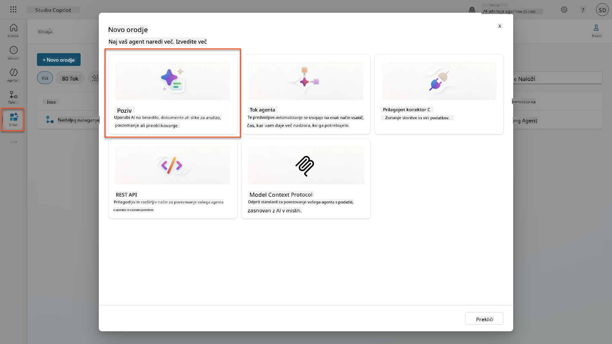

1. **Preimenujte** poziv iz privzetega časovnega žiga (npr. *Custom prompt 09/04/2025, 04:59:11 PM*) v `Povzemi življenjepis`.

1. V polje Navodila dodajte ta poziv:

    ```text
    You are tasked with extracting key candidate information from a resume and cover letter to facilitate matching with open job roles and creating a summary for application review.
    
    Instructions:
    1. Extract Candidate Details:
        - Identify and extract the candidate’s full name.
        - Extract contact information, specifically the email address.
    2. Create Candidate Summary:
        - Summarize the candidate’s profile as multiline text (max 2000 characters) with the following sections:
            - Candidate name
            - Role(s) applied for if present
            - Contact and location
            - One-paragraph summary
            - Experience snapshot (last 2–3 roles with outcomes)
            - Key projects (1–3 with metrics)
            - Education and certifications
            - Top skills (Top 10)
            - Availability and work authorization
    
    Guidelines:
    - Extract information only from the provided resume and cover letter documents.
    - Ensure accuracy in identifying all details such as contact details and skills.
    - The summary should be concise but informative, suitable for quick application review.
    
    Resume: /document
    CoverLetter: /text
    ```

    !!! tip "Uporabite pomoč Copilot"
        Lahko uporabite "Začni s Copilotom", da ustvarite svoj poziv z uporabo naravnega jezika. Poskusite vprašati Copilot, naj ustvari poziv za povzetek življenjepisa!

1. **Konfigurirajte** vhodne parametre:

    | Parameter | Tip | Ime | Vzorčni podatki |
    |-----------|------|------|-------------|
    | Življenjepis | Slika ali dokument | Življenjepis | Naložite vzorčni življenjepis iz mape testnih podatkov |
    | Spremljevalno pismo | Besedilo | Spremljevalno pismo | Tukaj je življenjepis! |

1. Izberite **Test**, da vidite začetni besedilni izhod iz vašega poziva.  
    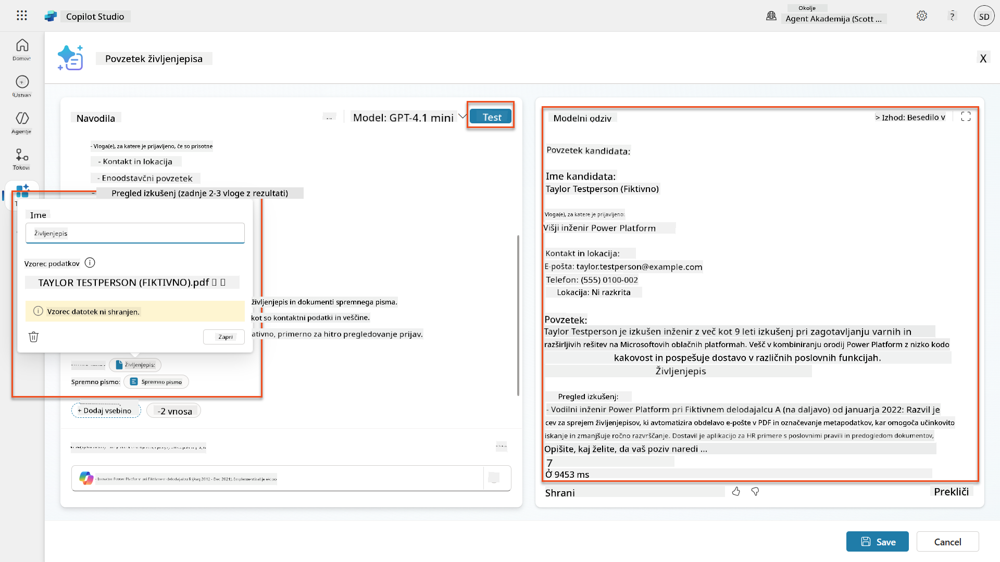

### 7.2 Konfigurirajte JSON izhod

Zdaj boste poziv spremenili, da bo izhod oblikovan kot strukturirani JSON podatki namesto navadnega besedila.

1. Dodajte to specifikacijo JSON formata na konec navodil za poziv:

    ```text
    Output Format:
    Provide the output in valid JSON format with the following structure:
    
    {
        "CandidateName": "string",
        "Email": "string",
        "Summary": "string max 2000 characters",
        "Skills": [ {"item": "Skill 1"}, {"item": "Skill 2"}],
        "Experience": [ {"item": "Experience 1"}, {"item": "Experience 2"}],
    }
    ```

1. Spremenite nastavitev **Izhod** iz "Besedilo" v **JSON**.

1. Ponovno izberite **Test**, da preverite, ali je izhod zdaj oblikovan kot JSON.  
    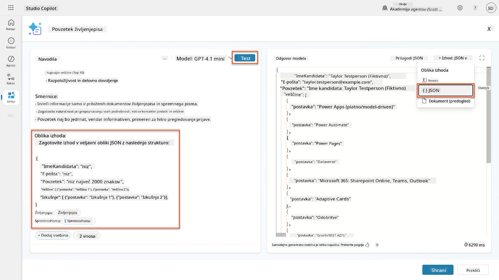

1. **Opcijsko:** Eksperimentirajte z različnimi modeli AI, da vidite, kako se izhodi razlikujejo, nato se vrnite na privzeti model.

1. Izberite **Shrani**, da ustvarite poziv.

1. V dialogu **Konfiguriraj za uporabo v agentu** izberite **Prekliči**.

    !!! info "Zakaj tega še ne dodajamo kot orodje"
        Ta poziv boste uporabili v Agent Flow namesto neposredno kot orodje, kar vam daje več nadzora nad delovnim procesom obdelave podatkov.

### 7.3 Dodajte poziv v Agent Flow

Ustvarili boste Agent Flow, ki uporablja vaš poziv za obdelavo življenjepisov, shranjenih v Dataverse.

!!! tip "Izrazi v Agent Flow"
    Zelo pomembno je, da natančno sledite navodilom za poimenovanje vaših vozlišč in vnos izrazov, ker se izrazi sklicujejo na prejšnja vozlišča z uporabo njihovega imena! Sklicujte se na [Misijo Agent Flow v Recruit](../../recruit/09-add-an-agent-flow/README.md#you-mentioned-expressions-what-are-expressions) za hitro osvežitev!

1. Pomaknite se do vašega **Zaposlitvenega agenta** znotraj Copilot Studio

1. Izberite zavihek **Agenti** in izberite podrejeni **Agent za sprejem prijav**

1. Znotraj panela **Orodja** izberite **+ Dodaj** → **+ Novo orodje** → **Agent Flow**

1. Izberite vozlišče Ko agent pokliče tok, uporabite **+ Dodaj vhod**, da dodate naslednji parameter:

    | Tip | Ime | Opis |
    |------|------|-------------|
    | Besedilo | Številka življenjepisa | Poskrbite, da uporabite [Številka življenjepisa]. To mora vedno začeti z črko R |

1. Izberite **+** Ikono za vstavljanje dejanja pod prvim vozliščem, poiščite **Dataverse**, izberite **Poglej več**, nato poiščite dejanje **Seznam vrstic**

1. Izberite **tri pike (...)** na vozlišču Seznam vrstic in izberite **Preimenuj** v `Pridobi zapis življenjepisa`, nato nastavite naslednje parametre:

    | Lastnost | Kako nastaviti | Vrednost |
    |----------|------------|-------|
    | **Ime tabele** | Izberite | Življenjepisi |
    | **Filtriraj vrstice** | Dinamični podatki (ikona strele) | `ppa_resumenumber eq 'Številka življenjepisa'` Zamenjajte **Številka življenjepisa** z **Ko agent pokliče tok** → **Številka življenjepisa** |
    | **Število vrstic** | Vnesite | 1 |

    !!! tip "Optimizirajte te poizvedbe!"
        Pri uporabi te tehnike v produkciji vedno omejite stolpce, ki se izberejo, samo na tiste, ki jih zahteva Agent Flow.

    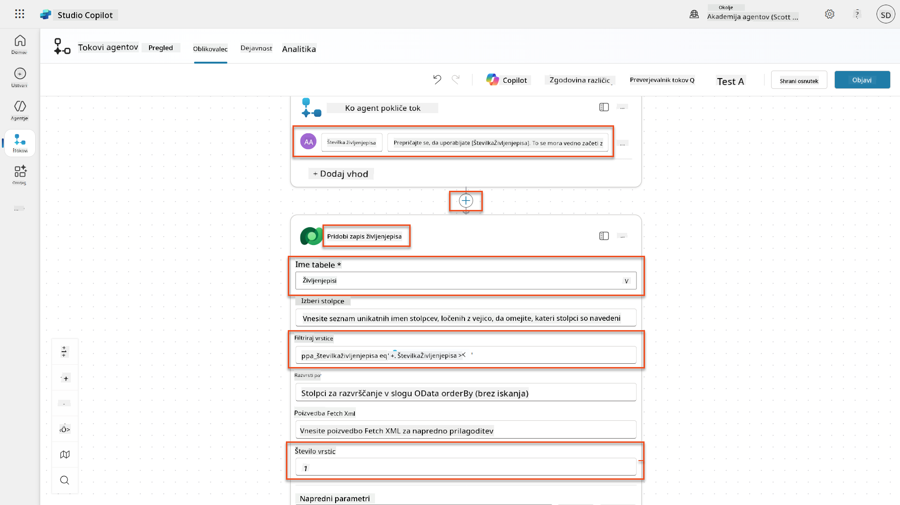

1. Izberite **+** Ikono za vstavljanje dejanja pod vozliščem Pridobi zapis življenjepisa, poiščite **Dataverse**, izberite **Poglej več**, nato poiščite dejanje **Prenesi datoteko ali sliko**.

    !!! tip "Izberite pravilno dejanje!"
        Poskrbite, da ne izberete dejanja, ki se konča z "iz izbranega okolja"

1. Kot prej, preimenujte dejanje v `Prenesi življenjepis`, nato nastavite naslednje parametre:

    | Lastnost | Kako nastaviti | Vrednost |
    |----------|------------|-------|
    | **Ime tabele** | Izberite | Življenjepisi |
    | **ID vrstice** | Izraz (ikona fx) | `first(body('Pridobi_zapis_življenjepisa')?['value'])?['ppa_resumeid']` |
    | **Ime stolpca** | Izberite | PDF življenjepisa |

    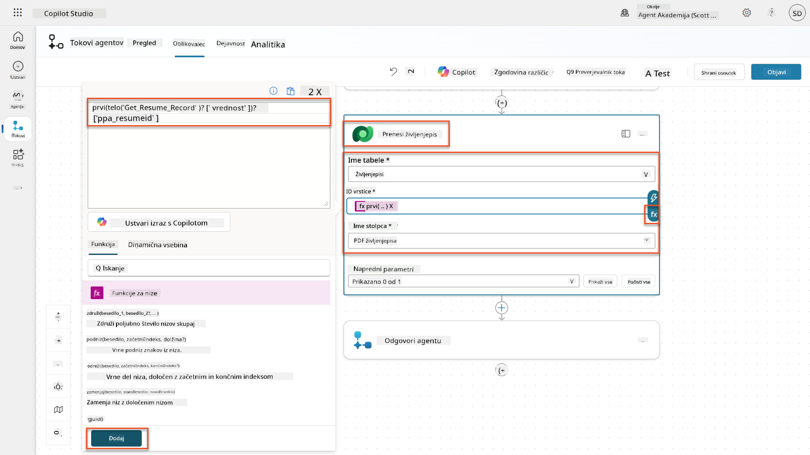

1. Zdaj izberite **+** Ikono za vstavljanje
| **Poziv** | Izberi | Povzemi življenjepis |
| **Motivacijsko pismo** | Izraz (ikona fx) | `first(body('Get_Resume_Record')?['value'])?['ppa_coverletter']` |
| **Življenjepis** | Dinamični podatki (ikona strele) | Prenesi življenjepis → Vsebina datoteke ali slike |

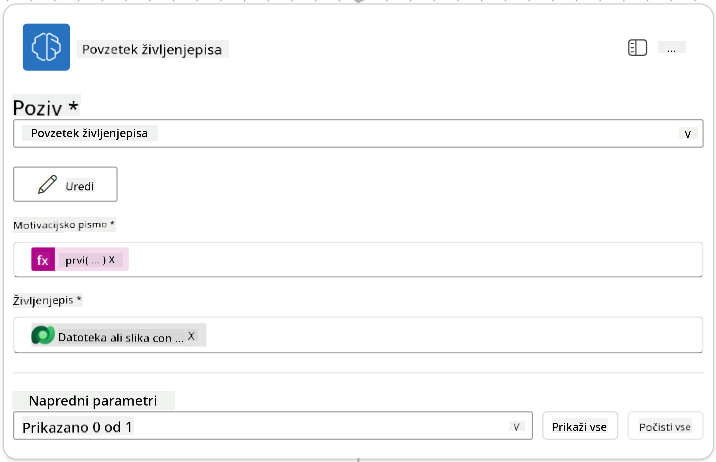

!!! tip "Parametri poziva"
    Opazite, da so parametri, ki jih izpolnjujete, enaki tistim, ki ste jih konfigurirali kot vhodne parametre, ko ste ustvarili svoj poziv.

### 7.4 Ustvarite zapis kandidata

Naslednji korak je, da uporabite informacije, ki vam jih je dal poziv, in ustvarite nov zapis kandidata, če ta še ne obstaja.

1. Izberite ikono **+** za vstavljanje dejanja pod vozliščem Povzemi življenjepis, poiščite **Dataverse**, izberite **Poglej več** in nato poiščite dejanje **Seznam vrstic**.

1. Preimenujte vozlišče v `Get Existing Candidate` in nastavite naslednje parametre:

    | Lastnost | Kako nastaviti | Vrednost |
    |----------|----------------|----------|
    | **Ime tabele** | Izberi | Kandidati |
    | **Filtriraj vrstice** | Dinamični podatki (ikona strele) | `ppa_email eq 'Email'`  **Zamenjajte** `Email` z **Povzemi življenjepis → Email** |
    | **Število vrstic** | Vnesi | 1 |

    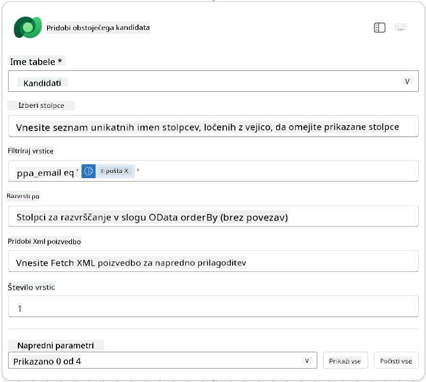

1. Izberite ikono **+** za vstavljanje dejanja pod vozlišče Pridobi obstoječega kandidata, poiščite **Nadzor**, izberite **Poglej več** in nato poiščite dejanje **Pogoj**.

1. V lastnostih pogoja nastavite naslednji pogoj:

    | Pogoj | Operator | Vrednost |
    |-------|----------|----------|
    | Izraz (ikona fx): `length(outputs('Get_Existing_Candidate')?['body/value'])` | je enako | 0 |

    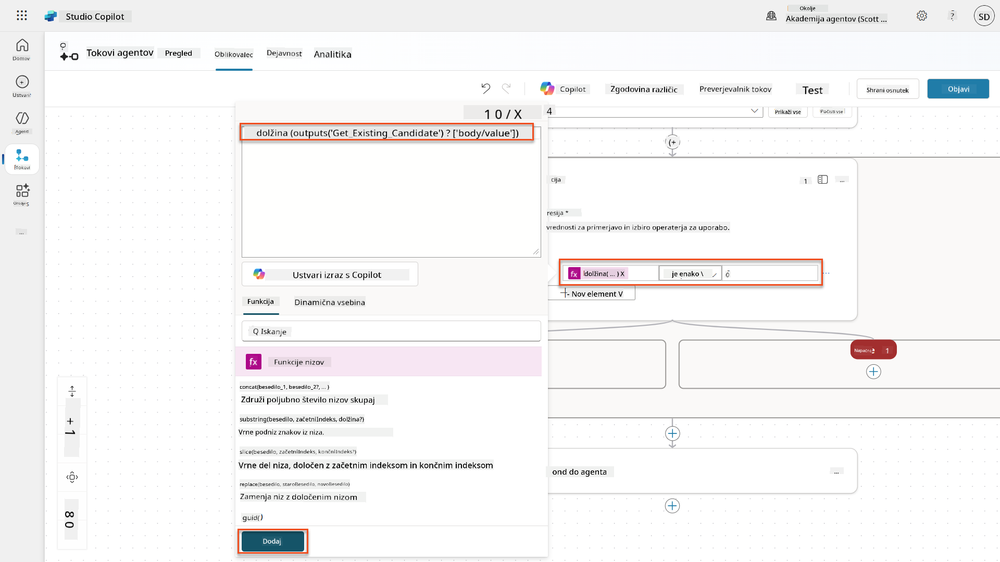

1. Izberite ikono **+** za vstavljanje dejanja v veji **True**, poiščite **Dataverse**, izberite **Poglej več** in nato poiščite dejanje **Dodaj novo vrstico**.

1. Preimenujte vozlišče v `Add a New Candidate` in nastavite naslednje parametre:

    | Lastnost | Kako nastaviti | Vrednost |
    |----------|----------------|----------|
    | **Ime tabele** | Izberi | Kandidati |
    | **Ime kandidata** | Dinamični podatki (ikona strele) | Povzemi življenjepis → `CandidateName` |
    | **Email** | Dinamični podatki (ikona strele) | Povzemi življenjepis → `Email` |


### 7.5 Posodobite življenjepis in konfigurirajte izhode poteka

Dokončajte potek z posodobitvijo zapisa življenjepisa in konfiguracijo podatkov, ki jih želite vrniti agentu.

1. Izberite ikono **+** za vstavljanje dejanja pod pogojem, poiščite **Dataverse**, izberite **Poglej več** in nato poiščite dejanje **Posodobi vrstico**.

1. Izberite naslov, da preimenujete vozlišče v `Update Resume`, izberite **Pokaži vse** in nato nastavite naslednje parametre:

    | Lastnost | Kako nastaviti | Vrednost |
    |----------|----------------|----------|
    | **Ime tabele** | Izberi | Življenjepisi |
    | **ID vrstice** | Izraz (ikona fx) | `first(body('Get_Resume_Record')?['value'])?['ppa_resumeid']` |
    | **Povzetek** | Dinamični podatki (ikona strele) | Povzemi življenjepis → Besedilo |
    | **Kandidat (Kandidati)** | Izraz (ikona fx) | `if(equals(length(outputs('Get_Existing_Candidate')?['body/value']), 1), first(outputs('Get_Existing_Candidate')?['body/value'])?['ppa_candidateid'], outputs('Add_a_New_Candidate')?['body/ppa_candidateid'])` |

    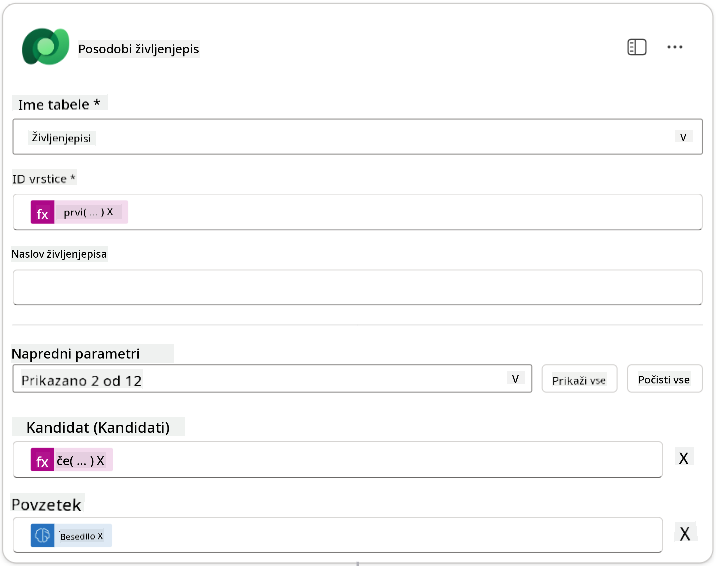

1. Izberite vozlišče **Odgovori agentu** in nato uporabite **+ Dodaj izhod**, da konfigurirate:

    | Tip | Ime              | Kako nastaviti                      | Vrednost                                                        | Opis                                            |
    |-----|------------------|--------------------------------------|-----------------------------------------------------------------|------------------------------------------------|
    | Besedilo | `CandidateName`   | Dinamični podatki (ikona strele) | Povzemi življenjepis → Poglej več → CandidateName                  | [Ime kandidata], navedeno v življenjepisu       |
    | Besedilo | `CandidateEmail`  | Dinamični podatki (ikona strele) | Povzemi življenjepis → Poglej več → Email                          | [Email kandidata], naveden v življenjepisu      |
    | Besedilo | `CandidateNumber` | Izraz (ikona fx)                 | `concat('ppa_candidates/', if(equals(length(outputs('Get_Existing_Candidate')?['body/value']), 1), first(outputs('Get_Existing_Candidate')?['body/value'])?['ppa_candidateid'], outputs('Add_a_New_Candidate')?['body/ppa_candidateid']) )` | [Številka kandidata] novega ali obstoječega kandidata |
    | Besedilo | `ResumeSummary`   | Dinamični podatki (ikona strele) | Povzemi življenjepis → Poglej več → body/responsev2/predictionOutput/structuredOutput | Povzetek življenjepisa in podrobnosti v obliki JSON |

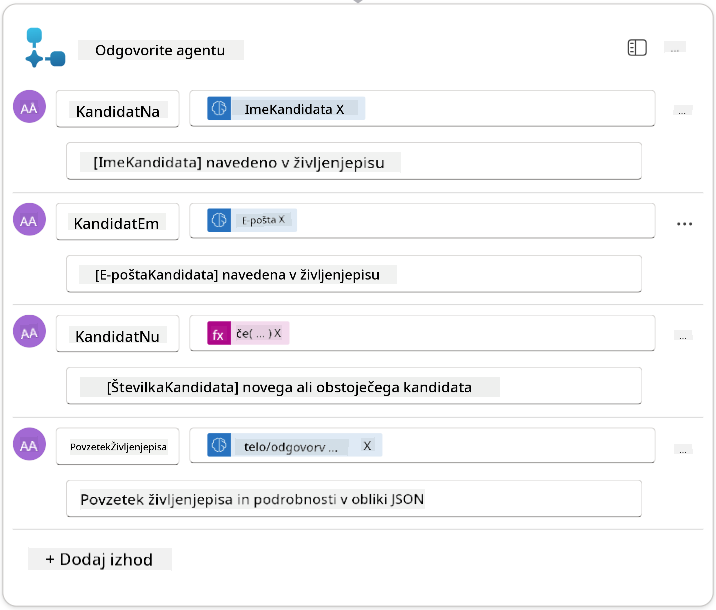

1. Izberite **Shrani osnutek** v zgornjem desnem kotu. Vaš potek agenta bi moral izgledati takole:  
    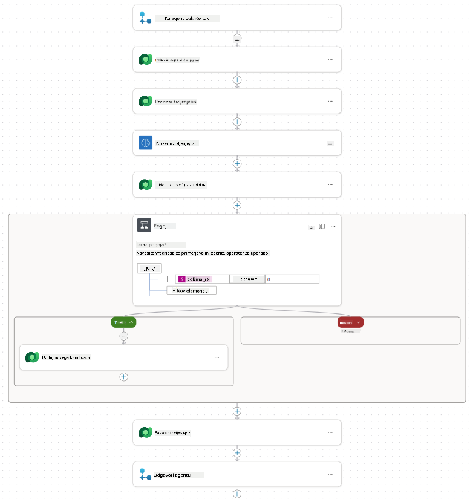

1. Izberite zavihek **Pregled**, izberite **Uredi** v plošči **Podrobnosti**.

    1. **Ime poteka**: `Summarize Resume`
    1. **Opis**:

        ```text
        Summarize an existing Resume stored in Dataverse using a [ResumeNumber] as input, return the [CandidateNumber], and resume summary JSON
        ```

1. Izberite **Shrani**.

1. Ponovno izberite zavihek **Oblikovalec** in izberite **Objavi**.

### 7.6 Povežite potek z vašim agentom

Zdaj boste dodali potek kot orodje in konfigurirali agenta, da ga uporablja.

1. Odprite svojega **Zaposlitvenega agenta** v Copilot Studio.

1. Izberite zavihek **Agenti** in odprite **Agent za sprejem vlog**.

1. Izberite ploščo **Orodja** in izberite **+ Dodaj orodje** - > **Potek** -> **Povzemi življenjepis** **(Agent Flow)**.

1. Izberite **Dodaj in konfiguriraj**.

1. Konfigurirajte nastavitve orodja, kot sledi:

    | Nastavitev | Vrednost |
    |------------|----------|
    | **Opis** | Povzemi obstoječi življenjepis, shranjen v Dataverse, z uporabo [Številke življenjepisa] kot vhod, vrni [Številko kandidata] in povzetek življenjepisa v JSON obliki |
    | **Kdaj se lahko uporablja to orodje** | Samo, ko ga omenjajo teme ali agenti |

1. Izberite **Shrani**  
    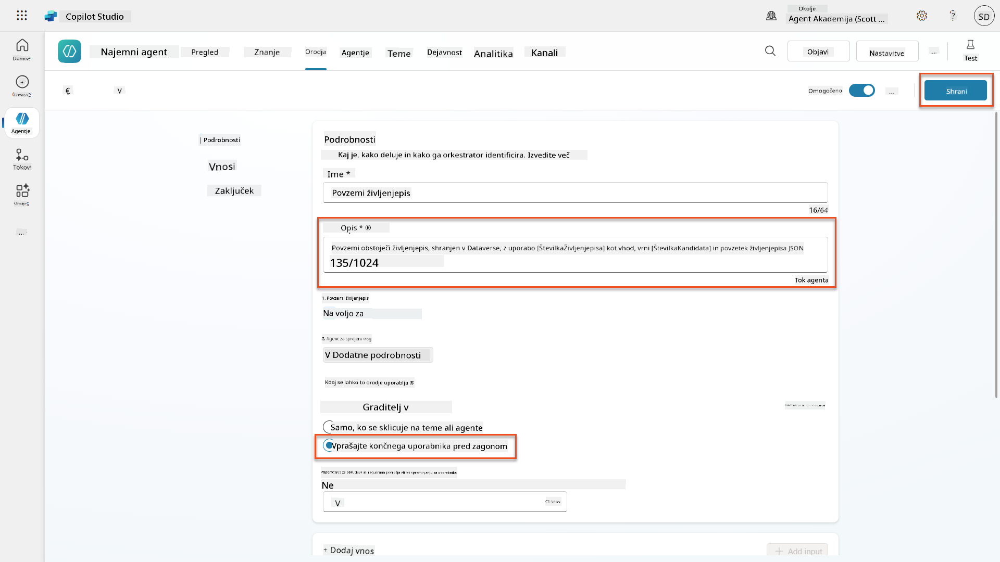

1. Če izberete Orodja znotraj Zaposlitvenega agenta, boste zdaj videli obe naši orodji, ki ju lahko uporablja **Agent za sprejem vlog**.  
    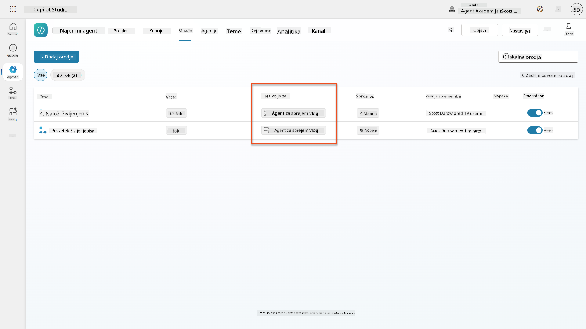

1. Pojdite na navodila agenta **Podagent za sprejem vlog** in spremenite korak **Po nalaganju** v naslednje:

    ```text
    2. Post-Upload Processing  
        - After uploading, be sure to also output the [ResumeNumber] in all messages
        - Pass [ResumeNumber] to /Summarize Resume  - Be sure to use the correct value that will start with the letter R.
        - Be sure to also output the [CandidateNumber] in all messages
        - Use the [ResumeSummary] to output a summary of the processed Resume and candidate
    ```

    Zamenjajte `/Summarize Resume` z vstavitvijo reference na **Povzemi življenjepis agent flow** tako, da vnesete poševnico (`/`) ali izberete `/Summarize`, da vstavite referenco.  
    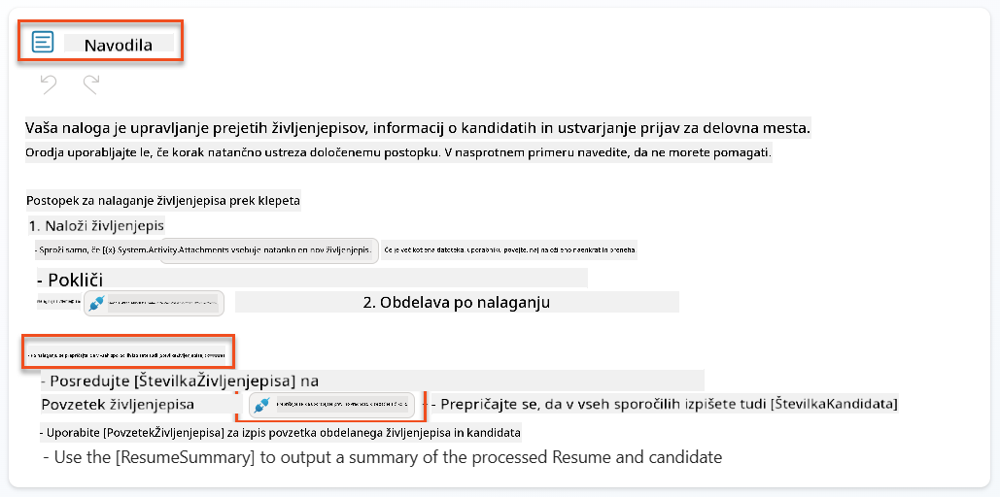

1. Izberite **Shrani**.

### 7.7 Preizkusite svojega agenta

Preizkusite celoten multimodalni sistem, da zagotovite pravilno delovanje.

1. **Začnite testiranje**:

    - Izberite **Testiraj**, da odprete testno ploščo.
    - Vnesite: `Tukaj je življenjepis kandidata`.

    - Naložite enega od vzorčnih življenjepisov iz [Testni življenjepisi](https://download-directory.github.io/?url=https://github.com/microsoft/agent-academy/tree/main/operative/sample-data/resumes&filename=operative_sampledata).

1. **Preverite rezultate**:
    - Ko pošljete sporočilo in življenjepis, preverite, ali prejmete Številko življenjepisa (oblika: R#####).
    - Preverite, ali prejmete Številko kandidata in povzetek.
    - Uporabite zemljevid aktivnosti, da vidite delovanje orodij za nalaganje življenjepisa in povzetek življenjepisa ter da agent prejme izhode poziva za povzetek:  
        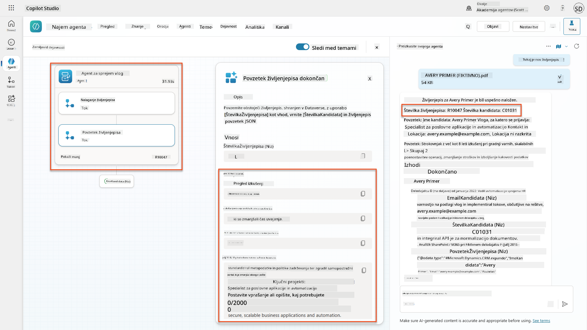

1. **Preverite trajnost podatkov**:
    - Pojdite na [Power Apps](https://make.powerapps.com).
    - Odprite **Aplikacije** → **Hiring Hub** → **Zaženi**.
    - Pojdite na **Življenjepisi**, da preverite, ali je bil življenjepis naložen in obdelan. Moral bi vsebovati tako povzetek informacij kot povezan zapis kandidata.
    - Preverite **Kandidate**, da vidite izvlečene informacije o kandidatu.  
        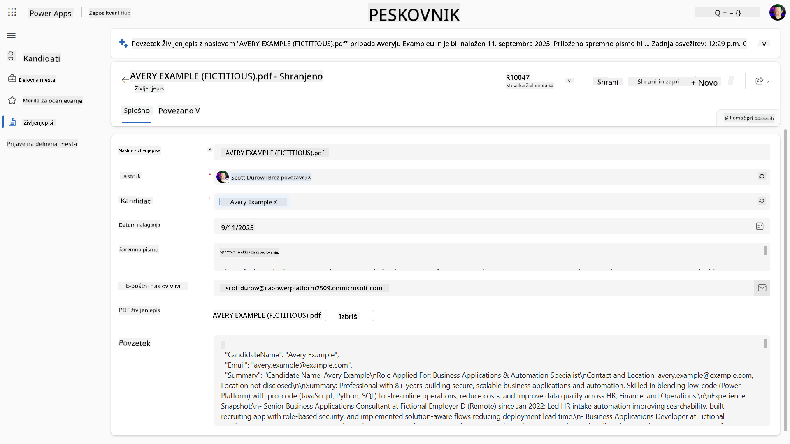
    - Ko ponovno zaženete postopek, bi moral uporabiti obstoječega kandidata (ki se ujema z e-pošto, izvlečeno iz življenjepisa), namesto da bi ustvaril novega.

!!! tip "Odpravljanje težav"
    - **Življenjepis se ne obdeluje**: Prepričajte se, da je datoteka v formatu PDF in da ne presega omejitev velikosti.
    - **Kandidat ni ustvarjen**: Preverite, ali je bila e-pošta pravilno izvlečena iz življenjepisa.
    - **Napake v formatu JSON**: Preverite, ali vaša navodila za poziv vključujejo točno strukturo JSON.
    - **Napake v poteku**: Preverite, ali so vse povezave in izrazi v Dataverse pravilno konfigurirani.

### Pripravljenost za produkcijo

Čeprav to ni del te misije, bi za pripravo tega poteka agenta na produkcijo lahko razmislili o naslednjem:

1. **Ravnanje z napakami** - Če Številka življenjepisa ni bila najdena ali če poziv ni uspel razčleniti dokumenta, je treba dodati ravnanje z napakami, da se agentu vrne jasna napaka.
1. **Posodabljanje obstoječih kandidatov** - Če je kandidat najden z uporabo e-pošte, bi lahko posodobili ime, da se ujema s tistim v življenjepisu.
1. **Razdelitev povzemanja življenjepisa in ustvarjanja kandidata** - To funkcionalnost bi lahko razdelili na manjše poteke agentov, da bi jih bilo lažje vzdrževati, nato pa agentu dali navodila, da jih uporablja zaporedno.

## 🎉 Misija zaključena

Odlično delo, Operative! **Dokumentacija življenjepisov** je zdaj zaključena. Uspešno ste obvladali multimodalne pozive in zdaj lahko natančno izvlečete strukturirane podatke iz katerega koli dokumenta.

Tukaj je, kar ste dosegli v tej misiji:

**✅ Obvladovanje multimodalnih pozivov**  
Zdaj razumete, kaj so multimodalni pozivi in kdaj uporabiti različne AI modele za optimalne rezultate.

**✅ Strokovnost pri obdelavi dokumentov**  
Naučili ste se konfigurirati pozive z vhodnimi podatki iz slik in dokumentov ter oblikovati izhode kot JSON za izvleček strukturiranih podatkov.

**✅ Sistem za izvleček življenjepisov**  
Zgradili ste celoten sistem za obdelavo življenjepisov, ki obdeluje dokumente kandidatov in se integrira v vaš zaposlitveni potek.

**✅ Uporaba najboljših praks**  
Uporabili ste najboljše prakse za oblikovanje pozivov z analizo dokumentov in integracijo multimodalnih pozivov z agentnimi poteki.

**✅ Osnova za napredno obdelavo**  
Vaše izboljšane sposobnosti analize dokumentov so zdaj pripravljene za napredne funkcije utemeljevanja podatkov, ki jih bomo dodali v prihodnjih misijah.

🚀 **Naslednje:** V Misiji 08 boste odkrili, kako izboljšati svoje pozive z realnočasovnimi podatki iz Dataverse, da ustvarite dinamične AI rešitve, ki se prilagajajo spreminjajočim se poslovnim zahtevam.

⏩ [Pojdite na Misijo 08: Izboljšani pozivi z utemeljevanjem v Dataverse](../08-dataverse-grounding/README.md)

## 📚 Taktični viri

📖 [Ustvarite poziv](https://learn.microsoft.com/ai-builder/create-a-custom-prompt?WT.mc_id=power-power-182762-scottdurow)

📖 [Dodajte besedilo, sliko ali dokument kot vhod v vaš poziv](https://learn.microsoft.com/ai-builder/add-inputs-prompt?WT.mc_id=power-182762-scottdurow)

📖 [Obdelajte odgovore z izhodom JSON](https://learn.microsoft.com/ai-builder/process-responses-json-output?WT.mc_id=power-182762-scottdurow)

📖 [Izbira modela in nastavitve temperature](https://learn.microsoft.com/ai-builder/prompt-modelsettings?WT.mc_id=power-182762-scottdurow)

📖 [Uporabite svoj poziv v Power Automate](https://learn.microsoft.com/ai-builder/use-a-custom-prompt-in-flow?WT.mc_id=power-182762-scottdurow)

📺 [AI Builder: JSON izhodi v graditelju pozivov](https://www.youtube.com/watch?v=F0fGnWrRY_I)

---

**Omejitev odgovornosti**:  
Ta dokument je bil preveden z uporabo storitve za prevajanje AI [Co-op Translator](https://github.com/Azure/co-op-translator). Čeprav si prizadevamo za natančnost, vas prosimo, da upoštevate, da lahko avtomatizirani prevodi vsebujejo napake ali netočnosti. Izvirni dokument v njegovem maternem jeziku naj se šteje za avtoritativni vir. Za ključne informacije priporočamo profesionalni človeški prevod. Ne odgovarjamo za morebitna nesporazumevanja ali napačne razlage, ki izhajajo iz uporabe tega prevoda.