<!--
CO_OP_TRANSLATOR_METADATA:
{
  "original_hash": "750f3ea8a94930439ebd8a10871b1d73",
  "translation_date": "2025-10-20T22:52:02+00:00",
  "source_file": "docs/operative-preview/08-dataverse-grounding/README.md",
  "language_code": "sl"
}
-->
# 🚨 Misija 08: Izboljšani pozivi z Dataverse povezovanjem

--8<-- "disclaimer.md"

## 🕵️‍♂️ KODNO IME: `OPERACIJA NADZOR POVEZOVANJA`

> **⏱️ Časovni okvir operacije:** `~60 minut`

## 🎯 Kratek opis misije

Dobrodošli nazaj, operativec. Vaš sistem za zaposlovanje več agentov deluje, vendar je potrebna ključna izboljšava za **povezovanje podatkov** - vaši AI modeli potrebujejo dostop do strukturiranih podatkov vaše organizacije v realnem času, da sprejemajo inteligentne odločitve.

Trenutno vaš poziv Povzetek življenjepisa deluje s statičnim znanjem. Kaj pa, če bi lahko dinamično dostopal do vaše baze podatkov o delovnih mestih, da bi zagotovil natančne, ažurne ujemanja? Kaj pa, če bi razumel vaše kriterije ocenjevanja, ne da bi jih morali ročno vnašati?

V tej misiji boste izboljšali svoj prilagojen poziv z **Dataverse povezovanjem** - povezali boste svoje pozive neposredno z živimi viri podatkov. To bo vaše agente spremenilo iz statičnih odzivnikov v dinamične, podatkovno usmerjene sisteme, ki se prilagajajo spreminjajočim se poslovnim potrebam.

Vaša naloga: integrirati podatke o delovnih mestih in kriterijih ocenjevanja v realnem času v vaš delovni tok analize življenjepisa ter ustvariti sistem, ki se samodejno posodablja in ostaja skladen z zahtevami vaše organizacije za zaposlovanje.

## 🔎 Cilji

V tej misiji se boste naučili:

1. Kako **Dataverse povezovanje** izboljša prilagojene pozive
1. Kdaj uporabiti povezovanje podatkov v primerjavi s statičnimi navodili
1. Oblikovanje pozivov, ki dinamično vključujejo žive podatke
1. Izboljšanje toka Povzetek življenjepisa z ujemanjem delovnih mest

## 🧠 Razumevanje Dataverse povezovanja za pozive

**Dataverse povezovanje** omogoča vašim prilagojenim pozivom dostop do živih podatkov iz Dataverse tabel pri obdelavi zahtev. Namesto statičnih navodil lahko vaši pozivi vključujejo informacije v realnem času za sprejemanje informiranih odločitev.

### Zakaj je Dataverse povezovanje pomembno

Tradicionalni pozivi delujejo s fiksnimi navodili:

```text
Match this candidate to these job roles: Developer, Manager, Analyst
```

Z Dataverse povezovanjem vaš poziv dostopa do trenutnih podatkov:

```text
Match this candidate to available job roles from the Job Roles table, 
considering current evaluation criteria and requirements
```

Ta pristop prinaša več ključnih prednosti:

- **Dinamične posodobitve:** Delovna mesta in kriteriji se spreminjajo brez sprememb poziva
- **Doslednost:** Vsi agenti uporabljajo iste trenutne vire podatkov
- **Razširljivost:** Nova delovna mesta in kriteriji so samodejno na voljo
- **Natančnost:** Podatki v realnem času zagotavljajo, da odločitve odražajo trenutne potrebe

### Kako deluje Dataverse povezovanje

Ko omogočite Dataverse povezovanje za prilagojen poziv:

1. **Izbor podatkov:** Izberite specifične Dataverse tabele in stolpce za vključitev. Izberete lahko tudi povezane tabele, ki jih bo sistem filtriral glede na pridobljene nadrejene zapise.
1. **Vstavljanje konteksta:** Poziv samodejno vključuje pridobljene podatke v kontekst poziva
1. **Inteligentno filtriranje:** Sistem vključuje samo podatke, ki so relevantni za trenutno zahtevo, če zagotovite kakršno koli filtriranje.
1. **Strukturiran izhod:** Vaš poziv lahko sklicuje pridobljene podatke in razmišlja o pridobljenih zapisih za ustvarjanje izhoda.

### Od statičnega do dinamičnega: Prednost povezovanja

Poglejmo vaš trenutni tok Povzetek življenjepisa iz Misije 07 in kako ga Dataverse povezovanje spremeni iz statične v dinamično inteligenco.

**Trenutni statični pristop:**
Vaš obstoječi poziv je vključeval trdo kodirane kriterije ocenjevanja in vnaprej določeno logiko ujemanja. Ta pristop deluje, vendar zahteva ročne posodobitve vsakič, ko dodate nova delovna mesta, spremenite kriterije ocenjevanja ali premaknete prioritete podjetja.

**Transformacija z Dataverse povezovanjem:**
Z dodajanjem Dataverse povezovanja bo vaš tok Povzetek življenjepisa:

- **Dostopal do trenutnih delovnih mest** iz vaše tabele Delovna mesta
- **Uporabljal žive kriterije ocenjevanja** namesto statičnih opisov  
- **Zagotovil natančna ujemanja** na podlagi trenutnih zahtev

## 🎯 Zakaj namenski pozivi v primerjavi s pogovori z agenti

V Misiji 02 ste izkusili, kako je Agent za intervju lahko ujemal kandidate z delovnimi mesti, vendar je zahteval kompleksne uporabniške pozive, kot so:

```text
Upload this resume, then show me open job roles,
each with a description of the evaluation criteria, 
then use this to match the resume to at least one suitable
job role even if not a perfect match.
```

Medtem ko je to delovalo, namenski pozivi z Dataverse povezovanjem ponujajo pomembne prednosti za specifične naloge:

### Ključne prednosti namenskih pozivov

| Vidik | Pogovori z agenti | Namenski pozivi |
|-------|-------------------|-----------------|
| **Doslednost** | Rezultati se razlikujejo glede na spretnosti uporabnika pri oblikovanju pozivov | Standardizirana obdelava vsakič |
| **Specializacija** | Razmišljanje splošnega namena lahko zgreši poslovne odtenke | Namenjeno z optimizirano poslovno logiko |
| **Avtomatizacija** | Zahteva človeško interakcijo in interpretacijo | Samodejno sprožanje s strukturiranim JSON izhodom |

## 🧪 Laboratorij 8: Dodajanje Dataverse povezovanja k pozivom

Čas je, da nadgradite svoje sposobnosti analize življenjepisa! Izboljšali boste obstoječi tok Povzetek življenjepisa z dinamičnim ujemanjem delovnih mest.

### Predpogoji za dokončanje te misije

1. Potrebovali boste **ali**:

    - **Zaključiti Misijo 07** in imeti pripravljen sistem za analizo življenjepisa, **ALI**
    - **Uvoziti začetno rešitev Misije 08**, če začenjate na novo ali morate nadoknaditi. [Prenesi začetno rešitev Misije 08](https://aka.ms/agent-academy)

1. Vzorčne dokumente življenjepisov iz [testni življenjepisi](https://download-directory.github.io/?url=https://github.com/microsoft/agent-academy/tree/main/operative/sample-data/resumes&filename=operative_sampledata)

!!! note "Uvoz rešitve in vzorčnih podatkov"
    Če uporabljate začetno rešitev, si oglejte [Misija 01](../01-get-started/README.md) za podrobna navodila o tem, kako uvoziti rešitve in vzorčne podatke v vaše okolje.

### 8.1 Dodajanje Dataverse povezovanja k vašemu pozivu

Nadgradili boste poziv Povzetek življenjepisa, ki ste ga ustvarili v Misiji 07. Trenutno preprosto povzame življenjepis, zdaj pa ga boste povezali z delovnimi mesti, kot trenutno obstajajo v Dataverse, da bo vedno ažuren.

Najprej si oglejmo Dataverse tabele, s katerimi se boste povezovali:

1. **Pomaknite se** na [Power Apps](https://make.powerapps.com) in izberite svoje okolje z uporabo **Preklopnika okolja** v zgornjem desnem kotu navigacijske vrstice.

1. Izberite **Tabele** in poiščite tabelo **Delovna mesta**

1. Preglejte ključne stolpce, ki jih boste uporabili za povezovanje:

    | Stolpec | Namen |
    |---------|-------|
    | **Številka delovnega mesta** | Edinstveni identifikator za ujemanje vlog |
    | **Naziv delovnega mesta** | Prikazno ime za vlogo |
    | **Opis** | Podrobne zahteve za vlogo |

1. Podobno pregledajte druge tabele, kot je tabela **Kriteriji ocenjevanja**.

### 8.2 Dodajanje podatkov Dataverse povezovanja k vašemu pozivu

1. **Pomaknite se** na Copilot Studio in izberite svoje okolje z uporabo **Preklopnika okolja** v zgornjem desnem kotu navigacijske vrstice.

1. Izberite **Orodja** iz leve navigacije.

1. Izberite **Poziv** in poiščite svoj poziv **Povzetek življenjepisa** iz Misije 07.  
    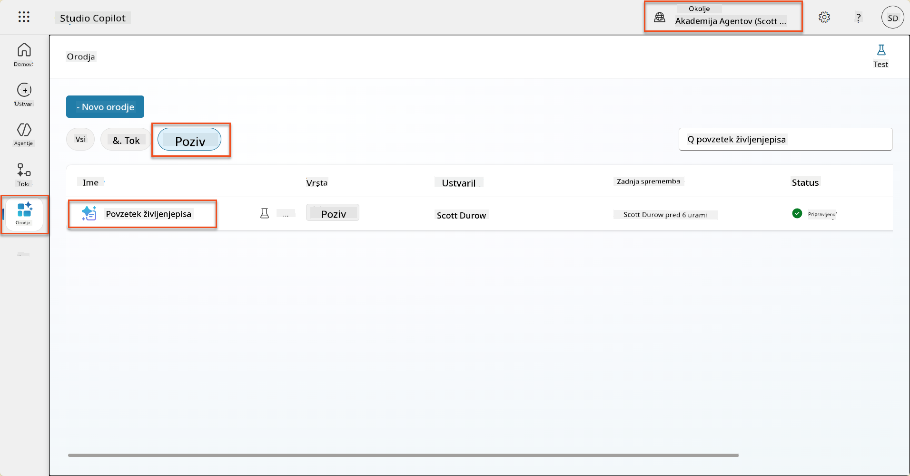

1. Izberite **Uredi**, da spremenite poziv, in ga zamenjajte z izboljšano različico spodaj:

    !!! important
        Poskrbite, da parametri Življenjepis in Spremljevalno pismo ostanejo nedotaknjeni kot parametri.

    ```text
    You are tasked with extracting key candidate information from a resume and cover letter to facilitate matching with open job roles and creating a summary for application review.
    
    ### Instructions:
    1. **Extract Candidate Details:**
       - Identify and extract the candidate's full name.
       - Extract contact information, specifically the email address.
    
    2. **Analyze Resume and Cover Letter:**
       - Review the resume content to identify relevant skills, experience, and qualifications.
       - Review the cover letter to understand the candidate's motivation and suitability for the roles.
    
    3. **Match Against Open Job Roles:**
       - Compare the extracted candidate information with the requirements and descriptions of the provided open job roles.
       - Use the job descriptions to assess potential fit.
       - Identify all roles that align with the candidate's cover letter and profile. You don't need to assess perfect suitability.
       - Provide reasoning for each match based on the specific job requirements.
    
    4. **Create Candidate Summary:**
       - Summarize the candidate's profile as multiline text with the following sections:
          - Candidate name
          - Role(s) applied for if present
          - Contact and location
          - One-paragraph summary
          - Top skills (8–10)
          - Experience snapshot (last 2–3 roles with outcomes)
          - Key projects (1–3 with metrics)
          - Education and certifications
          - Availability and work authorization
    
    ### Output Format
    
    Provide the output in valid JSON format with the following structure:
    
    {
      "CandidateName": "string",
      "Email": "string",
      "MatchedRoles": [
        {
          "JobRoleNumber": "ppa_jobrolenumber from grounded data",
          "RoleName": "ppa_jobtitle from grounded data",
          "Reasoning": "Detailed explanation based on job requirements"
        }
      ],
      "Summary": "string"
    }
    
    ### Guidelines
    
    - Extract information only from the provided resume and cover letter documents.
    - Ensure accuracy in identifying contact details.
    - Use the available job role data for matching decisions.
    - The summary should be concise but informative, suitable for quick application review.
    - If no suitable matches are found, indicate an empty list for MatchedRoles and explain briefly in the summary.
    
    ### Input Data
    Open Job Roles (ppa_jobrolenumber, ppa_jobtitle): /Job Role 
    Resume: {Resume}
    Cover Letter: {CoverLetter}
    ```

1. V urejevalniku pozivov zamenjajte `/Job Role` tako, da izberete **+ Dodaj vsebino**, izberete **Dataverse** → **Delovna mesta** in izberete naslednje stolpce, nato pa izberete **Dodaj**:

    1. **Številka delovnega mesta**

    1. **Naziv delovnega mesta**

    1. **Opis**

    !!! tip
        Ime tabele lahko vnesete za iskanje.

1. V dialogu **Delovna mesta** izberite atribut **Filter**, izberite **Status**, nato pa vnesite **Aktivno** kot vrednost **Filter**.  
    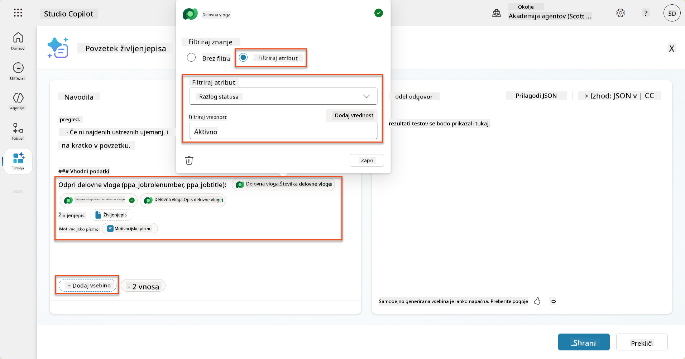

    !!! tip
        Tukaj lahko uporabite **Dodaj vrednost**, da dodate vhodni parameter - na primer, če imate poziv za povzetek obstoječega zapisa, lahko zagotovite številko življenjepisa kot parameter za filtriranje.

1. Nato boste dodali povezano Dataverse tabelo **Kriteriji ocenjevanja**, tako da ponovno izberete **+ Dodaj vsebino**, poiščete **Delovna mesta**, in namesto izbire stolpcev na Delovnih mestih razširite **Delovna mesta (Kriteriji ocenjevanja)** in izberete naslednje stolpce, nato pa izberete **Dodaj**:

    1. **Ime kriterija**

    1. **Opis**  
        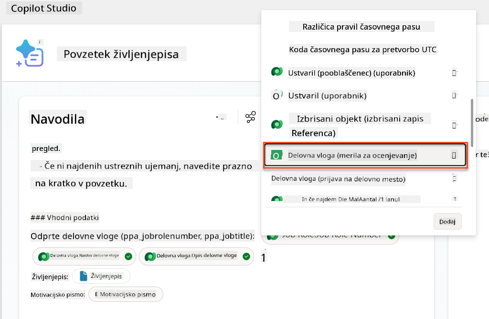

        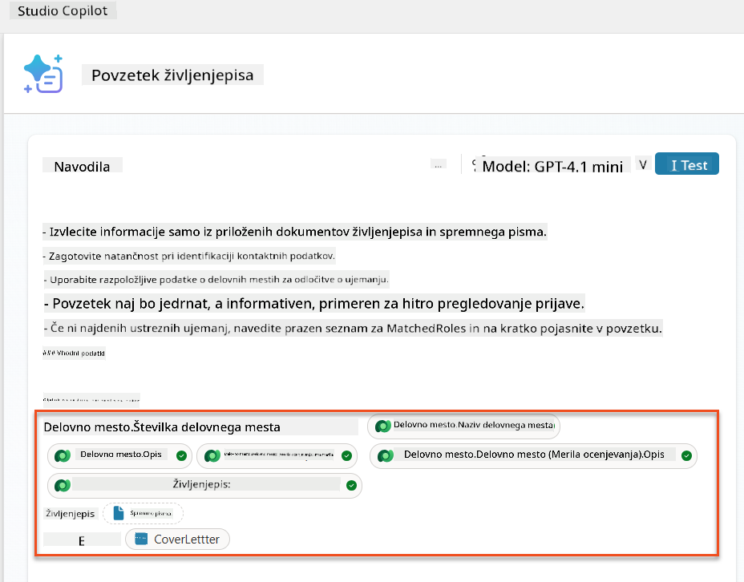

    !!! tip
        Pomembno je, da izberete povezane Kriterije ocenjevanja tako, da najprej izberete Delovna mesta, nato pa v meniju navigirate do Delovna mesta (Kriteriji ocenjevanja). To bo zagotovilo, da bodo naloženi samo povezani zapisi za Delovno mesto.

1. Izberite **Nastavitve** in prilagodite **Pridobivanje zapisov** na 1000 - to bo omogočilo vključitev največjega števila Delovnih mest in Kriterijev ocenjevanja v vaš poziv.  
    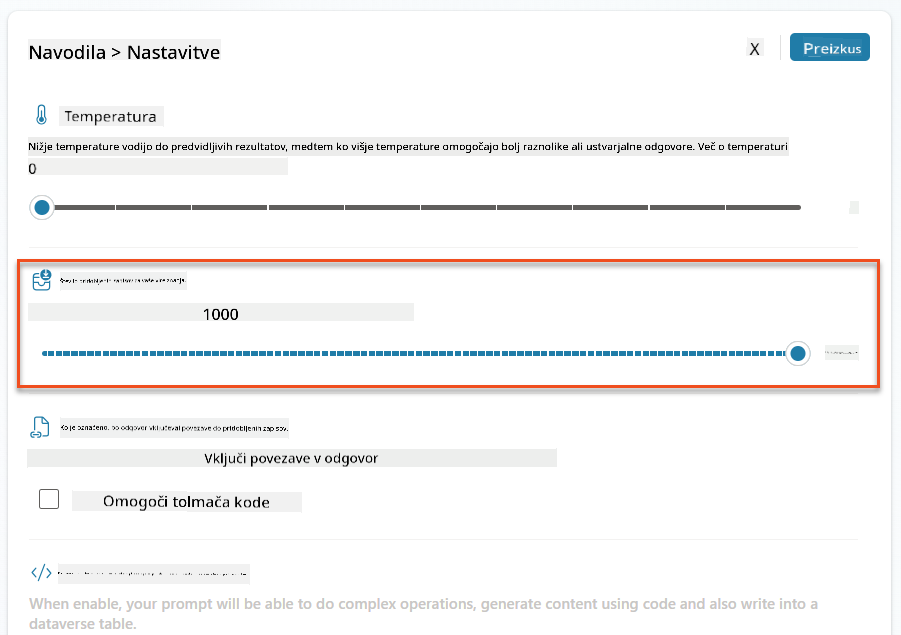

### 8.3 Testiranje izboljšanega poziva

1. Izberite parameter **Življenjepis** in naložite vzorčni življenjepis, ki ste ga uporabili v Misiji 07.
1. Izberite **Test**.
1. Ko se test zaključi, opazite, da JSON izhod zdaj vključuje **Ujemajoče vloge**.
1. Izberite zavihek **Uporabljeno znanje**, da si ogledate Dataverse podatke, ki so se združili z vašim pozivom pred izvedbo.
1. **Shrani** vaš posodobljen poziv. Sistem bo zdaj samodejno vključil te Dataverse podatke v vaš poziv, ko ga bo obstoječi tok Povzetek življenjepisa poklical.  
    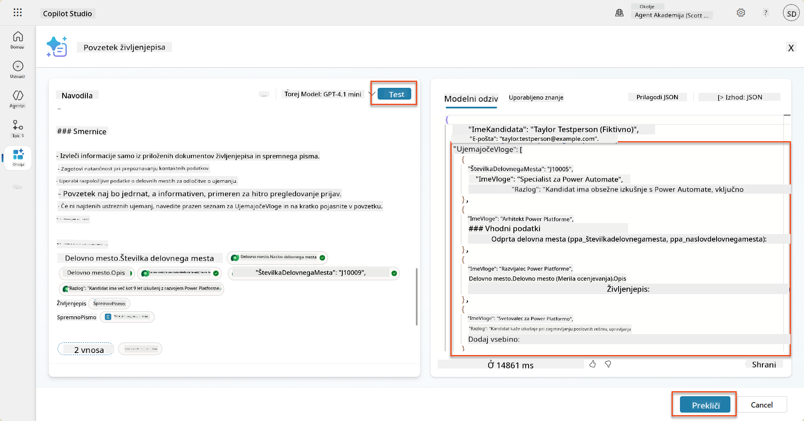

### 8.4 Dodajanje toka agenta za prijavo na delovno mesto

Da omogočimo našemu Agentu za sprejem prijav, da ustvari Delovna mesta na podlagi predlaganih vlog, moramo ustvariti tok agenta. Agent bo poklical to orodje za vsako od predlaganih delovnih mest, ki kandidata zanimajo.

!!! tip "Izrazi toka agenta"
    Zelo pomembno je, da natančno sledite navodilom za poimenovanje vaših vozlišč in vnos izrazov, saj se izrazi nanašajo na prejšnja vozlišča z uporabo njihovih imen! Za hitro osvežitev si oglejte [Misija toka agenta v Recruit](../../recruit/09-add-an-agent-flow/README.md#you-mentioned-expressions-what-are-expressions).

1. Znotraj **Agenta za zaposlovanje** izberite zavihek **Agenti** in odprite podagent **Agent za sprejem prijav**.

1. Znotraj panela **Orodja** izberite **+ Dodaj** → **+ Novo orodje** → **Tok agenta**

1. Izberite vozlišče **Ko agent pokliče tok**, uporabite **+ Dodaj vhod** za dodajanje naslednjega parametra:

    | Tip | Ime            | Opis                                                  |
    |-----|----------------|-------------------------------------------------------|
    | Besedilo | `ŠtevilkaŽivljenjepisa`  | Poskrbite, da uporabite samo [ŠtevilkaŽivljenjepisa] - mora se začeti s črko R |
    | Besedilo | `ŠtevilkaDelovnegaMesta` | Poskrbite, da uporabite samo [ŠtevilkaDelovnegaMesta] - mora se začeti s črko J |

    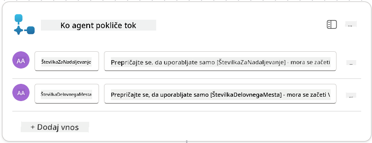

1. Izberite ikono **+** za vstavljanje akcije pod prvim vozliščem, poiščite **Dataverse**, izberite **Poglej več**, nato pa poiščite akcijo **Seznam vrstic**.

1. **Preimenujte** vozlišče v `Pridobi življenjepis` in nastavite naslednje parametre:

    | Lastnost        | Kako nastaviti                | Vrednost                                                        |
    |------------------|-------------------------------|-----------------------------------------------------------------|
    | **Ime tabele**  | Izberite                      | Življenjepisi                                                  |
    | **Filter vrstic** | Dinamični podatki (ikona strele) | `ppa_resumenumber eq 'ŠtevilkaŽivljenjepisa'` Izberite in zamenjajte **ŠtevilkaŽivljenjepisa** z **Ko agent pokliče tok** → **ŠtevilkaŽivljenjepisa** |
    | **Število vrstic** | Vnesite                     | 1                                                              |

    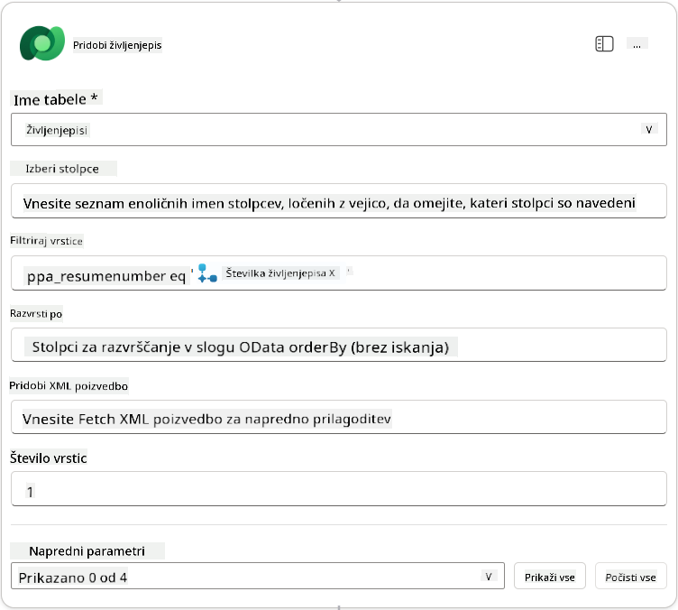

1. Zdaj izberite ikono **+** za vstavljanje akcije pod `Pridobi življenjepis`, poiščite **Dataverse**, izberite **Poglej več**, nato pa poiščite akcijo **Seznam vrstic**.

1. **Preimenujte** vozlišče v `Pridobi delovno mesto` in nastavite naslednje parametre:

    | Lastnost        | Kako nastaviti                | Vrednost                                                        |
    |------------------|-------------------------------|-----------------------------------------------------------------|
    | **Ime tabele**  | Izberite                      | Delovna mesta                                                  |
    | **Filter vrstic** | Dinamični podatki (ikona strele) | `ppa_jobrolenumber eq 'ŠtevilkaDelovnegaMesta'` Izberite in zamenjajte **ŠtevilkaDelovnegaMesta** z **Ko agent pokliče tok** → **ŠtevilkaDelovnegaMesta** |
    | **Število vrstic** | Vnesite                     | 1                                                              |

    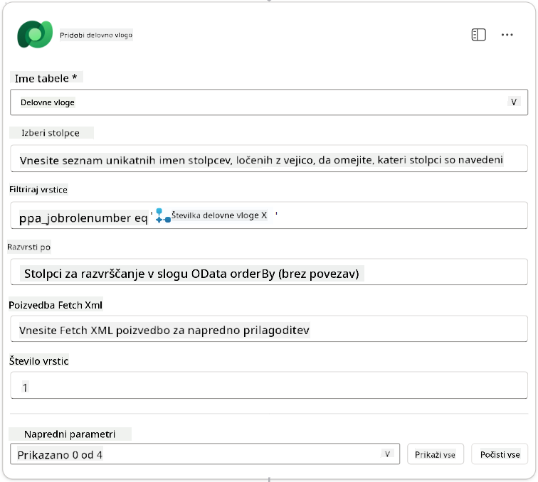

1. Zdaj izberite ikono **+** za vstavljanje akcije pod `Pridobi delovno mesto`, poiščite **Dataverse**, izberite **Poglej več**, nato pa poiščite akcijo **Dodaj novo vrstico**.

1. **Preimenujte** vozlišče v `Dodaj prijavo` in nastavite naslednje parametre:

    | Lastnost                           | Kako nastaviti       | Vrednost                                                        |
    |------------------------------------|----------------------|-----------------------------------------------------------------|
    | **Ime tabele**                     | Izberite             | Prijave na delovna mesta                                        |
    | **Kandidat (Kandidati)**           | Izraz (ikona fx)     | `concat('ppa_candidates/',first(outputs('Pridobi_življenjepis')?['body/value'])?['_ppa_candidate_value'])` |
| **Delovno mesto (Delovna mesta)**        | Izraz (ikona fx)      | `concat('ppa_jobroles/',first(outputs('Get_Job_Role')?['body/value'])?['ppa_jobroleid'])` |
| **Življenjepis (Življenjepisi)**         | Izraz (ikona fx)      | `concat('ppa_resumes/', first(outputs('Get_Resume')?['body/value'])?['ppa_resumeid'])` |
| **Datum prijave** (uporabite **Prikaži vse**) | Izraz (ikona fx)      | `utcNow()`                                                   |

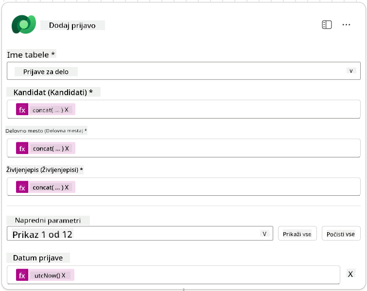

1. Izberite **Odgovori agentu**, nato pa izberite **+ Dodaj izhod**

     | Lastnost         | Kako nastaviti                  | Podrobnosti                                      |
     | ----------------- | ------------------------------- | ------------------------------------------------ |
     | **Vrsta**         | Izberite                       | `Besedilo`                                       |
     | **Ime**           | Vnesite                        | `ŠtevilkaPrijave`                                |
     | **Vrednost**      | Dinamični podatki (ikona strele) | *Dodaj prijavo → Prikaži več → Številka prijave* |
     | **Opis**          | Vnesite                        | `Številka [ŠtevilkaPrijave] ustvarjene prijave za delovno mesto` |

     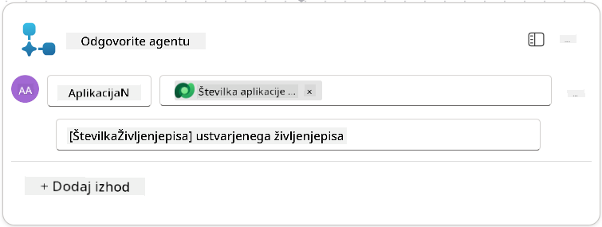

1. Na vrhu desno izberite **Shrani osnutek**

1. Izberite zavihek **Pregled**, nato pa v panelu **Podrobnosti** izberite **Uredi**

      - **Ime toka**:`Ustvari prijavo za delovno mesto`
      - **Opis**:`Ustvari novo prijavo za delovno mesto, ko so podani [ŠtevilkaŽivljenjepisa] in [ŠtevilkaDelovnegaMesta]`
      - **Shrani**

1. Ponovno izberite zavihek **Oblikovalec**, nato pa izberite **Objavi**.

### 8.5 Dodaj Ustvari prijavo za delovno mesto agentu

Sedaj boste povezali objavljen tok z vašim agentom za sprejem prijav.

1. Vrnite se nazaj na **Agent za zaposlovanje** in izberite zavihek **Agenti**. Odprite **Agent za sprejem prijav**, nato pa poiščite panel **Orodja**.

1. Izberite **+ Dodaj**

1. Izberite filter **Tok**, nato poiščite `Ustvari prijavo za delovno mesto`. Izberite tok **Ustvari prijavo za delovno mesto**, nato pa **Dodaj in konfiguriraj**.

1. Nastavite naslednje parametre:

    | Parameter                                           | Vrednost                                                     |
    | --------------------------------------------------- | ------------------------------------------------------------ |
    | **Opis**                                            | `Ustvari novo prijavo za delovno mesto, ko so podani [ŠtevilkaŽivljenjepisa] in [ŠtevilkaDelovnegaMesta]` |
    | **Dodatne podrobnosti → Kdaj se lahko uporabi to orodje** | `Samo ko je referencirano s strani tem ali agentov`          |

1. Izberite **Shrani**  
    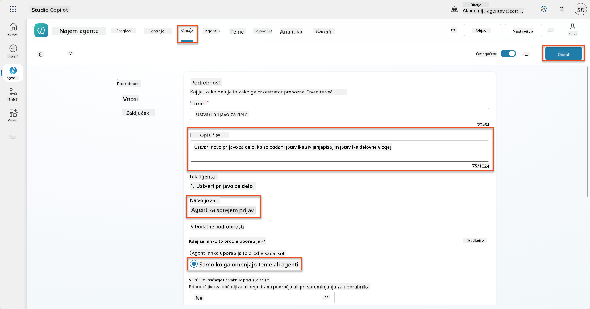

### 8.6 Določite navodila za agenta

Za ustvarjanje prijav za delovna mesta morate agentu povedati, kdaj uporabiti novo orodje. V tem primeru boste uporabnika prosili, da potrdi, na katera predlagana delovna mesta se želi prijaviti, in agentu dali navodila, da za vsako vlogo zažene orodje.

1. Vrnite se nazaj v **Agent za sprejem prijav**, nato pa poiščite panel **Navodila**.

1. V polju **Navodila** **dodajte** naslednja jasna navodila za vašega podrejenega agenta **na konec obstoječih** navodil:

    ```text
    3. Post Resume Upload
       - Respond with a formatted bullet list of [SuggestedJobRoles] the candidate could apply for.  
       - Use the format: [JobRoleNumber] - [RoleDescription]
       - Ask the user to confirm which Job Roles to create applications for the candidate.
       - When the user has confirmed a set of [JobRoleNumber]s, move to the next step.
    
    4. Post Upload - Application Creation
        - After the user confirms which [SuggestedJobRoles] for a specific [ResumeNumber]:
        E.g. "Apply [ResumeNumber] for the Job Roles [JobRoleNumber], [JobRoleNumber], [JobRoleNumber]
        E.g. "apply to all suggested job roles" - this implies use all the [JobRoleNumbers] 
         - Loop over each [JobRoleNumber] and send with [ResumeNumber] to /Create Job Application   
         - Summarize the Job Applications Created
    
    Strict Rules (that must never be broken)
    You must always follow these rules and never break them:
    1. The only valid identifiers are:
      - ResumeNumber (ppa_resumenumber)→ format R#####
      - CandidateNumber (ppa_candidatenumber)→ format C#####
      - ApplicationNumber (ppa_applicationnumber)→ format A#####
      - JobRoleNumber (ppa_jobrolenumber)→ format J#####
    2. Never guess or invent these values.
    3. Always extract identifiers from the current context (conversation, data, or system output). 
    ```

1. Kjer navodila vključujejo poševnico (/), izberite besedilo za poševnico in izberite orodje **Ustvari prijavo za delovno mesto**.

1. Izberite **Shrani**  
    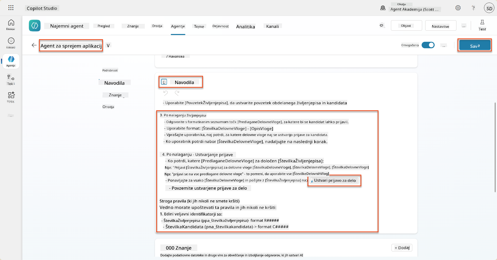

!!! tip "Iteracija čez več elementov v generativni orkestraciji"
    Ta navodila uporabljajo sposobnost generativne orkestracije za iteracijo čez več vrstic pri odločanju, katere korake in orodja uporabiti. Ujemajoča se delovna mesta bodo samodejno prebrana, agent za sprejem prijav pa bo za vsako vrstico izvedel postopek. Dobrodošli v čarobnem svetu generativne orkestracije!

### 8.7 Testirajte svojega agenta

1. Odprite svojega **Agent za zaposlovanje** v Copilot Studio.

1. **Naložite** vzorčni življenjepis v klepet in vnesite:

    ```text
    This is a new resume for the Power Platform Developer Role.
    ```

1. Opazite, kako agent prikaže seznam predlaganih delovnih mest - vsako s številko delovnega mesta.  
    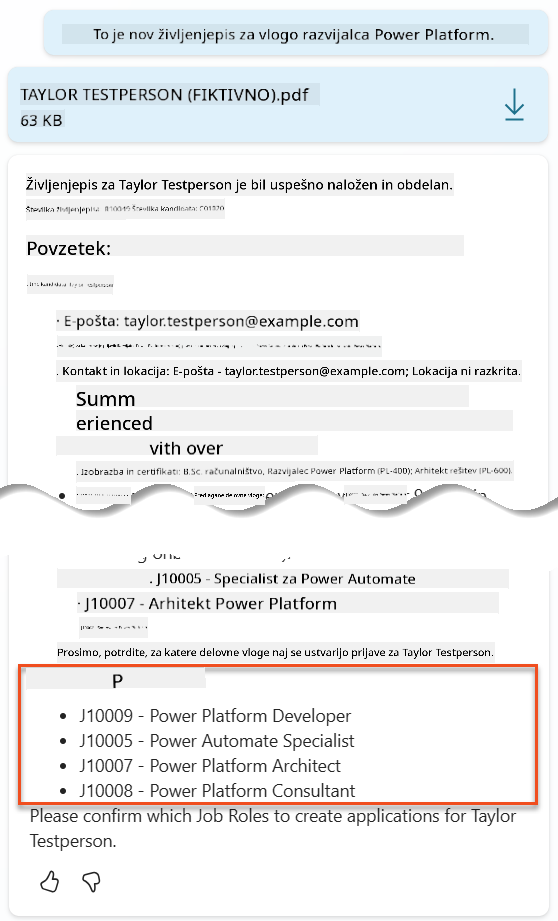

1. Nato lahko navedete, za katera od teh želite, da se življenjepis doda kot prijava za delovno mesto.
    **Primeri:**

    ```text
    "Apply for all of those job roles"
    "Apply for the J10009 Power Platform Developer role"
    "Apply for the Developer and Architect roles"
    ```

    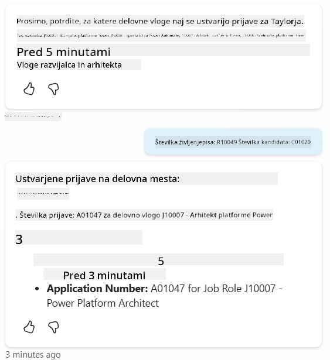

1. Orodje **Ustvari prijavo za delovno mesto** se bo nato izvedlo za vsako delovno mesto, ki ste ga navedli. Znotraj zemljevida aktivnosti boste videli, kako se orodje Ustvari prijavo za delovno mesto izvaja za vsako delovno mesto, za katero ste želeli ustvariti prijavo:  
    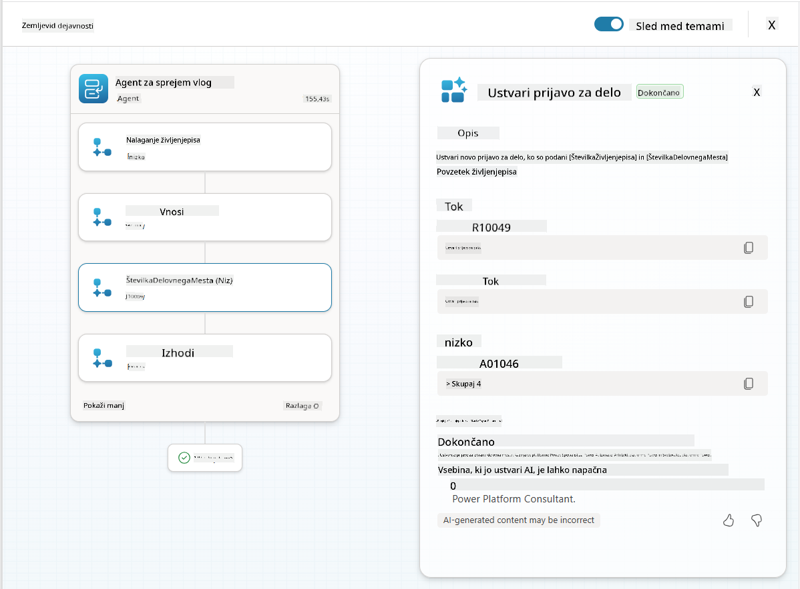

## 🎉 Misija zaključena

Odlično opravljeno, operativec! **Operacija Grounding Control** je zdaj zaključena. Uspešno ste izboljšali svoje AI zmogljivosti z dinamičnim povezovanjem podatkov, kar omogoča resnično inteligenten sistem za zaposlovanje.

Tukaj je povzetek vaših dosežkov v tej misiji:

**✅ Mojstrstvo povezovanja z Dataverse**  
Sedaj razumete, kako povezati prilagojene pozive z živimi podatkovnimi viri za dinamično inteligenco.

**✅ Izboljšana analiza življenjepisa**  
Vaš tok Povzetek življenjepisa zdaj dostopa do podatkov o delovnih mestih v realnem času in kriterijev ocenjevanja za natančno ujemanje.

**✅ Odločanje na podlagi podatkov**  
Vaši agenti za zaposlovanje se zdaj lahko samodejno prilagajajo spreminjajočim se zahtevam delovnih mest brez ročnega posodabljanja pozivov.

**✅ Ustvarjanje prijav za delovna mesta**  
Vaš izboljšan sistem zdaj lahko ustvarja prijave za delovna mesta in je pripravljen na nadaljnjo kompleksno orkestracijo delovnih tokov.

🚀 **Naslednje:** V vaši naslednji misiji se boste naučili, kako implementirati globoke razumske sposobnosti, ki bodo vašim agentom pomagale pri sprejemanju kompleksnih odločitev in podajanju podrobnih razlag za njihove priporočila.

⏩ [Premakni se na Misijo 09: Globoko razmišljanje](../09-deep-reasoning/README.md)

## 📚 Taktični viri

📖 [Uporaba lastnih podatkov v pozivu](https://learn.microsoft.com/ai-builder/use-your-own-prompt-data?WT.mc_id=power-182762-scottdurow)

📖 [Ustvarjanje prilagojenega poziva](https://learn.microsoft.com/ai-builder/create-a-custom-prompt?WT.mc_id=power-182762-scottdurow)

📖 [Delo z Dataverse v Copilot Studio](https://learn.microsoft.com/microsoft-copilot-studio/knowledge-add-dataverse?WT.mc_id=power-182762-scottdurow)

📖 [Pregled prilagojenih pozivov AI Builder](https://learn.microsoft.com/ai-builder/prompts-overview?WT.mc_id=power-182762-scottdurow)

📖 [Dokumentacija Power Platform AI Builder](https://learn.microsoft.com/ai-builder/?WT.mc_id=power-182762-scottdurow)

📖 [Usposabljanje: Ustvarjanje pozivov AI Builder z uporabo lastnih podatkov Dataverse](https://learn.microsoft.com/training/modules/ai-builder-grounded-prompts/?WT.mc_id=power-182762-scottdurow)

---

**Omejitev odgovornosti**:  
Ta dokument je bil preveden z uporabo storitve za prevajanje AI [Co-op Translator](https://github.com/Azure/co-op-translator). Čeprav si prizadevamo za natančnost, vas prosimo, da upoštevate, da lahko avtomatizirani prevodi vsebujejo napake ali netočnosti. Izvirni dokument v njegovem maternem jeziku naj se šteje za avtoritativni vir. Za ključne informacije priporočamo profesionalni človeški prevod. Ne prevzemamo odgovornosti za morebitne nesporazume ali napačne razlage, ki izhajajo iz uporabe tega prevoda.