<!--
CO_OP_TRANSLATOR_METADATA:
{
  "original_hash": "d9cd8cd1a4fbd8915171a2ed972cc322",
  "translation_date": "2025-10-21T00:05:37+00:00",
  "source_file": "docs/recruit/00-course-setup/README.md",
  "language_code": "sl"
}
-->
# 🚨 Misija 00: Nastavitev tečaja

## 🕵️‍♂️ KODNO IME: `OPERACIJA PRIPRAVLJENOST NA UVEDBO`

> **⏱️ Časovni okvir operacije:** `~30 minut`  

## 🎯 Povzetek misije

Dobrodošli na prvi misiji vašega usposabljanja kot agent Copilot Studio.  
Preden začnete graditi svojega prvega AI agenta, morate vzpostaviti **razvojno okolje, pripravljeno za uporabo na terenu**.

Ta povzetek opisuje sisteme, dostopne podatke in korake nastavitve, ki so potrebni za uspešno delovanje v ekosistemu Microsoft 365.

## 🔎 Cilji

Vaša misija vključuje:

1. Pridobitev Microsoft 365 računa  
1. Pridobitev dostopa do Microsoft Copilot Studio  
1. (Neobvezno) Zagotovitev licence za Microsoft 365 Copilot za objavo v produkciji  
1. Ustvarjanje razvojnega okolja kot vašega Copilot Studio okolja za gradnjo  
1. Ustvarjanje SharePoint strani, ki bo služila kot vaš vir podatkov v kasnejših misijah

---

## 🔍 Predpogoji

Preden začnete, se prepričajte, da imate:

1. **Delovni ali šolski e-poštni naslov** (osebni @outlook.com, @gmail.com itd. niso podprti).
1. Dostop do interneta in sodoben brskalnik (priporočamo Edge, Chrome ali Firefox).  
1. Osnovno poznavanje Microsoft 365 (na primer prijava v Office aplikacije ali Teams).  
1. (Neobvezno) Kreditno kartico ali način plačila, če nameravate kupiti plačljive licence.

---

## Korak 1: Pridobite Microsoft 365 račun

Copilot Studio se nahaja znotraj Microsoft 365, zato potrebujete Microsoft 365 račun za dostop. Uporabite lahko obstoječi račun, če ga že imate, ali sledite tem korakom za pridobitev ustrezne licence:

1. **Pridobite plačljivo naročnino na Microsoft 365 Business**  
   1. Obiščite [Stran z načrti in cenami za Microsoft 365 Business](https://www.microsoft.com/microsoft-365/business/microsoft-365-plans-and-pricing)
   1. Najcenejša možnost za začetek je načrt Microsoft 365 Business Basic. Izberite `Preizkusite brezplačno` in sledite vodenemu obrazcu za izpolnitev podatkov o naročnini, računu in plačilu.
   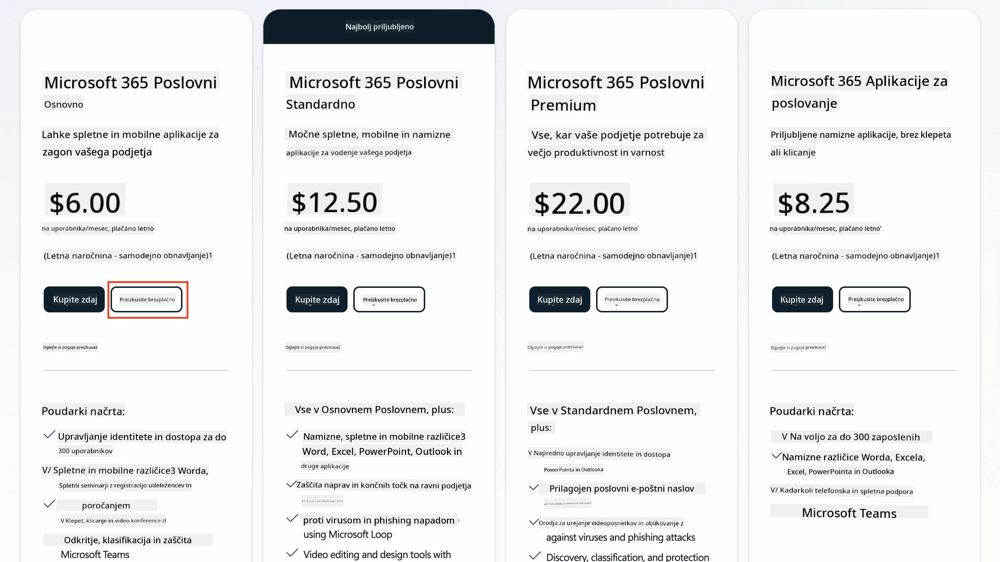
   1. Ko imate nov račun, se prijavite.

    !!! Nasvet
        Če nameravate objavljati agente v Microsoft 365 Copilot Chat ali se povezovati z organizacijskimi podatki (SharePoint, OneDrive, Dataverse), je potrebna licenca za Microsoft 365 Copilot. To je dodatna licenca, o kateri lahko več izveste [na strani z licencami](https://www.microsoft.com/microsoft-365/copilot#plans)

---

## Korak 2: Začnite preizkus Copilot Studio

Ko imate svoj Microsoft 365 Tenant, morate pridobiti dostop do Copilot Studio. Brezplačni 30-dnevni preizkus lahko začnete tako, da sledite tem korakom:

1. Obiščite [aka.ms/TryCopilotStudio](https://aka.ms/TryCopilotStudio).  
1. Vnesite e-poštni naslov iz novega računa, ki ste ga nastavili v prejšnjem koraku, in izberite `Naprej`.  

1. Sistem bi moral prepoznati vaš račun. Izberite `Prijava`.
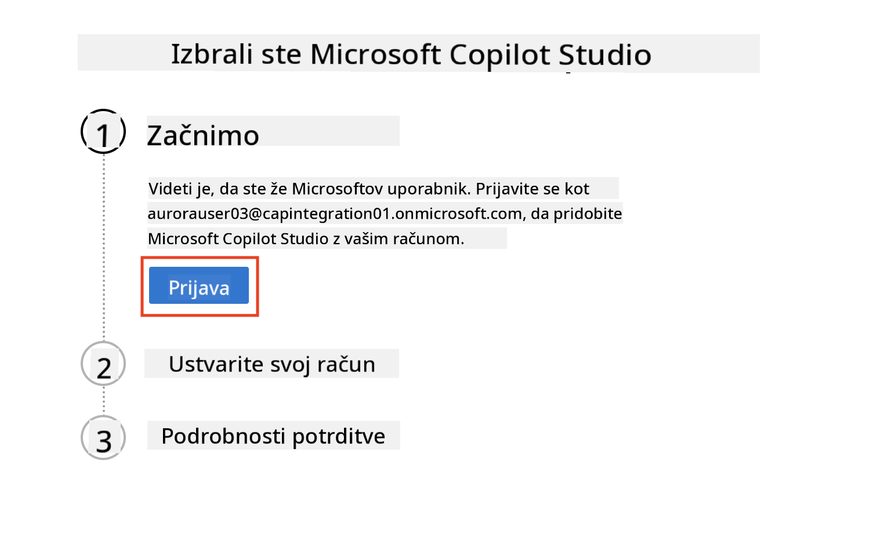  
1. Izberite `Začni brezplačni preizkus`.
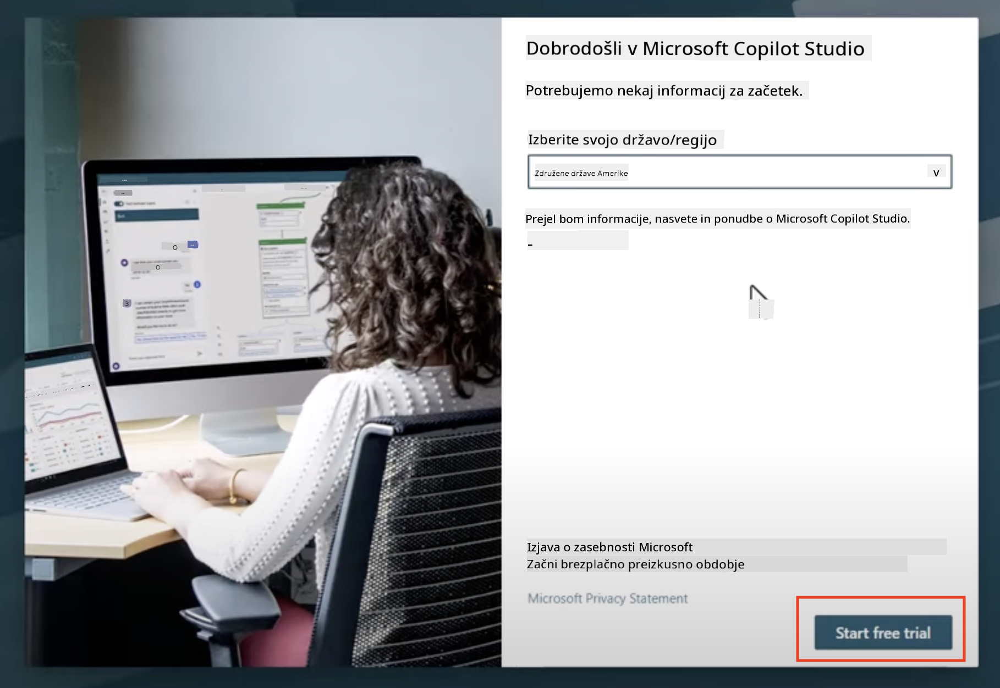

!!! info "Opombe o preizkusu"  
     1. Brezplačni preizkus omogoča **polne zmogljivosti Copilot Studio**.
     1. Prejemali boste e-poštna obvestila o poteku preizkusa. Preizkus lahko podaljšate v 30-dnevnih intervalih (do 90 dni delovanja agenta).  
     1. Če je vaš skrbnik tenanta onemogočil samoprijavo, boste videli napako—kontaktirajte svojega skrbnika za Microsoft 365, da jo ponovno omogoči.

---

## Korak 3: Ustvarite novo razvojno okolje

### Prijavite se na načrt za razvijalce Power Apps

Z uporabo istega Microsoft 365 tenanta iz koraka 1 se prijavite na načrt za razvijalce Power Apps, da ustvarite brezplačno razvojno okolje za gradnjo in testiranje s Copilot Studio.

1. Prijavite se na [spletni strani za načrt za razvijalce Power Apps](https://aka.ms/PowerAppsDevPlan).

    - Vnesite svoj e-poštni naslov
    - Označite potrditveno polje
    - Izberite **Začni brezplačno**

    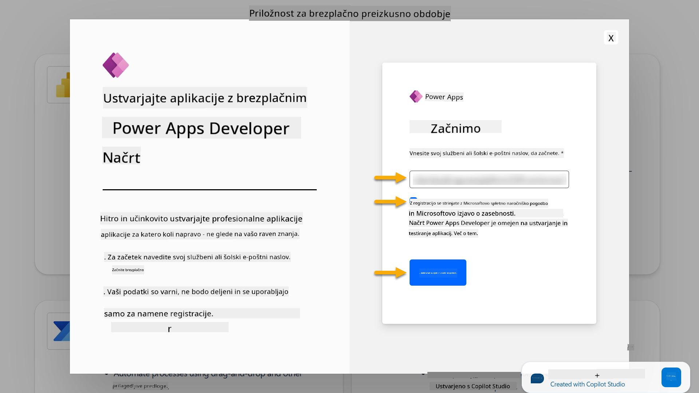

1. Po prijavi na načrt za razvijalce boste preusmerjeni na [Power Apps](https://make.powerapps.com/). Okolje uporablja vaše ime, na primer **Okolje Adele Vance**. Če že obstaja okolje s tem imenom, bo novo okolje za razvijalce poimenovano **Okolje Adele Vance (1)**.

    To razvojno okolje uporabite v Copilot Studio pri izvajanju laboratorijskih vaj.

!!! Opomba
    Če uporabljate obstoječi Microsoft 365 račun in ga niste ustvarili v koraku 1, na primer - uporabljate svoj račun v delovni organizaciji, je vaša IT administracija (ali ekvivalentna ekipa), ki upravlja vaš tenant/okolja, morda onemogočila postopek prijave. V tem primeru se obrnite na svojega skrbnika ali ustvarite testni tenant, kot je opisano v koraku 1.

---

## Korak 4: Ustvarite novo SharePoint stran

Ustvariti je treba novo SharePoint stran, ki bo uporabljena v [Lekciji 06 - Ustvarjanje prilagojenega agenta z izkušnjo pogovornega ustvarjanja s Copilotom in povezovanjem z vašimi podatki](../06-create-agent-from-conversation/README.md#62-add-an-internal-knowledge-source-using-a-sharepoint-site).

1. Na zgornji levi strani Microsoft Copilot Studio izberite ikono vaflja za prikaz menija. Izberite SharePoint iz menija.

    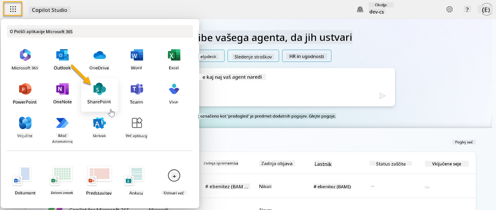

1. SharePoint se bo naložil. Izberite **+ Ustvari stran** za ustvarjanje nove SharePoint strani.

    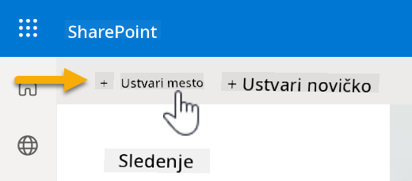

1. Pojavi se pogovorno okno, ki vas vodi pri ustvarjanju nove SharePoint strani. Izberite **Skupinska stran**.

    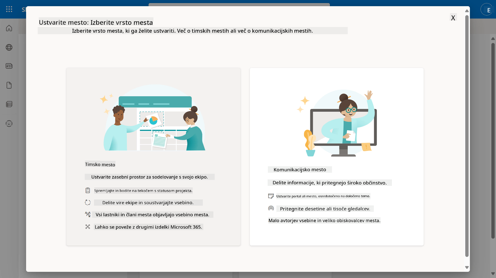

1. V naslednjem koraku se privzeto naloži seznam predlog Microsoft. Pomaknite se navzdol in izberite predlogo **IT pomoč uporabnikom**.

    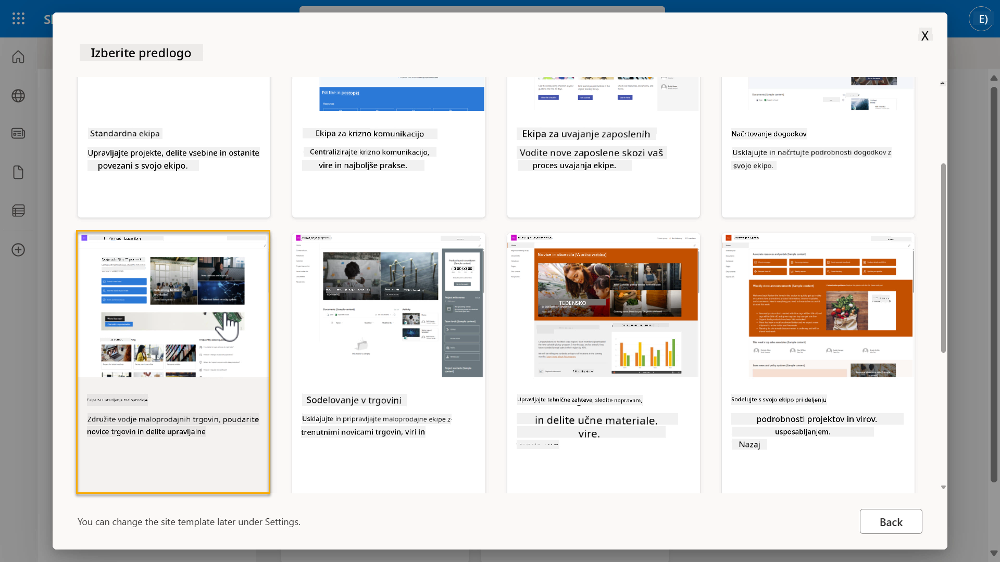

1. Izberite **Uporabi predlogo** za ustvarjanje nove SharePoint strani z uporabo predloge IT pomoč uporabnikom.

    

1. Vnesite informacije za vašo stran. Naslednji primer prikazuje:

    | Polje | Vrednost |
    | --- | --- |
    | Ime strani | Contoso IT |
    | Opis strani | Copilot Studio za začetnike |
    | Naslov strani | ContosoIT |

    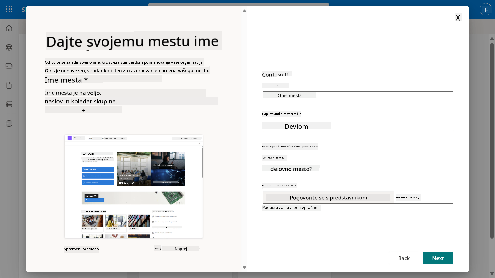

1. V zadnjem koraku lahko izberete jezik za SharePoint stran. Privzeto bo **angleščina**. Jezik pustite kot **angleščina** in izberite **Ustvari stran**.

    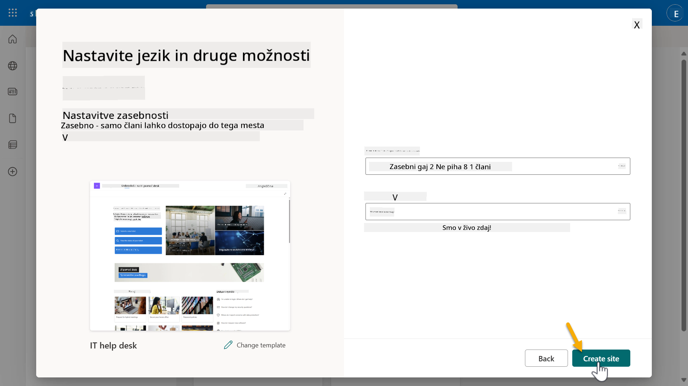

1. SharePoint stran se bo pripravljala nekaj sekund. Medtem lahko dodate druge uporabnike na svojo stran tako, da vnesete njihov e-poštni naslov v polje **Dodaj člane**. Ko končate, izberite **Dokončaj**.

    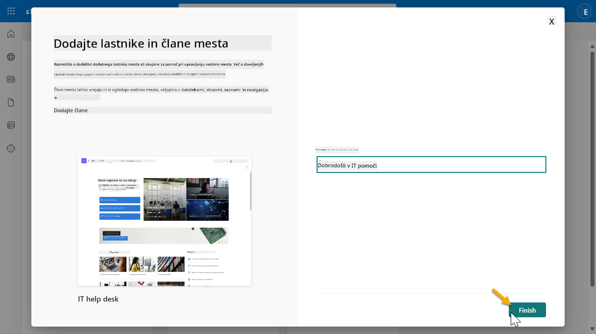

1. Nato se bo naložila domača stran SharePoint strani. **Kopirajte** URL SharePoint strani.

1. Ta predloga ponuja strani z vzorčnimi podatki o različnih IT politikah in dva vzorčna seznama (Vstopnice in Naprave).

### Uporabite seznam naprav SharePoint

Uporabljali bomo seznam **Naprave** v [Misiji 07 - Dodaj novo temo s sprožilcem in vozlišči](../07-add-new-topic-with-trigger/README.md#73-add-a-tool-using-a-connector).

### Dodajte nov stolpec

Pomaknite se na skrajno desno stran seznama in izberite gumb **+ Dodaj stolpec**. Izberite tip **hiperpovezava**, vnesite **Slika** za ime stolpca in izberite dodaj.

### Ustvarite vzorčne podatke v seznamu naprav SharePoint

Poskrbite, da boste ta seznam napolnili z vsaj 4 vzorčnimi podatki in dodali en dodatni stolpec v ta seznam.  

Pri dodajanju vzorčnih podatkov poskrbite, da bodo izpolnjena naslednja polja:

- Fotografija naprave - uporabite slike iz [mape s slikami naprav](https://github.com/microsoft/agent-academy/tree/main/docs/recruit/00-course-setup/images/device-images)
- Naslov
- Status
- Proizvajalec
- Model
- Vrsta sredstva
- Barva
- Serijska številka
- Datum nakupa
- Cena nakupa
- Št. naročila
- Slika - uporabite naslednje povezave

|Naprava  |URL  |
|---------|---------|
|Surface Laptop 13     | [https://raw.githubusercontent.com/microsoft/agent-academy/refs/heads/main/docs/recruit/00-course-setup/images/device-images/Surface-Laptop-13.png](https://raw.githubusercontent.com/microsoft/agent-academy/refs/heads/main/docs/recruit/00-course-setup/images/device-images/Surface-Laptop-13.png)        |
|Surface Laptop 15     | [https://raw.githubusercontent.com/microsoft/agent-academy/refs/heads/main/docs/recruit/00-course-setup/images/device-images/Surface-Laptop-15.png](https://raw.githubusercontent.com/microsoft/agent-academy/refs/heads/main/docs/recruit/00-course-setup/images/device-images/Surface-Laptop-15.png)        |
|Surface Pro    | [https://raw.githubusercontent.com/microsoft/agent-academy/refs/heads/main/docs/recruit/00-course-setup/images/device-images/Surface-Pro-12.png](https://raw.githubusercontent.com/microsoft/agent-academy/refs/heads/main/docs/recruit/00-course-setup/images/device-images/Surface-Pro-12.png)        |
|Surface Studio    | [https://raw.githubusercontent.com/microsoft/agent-academy/refs/heads/main/docs/recruit/00-course-setup/images/device-images/Surface-Studio.png](https://raw.githubusercontent.com/microsoft/agent-academy/refs/heads/main/docs/recruit/00-course-setup/images/device-images/Surface-Studio.png)        |

---

## ✅ Misija zaključena

Uspešno ste:

- Nastavili razvojno okolje Microsoft 365  
- Aktivirali preizkus Copilot Studio  
- Ustvarili SharePoint stran za povezovanje agentov  
- Napolnili seznam naprav za uporabo v prihodnjih misijah

Uradno ste pripravljeni začeti svoje **usposabljanje na ravni rekruta** v [Lekciji 01](../01-introduction-to-agents/README.md).  

<!-- markdownlint-disable-next-line MD033 -->

---

**Omejitev odgovornosti**:  
Ta dokument je bil preveden z uporabo storitve za prevajanje z umetno inteligenco [Co-op Translator](https://github.com/Azure/co-op-translator). Čeprav si prizadevamo za natančnost, vas prosimo, da upoštevate, da lahko avtomatizirani prevodi vsebujejo napake ali netočnosti. Izvirni dokument v njegovem maternem jeziku je treba obravnavati kot avtoritativni vir. Za ključne informacije priporočamo profesionalni človeški prevod. Ne prevzemamo odgovornosti za morebitne nesporazume ali napačne razlage, ki bi nastale zaradi uporabe tega prevoda.