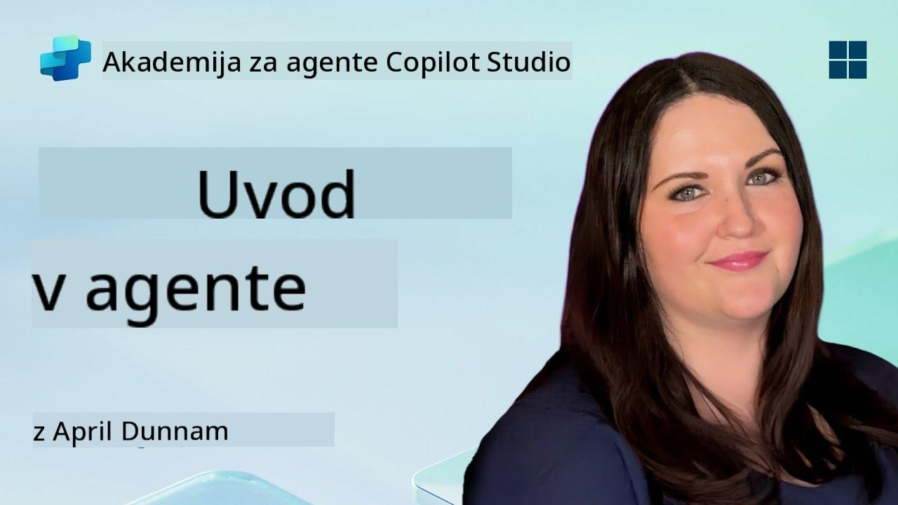

<!--
CO_OP_TRANSLATOR_METADATA:
{
  "original_hash": "d6706e107678264168d77b2e107710b1",
  "translation_date": "2025-10-20T23:33:02+00:00",
  "source_file": "docs/recruit/01-introduction-to-agents/README.md",
  "language_code": "sl"
}
-->
# 🚨 Misija 01: Uvod v agente

## 🕵️‍♂️ KODNO IME: `OPERACIJA DEKODIRANJE AI AGENTA`

> **⏱️ Čas operacije:** `~30 minut – samo informacije, brez terenskega dela`

🎥 **Oglejte si predstavitev**

## 🎯 Povzetek misije

Dobrodošli, rekrut. Preden se lotimo gradnje agentov, morate dobro razumeti AI koncepte, ki jih poganjajo. Ta misija vas bo opremila z osnovnim znanjem o pogovornem AI, velikih jezikovnih modelih (LLM), generaciji, podprti z iskanjem (RAG), in vrstah agentov, ki jih lahko ustvarite v Copilot Studiu.

## 🔎 Cilji

V tej misiji boste spoznali:

1. Kaj je pogovorni AI in zakaj je pomemben  
1. Kako veliki jezikovni modeli (LLM) poganjajo pogovorne izkušnje  
1. Kaj prinaša generacija, podprta z iskanjem (RAG)  
1. Razliko med pogovornimi agenti in avtonomnimi agenti  
1. Kako agenti v Copilot Studiu uporabljajo te koncepte  

Pojdimo naprej!

---

## Kaj je pogovorni AI?

Pogovorni AI se nanaša na vsak sistem, ki lahko razume, obdeluje in odgovarja na človeški jezik – bodisi pisno ali govorno – na način, ki se zdi naraven. Pomislite na klepetalne robote v podpornih centrih ali virtualne osebne asistente v vaših najljubših aplikacijah. V ozadju večina sodobnih pogovornih AI temelji na velikih jezikovnih modelih (LLM), o katerih bomo govorili v nadaljevanju.

### Zakaj je pomemben

- **Uporabniška izkušnja:** Pogovorni vmesniki so pogosto bolj intuitivni kot klikanje po menijih.  
- **Razširljivost:** En agent lahko obravnava desetine ali stotine sočasnih pogovorov.  
- **Učinkovitost:** Namesto da bi gradili prilagojene skripte na osnovi pravil, agenti, ki jih poganjajo LLM, prilagajajo odgovore glede na uporabniški vnos.  
- **Razširljivost:** S pravilno zasnovo lahko agenti dostopajo do baz znanja, se povezujejo z API-ji ali delujejo kot "digitalni sodelavci" znotraj poslovnih procesov.

---

## Veliki jezikovni modeli (LLM) 101

Jedro večine pogovornih AI sistemov predstavljajo **veliki jezikovni modeli** – nevronske mreže, usposobljene na ogromnih korpusih besedil. Naučijo se statističnih vzorcev jezika, da lahko generirajo smiselne stavke, odgovarjajo na vprašanja ali celo razvijajo ideje. Ključne točke za razumevanje:

1. **Podatki za učenje:** LLM-ji obdelujejo terabajte besedil (spletne strani, knjige, članke). To "svetovno znanje" jim omogoča odgovarjanje na številne teme.  
1. **Tokenizacija:** Besedilo se razdeli na manjše enote, imenovane tokeni (besede, podbesede ali znaki). Model napoveduje en token naenkrat.  
1. **Okno konteksta:** Vsak LLM ima omejitev, koliko tokenov lahko "vidi" naenkrat. Ko preseže to mejo, se prejšnji tokeni skrajšajo.  
1. **Podajanje ukazov:** Z LLM komunicirate tako, da mu pošljete ukaz. Boljši kot je ukaz, bolj osredotočen in relevanten bo odgovor.  
1. **Zero-shot proti fine-tuning:** Zero-shot pomeni uporabo LLM takšnega, kot je (samo surovi uteži). Fine-tuning pomeni prilagoditev modela na podatke specifične za določeno področje, da odgovarja bolj natančno glede na vaše potrebe.

!!! Tip "Nasvet"
    Pogosta analogija je, da je LLM kot "super pametno samodokončevanje". Ne razume resnično pomena kot človeški možgani, vendar je izjemno dober pri napovedovanju naslednje najboljše besede (ali fraze) v zaporedju.

---

## Generacija, podprta z iskanjem (RAG)

Ko se LLM-ji zanašajo zgolj na statične podatke za učenje, lahko pride do napačnih informacij ali zastarelosti. RAG to rešuje tako, da modelu omogoča "iskanje" svežih informacij, preden sestavi odgovor. Na splošno RAG deluje takole:

1. **Uporabniško vprašanje:** Uporabnik postavi vprašanje (npr. "Kaj je novega pri četrtletnih zaslužkih podjetja Contoso?").  
1. **Korak iskanja:** Sistem poišče vir znanja (dokumente, notranje baze podatkov, knjižnice SharePoint itd.) za iskanje ustreznih odlomkov.  
1. **Dopolnitev:** Najdeni odlomki se dodajo ali predhodno vključijo v ukaz LLM.  
1. **Generacija:** LLM obdeluje tako uporabnikovo vprašanje kot najdeni kontekst, nato pa ustvari odgovor, ki temelji na najnovejših podatkih.  

Z RAG lahko vaš agent dostopa do notranjih wiki strani podjetja, API vtičnikov ali preišče bazo znanja s pogostimi vprašanji – in vrne odgovore, ki niso omejeni na statično objavljene parametre modela.

---

## Pogovorni proti avtonomnim agentom

V kontekstu Copilot Studia izraz **agent** lahko označuje več vrst AI asistentov. Koristno je razlikovati med:

**Pogovorni agenti:**

- Osredotočajo se predvsem na dvosmerni dialog.  
- Ohranjajo kontekst skozi več izmenjav v pogovoru.  
- Običajno se izvajajo prek vnaprej določenih tokov ali sprožilcev (npr. "Če uporabnik reče X, odgovori z Y").  
- Idealni za podporo strankam, pogosta vprašanja, vodene interakcije, načrtovanje ali preprosta vprašanja in odgovore.  
  - Primeri:
    - Klepetalni robot v Teams, ki odgovarja na vprašanja o politiki kadrovanja.  
    - Bot Power Virtual Agents na strani SharePoint, ki vodi uporabnike skozi obrazec.  

**Avtonomni agenti:**

- Presegajo pogovore; lahko **izvajajo dejanja** v imenu uporabnika.  
- Uporabljajo LLM zanke razmišljanja (pomislite na "načrt → ukrep → opazovanje → ponovni načrt") za dokončanje nalog.  
- Povezujejo se z zunanjimi orodji ali API-ji (npr. sprožijo tok Power Automate, pošljejo povabila na sestanke, manipulirajo s podatki v Dataverse).  
- Delujejo brez stalnih človeških ukazov – ko so sproženi, lahko samostojno obravnavajo večstopenjske procese.  
  - Primeri:  
    - Agent, ki ustvari načrt potovanja, rezervira lete in pošlje potrditve po e-pošti.  
    - Agent "Povzetek sestanka", ki se pridruži klicu v Teams, ga v realnem času prepiše in napiše izvršni povzetek v OneNote.  

!!! Info "Ključna razlika"
    Pogovorni agenti čakajo na uporabniški vnos in se držijo dialoga. Avtonomni agenti proaktivno načrtujejo in izvajajo zaporedje korakov z uporabo širšega dostopa do orodij.

---

## Agenti v Copilot Studiu

**Copilot Studio** združuje tako pogovorne kot avtonomne scenarije v enotnem okviru. Tukaj je, kako Copilot Studio pomaga pri gradnji agentov:

1. **Vizualni oblikovalec agentov:** Platno z malo kode za definiranje ukazov, pomnilnika in orodij za pogovorne in akcijske tokove.  
1. **Konfiguracije LLM:** Izbirajte med različnimi modeli OpenAI ali Microsoftovim GPT za podjetja, da ustrezajo vašim potrebam glede zmogljivosti in stroškov.  
1. **Povezovalniki za iskanje:** Vnaprej pripravljene integracije za SharePoint, OneDrive, Azure Cognitive Search in Dataverse, ki omogočajo RAG takoj.  
1. **Prilagojena orodja in funkcije:** Določite prilagojena dejanja HTTP ali tokove Power Automate, ki jih vaš agent lahko samostojno sproži.  
1. **Podpora za več modalnosti:** Poleg besedila lahko agenti Copilot Studia obdelujejo slike, datoteke ali strukturirane podatke za obogatitev konteksta.  
1. **Objava in distribucija:** Ko je vaš agent pripravljen, ga lahko objavite v Microsoft 365 Copilot (da ga uporabniki sprožijo v Teams, SharePoint, Outlook itd.) ali ga vgradite kot samostojen klepetalni pripomoček na spletni strani.

---

## 🎉 Misija zaključena

Zdaj ste zaključili uvod v agente in osnovne AI koncepte. Razumete:

1. **LLM = "Možgani" vašega agenta**  
   - Odgovorni za razumevanje jezika in generacijo.  
   - Več tokenov = bogatejši kontekst, vendar tudi višji stroški na klic.  

1. **RAG = Integracija znanja v realnem času**  
   - Povezuje vrzel med statičnim LLM in vedno spreminjajočimi se viri podatkov.  
   - Pridobiva in vključuje ustrezne dokumente ali zapise v ukaz LLM.  

1. **Pogovorni proti avtonomnim**  
   - **Pogovorni:** Osredotočajo se na tok dialoga in ohranjanje konteksta (npr. "Pomnilnik seje").  
   - **Avtonomni:** Dodajo "akcijske bloke", ki omogočajo agentu, da se poveže z zunanjimi orodji ali storitvami.

---
Naslednji korak je raziskovanje [osnov Copilot Studia](../02-copilot-studio-fundamentals/README.md)!

Ostanite osredotočeni, rekrut - vaše potovanje v svet AI se šele začenja!

## 📚 Taktični viri

🔗 [Domov dokumentacije Copilot Studio](https://learn.microsoft.com/microsoft-copilot-studio/)

---

---

**Omejitev odgovornosti**:  
Ta dokument je bil preveden z uporabo storitve za prevajanje AI [Co-op Translator](https://github.com/Azure/co-op-translator). Čeprav si prizadevamo za natančnost, vas prosimo, da upoštevate, da lahko avtomatizirani prevodi vsebujejo napake ali netočnosti. Izvirni dokument v njegovem maternem jeziku naj se šteje za avtoritativni vir. Za ključne informacije priporočamo profesionalni človeški prevod. Ne prevzemamo odgovornosti za morebitna nesporazumevanja ali napačne razlage, ki izhajajo iz uporabe tega prevoda.