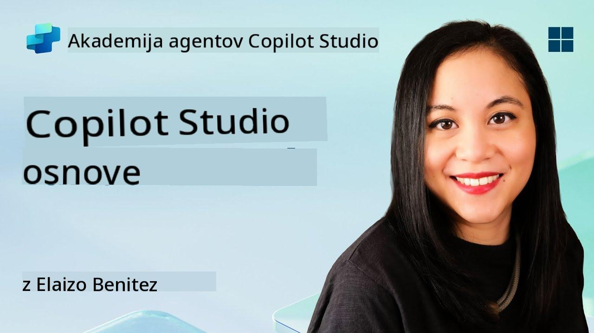
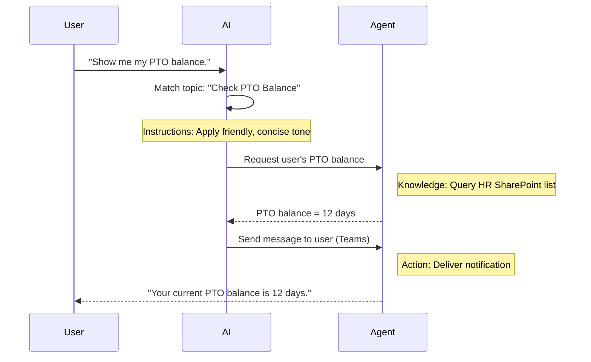

<!--
CO_OP_TRANSLATOR_METADATA:
{
  "original_hash": "90a3c5122f5687bbc8cc819990f175d4",
  "translation_date": "2025-10-20T23:56:00+00:00",
  "source_file": "docs/recruit/02-copilot-studio-fundamentals/README.md",
  "language_code": "sl"
}
-->
# 🚨 Misija 02: Osnove Copilot Studia

## 🕵️‍♂️ KODNO IME: `OPERACIJA OSNOVNI PROTOKOL`

> **⏱️ Časovni okvir operacije:** `~30 minut – samo informacije, brez terenskega dela`  

🎥 **Oglejte si predstavitev**

[](https://www.youtube.com/watch?v=x4OCwDRGeLE "Oglejte si predstavitev na YouTubu")

## 🎯 Kratek opis misije

Dobrodošli, rekrut. Ta misija vas bo opremila z osnovnimi informacijami za razumevanje delovanja Copilot Studia in kako zgraditi inteligentne agente, ki prinašajo resnično poslovno vrednost.

Preden zgradite svojega prvega agenta, morate razumeti štiri ključne komponente, ki sestavljajo vsakega prilagojenega AI agenta: Znanje, Orodja, Teme in Navodila. Prav tako boste izvedeli, kako ti elementi delujejo skupaj v orkestratorju Copilot Studia.

## 🔎 Cilji

V tej misiji boste:

- **Spoznali, kaj je Copilot Studio**
- **Spoznali, kdaj in zakaj uporabljati agente**
- **Raziskali štiri gradnike agentov**
      - **Znanje**
      - **Orodja**
      - **Teme**
      - **Navodila**
- **Razumeli, kako te komponente delujejo skupaj** za ustvarjanje inteligentnega, avtomatiziranega agenta

---

## Kaj so agenti v Copilot Studiu?

**Agent** je specializiran AI asistent, ki ga oblikujete za izvajanje specifičnih nalog ali odgovarjanje na vprašanja. Za razliko od splošnega klepetalnega robota vaš agent:

- **Pozna podatke specifične za podjetje** (politike, dokumente, baze podatkov)  
- **Izvaja naloge v resničnem svetu** (pošiljanje sporočil, ustvarjanje dogodkov v koledarju, posodabljanje zapisov)  
- **Ohranja kontekst pogovora**, da lahko nadaljuje na podlagi prejšnjih vprašanj  

Ker je Copilot Studio nizko-kodna platforma, lahko preprosto povlečete in spustite vnaprej pripravljene komponente—brez potrebe po globokem znanju programiranja. Ko je vaš agent zgrajen, ga lahko ljudje uporabljajo znotraj Teams, Slacka ali celo na prilagojeni spletni strani za pridobivanje odgovorov ali samodejno sprožanje delovnih tokov.

---

## Kdaj in zakaj uporabljati Copilot Studio

Medtem ko Microsoft 365 Copilot zagotavlja splošno AI pomoč v aplikacijah Office, boste potrebovali prilagojenega agenta, ko:

### Potrebujete specifično znanje za določeno področje

- Vgrajeni Copilot morda ne pozna notranjih postopkov ali podatkov vašega podjetja. Agent lahko poizveduje po vaših SharePoint mestih, bazah podatkov ali prilagojenih virih za natančne in ažurne odgovore.  

### Želite avtomatizirati večstopenjske delovne tokove

- Na primer: "Ko nekdo odda strošek, ga pošlji v odobritev, posodobi finančni sledilnik in obvesti vodjo." Prilagojen agent lahko obravnava vsak korak, sprožen z enim ukazom ali dogodkom.  

### Potrebujete kontekstualno izkušnjo znotraj orodja  

- Predstavljajte si agenta za uvajanje novih zaposlenih v Teams, ki vodi HR osebje skozi vse politike, pošilja potrebne obrazce in načrtuje uvodne sestanke—znotraj vašega obstoječega sodelovalnega okolja.  

---

## Štirje gradniki agenta

Vsak agent v Copilot Studiu je zgrajen iz štirih osnovnih komponent:

1. **Znanje**  
1. **Orodja (Dejanja)**  
1. **Teme**  
1. **Navodila**

Spodaj bomo definirali vsak gradnik in pokazali, kako delujejo skupaj za ustvarjanje učinkovitega agenta.

### 1. Znanje

**Znanje** so podatki in kontekst, ki jih vaš agent uporablja za natančno odgovarjanje na vprašanja. Sestavljeno je iz dveh delov:

#### Prilagojena navodila in kontekst

- Napišete kratek opis namena in tona agenta. Na primer:  

    ```text
    You are an IT support agent. You help employees troubleshoot common software issues, provide troubleshooting steps, and escalate urgent tickets.
    ```

- Med pogovorom agent si zapomni prejšnje korake, da se lahko sklicuje na že obravnavane teme (na primer, če uporabnik najprej reče: "Moj tiskalnik ne deluje," nato pa vpraša: "Ali ste preverili nivo črnila?" agent si zapomni kontekst tiskalnika).

#### Viri znanja (Osnovni podatki)

- Svojega agenta povežete z več viri podatkov—SharePoint knjižnicami, dokumentacijskimi mesti, wikiji ali drugimi bazami podatkov.  
- Ko uporabnik postavi vprašanje, agent pridobi ustrezne odlomke iz teh virov, tako da so odgovori **osnovani** na dejanskih politikah, priročnikih za izdelke ali drugih lastniških informacijah vaše organizacije.  
- Agenta lahko celo prisilite, da odgovarja samo z informacijami iz teh virov, kar preprečuje ugibanje ali "haluciniranje" odgovorov.

!!! example
    Agent "Pomočnik za politike" bi se lahko povezal z vašim HR SharePoint mestom. Če uporabnik vpraša: "Kakšna je naša stopnja akumulacije PTO?" agent pridobi točen tekst iz dokumenta o HR politikah, namesto da bi se zanašal na generični AI odgovor.

---

### 2. Orodja (Dejanja)

**Orodja (Dejanja)** določajo, kaj lahko agent naredi poleg klepeta. Vsako dejanje je naloga, ki jo agent izvaja programatično, kot na primer:

- Pošiljanje e-pošte ali sporočila v Teams  
- Ustvarjanje ali posodabljanje dogodka v koledarju  
- Dodajanje ali urejanje zapisa v bazi podatkov (npr. SharePoint seznam ali Dataverse tabela)  
- Klicanje Power Automate toka ali REST API-ja  

#### Kako delujejo dejanja

- **Določanje vhodov in izhodov**  
      - Na primer, dejanje Pošlji e-pošto lahko zahteva:  
        - `RecipientEmailAddress`  
        - `SubjectLine`  
        - `EmailBody`  

- **Združevanje dejanj v delovne tokove**  
      - Pogosto izpolnjevanje zahteve uporabnika vključuje več korakov.  
      - Dejanje lahko zaporedno povežete tako, da:  
             1. Agent pridobi podatke iz SharePoint seznama.  
             2. Ustvari povzetek z uporabo LLM.  
             3. Pošlje sporočilo v Teams s tem povzetkom.  

- **Povezovanje z zunanjimi sistemi**  
      - Če morate posodobiti CRM ali poklicati notranji API, ustvarite prilagojeno dejanje za to.  
      - Copilot Studio se lahko integrira s Power Platform ali katerim koli HTTP-podprtim končnim točkam.

!!! example "Agent "Pomočnik za stroške" bi lahko:"  
    1. Poslušal zahtevo "Oddaj strošek".  
    2. Pridobil podrobnosti o strošku uporabnika iz obrazca.  
    3. Uporabil dejanje "Dodaj na SharePoint seznam" za shranjevanje podatkov.  
    4. Sprožil dejanje "Pošlji e-pošto" za obvestilo odločevalca.  

---

### 3. Teme

**Teme** določajo sprožilce pogovora ali vstopne točke za vašega agenta. Vsaka tema ustreza funkcionalnosti ali kategoriji vprašanja.

#### Sprožilci pogovora  

- Tema bi lahko bila "Oddaj IT zahtevek," "Preveri stanje dopusta," ali "Ustvari prodajno poročilo."  
- V ozadju Copilot Studio uporablja **generativno orkestracijo**: namesto da se zanaša na točne ključne besede, AI interpretira namen uporabnika in izbere pravo temo na podlagi kratkega opisa, ki ga podate.  

#### Opisi tem  

- V vsaki temi napišete jasen, jedrnat opis, kaj tema zajema.

!!! example "Primer opisa teme"
    Ta tema pomaga uporabnikom oddati IT zahtevek za podporo z zbiranjem podrobnosti o težavi, prioritete in kontaktnih informacij.

- AI uporablja ta opis za odločanje, kdaj aktivirati to temo, tudi če uporabnikova formulacija ni povsem skladna.

#### Povezovanje tem z dejanji  

- Vsaka tema je povezana z enim ali več dejanji ali koraki pridobivanja podatkov.  
- Ko AI izbere temo, vodi pogovor skozi zaporedje, ki ste ga določili (postavlja dodatna vprašanja, kliče dejanja, vrača rezultate).

!!! example
    Če uporabnik reče: "Potrebujem pomoč pri nastavitvi novega prenosnika," AI lahko poveže ta namen s temo "Oddaj IT zahtevek". Agent nato vpraša za model prenosnika, podrobnosti uporabnika in samodejno odda zahtevek v sistem za podporo.

---

### 4. Navodila

**Navodila** (včasih imenovana "Pozivi" ali "Sistemska sporočila") usmerjajo ton, slog in meje LLM. Oblikujejo, kako agent odgovarja v vsaki situaciji.

#### Vloga in osebnost  

- AI-ju poveste, kdo je (npr. "Vi ste agent za podporo strankam podjetja Contoso Retail").  
- To določa ton—prijazen, jedrnat, formalen ali sproščen—odvisno od vašega primera uporabe.

#### Smernice za odgovore  

- Določite pravila, ki jih mora agent upoštevati, kot na primer:  
      - "Vedno povzemite informacije o politiki v obliki točk."  
      - "Če ne poznate odgovora, recite ‘Oprostite, te informacije nimam.’"  
      - "Nikoli ne vključujte zaupnih podatkov izven konteksta."

#### Pravila za pomnjenje in kontekst

- Agenta lahko usmerite, koliko korakov pogovora naj si zapomni.  
- Na primer: "Zapomni si podrobnosti iz zahtev tega uporabnika za največ tri nadaljnja vprašanja."

!!! example "V agentu "Svetovalec za ugodnosti" bi lahko vključili:"
    "Vedno se sklicujte na najnovejši HR priročnik pri odgovarjanju na vprašanja. Če vas vprašajo o rokih za prijavo, navedite točne datume iz politike. Odgovore omejite na največ 150 besed."

---

## Kako štirje gradniki delujejo skupaj

Ko združite **Znanje**, **Orodja**, **Teme** in **Navodila**, AI orkestrator Copilot Studia ustvari agenta, ki:

1. **Posluša za ustrezno temo** (vodeno z vašimi opisi tem).  
1. **Uporablja navodila** za določanje tona, odločanje, kdaj postaviti dodatna vprašanja, in uveljavljanje pravil.  
1. **Izkoristi vire znanja** za osnovanje odgovorov na podatke vaše organizacije.  
1. **Kliče orodja (dejanja)** po potrebi za izvajanje nalog—pošiljanje sporočil, posodabljanje zapisov ali klicanje API-jev.  

V ozadju orkestrator uporablja pristop **generativnega načrtovanja**: odloča, katere korake izvesti in v kakšnem vrstnem redu, da izpolni zahtevo uporabnika. Če dejanje ne uspe (na primer, e-pošte ni mogoče poslati), agent sledi vašim smernicam za obravnavo izjem (postavi dodatno vprašanje ali poroča o napaki). Ker se LLM prilagaja kontekstu pogovora, lahko agent ohranja pomnilnik skozi več korakov in vključuje nove informacije, ko se pogovor razvija.

**Primer vizualnega toka:**  
<!--
1. **Uporabnik:** "Pokaži mi stanje mojega dopusta."
1. **AI (Teme):** Poveže se s temo "Preveri stanje dopusta".  
1. **AI (Navodila):** Uporabi prijazen, jedrnat ton.  
1. **Agent (Znanje):** Poizveduje po HR SharePoint seznamu za stanje uporabnika.  
1. **Agent (Dejanja):** Pridobi vrednost in pošlje sporočilo v Teams:  
   > "Vaše trenutno stanje dopusta je 12 dni."  
-->



---

## 🎉 Misija zaključena

Uspešno ste zaključili uvodno usposabljanje. Zdaj ste se naučili štiri ključne gradnike vsakega agenta v Copilot Studiu:

1. **Znanje** – Kje agent pridobi dejanske informacije in ohranja pomnilnik pogovora.  
1. **Orodja** – Naloge, ki jih agent lahko izvaja za samodejno izvedbo.  
1. **Teme** – Kako agent prepozna namen uporabnika in odloči, kateri delovni tok naj zažene.  
1. **Navodila** – Pravila, ton in meje, ki usmerjajo vsak odgovor.

S temi komponentami lahko zgradite osnovnega agenta, ki odgovarja na vprašanja in izvaja preproste delovne tokove. V naslednji lekciji bomo korak za korakom ustvarili "Service Desk" agenta—od povezovanja vašega prvega vira znanja do definiranja teme in povezovanja dejanja.

Naslednje: Zgradili boste [svojega prvega deklarativnega agenta za M365 Copilot](../03-create-a-declarative-agent-for-M365Copilot/README.md).

<!-- markdownlint-disable-next-line MD033 -->


---

**Omejitev odgovornosti**:  
Ta dokument je bil preveden z uporabo storitve za prevajanje AI [Co-op Translator](https://github.com/Azure/co-op-translator). Čeprav si prizadevamo za natančnost, vas prosimo, da upoštevate, da lahko avtomatizirani prevodi vsebujejo napake ali netočnosti. Izvirni dokument v njegovem maternem jeziku naj se šteje za avtoritativni vir. Za ključne informacije priporočamo profesionalni človeški prevod. Ne odgovarjamo za morebitna nesporazumevanja ali napačne razlage, ki izhajajo iz uporabe tega prevoda.