<!--
CO_OP_TRANSLATOR_METADATA:
{
  "original_hash": "0c51aabca81d6256990caf4c015e6195",
  "translation_date": "2025-10-20T23:35:55+00:00",
  "source_file": "docs/recruit/04-creating-a-solution/README.md",
  "language_code": "sl"
}
-->
# 🚨 Misija 04: Ustvarjanje rešitve za vašega agenta

## 🕵️‍♂️ KODNO IME: `OPERACIJA CTRL-ALT-PAKET`

> **⏱️ Časovni okvir operacije:** `~45 minut`

🎥 **Oglejte si video vodič**

[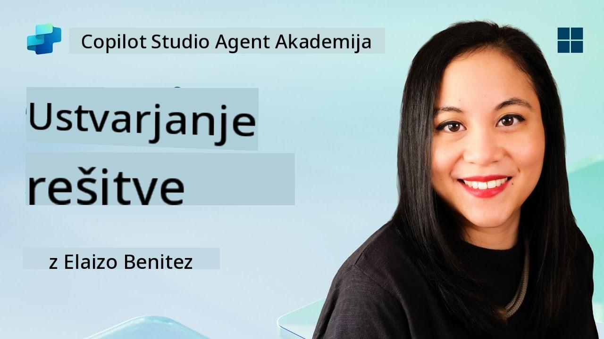](https://www.youtube.com/watch?v=1iATbkgfcpU "Oglejte si vodič na YouTubu")

## 🎯 Povzetek misije

Ustvarjalec agentov, dobrodošli v vaši naslednji taktični operaciji. V tej misiji se boste naučili sestaviti Rešitev - uradno vozilo za uvajanje vašega IT Helpdesk agenta, ustvarjenega z Microsoft Copilot Studio. Pomislite na to kot na digitalni kovček, ki vsebuje vašega agenta in njegove artefakte.

Vsak agent potrebuje dobro strukturiran dom. To zagotavlja rešitev Power Platform - red, prenosljivost in pripravljenost za produkcijo.

Začnimo s pakiranjem.

## 🔎 Cilji

V tej misiji se boste naučili:

1. Razumeti, kaj so rešitve Power Platform in njihovo vlogo pri razvoju agentov
1. Spoznati prednosti uporabe rešitev za organizacijo in uvajanje agentov
1. Raziskati založnike rešitev in njihov pomen pri upravljanju komponent
1. Razumeti življenjski cikel rešitev Power Platform od razvoja do produkcije
1. Ustvariti svojega založnika rešitev in prilagojeno rešitev za vašega IT Helpdesk agenta

## 🕵🏻‍♀️ Rešitev? Kaj je to?

V Microsoft Power Platform so rešitve kot posode ali paketi, ki vsebujejo vse dele vaših aplikacij ali agentov - to so lahko tabele, obrazci, tokovi in prilagojena logika. Rešitve so ključne za upravljanje življenjskega cikla aplikacij (ALM), saj omogočajo upravljanje vaše aplikacije in agentov od ideje do razvoja, testiranja, uvajanja in posodobitev.

V Copilot Studio je vsak agent, ki ga ustvarite, shranjen v rešitvi Power Platform. Privzeto so agenti ustvarjeni v privzeti rešitvi, razen če ustvarite novo prilagojeno rešitev, v kateri ustvarite svojega agenta. To bomo spoznali 🤓 v tej lekciji in praktičnem laboratoriju.

Rešitve so bile tradicionalno ustvarjene v **portalu za ustvarjanje Power Apps** - spletni vmesnik, kjer lahko gradite in prilagajate aplikacije, Dataverse, tokove, raziskujete AI komponente in še več.

   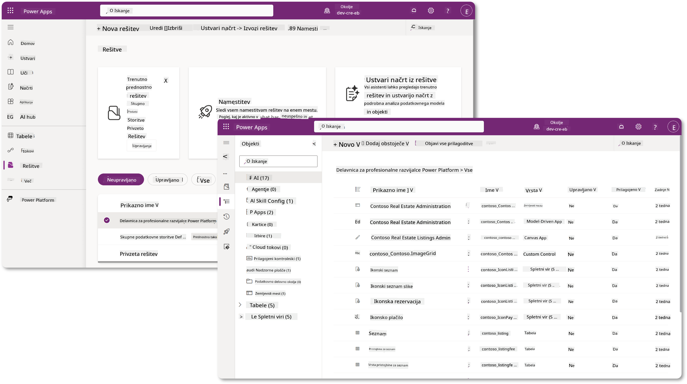

V Copilot Studio je zdaj na voljo **Raziskovalec rešitev**, kjer lahko neposredno upravljate svoje rešitve. Ni vam več treba preklapljati na portal za ustvarjanje Power Apps za upravljanje rešitev, to lahko storite kar znotraj Copilot Studio 🪄

To pomeni, da lahko izvajate običajne naloge, povezane z rešitvami:

- **Ustvarite rešitev** - prilagojene rešitve omogočajo izvoz in uvoz agentov med okolji.
- **Nastavite želeno rešitev** - izberite rešitev, v kateri bodo privzeto ustvarjeni agenti, aplikacije itd.
- **Dodajte ali odstranite komponente** - vaš agent lahko uporablja druge komponente, kot so okoljske spremenljivke ali tokovi v oblaku. Zato je treba te komponente vključiti v rešitev.
- **Izvoz rešitev** - za premik rešitev v drugo ciljno okolje.
- **Uvoz rešitev** - uvoz rešitev, ustvarjenih drugje, vključno z nadgradnjo ali posodobitvijo rešitev.
- **Ustvarite in upravljajte cevovode rešitev** - avtomatizirajte uvajanje rešitev med okolji.
- **Integracija z Git** - omogoča razvijalcem povezovanje rešitev z Git repozitoriji za nadzor različic, sodelovanje in ALM. Namenjeno uporabi samo v razvojnih okoljih.

   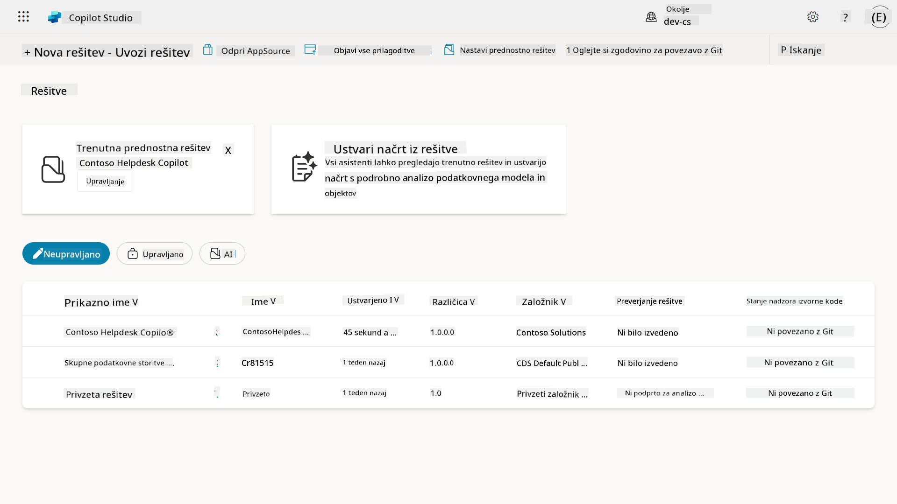

Obstajata dve vrsti rešitev:

- **Neupravljane rešitve** - uporabljajo se med razvojem. Lahko jih prosto urejate in prilagajate po potrebi.
- **Upravljane rešitve** - uporabljajo se, ko ste pripravljeni na uvajanje aplikacije v testiranje ali produkcijo. Te so zaklenjene, da preprečijo nenamerne spremembe.

## 🤔 Zakaj _bi moral_ uporabiti rešitev za svojega agenta?

Pomislite na rešitve kot na _orodjarno_. Ko morate nekaj popraviti ali zgraditi (agenta) na drugem mestu (okolju), zberete vsa potrebna orodja (komponente) in jih shranite v svojo orodjarno (rešitev). Nato lahko to orodjarno prenesete na novo lokacijo (okolje) in uporabite orodja (komponente) za dokončanje dela ali dodate nova orodja (komponente) za prilagoditev vašega agenta ali projekta, ki ga gradite.

!!! quote "Elaiza, vaša prijazna zagovornica oblaka, ki se oglaša 🙋🏻‍♀️, da deli nekaj misli:"
    Imamo rek na Novi Zelandiji: "Bodi urejen Kiwi!" kar je poziv Novozelandcem 🥝, da prevzamejo odgovornost za svoje okolje z ustreznim odstranjevanjem odpadkov in ohranjanjem javnih prostorov čistih. Enak koncept lahko uporabimo za agente, tako da vse, kar je povezano z vašim agentom, ohranimo organizirano in prenosljivo, kar vam bo pomagalo ohraniti urejeno okolje.

Dobro je, da ustvarite agenta v namenski rešitvi v vašem izvoru (razvojno okolje). Tukaj je, zakaj so rešitve dragocene:

🧩 **Organiziran razvoj**

- Vašega agenta ločite od privzete rešitve, ki vsebuje vse v okolju. Vse komponente vašega agenta so na enem mestu 🎯

- Vse, kar potrebujete za vašega agenta, je v rešitvi, kar olajša izvoz in uvoz v ciljno okolje 👉🏻 to je zdrava praksa ALM.

🧩 **Varno uvajanje**

- Svojo aplikacijo ali agenta lahko izvozite kot upravljano rešitev in jo uvedete v druga ciljna okolja (kot so testiranje ali produkcija) brez tveganja nenamernih sprememb.

🧩 **Nadzor različic**

- Lahko ustvarite popravke (ciljne popravke), posodobitve (obsežnejše spremembe) ali nadgradnje (zamenjava rešitve - običajno večje spremembe in uvajanje novih funkcij).

- Pomaga vam uvajati spremembe na nadzorovan način.

🧩 **Upravljanje odvisnosti**

- Rešitve sledijo, kateri deli so odvisni od drugih. To preprečuje, da bi kaj pokvarili, ko naredite spremembe.

🧩 **Sodelovanje ekipe**

- Razvijalci in ustvarjalci lahko sodelujejo z uporabo neupravljanih rešitev med razvojem, nato pa predajo upravljano rešitev za uvajanje.

## 🪪 Razumevanje založnikov rešitev

Založnik rešitve v Power Platform je kot oznaka ali znamka, ki identificira, kdo je ustvaril ali lastnik rešitve. To je majhen, a pomemben del upravljanja vaših aplikacij, agentov in prilagoditev tokov, še posebej pri delu v ekipah ali med okolji.

Ko ustvarite rešitev, morate izbrati založnika. Ta založnik določa:

- Predpono, ki se doda vsem prilagojenim komponentam (na primer tabele, polja in tokovi).

- Ime in kontaktne podatke organizacije ali osebe, ki je lastnik rešitve.

### 🤔 Zakaj je to pomembno?

1. **Enostavna identifikacija** - predpona (na primer `new_` ali `abc_`) vam pomaga hitro prepoznati, katere komponente pripadajo kateri rešitvi ali ekipi.

1. **Izogibanje konfliktom** - če dve ekipi ustvarita stolpec z imenom status, njihove predpone (`teamA_status`, `teamB_status`) preprečijo konflikte pri poimenovanju.

1. **Podpora ALM** - pri premikanju rešitev med okolji (Razvoj → Testiranje → Produkcija) založnik pomaga slediti lastništvu in ohranjati doslednost.

### ✨ Primer

Recimo, da ustvarite založnika z imenom Contoso Solutions s predpono `cts_`.

Če dodate prilagojen stolpec z imenom _Prioriteta_, bo shranjen kot `cts_Prioriteta` v rešitvi.

Kdor koli naleti na stolpec na ravni rešitve, ne glede na to, v katerem okolju se nahaja, ga lahko zlahka prepozna kot stolpec, povezan z Contoso Solutions.

## 🧭 Življenjski cikel rešitve Power Platform

Zdaj, ko razumete namen rešitve, se naučimo še o njenem življenjskem ciklu.

**1. Ustvarite rešitev v razvojnem okolju** - začnite z ustvarjanjem nove rešitve v vašem razvojnem okolju.

**2. Dodajte komponente** - dodajte aplikacije, tokove, tabele in druge elemente v vašo rešitev.

**3. Izvozite kot upravljano rešitev** - pripravite svojo rešitev za uvajanje z izvozom kot upravljano rešitev.

**4. Uvozite v testno okolje** - preizkusite svojo rešitev v ločenem testnem okolju, da zagotovite, da vse deluje, kot je pričakovano.

**5. Uvozite v produkcijsko okolje** - uvedite preizkušeno rešitev v vaše živo produkcijsko okolje.

**6. Uporabite popravke, posodobitve ali nadgradnje** - naredite izboljšave ali popravke z uporabo popravkov, posodobitev ali nadgradenj. 🔁 Ponovite cikel!

### ✨ Primer

Predstavljajte si, da gradite IT helpdesk agenta, ki pomaga zaposlenim pri težavah, kot so težave z napravami, odpravljanje težav z omrežjem, nastavitev tiskalnika in več.

- Začnete v razvojnem okolju z uporabo neupravljane rešitve.

- Ko je pripravljena, jo izvozite kot upravljano rešitev in uvozite v ciljno okolje, kot je sistemsko testiranje ali testiranje sprejemljivosti uporabnikov (UAT).

- Po testiranju jo premaknete v produkcijsko okolje - vse to brez dotikanja izvorne razvojne različice.

## 🧪 Laboratorij 04: Ustvarite novo rešitev

Zdaj se bomo naučili

- [4.1 Kako ustvariti založnika rešitve](../../../../../docs/recruit/04-creating-a-solution)
- [4.2 Kako ustvariti rešitev](../../../../../docs/recruit/04-creating-a-solution)

Držali se bomo primera iz prejšnjega, kjer bomo ustvarili rešitev v namenskem okolju Copilot Studio za gradnjo našega IT helpdesk agenta.

Začnimo!

### Predpogoji

#### Varnostna vloga

V Copilot Studio je to, kar _lahko storite_ v raziskovalcu rešitev, odvisno od vaše uporabniške varnostne vloge.
Če nimate dovoljenja za upravljanje rešitev v centru za skrbnike Power Apps, teh nalog ne boste mogli opraviti v Copilot Studio.

Da bo vse potekalo gladko, preverite, ali imate ustrezne varnostne vloge in dovoljenja. Če pa ne upravljate okolij v vaši organizaciji, se obrnite na svojega IT skrbnika (ali ekvivalentno) ekipo, ki upravlja vaš najem/okolja.

Naslednje varnostne vloge omogočajo uporabnikom ustvarjanje rešitve v njihovem okolju.

| Varnostna vloga    | Opis |
| ---------- | ---------- |
| Ustvarjalec okolja | Omogoča potrebna dovoljenja za ustvarjanje, prilagajanje in upravljanje virov znotraj določenega okolja, vključno z rešitvami  |
| Prilagoditelj sistema  | Širša dovoljenja kot Ustvarjalec okolja, vključno z možnostjo prilagajanja okolja in upravljanja varnostnih vlog |
| Skrbnik sistema   | Najvišja raven dovoljenj in lahko upravlja vse vidike okolja, vključno z ustvarjanjem in dodeljevanjem varnostnih vlog     |

#### Razvojno okolje

Prepričajte se, da ste preklopili na svoje namensko razvojno okolje, glejte [Lekcija 00 - Nastavitev tečaja - Korak 3: Ustvarite novo razvojno okolje](../00-course-setup/README.md#step-3-create-new-developer-environment).

1. V zgornjem desnem kotu izberite ikono **Zobnik** in preklopite iz privzetega okolja v svoje okolje, na primer **Adele Vance's environment**.

    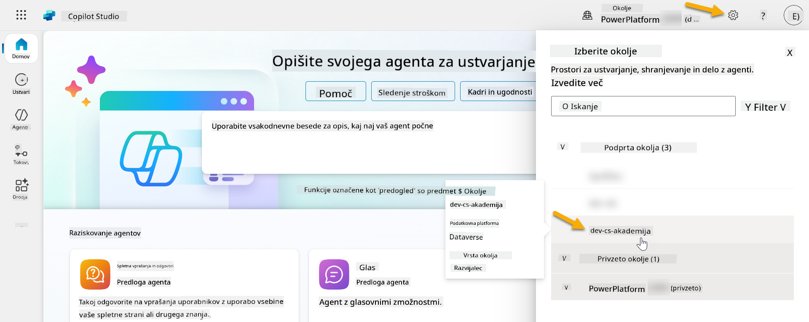

### 4.1 Ustvarite založnika rešitve

1. Z uporabo istega okolja Copilot Studio, ki ste ga uporabili v prejšnji lekciji, izberite ikono **tri pike (. . .)** v meniju na levi strani v Copilot Studio. Izberite **Rešitve** pod naslovom **Raziskovanje**.

    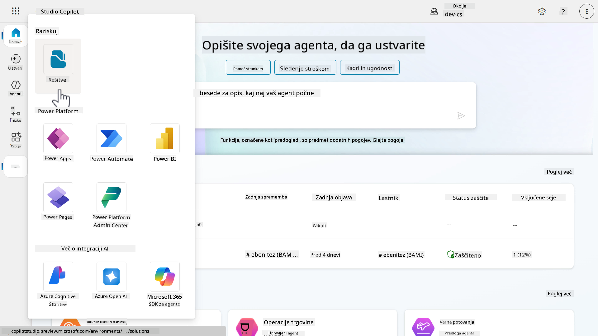

1. Naložil se bo **Raziskovalec rešitev** v Copilot Studio. Izberite **+ Nova rešitev**

    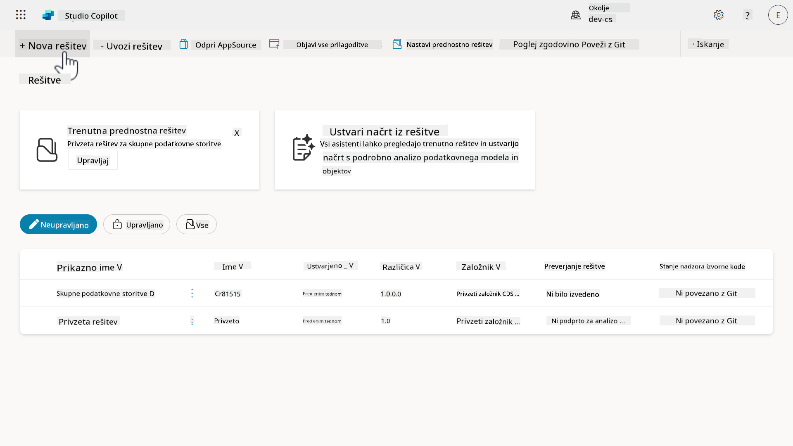

1. Pojavi se plošča **Nova rešitev**, kjer lahko določimo podrobnosti naše rešitve. Najprej moramo ustvariti novega založnika. Izberite **+ Nov založnik**.

    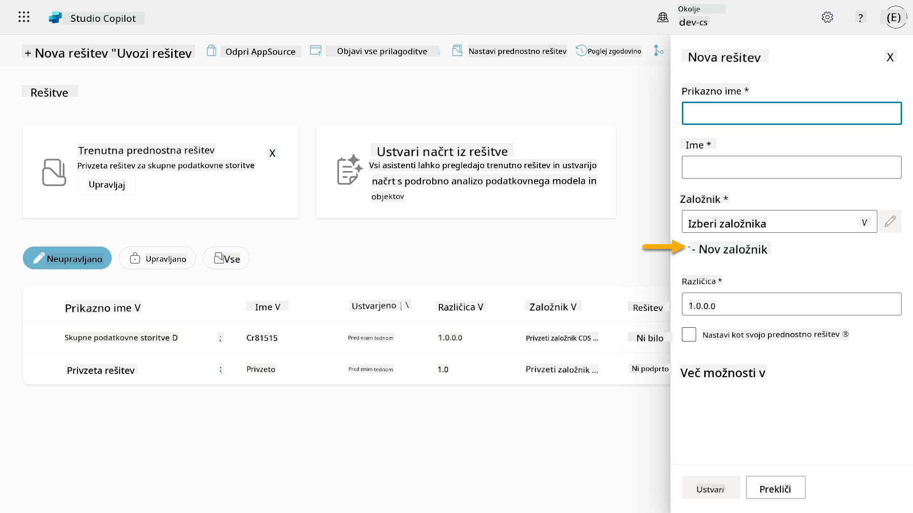  

1. Pojavi se zavihek **Lastnosti** plošče **Nov založnik** z obveznimi in neobveznimi polji, ki jih je treba izpolniti v zavihku **Lastnosti**. Tukaj lahko opišemo podrobnosti založnika, ki bo uporabljen kot oznaka ali znamka, ki identificira, kdo je ustvaril ali lastnik rešitve.

    | Lastnost    | Opis | Obvezno |
    | ---------- | ---------- | :----------: |
    | Prikazno ime | Prikazno ime za založnika | Da   |
    | Ime  | Edinstveno ime in shematsko ime za založnika  | Da    |
    | Opis   | Opiše namen rešitve    | Ne     |
    | Predpona    | Predpona založnika, ki bo uporabljena za na novo ustvarjene komponente   | Da      |
    | Predpona vrednosti izbire   | Ustvari številko na podlagi predpone založnika. Ta številka se uporablja, ko dodate možnosti izbire in zagotavlja indikator, katera rešitev je bila uporabljena za dodajanje možnosti.   | Da      |

    Kopirajte in prilepite naslednje kot **Prikazno ime**,

    ```text
    Contoso Solutions
    ```

    Kopirajte in prilepite naslednje kot **Ime**,

    ```text
    ContosoSolutions
    ```

    Kopirajte in prilepite naslednje kot **Opis**,

    ```text
    Copilot Studio Agent Academy
    ```

    Kopirajte in prilepite naslednje za **Predpono**,

    ```text
    cts
    ```

    Privzeto bo **Predpona vrednosti izbire** prikazala celo številsko vrednost. Posodobite to celo številsko vrednost na najbližjo tisočico. Na primer, na mojem posnetku zaslona spodaj je bila sprva `77074`. Posodobite to iz `77074` na `77000`.

    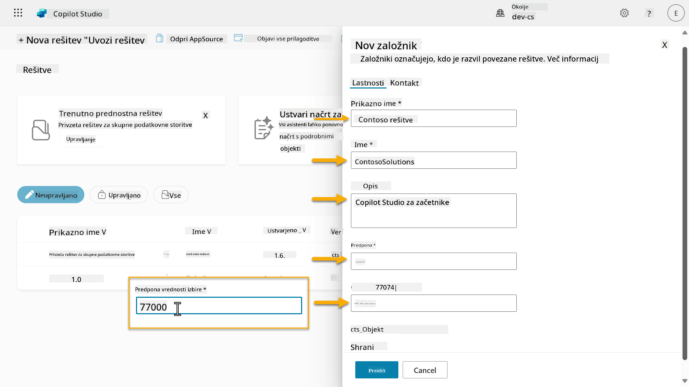  

1. Če želite zagotoviti kontaktne podatke za rešitev, izberite zavihek **Kontakt** in izpolnite prikazane stolpce.

    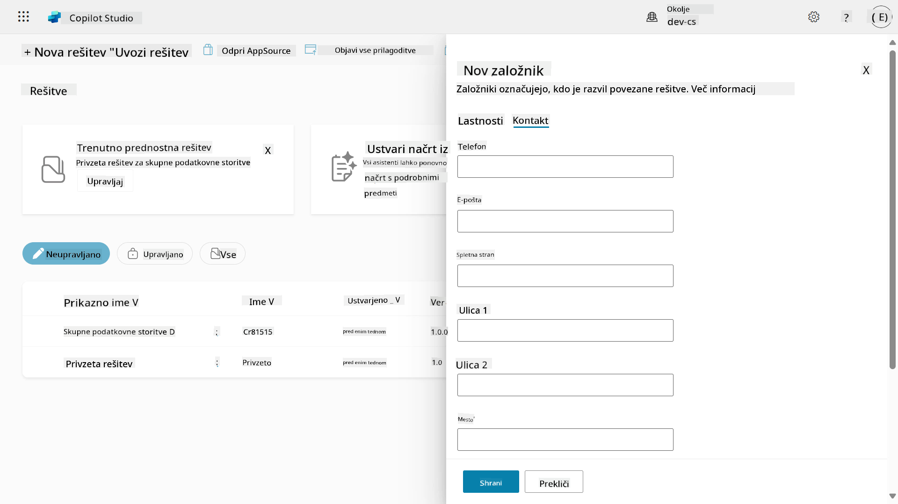

1. Izberite zavihek **Lastnosti** in izberite **Shrani**, da ustvarite založnika.

    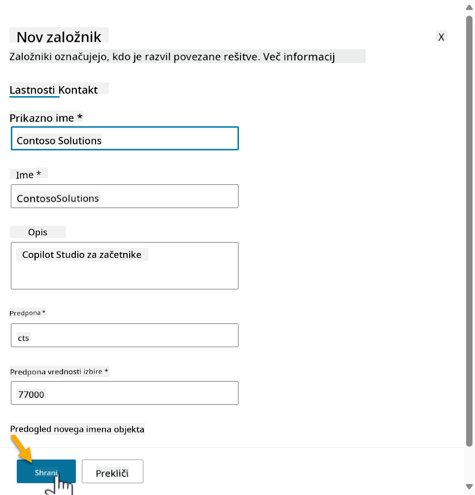
1. Pano za novega založnika se bo zaprla in vrnili se boste na pano **Nova rešitev**, kjer bo izbran na novo ustvarjeni založnik.

    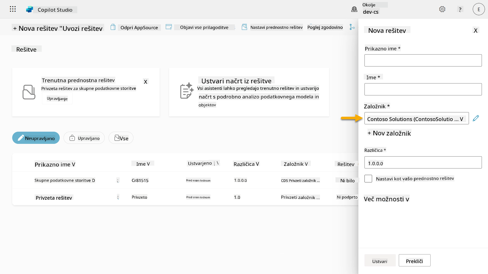  

Odlično, ustvarili ste založnika za rešitev! 🙌🏻 Zdaj se bomo naučili, kako ustvariti novo prilagojeno rešitev.

### 4.2 Ustvarite novo rešitev

1. Zdaj, ko smo ustvarili naše rešitve, lahko izpolnimo preostali del obrazca v panu **Nova rešitev**.

    Kopirajte in prilepite naslednje kot **Prikazno ime**,

    ```text
    Contoso Helpdesk Agent
    ```

    Kopirajte in prilepite naslednje kot **Ime**,

    ```text
    ContosoHelpdeskAgent
    ```

    Ker ustvarjamo novo rešitev, bo [**Številka različice**](https://learn.microsoft.com/power-apps/maker/data-platform/update-solutions#understanding-version-numbers-for-updates/?WT.mc_id=power-172615-ebenitez) privzeto `1.0.0.0`.

    Označite polje **Nastavi kot vašo prednostno rešitev**.

      

1. Razširite **Več možnosti**, da si ogledate dodatne podrobnosti, ki jih je mogoče zagotoviti v rešitvi.

    

1. Videli boste naslednje:

    - **Nameščeno na** - datum, ko je bila rešitev nameščena.

    - **Konfiguracijska stran** - razvijalci nastavijo HTML spletni vir, da pomagajo uporabnikom pri interakciji z njihovo aplikacijo, agentom ali orodjem, kjer se bo prikazal kot spletna stran v razdelku Informacije z navodili ali gumbi. Večinoma se uporablja pri podjetjih ali razvijalcih, ki gradijo in delijo rešitve z drugimi.

    - **Opis** - opisuje rešitev ali splošni opis konfiguracijske strani.

    Te bomo pustili prazne za to delavnico.

    Izberite **Ustvari**.

    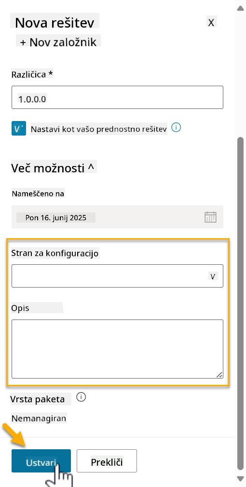

1. Rešitev za Contoso Helpdesk Agent je zdaj ustvarjena. Ne bo imela nobenih komponent, dokler ne ustvarimo agenta v Copilot Studio.

    Izberite ikono **puščica nazaj**, da se vrnete v Raziskovalec rešitev.

    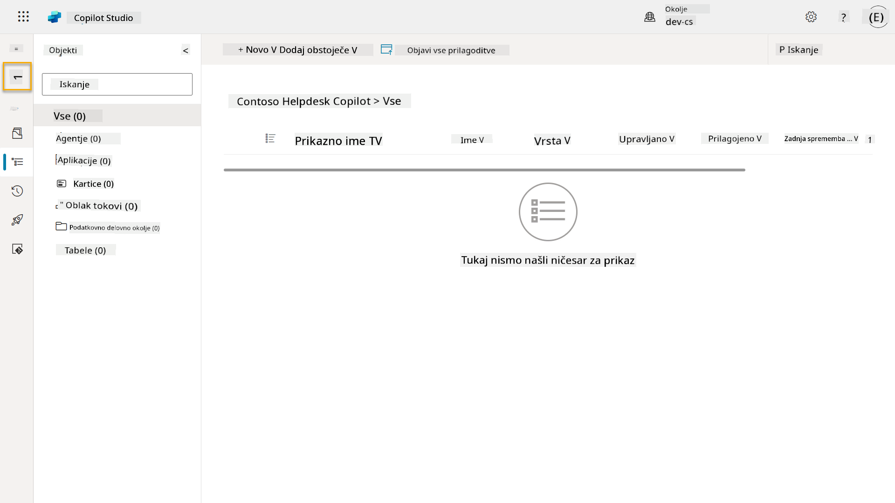

1. Opazite, kako se Contoso Helpdesk Agent zdaj prikazuje kot **Trenutna prednostna rešitev**, saj smo prej označili polje **Nastavi kot vašo prednostno rešitev**.

    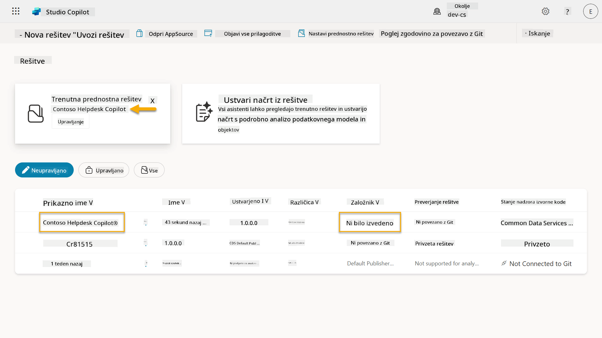

## ✅ Misija zaključena

Čestitke! 👏🏻 Ustvarili ste založnika in ga uporabili v vaši na novo ustvarjeni rešitvi za gradnjo vašega agenta!

Odlično opravljeno, ustvarjalec agentov. Urejen digitalni odtis je prvi korak k operativnosti na velikem obsegu. Zdaj imate orodja in miselnost za trajnostni razvoj agentov, pripravljenih za podjetja.

To je konec **Delavnice 04 - Ustvarjanje rešitve**, izberite spodnjo povezavo za prehod na naslednjo lekcijo. Rešitev, ustvarjena v tej delavnici, bo uporabljena v laboratoriju naslednje lekcije.

⏭️ [Pojdite na lekcijo **Hitro začnite z vnaprej pripravljenimi agenti**](../05-using-prebuilt-agents/README.md)

## 📚 Taktični viri

🔗 [Ustvarite rešitev](https://learn.microsoft.com/power-apps/maker/data-platform/create-solution/?WT.mc_id=power-172615-ebenitez)

🔗 [Ustvarjanje in upravljanje rešitev v Copilot Studio](https://learn.microsoft.com/microsoft-copilot-studio/authoring-solutions-overview/?WT.mc_id=power-172615-ebenitez)

🔗 [Deljenje agentov z drugimi uporabniki](https://learn.microsoft.com/microsoft-copilot-studio/admin-share-bots/?WT.mc_id=power-172615-ebenitez)

🔗 [Povzetek razpoložljivih virov za vnaprej določene varnostne vloge](https://learn.microsoft.com/power-platform/admin/database-security#summary-of-resources-available-to-predefined-security-roles/?WT.mc_id=power-172615-ebenitez)

🔗 [Nadgradnja ali posodobitev rešitve](https://learn.microsoft.com/power-apps/maker/data-platform/update-solutions/?WT.mc_id=power-172615-ebenitez)

🔗 [Pregled cevovodov v Power Platform](https://learn.microsoft.com/power-platform/alm/pipelines/?WT.mc_id=power-172615-ebenitez)

🔗 [Pregled integracije Git v Power Platform](https://learn.microsoft.com/power-platform/alm/git-integration/overview/?WT.mc_id=power-172615-ebenitez)


---

**Omejitev odgovornosti**:  
Ta dokument je bil preveden z uporabo storitve za prevajanje AI [Co-op Translator](https://github.com/Azure/co-op-translator). Čeprav si prizadevamo za natančnost, vas prosimo, da upoštevate, da lahko avtomatizirani prevodi vsebujejo napake ali netočnosti. Izvirni dokument v njegovem maternem jeziku je treba obravnavati kot avtoritativni vir. Za ključne informacije priporočamo profesionalni človeški prevod. Ne prevzemamo odgovornosti za morebitne nesporazume ali napačne razlage, ki izhajajo iz uporabe tega prevoda.